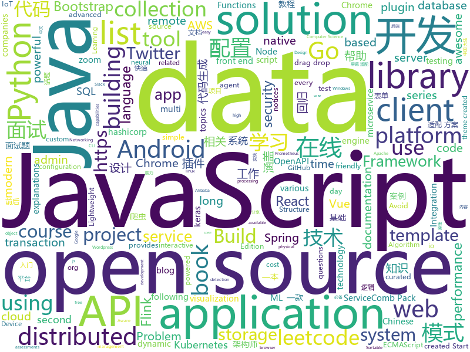

# 2019-11-21
See what the GitHub community is most excited about today.

## python
* [HackingNeuralNetworks](https://github.com/Kayzaks/HackingNeuralNetworks)(**309 stars today**): A small course on exploiting and defending neural networks
* [Python](https://github.com/TheAlgorithms/Python)(**100 stars today**): All Algorithms implemented in Python
* [ansible](https://github.com/ansible/ansible)(**28 stars today**): Ansible is a radically simple IT automation platform that makes your applications and systems easier to deploy. Avoid writing scripts or custom code to deploy and update your applications — automate in a language that approaches plain English, using SSH, with no agents to install on remote systems. https://docs.ansible.com/ansible/
* [streamlit](https://github.com/streamlit/streamlit)(**58 stars today**): Streamlit — The fastest way to build custom ML tools
* [hue](https://github.com/cloudera/hue)(**8 stars today**): Open source SQL Query Assistant for Databases/Warehouses.
* [wait-for-it](https://github.com/vishnubob/wait-for-it)(**7 stars today**): Pure bash script to test and wait on the availability of a TCP host and port
* [django-rest-framework](https://github.com/encode/django-rest-framework)(**21 stars today**): Web APIs for Django.🎸
* [airflow](https://github.com/apache/airflow)(**10 stars today**): Apache Airflow
* [zulip](https://github.com/zulip/zulip)(**6 stars today**): Zulip server - powerful open source team chat
* [elasticsearch-dsl-py](https://github.com/elastic/elasticsearch-dsl-py)(**3 stars today**): High level Python client for Elasticsearch
* [bert4keras](https://github.com/bojone/bert4keras)(**9 stars today**): light reimplement of bert for keras
* [ChromeAppHeroes](https://github.com/zhaoolee/ChromeAppHeroes)(**112 stars today**): 🌈谷粒-Chrome插件英雄榜, 为优秀的Chrome插件写一本中文说明书, 让Chrome插件英雄们造福人类~ ChromePluginHeroes, Write a Chinese manual for the excellent Chrome plugin, let the Chrome plugin heroes benefit the human~
* [Mask_RCNN](https://github.com/matterport/Mask_RCNN)(**20 stars today**): Mask R-CNN for object detection and instance segmentation on Keras and TensorFlow
* [SickChill](https://github.com/SickChill/SickChill)(**8 stars today**): Less rage, more chill.
* [spaCy](https://github.com/explosion/spaCy)(**12 stars today**): 💫Industrial-strength Natural Language Processing (NLP) with Python and Cython
* [100-Days-Of-ML-Code](https://github.com/Avik-Jain/100-Days-Of-ML-Code)(**12 stars today**): 100 Days of ML Coding
* [adtk](https://github.com/arundo/adtk)(**35 stars today**): A Python toolkit for unsupervised anomaly detection in time series
* [kafka-python](https://github.com/dpkp/kafka-python)(**4 stars today**): Python client for Apache Kafka
* [integrations-core](https://github.com/DataDog/integrations-core)(**0 stars today**): Core integrations of the Datadog Agent
* [compose](https://github.com/docker/compose)(**15 stars today**): Define and run multi-container applications with Docker
* [rsh](https://github.com/mzfr/rsh)(**13 stars today**): generate reverse shell from CLI for linux and Windows.
* [twint](https://github.com/twintproject/twint)(**14 stars today**): An advanced Twitter scraping & OSINT tool written in Python that doesn't use Twitter's API, allowing you to scrape a user's followers, following, Tweets and more while evading most API limitations.
* [meson](https://github.com/mesonbuild/meson)(**0 stars today**): The Meson Build System
* [pandas](https://github.com/pandas-dev/pandas)(**19 stars today**): Flexible and powerful data analysis / manipulation library for Python, providing labeled data structures similar to R data.frame objects, statistical functions, and much more
* [odoo](https://github.com/odoo/odoo)(**14 stars today**): Odoo. Open Source Apps To Grow Your Business.

## java
* [JavaGuide](https://github.com/Snailclimb/JavaGuide)(**227 stars today**): 【Java学习+面试指南】 一份涵盖大部分Java程序员所需要掌握的核心知识。
* [flink-learning](https://github.com/zhisheng17/flink-learning)(**26 stars today**): flink learning blog. http://www.54tianzhisheng.cn 含 Flink 入门、概念、原理、实战、性能调优、源码解析等内容。涉及 Flink Connector、Metrics、Library、DataStream API、Table API & SQL 等内容的学习案例，还有 Flink 落地应用的大型项目案例分享。
* [CS-Notes](https://github.com/CyC2018/CS-Notes)(**100 stars today**): 📚技术面试必备基础知识、Leetcode、Java、C++、Python、后端面试、计算机操作系统、计算机网络、系统设计
* [thingsboard](https://github.com/thingsboard/thingsboard)(**7 stars today**): Open-source IoT Platform - Device management, data collection, processing and visualization.
* [jeecg-boot](https://github.com/zhangdaiscott/jeecg-boot)(**35 stars today**): 一款基于代码生成器的JAVA快速开发平台，开源界“小普元”超越传统商业企业级开发平台！采用前后端分离架构：SpringBoot 2.x，Ant Design&Vue，Mybatis-plus，Shiro，JWT。强大的代码生成器让前后端代码一键生成，无需写任何代码! 引领新的开发模式(OnlineCoding模式-> 代码生成器模式-> 手工MERGE智能开发)，帮助Java项目解决70%的重复工作，让开发更多关注业务逻辑。既能快速提高开发效率，帮助公司节省成本，同时又不失灵活性。JeecgBoot还独创在线开发模式（No代码）：在线表单配置（表单设计器）、移动配置能力、在线工作流配置（流程设计器）、在线报表配置、在线图表配置、插件能力（可插拔）等等
* [retrofit](https://github.com/square/retrofit)(**42 stars today**): Type-safe HTTP client for Android and Java by Square, Inc.
* [spring-boot](https://github.com/spring-projects/spring-boot)(**38 stars today**): Spring Boot
* [cucumber](https://github.com/cucumber/cucumber)(**1 stars today**): Cucumber monorepo - building blocks for Cucumber in various languages
* [dropwizard](https://github.com/dropwizard/dropwizard)(**2 stars today**): A damn simple library for building production-ready RESTful web services.
* [spring-framework](https://github.com/spring-projects/spring-framework)(**25 stars today**): Spring Framework
* [Jetpack-MVVM-Best-Practice](https://github.com/KunMinX/Jetpack-MVVM-Best-Practice)(**52 stars today**): 是 难得一见 的 Jetpack MVVM 最佳实践！在 蕴繁于简 的代码中，对 视图控制器 乃至 标准化开发模式 形成正确、深入的理解！
* [apollo-android](https://github.com/apollographql/apollo-android)(**35 stars today**): 📟A strongly-typed, caching GraphQL client for Android and the JVM
* [JCSprout](https://github.com/crossoverJie/JCSprout)(**13 stars today**): 👨‍🎓Java Core Sprout : basic, concurrent, algorithm
* [servicecomb-pack](https://github.com/apache/servicecomb-pack)(**115 stars today**): Apache ServiceComb Pack is an eventually data consistency solution for micro-service applications. ServiceComb Pack currently provides TCC and Saga distributed transaction co-ordination solutions by using Alpha as a transaction coordinator and Omega as an transaction agent .
* [Rainbow-Bridge](https://github.com/zhkchi/Rainbow-Bridge)(**2 stars today**): 彩虹桥
* [fullstack-tutorial](https://github.com/frank-lam/fullstack-tutorial)(**23 stars today**): 🚀fullstack tutorial 2019，后台技术栈/架构师之路/全栈开发社区，春招/秋招/校招/面试
* [halo](https://github.com/halo-dev/halo)(**67 stars today**): ✍ Halo 一款现代化的个人独立博客系统
* [TubeMQ](https://github.com/Tencent/TubeMQ)(**50 stars today**): TubeMQ focuses on high-performance storage and transmission of massive data in big data scenarios
* [AndroidAutoSize](https://github.com/JessYanCoding/AndroidAutoSize)(**20 stars today**): 🔥A low-cost Android screen adaptation solution (今日头条屏幕适配方案终极版，一个极低成本的 Android 屏幕适配方案).
* [pentaho-kettle](https://github.com/pentaho/pentaho-kettle)(**10 stars today**): Pentaho Data Integration ( ETL ) a.k.a Kettle
* [server](https://github.com/wildfirechat/server)(**11 stars today**): 即时通讯(IM)系统
* [ShedLock](https://github.com/lukas-krecan/ShedLock)(**12 stars today**): Distributed lock for your scheduled tasks
* [aws-cf-templates](https://github.com/widdix/aws-cf-templates)(**1 stars today**): Free Templates for AWS CloudFormation
* [spring-cloud-alibaba](https://github.com/alibaba/spring-cloud-alibaba)(**18 stars today**): Spring Cloud Alibaba provides a one-stop solution for application development for the distributed solutions of Alibaba middleware.
* [nacos](https://github.com/alibaba/nacos)(**24 stars today**): an easy-to-use dynamic service discovery, configuration and service management platform for building cloud native applications.

## unknown
* [tamagotchiTemp](https://github.com/graceavery/tamagotchiTemp)(**76 stars today**): 
* [physical-docs](https://github.com/trustedsec/physical-docs)(**55 stars today**): This is a collection of legal wording and documentation used for physical security assessments. The goal is to hopefully allow this as a template for other companies to use and to protect themselves when conducting physical security assessments.
* [JavaFamily](https://github.com/AobingJava/JavaFamily)(**288 stars today**): 【 互联网 Java 工程师大厂面试+学习指南】，进阶知识完全扫盲：涵盖高并发、分布式、高可用、微服务等领域知识，作者风格幽默，看起来津津有味，把学习当做一种乐趣，何乐而不为，后端同学必看。
* [resources-of-learning](https://github.com/tagnja/resources-of-learning)(**4 stars today**): Documentations, books, courses, git repositories and so on.
* [Cookbook](https://github.com/andkret/Cookbook)(**8 stars today**): The Data Engineering Cookbook
* [iCloudBypassCA](https://github.com/crazymind90/iCloudBypassCA)(**26 stars today**): 
* [gov-takedowns](https://github.com/github/gov-takedowns)(**12 stars today**): Text of government takedown notices as received. GitHub does not endorse or adopt any assertion contained in the following notices.
* [aws-cloudformation-coverage-roadmap](https://github.com/aws-cloudformation/aws-cloudformation-coverage-roadmap)(**6 stars today**): The AWS CloudFormation Public Coverage Roadmap
* [LearningNotes](https://github.com/francistao/LearningNotes)(**9 stars today**): Enjoy Learning.
* [javascript-questions](https://github.com/lydiahallie/javascript-questions)(**18 stars today**): A long list of (advanced) JavaScript questions, and their explanations✨
* [You-dont-need-loops](https://github.com/you-dont-need/You-dont-need-loops)(**9 stars today**): Avoid The One-off Problem, Infinite Loops, Statefulness and Hidden intent.
* [Android-Daily-Interview](https://github.com/Moosphan/Android-Daily-Interview)(**7 stars today**): 📌每工作日更新一道 Android 面试题，小聚成河，大聚成江，共勉之～
* [CS-Books](https://github.com/huihut/CS-Books)(**20 stars today**): 📚Computer Science Books 计算机技术类书籍 PDF
* [intellij-community](https://github.com/JetBrains/intellij-community)(**6 stars today**): IntelliJ IDEA Community Edition
* [gitignore](https://github.com/github/gitignore)(**56 stars today**): A collection of useful .gitignore templates
* [OpenAPI-Specification](https://github.com/OAI/OpenAPI-Specification)(**11 stars today**): The OpenAPI Specification Repository
* [architect-awesome](https://github.com/xingshaocheng/architect-awesome)(**31 stars today**): 后端架构师技术图谱
* [Awesome-Hacking](https://github.com/Hack-with-Github/Awesome-Hacking)(**30 stars today**): A collection of various awesome lists for hackers, pentesters and security researchers
* [leetcode](https://github.com/grandyang/leetcode)(**16 stars today**): Provide all my solutions and explanations in Chinese for all the Leetcode coding problems.
* [document-style-guide](https://github.com/ruanyf/document-style-guide)(**10 stars today**): 中文技术文档的写作规范
* [3y](https://github.com/ZhongFuCheng3y/3y)(**30 stars today**): 📓从Java基础、JavaWeb基础到常用的框架再到面试题都有完整的教程，几乎涵盖了Java后端必备的知识点
* [books](https://github.com/programthink/books)(**15 stars today**): 【编程随想】收藏的电子书清单（多个学科，含下载链接）
* [awesome-php](https://github.com/ziadoz/awesome-php)(**8 stars today**): A curated list of amazingly awesome PHP libraries, resources and shiny things.
* [you-dont-know-js-ru](https://github.com/azat-io/you-dont-know-js-ru)(**9 stars today**): 📚Russian translation of "You Don't Know JS" book series
* [You-Dont-Know-JS](https://github.com/getify/You-Dont-Know-JS)(**58 stars today**): A book series on JavaScript. @YDKJS on twitter.

## javascript
* [leetcode](https://github.com/azl397985856/leetcode)(**69 stars today**): LeetCode Solutions: A Record of My Problem Solving Journey.( leetcode题解，记录自己的leetcode解题之路。)
* [Sortable](https://github.com/SortableJS/Sortable)(**14 stars today**): Sortable — is a JavaScript library for reorderable drag-and-drop lists on modern browsers and touch devices. No jQuery required. Supports Meteor, AngularJS, React, Polymer, Vue, Ember, Knockout and any CSS library, e.g. Bootstrap.
* [react](https://github.com/facebook/react)(**78 stars today**): A declarative, efficient, and flexible JavaScript library for building user interfaces.
* [mapbox-gl-js](https://github.com/mapbox/mapbox-gl-js)(**6 stars today**): Interactive, thoroughly customizable maps in the browser, powered by vector tiles and WebGL
* [remote-jobs](https://github.com/remoteintech/remote-jobs)(**30 stars today**): A list of semi to fully remote-friendly companies in tech.
* [design-system](https://github.com/storybookjs/design-system)(**5 stars today**): 🗃Storybook Design System
* [react-native](https://github.com/facebook/react-native)(**41 stars today**): A framework for building native apps with React.
* [Vue.Draggable](https://github.com/SortableJS/Vue.Draggable)(**24 stars today**): Vue drag-and-drop component based on Sortable.js
* [openlayers](https://github.com/openlayers/openlayers)(**9 stars today**): OpenLayers
* [jest](https://github.com/facebook/jest)(**23 stars today**): Delightful JavaScript Testing.
* [es6tutorial](https://github.com/ruanyf/es6tutorial)(**11 stars today**): 《ECMAScript 6入门》是一本开源的 JavaScript 语言教程，全面介绍 ECMAScript 6 新增的语法特性。
* [joplin](https://github.com/laurent22/joplin)(**62 stars today**): Joplin - an open source note taking and to-do application with synchronization capabilities for Windows, macOS, Linux, Android and iOS. Forum: https://discourse.joplinapp.org/
* [lerna](https://github.com/lerna/lerna)(**21 stars today**): 🐉A tool for managing JavaScript projects with multiple packages.
* [next.js](https://github.com/zeit/next.js)(**40 stars today**): The React Framework
* [three.js](https://github.com/mrdoob/three.js)(**34 stars today**): JavaScript 3D library.
* [incubator-echarts](https://github.com/apache/incubator-echarts)(**21 stars today**): A powerful, interactive charting and visualization library for browser
* [lodash](https://github.com/lodash/lodash)(**25 stars today**): A modern JavaScript utility library delivering modularity, performance, & extras.
* [generator-jhipster](https://github.com/jhipster/generator-jhipster)(**18 stars today**): Open Source application platform for creating Spring Boot + Angular/React projects in seconds!
* [sequelize](https://github.com/sequelize/sequelize)(**11 stars today**): An easy-to-use multi SQL dialect ORM for Node.js
* [react-map-gl](https://github.com/uber/react-map-gl)(**3 stars today**): React friendly API wrapper around MapboxGL JS
* [wp-calypso](https://github.com/Automattic/wp-calypso)(**3 stars today**): The JavaScript and API powered WordPress.com
* [clean-code-javascript](https://github.com/ryanmcdermott/clean-code-javascript)(**36 stars today**): 🛁Clean Code concepts adapted for JavaScript
* [strapi](https://github.com/strapi/strapi)(**55 stars today**): 🚀Open source Node.js Headless CMS to easily build customisable APIs
* [serverless](https://github.com/serverless/serverless)(**17 stars today**): Serverless Framework – Build web, mobile and IoT applications with serverless architectures using AWS Lambda, Azure Functions, Google CloudFunctions & more! –
* [freeCodeCamp](https://github.com/freeCodeCamp/freeCodeCamp)(**52 stars today**): The https://www.freeCodeCamp.org open source codebase and curriculum. Learn to code for free together with millions of people.

## html
* [Front-end-Developer-Interview-Questions](https://github.com/h5bp/Front-end-Developer-Interview-Questions)(**24 stars today**): A list of helpful front-end related questions you can use to interview potential candidates, test yourself or completely ignore.
* [baremetrics-v1](https://github.com/Baremetrics/baremetrics-v1)(**4 stars today**): This was the very first version of Baremetrics from 2013. It's published here for posterity.
* [qcloud-documents](https://github.com/tencentyun/qcloud-documents)(**1 stars today**): 腾讯云官方文档 使用Markdown自动构建
* [Machine-Learning](https://github.com/Jack-Cherish/Machine-Learning)(**3 stars today**): ⚡️机器学习实战（Python3）：kNN、决策树、贝叶斯、逻辑回归、SVM、线性回归、树回归
* [Crawler_Illegal_Cases_In_China](https://github.com/HiddenStrawberry/Crawler_Illegal_Cases_In_China)(**103 stars today**): Collection of China illegal cases about web crawler 本项目用来整理所有中国大陆爬虫开发者涉诉与违规相关的新闻、资料与法律法规。致力于帮助在中国大陆工作的爬虫行业从业者了解我国相关法律，避免触碰数据合规红线。
* [cypress-example-kitchensink](https://github.com/cypress-io/cypress-example-kitchensink)(**1 stars today**): This is an example app used to showcase Cypress.io testing.
* [startbootstrap-resume](https://github.com/BlackrockDigital/startbootstrap-resume)(**1 stars today**): A Bootstrap 4 resume/CV theme created by Start Bootstrap
* [swagger-codegen](https://github.com/swagger-api/swagger-codegen)(**9 stars today**): swagger-codegen contains a template-driven engine to generate documentation, API clients and server stubs in different languages by parsing your OpenAPI / Swagger definition.
* [REKCARC-TSC-UHT](https://github.com/PKUanonym/REKCARC-TSC-UHT)(**14 stars today**): 清华大学计算机系课程攻略 Guidance for courses in Department of Computer Science and Technology, Tsinghua University
* [seleniumhq.github.io](https://github.com/SeleniumHQ/seleniumhq.github.io)(**0 stars today**): Official Selenium website and documentation
* [styleguide](https://github.com/google/styleguide)(**15 stars today**): Style guides for Google-originated open-source projects
* [blaze](https://github.com/blenderskool/blaze)(**18 stars today**): ⚡ File sharing progressive web app built using WebRTC and WebSockets
* [nndl.github.io](https://github.com/nndl/nndl.github.io)(**17 stars today**): 《神经网络与深度学习》 邱锡鹏著 Neural Network and Deep Learning
* [startbootstrap-sb-admin-2](https://github.com/BlackrockDigital/startbootstrap-sb-admin-2)(**4 stars today**): A free, open source, Bootstrap admin theme created by Start Bootstrap
* [ng-alain](https://github.com/ng-alain/ng-alain)(**2 stars today**): NG-ZORRO admin panel front-end framework (netlify mirror https://netlify.ng-alain.com/)
* [shellphish](https://github.com/thelinuxchoice/shellphish)(**0 stars today**): Phishing Tool for 18 social media: Instagram, Facebook, Snapchat, Github, Twitter, Yahoo, Protonmail, Spotify, Netflix, Linkedin, Wordpress, Origin, Steam, Microsoft, InstaFollowers, Gitlab, Pinterest
* [OpenClash](https://github.com/vernesong/OpenClash)(**5 stars today**): A Clash Client For OpenWrt
* [stisla](https://github.com/stisla/stisla)(**8 stars today**): Free Bootstrap Admin Template
* [dragon-book-exercise-answers](https://github.com/fool2fish/dragon-book-exercise-answers)(**3 stars today**): Compilers Principles, Techniques, & Tools (purple dragon book) second edition exercise answers. 编译原理（紫龙书）第2版习题答案。
* [varharrie.github.io](https://github.com/varHarrie/varharrie.github.io)(**3 stars today**): 📘Personal blog.
* [rellax](https://github.com/dixonandmoe/rellax)(**3 stars today**): Lightweight, vanilla javascript parallax library
* [WebFundamentals](https://github.com/google/WebFundamentals)(**2 stars today**): Best practices for modern web development
* [pcc_2e](https://github.com/ehmatthes/pcc_2e)(**1 stars today**): Online resources for Python Crash Course (Second Edition), from No Starch Press
* [awesome-competitive-programming](https://github.com/lnishan/awesome-competitive-programming)(**7 stars today**): 💎A curated list of awesome Competitive Programming, Algorithm and Data Structure resources
* [ecma262](https://github.com/tc39/ecma262)(**7 stars today**): Status, process, and documents for ECMA-262

## go
* [bfe](https://github.com/baidu/bfe)(**435 stars today**): Open-source layer 7 load balancer derived from proprietary Baidu FrontEnd
* [external-storage](https://github.com/kubernetes-incubator/external-storage)(**3 stars today**): External storage plugins, provisioners, and helper libraries
* [consul](https://github.com/hashicorp/consul)(**12 stars today**): Consul is a distributed, highly available, and data center aware solution to connect and configure applications across dynamic, distributed infrastructure.
* [night-reading-go](https://github.com/developer-learning/night-reading-go)(**9 stars today**): Night-Reading-Go《Go 夜读》 > Share the related technical topics of Go every week through zoom online live broadcast, every day on the WeChat/Slack to communicate programming technology topics. 每周通过 zoom 在线直播的方式分享 Go 相关的技术话题，每天大家在微信/Slack 上及时沟通交流编程技术话题。
* [MailHog](https://github.com/mailhog/MailHog)(**13 stars today**): Web and API based SMTP testing
* [thanos](https://github.com/thanos-io/thanos)(**11 stars today**): Highly available Prometheus setup with long term storage capabilities. CNCF Sandbox project.
* [prototool](https://github.com/uber/prototool)(**7 stars today**): Your Swiss Army Knife for Protocol Buffers
* [minikube](https://github.com/kubernetes/minikube)(**15 stars today**): Run Kubernetes locally
* [hcl](https://github.com/hashicorp/hcl)(**2 stars today**): HCL is the HashiCorp configuration language.
* [opa](https://github.com/open-policy-agent/opa)(**14 stars today**): An open source, general-purpose policy engine.
* [go-micro](https://github.com/micro/go-micro)(**34 stars today**): A Go microservices development framework
* [eksctl](https://github.com/weaveworks/eksctl)(**4 stars today**): The official CLI for Amazon EKS
* [micro](https://github.com/micro/micro)(**93 stars today**): A microservice runtime environment
* [nats-server](https://github.com/nats-io/nats-server)(**5 stars today**): High-Performance server for NATS, the cloud native messaging system.
* [antrea](https://github.com/vmware-tanzu/antrea)(**20 stars today**): A Kubernetes networking solution based on Open vSwitch
* [sql-migrate](https://github.com/rubenv/sql-migrate)(**4 stars today**): SQL schema migration tool for Go.
* [prometheus](https://github.com/prometheus/prometheus)(**26 stars today**): The Prometheus monitoring system and time series database.
* [consul-template](https://github.com/hashicorp/consul-template)(**2 stars today**): Template rendering, notifier, and supervisor for @hashicorp Consul and Vault data.
* [userspace-vga2usb](https://github.com/benjojo/userspace-vga2usb)(**17 stars today**): A userspace driver implementation of the Epiphan VGA2USB LR
* [cilium](https://github.com/cilium/cilium)(**16 stars today**): API Aware Networking and Security using BPF and XDP
* [jaeger](https://github.com/jaegertracing/jaeger)(**16 stars today**): CNCF Jaeger, a Distributed Tracing Platform
* [beats](https://github.com/elastic/beats)(**9 stars today**): 🐠Beats - Lightweight shippers for Elasticsearch & Logstash
* [spikeSystem](https://github.com/GuoZhaoran/spikeSystem)(**93 stars today**): 
* [VictoriaMetrics](https://github.com/VictoriaMetrics/VictoriaMetrics)(**9 stars today**): VictoriaMetrics - high-performance, cost-effective and scalable time series database, long-term remote storage for Prometheus
* [client-go](https://github.com/kubernetes/client-go)(**9 stars today**): Go client for Kubernetes.

## WordCloud

