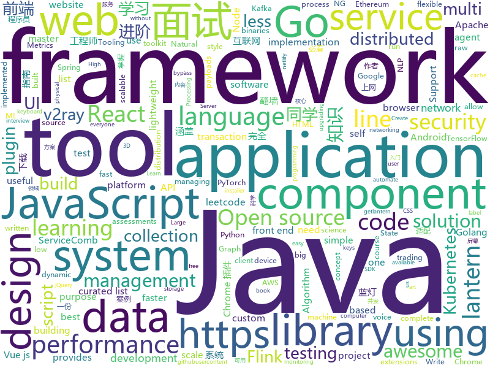

# 2019-11-22
See what the GitHub community is most excited about today.

## python
* [3d-ken-burns](https://github.com/sniklaus/3d-ken-burns)(**70 stars today**): an implementation of 3D Ken Burns Effect from a Single Image using PyTorch
* [Python](https://github.com/TheAlgorithms/Python)(**178 stars today**): All Algorithms implemented in Python
* [ChromeAppHeroes](https://github.com/zhaoolee/ChromeAppHeroes)(**40 stars today**): 🌈谷粒-Chrome插件英雄榜, 为优秀的Chrome插件写一本中文说明书, 让Chrome插件英雄们造福人类~ ChromePluginHeroes, Write a Chinese manual for the excellent Chrome plugin, let the Chrome plugin heroes benefit the human~
* [PayloadsAllTheThings](https://github.com/swisskyrepo/PayloadsAllTheThings)(**14 stars today**): A list of useful payloads and bypass for Web Application Security and Pentest/CTF
* [flair](https://github.com/zalandoresearch/flair)(**12 stars today**): A very simple framework for state-of-the-art Natural Language Processing (NLP)
* [mmdetection](https://github.com/open-mmlab/mmdetection)(**10 stars today**): Open MMLab Detection Toolbox and Benchmark
* [pytorch-lightning](https://github.com/williamFalcon/pytorch-lightning)(**13 stars today**): The lightweight PyTorch wrapper for ML researchers. Scale your models. Write less boilerplate
* [transformers](https://github.com/huggingface/transformers)(**61 stars today**): 🤗Transformers: State-of-the-art Natural Language Processing for TensorFlow 2.0 and PyTorch.
* [rasa](https://github.com/RasaHQ/rasa)(**10 stars today**): 💬Open source machine learning framework to automate text- and voice-based conversations: NLU, dialogue management, connect to Slack, Facebook, and more - Create chatbots and voice assistants
* [ansible](https://github.com/ansible/ansible)(**68 stars today**): Ansible is a radically simple IT automation platform that makes your applications and systems easier to deploy. Avoid writing scripts or custom code to deploy and update your applications — automate in a language that approaches plain English, using SSH, with no agents to install on remote systems. https://docs.ansible.com/ansible/
* [12306](https://github.com/testerSunshine/12306)(**29 stars today**): 12306智能刷票，订票
* [tlroadmap](https://github.com/tlbootcamp/tlroadmap)(**11 stars today**): 👩🏼‍💻👨🏻‍💻Карта навыков и модель развития тимлидов
* [HackingNeuralNetworks](https://github.com/Kayzaks/HackingNeuralNetworks)(**183 stars today**): A small course on exploiting and defending neural networks
* [jwt_tool](https://github.com/ticarpi/jwt_tool)(**52 stars today**): 🐍A toolkit for testing, tweaking and cracking JSON Web Tokens
* [gym](https://github.com/openai/gym)(**24 stars today**): A toolkit for developing and comparing reinforcement learning algorithms.
* [DialoGPT](https://github.com/microsoft/DialoGPT)(**17 stars today**): Large-scale pretraining for dialogue
* [awesome-machine-learning](https://github.com/josephmisiti/awesome-machine-learning)(**15 stars today**): A curated list of awesome Machine Learning frameworks, libraries and software.
* [bcc](https://github.com/iovisor/bcc)(**8 stars today**): BCC - Tools for BPF-based Linux IO analysis, networking, monitoring, and more
* [streamlit](https://github.com/streamlit/streamlit)(**49 stars today**): Streamlit — The fastest way to build custom ML tools
* [azure-cli](https://github.com/Azure/azure-cli)(**5 stars today**): Command-line tools for Azure.
* [wait-for-it](https://github.com/vishnubob/wait-for-it)(**10 stars today**): Pure bash script to test and wait on the availability of a TCP host and port
* [cleanlab](https://github.com/cgnorthcutt/cleanlab)(**8 stars today**): Finding label errors in datasets and learning with noisy labels.
* [yolov3-tf2](https://github.com/zzh8829/yolov3-tf2)(**16 stars today**): YoloV3 Implemented in Tensorflow 2.0
* [system-design-primer](https://github.com/donnemartin/system-design-primer)(**62 stars today**): Learn how to design large-scale systems. Prep for the system design interview. Includes Anki flashcards.
* [pygcn](https://github.com/tkipf/pygcn)(**9 stars today**): Graph Convolutional Networks in PyTorch

## java
* [univocity-trader](https://github.com/uniVocity/univocity-trader)(**32 stars today**): open-source trading framework for java, supports backtesting and live trading with exchanges
* [servicecomb-pack](https://github.com/apache/servicecomb-pack)(**21 stars today**): Apache ServiceComb Pack is an eventually data consistency solution for micro-service applications. ServiceComb Pack currently provides TCC and Saga distributed transaction co-ordination solutions by using Alpha as a transaction coordinator and Omega as an transaction agent .
* [CS-Notes](https://github.com/CyC2018/CS-Notes)(**162 stars today**): 📚技术面试必备基础知识、Leetcode、Java、C++、Python、后端面试、计算机操作系统、计算机网络、系统设计
* [flink-learning](https://github.com/zhisheng17/flink-learning)(**131 stars today**): flink learning blog. http://www.54tianzhisheng.cn 含 Flink 入门、概念、原理、实战、性能调优、源码解析等内容。涉及 Flink Connector、Metrics、Library、DataStream API、Table API & SQL 等内容的学习案例，还有 Flink 落地应用的大型项目案例分享。
* [BigData-Notes](https://github.com/heibaiying/BigData-Notes)(**21 stars today**): 大数据入门指南⭐️
* [JavaGuide](https://github.com/Snailclimb/JavaGuide)(**293 stars today**): 【Java学习+面试指南】 一份涵盖大部分Java程序员所需要掌握的核心知识。
* [halo](https://github.com/halo-dev/halo)(**79 stars today**): ✍ Halo 一款现代化的个人独立博客系统
* [servicecomb-java-chassis](https://github.com/apache/servicecomb-java-chassis)(**4 stars today**): ServiceComb Java Chassis is a Software Development Kit (SDK) for rapid development of microservices in Java, providing service registration, service discovery, dynamic routing, and service management features
* [material-components-android](https://github.com/material-components/material-components-android)(**18 stars today**): Modular and customizable Material Design UI components for Android
* [javafuzz](https://github.com/fuzzitdev/javafuzz)(**15 stars today**): coverage guided fuzz testing for java
* [TubeMQ](https://github.com/Tencent/TubeMQ)(**37 stars today**): TubeMQ focuses on high-performance storage and transmission of massive data in big data scenarios
* [calcite](https://github.com/apache/calcite)(**2 stars today**): Mirror of Apache Calcite
* [bazel](https://github.com/bazelbuild/bazel)(**27 stars today**): a fast, scalable, multi-language and extensible build system
* [advanced-java](https://github.com/doocs/advanced-java)(**55 stars today**): 😮互联网 Java 工程师进阶知识完全扫盲：涵盖高并发、分布式、高可用、微服务等领域知识，后端同学必看，前端同学也可学习
* [Jetpack-MVVM-Best-Practice](https://github.com/KunMinX/Jetpack-MVVM-Best-Practice)(**38 stars today**): 是 难得一见 的 Jetpack MVVM 最佳实践！在 蕴繁于简 的代码中，对 视图控制器 乃至 标准化开发模式 形成正确、深入的理解！
* [quarkus](https://github.com/quarkusio/quarkus)(**14 stars today**): Quarkus: Supersonic Subatomic Java.
* [skywalking](https://github.com/apache/skywalking)(**26 stars today**): APM, Application Performance Monitoring System
* [CoreNLP](https://github.com/stanfordnlp/CoreNLP)(**7 stars today**): Stanford CoreNLP: A Java suite of core NLP tools.
* [presto](https://github.com/prestodb/presto)(**6 stars today**): The official home of the Presto distributed SQL query engine for big data
* [retrofit](https://github.com/square/retrofit)(**12 stars today**): Type-safe HTTP client for Android and Java by Square, Inc.
* [graal](https://github.com/oracle/graal)(**33 stars today**): GraalVM: Run Programs Faster Anywhere🚀
* [allure2](https://github.com/allure-framework/allure2)(**4 stars today**): Allure Framework is a flexible lightweight multi-language test reporting tool. It provides clear graphical reports and allows everyone involved in the development process extract maximum of information from everyday testing process.
* [AndroidAutoSize](https://github.com/JessYanCoding/AndroidAutoSize)(**16 stars today**): 🔥A low-cost Android screen adaptation solution (今日头条屏幕适配方案终极版，一个极低成本的 Android 屏幕适配方案).
* [ysoserial](https://github.com/frohoff/ysoserial)(**3 stars today**): A proof-of-concept tool for generating payloads that exploit unsafe Java object deserialization.
* [tutorials](https://github.com/eugenp/tutorials)(**20 stars today**): The "REST With Spring" Course:

## unknown
* [JavaFamily](https://github.com/AobingJava/JavaFamily)(**281 stars today**): 【互联网一线大厂Java 工程师面试+学习指南】进阶知识完全扫盲：涵盖高并发、分布式、高可用、微服务等领域知识，作者风格幽默，看起来津津有味，把学习当做一种乐趣，何乐而不为，后端同学必看，前端同学我保证你也看得懂，看不懂你加我微信骂我渣男就好了。
* [coding-interview-university](https://github.com/jwasham/coding-interview-university)(**223 stars today**): A complete computer science study plan to become a software engineer.
* [new-pac](https://github.com/Alvin9999/new-pac)(**68 stars today**): 科学/自由上网，免费ss/ssr/v2ray/goflyway账号，搭建教程
* [physical-docs](https://github.com/trustedsec/physical-docs)(**16 stars today**): This is a collection of legal wording and documentation used for physical security assessments. The goal is to hopefully allow this as a template for other companies to use and to protect themselves when conducting physical security assessments.
* [Best-websites-a-programmer-should-visit](https://github.com/sdmg15/Best-websites-a-programmer-should-visit)(**11 stars today**): 🔗Some useful websites for programmers.
* [react-typescript-cheatsheet](https://github.com/typescript-cheatsheets/react-typescript-cheatsheet)(**24 stars today**): Cheatsheets for experienced React developers getting started with TypeScript
* [lantern](https://github.com/getlantern/lantern)(**10 stars today**): 蓝灯Windows下载 https://raw.githubusercontent.com/getlantern/lantern-binaries/master/lantern-installer.exe 蓝灯安卓下载 https://raw.githubusercontent.com/getlantern/lantern-binaries/master/lantern-installer.apk
* [blog](https://github.com/sorrycc/blog)(**10 stars today**): 💡
* [iCloudBypassCA](https://github.com/crazymind90/iCloudBypassCA)(**5 stars today**): 
* [okd](https://github.com/openshift/okd)(**4 stars today**): The self-managing, auto-upgrading, Kubernetes distribution for everyone
* [English-level-up-tips-for-Chinese](https://github.com/byoungd/English-level-up-tips-for-Chinese)(**10 stars today**): 可能是让你受益匪浅的英语进阶指南
* [awesome-eventstorming](https://github.com/mariuszgil/awesome-eventstorming)(**1 stars today**): Awesome EventStorming
* [Index](https://github.com/HowProgrammingWorks/Index)(**0 stars today**): Repositories Index
* [computer-science](https://github.com/ossu/computer-science)(**32 stars today**): 🎓Path to a free self-taught education in Computer Science!
* [Miles](https://github.com/ugvf2009/Miles)(**2 stars today**): 二爷翻墙，专注翻墙30年，但没有掌握核心科技^_^
* [download](https://github.com/getlantern/download)(**41 stars today**): Lantern官方版本下载 蓝灯 翻墙 科学上网 外网 加速器 梯子 路由
* [You-Dont-Know-JS](https://github.com/getify/You-Dont-Know-JS)(**85 stars today**): A book series on JavaScript. @YDKJS on twitter.
* [awesome-design-systems](https://github.com/alexpate/awesome-design-systems)(**27 stars today**): 💅🏻⚒A collection of awesome design systems
* [crkbd](https://github.com/foostan/crkbd)(**4 stars today**): Corne keyboard, a split keyboard with 3x6 column staggered keys and 3 thumb keys.
* [awesome-grpc](https://github.com/grpc-ecosystem/awesome-grpc)(**10 stars today**): A curated list of useful resources for gRPC
* [the-art-of-command-line](https://github.com/jlevy/the-art-of-command-line)(**27 stars today**): Master the command line, in one page
* [awsome-domain-adaptation](https://github.com/zhaoxin94/awsome-domain-adaptation)(**7 stars today**): A collection of AWESOME things about domian adaptation
* [bbr](https://github.com/google/bbr)(**4 stars today**): 
* [Specs](https://github.com/CocoaPods/Specs)(**2 stars today**): The CocoaPods Master Repo
* [web-interview](https://github.com/yisainan/web-interview)(**6 stars today**): 我是「齐丶先丶森」，公众号「前端面试秘籍」作者，收集整理全网面试题及面试技巧，旨在帮助前端工程师们找到一份好工作！

## javascript
* [jquery](https://github.com/jquery/jquery)(**19 stars today**): jQuery JavaScript Library
* [umi](https://github.com/umijs/umi)(**27 stars today**): 🌋Pluggable enterprise-level react application framework.
* [Sortable](https://github.com/SortableJS/Sortable)(**35 stars today**): Sortable — is a JavaScript library for reorderable drag-and-drop lists on modern browsers and touch devices. No jQuery required. Supports Meteor, AngularJS, React, Polymer, Vue, Ember, Knockout and any CSS library, e.g. Bootstrap.
* [clean-code-javascript](https://github.com/ryanmcdermott/clean-code-javascript)(**37 stars today**): 🛁Clean Code concepts adapted for JavaScript
* [vue](https://github.com/vuejs/vue)(**109 stars today**): 🖖Vue.js is a progressive, incrementally-adoptable JavaScript framework for building UI on the web.
* [freeCodeCamp](https://github.com/freeCodeCamp/freeCodeCamp)(**68 stars today**): The https://www.freeCodeCamp.org open source codebase and curriculum. Learn to code for free together with millions of people.
* [cypress](https://github.com/cypress-io/cypress)(**30 stars today**): Fast, easy and reliable testing for anything that runs in a browser.
* [generator-jhipster](https://github.com/jhipster/generator-jhipster)(**12 stars today**): Open Source application platform for creating Spring Boot + Angular/React projects in seconds!
* [bootstrap-vue](https://github.com/bootstrap-vue/bootstrap-vue)(**12 stars today**): BootstrapVue, with over 40 plugins and more than 80 custom components, provides one of the most comprehensive implementations of Bootstrap v4 components and grid system for Vue.js. With extensive and automated WAI-ARIA accessibility markup.
* [styled-components](https://github.com/styled-components/styled-components)(**27 stars today**): Visual primitives for the component age. Use the best bits of ES6 and CSS to style your apps without stress💅
* [vue-cli](https://github.com/vuejs/vue-cli)(**18 stars today**): 🛠️Standard Tooling for Vue.js Development
* [leetcode](https://github.com/azl397985856/leetcode)(**89 stars today**): LeetCode Solutions: A Record of My Problem Solving Journey.( leetcode题解，记录自己的leetcode解题之路。)
* [newman](https://github.com/postmanlabs/newman)(**6 stars today**): Newman is a command-line collection runner for Postman
* [axios](https://github.com/axios/axios)(**65 stars today**): Promise based HTTP client for the browser and node.js
* [vant](https://github.com/youzan/vant)(**30 stars today**): Lightweight Mobile UI Components built on Vue
* [react](https://github.com/facebook/react)(**69 stars today**): A declarative, efficient, and flexible JavaScript library for building user interfaces.
* [lite-youtube-embed](https://github.com/paulirish/lite-youtube-embed)(**112 stars today**): A faster youtube embed.
* [jumpserver](https://github.com/jumpserver/jumpserver)(**12 stars today**): Jumpserver是全球首款完全开源的堡垒机，是符合 4A 的专业运维审计系统。
* [strapi](https://github.com/strapi/strapi)(**68 stars today**): 🚀Open source Node.js Headless CMS to easily build customisable APIs
* [next.js](https://github.com/zeit/next.js)(**40 stars today**): The React Framework
* [500lines](https://github.com/aosabook/500lines)(**20 stars today**): 500 Lines or Less
* [design-system](https://github.com/storybookjs/design-system)(**17 stars today**): 🗃Storybook Design System
* [fastify](https://github.com/fastify/fastify)(**15 stars today**): Fast and low overhead web framework, for Node.js
* [react-datepicker](https://github.com/Hacker0x01/react-datepicker)(**5 stars today**): A simple and reusable datepicker component for React
* [carbon](https://github.com/carbon-design-system/carbon)(**7 stars today**): A design system built by IBM

## html
* [500LineorLess_CN](https://github.com/HT524/500LineorLess_CN)(**15 stars today**): 500 line or less 中文翻译计划。
* [Front-end-Developer-Interview-Questions](https://github.com/h5bp/Front-end-Developer-Interview-Questions)(**21 stars today**): A list of helpful front-end related questions you can use to interview potential candidates, test yourself or completely ignore.
* [3d-force-graph](https://github.com/vasturiano/3d-force-graph)(**4 stars today**): 3D force-directed graph component using ThreeJS/WebGL
* [nginxconfig.io](https://github.com/digitalocean/nginxconfig.io)(**15 stars today**): ⚙️NGiИX config generator on steroids💉
* [quickstart-js](https://github.com/firebase/quickstart-js)(**3 stars today**): Firebase Quickstart Samples for Web
* [manual](https://github.com/v2ray/manual)(**1 stars today**): Source code for https://www.v2ray.com/
* [EIPs](https://github.com/ethereum/EIPs)(**4 stars today**): The Ethereum Improvement Proposal repository
* [Java-Interview-Advanced](https://github.com/shishan100/Java-Interview-Advanced)(**5 stars today**): 中华石杉--互联网Java进阶面试训练营
* [android_interview](https://github.com/LRH1993/android_interview)(**4 stars today**): gitbook地址
* [ctf-wiki](https://github.com/ctf-wiki/ctf-wiki)(**4 stars today**): CTF Wiki Online. Come and join us, we need you!
* [ng-alain](https://github.com/ng-alain/ng-alain)(**4 stars today**): NG-ZORRO admin panel front-end framework (netlify mirror https://netlify.ng-alain.com/)
* [markdown-preview-enhanced](https://github.com/shd101wyy/markdown-preview-enhanced)(**4 stars today**): One of the 'BEST' markdown preview extensions for Atom editor!
* [tiny-slider](https://github.com/ganlanyuan/tiny-slider)(**9 stars today**): Vanilla javascript slider for all purposes.
* [v2-ui](https://github.com/sprov065/v2-ui)(**10 stars today**): 支持多协议多用户的 v2ray 面板，Support multi-protocol multi-user v2ray panel
* [compat-table](https://github.com/kangax/compat-table)(**2 stars today**): ECMAScript 5/6/7 compatibility tables
* [electron-api-demos](https://github.com/electron/electron-api-demos)(**7 stars today**): Explore the Electron APIs
* [DetectionLab](https://github.com/clong/DetectionLab)(**7 stars today**): Vagrant & Packer scripts to build a lab environment complete with security tooling and logging best practices
* [dragon-book-exercise-answers](https://github.com/fool2fish/dragon-book-exercise-answers)(**5 stars today**): Compilers Principles, Techniques, & Tools (purple dragon book) second edition exercise answers. 编译原理（紫龙书）第2版习题答案。
* [learn-to-send-email-via-google-script-html-no-server](https://github.com/dwyl/learn-to-send-email-via-google-script-html-no-server)(**2 stars today**): ✉️An Example of using an HTML form (e.g: "Contact Us" on a website) to send Email without a Backend Server (using a Google Script) perfect for static websites that need to collect data.
* [styleguide](https://github.com/google/styleguide)(**17 stars today**): Style guides for Google-originated open-source projects
* [awesome-competitive-programming](https://github.com/lnishan/awesome-competitive-programming)(**10 stars today**): 💎A curated list of awesome Competitive Programming, Algorithm and Data Structure resources
* [portainer](https://github.com/portainer/portainer)(**13 stars today**): Making Docker management easy.
* [html](https://github.com/whatwg/html)(**5 stars today**): HTML Standard
* [foundation-sites](https://github.com/foundation/foundation-sites)(**8 stars today**): The most advanced responsive front-end framework in the world. Quickly create prototypes and production code for sites that work on any kind of device.
* [skill-map](https://github.com/TeamStuQ/skill-map)(**9 stars today**): 程序员技能图谱

## go
* [nebula](https://github.com/slackhq/nebula)(**484 stars today**): A scalable overlay networking tool with a focus on performance, simplicity and security
* [bfe](https://github.com/baidu/bfe)(**242 stars today**): Open-source layer 7 load balancer derived from proprietary Baidu FrontEnd
* [loki](https://github.com/grafana/loki)(**63 stars today**): Like Prometheus, but for logs.
* [v2ray-core](https://github.com/v2ray/v2ray-core)(**74 stars today**): A platform for building proxies to bypass network restrictions.
* [consul](https://github.com/hashicorp/consul)(**14 stars today**): Consul is a distributed, highly available, and data center aware solution to connect and configure applications across dynamic, distributed infrastructure.
* [echo](https://github.com/labstack/echo)(**12 stars today**): High performance, minimalist Go web framework
* [sarama](https://github.com/Shopify/sarama)(**9 stars today**): Sarama is a Go library for Apache Kafka 0.8, and up.
* [telegraf](https://github.com/influxdata/telegraf)(**11 stars today**): The plugin-driven server agent for collecting & reporting metrics.
* [vault](https://github.com/hashicorp/vault)(**5 stars today**): A tool for secrets management, encryption as a service, and privileged access management
* [gin](https://github.com/gin-gonic/gin)(**38 stars today**): Gin is a HTTP web framework written in Go (Golang). It features a Martini-like API with much better performance -- up to 40 times faster. If you need smashing performance, get yourself some Gin.
* [aws-sdk-go](https://github.com/aws/aws-sdk-go)(**5 stars today**): AWS SDK for the Go programming language.
* [groupcache](https://github.com/golang/groupcache)(**10 stars today**): groupcache is a caching and cache-filling library, intended as a replacement for memcached in many cases.
* [k3s](https://github.com/rancher/k3s)(**188 stars today**): Lightweight Kubernetes. 5 less than k8s.
* [hubble](https://github.com/cilium/hubble)(**44 stars today**): Hubble - Network, Service & Security Observability for Kubernetes
* [dep](https://github.com/golang/dep)(**5 stars today**): Go dependency management tool
* [thanos](https://github.com/thanos-io/thanos)(**13 stars today**): Highly available Prometheus setup with long term storage capabilities. CNCF Sandbox project.
* [origin](https://github.com/openshift/origin)(**5 stars today**): The self-managing, auto-upgrading, Kubernetes distribution for everyone
* [bigcache](https://github.com/allegro/bigcache)(**18 stars today**): Efficient cache for gigabytes of data written in Go.
* [confluent-kafka-go](https://github.com/confluentinc/confluent-kafka-go)(**2 stars today**): Confluent's Apache Kafka Golang client
* [go-micro](https://github.com/micro/go-micro)(**17 stars today**): A Go microservices development framework
* [sqlx](https://github.com/jmoiron/sqlx)(**7 stars today**): general purpose extensions to golang's database/sql
* [terraform-provider-aws](https://github.com/terraform-providers/terraform-provider-aws)(**11 stars today**): Terraform AWS provider
* [go-ethereum](https://github.com/ethereum/go-ethereum)(**17 stars today**): Official Go implementation of the Ethereum protocol
* [google-ctf](https://github.com/google/google-ctf)(**11 stars today**): Google CTF
* [dashboard](https://github.com/kubernetes/dashboard)(**10 stars today**): General-purpose web UI for Kubernetes clusters

## WordCloud

