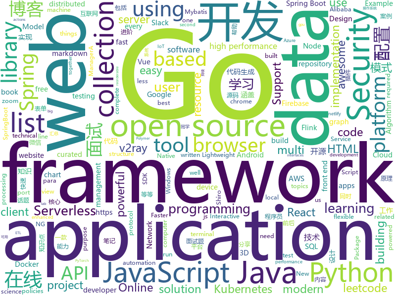

# 2019-11-23
See what the GitHub community is most excited about today.

## python
* [Python](https://github.com/TheAlgorithms/Python)(**345 stars today**): All Algorithms implemented in Python
* [cascadia-code](https://github.com/microsoft/cascadia-code)(**41 stars today**): This is a fun, new monospaced font that includes programming ligatures and is designed to enhance the modern look and feel of the Windows Terminal.
* [3d-ken-burns](https://github.com/sniklaus/3d-ken-burns)(**164 stars today**): an implementation of 3D Ken Burns Effect from a Single Image using PyTorch
* [public-apis](https://github.com/public-apis/public-apis)(**252 stars today**): A collective list of free APIs for use in software and web development.
* [models](https://github.com/tensorflow/models)(**45 stars today**): Models and examples built with TensorFlow
* [zulip](https://github.com/zulip/zulip)(**16 stars today**): Zulip server - powerful open source team chat
* [boto3](https://github.com/boto/boto3)(**3 stars today**): AWS SDK for Python
* [salt](https://github.com/saltstack/salt)(**6 stars today**): Software to automate the management and configuration of any infrastructure or application at scale. Get access to the Salt software package repository here:
* [shadowsocksr](https://github.com/shadowsocksr-backup/shadowsocksr)(**12 stars today**): Python port of ShadowsocksR
* [locust](https://github.com/locustio/locust)(**20 stars today**): Scalable user load testing tool written in Python
* [sagemaker-python-sdk](https://github.com/aws/sagemaker-python-sdk)(**1 stars today**): A library for training and deploying machine learning models on Amazon SageMaker
* [incubator-tvm](https://github.com/apache/incubator-tvm)(**5 stars today**): Open deep learning compiler stack for cpu, gpu and specialized accelerators
* [compose](https://github.com/docker/compose)(**13 stars today**): Define and run multi-container applications with Docker
* [django](https://github.com/django/django)(**26 stars today**): The Web framework for perfectionists with deadlines.
* [protonvpn-cli-ng](https://github.com/ProtonVPN/protonvpn-cli-ng)(**4 stars today**): New Python-based implementation of the ProtonVPN CLI
* [EfficientNet-PyTorch](https://github.com/lukemelas/EfficientNet-PyTorch)(**24 stars today**): A PyTorch implementation of EfficientNet
* [code_snippets](https://github.com/CoreyMSchafer/code_snippets)(**7 stars today**): 
* [multi-v2ray](https://github.com/Jrohy/multi-v2ray)(**7 stars today**): v2ray easy delpoy & manage tool， support multiple user & protocol manage
* [serverless-application-model](https://github.com/awslabs/serverless-application-model)(**4 stars today**): AWS Serverless Application Model (SAM) is an open-source framework for building serverless applications
* [cloud-custodian](https://github.com/cloud-custodian/cloud-custodian)(**3 stars today**): Rules engine for cloud security, cost optimization, and governance, DSL in yaml for policies to query, filter, and take actions on resources
* [pyppeteer](https://github.com/miyakogi/pyppeteer)(**4 stars today**): Headless chrome/chromium automation library (unofficial port of puppeteer)
* [aws-sam-cli](https://github.com/awslabs/aws-sam-cli)(**6 stars today**): CLI tool to build, test, debug, and deploy Serverless applications using AWS SAM
* [dash](https://github.com/plotly/dash)(**11 stars today**): Analytical Web Apps for Python & R. No JavaScript Required.
* [Tello-Python](https://github.com/dji-sdk/Tello-Python)(**4 stars today**): This is a collection of python modules that interact with the Ryze Tello drone.
* [aiohttp](https://github.com/aio-libs/aiohttp)(**6 stars today**): Asynchronous HTTP client/server framework for asyncio and Python

## java
* [JavaGuide](https://github.com/Snailclimb/JavaGuide)(**251 stars today**): 【Java学习+面试指南】 一份涵盖大部分Java程序员所需要掌握的核心知识。
* [CS-Notes](https://github.com/CyC2018/CS-Notes)(**155 stars today**): 📚技术面试必备基础知识、Leetcode、Java、C++、Python、后端面试、计算机操作系统、计算机网络、系统设计
* [jeecg-boot](https://github.com/zhangdaiscott/jeecg-boot)(**73 stars today**): 一款基于代码生成器的JAVA快速开发平台，开源界“小普元”超越传统商业企业级开发平台！采用前后端分离架构：SpringBoot 2.x，Ant Design&Vue，Mybatis-plus，Shiro，JWT。强大的代码生成器让前后端代码一键生成，无需写任何代码! 引领新的开发模式(OnlineCoding模式-> 代码生成器模式-> 手工MERGE智能开发)，帮助Java项目解决70%的重复工作，让开发更多关注业务逻辑。既能快速提高开发效率，帮助公司节省成本，同时又不失灵活性。JeecgBoot还独创在线开发模式（No代码）：在线表单配置（表单设计器）、移动配置能力、在线工作流配置（流程设计器）、在线报表配置、在线图表配置、插件能力（可插拔）等等
* [ksql](https://github.com/confluentinc/ksql)(**35 stars today**): The event streaming database purpose-built for stream processing applications
* [flink-learning](https://github.com/zhisheng17/flink-learning)(**92 stars today**): flink learning blog. http://www.54tianzhisheng.cn 含 Flink 入门、概念、原理、实战、性能调优、源码解析等内容。涉及 Flink Connector、Metrics、Library、DataStream API、Table API & SQL 等内容的学习案例，还有 Flink 落地应用的大型项目案例分享。
* [halo](https://github.com/halo-dev/halo)(**66 stars today**): ✍ Halo 一款现代化的个人独立博客系统
* [spring-boot](https://github.com/spring-projects/spring-boot)(**36 stars today**): Spring Boot
* [pentaho-kettle](https://github.com/pentaho/pentaho-kettle)(**10 stars today**): Pentaho Data Integration ( ETL ) a.k.a Kettle
* [graal](https://github.com/oracle/graal)(**48 stars today**): GraalVM: Run Programs Faster Anywhere🚀
* [springboot-guide](https://github.com/Snailclimb/springboot-guide)(**12 stars today**): SpringBoot 核心知识点和面试题总结。
* [mybatis-plus](https://github.com/baomidou/mybatis-plus)(**18 stars today**): An powerful enhanced toolkit of MyBatis for simplify development
* [micronaut-core](https://github.com/micronaut-projects/micronaut-core)(**6 stars today**): Micronaut Application Framework
* [HikariCP](https://github.com/brettwooldridge/HikariCP)(**9 stars today**): 光 HikariCP・A solid, high-performance, JDBC connection pool at last.
* [selenium](https://github.com/SeleniumHQ/selenium)(**11 stars today**): A browser automation framework and ecosystem.
* [MPAndroidChart](https://github.com/PhilJay/MPAndroidChart)(**9 stars today**): A powerful🚀Android chart view / graph view library, supporting line- bar- pie- radar- bubble- and candlestick charts as well as scaling, dragging and animations.
* [skywalking](https://github.com/apache/skywalking)(**28 stars today**): APM, Application Performance Monitoring System
* [spring-data-examples](https://github.com/spring-projects/spring-data-examples)(**4 stars today**): Spring Data Example Projects
* [TubeMQ](https://github.com/Tencent/TubeMQ)(**11 stars today**): TubeMQ focuses on high-performance storage and transmission of massive data in big data scenarios
* [canal](https://github.com/alibaba/canal)(**19 stars today**): 阿里巴巴 MySQL binlog 增量订阅&消费组件
* [seata](https://github.com/seata/seata)(**30 stars today**): 🔥Seata is an easy-to-use, high-performance, open source distributed transaction solution.
* [thingsboard](https://github.com/thingsboard/thingsboard)(**14 stars today**): Open-source IoT Platform - Device management, data collection, processing and visualization.
* [ideavim](https://github.com/JetBrains/ideavim)(**9 stars today**): Vim emulation plug-in for IDEs based on the IntelliJ platform.
* [SpringAll](https://github.com/wuyouzhuguli/SpringAll)(**32 stars today**): 循序渐进，学习Spring Boot、Spring Boot & Shiro、Spring Cloud、Spring Security & Spring Security OAuth2，博客Spring系列源码
* [spring-cloud-alibaba](https://github.com/alibaba/spring-cloud-alibaba)(**33 stars today**): Spring Cloud Alibaba provides a one-stop solution for application development for the distributed solutions of Alibaba middleware.
* [flink](https://github.com/apache/flink)(**15 stars today**): Apache Flink

## unknown
* [project-based-learning](https://github.com/tuvtran/project-based-learning)(**154 stars today**): Curated list of project-based tutorials
* [JavaFamily](https://github.com/AobingJava/JavaFamily)(**353 stars today**): 【互联网一线大厂Java 工程师面试+学习指南】进阶知识完全扫盲：涵盖高并发、分布式、高可用、微服务等领域知识，作者风格幽默，看起来津津有味，把学习当做一种乐趣，何乐而不为，后端同学必看，前端同学我保证你也看得懂，看不懂你加我微信骂我渣男就好了。
* [coding-interview-university](https://github.com/jwasham/coding-interview-university)(**381 stars today**): A complete computer science study plan to become a software engineer.
* [Awesome-Hacking](https://github.com/Hack-with-Github/Awesome-Hacking)(**54 stars today**): A collection of various awesome lists for hackers, pentesters and security researchers
* [developer-roadmap](https://github.com/kamranahmedse/developer-roadmap)(**237 stars today**): Roadmap to becoming a web developer in 2019
* [You-Dont-Know-JS](https://github.com/getify/You-Dont-Know-JS)(**195 stars today**): A book series on JavaScript. @YDKJS on twitter.
* [new-pac](https://github.com/Alvin9999/new-pac)(**110 stars today**): 科学/自由上网，免费ss/ssr/v2ray/goflyway账号，搭建教程
* [YCBlogs](https://github.com/yangchong211/YCBlogs)(**16 stars today**): 技术博客笔记大汇总【15年10月到至今】，包括Java基础及深入知识点，Android技术博客，Python，Go学习笔记等等，还包括平时开发中遇到的bug汇总，当然也在工作之余收集了大量的面试题，长期更新维护并且修正，持续完善……开源的文件是markdown格式的！同时也开源了生活博客，从12年起，积累共计N篇[近100万字]，转载请注明出处，谢谢！
* [Specs](https://github.com/CocoaPods/Specs)(**1 stars today**): The CocoaPods Master Repo
* [react-typescript-cheatsheet](https://github.com/typescript-cheatsheets/react-typescript-cheatsheet)(**23 stars today**): Cheatsheets for experienced React developers getting started with TypeScript
* [clash_for_windows_pkg](https://github.com/Fndroid/clash_for_windows_pkg)(**16 stars today**): A Windows GUI based on Clash
* [YOWO](https://github.com/wei-tim/YOWO)(**28 stars today**): 
* [PSTeam](https://github.com/Bronce/PSTeam)(**2 stars today**): 
* [every-programmer-should-know](https://github.com/mtdvio/every-programmer-should-know)(**83 stars today**): A collection of (mostly) technical things every software developer should know
* [free-programming-books](https://github.com/EbookFoundation/free-programming-books)(**301 stars today**): 📚Freely available programming books
* [vagas](https://github.com/frontendbr/vagas)(**2 stars today**): 🔬Espaço para divulgação de vagas para front-enders.
* [awesome-design-systems](https://github.com/alexpate/awesome-design-systems)(**20 stars today**): 💅🏻⚒A collection of awesome design systems
* [chrome-sbx-db](https://github.com/allpaca/chrome-sbx-db)(**12 stars today**): A Collection of Chrome Sandbox Escape POCs/Exploits for learning
* [awesome-javascript](https://github.com/sorrycc/awesome-javascript)(**13 stars today**): 🐢A collection of awesome browser-side JavaScript libraries, resources and shiny things.
* [computer-science](https://github.com/ossu/computer-science)(**45 stars today**): 🎓Path to a free self-taught education in Computer Science!
* [awesome-web-security](https://github.com/qazbnm456/awesome-web-security)(**5 stars today**): 🐶A curated list of Web Security materials and resources.
* [3D-Machine-Learning](https://github.com/timzhang642/3D-Machine-Learning)(**9 stars today**): A resource repository for 3D machine learning
* [blog](https://github.com/sorrycc/blog)(**6 stars today**): 💡
* [meetup-slides](https://github.com/tvmai/meetup-slides)(**6 stars today**): Place for meetup slides
* [kubernetes-network-policy-recipes](https://github.com/ahmetb/kubernetes-network-policy-recipes)(**3 stars today**): Example recipes for Kubernetes Network Policies that you can just copy paste

## javascript
* [algorithm-visualizer](https://github.com/algorithm-visualizer/algorithm-visualizer)(**174 stars today**): 🎆Interactive Online Platform that Visualizes Algorithms from Code
* [freeCodeCamp](https://github.com/freeCodeCamp/freeCodeCamp)(**230 stars today**): The https://www.freeCodeCamp.org open source codebase and curriculum. Learn to code for free together with millions of people.
* [cube.js](https://github.com/cube-js/cube.js)(**87 stars today**): 📊Cube.js - Open Source Analytics Framework
* [lite-youtube-embed](https://github.com/paulirish/lite-youtube-embed)(**153 stars today**): A faster youtube embed.
* [leetcode](https://github.com/azl397985856/leetcode)(**53 stars today**): LeetCode Solutions: A Record of My Problem Solving Journey.( leetcode题解，记录自己的leetcode解题之路。)
* [generator-jhipster](https://github.com/jhipster/generator-jhipster)(**13 stars today**): Open Source application platform for creating Spring Boot + Angular/React projects in seconds!
* [react](https://github.com/facebook/react)(**100 stars today**): A declarative, efficient, and flexible JavaScript library for building user interfaces.
* [react-native-firebase](https://github.com/invertase/react-native-firebase)(**8 stars today**): 🔥A well-tested feature-rich modular Firebase implementation for React Native. Supports both iOS & Android platforms for all Firebase services.
* [serverless](https://github.com/serverless/serverless)(**19 stars today**): Serverless Framework – Build web, mobile and IoT applications with serverless architectures using AWS Lambda, Azure Functions, Google CloudFunctions & more! –
* [fingerprintjs2](https://github.com/Valve/fingerprintjs2)(**52 stars today**): Modern & flexible browser fingerprinting library
* [fastify](https://github.com/fastify/fastify)(**19 stars today**): Fast and low overhead web framework, for Node.js
* [Sortable](https://github.com/SortableJS/Sortable)(**100 stars today**): Sortable — is a JavaScript library for reorderable drag-and-drop lists on modern browsers and touch devices. No jQuery required. Supports Meteor, AngularJS, React, Polymer, Vue, Ember, Knockout and any CSS library, e.g. Bootstrap.
* [clean-code-javascript](https://github.com/ryanmcdermott/clean-code-javascript)(**176 stars today**): 🛁Clean Code concepts adapted for JavaScript
* [sequelize](https://github.com/sequelize/sequelize)(**10 stars today**): An easy-to-use multi SQL dialect ORM for Node.js
* [axios](https://github.com/axios/axios)(**42 stars today**): Promise based HTTP client for the browser and node.js
* [gatsby](https://github.com/gatsbyjs/gatsby)(**36 stars today**): Build blazing fast, modern apps and websites with React
* [spectrum](https://github.com/withspectrum/spectrum)(**22 stars today**): Simple, powerful online communities.
* [automerge](https://github.com/automerge/automerge)(**23 stars today**): A JSON-like data structure (a CRDT) that can be modified concurrently by different users, and merged again automatically.
* [vue](https://github.com/vuejs/vue)(**77 stars today**): 🖖Vue.js is a progressive, incrementally-adoptable JavaScript framework for building UI on the web.
* [mapbox-gl-js](https://github.com/mapbox/mapbox-gl-js)(**4 stars today**): Interactive, thoroughly customizable maps in the browser, powered by vector tiles and WebGL
* [jest](https://github.com/facebook/jest)(**25 stars today**): Delightful JavaScript Testing.
* [design-system](https://github.com/storybookjs/design-system)(**11 stars today**): 🗃Storybook Design System
* [angular.js](https://github.com/angular/angular.js)(**4 stars today**): AngularJS - HTML enhanced for web apps!
* [commitlint](https://github.com/conventional-changelog/commitlint)(**13 stars today**): 📓Lint commit messages
* [Chart.js](https://github.com/chartjs/Chart.js)(**17 stars today**): Simple HTML5 Charts using the <canvas> tag

## html
* [500LineorLess_CN](https://github.com/HT524/500LineorLess_CN)(**5 stars today**): 500 line or less 中文翻译计划。
* [Front-end-Developer-Interview-Questions](https://github.com/h5bp/Front-end-Developer-Interview-Questions)(**10 stars today**): A list of helpful front-end related questions you can use to interview potential candidates, test yourself or completely ignore.
* [3d-force-graph](https://github.com/vasturiano/3d-force-graph)(**3 stars today**): 3D force-directed graph component using ThreeJS/WebGL
* [nginxconfig.io](https://github.com/digitalocean/nginxconfig.io)(**12 stars today**): ⚙️NGiИX config generator on steroids💉
* [quickstart-js](https://github.com/firebase/quickstart-js)(**3 stars today**): Firebase Quickstart Samples for Web
* [manual](https://github.com/v2ray/manual)(**0 stars today**): Source code for https://www.v2ray.com/
* [EIPs](https://github.com/ethereum/EIPs)(**3 stars today**): The Ethereum Improvement Proposal repository
* [Java-Interview-Advanced](https://github.com/shishan100/Java-Interview-Advanced)(**5 stars today**): 中华石杉--互联网Java进阶面试训练营
* [android_interview](https://github.com/LRH1993/android_interview)(**4 stars today**): gitbook地址
* [ctf-wiki](https://github.com/ctf-wiki/ctf-wiki)(**3 stars today**): CTF Wiki Online. Come and join us, we need you!
* [ng-alain](https://github.com/ng-alain/ng-alain)(**3 stars today**): NG-ZORRO admin panel front-end framework (netlify mirror https://netlify.ng-alain.com/)
* [markdown-preview-enhanced](https://github.com/shd101wyy/markdown-preview-enhanced)(**3 stars today**): One of the 'BEST' markdown preview extensions for Atom editor!
* [tiny-slider](https://github.com/ganlanyuan/tiny-slider)(**10 stars today**): Vanilla javascript slider for all purposes.
* [v2-ui](https://github.com/sprov065/v2-ui)(**11 stars today**): 支持多协议多用户的 v2ray 面板，Support multi-protocol multi-user v2ray panel
* [compat-table](https://github.com/kangax/compat-table)(**2 stars today**): ECMAScript 5/6/7 compatibility tables
* [electron-api-demos](https://github.com/electron/electron-api-demos)(**3 stars today**): Explore the Electron APIs
* [DetectionLab](https://github.com/clong/DetectionLab)(**3 stars today**): Vagrant & Packer scripts to build a lab environment complete with security tooling and logging best practices
* [dragon-book-exercise-answers](https://github.com/fool2fish/dragon-book-exercise-answers)(**3 stars today**): Compilers Principles, Techniques, & Tools (purple dragon book) second edition exercise answers. 编译原理（紫龙书）第2版习题答案。
* [learn-to-send-email-via-google-script-html-no-server](https://github.com/dwyl/learn-to-send-email-via-google-script-html-no-server)(**2 stars today**): ✉️An Example of using an HTML form (e.g: "Contact Us" on a website) to send Email without a Backend Server (using a Google Script) perfect for static websites that need to collect data.
* [styleguide](https://github.com/google/styleguide)(**15 stars today**): Style guides for Google-originated open-source projects
* [awesome-competitive-programming](https://github.com/lnishan/awesome-competitive-programming)(**9 stars today**): 💎A curated list of awesome Competitive Programming, Algorithm and Data Structure resources
* [portainer](https://github.com/portainer/portainer)(**13 stars today**): Making Docker management easy.
* [html](https://github.com/whatwg/html)(**0 stars today**): HTML Standard
* [foundation-sites](https://github.com/foundation/foundation-sites)(**6 stars today**): The most advanced responsive front-end framework in the world. Quickly create prototypes and production code for sites that work on any kind of device.
* [skill-map](https://github.com/TeamStuQ/skill-map)(**9 stars today**): 程序员技能图谱

## go
* [k3s](https://github.com/rancher/k3s)(**183 stars today**): Lightweight Kubernetes. 5 less than k8s.
* [nebula](https://github.com/slackhq/nebula)(**477 stars today**): A scalable overlay networking tool with a focus on performance, simplicity and security
* [advanced-go-programming-book](https://github.com/chai2010/advanced-go-programming-book)(**243 stars today**): 📚《Go语言高级编程》开源图书，涵盖CGO、Go汇编语言、RPC实现、Protobuf插件实现、Web框架实现、分布式系统等高阶主题(完稿)
* [night-reading-go](https://github.com/developer-learning/night-reading-go)(**33 stars today**): Night-Reading-Go《Go 夜读》 > Share the related technical topics of Go every week through zoom online live broadcast, every day on the WeChat/Slack to communicate programming technology topics. 每周通过 zoom 在线直播的方式分享 Go 相关的技术话题，每天大家在微信/Slack 上及时沟通交流编程技术话题。
* [charts](https://github.com/helm/charts)(**22 stars today**): Curated applications for Kubernetes
* [loki](https://github.com/grafana/loki)(**69 stars today**): Like Prometheus, but for logs.
* [aws-sdk-go](https://github.com/aws/aws-sdk-go)(**5 stars today**): AWS SDK for the Go programming language.
* [terraform-provider-azurerm](https://github.com/terraform-providers/terraform-provider-azurerm)(**5 stars today**): Terraform provider for Azure Resource Manager
* [gotenberg](https://github.com/thecodingmachine/gotenberg)(**10 stars today**): A Docker-powered stateless API for converting HTML, Markdown and Office documents to PDF
* [bigcache](https://github.com/allegro/bigcache)(**41 stars today**): Efficient cache for gigabytes of data written in Go.
* [kubeedge](https://github.com/kubeedge/kubeedge)(**7 stars today**): Kubernetes Native Edge Computing Framework (project under CNCF)
* [dgraph](https://github.com/dgraph-io/dgraph)(**15 stars today**): Fast, Distributed Graph DB
* [helm](https://github.com/helm/helm)(**21 stars today**): The Kubernetes Package Manager
* [aquatone](https://github.com/michenriksen/aquatone)(**8 stars today**): A Tool for Domain Flyovers
* [MailHog](https://github.com/mailhog/MailHog)(**9 stars today**): Web and API based SMTP testing
* [kind](https://github.com/kubernetes-sigs/kind)(**16 stars today**): Kubernetes IN Docker - local clusters for testing Kubernetes
* [elastic](https://github.com/olivere/elastic)(**5 stars today**): Elasticsearch client for Go.
* [v2ray-core](https://github.com/v2ray/v2ray-core)(**97 stars today**): A platform for building proxies to bypass network restrictions.
* [slack-term](https://github.com/erroneousboat/slack-term)(**4 stars today**): Slack client for your terminal
* [beats](https://github.com/elastic/beats)(**5 stars today**): 🐠Beats - Lightweight shippers for Elasticsearch & Logstash
* [hubble](https://github.com/cilium/hubble)(**29 stars today**): Hubble - Network, Service & Security Observability for Kubernetes
* [frp](https://github.com/fatedier/frp)(**45 stars today**): A fast reverse proxy to help you expose a local server behind a NAT or firewall to the internet.
* [ristretto](https://github.com/dgraph-io/ristretto)(**51 stars today**): A high performance memory-bound Go cache
* [protobuf](https://github.com/gogo/protobuf)(**7 stars today**): Protocol Buffers for Go with Gadgets
* [sqlflow](https://github.com/sql-machine-learning/sqlflow)(**11 stars today**): Brings SQL and AI together.

## WordCloud

