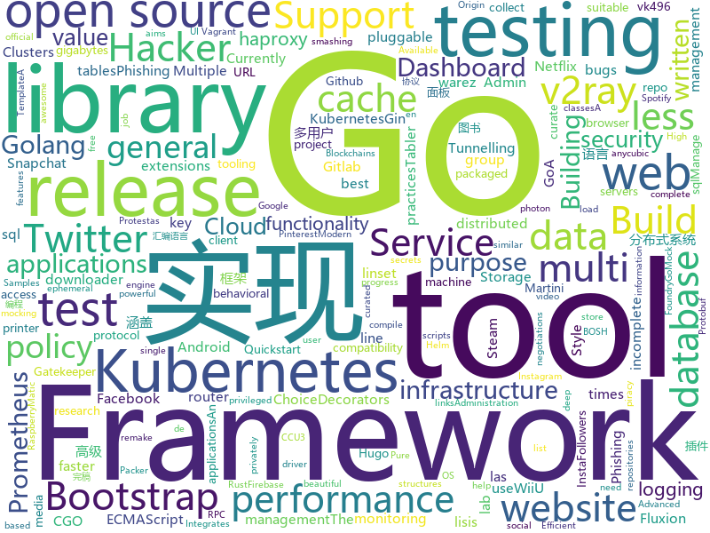

# 2019-11-24
See what the GitHub community is most excited about today.

## html
* [hugo-academic](https://github.com/gcushen/hugo-academic)(**14 stars today**): 📝The website builder for Hugo. Build and deploy a beautiful website in minutes!
* [blog_os](https://github.com/phil-opp/blog_os)(**11 stars today**): Writing an OS in Rust
* [quickstart-js](https://github.com/firebase/quickstart-js)(**3 stars today**): Firebase Quickstart Samples for Web
* [node-ytdl-core](https://github.com/fent/node-ytdl-core)(**2 stars today**): YouTube video downloader in javascript.
* [haproxy-boshrelease](https://github.com/cloudfoundry-incubator/haproxy-boshrelease)(**0 stars today**): A BOSH release for haproxy (based on cf-release's haproxy job)
* [riots_chile_analisis](https://github.com/connectalabs/riots_chile_analisis)(**3 stars today**): Análisis Twitter en las Protestas de Chile
* [gentelella](https://github.com/ColorlibHQ/gentelella)(**12 stars today**): Free Bootstrap 4 Admin Dashboard Template
* [awesome-piracy](https://github.com/Igglybuff/awesome-piracy)(**23 stars today**): A curated list of awesome warez and piracy links
* [aplus](https://github.com/betagouv/aplus)(**0 stars today**): Administration+
* [THC-Archive](https://github.com/vanhauser-thc/THC-Archive)(**4 stars today**): All releases of the security research group (a.k.a. hackers) The Hacker's Choice
* [paragraphs_starterkit](https://github.com/BurdaMagazinOrg/paragraphs_starterkit)(****): 
* [theme-infinite_amp](https://github.com/BurdaMagazinOrg/theme-infinite_amp)(**0 stars today**): 
* [proposal-decorators](https://github.com/tc39/proposal-decorators)(**1 stars today**): Decorators for ES6 classes
* [persona5-negotiation](https://github.com/joyce-chen/persona5-negotiation)(**0 stars today**): A tool to help negotiations in Persona 5. (Note: Currently incomplete. Work-in-progress.)
* [compat-table](https://github.com/kangax/compat-table)(**1 stars today**): ECMAScript 5/6/7 compatibility tables
* [shellphish](https://github.com/thelinuxchoice/shellphish)(**4 stars today**): Phishing Tool for 18 social media: Instagram, Facebook, Snapchat, Github, Twitter, Yahoo, Protonmail, Spotify, Netflix, Linkedin, Wordpress, Origin, Steam, Microsoft, InstaFollowers, Gitlab, Pinterest
* [HiddenEye](https://github.com/DarkSecDevelopers/HiddenEye)(**7 stars today**): Modern Phishing Tool With Advanced Functionality And Multiple Tunnelling Services [ Android-Support-Available ]
* [v2-ui](https://github.com/sprov065/v2-ui)(**14 stars today**): 支持多协议多用户的 v2ray 面板，Support multi-protocol multi-user v2ray panel
* [COMP9021_19T3](https://github.com/marey/COMP9021_19T3)(**1 stars today**): 
* [anycubic-photon-docs](https://github.com/Photonsters/anycubic-photon-docs)(**1 stars today**): This repo aims to collect curate and compile information on anycubic photon hardware software and use
* [homebrew_launcher](https://github.com/dimok789/homebrew_launcher)(**0 stars today**): WiiU Homebrew Launcher
* [RedMatic](https://github.com/rdmtc/RedMatic)(**2 stars today**): Node-RED packaged as Addon for the Homematic CCU3 and RaspberryMatic🤹‍♂️
* [fluxion](https://github.com/FluxionNetwork/fluxion)(**4 stars today**): Fluxion is a remake of linset by vk496 with less bugs and enhanced functionality.
* [DetectionLab](https://github.com/clong/DetectionLab)(**7 stars today**): Vagrant & Packer scripts to build a lab environment complete with security tooling and logging best practices
* [tabler](https://github.com/tabler/tabler)(**12 stars today**): Tabler is free and open-source HTML Dashboard UI Kit built on Bootstrap

## go
* [advanced-go-programming-book](https://github.com/chai2010/advanced-go-programming-book)(**176 stars today**): 📚《Go语言高级编程》开源图书，涵盖CGO、Go汇编语言、RPC实现、Protobuf插件实现、Web框架实现、分布式系统等高阶主题(完稿)
* [loki](https://github.com/grafana/loki)(**54 stars today**): Like Prometheus, but for logs.
* [bigcache](https://github.com/allegro/bigcache)(**27 stars today**): Efficient cache for gigabytes of data written in Go.
* [pq](https://github.com/lib/pq)(**6 stars today**): Pure Go Postgres driver for database/sql
* [cosmos-sdk](https://github.com/cosmos/cosmos-sdk)(**2 stars today**): ⛓A Framework for Building High Value Public Blockchains✨
* [ginkgo](https://github.com/onsi/ginkgo)(**3 stars today**): BDD Testing Framework for Go
* [mux](https://github.com/gorilla/mux)(**17 stars today**): A powerful HTTP router and URL matcher for building Go web servers with🦍
* [gatekeeper](https://github.com/open-policy-agent/gatekeeper)(**5 stars today**): Gatekeeper - Policy Controller for Kubernetes
* [gin](https://github.com/gin-gonic/gin)(**44 stars today**): Gin is a HTTP web framework written in Go (Golang). It features a Martini-like API with much better performance -- up to 40 times faster. If you need smashing performance, get yourself some Gin.
* [sqlx](https://github.com/jmoiron/sqlx)(**16 stars today**): general purpose extensions to golang's database/sql
* [helm-gcs](https://github.com/hayorov/helm-gcs)(**1 stars today**): Manage Helm repositories on Google Cloud Storage🔐**privately**
* [opa](https://github.com/open-policy-agent/opa)(**10 stars today**): An open source, general-purpose policy engine.
* [vault](https://github.com/hashicorp/vault)(**14 stars today**): A tool for secrets management, encryption as a service, and privileged access management
* [cli](https://github.com/cloudfoundry/cli)(**3 stars today**): The official command line client for Cloud Foundry
* [mock](https://github.com/golang/mock)(**3 stars today**): GoMock is a mocking framework for the Go programming language.
* [sensu-go](https://github.com/sensu/sensu-go)(**5 stars today**): Open source monitoring tool for ephemeral infrastructure & distributed applications.
* [goconvey](https://github.com/smartystreets/goconvey)(**5 stars today**): Go testing in the browser. Integrates with `go test`. Write behavioral tests in Go.
* [k3s](https://github.com/rancher/k3s)(**204 stars today**): Lightweight Kubernetes. 5 less than k8s.
* [test-infra](https://github.com/kubernetes/test-infra)(**0 stars today**): Test infrastructure for the Kubernetes project.
* [k9s](https://github.com/derailed/k9s)(**53 stars today**): 🐶Kubernetes CLI To Manage Your Clusters In Style!
* [go-spew](https://github.com/davecgh/go-spew)(**1 stars today**): Implements a deep pretty printer for Go data structures to aid in debugging
* [logrus](https://github.com/sirupsen/logrus)(**17 stars today**): Structured, pluggable logging for Go.
* [vegeta](https://github.com/tsenart/vegeta)(**37 stars today**): HTTP load testing tool and library. It's over 9000!
* [client_golang](https://github.com/prometheus/client_golang)(**1 stars today**): Prometheus instrumentation library for Go applications
* [go-cache](https://github.com/patrickmn/go-cache)(**6 stars today**): An in-memory key:value store/cache (similar to Memcached) library for Go, suitable for single-machine applications.

## WordCloud

