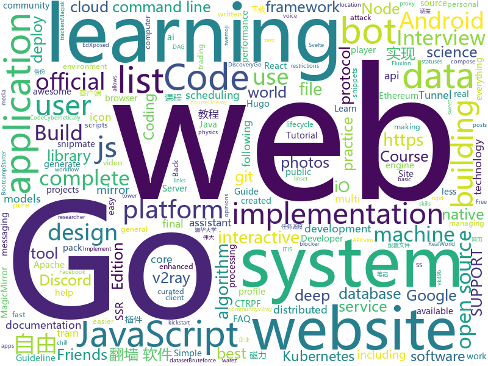

# 2019-11-26
See what the GitHub community is most excited about today.

## python
* [Ultimate-Facebook-Scraper](https://github.com/harismuneer/Ultimate-Facebook-Scraper)(**22 stars today**): 🤖A bot which scrapes almost everything about a Facebook user's profile including all public posts/statuses available on the user's timeline, uploaded photos, tagged photos, videos, friends list and their profile photos (including Followers, Following, Work Friends, College Friends etc).
* [sherlock](https://github.com/sherlock-project/sherlock)(**38 stars today**): 🔎Find usernames across social networks
* [scikit-learn](https://github.com/scikit-learn/scikit-learn)(**22 stars today**): scikit-learn: machine learning in Python
* [Real-Time-Voice-Cloning](https://github.com/CorentinJ/Real-Time-Voice-Cloning)(**190 stars today**): Clone a voice in 5 seconds to generate arbitrary speech in real-time
* [python-for-android](https://github.com/kivy/python-for-android)(**19 stars today**): Turn your Python application into an Android APK
* [vim-snippets](https://github.com/honza/vim-snippets)(**3 stars today**): vim-snipmate default snippets (Previously snipmate-snippets)
* [flan](https://github.com/cloudflare/flan)(**324 stars today**): A pretty sweet vulnerability scanner
* [12306](https://github.com/testerSunshine/12306)(**14 stars today**): 12306智能刷票，订票
* [scipy](https://github.com/scipy/scipy)(**1 stars today**): Scipy library main repository
* [oppia](https://github.com/oppia/oppia)(**6 stars today**): Tool for collaboratively building interactive lessons.
* [SickChill](https://github.com/SickChill/SickChill)(**0 stars today**): Less rage, more chill.
* [system-design-primer](https://github.com/donnemartin/system-design-primer)(**76 stars today**): Learn how to design large-scale systems. Prep for the system design interview. Includes Anki flashcards.
* [ParlAI](https://github.com/facebookresearch/ParlAI)(**10 stars today**): A framework for training and evaluating AI models on a variety of openly available dialogue datasets.
* [ML-From-Scratch](https://github.com/eriklindernoren/ML-From-Scratch)(**18 stars today**): Machine Learning From Scratch. Bare bones NumPy implementations of machine learning models and algorithms with a focus on accessibility. Aims to cover everything from linear regression to deep learning.
* [tensorflow-yolov3](https://github.com/YunYang1994/tensorflow-yolov3)(**9 stars today**): 🔥pure tensorflow Implement of YOLOv3 with support to train your own dataset
* [Instagram](https://github.com/Pure-L0G1C/Instagram)(**7 stars today**): Bruteforce attack for Instagram
* [pytorch-tutorial](https://github.com/yunjey/pytorch-tutorial)(**176 stars today**): PyTorch Tutorial for Deep Learning Researchers
* [pyTelegramBotAPI](https://github.com/eternnoir/pyTelegramBotAPI)(**4 stars today**): Python Telegram bot api.
* [bokeh](https://github.com/bokeh/bokeh)(**11 stars today**): Interactive Data Visualization in the browser, from Python
* [code_snippets](https://github.com/CoreyMSchafer/code_snippets)(**10 stars today**): 
* [project-fa19](https://github.com/Berkeley-CS170/project-fa19)(**3 stars today**): CS 170 Fall 2019 Project
* [ipwndfu](https://github.com/axi0mX/ipwndfu)(**8 stars today**): open-source jailbreaking tool for many iOS devices
* [keras](https://github.com/keras-team/keras)(**29 stars today**): Deep Learning for humans
* [Red-DiscordBot](https://github.com/Cog-Creators/Red-DiscordBot)(**0 stars today**): A multifunction Discord bot
* [geo-heatmap](https://github.com/luka1199/geo-heatmap)(**182 stars today**): 🗺Generate an interactive geo heatmap from your Google location data

## java
* [Mindustry](https://github.com/Anuken/Mindustry)(**16 stars today**): A sandbox tower defense game
* [Nukkit](https://github.com/NukkitX/Nukkit)(**4 stars today**): Nuclear-Powered Server Software for Minecraft: Bedrock Edition.
* [runelite](https://github.com/runelite/runelite)(**21 stars today**): Open source Old School RuneScape client
* [selenium](https://github.com/SeleniumHQ/selenium)(**11 stars today**): A browser automation framework and ecosystem.
* [user-interface-samples](https://github.com/android/user-interface-samples)(**3 stars today**): Multiple samples showing the best practices in the user interface on Android.
* [ud851-Exercises](https://github.com/udacity/ud851-Exercises)(**2 stars today**): 
* [CtCI-6th-Edition](https://github.com/careercup/CtCI-6th-Edition)(**6 stars today**): Cracking the Coding Interview 6th Ed. Solutions
* [SkyStone](https://github.com/FIRST-Tech-Challenge/SkyStone)(**1 stars today**): FTC SDK
* [baritone](https://github.com/cabaletta/baritone)(**0 stars today**): google maps for block game
* [backtobackswe](https://github.com/bephrem1/backtobackswe)(**3 stars today**): Code Examples For Back To Back SWE Lessons
* [besu](https://github.com/hyperledger/besu)(**2 stars today**): An enterprise-grade Java-based, Apache 2.0 licensed Ethereum client
* [EdXposedManager](https://github.com/ElderDrivers/EdXposedManager)(**2 stars today**): Companion Android application for EdXposed
* [magnetW](https://github.com/dengyuhan/magnetW)(**18 stars today**): 磁力搜网页版 - 磁力链接聚合搜索 - https://bt.lansou.pw
* [ud851-Sunshine](https://github.com/udacity/ud851-Sunshine)(**1 stars today**): 
* [incubator-dolphinscheduler](https://github.com/apache/incubator-dolphinscheduler)(**17 stars today**): Dolphin Scheduler is a distributed and easy-to-expand visual DAG workflow scheduling system, dedicated to solving the complex dependencies in data processing, making the scheduling system out of the box for data processing.(分布式易扩展的可视化工作流任务调度)
* [algs4](https://github.com/kevin-wayne/algs4)(**48 stars today**): Algorithms, 4th edition textbook code and libraries
* [AndroidAPS](https://github.com/MilosKozak/AndroidAPS)(**1 stars today**): 
* [interviews](https://github.com/kdn251/interviews)(**17 stars today**): Everything you need to know to get the job.
* [smile](https://github.com/haifengl/smile)(**4 stars today**): Statistical Machine Intelligence & Learning Engine
* [incubator-shardingsphere](https://github.com/apache/incubator-shardingsphere)(**19 stars today**): Distributed database middleware
* [JAViewer](https://github.com/SplashCodes/JAViewer)(**2 stars today**): 更优雅的驾车体验
* [kfu-programming-java1](https://github.com/istamendil/kfu-programming-java1)(****): ITIS Programming Course. 1st semestr
* [nacos](https://github.com/alibaba/nacos)(**21 stars today**): an easy-to-use dynamic service discovery, configuration and service management platform for building cloud native applications.
* [interview](https://github.com/mission-peace/interview)(**6 stars today**): Interview questions
* [netbeans](https://github.com/apache/netbeans)(**3 stars today**): Apache NetBeans

## unknown
* [Production-Level-Deep-Learning](https://github.com/alirezadir/Production-Level-Deep-Learning)(**182 stars today**): This repo attempts to serve as a guideline for building practical production-level deep learning systems to be deployed in real world applications.
* [electron-ssr-backup](https://github.com/qingshuisiyuan/electron-ssr-backup)(**27 stars today**): electron-ssr原作者删除了这个伟大的项目，故备份了下来，不继续开发,且用且珍惜
* [academic_advisory](https://github.com/brohrer/academic_advisory)(**15 stars today**): Collected opinions and advice for academic programs focused on data science skills.
* [coding-interview-university](https://github.com/jwasham/coding-interview-university)(**154 stars today**): A complete computer science study plan to become a software engineer.
* [zero-trust-architecture](https://github.com/ukncsc/zero-trust-architecture)(**16 stars today**): Principles to help you design and deploy a zero trust architecture
* [curriculum](https://github.com/TheOdinProject/curriculum)(**4 stars today**): The open curriculum for learning web development
* [weekly](https://github.com/ruanyf/weekly)(**13 stars today**): 科技爱好者周刊，每周五发布
* [awesome-shodan-queries](https://github.com/jakejarvis/awesome-shodan-queries)(**8 stars today**): 🔍A collection of interesting, funny, and depressing search queries to plug into https://shodan.io/👩‍💻
* [CTRPF-AR-CHEAT-CODES](https://github.com/JourneyOver/CTRPF-AR-CHEAT-CODES)(**0 stars today**): [Database] CTRPF AR CHEAT CODES TO BE USED WITH CTRPF WITH ACTION REPLAY SUPPORT
* [fancyss_history_package](https://github.com/hq450/fancyss_history_package)(**10 stars today**): 科学上网插件的离线安装包储存在这里
* [Share-SSR-V2ray](https://github.com/selierlin/Share-SSR-V2ray)(**16 stars today**): 🃏Free SS/SSR/V2ray 免费分享节点账号信息网站
* [PSTeam](https://github.com/Bronce/PSTeam)(**3 stars today**): 
* [Profiles](https://github.com/ConnersHua/Profiles)(**11 stars today**): 
* [api-guidelines](https://github.com/microsoft/api-guidelines)(**205 stars today**): Microsoft REST API Guidelines
* [discordjs-bot-guide](https://github.com/AnIdiotsGuide/discordjs-bot-guide)(**1 stars today**): 
* [build-your-own-x](https://github.com/danistefanovic/build-your-own-x)(**50 stars today**): 🤓Build your own (insert technology here)
* [trackerslist](https://github.com/ngosang/trackerslist)(**40 stars today**): Updated list of public BitTorrent trackers
* [magisk_files](https://github.com/topjohnwu/magisk_files)(**0 stars today**): Magisk File Host
* [bugcrowd_university](https://github.com/bugcrowd/bugcrowd_university)(**6 stars today**): Open source education content for the researcher community
* [vTemplate](https://github.com/KiriKira/vTemplate)(**5 stars today**): v2ray的模板们
* [kubernetes-the-hard-way](https://github.com/kelseyhightower/kubernetes-the-hard-way)(**18 stars today**): Bootstrap Kubernetes the hard way on Google Cloud Platform. No scripts.
* [mod](https://github.com/lavendnigth/mod)(**1 stars today**): 
* [la-capitaine-icon-theme](https://github.com/keeferrourke/la-capitaine-icon-theme)(**0 stars today**): La Capitaine is an icon pack designed to integrate with most desktop environments. The set of icons takes inspiration from the latest iterations of macOS and Google's Material Design.
* [1024app-ios](https://github.com/yuuwill/1024app-ios)(**3 stars today**): 草榴官方客户端，小草客户端，iOS
* [lantern](https://github.com/ntkernel/lantern)(**2 stars today**): V2Ray配置文件，蓝灯(Lantern)破解，手机版+win版

## javascript
* [algorithm-visualizer](https://github.com/algorithm-visualizer/algorithm-visualizer)(**212 stars today**): 🎆Interactive Online Platform that Visualizes Algorithms from Code
* [svelte](https://github.com/sveltejs/svelte)(**131 stars today**): Cybernetically enhanced web apps
* [uBlock](https://github.com/gorhill/uBlock)(**18 stars today**): uBlock Origin - An efficient blocker for Chromium and Firefox. Fast and lean.
* [etcher](https://github.com/balena-io/etcher)(**14 stars today**): Flash OS images to SD cards & USB drives, safely and easily.
* [MagicMirror](https://github.com/MichMich/MagicMirror)(**15 stars today**): MagicMirror² is an open source modular smart mirror platform. With a growing list of installable modules, the MagicMirror² allows you to convert your hallway or bathroom mirror into your personal assistant.
* [discord.js](https://github.com/discordjs/discord.js)(**55 stars today**): A powerful JavaScript library for interacting with the Discord API
* [cgm-remote-monitor](https://github.com/nightscout/cgm-remote-monitor)(**0 stars today**): nightscout web monitor
* [lighthouse](https://github.com/GoogleChrome/lighthouse)(**18 stars today**): Automated auditing, performance metrics, and best practices for the web.
* [website](https://github.com/CodingTrain/website)(**4 stars today**): Coding Train website
* [fullstack-course4](https://github.com/jhu-ep-coursera/fullstack-course4)(**0 stars today**): Example code for HTML, CSS, and Javascript for Web Developers Coursera Course
* [o2oa](https://github.com/o2oa/o2oa)(**11 stars today**): O2OA - Java企业信息化系统
* [Rules](https://github.com/lhie1/Rules)(**9 stars today**): Rules / 规则：Surge / Shadowrocket / Quantumult
* [Script](https://github.com/NobyDa/Script)(**4 stars today**): 
* [vuejs.org](https://github.com/vuejs/vuejs.org)(**4 stars today**): 📄The official documentation site for Vue.js.
* [guide](https://github.com/discordjs/guide)(**1 stars today**): The official guide for discord.js, created and maintained by core members of its community.
* [clean-code-javascript](https://github.com/ryanmcdermott/clean-code-javascript)(**33 stars today**): 🛁Clean Code concepts adapted for JavaScript
* [matter-js](https://github.com/liabru/matter-js)(**7 stars today**): a 2D rigid body physics engine for the web ▲● ■
* [complete-node-bootcamp](https://github.com/jonasschmedtmann/complete-node-bootcamp)(**6 stars today**): Starter files, final projects and FAQ for my Complete Node.js Bootcamp
* [complete-javascript-course](https://github.com/jonasschmedtmann/complete-javascript-course)(**78 stars today**): Starter files, final projects and FAQ for my Complete JavaScript course
* [udemy-docker-mastery](https://github.com/BretFisher/udemy-docker-mastery)(**5 stars today**): Udemy Course to build, compose, deploy, and manage containers from local development to high-availability in the cloud
* [jwplayer](https://github.com/jwplayer/jwplayer)(**2 stars today**): JW Player is the world's most popular embeddable media player.
* [AriaNg](https://github.com/mayswind/AriaNg)(**7 stars today**): AriaNg, a modern web frontend making aria2 easier to use.
* [rebass](https://github.com/rebassjs/rebass)(**3 stars today**): ⚛️React primitive UI components built with styled-system.
* [next.js](https://github.com/zeit/next.js)(**28 stars today**): The React Framework
* [gekko](https://github.com/askmike/gekko)(**4 stars today**): A bitcoin trading bot written in node - https://gekko.wizb.it/

## html
* [deeplearning_ai_books](https://github.com/fengdu78/deeplearning_ai_books)(**15 stars today**): deeplearning.ai（吴恩达老师的深度学习课程笔记及资源）
* [REKCARC-TSC-UHT](https://github.com/PKUanonym/REKCARC-TSC-UHT)(**9 stars today**): 清华大学计算机系课程攻略 Guidance for courses in Department of Computer Science and Technology, Tsinghua University
* [roll20-character-sheets](https://github.com/Roll20/roll20-character-sheets)(**0 stars today**): Character sheet templates created by the community for use in Roll20.
* [DnDAppFiles](https://github.com/ceryliae/DnDAppFiles)(**1 stars today**): Files for the Fifth Edition apps by Lion's Den
* [computer-science-flash-cards](https://github.com/jwasham/computer-science-flash-cards)(**5 stars today**): Mini website for testing both general CS knowledge and enforce coding practice and common algorithm/data structure memorization.
* [home-assistant.io](https://github.com/home-assistant/home-assistant.io)(**1 stars today**): 📘Home Assistant User documentation
* [v2-ui](https://github.com/sprov065/v2-ui)(**7 stars today**): 支持多协议多用户的 v2ray 面板，Support multi-protocol multi-user v2ray panel
* [JavaScript30](https://github.com/wesbos/JavaScript30)(**8 stars today**): 30 Day Vanilla JS Challenge
* [awesome-piracy](https://github.com/Igglybuff/awesome-piracy)(**12 stars today**): A curated list of awesome warez and piracy links
* [taskmanager-10](https://github.com/htmlacademy-ecmascript/taskmanager-10)(**0 stars today**): 
* [freesky](https://github.com/sglfree/freesky)(**1 stars today**): 自由门最新7.69版 无界19.02正式版下载 自由门 无界 无界浏览 翻墙软件 翻墙工具下载 自由门翻墙软件使用教程 Mac翻墙软件和教程--自由天空
* [DevOps-Guide](https://github.com/Tikam02/DevOps-Guide)(**15 stars today**): DevOps Guide from basic to advanced with Interview Questions and Notes🔥
* [DetectionLab](https://github.com/clong/DetectionLab)(**8 stars today**): Vagrant & Packer scripts to build a lab environment complete with security tooling and logging best practices
* [fastText](https://github.com/facebookresearch/fastText)(**16 stars today**): Library for fast text representation and classification.
* [zenbot](https://github.com/DeviaVir/zenbot)(**3 stars today**): Zenbot is a command-line cryptocurrency trading bot using Node.js and MongoDB.
* [fluxion](https://github.com/FluxionNetwork/fluxion)(**2 stars today**): Fluxion is a remake of linset by vk496 with less bugs and enhanced functionality.
* [gohugo-theme-ananke](https://github.com/budparr/gohugo-theme-ananke)(**0 stars today**): Ananke: A theme for Hugo Sites
* [hugo-academic](https://github.com/gcushen/hugo-academic)(**4 stars today**): 📝The website builder for Hugo. Build and deploy a beautiful website in minutes!
* [personal-website](https://github.com/github/personal-website)(**6 stars today**): Code that'll help you kickstart a personal website that showcases your work as a software developer.
* [node-ytdl-core](https://github.com/fent/node-ytdl-core)(**1 stars today**): YouTube video downloader in javascript.
* [realworld](https://github.com/sveltejs/realworld)(**1 stars today**): Svelte/Sapper implementation of the RealWorld app
* [en.javascript.info](https://github.com/javascript-tutorial/en.javascript.info)(**13 stars today**): Modern JavaScript Tutorial
* [web1_html_internet](https://github.com/web-n/web1_html_internet)(**0 stars today**): 
* [awesome-angular](https://github.com/PatrickJS/awesome-angular)(**1 stars today**): 📄A curated list of awesome Angular resources
* [twemoji](https://github.com/twitter/twemoji)(**8 stars today**): Emoji for everyone. https://twemoji.twitter.com/

## go
* [gost](https://github.com/ginuerzh/gost)(**45 stars today**): GO Simple Tunnel - a simple tunnel written in golang
* [echo](https://github.com/labstack/echo)(**26 stars today**): High performance, minimalist Go web framework
* [loki](https://github.com/grafana/loki)(**39 stars today**): Like Prometheus, but for logs.
* [opa](https://github.com/open-policy-agent/opa)(**6 stars today**): An open source, general-purpose policy engine.
* [iotex-core](https://github.com/iotexproject/iotex-core)(**2 stars today**): Official implementation of IoTeX blockchain protocol in Go.
* [harmony](https://github.com/harmony-one/harmony)(**1 stars today**): The core protocol of harmony
* [spark-on-k8s-operator](https://github.com/GoogleCloudPlatform/spark-on-k8s-operator)(**3 stars today**): Kubernetes operator for managing the lifecycle of Apache Spark applications on Kubernetes.
* [quic-go](https://github.com/lucas-clemente/quic-go)(**10 stars today**): A QUIC implementation in pure go
* [go-oidc](https://github.com/coreos/go-oidc)(**2 stars today**): A Go OpenID Connect client.
* [advanced-go-programming-book](https://github.com/chai2010/advanced-go-programming-book)(**101 stars today**): 📚《Go语言高级编程》开源图书，涵盖CGO、Go汇编语言、RPC实现、Protobuf插件实现、Web框架实现、分布式系统等高阶主题(完稿)
* [hub](https://github.com/github/hub)(**12 stars today**): A command-line tool that makes git easier to use with GitHub.
* [v2ray-core](https://github.com/v2ray/v2ray-core)(**90 stars today**): A platform for building proxies to bypass network restrictions.
* [go-ethereum](https://github.com/ethereum/go-ethereum)(**8 stars today**): Official Go implementation of the Ethereum protocol
* [grpc-gateway](https://github.com/grpc-ecosystem/grpc-gateway)(**15 stars today**): gRPC to JSON proxy generator following the gRPC HTTP spec
* [gardener](https://github.com/gardener/gardener)(**5 stars today**): Kubernetes-native system managing the full lifecycle of conformant Kubernetes clusters as a service on Alicloud, AWS, Azure, GCP, OpenStack, and Packet with minimal TCO.
* [Amass](https://github.com/OWASP/Amass)(**10 stars today**): In-depth Attack Surface Mapping and Asset Discovery
* [govmomi](https://github.com/vmware/govmomi)(**2 stars today**): Go library for the VMware vSphere API
* [hugo](https://github.com/gohugoio/hugo)(**21 stars today**): The world’s fastest framework for building websites.
* [gitea](https://github.com/go-gitea/gitea)(**17 stars today**): Git with a cup of tea, painless self-hosted git service
* [distribution](https://github.com/docker/distribution)(**0 stars today**): The Docker toolset to pack, ship, store, and deliver content
* [gopsutil](https://github.com/shirou/gopsutil)(**4 stars today**): psutil for golang
* [chat](https://github.com/tinode/chat)(**21 stars today**): Instant messaging server; backend in Go; iOS, Android, web, command line clients; chatbots
* [cockroach](https://github.com/cockroachdb/cockroach)(**4 stars today**): CockroachDB - the open source, cloud-native SQL database.
* [nsq](https://github.com/nsqio/nsq)(**6 stars today**): A realtime distributed messaging platform
* [hulk](https://github.com/grafov/hulk)(**3 stars today**): HULK DoS tool ported to Go with some additional features.

## WordCloud

