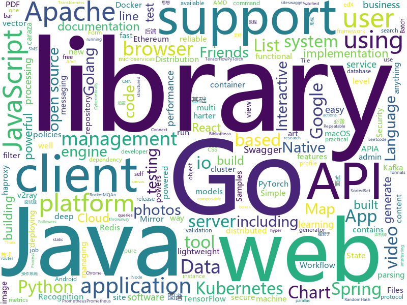

# 2019-11-27
See what the GitHub community is most excited about today.

## python
* [geo-heatmap](https://github.com/luka1199/geo-heatmap)(**77 stars today**): 🗺Generate an interactive geo heatmap from your Google location data
* [transformers](https://github.com/huggingface/transformers)(**70 stars today**): 🤗Transformers: State-of-the-art Natural Language Processing for TensorFlow 2.0 and PyTorch.
* [12306](https://github.com/testerSunshine/12306)(**34 stars today**): 12306智能刷票，订票
* [makesite](https://github.com/sunainapai/makesite)(**49 stars today**): Simple, lightweight, and magic-free static site/blog generator for Python coders
* [nni](https://github.com/microsoft/nni)(**23 stars today**): An open source AutoML toolkit for neural architecture search and hyper-parameter tuning.
* [bokeh](https://github.com/bokeh/bokeh)(**13 stars today**): Interactive Data Visualization in the browser, from Python
* [models](https://github.com/tensorflow/models)(**49 stars today**): Models and examples built with TensorFlow
* [readthedocs.org](https://github.com/readthedocs/readthedocs.org)(**4 stars today**): The source code that powers readthedocs.org
* [SlowFast](https://github.com/facebookresearch/SlowFast)(**10 stars today**): PySlowFast: video understanding codebase from FAIR for reproducing state-of-the-art video models.
* [Ultimate-Facebook-Scraper](https://github.com/harismuneer/Ultimate-Facebook-Scraper)(**133 stars today**): 🤖A bot which scrapes almost everything about a Facebook user's profile including all public posts/statuses available on the user's timeline, uploaded photos, tagged photos, videos, friends list and their profile photos (including Followers, Following, Work Friends, College Friends etc).
* [PySyft](https://github.com/OpenMined/PySyft)(**3 stars today**): A library for encrypted, privacy preserving machine learning
* [edx-platform](https://github.com/edx/edx-platform)(**3 stars today**): The Open edX platform, the software that powers edX!
* [content](https://github.com/demisto/content)(**0 stars today**): This repository contains all Demisto content and from here we share content updates
* [allennlp](https://github.com/allenai/allennlp)(**9 stars today**): An open-source NLP research library, built on PyTorch.
* [cloud-custodian](https://github.com/cloud-custodian/cloud-custodian)(**5 stars today**): Rules engine for cloud security, cost optimization, and governance, DSL in yaml for policies to query, filter, and take actions on resources
* [zero-to-jupyterhub-k8s](https://github.com/jupyterhub/zero-to-jupyterhub-k8s)(**1 stars today**): Helm Chart & Documentation for deploying JupyterHub on Kubernetes
* [setuptools](https://github.com/pypa/setuptools)(**1 stars today**): Official project repository for the Setuptools build system
* [WeasyPrint](https://github.com/Kozea/WeasyPrint)(**8 stars today**): WeasyPrint converts web documents (HTML with CSS, SVG, …) to PDF.
* [pydantic](https://github.com/samuelcolvin/pydantic)(**7 stars today**): Data parsing and validation using Python type hints
* [elasticsearch-dsl-py](https://github.com/elastic/elasticsearch-dsl-py)(**1 stars today**): High level Python client for Elasticsearch
* [anchore-engine](https://github.com/anchore/anchore-engine)(**4 stars today**): A service that analyzes docker images and applies user-defined acceptance policies to allow automated container image validation and certification
* [sagemaker-python-sdk](https://github.com/aws/sagemaker-python-sdk)(**1 stars today**): A library for training and deploying machine learning models on Amazon SageMaker
* [Mask_RCNN](https://github.com/matterport/Mask_RCNN)(**26 stars today**): Mask R-CNN for object detection and instance segmentation on Keras and TensorFlow
* [pytorch-tutorial](https://github.com/yunjey/pytorch-tutorial)(**35 stars today**): PyTorch Tutorial for Deep Learning Researchers
* [facenet](https://github.com/davidsandberg/facenet)(**10 stars today**): Face recognition using Tensorflow

## java
* [Jetpack-MVVM-Best-Practice](https://github.com/KunMinX/Jetpack-MVVM-Best-Practice)(**54 stars today**): 是 难得一见 的 Jetpack MVVM 最佳实践！在 蕴繁于简 的代码中，对 视图控制器 乃至 标准化开发模式 形成正确、深入的理解！
* [CS-Notes](https://github.com/CyC2018/CS-Notes)(**110 stars today**): 📚技术面试必备基础知识、Leetcode、Java、C++、Python、后端面试、计算机操作系统、计算机网络、系统设计
* [react-native-camera](https://github.com/react-native-community/react-native-camera)(**7 stars today**): A Camera component for React Native. Also supports barcode scanning!
* [cordova-plugin-background-mode](https://github.com/katzer/cordova-plugin-background-mode)(**0 stars today**): Keep app running in background
* [cordova-plugin-local-notifications](https://github.com/katzer/cordova-plugin-local-notifications)(**5 stars today**): Cordova Local-Notification Plugin
* [flowable-engine](https://github.com/flowable/flowable-engine)(**6 stars today**): A compact and highly efficient workflow and Business Process Management (BPM) platform for developers, system admins and business users.
* [pulsar](https://github.com/apache/pulsar)(**7 stars today**): Apache Pulsar - distributed pub-sub messaging system
* [spring-kafka](https://github.com/spring-projects/spring-kafka)(**1 stars today**): Provides Familiar Spring Abstractions for Apache Kafka
* [mapbox-navigation-android](https://github.com/mapbox/mapbox-navigation-android)(**0 stars today**): Mapbox Navigation SDK for Android
* [nuxeo](https://github.com/nuxeo/nuxeo)(**0 stars today**): Content management platform to build modern business applications
* [zeebe](https://github.com/zeebe-io/zeebe)(**4 stars today**): Distributed Workflow Engine for Microservices Orchestration
* [spring-security-react-ant-design-polls-app](https://github.com/callicoder/spring-security-react-ant-design-polls-app)(**1 stars today**): Full Stack Polls App built using Spring Boot, Spring Security, JWT, React, and Ant Design
* [MPAndroidChart](https://github.com/PhilJay/MPAndroidChart)(**16 stars today**): A powerful🚀Android chart view / graph view library, supporting line- bar- pie- radar- bubble- and candlestick charts as well as scaling, dragging and animations.
* [resilience4j](https://github.com/resilience4j/resilience4j)(**5 stars today**): Resilience4j is a fault tolerance library designed for Java8 and functional programming
* [uaa](https://github.com/cloudfoundry/uaa)(**1 stars today**): CloudFoundry User Account and Authentication (UAA) Server
* [bc-java](https://github.com/bcgit/bc-java)(**0 stars today**): Bouncy Castle Java Distribution (Mirror)
* [seata](https://github.com/seata/seata)(**31 stars today**): 🔥Seata is an easy-to-use, high-performance, open source distributed transaction solution.
* [rocketmq](https://github.com/apache/rocketmq)(**19 stars today**): Mirror of Apache RocketMQ
* [micrometer](https://github.com/micrometer-metrics/micrometer)(**3 stars today**): An application metrics facade for the most popular monitoring tools. Think SLF4J, but for metrics.
* [kafka-connect-jdbc](https://github.com/confluentinc/kafka-connect-jdbc)(**1 stars today**): Kafka Connect connector for JDBC-compatible databases
* [antlr4](https://github.com/antlr/antlr4)(**12 stars today**): ANTLR (ANother Tool for Language Recognition) is a powerful parser generator for reading, processing, executing, or translating structured text or binary files.
* [redisson](https://github.com/redisson/redisson)(**19 stars today**): Redisson - Redis Java client with features of In-Memory Data Grid. Supports over 30 objects and services: Set, Multimap, SortedSet, Map, List, Queue, Deque, Semaphore, Lock, AtomicLong, Map Reduce, Publish / Subscribe, Bloom filter, Spring Cache, Tomcat, Scheduler, JCache API, Hibernate, RPC.
* [jenkins](https://github.com/jenkinsci/jenkins)(**17 stars today**): Jenkins automation server
* [testcontainers-java](https://github.com/testcontainers/testcontainers-java)(**2 stars today**): Testcontainers is a Java library that supports JUnit tests, providing lightweight, throwaway instances of common databases, Selenium web browsers, or anything else that can run in a Docker container.
* [spring-cloud-dataflow](https://github.com/spring-cloud/spring-cloud-dataflow)(**1 stars today**): A microservices-based Streaming and Batch data processing in Cloud Foundry and Kubernetes

## unknown
* [Specs](https://github.com/CocoaPods/Specs)(**2 stars today**): The CocoaPods Master Repo
* [Production-Level-Deep-Learning](https://github.com/alirezadir/Production-Level-Deep-Learning)(**259 stars today**): A guideline for building practical production-level deep learning systems to be deployed in real world applications.
* [eng-practices](https://github.com/google/eng-practices)(**16 stars today**): Google's Engineering Practices documentation
* [vector-tile-spec](https://github.com/mapbox/vector-tile-spec)(**0 stars today**): Mapbox Vector Tile specification
* [KnowledgeGraphCourse](https://github.com/npubird/KnowledgeGraphCourse)(**13 stars today**): 东南大学《知识图谱》研究生课程
* [benchmark_results](https://github.com/foolwood/benchmark_results)(**3 stars today**): Visual Tracking Paper List
* [996.Leave](https://github.com/623637646/996.Leave)(**2 stars today**): 逃离996
* [AMD_Vanilla](https://github.com/AMD-OSX/AMD_Vanilla)(**3 stars today**): Native AMD macOS via Clover & OpenCore
* [Flutter-Course-Resources](https://github.com/londonappbrewery/Flutter-Course-Resources)(**7 stars today**): Learn to Code While Building Apps - The Complete Flutter Development Bootcamp
* [ansible-role-mysql](https://github.com/geerlingguy/ansible-role-mysql)(**0 stars today**): Ansible Role - MySQL
* [3y](https://github.com/ZhongFuCheng3y/3y)(**30 stars today**): 📓从Java基础、JavaWeb基础到常用的框架再到面试题都有完整的教程，几乎涵盖了Java后端必备的知识点
* [OnJava8](https://github.com/LingCoder/OnJava8)(**12 stars today**): 《On Java 8》中文版，又名《Java编程思想》 第5版
* [weekly](https://github.com/ruanyf/weekly)(**22 stars today**): 科技爱好者周刊，每周五发布
* [kubernetes-the-hard-way](https://github.com/kelseyhightower/kubernetes-the-hard-way)(**26 stars today**): Bootstrap Kubernetes the hard way on Google Cloud Platform. No scripts.
* [architect-awesome](https://github.com/xingshaocheng/architect-awesome)(**35 stars today**): 后端架构师技术图谱
* [Black-Friday-Deals](https://github.com/mRs-/Black-Friday-Deals)(**8 stars today**): Black Friday Deals for macOS / iOS Software & Books
* [the-art-of-command-line](https://github.com/jlevy/the-art-of-command-line)(**27 stars today**): Master the command line, in one page
* [computer-science](https://github.com/ossu/computer-science)(**31 stars today**): 🎓Path to a free self-taught education in Computer Science!
* [PSTeam](https://github.com/Bronce/PSTeam)(**3 stars today**): 
* [awesome-shodan-queries](https://github.com/jakejarvis/awesome-shodan-queries)(**8 stars today**): 🔍A collection of interesting, funny, and depressing search queries to plug into https://shodan.io/👩‍💻
* [Claymore-Dual-Miner](https://github.com/nanopool/Claymore-Dual-Miner)(**0 stars today**): Claymore's Dual Ethereum+Decred_Siacoin_Lbry AMD+NVIDIA GPU Miner
* [gy1](https://github.com/gyhhx/gy1)(****): 
* [nanominer](https://github.com/nanopool/nanominer)(**0 stars today**): Nanominer is a versatile tool for mining cryptocurrencies which are based on Ethash, Ubqhash, Cuckaroo29, CryptoNight (v6, v7, v8, R, ReverseWaltz) and RandomHash (PascalCoin) algorithms.
* [free-programming-books](https://github.com/EbookFoundation/free-programming-books)(**71 stars today**): 📚Freely available programming books
* [TouchBarPong](https://github.com/ferdinandl007/TouchBarPong)(**0 stars today**): And amazing new way of playing pong the touch bar of the new MacBook pro

## javascript
* [cypress](https://github.com/cypress-io/cypress)(**30 stars today**): Fast, easy and reliable testing for anything that runs in a browser.
* [svelte](https://github.com/sveltejs/svelte)(**113 stars today**): Cybernetically enhanced web apps
* [puppeteer](https://github.com/puppeteer/puppeteer)(**56 stars today**): Headless Chrome Node.js API
* [monaco-editor](https://github.com/microsoft/monaco-editor)(**10 stars today**): A browser based code editor
* [plugins](https://github.com/rollup/plugins)(**5 stars today**): 🍣The one-stop shop for official Rollup plugins
* [jitsi-meet](https://github.com/jitsi/jitsi-meet)(**12 stars today**): Jitsi Meet - Secure, Simple and Scalable Video Conferences that you use as a standalone app or embed in your web application.
* [mapbox-gl-js](https://github.com/mapbox/mapbox-gl-js)(**5 stars today**): Interactive, thoroughly customizable maps in the browser, powered by vector tiles and WebGL
* [pdfmake](https://github.com/bpampuch/pdfmake)(**12 stars today**): Client/server side PDF printing in pure JavaScript
* [pai](https://github.com/microsoft/pai)(**2 stars today**): Resource scheduling and cluster management for AI
* [formio.js](https://github.com/formio/formio.js)(**2 stars today**): JavaScript powered Forms with JSON Form Builder
* [async-storage](https://github.com/react-native-community/async-storage)(**9 stars today**): An asynchronous, persistent, key-value storage system for React Native.
* [yarn](https://github.com/yarnpkg/yarn)(**15 stars today**): 📦🐈Fast, reliable, and secure dependency management.
* [samples](https://github.com/dapr/samples)(**1 stars today**): Dapr Samples Repository
* [moment](https://github.com/moment/moment)(**9 stars today**): Parse, validate, manipulate, and display dates in javascript.
* [web3.js](https://github.com/ethereum/web3.js)(**6 stars today**): Ethereum JavaScript API
* [discord.js](https://github.com/discordjs/discord.js)(**6 stars today**): A powerful JavaScript library for interacting with the Discord API
* [ramda](https://github.com/ramda/ramda)(**9 stars today**): 🐏Practical functional Javascript
* [file-loader](https://github.com/webpack-contrib/file-loader)(**0 stars today**): File Loader
* [jest](https://github.com/facebook/jest)(**17 stars today**): Delightful JavaScript Testing.
* [cordova-ios](https://github.com/apache/cordova-ios)(**1 stars today**): Apache Cordova iOS
* [Chart.js](https://github.com/chartjs/Chart.js)(**20 stars today**): Simple HTML5 Charts using the <canvas> tag
* [pdf.js](https://github.com/mozilla/pdf.js)(**15 stars today**): PDF Reader in JavaScript
* [rollup](https://github.com/rollup/rollup)(**11 stars today**): Next-generation ES module bundler
* [razzle](https://github.com/jaredpalmer/razzle)(**5 stars today**): ✨Create server-rendered universal JavaScript applications with no configuration
* [pushgateway](https://github.com/prometheus/pushgateway)(**3 stars today**): Push acceptor for ephemeral and batch jobs.

## html
* [blog_os](https://github.com/phil-opp/blog_os)(**8 stars today**): Writing an OS in Rust
* [wpt](https://github.com/web-platform-tests/wpt)(**2 stars today**): Test suites for Web platform specs — including WHATWG, W3C, and others
* [rellax](https://github.com/dixonandmoe/rellax)(**5 stars today**): Lightweight, vanilla javascript parallax library
* [stickyfill](https://github.com/wilddeer/stickyfill)(**3 stars today**): Polyfill for CSS `position: sticky`
* [chosen](https://github.com/harvesthq/chosen)(**2 stars today**): Chosen is a library for making long, unwieldy select boxes more friendly.
* [bibanon](https://github.com/bibanon/bibanon)(**0 stars today**): The Bibliotheca Anonoma: A wikified library of the internet's treasures. Researching Something Awful, 2channel, 4chan, and other imageboard/textboard communities.
* [go101](https://github.com/go101/go101)(**4 stars today**): An online book focusing on Go syntax/semantics.
* [SynapseX](https://github.com/LoukaMB/SynapseX)(**0 stars today**): Synapse X information, API and bug tracker.
* [twofactorauth](https://github.com/2factorauth/twofactorauth)(**3 stars today**): List of sites with two factor auth support which includes SMS, email, phone calls, hardware, and software.
* [monaco-editor-samples](https://github.com/microsoft/monaco-editor-samples)(**0 stars today**): Samples for using the Monaco Editor
* [compat-table](https://github.com/kangax/compat-table)(**1 stars today**): ECMAScript 5/6/7 compatibility tables
* [caraza-harter-com](https://github.com/tylerharter/caraza-harter-com)(**0 stars today**): For www.caraza-harter.com and tyler.caraza-harter.com
* [orc](https://github.com/apache/orc)(**0 stars today**): Mirror of Apache Orc
* [Home](https://github.com/NuGet/Home)(**1 stars today**): Repo for NuGet Client issues
* [haproxy-boshrelease](https://github.com/cloudfoundry-incubator/haproxy-boshrelease)(**0 stars today**): A BOSH release for haproxy (based on cf-release's haproxy job)
* [glTF](https://github.com/KhronosGroup/glTF)(**3 stars today**): glTF – Runtime 3D Asset Delivery
* [grails-core](https://github.com/grails/grails-core)(**0 stars today**): The Grails Web Application Framework
* [cf-smoke-tests-release](https://github.com/cloudfoundry/cf-smoke-tests-release)(**0 stars today**): 
* [2019-10-8](https://github.com/nizp/2019-10-8)(**0 stars today**): 20191008课件
* [v2-ui](https://github.com/sprov065/v2-ui)(**8 stars today**): 支持多协议多用户的 v2ray 面板，Support multi-protocol multi-user v2ray panel
* [keycloak-documentation](https://github.com/keycloak/keycloak-documentation)(**0 stars today**): 
* [istio.io](https://github.com/istio/istio.io)(**3 stars today**): Source for the istio.io site
* [swagger-codegen](https://github.com/swagger-api/swagger-codegen)(**4 stars today**): swagger-codegen contains a template-driven engine to generate documentation, API clients and server stubs in different languages by parsing your OpenAPI / Swagger definition.
* [test_files](https://github.com/SheetJS/test_files)(**0 stars today**): 📚SheetJS Test Files (XLS/XLSX/XLSB and other spreadsheet formats)
* [tianocore.github.io](https://github.com/tianocore/tianocore.github.io)(**0 stars today**): Tianocore website

## go
* [gin](https://github.com/gin-gonic/gin)(**44 stars today**): Gin is a HTTP web framework written in Go (Golang). It features a Martini-like API with much better performance -- up to 40 times faster. If you need smashing performance, get yourself some Gin.
* [protobuf](https://github.com/golang/protobuf)(**8 stars today**): Go support for Google's protocol buffers
* [redis](https://github.com/go-redis/redis)(**13 stars today**): Type-safe Redis client for Golang
* [gin-swagger](https://github.com/swaggo/gin-swagger)(**6 stars today**): gin middleware to automatically generate RESTful API documentation with Swagger 2.0.
* [go-admin](https://github.com/GoAdminGroup/go-admin)(**18 stars today**): A dataviz framework help gopher to build a admin panel in ten minutes
* [websocket](https://github.com/gorilla/websocket)(**15 stars today**): A fast, well-tested and widely used WebSocket implementation for Go.
* [go-swagger](https://github.com/go-swagger/go-swagger)(**4 stars today**): Swagger 2.0 implementation for go
* [chat](https://github.com/tinode/chat)(**14 stars today**): Instant messaging server; backend in Go; iOS, Android, web, command line clients; chatbots
* [go-sqlmock](https://github.com/DATA-DOG/go-sqlmock)(**6 stars today**): Sql mock driver for golang to test database interactions
* [dep](https://github.com/golang/dep)(**6 stars today**): Go dependency management tool
* [govmomi](https://github.com/vmware/govmomi)(**3 stars today**): Go library for the VMware vSphere API
* [gardener](https://github.com/gardener/gardener)(**5 stars today**): Kubernetes-native system managing the full lifecycle of conformant Kubernetes clusters as a service on Alicloud, AWS, Azure, GCP, OpenStack, and Packet with minimal TCO.
* [skaffold](https://github.com/GoogleContainerTools/skaffold)(**13 stars today**): Easy and Repeatable Kubernetes Development
* [viper](https://github.com/spf13/viper)(**15 stars today**): Go configuration with fangs
* [gorm](https://github.com/jinzhu/gorm)(**30 stars today**): The fantastic ORM library for Golang, aims to be developer friendly
* [snmp_exporter](https://github.com/prometheus/snmp_exporter)(**1 stars today**): SNMP Exporter for Prometheus
* [client_golang](https://github.com/prometheus/client_golang)(**2 stars today**): Prometheus instrumentation library for Go applications
* [origin](https://github.com/openshift/origin)(**2 stars today**): The self-managing, auto-upgrading, Kubernetes distribution for everyone
* [chi](https://github.com/go-chi/chi)(**6 stars today**): lightweight, idiomatic and composable router for building Go HTTP services
* [quic-go](https://github.com/lucas-clemente/quic-go)(**11 stars today**): A QUIC implementation in pure go
* [apimachinery](https://github.com/kubernetes/apimachinery)(**0 stars today**): 
* [sarama](https://github.com/Shopify/sarama)(**7 stars today**): Sarama is a Go library for Apache Kafka 0.8, and up.
* [vegeta](https://github.com/tsenart/vegeta)(**42 stars today**): HTTP load testing tool and library. It's over 9000!
* [terraform-provider-helm](https://github.com/terraform-providers/terraform-provider-helm)(**3 stars today**): Terraform Helm provider
* [logrus](https://github.com/sirupsen/logrus)(**21 stars today**): Structured, pluggable logging for Go.

## WordCloud

