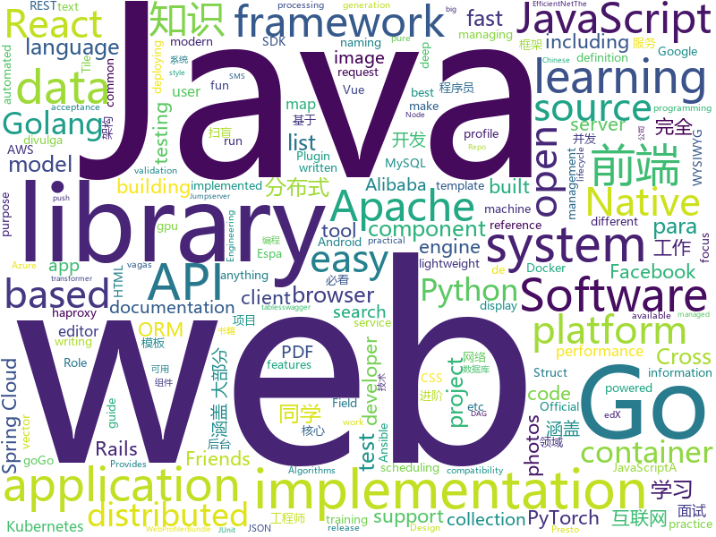

# 2019-11-28
See what the GitHub community is most excited about today.

## python
* [sherlock](https://github.com/sherlock-project/sherlock)(**92 stars today**): 🔎Find usernames across social networks
* [sagemaker-python-sdk](https://github.com/aws/sagemaker-python-sdk)(**1 stars today**): A library for training and deploying machine learning models on Amazon SageMaker
* [Corsy](https://github.com/s0md3v/Corsy)(**37 stars today**): CORS Misconfiguration Scanner
* [Ultimate-Facebook-Scraper](https://github.com/harismuneer/Ultimate-Facebook-Scraper)(**68 stars today**): 🤖A bot which scrapes almost everything about a Facebook user's profile including all public posts/statuses available on the user's timeline, uploaded photos, tagged photos, videos, friends list and their profile photos (including Followers, Following, Work Friends, College Friends etc).
* [sentry](https://github.com/getsentry/sentry)(**43 stars today**): Sentry is cross-platform application monitoring, with a focus on error reporting.
* [Machine-Learning-Yearning-Vietnamese-Translation](https://github.com/aivivn/Machine-Learning-Yearning-Vietnamese-Translation)(**5 stars today**): 
* [EfficientNet-PyTorch](https://github.com/lukemelas/EfficientNet-PyTorch)(**17 stars today**): A PyTorch implementation of EfficientNet
* [edx-platform](https://github.com/edx/edx-platform)(**3 stars today**): The Open edX platform, the software that powers edX!
* [kedro](https://github.com/quantumblacklabs/kedro)(**2 stars today**): A Python library that implements software engineering best-practice for data and ML pipelines.
* [dirsearch](https://github.com/maurosoria/dirsearch)(**21 stars today**): Web path scanner
* [confluent-kafka-python](https://github.com/confluentinc/confluent-kafka-python)(**3 stars today**): Confluent's Kafka Python Client
* [WeasyPrint](https://github.com/Kozea/WeasyPrint)(**10 stars today**): WeasyPrint converts web documents (HTML with CSS, SVG, …) to PDF.
* [SinGAN](https://github.com/tamarott/SinGAN)(**14 stars today**): Official pytorch implementation of the paper: "SinGAN: Learning a Generative Model from a Single Natural Image"
* [incubator-tvm](https://github.com/apache/incubator-tvm)(**9 stars today**): Open deep learning compiler stack for cpu, gpu and specialized accelerators
* [synapse](https://github.com/matrix-org/synapse)(**8 stars today**): Synapse: Matrix reference homeserver
* [celery](https://github.com/celery/celery)(**8 stars today**): Distributed Task Queue (development branch)
* [nboost](https://github.com/koursaros-ai/nboost)(**21 stars today**): NBoost is a scalable, search-api-boosting platform for deploying transformer models to improve the relevance of search results on different platforms (i.e. Elasticsearch)
* [gpytorch](https://github.com/cornellius-gp/gpytorch)(**1 stars today**): A highly efficient and modular implementation of Gaussian Processes in PyTorch
* [allennlp](https://github.com/allenai/allennlp)(**11 stars today**): An open-source NLP research library, built on PyTorch.
* [kafka-python](https://github.com/dpkp/kafka-python)(**2 stars today**): Python client for Apache Kafka
* [bokeh](https://github.com/bokeh/bokeh)(**24 stars today**): Interactive Data Visualization in the browser, from Python
* [ParlAI](https://github.com/facebookresearch/ParlAI)(**6 stars today**): A framework for training and evaluating AI models on a variety of openly available dialogue datasets.
* [anchore-engine](https://github.com/anchore/anchore-engine)(**2 stars today**): A service that analyzes docker images and applies user-defined acceptance policies to allow automated container image validation and certification
* [vsphere-automation-sdk-python](https://github.com/vmware/vsphere-automation-sdk-python)(**2 stars today**): Python samples, language bindings, and API reference documentation for vSphere, VMC, and NSX-T using the VMware REST API
* [python-for-android](https://github.com/kivy/python-for-android)(**13 stars today**): Turn your Python application into an Android APK

## java
* [Mindustry](https://github.com/Anuken/Mindustry)(**43 stars today**): A sandbox tower defense game
* [mockito](https://github.com/mockito/mockito)(**16 stars today**): Most popular Mocking framework for unit tests written in Java
* [react-native-webview](https://github.com/react-native-community/react-native-webview)(**5 stars today**): React Native Cross-Platform WebView
* [elasticsearch](https://github.com/elastic/elasticsearch)(**30 stars today**): Open Source, Distributed, RESTful Search Engine
* [pulsar](https://github.com/apache/pulsar)(**7 stars today**): Apache Pulsar - distributed pub-sub messaging system
* [springcloud-learning](https://github.com/macrozheng/springcloud-learning)(**16 stars today**): 一套涵盖大部分核心组件使用的Spring Cloud教程，包括Spring Cloud Alibaba及分布式事务Seata，基于Spring Cloud Greenwich及SpringBoot 2.1.7。20篇文章，篇篇精华，30个Demo，涵盖大部分应用场景。
* [json](https://github.com/flori/json)(**0 stars today**): JSON implementation for Ruby
* [hive](https://github.com/apache/hive)(**3 stars today**): Apache Hive
* [Nukkit](https://github.com/NukkitX/Nukkit)(**1 stars today**): Nuclear-Powered Server Software for Minecraft: Bedrock Edition.
* [JavaGuide](https://github.com/Snailclimb/JavaGuide)(**342 stars today**): 【Java学习+面试指南】 一份涵盖大部分Java程序员所需要掌握的核心知识。
* [Java](https://github.com/TheAlgorithms/Java)(**79 stars today**): All Algorithms implemented in Java
* [canal](https://github.com/alibaba/canal)(**22 stars today**): 阿里巴巴 MySQL binlog 增量订阅&消费组件
* [java-design-patterns](https://github.com/iluwatar/java-design-patterns)(**49 stars today**): Design patterns implemented in Java
* [dubbo-spring-boot-project](https://github.com/apache/dubbo-spring-boot-project)(**6 stars today**): Spring Boot Project for Apache Dubbo
* [calcite](https://github.com/apache/calcite)(**3 stars today**): Mirror of Apache Calcite
* [HanLP](https://github.com/hankcs/HanLP)(**27 stars today**): 自然语言处理 中文分词 词性标注 命名实体识别 依存句法分析 新词发现 关键词短语提取 自动摘要 文本分类聚类 拼音简繁
* [phonegap-plugin-push](https://github.com/phonegap/phonegap-plugin-push)(**1 stars today**): Register and receive push notifications
* [testcontainers-java](https://github.com/testcontainers/testcontainers-java)(**7 stars today**): Testcontainers is a Java library that supports JUnit tests, providing lightweight, throwaway instances of common databases, Selenium web browsers, or anything else that can run in a Docker container.
* [presto](https://github.com/prestosql/presto)(**2 stars today**): Official home of the community managed version of Presto, the distributed SQL query engine for big data, under the auspices of the Presto Software Foundation.
* [maps](https://github.com/react-native-mapbox-gl/maps)(**1 stars today**): A Mapbox GL react native module for creating custom maps
* [advanced-java](https://github.com/doocs/advanced-java)(**95 stars today**): 😮互联网 Java 工程师进阶知识完全扫盲：涵盖高并发、分布式、高可用、微服务、海量数据处理等领域知识，后端同学必看，前端同学也可学习
* [arthas](https://github.com/alibaba/arthas)(**83 stars today**): Alibaba Java Diagnostic Tool Arthas/Alibaba Java诊断利器Arthas
* [storm](https://github.com/apache/storm)(**3 stars today**): Mirror of Apache Storm
* [react-native-fbsdk](https://github.com/facebook/react-native-fbsdk)(**1 stars today**): A React Native wrapper around the Facebook SDKs for Android and iOS. Provides access to Facebook login, sharing, graph requests, app events etc.
* [incubator-dolphinscheduler](https://github.com/apache/incubator-dolphinscheduler)(**14 stars today**): Dolphin Scheduler is a distributed and easy-to-expand visual DAG workflow scheduling system, dedicated to solving the complex dependencies in data processing, making the scheduling system out of the box for data processing.(分布式易扩展的可视化工作流任务调度)

## unknown
* [electron-ssr-backup](https://github.com/qingshuisiyuan/electron-ssr-backup)(**20 stars today**): electron-ssr原作者删除了这个伟大的项目，故备份了下来，不继续开发,且用且珍惜
* [JavaFamily](https://github.com/AobingJava/JavaFamily)(**201 stars today**): 【互联网一线大厂Java 工程师面试+学习指南】进阶知识完全扫盲：涵盖高并发、分布式、高可用、微服务等领域知识，作者风格幽默，看起来津津有味，把学习当做一种乐趣，何乐而不为，后端同学必看，前端同学我保证你也看得懂，看不懂你加我微信骂我渣男就好了。
* [react-typescript-cheatsheet](https://github.com/typescript-cheatsheets/react-typescript-cheatsheet)(**36 stars today**): Cheatsheets for experienced React developers getting started with TypeScript
* [Production-Level-Deep-Learning](https://github.com/alirezadir/Production-Level-Deep-Learning)(**218 stars today**): A guideline for building practical production-level deep learning systems to be deployed in real world applications.
* [ansible-role-nginx](https://github.com/geerlingguy/ansible-role-nginx)(**1 stars today**): Ansible Role - Nginx
* [AZ-103-MicrosoftAzureAdministrator](https://github.com/MicrosoftLearning/AZ-103-MicrosoftAzureAdministrator)(**0 stars today**): AZ-103: Microsoft Azure Administrator
* [vector-tile-spec](https://github.com/mapbox/vector-tile-spec)(**0 stars today**): Mapbox Vector Tile specification
* [awesome-naming](https://github.com/gruhn/awesome-naming)(**96 stars today**): A curated list for when naming things is done right.
* [955.WLB](https://github.com/formulahendry/955.WLB)(**13 stars today**): 955 不加班的公司名单 - 工作 955，work–life balance (工作与生活的平衡)
* [Specs](https://github.com/CocoaPods/Specs)(**2 stars today**): The CocoaPods Master Repo
* [awesome-programming-books](https://github.com/jobbole/awesome-programming-books)(**18 stars today**): 经典编程书籍大全，涵盖：计算机系统与网络、系统架构、算法与数据结构、前端开发、后端开发、移动开发、数据库、测试、项目与团队、程序员职业修炼、求职面试等
* [ansible-role-mysql](https://github.com/geerlingguy/ansible-role-mysql)(**0 stars today**): Ansible Role - MySQL
* [vagas](https://github.com/backend-br/vagas)(**1 stars today**): ✌️Espaço para divulgação de vagas para backenders
* [eng-practices](https://github.com/google/eng-practices)(**24 stars today**): Google's Engineering Practices documentation
* [OnJava8](https://github.com/LingCoder/OnJava8)(**29 stars today**): 《On Java 8》中文版，又名《Java编程思想》 第5版
* [weekly](https://github.com/dt-fe/weekly)(**15 stars today**): 前端精读周刊
* [gitignore](https://github.com/github/gitignore)(**71 stars today**): A collection of useful .gitignore templates
* [vagas](https://github.com/frontendbr/vagas)(**3 stars today**): 🔬Espaço para divulgação de vagas para front-enders.
* [FFXIV_ACT_Plugin](https://github.com/ravahn/FFXIV_ACT_Plugin)(**0 stars today**): FFXIV Plugin for Advanced Combat Tracker
* [awesome-lisp-languages](https://github.com/dundalek/awesome-lisp-languages)(**67 stars today**): A list of Lisp-flavored programming languages
* [nanominer](https://github.com/nanopool/nanominer)(**0 stars today**): Nanominer is a versatile tool for mining cryptocurrencies which are based on Ethash, Ubqhash, Cuckaroo29, CryptoNight (v6, v7, v8, R, ReverseWaltz) and RandomHash (PascalCoin) algorithms.
* [tessdata](https://github.com/tesseract-ocr/tessdata)(**8 stars today**): 
* [Claymore-Dual-Miner](https://github.com/nanopool/Claymore-Dual-Miner)(**0 stars today**): Claymore's Dual Ethereum+Decred_Siacoin_Lbry AMD+NVIDIA GPU Miner
* [PSTeam](https://github.com/Bronce/PSTeam)(**2 stars today**): 
* [1](https://github.com/1jie/1)(**8 stars today**): 这里是直播平台永久回家页，有最新app下载地址。

## javascript
* [jumpserver](https://github.com/jumpserver/jumpserver)(**30 stars today**): Jumpserver是全球首款完全开源的堡垒机，是符合 4A 的专业运维审计系统。
* [Vue.Draggable](https://github.com/SortableJS/Vue.Draggable)(**25 stars today**): Vue drag-and-drop component based on Sortable.js
* [frisby](https://github.com/vlucas/frisby)(**14 stars today**): Frisby is a REST API testing framework built on Jest that makes testing API endpoints easy, fast, and fun.
* [nuxt.js](https://github.com/nuxt/nuxt.js)(**25 stars today**): The Vue.js Framework
* [quill](https://github.com/quilljs/quill)(**13 stars today**): Quill is a modern WYSIWYG editor built for compatibility and extensibility.
* [mapbox-gl-js](https://github.com/mapbox/mapbox-gl-js)(**8 stars today**): Interactive, thoroughly customizable maps in the browser, powered by vector tiles and WebGL
* [openlayers](https://github.com/openlayers/openlayers)(**6 stars today**): OpenLayers
* [cypress](https://github.com/cypress-io/cypress)(**172 stars today**): Fast, easy and reliable testing for anything that runs in a browser.
* [lwc-recipes](https://github.com/trailheadapps/lwc-recipes)(**5 stars today**): A collection of easy-to-digest code examples for Lightning Web Components on Salesforce Platform
* [pdfkit](https://github.com/foliojs/pdfkit)(**9 stars today**): A JavaScript PDF generation library for Node and the browser
* [moment](https://github.com/moment/moment)(**14 stars today**): Parse, validate, manipulate, and display dates in javascript.
* [draft-js](https://github.com/facebook/draft-js)(**6 stars today**): A React framework for building text editors.
* [ramda](https://github.com/ramda/ramda)(**21 stars today**): 🐏Practical functional Javascript
* [intl-tel-input](https://github.com/jackocnr/intl-tel-input)(**3 stars today**): A JavaScript plugin for entering and validating international telephone numbers
* [pdfmake](https://github.com/bpampuch/pdfmake)(**26 stars today**): Client/server side PDF printing in pure JavaScript
* [flow-typed](https://github.com/flow-typed/flow-typed)(**0 stars today**): A central repository for Flow library definitions
* [layuimini](https://github.com/zhongshaofa/layuimini)(**4 stars today**): 后台admin前端模板，基于 layui 编写的最简洁、易用的后台框架模板。只需提供一个接口就直接初始化整个框架，无需复杂操作。
* [statsd](https://github.com/statsd/statsd)(**4 stars today**): Daemon for easy but powerful stats aggregation
* [kubernetes-external-secrets](https://github.com/godaddy/kubernetes-external-secrets)(**4 stars today**): Integrate external secret management systems with Kubernetes
* [awesome-react-native](https://github.com/jondot/awesome-react-native)(**17 stars today**): Awesome React Native components, news, tools, and learning material!
* [FileSaver.js](https://github.com/eligrey/FileSaver.js)(**13 stars today**): An HTML5 saveAs() FileSaver implementation
* [styled-components](https://github.com/styled-components/styled-components)(**24 stars today**): Visual primitives for the component age. Use the best bits of ES6 and CSS to style your apps without stress💅
* [incubator-superset](https://github.com/apache/incubator-superset)(**14 stars today**): Apache Superset (incubating) is a modern, enterprise-ready business intelligence web application
* [slick](https://github.com/kenwheeler/slick)(**11 stars today**): the last carousel you'll ever need
* [immutable-js](https://github.com/immutable-js/immutable-js)(**17 stars today**): Immutable persistent data collections for Javascript which increase efficiency and simplicity.

## html
* [machine-learning-systems-design](https://github.com/chiphuyen/machine-learning-systems-design)(**352 stars today**): A booklet on machine learning systems design with exercises
* [free-for-dev](https://github.com/ripienaar/free-for-dev)(**75 stars today**): A list of SaaS, PaaS and IaaS offerings that have free tiers of interest to devops and infradev
* [fastText](https://github.com/facebookresearch/fastText)(**11 stars today**): Library for fast text representation and classification.
* [technical-books](https://github.com/doocs/technical-books)(**9 stars today**): 😆国内外互联网技术大牛们都写了哪些书籍：计算机基础、网络、前端、后端、数据库、架构、大数据、深度学习...
* [blog_os](https://github.com/phil-opp/blog_os)(**11 stars today**): Writing an OS in Rust
* [styleguide](https://github.com/google/styleguide)(**9 stars today**): Style guides for Google-originated open-source projects
* [openshift-docs](https://github.com/openshift/openshift-docs)(**0 stars today**): OpenShift Documentation
* [embeddedsw](https://github.com/Xilinx/embeddedsw)(**0 stars today**): Xilinx Embedded Software (embeddedsw) Development
* [twofactorauth](https://github.com/2factorauth/twofactorauth)(**2 stars today**): List of sites with two factor auth support which includes SMS, email, phone calls, hardware, and software.
* [blog](https://github.com/biaochenxuying/blog)(**24 stars today**): 大前端技术为主，读书笔记、随笔、理财为辅，做个终身学习者。
* [bandinchina](https://github.com/caffeine-overload/bandinchina)(**2 stars today**): Naming and shaming companies who kowtow to Chinese censorship requests
* [wysiwyg-editor](https://github.com/froala/wysiwyg-editor)(**2 stars today**): The next generation Javascript WYSIWYG HTML Editor.
* [go101](https://github.com/go101/go101)(**4 stars today**): An online book focusing on Go syntax/semantics.
* [webdevbootcamp](https://github.com/nax3t/webdevbootcamp)(**1 stars today**): All source code for back-end projects from the Web Developer Bootcamp
* [keycloak-documentation](https://github.com/keycloak/keycloak-documentation)(**1 stars today**): 
* [serenity-core](https://github.com/serenity-bdd/serenity-core)(**0 stars today**): Serenity BDD is a test automation library designed to make writing automated acceptance tests easier, and more fun.
* [haproxy-boshrelease](https://github.com/cloudfoundry-incubator/haproxy-boshrelease)(**0 stars today**): A BOSH release for haproxy (based on cf-release's haproxy job)
* [twitter-bootstrap-rails](https://github.com/seyhunak/twitter-bootstrap-rails)(**1 stars today**): Twitter Bootstrap for Rails 6.0, Rails 5 - Rails 4.x Asset Pipeline
* [compat-table](https://github.com/kangax/compat-table)(**4 stars today**): ECMAScript 5/6/7 compatibility tables
* [swagger-codegen](https://github.com/swagger-api/swagger-codegen)(**6 stars today**): swagger-codegen contains a template-driven engine to generate documentation, API clients and server stubs in different languages by parsing your OpenAPI / Swagger definition.
* [SynapseX](https://github.com/LoukaMB/SynapseX)(**0 stars today**): Synapse X information, API and bug tracker.
* [web-profiler-bundle](https://github.com/symfony/web-profiler-bundle)(**5 stars today**): The WebProfilerBundle provides detailed technical information about each request execution and displays it in both the web debug toolbar and the profiler.
* [tiny-slider](https://github.com/ganlanyuan/tiny-slider)(**7 stars today**): Vanilla javascript slider for all purposes.
* [grails-core](https://github.com/grails/grails-core)(**1 stars today**): The Grails Web Application Framework
* [flutter-in-action](https://github.com/flutterchina/flutter-in-action)(**7 stars today**): 《Flutter实战》电子书

## go
* [quic-go](https://github.com/lucas-clemente/quic-go)(**12 stars today**): A QUIC implementation in pure go
* [dep](https://github.com/golang/dep)(**10 stars today**): Go dependency management tool
* [protobuf](https://github.com/golang/protobuf)(**48 stars today**): Go support for Google's protocol buffers
* [gorm](https://github.com/jinzhu/gorm)(**25 stars today**): The fantastic ORM library for Golang, aims to be developer friendly
* [grpc-go](https://github.com/grpc/grpc-go)(**9 stars today**): The Go language implementation of gRPC. HTTP/2 based RPC
* [gin](https://github.com/gin-gonic/gin)(**83 stars today**): Gin is a HTTP web framework written in Go (Golang). It features a Martini-like API with much better performance -- up to 40 times faster. If you need smashing performance, get yourself some Gin.
* [aws-sdk-go](https://github.com/aws/aws-sdk-go)(**5 stars today**): AWS SDK for the Go programming language.
* [spark-on-k8s-operator](https://github.com/GoogleCloudPlatform/spark-on-k8s-operator)(**1 stars today**): Kubernetes operator for managing the lifecycle of Apache Spark applications on Kubernetes.
* [testify](https://github.com/stretchr/testify)(**13 stars today**): A toolkit with common assertions and mocks that plays nicely with the standard library
* [migrate](https://github.com/golang-migrate/migrate)(**8 stars today**): Database migrations. CLI and Golang library.
* [websocket](https://github.com/gorilla/websocket)(**26 stars today**): A fast, well-tested and widely used WebSocket implementation for Go.
* [ultimate-go](https://github.com/hoanhan101/ultimate-go)(**35 stars today**): Ultimate Go study guide, with heavily documented code and programs analysis all in 1 place →
* [statsd_exporter](https://github.com/prometheus/statsd_exporter)(**0 stars today**): StatsD to Prometheus metrics exporter
* [go-swagger](https://github.com/go-swagger/go-swagger)(**10 stars today**): Swagger 2.0 implementation for go
* [gardener](https://github.com/gardener/gardener)(**5 stars today**): Kubernetes-native system managing the full lifecycle of conformant Kubernetes clusters as a service on Alicloud, AWS, Azure, GCP, OpenStack, and Packet with minimal TCO.
* [easyjson](https://github.com/mailru/easyjson)(**4 stars today**): Fast JSON serializer for golang.
* [chi](https://github.com/go-chi/chi)(**9 stars today**): lightweight, idiomatic and composable router for building Go HTTP services
* [opa](https://github.com/open-policy-agent/opa)(**4 stars today**): An open source, general-purpose policy engine.
* [gorp](https://github.com/go-gorp/gorp)(**0 stars today**): Go Relational Persistence - an ORM-ish library for Go
* [viper](https://github.com/spf13/viper)(**16 stars today**): Go configuration with fangs
* [redis](https://github.com/go-redis/redis)(**49 stars today**): Type-safe Redis client for Golang
* [gotty](https://github.com/yudai/gotty)(**16 stars today**): Share your terminal as a web application
* [validator](https://github.com/go-playground/validator)(**12 stars today**): 💯Go Struct and Field validation, including Cross Field, Cross Struct, Map, Slice and Array diving
* [moby](https://github.com/moby/moby)(**22 stars today**): Moby Project - a collaborative project for the container ecosystem to assemble container-based systems
* [pg](https://github.com/go-pg/pg)(**6 stars today**): Golang ORM with focus on PostgreSQL features and performance

## WordCloud

