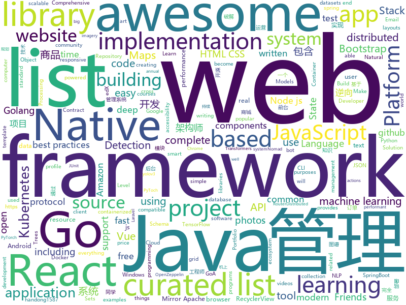

# 2019-11-29
See what the GitHub community is most excited about today.

## python
* [dimensionality_reduction_alo_codes](https://github.com/heucoder/dimensionality_reduction_alo_codes)(**39 stars today**): PCA、LDA、MDS、LLE、TSNE等降维算法的python实现
* [sagemaker-python-sdk](https://github.com/aws/sagemaker-python-sdk)(**31 stars today**): A library for training and deploying machine learning models on Amazon SageMaker
* [12306](https://github.com/testerSunshine/12306)(**22 stars today**): 12306智能刷票，订票
* [NLP-progress](https://github.com/sebastianruder/NLP-progress)(**71 stars today**): Repository to track the progress in Natural Language Processing (NLP), including the datasets and the current state-of-the-art for the most common NLP tasks.
* [multi-v2ray](https://github.com/Jrohy/multi-v2ray)(**22 stars today**): v2ray easy delpoy & manage tool， support multiple user & protocol manage
* [efficientdet](https://github.com/SweetyTian/efficientdet)(**7 stars today**): unofficial EffcientDet implemented by mmdetection
* [confluent-kafka-python](https://github.com/confluentinc/confluent-kafka-python)(**4 stars today**): Confluent's Kafka Python Client
* [keras](https://github.com/keras-team/keras)(**38 stars today**): Deep Learning for humans
* [sentry](https://github.com/getsentry/sentry)(**111 stars today**): Sentry is cross-platform application monitoring, with a focus on error reporting.
* [models](https://github.com/tensorflow/models)(**56 stars today**): Models and examples built with TensorFlow
* [sherlock](https://github.com/sherlock-project/sherlock)(**230 stars today**): 🔎Find usernames across social networks
* [KubeOperator](https://github.com/KubeOperator/KubeOperator)(**35 stars today**): KubeOperator 是一个开源项目，通过 Web UI 在 VMware、OpenStack 和物理机上规划、部署和运营生产级别的 Kubernetes 集群。支持内网离线环境，已通过 CNCF 的 Kubernetes 软件一致性认证。
* [yolov3-channel-and-layer-pruning](https://github.com/tanluren/yolov3-channel-and-layer-pruning)(**33 stars today**): yolov3 channel and layer pruning
* [amazon-price-tracker](https://github.com/Den4200/amazon-price-tracker)(**9 stars today**): An amazon price tracker that will send you alerts when an item goes below your target price.
* [legu_unpacker_2019](https://github.com/quarkslab/legu_unpacker_2019)(**13 stars today**): Scripts to unpack APK protected by Legu
* [gen-efficientnet-pytorch](https://github.com/rwightman/gen-efficientnet-pytorch)(**13 stars today**): Pretrained EfficientNet, MixNet, MobileNetV3, MNASNet A1 and B1, FBNet, Single-Path NAS
* [Ultimate-Facebook-Scraper](https://github.com/harismuneer/Ultimate-Facebook-Scraper)(**116 stars today**): 🤖A bot which scrapes almost everything about a Facebook user's profile including all public posts/statuses available on the user's timeline, uploaded photos, tagged photos, videos, friends list and their profile photos (including Followers, Following, Work Friends, College Friends etc).
* [ray](https://github.com/ray-project/ray)(**32 stars today**): A fast and simple framework for building and running distributed applications. Ray is packaged with RLlib, a scalable reinforcement learning library, and Tune, a scalable hyperparameter tuning library.
* [RSNA2019_1st_place_solution](https://github.com/SeuTao/RSNA2019_1st_place_solution)(**12 stars today**): RSNA2019 Intracranial Hemorrhage Detection
* [transformers](https://github.com/huggingface/transformers)(**85 stars today**): 🤗Transformers: State-of-the-art Natural Language Processing for TensorFlow 2.0 and PyTorch.
* [FIDL](https://github.com/fireeye/FIDL)(**47 stars today**): A sane API for IDA Pro's decompiler. Useful for malware RE and vulnerability research
* [mlflow](https://github.com/mlflow/mlflow)(**15 stars today**): Open source platform for the machine learning lifecycle
* [facenet](https://github.com/davidsandberg/facenet)(**10 stars today**): Face recognition using Tensorflow
* [FATE](https://github.com/FederatedAI/FATE)(**8 stars today**): An Industrial Level Federated Learning Framework
* [edx-platform](https://github.com/edx/edx-platform)(**4 stars today**): The Open edX platform, the software that powers edX!

## java
* [Jetpack-MVVM-Best-Practice](https://github.com/KunMinX/Jetpack-MVVM-Best-Practice)(**26 stars today**): 是 难得一见 的 Jetpack MVVM 最佳实践！在 蕴繁于简 的代码中，对 视图控制器 乃至 标准化开发模式 形成正确、深入的理解！
* [storm](https://github.com/apache/storm)(**2 stars today**): Mirror of Apache Storm
* [elasticsearch](https://github.com/elastic/elasticsearch)(**35 stars today**): Open Source, Distributed, RESTful Search Engine
* [advanced-java](https://github.com/doocs/advanced-java)(**102 stars today**): 😮互联网 Java 工程师进阶知识完全扫盲：涵盖高并发、分布式、高可用、微服务、海量数据处理等领域知识，后端同学必看，前端同学也可学习
* [calcite](https://github.com/apache/calcite)(**6 stars today**): Mirror of Apache Calcite
* [k-9](https://github.com/k9mail/k-9)(**17 stars today**): K-9 Mail – An Email app for Android
* [quarkus-quickstarts](https://github.com/quarkusio/quarkus-quickstarts)(**2 stars today**): Quarkus quickstart code
* [arthas](https://github.com/alibaba/arthas)(**52 stars today**): Alibaba Java Diagnostic Tool Arthas/Alibaba Java诊断利器Arthas
* [testcontainers-java](https://github.com/testcontainers/testcontainers-java)(**3 stars today**): Testcontainers is a Java library that supports JUnit tests, providing lightweight, throwaway instances of common databases, Selenium web browsers, or anything else that can run in a Docker container.
* [spring-boot](https://github.com/spring-projects/spring-boot)(**34 stars today**): Spring Boot
* [react-native-webview](https://github.com/react-native-community/react-native-webview)(**7 stars today**): React Native Cross-Platform WebView
* [SpringCloud](https://github.com/zhoutaoo/SpringCloud)(**36 stars today**): 基于SpringCloud2.1的微服务开发脚手架，整合了spring-security-oauth2、nacos、feign、sentinel、springcloud-gateway等。服务治理方面引入elasticsearch、skywalking、springboot-admin、zipkin等，让项目开发快速进入业务开发，而不需过多时间花费在架构搭建上。持续更新中
* [vlayout](https://github.com/alibaba/vlayout)(**7 stars today**): Project vlayout is a powerfull LayoutManager extension for RecyclerView, it provides a group of layouts for RecyclerView. Make it able to handle a complicate situation when grid, list and other layouts in the same recyclerview.
* [ballerina-lang](https://github.com/ballerina-platform/ballerina-lang)(**2 stars today**): The Ballerina Programming Language
* [schema-registry](https://github.com/confluentinc/schema-registry)(**0 stars today**): Confluent Schema Registry for Kafka
* [react-native-navigation](https://github.com/wix/react-native-navigation)(**10 stars today**): A complete native navigation solution for React Native
* [okhttp](https://github.com/square/okhttp)(**21 stars today**): An HTTP client for Android, Kotlin, and Java.
* [dubbo](https://github.com/apache/dubbo)(**18 stars today**): Apache Dubbo is a high-performance, java based, open source RPC framework.
* [jna](https://github.com/java-native-access/jna)(**4 stars today**): Java Native Access
* [storage-samples](https://github.com/android/storage-samples)(**5 stars today**): Multiple samples showing the best practices in storage APIs on Android.
* [zeppelin](https://github.com/apache/zeppelin)(**3 stars today**): Mirror of Apache Zeppelin
* [mockito](https://github.com/mockito/mockito)(**54 stars today**): Most popular Mocking framework for unit tests written in Java
* [android-samples](https://github.com/googlemaps/android-samples)(**3 stars today**): Samples demonstrating how to use Maps SDK for Android
* [mall](https://github.com/macrozheng/mall)(**70 stars today**): mall项目是一套电商系统，包括前台商城系统及后台管理系统，基于SpringBoot+MyBatis实现。 前台商城系统包含首页门户、商品推荐、商品搜索、商品展示、购物车、订单流程、会员中心、客户服务、帮助中心等模块。 后台管理系统包含商品管理、订单管理、会员管理、促销管理、运营管理、内容管理、统计报表、财务管理、权限管理、设置等模块。
* [toBeTopJavaer](https://github.com/hollischuang/toBeTopJavaer)(**21 stars today**): To Be Top Javaer - Java工程师成神之路

## unknown
* [Production-Level-Deep-Learning](https://github.com/alirezadir/Production-Level-Deep-Learning)(**153 stars today**): A guideline for building practical production-level deep learning systems to be deployed in real world applications.
* [Flutter-Course-Resources](https://github.com/londonappbrewery/Flutter-Course-Resources)(**5 stars today**): Learn to Code While Building Apps - The Complete Flutter Development Bootcamp
* [awesome-cpp](https://github.com/fffaraz/awesome-cpp)(**87 stars today**): A curated list of awesome C++ (or C) frameworks, libraries, resources, and shiny things. Inspired by awesome-... stuff.
* [Awesome](https://github.com/Awesome-Windows/Awesome)(**30 stars today**): 💻An awesome & curated list of best applications and tools for Windows.
* [specials](https://github.com/RPiList/specials)(**5 stars today**): 
* [weekly](https://github.com/ruanyf/weekly)(**62 stars today**): 科技爱好者周刊，每周五发布
* [awesome-lisp-languages](https://github.com/dundalek/awesome-lisp-languages)(**23 stars today**): A list of Lisp-flavored programming languages
* [notable](https://github.com/notable/notable)(**39 stars today**): The Markdown-based note-taking app that doesn't suck.
* [awesome-architecture](https://github.com/toutiaoio/awesome-architecture)(**38 stars today**): 架构师技术图谱，助你早日成为架构师
* [smartdns](https://github.com/pymumu/smartdns)(**16 stars today**): smart dns server
* [architect-awesome](https://github.com/xingshaocheng/architect-awesome)(**37 stars today**): 后端架构师技术图谱
* [awesome-vue](https://github.com/vuejs/awesome-vue)(**51 stars today**): 🎉A curated list of awesome things related to Vue.js
* [awesome-actions](https://github.com/sdras/awesome-actions)(**40 stars today**): A curated list of awesome actions to use on GitHub
* [javascript-testing-best-practices](https://github.com/goldbergyoni/javascript-testing-best-practices)(**19 stars today**): 📗🌐🚢Comprehensive and exhaustive JavaScript & Node.js testing best practices (August 2019)
* [awesome-object-detection](https://github.com/amusi/awesome-object-detection)(**44 stars today**): Awesome Object Detection based on handong1587 github: https://handong1587.github.io/deep_learning/2015/10/09/object-detection.html
* [awesome-satellite-imagery-datasets](https://github.com/chrieke/awesome-satellite-imagery-datasets)(**6 stars today**): List of satellite imagery datasets with annotations for computer vision and deep learning
* [udacity-nanodegrees](https://github.com/mikesprague/udacity-nanodegrees)(**4 stars today**): 🎓List of Udacity Nanodegree programs with links to the free courses in their curricula
* [awesome-laravel](https://github.com/chiraggude/awesome-laravel)(**10 stars today**): A curated list of bookmarks, packages, tutorials, videos and other cool resources from the Laravel ecosystem
* [free-programming-books-zh_CN](https://github.com/justjavac/free-programming-books-zh_CN)(**126 stars today**): 📚免费的计算机编程类中文书籍，欢迎投稿
* [prometheus](https://github.com/vegasbrianc/prometheus)(**4 stars today**): A docker-compose stack for Prometheus monitoring
* [machine-learning-for-software-engineers](https://github.com/ZuzooVn/machine-learning-for-software-engineers)(**9 stars today**): A complete daily plan for studying to become a machine learning engineer.
* [awesome-wechat-weapp](https://github.com/justjavac/awesome-wechat-weapp)(**40 stars today**): 微信小程序开发资源汇总💯
* [awesome-dotnet](https://github.com/quozd/awesome-dotnet)(**14 stars today**): A collection of awesome .NET libraries, tools, frameworks and software
* [3D-Machine-Learning](https://github.com/timzhang642/3D-Machine-Learning)(**14 stars today**): A resource repository for 3D machine learning
* [DB](https://github.com/MhLiao/DB)(**12 stars today**): A PyToch implementation of "Real-time Scene Text Detection with Differentiable Binarization".

## javascript
* [ARC](https://github.com/fchollet/ARC)(**20 stars today**): The Abstraction and Reasoning Corpus
* [jumpserver](https://github.com/jumpserver/jumpserver)(**240 stars today**): Jumpserver是全球首款完全开源的堡垒机，是符合 4A 的专业运维审计系统。
* [blocks](https://github.com/blocks/blocks)(**233 stars today**): A JSX-based page builder for creating beautiful websites without writing code
* [Advanced-React](https://github.com/wesbos/Advanced-React)(**8 stars today**): Starter Files and Solutions for Full Stack Advanced React and GraphQL
* [atom](https://github.com/atom/atom)(**18 stars today**): The hackable text editor
* [kubernetes-external-secrets](https://github.com/godaddy/kubernetes-external-secrets)(**5 stars today**): Integrate external secret management systems with Kubernetes
* [awesome-mac](https://github.com/jaywcjlove/awesome-mac)(**50 stars today**):  Now we have become very big, Different from the original idea. Collect premium software in various categories.
* [gatsby](https://github.com/gatsbyjs/gatsby)(**36 stars today**): Build blazing fast, modern apps and websites with React
* [puppeteer](https://github.com/puppeteer/puppeteer)(**46 stars today**): Headless Chrome Node.js API
* [reactotron](https://github.com/infinitered/reactotron)(**10 stars today**): A desktop app for inspecting your React JS and React Native projects. macOS, Linux, and Windows.
* [bootstrap](https://github.com/twbs/bootstrap)(**59 stars today**): The most popular HTML, CSS, and JavaScript framework for developing responsive, mobile first projects on the web.
* [vue-cli](https://github.com/vuejs/vue-cli)(**27 stars today**): 🛠️Standard Tooling for Vue.js Development
* [roughViz](https://github.com/jwilber/roughViz)(**1,488 stars today**): Reusable JavaScript library for creating sketchy/hand-drawn styled charts in the browser.
* [openzeppelin-contracts](https://github.com/OpenZeppelin/openzeppelin-contracts)(**3 stars today**): OpenZeppelin Contracts is a library for secure smart contract development.
* [react-i18next](https://github.com/i18next/react-i18next)(**4 stars today**): Internationalization for react done right. Using the i18next i18n ecosystem.
* [mapbox-gl-js](https://github.com/mapbox/mapbox-gl-js)(**10 stars today**): Interactive, thoroughly customizable maps in the browser, powered by vector tiles and WebGL
* [jsonform](https://github.com/jsonform/jsonform)(**4 stars today**): Build forms from JSON Schema. Easily template-able. Compatible with Bootstrap 3 out of the box.
* [deck.gl](https://github.com/uber/deck.gl)(**4 stars today**): WebGL2 powered geospatial visualization layers
* [react-native](https://github.com/facebook/react-native)(**29 stars today**): A framework for building native apps with React.
* [cleave.js](https://github.com/nosir/cleave.js)(**10 stars today**): Format input text content when you are typing...
* [frida-qbdi-fuzzer](https://github.com/andreafioraldi/frida-qbdi-fuzzer)(**25 stars today**): This experimetal fuzzer is meant to be used for API in-memory fuzzing on Android.
* [bootstrap-vue](https://github.com/bootstrap-vue/bootstrap-vue)(**7 stars today**): BootstrapVue, with over 40 plugins and more than 80 custom components, provides one of the most comprehensive implementations of Bootstrap v4 components and grid system for Vue.js. With extensive and automated WAI-ARIA accessibility markup.
* [lwc-recipes](https://github.com/trailheadapps/lwc-recipes)(**6 stars today**): A collection of easy-to-digest code examples for Lightning Web Components on Salesforce Platform
* [hiring-without-whiteboards](https://github.com/poteto/hiring-without-whiteboards)(**22 stars today**): ⭐️Companies that don't have a broken hiring process
* [yapi](https://github.com/YMFE/yapi)(**23 stars today**): YApi 是一个可本地部署的、打通前后端及QA的、可视化的接口管理平台

## html
* [machine-learning-systems-design](https://github.com/chiphuyen/machine-learning-systems-design)(**531 stars today**): A booklet on machine learning systems design with exercises
* [PortFolio_Website](https://github.com/akashyap2013/PortFolio_Website)(**2 stars today**): Complete Portfolio Website with Bootstrap - HTML/CSS In this project, we are going to learn and build how to create a complete portfolio website with bootstrap using HTML and CSS. We will understand everything from scratch.
* [blog_os](https://github.com/phil-opp/blog_os)(**15 stars today**): Writing an OS in Rust
* [responsive-html-email-template](https://github.com/leemunroe/responsive-html-email-template)(**9 stars today**): A free simple responsive HTML email template
* [REKCARC-TSC-UHT](https://github.com/PKUanonym/REKCARC-TSC-UHT)(**19 stars today**): 清华大学计算机系课程攻略 Guidance for courses in Department of Computer Science and Technology, Tsinghua University
* [en.javascript.info](https://github.com/javascript-tutorial/en.javascript.info)(**6 stars today**): Modern JavaScript Tutorial
* [twemoji](https://github.com/twitter/twemoji)(**6 stars today**): Emoji for everyone. https://twemoji.twitter.com/
* [stickyfill](https://github.com/wilddeer/stickyfill)(**0 stars today**): Polyfill for CSS `position: sticky`
* [kyle-school](https://github.com/zzsza/kyle-school)(**6 stars today**): 쏘카 데이터 그룹 사내 신입/인턴을 대상으로 한 카일 스쿨
* [awesome-resume](https://github.com/resumejob/awesome-resume)(**65 stars today**): 包含简历常用例句
* [almanac.httparchive.org](https://github.com/HTTPArchive/almanac.httparchive.org)(**4 stars today**): HTTP Archive's annual "State of the Web" report made by the web community
* [Review_Reverse](https://github.com/lateautumn4lin/Review_Reverse)(**0 stars today**): 😀2019年末总结下今年做过的逆向，复习下思路。👺WEB淘宝sign逆向破解；😺努比亚Cookie生成逆向分析；🙌百度指数data加密破解
* [Spoon-Knife](https://github.com/octocat/Spoon-Knife)(**1 stars today**): This repo is for demonstration purposes only.
* [AIBootcamp-2019](https://github.com/DataScienceNigeria/AIBootcamp-2019)(**3 stars today**): AI bootcamp 2019 materials.
* [WebFundamentals](https://github.com/google/WebFundamentals)(**6 stars today**): Best practices for modern web development
* [Front-end-Developer-Interview-Questions](https://github.com/h5bp/Front-end-Developer-Interview-Questions)(**22 stars today**): A list of helpful front-end related questions you can use to interview potential candidates, test yourself or completely ignore.
* [zenbot](https://github.com/DeviaVir/zenbot)(**1 stars today**): Zenbot is a command-line cryptocurrency trading bot using Node.js and MongoDB.
* [awesome-piracy](https://github.com/Igglybuff/awesome-piracy)(**19 stars today**): A curated list of awesome warez and piracy links
* [webdevbootcamp](https://github.com/nax3t/webdevbootcamp)(**1 stars today**): All source code for back-end projects from the Web Developer Bootcamp
* [tiny-slider](https://github.com/ganlanyuan/tiny-slider)(**6 stars today**): Vanilla javascript slider for all purposes.
* [flipClock](https://github.com/Yuezi32/flipClock)(**14 stars today**): 翻牌效果时钟的演示，包含原生JavaScript、Vue、React三种实现方式。
* [expressjs.com](https://github.com/expressjs/expressjs.com)(**2 stars today**): 
* [a11yproject.com](https://github.com/a11yproject/a11yproject.com)(**3 stars today**): A community–driven effort to make web accessibility easier.
* [typedoc](https://github.com/TypeStrong/typedoc)(**5 stars today**): Documentation generator for TypeScript projects.
* [free-for-dev](https://github.com/ripienaar/free-for-dev)(**91 stars today**): A list of SaaS, PaaS and IaaS offerings that have free tiers of interest to devops and infradev

## go
* [gorm](https://github.com/jinzhu/gorm)(**56 stars today**): The fantastic ORM library for Golang, aims to be developer friendly
* [gin](https://github.com/gin-gonic/gin)(**41 stars today**): Gin is a HTTP web framework written in Go (Golang). It features a Martini-like API with much better performance -- up to 40 times faster. If you need smashing performance, get yourself some Gin.
* [gorse](https://github.com/zhenghaoz/gorse)(**84 stars today**): An offline recommender system backend based on collaborative filtering written in Go
* [cobra](https://github.com/spf13/cobra)(**20 stars today**): A Commander for modern Go CLI interactions
* [dep](https://github.com/golang/dep)(**49 stars today**): Go dependency management tool
* [grpc-go](https://github.com/grpc/grpc-go)(**40 stars today**): The Go language implementation of gRPC. HTTP/2 based RPC
* [traefik](https://github.com/containous/traefik)(**29 stars today**): The Cloud Native Edge Router
* [etcd](https://github.com/etcd-io/etcd)(**22 stars today**): Distributed reliable key-value store for the most critical data of a distributed system
* [nomad](https://github.com/hashicorp/nomad)(**9 stars today**): Nomad is an easy-to-use, flexible, and performant workload orchestrator that can deploy a mix of microservice, batch, containerized, and non-containerized applications. Nomad is easy to operate and scale and has native Consul and Vault integrations.
* [protobuf](https://github.com/golang/protobuf)(**39 stars today**): Go support for Google's protocol buffers
* [argo-cd](https://github.com/argoproj/argo-cd)(**5 stars today**): Declarative continuous deployment for Kubernetes.
* [gods](https://github.com/emirpasic/gods)(**21 stars today**): GoDS (Go Data Structures). Containers (Sets, Lists, Stacks, Maps, Trees), Sets (HashSet, TreeSet, LinkedHashSet), Lists (ArrayList, SinglyLinkedList, DoublyLinkedList), Stacks (LinkedListStack, ArrayStack), Maps (HashMap, TreeMap, HashBidiMap, TreeBidiMap, LinkedHashMap), Trees (RedBlackTree, AVLTree, BTree, BinaryHeap), Comparators, Iterators, …
* [origin](https://github.com/openshift/origin)(**5 stars today**): The self-managing, auto-upgrading, Kubernetes distribution for everyone
* [hugo](https://github.com/gohugoio/hugo)(**30 stars today**): The world’s fastest framework for building websites.
* [ultimate-go](https://github.com/hoanhan101/ultimate-go)(**40 stars today**): Ultimate Go study guide, with heavily documented code and programs analysis all in 1 place →
* [redis](https://github.com/go-redis/redis)(**17 stars today**): Type-safe Redis client for Golang
* [terraform-provider-google](https://github.com/terraform-providers/terraform-provider-google)(**1 stars today**): Terraform Google Cloud Platform provider
* [testify](https://github.com/stretchr/testify)(**13 stars today**): A toolkit with common assertions and mocks that plays nicely with the standard library
* [go-swagger](https://github.com/go-swagger/go-swagger)(**10 stars today**): Swagger 2.0 implementation for go
* [quic-go](https://github.com/lucas-clemente/quic-go)(**87 stars today**): A QUIC implementation in pure go
* [easyjson](https://github.com/mailru/easyjson)(**9 stars today**): Fast JSON serializer for golang.
* [eksctl](https://github.com/weaveworks/eksctl)(**1 stars today**): The official CLI for Amazon EKS
* [influxdb](https://github.com/influxdata/influxdb)(**6 stars today**): Scalable datastore for metrics, events, and real-time analytics
* [websocket](https://github.com/gorilla/websocket)(**17 stars today**): A fast, well-tested and widely used WebSocket implementation for Go.
* [tidb](https://github.com/pingcap/tidb)(**22 stars today**): TiDB is an open source distributed HTAP database compatible with the MySQL protocol

## WordCloud

