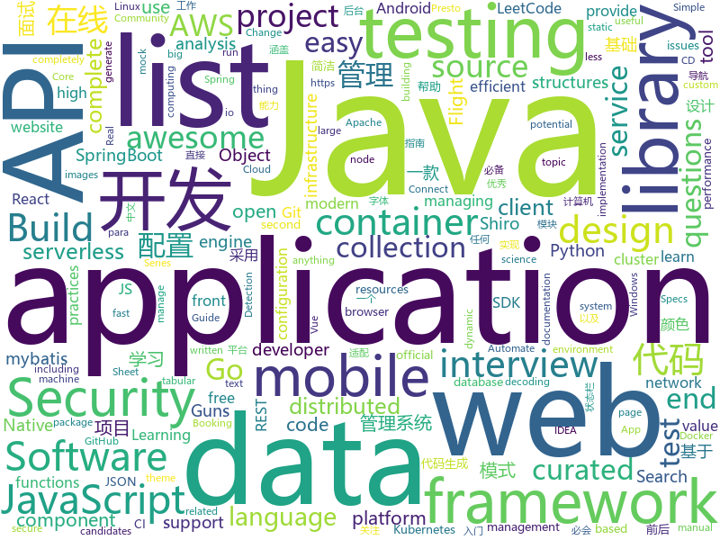

# 2019-12-05
See what the GitHub community is most excited about today.

## python
* [serverless-application-model](https://github.com/awslabs/serverless-application-model)(**28 stars today**): AWS Serverless Application Model (SAM) is an open-source framework for building serverless applications
* [WEASEL](https://github.com/facebookincubator/WEASEL)(**195 stars today**): DNS covert channel implant for Red Teams.
* [GitHub-Chinese-Top-Charts](https://github.com/kon9chunkit/GitHub-Chinese-Top-Charts)(**209 stars today**): 🇨🇳GitHub中文排行榜，帮助你发现高分优秀中文项目、更高效地吸收国人的优秀经验成果；榜单每周更新一次，敬请关注！
* [vaex](https://github.com/vaexio/vaex)(**89 stars today**): Out-of-Core DataFrames for Python, visualize and explore big tabular data at a billion rows per second.
* [public-apis](https://github.com/public-apis/public-apis)(**174 stars today**): A collective list of free APIs for use in software and web development.
* [algo](https://github.com/wangzheng0822/algo)(**118 stars today**): 数据结构和算法必知必会的50个代码实现
* [DB](https://github.com/MhLiao/DB)(**51 stars today**): A PyToch implementation of "Real-time Scene Text Detection with Differentiable Binarization".
* [fastapi](https://github.com/tiangolo/fastapi)(**90 stars today**): FastAPI framework, high performance, easy to learn, fast to code, ready for production
* [CheatSheetSeries](https://github.com/OWASP/CheatSheetSeries)(**19 stars today**): The OWASP Cheat Sheet Series was created to provide a concise collection of high value information on specific application security topics.
* [aws-serverless-airline-booking](https://github.com/aws-samples/aws-serverless-airline-booking)(**11 stars today**): Airline Booking is a complete web application that provides Flight Search, Flight Payment, Flight Booking, Flight Preferences and Loyalty points including end-to-end testing, GraphQL and CI/CD. This web application is the theme of Build on Serverless Season 2 on AWS Twitch running from April 24th until end of July.
* [streamlit](https://github.com/streamlit/streamlit)(**26 stars today**): Streamlit — The fastest way to build custom ML tools
* [system-design-primer](https://github.com/donnemartin/system-design-primer)(**63 stars today**): Learn how to design large-scale systems. Prep for the system design interview. Includes Anki flashcards.
* [salt](https://github.com/saltstack/salt)(**6 stars today**): Software to automate the management and configuration of any infrastructure or application at scale. Get access to the Salt software package repository here:
* [metaflow](https://github.com/Netflix/metaflow)(**472 stars today**): Build and manage real-life data science projects with ease.
* [nlp-recipes](https://github.com/microsoft/nlp-recipes)(**52 stars today**): Natural Language Processing Best Practices & Examples
* [locust](https://github.com/locustio/locust)(**18 stars today**): Scalable user load testing tool written in Python
* [post-tuto-deployment](https://github.com/MarwanDebbiche/post-tuto-deployment)(**58 stars today**): Repo pour le blog post avec Ahmed
* [manim](https://github.com/3b1b/manim)(**58 stars today**): Animation engine for explanatory math videos
* [pandas](https://github.com/pandas-dev/pandas)(**19 stars today**): Flexible and powerful data analysis / manipulation library for Python, providing labeled data structures similar to R data.frame objects, statistical functions, and much more
* [EfficientDet.Pytorch](https://github.com/toandaominh1997/EfficientDet.Pytorch)(**33 stars today**): Implementation EfficientDet: Scalable and Efficient Object Detection in PyTorch
* [chineseocr](https://github.com/chineseocr/chineseocr)(**6 stars today**): yolo3+ocr
* [doccano](https://github.com/doccano/doccano)(**14 stars today**): Open source text annotation tool for machine learning practitioner.
* [prefect](https://github.com/PrefectHQ/prefect)(**14 stars today**): The Prefect Core workflow engine
* [line-bot-sdk-python](https://github.com/line/line-bot-sdk-python)(**3 stars today**): LINE Messaging API SDK for Python
* [dask](https://github.com/dask/dask)(**4 stars today**): Parallel computing with task scheduling

## java
* [CS-Notes](https://github.com/CyC2018/CS-Notes)(**255 stars today**): 📚技术面试必备基础知识、Leetcode、计算机操作系统、计算机网络、系统设计、Java、Python、C++
* [BigData-Notes](https://github.com/heibaiying/BigData-Notes)(**293 stars today**): 大数据入门指南⭐️
* [vhr](https://github.com/lenve/vhr)(**79 stars today**): 微人事是一个前后端分离的人力资源管理系统，项目采用SpringBoot+Vue开发。
* [ImmersionBar](https://github.com/gyf-dev/ImmersionBar)(**16 stars today**): android 4.4以上沉浸式状态栏和沉浸式导航栏管理，适配横竖屏切换、刘海屏、软键盘弹出等问题，可以修改状态栏字体颜色和导航栏图标颜色，以及不可修改字体颜色手机的适配，适用于Activity、Fragment、DialogFragment、Dialog，PopupWindow，一句代码轻松实现，以及对bar的其他设置，详见README。简书请参考：http://www.jianshu.com/p/2a884e211a62
* [aws-sdk-java](https://github.com/aws/aws-sdk-java)(**3 stars today**): The official AWS SDK for Java.
* [tutorials](https://github.com/eugenp/tutorials)(**25 stars today**): Just Announced - "Learn Spring Security OAuth":
* [jib](https://github.com/GoogleContainerTools/jib)(**11 stars today**): 🏗Build container images for your Java applications.
* [debezium](https://github.com/debezium/debezium)(**6 stars today**): Change data capture for a variety of databases. https://debezium.io Please log issues in our JIRA at https://issues.jboss.org/projects/DBZ/issues
* [JavaGuide](https://github.com/Snailclimb/JavaGuide)(**177 stars today**): 【Java学习+面试指南】 一份涵盖大部分Java程序员所需要掌握的核心知识。
* [ExoPlayer](https://github.com/google/ExoPlayer)(**7 stars today**): An extensible media player for Android
* [elasticsearch](https://github.com/elastic/elasticsearch)(**34 stars today**): Open Source, Distributed, RESTful Search Engine
* [soul](https://github.com/Dromara/soul)(**11 stars today**): High-Performance Java API Gateway
* [tink](https://github.com/google/tink)(**10 stars today**): Tink is a multi-language, cross-platform, open source library that provides cryptographic APIs that are secure, easy to use correctly, and hard(er) to misuse.
* [halo](https://github.com/halo-dev/halo)(**113 stars today**): ✍ Halo 一款现代化的个人独立博客系统
* [rest-assured](https://github.com/rest-assured/rest-assured)(**3 stars today**): Java DSL for easy testing of REST services
* [jeecg-boot](https://github.com/zhangdaiscott/jeecg-boot)(**73 stars today**): 一款基于代码生成器的JAVA快速开发平台，开源界“小普元”超越传统商业企业级开发平台！采用前后端分离架构：SpringBoot 2.x，Ant Design&Vue，Mybatis-plus，Shiro，JWT。强大的代码生成器让前后端代码一键生成，无需写任何代码! 引领新的开发模式(OnlineCoding模式-> 代码生成器模式-> 手工MERGE智能开发)，帮助Java项目解决70%的重复工作，让开发更多关注业务逻辑。既能快速提高开发效率，帮助公司节省成本，同时又不失灵活性。JeecgBoot还独创在线开发模式（No代码）：在线表单配置（表单设计器）、移动配置能力、在线工作流配置（流程设计器）、在线报表配置、在线图表配置、插件能力（可插拔）等等
* [lucene-solr](https://github.com/apache/lucene-solr)(**7 stars today**): Apache Lucene and Solr open-source search software
* [testcontainers-java](https://github.com/testcontainers/testcontainers-java)(**6 stars today**): Testcontainers is a Java library that supports JUnit tests, providing lightweight, throwaway instances of common databases, Selenium web browsers, or anything else that can run in a Docker container.
* [LeetCodeAnimation](https://github.com/MisterBooo/LeetCodeAnimation)(**107 stars today**): Demonstrate all the questions on LeetCode in the form of animation.（用动画的形式呈现解LeetCode题目的思路）
* [presto](https://github.com/prestosql/presto)(**3 stars today**): Official home of the community managed version of Presto, the distributed SQL query engine for big data, under the auspices of the Presto Software Foundation.
* [react-native-camera](https://github.com/react-native-community/react-native-camera)(**5 stars today**): A Camera component for React Native. Also supports barcode scanning!
* [HikariCP](https://github.com/brettwooldridge/HikariCP)(**12 stars today**): 光 HikariCP・A solid, high-performance, JDBC connection pool at last.
* [bisq](https://github.com/bisq-network/bisq)(**2 stars today**): The decentralized bitcoin exchange network
* [igniter](https://github.com/trojan-gfw/igniter)(**3 stars today**): A trojan client for Android (UNDER CONSTRUCTION).
* [Guns](https://github.com/stylefeng/Guns)(**7 stars today**): Guns基于SpringBoot 2，致力于做更简洁的后台管理系统，完美整合springmvc + shiro + mybatis-plus + beetl!Guns项目代码简洁，注释丰富，上手容易，同时Guns包含许多基础模块(用户管理，角色管理，部门管理，字典管理等10个模块)，可以直接作为一个后台管理系统的脚手架!

## unknown
* [30min_guides](https://github.com/qinjx/30min_guides)(**48 stars today**): 覃健祥的学习笔记，各种几十分钟入门的文档
* [3y](https://github.com/ZhongFuCheng3y/3y)(**63 stars today**): 📓从Java基础、JavaWeb基础到常用的框架再到面试题都有完整的教程，几乎涵盖了Java后端必备的知识点
* [Best-websites-a-programmer-should-visit](https://github.com/sdmg15/Best-websites-a-programmer-should-visit)(**112 stars today**): 🔗Some useful websites for programmers.
* [aws-deepcomposer-samples](https://github.com/aws-samples/aws-deepcomposer-samples)(**22 stars today**): 
* [Java-Interview](https://github.com/gzc426/Java-Interview)(**54 stars today**): Java 面试必会 直通BAT
* [developer-roadmap](https://github.com/kamranahmedse/developer-roadmap)(**65 stars today**): Roadmap to becoming a web developer in 2019
* [aws-modern-application-workshop](https://github.com/aws-samples/aws-modern-application-workshop)(**7 stars today**): A tutorial for developers that want to learn about how to build modern applications on top of AWS. You will build a sample website that leverages infrastructure as code, containers, serverless code functions, CI/CD, and more.
* [app-ideas](https://github.com/florinpop17/app-ideas)(**14 stars today**): A Collection of application ideas which can be used to improve your coding skills.
* [OpenWrt-CI](https://github.com/KFERMercer/OpenWrt-CI)(**30 stars today**): OpenWrt CI 在线集成自动编译环境
* [proposals](https://github.com/tc39/proposals)(**15 stars today**): Tracking ECMAScript Proposals
* [awesome-public-datasets](https://github.com/awesomedata/awesome-public-datasets)(**23 stars today**): A topic-centric list of HQ open datasets. PR ☛☛☛
* [vagas](https://github.com/frontendbr/vagas)(**4 stars today**): 🔬Espaço para divulgação de vagas para front-enders.
* [you-dont-know-js-ru](https://github.com/azat-io/you-dont-know-js-ru)(**6 stars today**): 📚Russian translation of "You Don't Know JS" book series
* [awesome-javascript](https://github.com/sorrycc/awesome-javascript)(**13 stars today**): 🐢A collection of awesome browser-side JavaScript libraries, resources and shiny things.
* [ddia](https://github.com/Vonng/ddia)(**14 stars today**): 《Designing Data-Intensive Application》DDIA中文翻译
* [awesome-interview-questions](https://github.com/MaximAbramchuck/awesome-interview-questions)(**28 stars today**): A curated awesome list of lists of interview questions. Feel free to contribute!🎓
* [coding-interview-university](https://github.com/jwasham/coding-interview-university)(**78 stars today**): A complete computer science study plan to become a software engineer.
* [CKAD-exercises](https://github.com/dgkanatsios/CKAD-exercises)(**8 stars today**): A set of exercises to prepare for Certified Kubernetes Application Developer exam by Cloud Native Computing Foundation
* [semver](https://github.com/semver/semver)(**4 stars today**): Semantic Versioning Specification
* [project-based-learning](https://github.com/tuvtran/project-based-learning)(**35 stars today**): Curated list of project-based tutorials
* [api-guidelines](https://github.com/microsoft/api-guidelines)(**95 stars today**): Microsoft REST API Guidelines
* [intellij-community](https://github.com/JetBrains/intellij-community)(**13 stars today**): IntelliJ IDEA Community Edition
* [awesome-hyper](https://github.com/bnb/awesome-hyper)(**5 stars today**): 🖥Delightful Hyper plugins, themes, and resources
* [daily-paper-computer-vision](https://github.com/amusi/daily-paper-computer-vision)(**18 stars today**): 记录每天整理的计算机视觉/深度学习/机器学习相关方向的论文
* [awesome-kotlin](https://github.com/KotlinBy/awesome-kotlin)(**5 stars today**): A curated list of awesome Kotlin related stuff Inspired by awesome-java.

## javascript
* [Mobile-Security-Framework-MobSF](https://github.com/MobSF/Mobile-Security-Framework-MobSF)(**15 stars today**): Mobile Security Framework (MobSF) is an automated, all-in-one mobile application (Android/iOS/Windows) pen-testing, malware analysis and security assessment framework capable of performing static and dynamic analysis.
* [custom-select](https://github.com/stringyland/custom-select)(**19 stars today**): My version of a custom select input, with filtering
* [javascript-algorithms](https://github.com/trekhleb/javascript-algorithms)(**79 stars today**): 📝Algorithms and data structures implemented in JavaScript with explanations and links to further readings
* [puppeteer](https://github.com/puppeteer/puppeteer)(**38 stars today**): Headless Chrome Node.js API
* [reveal.js](https://github.com/hakimel/reveal.js)(**22 stars today**): The HTML Presentation Framework
* [json-server](https://github.com/typicode/json-server)(**25 stars today**): Get a full fake REST API with zero coding in less than 30 seconds (seriously)
* [eui](https://github.com/elastic/eui)(**19 stars today**): Elastic UI Framework🙌
* [clean-code-javascript](https://github.com/ryanmcdermott/clean-code-javascript)(**33 stars today**): 🛁Clean Code concepts adapted for JavaScript
* [luban-h5](https://github.com/ly525/luban-h5)(**10 stars today**): [WIP]en: web design tool || mobile page builder/editor || mini webflow for mobile page. zh: 类似易企秀的H5制作、建站工具.
* [junior-recruit-scheduler](https://github.com/jojoldu/junior-recruit-scheduler)(**10 stars today**): 주니어 개발자 채용 정보
* [baseweb](https://github.com/uber/baseweb)(**29 stars today**): A React Component library implementing the Base design language
* [awesome-selfhosted](https://github.com/awesome-selfhosted/awesome-selfhosted)(**87 stars today**): A list of Free Software network services and web applications which can be hosted locally. Selfhosting is the process of hosting and managing applications instead of renting from Software-as-a-Service providers
* [react-testing-library](https://github.com/testing-library/react-testing-library)(**18 stars today**): 🐐Simple and complete React DOM testing utilities that encourage good testing practices.
* [kafkajs](https://github.com/tulios/kafkajs)(**3 stars today**): A modern Apache Kafka client for node.js
* [react-virtualized](https://github.com/bvaughn/react-virtualized)(**15 stars today**): React components for efficiently rendering large lists and tabular data
* [30-seconds-of-code](https://github.com/30-seconds/30-seconds-of-code)(**72 stars today**): A curated collection of useful JavaScript snippets that you can understand in 30 seconds or less.
* [javascript](https://github.com/airbnb/javascript)(**41 stars today**): JavaScript Style Guide
* [jupyterlab](https://github.com/jupyterlab/jupyterlab)(**5 stars today**): JupyterLab computational environment.
* [front-end-interview-handbook](https://github.com/yangshun/front-end-interview-handbook)(**23 stars today**): 🕸Almost complete answers to "Front-end Job Interview Questions" which you can use to interview potential candidates, test yourself or completely ignore
* [react](https://github.com/facebook/react)(**54 stars today**): A declarative, efficient, and flexible JavaScript library for building user interfaces.
* [lighthouse-ci](https://github.com/GoogleChrome/lighthouse-ci)(**90 stars today**): Automate running Lighthouse for every commit, viewing the changes, and preventing regressions
* [baidu-netdisk-downloaderx](https://github.com/88250/baidu-netdisk-downloaderx)(**15 stars today**): ⚡️一款图形界面的百度网盘不限速下载器，支持 Windows、Linux 和 Mac。
* [cypress](https://github.com/cypress-io/cypress)(**30 stars today**): Fast, easy and reliable testing for anything that runs in a browser.
* [amphtml](https://github.com/ampproject/amphtml)(**6 stars today**): The AMP web component framework.
* [yup](https://github.com/jquense/yup)(**19 stars today**): Dead simple Object schema validation

## html
* [DevOps-Guide](https://github.com/Tikam02/DevOps-Guide)(**22 stars today**): DevOps Guide from basic to advanced with Interview Questions and Notes🔥
* [learning-area](https://github.com/mdn/learning-area)(**4 stars today**): Github repo for the MDN Learning Area.
* [ImportJSON](https://github.com/bradjasper/ImportJSON)(**2 stars today**): Import JSON into Google Sheets, this library adds various ImportJSON functions to your spreadsheet
* [owasp-mstg](https://github.com/OWASP/owasp-mstg)(**7 stars today**): The Mobile Security Testing Guide (MSTG) is a comprehensive manual for mobile app security development, testing and reverse engineering.
* [docs](https://github.com/aws-amplify/docs)(**1 stars today**): Amplify Framework Documentation
* [portainer](https://github.com/portainer/portainer)(**31 stars today**): Making Docker management easy.
* [Screenshot-to-code](https://github.com/emilwallner/Screenshot-to-code)(**40 stars today**): A neural network that transforms a design mock-up into a static website.
* [pdfs](https://github.com/tpn/pdfs)(**4 stars today**): Technically-oriented PDF Collection (Papers, Specs, Decks, Manuals, etc)
* [Java-Interview-Advanced](https://github.com/shishan100/Java-Interview-Advanced)(**8 stars today**): 中华石杉--互联网Java进阶面试训练营
* [awesome-webpack](https://github.com/webpack-contrib/awesome-webpack)(**3 stars today**): A curated list of awesome Webpack resources, libraries and tools
* [glTF](https://github.com/KhronosGroup/glTF)(**4 stars today**): glTF – Runtime 3D Asset Delivery
* [proposal-nullish-coalescing](https://github.com/tc39/proposal-nullish-coalescing)(**3 stars today**): Nullish coalescing proposal x ?? y
* [swagger-codegen](https://github.com/swagger-api/swagger-codegen)(**10 stars today**): swagger-codegen contains a template-driven engine to generate documentation, API clients and server stubs in different languages by parsing your OpenAPI / Swagger definition.
* [proposal-decorators](https://github.com/tc39/proposal-decorators)(**2 stars today**): Decorators for ES6 classes
* [awesome-angular](https://github.com/PatrickJS/awesome-angular)(**4 stars today**): 📄A curated list of awesome Angular resources
* [en.javascript.info](https://github.com/javascript-tutorial/en.javascript.info)(**12 stars today**): Modern JavaScript Tutorial
* [openshift-docs](https://github.com/openshift/openshift-docs)(**1 stars today**): OpenShift Documentation
* [git-it-electron](https://github.com/jlord/git-it-electron)(**2 stars today**): 💻🎓Git-it is a (Mac, Win, Linux) Desktop App for Learning Git and GitHub
* [AR.js](https://github.com/jeromeetienne/AR.js)(**7 stars today**): Efficient Augmented Reality for the Web - 60fps on mobile!
* [patchwork](https://github.com/jlord/patchwork)(**0 stars today**): All the Git-it Workshop completers!
* [wpt](https://github.com/web-platform-tests/wpt)(**1 stars today**): Test suites for Web platform specs — including WHATWG, W3C, and others
* [WebFundamentals](https://github.com/google/WebFundamentals)(**4 stars today**): Best practices for modern web development
* [JavaScript30](https://github.com/wesbos/JavaScript30)(**7 stars today**): 30 Day Vanilla JS Challenge
* [RuoYi](https://github.com/yangzongzhuan/RuoYi)(**6 stars today**): 基于SpringBoot2.0的权限管理系统 易读易懂、界面简洁美观。 核心技术采用Spring、MyBatis、Shiro没有任何其它重度依赖。直接运行即可用
* [Front-end-Developer-Interview-Questions](https://github.com/h5bp/Front-end-Developer-Interview-Questions)(**14 stars today**): A list of helpful front-end related questions you can use to interview potential candidates, test yourself or completely ignore.

## go
* [hubble](https://github.com/cilium/hubble)(**48 stars today**): Hubble - Network, Service & Security Observability for Kubernetes
* [cluster-api](https://github.com/kubernetes-sigs/cluster-api)(**2 stars today**): Home for the Cluster Management API work, a subproject of sig-cluster-lifecycle
* [terraform-provider-google](https://github.com/terraform-providers/terraform-provider-google)(**11 stars today**): Terraform Google Cloud Platform provider
* [thanos](https://github.com/thanos-io/thanos)(**7 stars today**): Highly available Prometheus setup with long term storage capabilities. CNCF Sandbox project.
* [origin](https://github.com/openshift/origin)(**9 stars today**): The self-managing, auto-upgrading, Kubernetes distribution for everyone
* [go-sqlmock](https://github.com/DATA-DOG/go-sqlmock)(**7 stars today**): Sql mock driver for golang to test database interactions
* [charts](https://github.com/helm/charts)(**25 stars today**): Curated applications for Kubernetes
* [lazydocker](https://github.com/jesseduffield/lazydocker)(**46 stars today**): The lazier way to manage everything docker
* [encoding](https://github.com/segmentio/encoding)(**207 stars today**): Go package containing implementations of efficient encoding, decoding, and validation APIs.
* [terraform-provider-aws](https://github.com/terraform-providers/terraform-provider-aws)(**7 stars today**): Terraform AWS provider
* [client-go](https://github.com/kubernetes/client-go)(**5 stars today**): Go client for Kubernetes.
* [evilginx2](https://github.com/kgretzky/evilginx2)(**7 stars today**): Standalone man-in-the-middle attack framework used for phishing login credentials along with session cookies, allowing for the bypass of 2-factor authentication
* [aws-sdk-go](https://github.com/aws/aws-sdk-go)(**2 stars today**): AWS SDK for the Go programming language.
* [kit](https://github.com/go-kit/kit)(**25 stars today**): A standard library for microservices.
* [yaml](https://github.com/go-yaml/yaml)(**6 stars today**): YAML support for the Go language.
* [istio](https://github.com/istio/istio)(**23 stars today**): Connect, secure, control, and observe services.
* [consul](https://github.com/hashicorp/consul)(**14 stars today**): Consul is a distributed, highly available, and data center aware solution to connect and configure applications across dynamic, distributed infrastructure.
* [packer](https://github.com/hashicorp/packer)(**7 stars today**): Packer is a tool for creating identical machine images for multiple platforms from a single source configuration.
* [gjson](https://github.com/tidwall/gjson)(**20 stars today**): Get JSON values quickly - JSON parser for Go
* [kube-state-metrics](https://github.com/kubernetes/kube-state-metrics)(**3 stars today**): Add-on agent to generate and expose cluster-level metrics.
* [mapstructure](https://github.com/mitchellh/mapstructure)(**19 stars today**): Go library for decoding generic map values into native Go structures.
* [eksctl](https://github.com/weaveworks/eksctl)(**6 stars today**): The official CLI for Amazon EKS
* [moby](https://github.com/moby/moby)(**25 stars today**): Moby Project - a collaborative project for the container ecosystem to assemble container-based systems
* [envconfig](https://github.com/kelseyhightower/envconfig)(**12 stars today**): Golang library for managing configuration data from environment variables
* [concourse](https://github.com/concourse/concourse)(**6 stars today**): Concourse is a container-based continuous thing-doer written in Go and Elm.

## WordCloud

