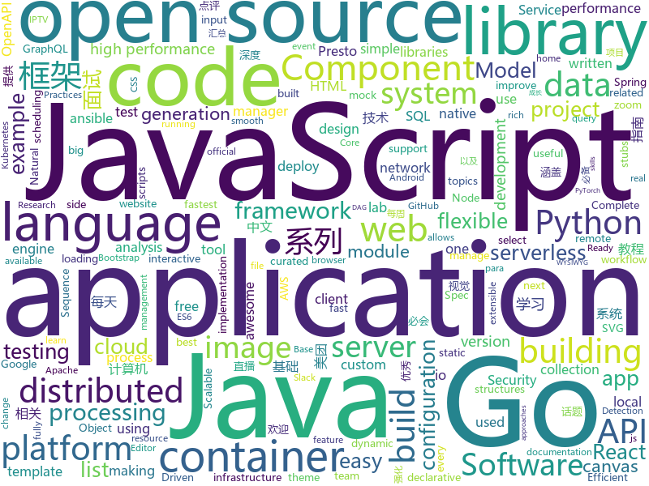

# 2019-12-06
See what the GitHub community is most excited about today.

## python
* [metaflow](https://github.com/Netflix/metaflow)(**354 stars today**): Build and manage real-life data science projects with ease.
* [nlp-recipes](https://github.com/microsoft/nlp-recipes)(**439 stars today**): Natural Language Processing Best Practices & Examples
* [GitHub-Chinese-Top-Charts](https://github.com/kon9chunkit/GitHub-Chinese-Top-Charts)(**581 stars today**): 🇨🇳GitHub中文排行榜，帮助你发现高分优秀中文项目、更高效地吸收国人的优秀经验成果；榜单每周更新一次，敬请关注！
* [crackq](https://github.com/f0cker/crackq)(**70 stars today**): Placeholder for upcoming release of CrackQ: A Python Hashcat cracking queue system
* [public-apis](https://github.com/public-apis/public-apis)(**230 stars today**): A collective list of free APIs for use in software and web development.
* [Pretrained-Language-Model](https://github.com/huawei-noah/Pretrained-Language-Model)(**123 stars today**): Pretrained language model and its related optimization techniques developed by Huawei Noah's Ark Lab.
* [algo](https://github.com/wangzheng0822/algo)(**153 stars today**): 数据结构和算法必知必会的50个代码实现
* [detectron2](https://github.com/facebookresearch/detectron2)(**41 stars today**): Detectron2 is FAIR's next-generation research platform for object detection and segmentation.
* [EfficientDet.Pytorch](https://github.com/toandaominh1997/EfficientDet.Pytorch)(**31 stars today**): Implementation EfficientDet: Scalable and Efficient Object Detection in PyTorch
* [interview_internal_reference](https://github.com/0voice/interview_internal_reference)(**53 stars today**): 2019年最新总结，阿里，腾讯，百度，美团，头条等技术面试题目，以及答案，专家出题人分析汇总。
* [localstack](https://github.com/localstack/localstack)(**34 stars today**): 💻A fully functional local AWS cloud stack. Develop and test your cloud & Serverless apps offline!
* [fastapi](https://github.com/tiangolo/fastapi)(**84 stars today**): FastAPI framework, high performance, easy to learn, fast to code, ready for production
* [oppia](https://github.com/oppia/oppia)(**19 stars today**): Tool for collaboratively building interactive lessons.
* [ansible](https://github.com/ansible/ansible)(**23 stars today**): Ansible is a radically simple IT automation platform that makes your applications and systems easier to deploy. Avoid writing scripts or custom code to deploy and update your applications — automate in a language that approaches plain English, using SSH, with no agents to install on remote systems. https://docs.ansible.com/ansible/
* [models](https://github.com/tensorflow/models)(**49 stars today**): Models and examples built with TensorFlow
* [prefect](https://github.com/PrefectHQ/prefect)(**9 stars today**): The Prefect Core workflow engine
* [PyTorchDocs](https://github.com/fendouai/PyTorchDocs)(**22 stars today**): PyTorch 官方中文教程包含 60 分钟快速入门教程，强化教程，计算机视觉，自然语言处理，生成对抗网络，强化学习。欢迎 Star，Fork！
* [saleor](https://github.com/mirumee/saleor)(**16 stars today**): A modular, high performance, headless e-commerce storefront built with Python, GraphQL, Django, and ReactJS.
* [fairseq](https://github.com/pytorch/fairseq)(**12 stars today**): Facebook AI Research Sequence-to-Sequence Toolkit written in Python.
* [aws-cloudformation-templates](https://github.com/awslabs/aws-cloudformation-templates)(**5 stars today**): A collection of useful CloudFormation templates
* [transformers](https://github.com/huggingface/transformers)(**101 stars today**): 🤗Transformers: State-of-the-art Natural Language Processing for TensorFlow 2.0 and PyTorch.
* [serverless-application-model](https://github.com/awslabs/serverless-application-model)(**47 stars today**): AWS Serverless Application Model (SAM) is an open-source framework for building serverless applications
* [plotly.py](https://github.com/plotly/plotly.py)(**6 stars today**): An open-source, interactive graphing library for Python (includes Plotly Express)✨
* [unilm](https://github.com/microsoft/unilm)(**6 stars today**): UniLM - Unified Language Model Pre-training
* [spack](https://github.com/spack/spack)(**1 stars today**): A flexible package manager that supports multiple versions, configurations, platforms, and compilers.

## java
* [JavaGuide](https://github.com/Snailclimb/JavaGuide)(**209 stars today**): 【Java学习+面试指南】 一份涵盖大部分Java程序员所需要掌握的核心知识。
* [CS-Notes](https://github.com/CyC2018/CS-Notes)(**264 stars today**): 📚技术面试必备基础知识、Leetcode、计算机操作系统、计算机网络、系统设计、Java、Python、C++
* [openapi-generator](https://github.com/OpenAPITools/openapi-generator)(**20 stars today**): OpenAPI Generator allows generation of API client libraries (SDK generation), server stubs, documentation and configuration automatically given an OpenAPI Spec (v2, v3)
* [BigData-Notes](https://github.com/heibaiying/BigData-Notes)(**107 stars today**): 大数据入门指南⭐️
* [react-native-video](https://github.com/react-native-community/react-native-video)(**7 stars today**): A <Video /> component for react-native
* [DataX](https://github.com/alibaba/DataX)(**18 stars today**): 
* [ExoPlayer](https://github.com/google/ExoPlayer)(**8 stars today**): An extensible media player for Android
* [quarkus-quickstarts](https://github.com/quarkusio/quarkus-quickstarts)(**3 stars today**): Quarkus quickstart code
* [library](https://github.com/ddd-by-examples/library)(**15 stars today**): A comprehensive Domain-Driven Design example with problem space strategic analysis and various tactical patterns.
* [incubator-dolphinscheduler](https://github.com/apache/incubator-dolphinscheduler)(**19 stars today**): Dolphin Scheduler is a distributed and easy-to-expand visual DAG workflow scheduling system, dedicated to solving the complex dependencies in data processing, making the scheduling system out of the box for data processing.(分布式易扩展的可视化工作流任务调度)
* [aem-core-wcm-components](https://github.com/adobe/aem-core-wcm-components)(**0 stars today**): Adobe Experience Manager (AEM) Sites Core Components - flexible, extensible, and feature-rich components to build sites
* [hive](https://github.com/apache/hive)(**5 stars today**): Apache Hive
* [presto](https://github.com/prestosql/presto)(**2 stars today**): Official home of the community managed version of Presto, the distributed SQL query engine for big data, under the auspices of the Presto Software Foundation.
* [glide](https://github.com/bumptech/glide)(**14 stars today**): An image loading and caching library for Android focused on smooth scrolling
* [cas](https://github.com/apereo/cas)(**9 stars today**): Apereo CAS - Enterprise Single Sign On for all earthlings and beyond.
* [tomcat](https://github.com/apache/tomcat)(**8 stars today**): Apache Tomcat
* [janusgraph](https://github.com/JanusGraph/janusgraph)(**5 stars today**): JanusGraph: an open-source, distributed graph database
* [react-native-push-notification](https://github.com/zo0r/react-native-push-notification)(**8 stars today**): React Native Local and Remote Notifications
* [cat](https://github.com/dianping/cat)(**18 stars today**): CAT 作为服务端项目基础组件，提供了 Java, C/C++, Node.js, Python, Go 等多语言客户端，已经在美团点评的基础架构中间件框架（MVC框架，RPC框架，数据库框架，缓存框架等，消息队列，配置系统等）深度集成，为美团点评各业务线提供系统丰富的性能指标、健康状况、实时告警等。
* [quarkus](https://github.com/quarkusio/quarkus)(**14 stars today**): Quarkus: Supersonic Subatomic Java.
* [presto](https://github.com/prestodb/presto)(**4 stars today**): The official home of the Presto distributed SQL query engine for big data
* [soul](https://github.com/Dromara/soul)(**10 stars today**): High-Performance Java API Gateway
* [jib](https://github.com/GoogleContainerTools/jib)(**9 stars today**): 🏗Build container images for your Java applications.
* [spring-kafka](https://github.com/spring-projects/spring-kafka)(**1 stars today**): Provides Familiar Spring Abstractions for Apache Kafka
* [spring-boot](https://github.com/spring-projects/spring-boot)(**48 stars today**): Spring Boot

## unknown
* [dear-github-2.0](https://github.com/drop-ice/dear-github-2.0)(**351 stars today**): 📨An open letter to GitHub from the maintainers of open source projects
* [Best-websites-a-programmer-should-visit](https://github.com/sdmg15/Best-websites-a-programmer-should-visit)(**180 stars today**): 🔗Some useful websites for programmers.
* [3y](https://github.com/ZhongFuCheng3y/3y)(**154 stars today**): 📓从Java基础、JavaWeb基础到常用的框架再到面试题都有完整的教程，几乎涵盖了Java后端必备的知识点
* [api-guidelines](https://github.com/microsoft/api-guidelines)(**84 stars today**): Microsoft REST API Guidelines
* [aws-deepcomposer-samples](https://github.com/aws-samples/aws-deepcomposer-samples)(**27 stars today**): 
* [Tvlist-awesome-m3u-m3u8](https://github.com/billy21/Tvlist-awesome-m3u-m3u8)(**49 stars today**): 直播源相关资源汇总📺💯IPTV、M3U
* [Flutter-Course-Resources](https://github.com/londonappbrewery/Flutter-Course-Resources)(**11 stars today**): Learn to Code While Building Apps - The Complete Flutter Development Bootcamp
* [daily-paper-computer-vision](https://github.com/amusi/daily-paper-computer-vision)(**22 stars today**): 记录每天整理的计算机视觉/深度学习/机器学习相关方向的论文
* [Java-Interview](https://github.com/gzc426/Java-Interview)(**61 stars today**): Java 面试必会 直通BAT
* [fengrenjie](https://github.com/renjie-feng-trash/fengrenjie)(**89 stars today**): 这个repo是为了锤北大垃圾教授——冯仁杰
* [awesome-google-colab](https://github.com/firmai/awesome-google-colab)(**114 stars today**): Google Colaboratory Notebooks and Repositories
* [Blog](https://github.com/mqyqingfeng/Blog)(**15 stars today**): 冴羽写博客的地方，预计写四个系列：JavaScript深入系列、JavaScript专题系列、ES6系列、React系列。
* [sysmon-config](https://github.com/SwiftOnSecurity/sysmon-config)(**29 stars today**): Sysmon configuration file template with default high-quality event tracing
* [app-ideas](https://github.com/florinpop17/app-ideas)(**16 stars today**): A Collection of application ideas which can be used to improve your coding skills.
* [English-level-up-tips-for-Chinese](https://github.com/byoungd/English-level-up-tips-for-Chinese)(**27 stars today**): 可能是让你受益匪浅的英语进阶指南
* [proposals](https://github.com/tc39/proposals)(**15 stars today**): Tracking ECMAScript Proposals
* [newschool-frontend](https://github.com/NewSchoolBR/newschool-frontend)(**3 stars today**): 
* [You-Dont-Know-JS](https://github.com/getify/You-Dont-Know-JS)(**63 stars today**): A book series on JavaScript. @YDKJS on twitter.
* [kubernetes-the-hard-way](https://github.com/kelseyhightower/kubernetes-the-hard-way)(**23 stars today**): Bootstrap Kubernetes the hard way on Google Cloud Platform. No scripts.
* [rfcs](https://github.com/reactjs/rfcs)(**2 stars today**): RFCs for changes to React
* [awesome-production-machine-learning](https://github.com/EthicalML/awesome-production-machine-learning)(**18 stars today**): A curated list of awesome open source libraries to deploy, monitor, version and scale your machine learning
* [bugcrowd_university](https://github.com/bugcrowd/bugcrowd_university)(**5 stars today**): Open source education content for the researcher community
* [123-Essential-JavaScript-Interview-Questions](https://github.com/ganqqwerty/123-Essential-JavaScript-Interview-Questions)(**5 stars today**): JavaScript interview Questions
* [vagas](https://github.com/frontendbr/vagas)(**4 stars today**): 🔬Espaço para divulgação de vagas para front-enders.
* [awesome-javascript](https://github.com/sorrycc/awesome-javascript)(**16 stars today**): 🐢A collection of awesome browser-side JavaScript libraries, resources and shiny things.

## javascript
* [vue-interactive-paycard](https://github.com/muhammederdem/vue-interactive-paycard)(**121 stars today**): Credit card form with smooth and sweet micro-interactions
* [awesome-selfhosted](https://github.com/awesome-selfhosted/awesome-selfhosted)(**47 stars today**): A list of Free Software network services and web applications which can be hosted locally. Selfhosting is the process of hosting and managing applications instead of renting from Software-as-a-Service providers
* [custom-select](https://github.com/stringyland/custom-select)(**24 stars today**): My version of a custom select input, with filtering
* [iptv](https://github.com/iptv-org/iptv)(**116 stars today**): Collection of 8000+ publicly available IPTV channels from all over the world
* [javascript-algorithms](https://github.com/trekhleb/javascript-algorithms)(**75 stars today**): 📝Algorithms and data structures implemented in JavaScript with explanations and links to further readings
* [create-react-app](https://github.com/facebook/create-react-app)(**94 stars today**): Set up a modern web app by running one command.
* [30-seconds-of-code](https://github.com/30-seconds/30-seconds-of-code)(**89 stars today**): Short JavaScript code snippets for all your development needs
* [cypress](https://github.com/cypress-io/cypress)(**27 stars today**): Fast, easy and reliable testing for anything that runs in a browser.
* [eui](https://github.com/elastic/eui)(**21 stars today**): Elastic UI Framework🙌
* [aws-serverless-workshops](https://github.com/aws-samples/aws-serverless-workshops)(**6 stars today**): Code and walkthrough labs to set up serverless applications for Wild Rydes workshops
* [Mobile-Security-Framework-MobSF](https://github.com/MobSF/Mobile-Security-Framework-MobSF)(**51 stars today**): Mobile Security Framework (MobSF) is an automated, all-in-one mobile application (Android/iOS/Windows) pen-testing, malware analysis and security assessment framework capable of performing static and dynamic analysis.
* [webpack](https://github.com/webpack/webpack)(**20 stars today**): A bundler for javascript and friends. Packs many modules into a few bundled assets. Code Splitting allows for loading parts of the application on demand. Through "loaders", modules can be CommonJs, AMD, ES6 modules, CSS, Images, JSON, Coffeescript, LESS, ... and your custom stuff.
* [Chart.js](https://github.com/chartjs/Chart.js)(**13 stars today**): Simple HTML5 Charts using the <canvas> tag
* [baseweb](https://github.com/uber/baseweb)(**33 stars today**): A React Component library implementing the Base design language
* [Daily-Question](https://github.com/shfshanyue/Daily-Question)(**10 stars today**): 每天至少一个问题，有关前端，后端，devops，微服务以及软技能，促进个人职业成长，欢迎交流。
* [outline](https://github.com/outline/outline)(**31 stars today**): The fastest wiki and knowledge base for growing teams. Beautiful, feature rich, markdown compatible and open source.
* [brackets](https://github.com/adobe/brackets)(**11 stars today**): An open source code editor for the web, written in JavaScript, HTML and CSS.
* [downshift](https://github.com/downshift-js/downshift)(**16 stars today**): 🏎Primitive to build simple, flexible, WAI-ARIA compliant enhanced input React components
* [react](https://github.com/facebook/react)(**67 stars today**): A declarative, efficient, and flexible JavaScript library for building user interfaces.
* [fabric.js](https://github.com/fabricjs/fabric.js)(**31 stars today**): Javascript Canvas Library, SVG-to-Canvas (& canvas-to-SVG) Parser
* [sharp](https://github.com/lovell/sharp)(**46 stars today**): High performance Node.js image processing, the fastest module to resize JPEG, PNG, WebP and TIFF images. Uses the libvips library.
* [react-big-calendar](https://github.com/intljusticemission/react-big-calendar)(**6 stars today**): gcal/outlook like calendar component
* [vue-apollo](https://github.com/vuejs/vue-apollo)(**8 stars today**): 🚀Apollo/GraphQL integration for VueJS
* [react-vis](https://github.com/uber/react-vis)(**11 stars today**): Data Visualization Components
* [junior-recruit-scheduler](https://github.com/jojoldu/junior-recruit-scheduler)(**12 stars today**): 주니어 개발자 채용 정보

## html
* [aws-well-architected-labs](https://github.com/awslabs/aws-well-architected-labs)(**4 stars today**): Hands on labs and code to help you learn, measure, and build using architectural best practices.
* [cypress-example-kitchensink](https://github.com/cypress-io/cypress-example-kitchensink)(**1 stars today**): This is an example app used to showcase Cypress.io testing.
* [mxgraph](https://github.com/jgraph/mxgraph)(**7 stars today**): mxGraph is a fully client side JavaScript diagramming library
* [Screenshot-to-code](https://github.com/emilwallner/Screenshot-to-code)(**49 stars today**): A neural network that transforms a design mock-up into a static website.
* [wpt](https://github.com/web-platform-tests/wpt)(**2 stars today**): Test suites for Web platform specs — including WHATWG, W3C, and others
* [proposal-optional-chaining](https://github.com/tc39/proposal-optional-chaining)(**12 stars today**): 
* [proposal-nullish-coalescing](https://github.com/tc39/proposal-nullish-coalescing)(**10 stars today**): Nullish coalescing proposal x ?? y
* [mini-player](https://github.com/muhammederdem/mini-player)(**23 stars today**): 
* [privacytools.io](https://github.com/privacytoolsIO/privacytools.io)(**7 stars today**): 🛡🛠You are being watched. Protect your privacy against global mass surveillance.
* [ecma262](https://github.com/tc39/ecma262)(**10 stars today**): Status, process, and documents for ECMA-262
* [swagger-codegen](https://github.com/swagger-api/swagger-codegen)(**7 stars today**): swagger-codegen contains a template-driven engine to generate documentation, API clients and server stubs in different languages by parsing your OpenAPI / Swagger definition.
* [qiubaiying.github.io](https://github.com/qiubaiying/qiubaiying.github.io)(**6 stars today**): BY Blog ->
* [RuoYi](https://github.com/yangzongzhuan/RuoYi)(**7 stars today**): 基于SpringBoot2.0的权限管理系统 易读易懂、界面简洁美观。 核心技术采用Spring、MyBatis、Shiro没有任何其它重度依赖。直接运行即可用
* [Moon](https://github.com/TaylanTatli/Moon)(**4 stars today**): Moon is a minimal, one column jekyll theme.
* [FOSSASAT-1](https://github.com/FOSSASystems/FOSSASAT-1)(**4 stars today**): 
* [webcomponents](https://github.com/w3c/webcomponents)(**3 stars today**): Web Components specifications
* [istio.io](https://github.com/istio/istio.io)(**3 stars today**): Source for the istio.io site
* [wysiwyg-editor](https://github.com/froala/wysiwyg-editor)(**3 stars today**): The next generation Javascript WYSIWYG HTML Editor.
* [html](https://github.com/whatwg/html)(**4 stars today**): HTML Standard
* [chosen](https://github.com/harvesthq/chosen)(**2 stars today**): Chosen is a library for making long, unwieldy select boxes more friendly.
* [portainer](https://github.com/portainer/portainer)(**21 stars today**): Making Docker management easy.
* [awesome-angular](https://github.com/PatrickJS/awesome-angular)(**4 stars today**): 📄A curated list of awesome Angular resources
* [keep-a-changelog](https://github.com/olivierlacan/keep-a-changelog)(**0 stars today**): If you build software, keep a changelog.
* [expressjs.com](https://github.com/expressjs/expressjs.com)(**4 stars today**): 
* [startbootstrap-sb-admin-2](https://github.com/BlackrockDigital/startbootstrap-sb-admin-2)(**8 stars today**): A free, open source, Bootstrap admin theme created by Start Bootstrap

## go
* [consul](https://github.com/hashicorp/consul)(**13 stars today**): Consul is a distributed, highly available, and data center aware solution to connect and configure applications across dynamic, distributed infrastructure.
* [rancher](https://github.com/rancher/rancher)(**17 stars today**): Complete container management platform
* [websocket](https://github.com/gorilla/websocket)(**19 stars today**): A fast, well-tested and widely used WebSocket implementation for Go.
* [logrus](https://github.com/sirupsen/logrus)(**23 stars today**): Structured, pluggable logging for Go.
* [night-reading-go](https://github.com/developer-learning/night-reading-go)(**37 stars today**): Night-Reading-Go《Go 夜读》 > Share the related technical topics of Go every week through zoom online live broadcast, every day on the WeChat/Slack to communicate programming technology topics. 每周通过 zoom 在线直播的方式分享 Go 相关的技术话题，每天大家在微信/Slack 上及时沟通交流编程技术话题。
* [fabric](https://github.com/hyperledger/fabric)(**16 stars today**): 
* [hubble](https://github.com/cilium/hubble)(**83 stars today**): Hubble - Network, Service & Security Observability for Kubernetes
* [kustomize](https://github.com/kubernetes-sigs/kustomize)(**13 stars today**): Customization of kubernetes YAML configurations
* [mapstructure](https://github.com/mitchellh/mapstructure)(**23 stars today**): Go library for decoding generic map values into native Go structures.
* [influxdb](https://github.com/influxdata/influxdb)(**20 stars today**): Scalable datastore for metrics, events, and real-time analytics
* [yaml](https://github.com/go-yaml/yaml)(**5 stars today**): YAML support for the Go language.
* [datadog-agent](https://github.com/DataDog/datadog-agent)(**3 stars today**): Datadog Agent
* [eksctl](https://github.com/weaveworks/eksctl)(**6 stars today**): The official CLI for Amazon EKS
* [crc](https://github.com/code-ready/crc)(**1 stars today**): CodeReady Containers is a tool that manages a local OpenShift 4.x cluster optimized for testing and development purposes
* [loki](https://github.com/grafana/loki)(**18 stars today**): Like Prometheus, but for logs.
* [terraform](https://github.com/hashicorp/terraform)(**24 stars today**): Terraform enables you to safely and predictably create, change, and improve infrastructure. It is an open source tool that codifies APIs into declarative configuration files that can be shared amongst team members, treated as code, edited, reviewed, and versioned.
* [roadrunner](https://github.com/spiral/roadrunner)(**43 stars today**): High-performance PHP application server, load-balancer and process manager written in Golang
* [moby](https://github.com/moby/moby)(**22 stars today**): Moby Project - a collaborative project for the container ecosystem to assemble container-based systems
* [protobuf](https://github.com/gogo/protobuf)(**7 stars today**): Protocol Buffers for Go with Gadgets
* [mux](https://github.com/gorilla/mux)(**13 stars today**): A powerful HTTP router and URL matcher for building Go web servers with🦍
* [go-sqlmock](https://github.com/DATA-DOG/go-sqlmock)(**13 stars today**): Sql mock driver for golang to test database interactions
* [cadvisor](https://github.com/google/cadvisor)(**4 stars today**): Analyzes resource usage and performance characteristics of running containers.
* [nats-server](https://github.com/nats-io/nats-server)(**7 stars today**): High-Performance server for NATS, the cloud native messaging system.
* [buildah](https://github.com/containers/buildah)(**5 stars today**): A tool that facilitates building OCI images
* [kubesphere](https://github.com/kubesphere/kubesphere)(**22 stars today**): Easy-to-use Production Ready Container Platform

## WordCloud

