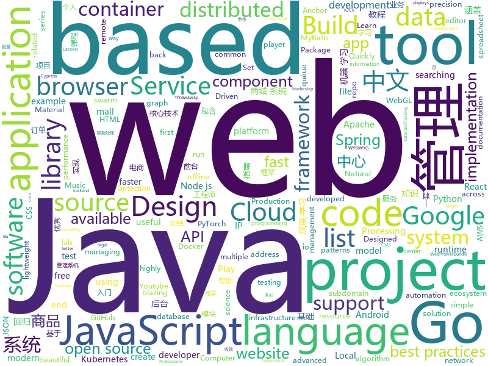

# 2019-12-07
See what the GitHub community is most excited about today.

## python
* [demucs](https://github.com/facebookresearch/demucs)(**112 stars today**): Code for the paper Music Source Separation in the Waveform Domain
* [awspx](https://github.com/FSecureLABS/awspx)(**55 stars today**): A graph-based tool for visualizing effective access and resource relationships in AWS environments.
* [GitHub-Chinese-Top-Charts](https://github.com/kon9chunkit/GitHub-Chinese-Top-Charts)(**576 stars today**): 🇨🇳GitHub中文排行榜，帮助你发现高分优秀中文项目、更高效地吸收国人的优秀经验成果；榜单每周更新一次，敬请关注！
* [metaflow](https://github.com/Netflix/metaflow)(**373 stars today**): Build and manage real-life data science projects with ease.
* [public-apis](https://github.com/public-apis/public-apis)(**228 stars today**): A collective list of free APIs for use in software and web development.
* [nlp-recipes](https://github.com/microsoft/nlp-recipes)(**245 stars today**): Natural Language Processing Best Practices & Examples
* [crackq](https://github.com/f0cker/crackq)(**82 stars today**): CrackQ: A Python Hashcat cracking queue system
* [transformers](https://github.com/huggingface/transformers)(**86 stars today**): 🤗Transformers: State-of-the-art Natural Language Processing for TensorFlow 2.0 and PyTorch.
* [algo](https://github.com/wangzheng0822/algo)(**173 stars today**): 数据结构和算法必知必会的50个代码实现
* [Pretrained-Language-Model](https://github.com/huawei-noah/Pretrained-Language-Model)(**90 stars today**): Pretrained language model and its related optimization techniques developed by Huawei Noah's Ark Lab.
* [PythonPlantsVsZombies](https://github.com/marblexu/PythonPlantsVsZombies)(**11 stars today**): a simple PlantsVsZombies game
* [ATSS](https://github.com/sfzhang15/ATSS)(**91 stars today**): Bridging the Gap Between Anchor-based and Anchor-free Detection via Adaptive Training Sample Selection
* [ntlmrecon](https://github.com/sachinkamath/ntlmrecon)(**28 stars today**): A fast NTLM reconnaissance and information gathering tool without external dependencies.
* [netbox](https://github.com/netbox-community/netbox)(**1 stars today**): IP address management (IPAM) and data center infrastructure management (DCIM) tool.
* [msg-stylegan-tf](https://github.com/akanimax/msg-stylegan-tf)(**12 stars today**): MSG StyleGAN in tensorflow
* [googleapis](https://github.com/googleapis/googleapis)(**3 stars today**): Public interface definitions of Google APIs.
* [pyodide](https://github.com/iodide-project/pyodide)(**10 stars today**): The Python scientific stack, compiled to WebAssembly
* [kornia](https://github.com/kornia/kornia)(**5 stars today**): Open Source Differentiable Computer Vision Library for PyTorch
* [caldera](https://github.com/mitre/caldera)(**2 stars today**): Automated Adversary Emulation
* [detectron2](https://github.com/facebookresearch/detectron2)(**30 stars today**): Detectron2 is FAIR's next-generation research platform for object detection and segmentation.
* [d2l-zh](https://github.com/d2l-ai/d2l-zh)(**50 stars today**): 《动手学深度学习》：面向中文读者、能运行、可讨论。英文版即伯克利“深度学习导论”教材。
* [Photon](https://github.com/s0md3v/Photon)(**9 stars today**): Incredibly fast crawler designed for OSINT.
* [TTS](https://github.com/mozilla/TTS)(**10 stars today**): Deep learning for Text to Speech
* [celery](https://github.com/celery/celery)(**16 stars today**): Distributed Task Queue (development branch)
* [PPLM](https://github.com/uber-research/PPLM)(**100 stars today**): Plug and Play Language Model implementation. Allows to steer topic and attributes of GPT-2 models.

## java
* [mall-swarm](https://github.com/macrozheng/mall-swarm)(**252 stars today**): mall-swarm是一套微服务商城系统，采用了 Spring Cloud Greenwich、Spring Boot 2、MyBatis、Docker、Elasticsearch等核心技术，同时提供了基于Vue的管理后台方便快速搭建系统。mall-swarm在电商业务的基础集成了注册中心、配置中心、监控中心、网关等系统功能。文档齐全，附带全套Spring Cloud教程。
* [mall](https://github.com/macrozheng/mall)(**144 stars today**): mall项目是一套电商系统，包括前台商城系统及后台管理系统，基于SpringBoot+MyBatis实现。 前台商城系统包含首页门户、商品推荐、商品搜索、商品展示、购物车、订单流程、会员中心、客户服务、帮助中心等模块。 后台管理系统包含商品管理、订单管理、会员管理、促销管理、运营管理、内容管理、统计报表、财务管理、权限管理、设置等模块。
* [react-native-push-notification](https://github.com/zo0r/react-native-push-notification)(**5 stars today**): React Native Local and Remote Notifications
* [azkaban](https://github.com/azkaban/azkaban)(**3 stars today**): Azkaban workflow manager.
* [library](https://github.com/ddd-by-examples/library)(**26 stars today**): A comprehensive Domain-Driven Design example with problem space strategic analysis and various tactical patterns.
* [react-native-video](https://github.com/react-native-community/react-native-video)(**7 stars today**): A <Video /> component for react-native
* [ExoPlayer](https://github.com/google/ExoPlayer)(**13 stars today**): An extensible media player for Android
* [Shadow](https://github.com/Tencent/Shadow)(**9 stars today**): 零反射全动态Android插件框架
* [testcontainers-java](https://github.com/testcontainers/testcontainers-java)(**1 stars today**): Testcontainers is a Java library that supports JUnit tests, providing lightweight, throwaway instances of common databases, Selenium web browsers, or anything else that can run in a Docker container.
* [toBeTopJavaer](https://github.com/hollischuang/toBeTopJavaer)(**35 stars today**): To Be Top Javaer - Java工程师成神之路
* [BigData-Notes](https://github.com/heibaiying/BigData-Notes)(**108 stars today**): 大数据入门指南⭐️
* [spring-security](https://github.com/spring-projects/spring-security)(**10 stars today**): Spring Security
* [selenium](https://github.com/SeleniumHQ/selenium)(**9 stars today**): A browser automation framework and ecosystem.
* [JavaGuide](https://github.com/Snailclimb/JavaGuide)(**196 stars today**): 【Java学习+面试指南】 一份涵盖大部分Java程序员所需要掌握的核心知识。
* [guava](https://github.com/google/guava)(**24 stars today**): Google core libraries for Java
* [incubator-hudi](https://github.com/apache/incubator-hudi)(**2 stars today**): Upserts And Incremental Processing on Big Data
* [ip2region](https://github.com/lionsoul2014/ip2region)(**18 stars today**): Ip2region is a offline IP location library with accuracy rate of 99.9% and 0.0x millseconds searching performance. DB file is less then 5Mb with all ip address stored. binding for Java,PHP,C,Python,Nodejs,Golang,C#,lua. Binary,B-tree,Memory searching algorithm
* [advanced-java](https://github.com/doocs/advanced-java)(**73 stars today**): 😮互联网 Java 工程师进阶知识完全扫盲：涵盖高并发、分布式、高可用、微服务、海量数据处理等领域知识，后端同学必看，前端同学也可学习
* [zipkin](https://github.com/openzipkin/zipkin)(**7 stars today**): Zipkin is a distributed tracing system
* [flume](https://github.com/apache/flume)(**5 stars today**): Mirror of Apache Flume
* [Java](https://github.com/DuGuQiuBai/Java)(**24 stars today**): 27天成为Java大神
* [graal](https://github.com/oracle/graal)(**17 stars today**): GraalVM: Run Programs Faster Anywhere🚀
* [karate](https://github.com/intuit/karate)(**4 stars today**): Test Automation Made Simple
* [cordova-plugin-local-notifications](https://github.com/katzer/cordova-plugin-local-notifications)(**4 stars today**): Cordova Local-Notification Plugin
* [cassandra](https://github.com/apache/cassandra)(**0 stars today**): Mirror of Apache Cassandra

## unknown
* [Best-websites-a-programmer-should-visit](https://github.com/sdmg15/Best-websites-a-programmer-should-visit)(**200 stars today**): 🔗Some useful websites for programmers.
* [dear-github-2.0](https://github.com/drop-ice/dear-github-2.0)(**346 stars today**): 📨An open letter to GitHub from the maintainers of open source projects
* [weekly](https://github.com/ruanyf/weekly)(**70 stars today**): 科技爱好者周刊，每周五发布
* [APT_Digital_Weapon](https://github.com/RedDrip7/APT_Digital_Weapon)(**49 stars today**): Indicators of compromise (IOCs) collected from public resources and categorized by Qi-AnXin.
* [IntelliJ-IDEA-Tutorial](https://github.com/judasn/IntelliJ-IDEA-Tutorial)(**29 stars today**): IntelliJ IDEA 简体中文专题教程
* [stargan-v2](https://github.com/clovaai/stargan-v2)(**73 stars today**): StarGAN v2 - Official PyTorch Implementation
* [fengrenjie](https://github.com/renjie-feng-trash/fengrenjie)(**83 stars today**): 这个repo是为了锤北大垃圾教授——冯仁杰
* [kubernetes-the-hard-way](https://github.com/kelseyhightower/kubernetes-the-hard-way)(**30 stars today**): Bootstrap Kubernetes the hard way on Google Cloud Platform. No scripts.
* [amundsen](https://github.com/lyft/amundsen)(**4 stars today**): Repository for the Amundsen project
* [3y](https://github.com/ZhongFuCheng3y/3y)(**127 stars today**): 📓从Java基础、JavaWeb基础到常用的框架再到面试题都有完整的教程，几乎涵盖了Java后端必备的知识点
* [hacker-laws-zh](https://github.com/nusr/hacker-laws-zh)(**430 stars today**): 💻📖对开发人员有用的定律、理论、原则和模式。(Laws, Theories, Principles and Patterns that developers will find useful.)
* [api-guidelines](https://github.com/microsoft/api-guidelines)(**86 stars today**): Microsoft REST API Guidelines
* [stylegan2](https://github.com/NVlabs/stylegan2)(**9 stars today**): 
* [project-based-learning](https://github.com/tuvtran/project-based-learning)(**102 stars today**): Curated list of project-based tutorials
* [proposals](https://github.com/tc39/proposals)(**20 stars today**): Tracking ECMAScript Proposals
* [daily-paper-computer-vision](https://github.com/amusi/daily-paper-computer-vision)(**35 stars today**): 记录每天整理的计算机视觉/深度学习/机器学习相关方向的论文
* [design](https://github.com/WebAssembly/design)(**11 stars today**): WebAssembly Design Documents
* [policies](https://github.com/basecamp/policies)(**94 stars today**): Basecamp policies, terms, and legal. Share them; reuse them; contribute to them.
* [xray](https://github.com/chaitin/xray)(**9 stars today**): xray 安全评估工具 | 使用之前务必先阅读文档
* [You-Dont-Know-JS](https://github.com/getify/You-Dont-Know-JS)(**52 stars today**): A book series on JavaScript. @YDKJS on twitter.
* [Flexbox30](https://github.com/samanthaming/Flexbox30)(**2 stars today**): Learn Flexbox in 30 days with 30 code tidbits✨
* [architecture_decision_record](https://github.com/joelparkerhenderson/architecture_decision_record)(**6 stars today**): Architecture decision record (ADR) examples for software planning, IT leadership, and template documenation
* [Back-End-Developer-Interview-Questions](https://github.com/arialdomartini/Back-End-Developer-Interview-Questions)(**9 stars today**): A list of back-end related questions you can be inspired from to interview potential candidates, test yourself or completely ignore
* [patterns](https://github.com/rust-unofficial/patterns)(**3 stars today**): A catalogue of Rust design patterns

## javascript
* [SwiftLaTeX](https://github.com/SwiftLaTeX/SwiftLaTeX)(**238 stars today**): SwiftLaTeX, a WYSIWYG Browser-based LaTeX Editor
* [material-ui](https://github.com/mui-org/material-ui)(**34 stars today**): React components for faster and easier web development. Build your own design system, or start with Material Design.
* [nodebestpractices](https://github.com/goldbergyoni/nodebestpractices)(**210 stars today**): ✅The largest Node.js best practices list (November 2019)
* [iptv](https://github.com/iptv-org/iptv)(**124 stars today**): Collection of 8000+ publicly available IPTV channels from all over the world
* [select2](https://github.com/select2/select2)(**9 stars today**): Select2 is a jQuery based replacement for select boxes. It supports searching, remote data sets, and infinite scrolling of results.
* [brackets](https://github.com/adobe/brackets)(**8 stars today**): An open source code editor for the web, written in JavaScript, HTML and CSS.
* [jexcel](https://github.com/paulhodel/jexcel)(**10 stars today**): jExcel is a lightweight vanilla javascript plugin to create amazing web-based interactive tables and spreadsheets compatible with Excel or any other spreadsheet software.
* [lite-youtube-embed](https://github.com/paulirish/lite-youtube-embed)(**97 stars today**): A faster youtube embed.
* [mukemmel-blog](https://github.com/SelmanKahya/mukemmel-blog)(**7 stars today**): Bu proje nasıl kodlandı izlemek ister misin? Youtube videosu:
* [marktext](https://github.com/marktext/marktext)(**148 stars today**): 📝A simple and elegant markdown editor, available for Linux, macOS and Windows.
* [javascript-algorithms](https://github.com/trekhleb/javascript-algorithms)(**90 stars today**): 📝Algorithms and data structures implemented in JavaScript with explanations and links to further readings
* [awesome-selfhosted](https://github.com/awesome-selfhosted/awesome-selfhosted)(**109 stars today**): A list of Free Software network services and web applications which can be hosted locally. Selfhosting is the process of hosting and managing applications instead of renting from Software-as-a-Service providers
* [snapdrop](https://github.com/RobinLinus/snapdrop)(**46 stars today**): A Progressive Web App for local file sharing
* [strapi](https://github.com/strapi/strapi)(**46 stars today**): 🚀Open source Node.js Headless CMS to easily build customisable APIs
* [mapbox-gl-js](https://github.com/mapbox/mapbox-gl-js)(**5 stars today**): Interactive, thoroughly customizable maps in the browser, powered by vector tiles and WebGL
* [pixi.js](https://github.com/pixijs/pixi.js)(**17 stars today**): The HTML5 Creation Engine: Create beautiful digital content with the fastest, most flexible 2D WebGL renderer.
* [lerna](https://github.com/lerna/lerna)(**23 stars today**): 🐉A tool for managing JavaScript projects with multiple packages.
* [Google-Play-Music-Desktop-Player-UNOFFICIAL-](https://github.com/MarshallOfSound/Google-Play-Music-Desktop-Player-UNOFFICIAL-)(**8 stars today**): A beautiful cross platform Desktop Player for Google Play Music
* [react-boilerplate](https://github.com/react-boilerplate/react-boilerplate)(**19 stars today**): 🔥A highly scalable, offline-first foundation with the best developer experience and a focus on performance and best practices.
* [create-react-app](https://github.com/facebook/create-react-app)(**41 stars today**): Set up a modern web app by running one command.
* [gatsby](https://github.com/gatsbyjs/gatsby)(**31 stars today**): Build blazing fast, modern apps and websites with React
* [html2pdf.js](https://github.com/eKoopmans/html2pdf.js)(**2 stars today**): Client-side HTML-to-PDF rendering using pure JS.
* [roughViz](https://github.com/jwilber/roughViz)(**94 stars today**): Reusable JavaScript library for creating sketchy/hand-drawn styled charts in the browser.
* [reactide](https://github.com/reactide/reactide)(**14 stars today**): Reactide is the first dedicated IDE for React web application development.
* [node](https://github.com/nodejs/node)(**46 stars today**): Node.js JavaScript runtime✨🐢🚀✨

## html
* [glTF](https://github.com/KhronosGroup/glTF)(**3 stars today**): glTF – Runtime 3D Asset Delivery
* [webdevbootcamp](https://github.com/nax3t/webdevbootcamp)(**4 stars today**): All source code for back-end projects from the Web Developer Bootcamp
* [3d-force-graph](https://github.com/vasturiano/3d-force-graph)(**2 stars today**): 3D force-directed graph component using ThreeJS/WebGL
* [Machine-Learning](https://github.com/Jack-Cherish/Machine-Learning)(**7 stars today**): ⚡️机器学习实战（Python3）：kNN、决策树、贝叶斯、逻辑回归、SVM、线性回归、树回归
* [django-DefectDojo](https://github.com/DefectDojo/django-DefectDojo)(**3 stars today**): DefectDojo is an open-source application vulnerability correlation and security orchestration tool.
* [mini-player](https://github.com/muhammederdem/mini-player)(**26 stars today**): 
* [curso-algebra-lineal](https://github.com/joanby/curso-algebra-lineal)(**2 stars today**): Curso de Álgebra Lineal
* [AQI-Project](https://github.com/krishnaik06/AQI-Project)(**1 stars today**): 
* [proposal-optional-chaining](https://github.com/tc39/proposal-optional-chaining)(**7 stars today**): 
* [professional-services](https://github.com/GoogleCloudPlatform/professional-services)(**4 stars today**): Common solutions and tools developed by Google Cloud's Professional Services team
* [REKCARC-TSC-UHT](https://github.com/PKUanonym/REKCARC-TSC-UHT)(**36 stars today**): 清华大学计算机系课程攻略 Guidance for courses in Department of Computer Science and Technology, Tsinghua University
* [nodejs_wx_aipay_api](https://github.com/yioMe/nodejs_wx_aipay_api)(**2 stars today**): 微信支付宝个人免签收款Api系统，有了它对接再也不用担心我的业务不能支付了
* [foundation-sites](https://github.com/foundation/foundation-sites)(**6 stars today**): The most advanced responsive front-end framework in the world. Quickly create prototypes and production code for sites that work on any kind of device.
* [AR.js](https://github.com/jeromeetienne/AR.js)(**17 stars today**): Efficient Augmented Reality for the Web - 60fps on mobile!
* [Coursera-ML-AndrewNg-Notes](https://github.com/fengdu78/Coursera-ML-AndrewNg-Notes)(**33 stars today**): 吴恩达老师的机器学习课程个人笔记
* [MatBlazor](https://github.com/SamProf/MatBlazor)(**5 stars today**): Material Design components for Blazor and Razor Components
* [tailwindcss](https://github.com/laravel-frontend-presets/tailwindcss)(**7 stars today**): A Tailwind CSS frontend preset for the Laravel Framework
* [web-profiler-bundle](https://github.com/symfony/web-profiler-bundle)(**4 stars today**): The WebProfilerBundle provides detailed technical information about each request execution and displays it in both the web debug toolbar and the profiler.
* [istio.io](https://github.com/istio/istio.io)(**1 stars today**): Source for the istio.io site
* [website](https://github.com/kubernetes/website)(**1 stars today**): Kubernetes website and documentation repo:
* [HiddenEye](https://github.com/DarkSecDevelopers/HiddenEye)(**7 stars today**): Modern Phishing Tool With Advanced Functionality And Multiple Tunnelling Services [ Android-Support-Available ]
* [cypress-example-kitchensink](https://github.com/cypress-io/cypress-example-kitchensink)(**2 stars today**): This is an example app used to showcase Cypress.io testing.
* [shiro-example](https://github.com/zhangkaitao/shiro-example)(**3 stars today**): 跟我学Shiro（我的公众号：kaitao-1234567，我的新书：《亿级流量网站架构核心技术》）
* [docs](https://github.com/knative/docs)(**2 stars today**): User documentation for Knative components
* [aws-well-architected-labs](https://github.com/awslabs/aws-well-architected-labs)(**2 stars today**): Hands on labs and code to help you learn, measure, and build using architectural best practices.

## go
* [go-ipfs](https://github.com/ipfs/go-ipfs)(**9 stars today**): IPFS implementation in Go
* [subfinder](https://github.com/projectdiscovery/subfinder)(**42 stars today**): Subfinder is a subdomain discovery tool that discovers valid subdomains for websites. Designed as a passive framework to be useful for bug bounties and safe for penetration testing.
* [lnd](https://github.com/lightningnetwork/lnd)(**5 stars today**): Lightning Network Daemon⚡️
* [grpc-go](https://github.com/grpc/grpc-go)(**11 stars today**): The Go language implementation of gRPC. HTTP/2 based RPC
* [consul](https://github.com/hashicorp/consul)(**21 stars today**): Consul is a distributed, highly available, and data center aware solution to connect and configure applications across dynamic, distributed infrastructure.
* [find3](https://github.com/schollz/find3)(**160 stars today**): High-precision indoor positioning framework, version 3.
* [go](https://github.com/golang/go)(**51 stars today**): The Go programming language
* [datadog-agent](https://github.com/DataDog/datadog-agent)(**5 stars today**): Datadog Agent
* [helm](https://github.com/helm/helm)(**21 stars today**): The Kubernetes Package Manager
* [sarama](https://github.com/Shopify/sarama)(**4 stars today**): Sarama is a Go library for Apache Kafka 0.8, and up.
* [terraform-provider-aws](https://github.com/terraform-providers/terraform-provider-aws)(**12 stars today**): Terraform AWS provider
* [aws-sdk-go](https://github.com/aws/aws-sdk-go)(**6 stars today**): AWS SDK for the Go programming language.
* [kubernetes](https://github.com/kubernetes/kubernetes)(**61 stars today**): Production-Grade Container Scheduling and Management
* [syncthing](https://github.com/syncthing/syncthing)(**37 stars today**): Open Source Continuous File Synchronization
* [istio](https://github.com/istio/istio)(**31 stars today**): Connect, secure, control, and observe services.
* [gjson](https://github.com/tidwall/gjson)(**22 stars today**): Get JSON values quickly - JSON parser for Go
* [decimal](https://github.com/shopspring/decimal)(**9 stars today**): Arbitrary-precision fixed-point decimal numbers in go
* [client-go](https://github.com/kubernetes/client-go)(**9 stars today**): Go client for Kubernetes.
* [yaml](https://github.com/go-yaml/yaml)(**8 stars today**): YAML support for the Go language.
* [dapr](https://github.com/dapr/dapr)(**26 stars today**): Dapr is a portable, event-driven, runtime for building distributed applications across cloud and edge.
* [prometheus](https://github.com/prometheus/prometheus)(**31 stars today**): The Prometheus monitoring system and time series database.
* [zap](https://github.com/uber-go/zap)(**16 stars today**): Blazing fast, structured, leveled logging in Go.
* [testify](https://github.com/stretchr/testify)(**11 stars today**): A toolkit with common assertions and mocks that plays nicely with the standard library
* [moby](https://github.com/moby/moby)(**16 stars today**): Moby Project - a collaborative project for the container ecosystem to assemble container-based systems
* [the-way-to-go_ZH_CN](https://github.com/unknwon/the-way-to-go_ZH_CN)(**34 stars today**): 《The Way to Go》中文译本，中文正式名《Go 入门指南》

## WordCloud

