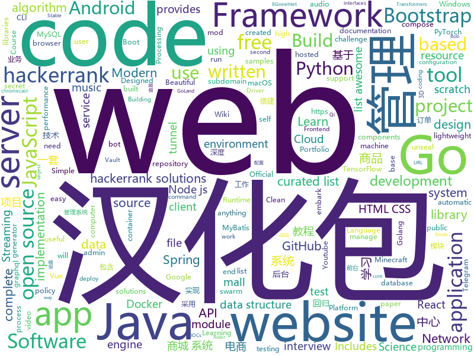

# 2019-12-08
See what the GitHub community is most excited about today.

## python
* [AIDungeon](https://github.com/nickwalton/AIDungeon)(**331 stars today**): 
* [demucs](https://github.com/facebookresearch/demucs)(**205 stars today**): Code for the paper Music Source Separation in the Waveform Domain
* [HelloGitHub](https://github.com/521xueweihan/HelloGitHub)(**438 stars today**): Find pearls on open-source seashore 分享 GitHub 上有趣、入门级的开源项目
* [public-apis](https://github.com/public-apis/public-apis)(**158 stars today**): A collective list of free APIs for use in software and web development.
* [YouCompleteMe](https://github.com/ycm-core/YouCompleteMe)(**11 stars today**): A code-completion engine for Vim
* [awspx](https://github.com/FSecureLABS/awspx)(**36 stars today**): A graph-based tool for visualizing effective access and resource relationships in AWS environments.
* [faceswap](https://github.com/deepfakes/faceswap)(**32 stars today**): Deepfakes Software For All
* [python-cheatsheet](https://github.com/gto76/python-cheatsheet)(**12 stars today**): Comprehensive Python Cheatsheet
* [mopidy](https://github.com/mopidy/mopidy)(**4 stars today**): Mopidy is an extensible music server written in Python
* [Machine-Learning-Yearning-Vietnamese-Translation](https://github.com/aivivn/Machine-Learning-Yearning-Vietnamese-Translation)(**41 stars today**): 
* [Poker-with-Python](https://github.com/Jeremiah9000/Poker-with-Python)(**28 stars today**): Poker with Python
* [NeMo](https://github.com/NVIDIA/NeMo)(**6 stars today**): Neural Modules: a toolkit for conversational AI
* [blender-tools](https://github.com/EmbarkStudios/blender-tools)(**102 stars today**): 🐵Embark Addon for Blender - http://embark.dev
* [DeepHuman](https://github.com/ZhengZerong/DeepHuman)(**18 stars today**): Code for our ICCV paper "DeepHuman: 3D Human Reconstruction from a Single Image"
* [discord.py](https://github.com/Rapptz/discord.py)(**8 stars today**): An API wrapper for Discord written in Python.
* [d2l-zh](https://github.com/d2l-ai/d2l-zh)(**37 stars today**): 《动手学深度学习》：面向中文读者、能运行、可讨论。英文版即伯克利“深度学习导论”教材。
* [spyder](https://github.com/spyder-ide/spyder)(**10 stars today**): Official repository for Spyder - The Scientific Python Development Environment
* [transformers](https://github.com/huggingface/transformers)(**67 stars today**): 🤗Transformers: State-of-the-art Natural Language Processing for TensorFlow 2.0 and PyTorch.
* [XX-Net](https://github.com/XX-net/XX-Net)(**13 stars today**): a web proxy tool
* [DeepFaceLab](https://github.com/iperov/DeepFaceLab)(**20 stars today**): DeepFaceLab is a tool that utilizes machine learning to replace faces in videos. Includes prebuilt ready to work standalone Windows 7,8,10 binary (look readme.md).
* [neural-networks-and-deep-learning](https://github.com/mnielsen/neural-networks-and-deep-learning)(**13 stars today**): Code samples for my book "Neural Networks and Deep Learning"
* [Telethon](https://github.com/LonamiWebs/Telethon)(**8 stars today**): Pure Python 3 MTProto API Telegram client library, for bots too!
* [tensorboard](https://github.com/tensorflow/tensorboard)(**9 stars today**): TensorFlow's Visualization Toolkit
* [system-design-primer](https://github.com/donnemartin/system-design-primer)(**68 stars today**): Learn how to design large-scale systems. Prep for the system design interview. Includes Anki flashcards.
* [data-science-from-scratch](https://github.com/joelgrus/data-science-from-scratch)(**6 stars today**): code for Data Science From Scratch book

## java
* [mall-swarm](https://github.com/macrozheng/mall-swarm)(**69 stars today**): mall-swarm是一套微服务商城系统，采用了 Spring Cloud Greenwich、Spring Boot 2、MyBatis、Docker、Elasticsearch等核心技术，同时提供了基于Vue的管理后台方便快速搭建系统。mall-swarm在电商业务的基础集成了注册中心、配置中心、监控中心、网关等系统功能。文档齐全，附带全套Spring Cloud教程。
* [clojure](https://github.com/clojure/clojure)(**4 stars today**): The Clojure programming language
* [strimzi-kafka-operator](https://github.com/strimzi/strimzi-kafka-operator)(**4 stars today**): Apache Kafka running on Kubernetes
* [interviews](https://github.com/kdn251/interviews)(**22 stars today**): Everything you need to know to get the job.
* [MinecraftForge](https://github.com/MinecraftForge/MinecraftForge)(**3 stars today**): Modifications to the Minecraft base files to assist in compatibility between mods.
* [Hackerrank-Solutions](https://github.com/Java-aid/Hackerrank-Solutions)(**5 stars today**): hackerrank solutions github | hackerrank all solutions | hackerrank solutions for java | hackerrank video tutorial | hackerrank cracking the coding interview solutions | hackerrank data structures | hackerrank solutions algorithms | hackerrank challenge | hackerrank coding challenge | hackerrank algorithms solutions github| hackerrank problem so…
* [k-9](https://github.com/k9mail/k-9)(**5 stars today**): K-9 Mail – An Email app for Android
* [Android-Image-Cropper](https://github.com/ArthurHub/Android-Image-Cropper)(**4 stars today**): Image Cropping Library for Android, optimized for Camera / Gallery.
* [interview](https://github.com/mission-peace/interview)(**6 stars today**): Interview questions
* [mall](https://github.com/macrozheng/mall)(**73 stars today**): mall项目是一套电商系统，包括前台商城系统及后台管理系统，基于SpringBoot+MyBatis实现。 前台商城系统包含首页门户、商品推荐、商品搜索、商品展示、购物车、订单流程、会员中心、客户服务、帮助中心等模块。 后台管理系统包含商品管理、订单管理、会员管理、促销管理、运营管理、内容管理、统计报表、财务管理、权限管理、设置等模块。
* [mall-learning](https://github.com/macrozheng/mall-learning)(**31 stars today**): mall学习教程，架构、业务、技术要点全方位解析。mall项目（20k+star）是一套电商系统，使用现阶段主流技术实现。 涵盖了SpringBoot2.1.3、MyBatis3.4.6、Elasticsearch6.2.2、RabbitMQ3.7.15、Redis3.2、Mongodb3.2、Mysql5.7等技术，采用Docker容器化部署。
* [NewPipe](https://github.com/TeamNewPipe/NewPipe)(**11 stars today**): A libre lightweight streaming front-end for Android.
* [guava](https://github.com/google/guava)(**20 stars today**): Google core libraries for Java
* [baritone](https://github.com/cabaletta/baritone)(**5 stars today**): google maps for block game
* [runelite](https://github.com/runelite/runelite)(**4 stars today**): Open source Old School RuneScape client
* [incubator-hudi](https://github.com/apache/incubator-hudi)(**2 stars today**): Upserts And Incremental Processing on Big Data
* [termux-app](https://github.com/termux/termux-app)(**7 stars today**): Android terminal and Linux environment - app repository.
* [jdk](https://github.com/openjdk/jdk)(**11 stars today**): Read-only mirror of https://hg.openjdk.java.net/jdk/jdk
* [react-native-track-player](https://github.com/react-native-kit/react-native-track-player)(**2 stars today**): A fully fledged audio module created for music apps. Provides audio playback, external media controls, chromecast support, background mode and more!
* [proxyee-down](https://github.com/proxyee-down-org/proxyee-down)(**11 stars today**): http下载工具，基于http代理，支持多连接分块下载
* [Essentials](https://github.com/essentials/Essentials)(**1 stars today**): Essentials - Minecraft server command mod - Adds over 100 commands for use in-game to help manage a server
* [alibaba-rsocket-broker](https://github.com/alibaba/alibaba-rsocket-broker)(**15 stars today**): Alibaba RSocket Broker: Mesh, Streaming & IoT
* [java8-tutorial](https://github.com/winterbe/java8-tutorial)(**10 stars today**): Modern Java - A Guide to Java 8
* [gnirehtet](https://github.com/Genymobile/gnirehtet)(**20 stars today**): Gnirehtet provides reverse tethering for Android
* [testcontainers-java](https://github.com/testcontainers/testcontainers-java)(**2 stars today**): Testcontainers is a Java library that supports JUnit tests, providing lightweight, throwaway instances of common databases, Selenium web browsers, or anything else that can run in a Docker container.

## unknown
* [Punishing_GrayRaven_Tab](https://github.com/Kengxxiao/Punishing_GrayRaven_Tab)(**194 stars today**): 《战双：帕弥什》游戏数据
* [build-your-own-x](https://github.com/danistefanovic/build-your-own-x)(**78 stars today**): 🤓Build your own (insert technology here)
* [Best-websites-a-programmer-should-visit](https://github.com/sdmg15/Best-websites-a-programmer-should-visit)(**168 stars today**): 🔗Some useful websites for programmers.
* [weekly](https://github.com/ruanyf/weekly)(**19 stars today**): 科技爱好者周刊，每周五发布
* [project-based-learning](https://github.com/tuvtran/project-based-learning)(**141 stars today**): Curated list of project-based tutorials
* [Flutter-Course-Resources](https://github.com/londonappbrewery/Flutter-Course-Resources)(**20 stars today**): Learn to Code While Building Apps - The Complete Flutter Development Bootcamp
* [AMD_Vanilla](https://github.com/AMD-OSX/AMD_Vanilla)(**9 stars today**): Native AMD macOS via Clover & OpenCore
* [coding-interview-university](https://github.com/jwasham/coding-interview-university)(**86 stars today**): A complete computer science study plan to become a software engineer.
* [kubernetes-the-hard-way](https://github.com/kelseyhightower/kubernetes-the-hard-way)(**34 stars today**): Bootstrap Kubernetes the hard way on Google Cloud Platform. No scripts.
* [trackerslist](https://github.com/ngosang/trackerslist)(**62 stars today**): Updated list of public BitTorrent trackers
* [APT_Digital_Weapon](https://github.com/RedDrip7/APT_Digital_Weapon)(**19 stars today**): Indicators of compromise (IOCs) collected from public resources and categorized by Qi-AnXin.
* [stargan-v2](https://github.com/clovaai/stargan-v2)(**49 stars today**): StarGAN v2 - Official PyTorch Implementation
* [fengrenjie](https://github.com/renjie-feng-trash/fengrenjie)(**82 stars today**): 这个repo是为了锤北大垃圾教授——冯仁杰
* [computer-science](https://github.com/ossu/computer-science)(**45 stars today**): 🎓Path to a free self-taught education in Computer Science!
* [proposals](https://github.com/tc39/proposals)(**23 stars today**): Tracking ECMAScript Proposals
* [955.WLB](https://github.com/formulahendry/955.WLB)(**54 stars today**): 955 不加班的公司名单 - 工作 955，work–life balance (工作与生活的平衡)
* [awesome-java](https://github.com/akullpp/awesome-java)(**13 stars today**): A curated list of awesome frameworks, libraries and software for the Java programming language.
* [TaiChi](https://github.com/taichi-framework/TaiChi)(**9 stars today**): A framework to use Xposed module with or without Root/Unlock bootloader, supportting Android 5.0 ~ 10.0
* [new-pac](https://github.com/Alvin9999/new-pac)(**39 stars today**): 科学/自由上网，免费ss/ssr/v2ray/goflyway账号，搭建教程
* [android](https://github.com/LineageOS/android)(**6 stars today**): 
* [Beginner-Network-Pentesting](https://github.com/hmaverickadams/Beginner-Network-Pentesting)(**13 stars today**): Notes for Beginner Network Pentesting Course
* [AutoSSR](https://github.com/voken100g/AutoSSR)(**4 stars today**): share FREE shadowsocks(R) servers here
* [p1xt-guides](https://github.com/P1xt/p1xt-guides)(**6 stars today**): Programming curricula
* [patterns](https://github.com/rust-unofficial/patterns)(**5 stars today**): A catalogue of Rust design patterns
* [established-remote](https://github.com/yanirs/established-remote)(**17 stars today**): A list of established remote companies

## javascript
* [nano-neuron](https://github.com/trekhleb/nano-neuron)(**726 stars today**): 🤖NanoNeuron is 7 simple JavaScript functions that will give you a feeling of how machines can actually "learn"
* [awesome-selfhosted](https://github.com/awesome-selfhosted/awesome-selfhosted)(**145 stars today**): A list of Free Software network services and web applications which can be hosted locally. Selfhosting is the process of hosting and managing applications instead of renting from Software-as-a-Service providers
* [javascript-algorithms](https://github.com/trekhleb/javascript-algorithms)(**122 stars today**): 📝Algorithms and data structures implemented in JavaScript with explanations and links to further readings
* [mukemmel-blog](https://github.com/SelmanKahya/mukemmel-blog)(**6 stars today**): Bu proje nasıl kodlandı izlemek ister misin? Youtube videosu:
* [freeCodeCamp](https://github.com/freeCodeCamp/freeCodeCamp)(**54 stars today**): The https://www.freeCodeCamp.org open source codebase and curriculum. Learn to code for free together with millions of people.
* [express-graphql-mongodb-boilerplate](https://github.com/watscho/express-graphql-mongodb-boilerplate)(**54 stars today**): A boilerplate for Node.js apps / API server / Authentication from scratch - express, graphql - (graphql compose), mongodb (mongoose).
* [nodebestpractices](https://github.com/goldbergyoni/nodebestpractices)(**73 stars today**): ✅The largest Node.js best practices list (November 2019)
* [cypress](https://github.com/cypress-io/cypress)(**45 stars today**): Fast, easy and reliable testing for anything that runs in a browser.
* [node](https://github.com/nodejs/node)(**40 stars today**): Node.js JavaScript runtime✨🐢🚀✨
* [react-shopping-cart](https://github.com/jeffersonRibeiro/react-shopping-cart)(**3 stars today**): 🛍️Simple ecommerce cart application built with React Redux
* [brackets](https://github.com/adobe/brackets)(**13 stars today**): An open source code editor for the web, written in JavaScript, HTML and CSS.
* [udemy-docker-mastery](https://github.com/BretFisher/udemy-docker-mastery)(**10 stars today**): Udemy Course to build, compose, deploy, and manage containers from local development to high-availability in the cloud
* [eui](https://github.com/elastic/eui)(**76 stars today**): Elastic UI Framework🙌
* [lite-youtube-embed](https://github.com/paulirish/lite-youtube-embed)(**79 stars today**): A faster youtube embed.
* [bootstrap-vue](https://github.com/bootstrap-vue/bootstrap-vue)(**8 stars today**): BootstrapVue, with over 40 plugins and more than 80 custom components, provides one of the most comprehensive implementations of Bootstrap v4 components and grid system for Vue.js. With extensive and automated WAI-ARIA accessibility markup.
* [outline](https://github.com/outline/outline)(**21 stars today**): The fastest wiki and knowledge base for growing teams. Beautiful, feature rich, markdown compatible and open source.
* [reactide](https://github.com/reactide/reactide)(**11 stars today**): Reactide is the first dedicated IDE for React web application development.
* [lodash](https://github.com/lodash/lodash)(**31 stars today**): A modern JavaScript utility library delivering modularity, performance, & extras.
* [rabbitmq-website](https://github.com/rabbitmq/rabbitmq-website)(**18 stars today**): RabbitMQ website and documentation guides
* [AriaNg](https://github.com/mayswind/AriaNg)(**13 stars today**): AriaNg, a modern web frontend making aria2 easier to use.
* [webtorrent-desktop](https://github.com/webtorrent/webtorrent-desktop)(**6 stars today**): ❤️Streaming torrent app for Mac, Windows, and Linux
* [generator-jhipster](https://github.com/jhipster/generator-jhipster)(**10 stars today**): Open Source application platform for creating Spring Boot + Angular/React projects in seconds!
* [riot-web](https://github.com/vector-im/riot-web)(**4 stars today**): A glossy Matrix collaboration client for the web.
* [telegraf](https://github.com/telegraf/telegraf)(**8 stars today**): Modern Telegram Bot Framework for Node.js
* [quasar](https://github.com/quasarframework/quasar)(**13 stars today**): Quasar Framework - Build high-performance VueJS user interfaces in record time

## html
* [ClashA](https://github.com/ccg2018/ClashA)(**16 stars today**): A Android GUI for Clash
* [coreui-free-bootstrap-admin-template](https://github.com/coreui/coreui-free-bootstrap-admin-template)(**6 stars today**): CoreUI is free bootstrap admin template
* [TranslatorX](https://github.com/pingfangx/TranslatorX)(**17 stars today**): JetBrains 系列软件汉化包 关键字: Android Studio 3.5 汉化包 CLion 2019.2 汉化包 DataGrip 2019.2 汉化包 GoLand 2019.2 汉化包 IntelliJ IDEA 2019.2 汉化包 PhpStorm 2019.2 汉化包 PyCharm 2019.2 汉化包 Rider 2019.2 汉化包 RubyMine 2019.2 汉化包 WebStorm 2019.2 汉化包
* [PortFolio_Website](https://github.com/akashyap2013/PortFolio_Website)(**2 stars today**): Complete Portfolio Website with Bootstrap - HTML/CSS In this project, we are going to learn and build how to create a complete portfolio website with bootstrap using HTML and CSS. We will understand everything from scratch.
* [webdevbootcamp](https://github.com/nax3t/webdevbootcamp)(**9 stars today**): All source code for back-end projects from the Web Developer Bootcamp
* [pcc_2e](https://github.com/ehmatthes/pcc_2e)(**1 stars today**): Online resources for Python Crash Course (Second Edition), from No Starch Press
* [quickstart-js](https://github.com/firebase/quickstart-js)(**1 stars today**): Firebase Quickstart Samples for Web
* [Machine-Learning](https://github.com/Jack-Cherish/Machine-Learning)(**4 stars today**): ⚡️机器学习实战（Python3）：kNN、决策树、贝叶斯、逻辑回归、SVM、线性回归、树回归
* [passdb-frontend](https://github.com/audibleblink/passdb-frontend)(**62 stars today**): Pivoting Frontend for Pre-Seeded Password Databases
* [awesome-piracy](https://github.com/Igglybuff/awesome-piracy)(**15 stars today**): A curated list of awesome warez and piracy links
* [docs](https://github.com/aws-amplify/docs)(**0 stars today**): Amplify Framework Documentation
* [home-assistant.io](https://github.com/home-assistant/home-assistant.io)(**1 stars today**): 📘Home Assistant User documentation
* [ctf-wiki](https://github.com/ctf-wiki/ctf-wiki)(**3 stars today**): CTF Wiki Online. Come and join us, we need you!
* [glTF](https://github.com/KhronosGroup/glTF)(**2 stars today**): glTF – Runtime 3D Asset Delivery
* [AR.js](https://github.com/jeromeetienne/AR.js)(**13 stars today**): Efficient Augmented Reality for the Web - 60fps on mobile!
* [en.javascript.info](https://github.com/javascript-tutorial/en.javascript.info)(**17 stars today**): Modern JavaScript Tutorial
* [startbootstrap-resume](https://github.com/BlackrockDigital/startbootstrap-resume)(**3 stars today**): A Bootstrap 4 resume/CV theme created by Start Bootstrap
* [Adminator-admin-dashboard](https://github.com/puikinsh/Adminator-admin-dashboard)(**2 stars today**): Adminator is a easy to use and well design admin dashboard template for web apps, websites, services and more
* [Java-Interview-Advanced](https://github.com/shishan100/Java-Interview-Advanced)(**16 stars today**): 中华石杉--互联网Java进阶面试训练营
* [hugo-academic](https://github.com/gcushen/hugo-academic)(**10 stars today**): 📝The website builder for Hugo. Build and deploy a beautiful website in minutes!
* [ecma262](https://github.com/tc39/ecma262)(**5 stars today**): Status, process, and documents for ECMA-262
* [awesome-competitive-programming](https://github.com/lnishan/awesome-competitive-programming)(**10 stars today**): 💎A curated list of awesome Competitive Programming, Algorithm and Data Structure resources
* [Keka](https://github.com/aonez/Keka)(**3 stars today**): The macOS file archiver
* [web-api-auth-examples](https://github.com/spotify/web-api-auth-examples)(**0 stars today**): Basic examples to authenticate and fetch data using the Spotify Web API
* [typedoc](https://github.com/TypeStrong/typedoc)(**8 stars today**): Documentation generator for TypeScript projects.

## go
* [subfinder](https://github.com/projectdiscovery/subfinder)(**28 stars today**): Subfinder is a subdomain discovery tool that discovers valid subdomains for websites. Designed as a passive framework to be useful for bug bounties and safe for penetration testing.
* [go-ipfs](https://github.com/ipfs/go-ipfs)(**16 stars today**): IPFS implementation in Go
* [gitea](https://github.com/go-gitea/gitea)(**26 stars today**): Git with a cup of tea, painless self-hosted git service
* [kcptun](https://github.com/xtaci/kcptun)(**6 stars today**): A Stable & Secure Tunnel based on KCP with N:M multiplexing and FEC. Available for ARM, MIPS, 386 and AMD64
* [ffuf](https://github.com/ffuf/ffuf)(**27 stars today**): Fast web fuzzer written in Go
* [lnd](https://github.com/lightningnetwork/lnd)(**4 stars today**): Lightning Network Daemon⚡️
* [geph2](https://github.com/geph-official/geph2)(**19 stars today**): Geph (迷霧通) is a modular Internet censorship circumvention system designed specifically to deal with national filtering.
* [BaiduPCS-Go](https://github.com/iikira/BaiduPCS-Go)(**33 stars today**): 百度网盘客户端 - Go语言编写
* [learn-go-with-tests](https://github.com/quii/learn-go-with-tests)(**14 stars today**): Learn Go with test-driven development
* [Go-Web-Server](https://github.com/photonlines/Go-Web-Server)(**196 stars today**): A Go web server with built in logging, tracing, health check, and graceful shutdown. It also includes a few demo applications showing the Go HTML temple functionality.
* [ngrok](https://github.com/inconshreveable/ngrok)(**18 stars today**): Introspected tunnels to localhost
* [conftest](https://github.com/instrumenta/conftest)(**6 stars today**): Write tests against structured configuration data using the Open Policy Agent Rego query language
* [go-clean-arch](https://github.com/bxcodec/go-clean-arch)(**3 stars today**): Go (Golang) Clean Architecture based on Reading Uncle Bob's Clean Architecture
* [gdrive](https://github.com/gdrive-org/gdrive)(**7 stars today**): Google Drive CLI Client
* [coredns](https://github.com/coredns/coredns)(**15 stars today**): CoreDNS is a DNS server that chains plugins
* [clash](https://github.com/Dreamacro/clash)(**23 stars today**): A rule-based tunnel in Go.
* [syncthing](https://github.com/syncthing/syncthing)(**27 stars today**): Open Source Continuous File Synchronization
* [gofakeit](https://github.com/brianvoe/gofakeit)(**82 stars today**): Random fake data generator written in go
* [gitrob](https://github.com/michenriksen/gitrob)(**3 stars today**): Reconnaissance tool for GitHub organizations
* [opa](https://github.com/open-policy-agent/opa)(**8 stars today**): An open source, general-purpose policy engine.
* [go-swagger](https://github.com/go-swagger/go-swagger)(**6 stars today**): Swagger 2.0 implementation for go
* [mysql](https://github.com/go-sql-driver/mysql)(**10 stars today**): Go MySQL Driver is a MySQL driver for Go's (golang) database/sql package
* [mux](https://github.com/gorilla/mux)(**19 stars today**): A powerful HTTP router and URL matcher for building Go web servers with🦍
* [bank-vaults](https://github.com/banzaicloud/bank-vaults)(**3 stars today**): A Vault swiss-army knife: a K8s operator, Go client with automatic token renewal, automatic configuration, multiple unseal options and more. A CLI tool to init, unseal and configure Vault (auth methods, secret engines). Direct secret injection into Pods.
* [tools](https://github.com/istio/tools)(**0 stars today**): Tools shared by several Istio repositories

## WordCloud

