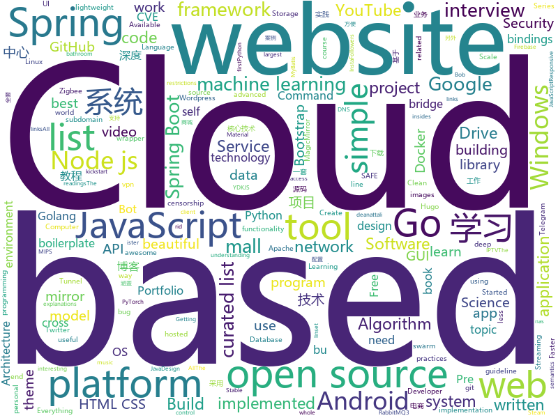

# 2019-12-09
See what the GitHub community is most excited about today.

## python
* [AIDungeon](https://github.com/AIDungeon/AIDungeon)(**378 stars today**): 
* [youtube-dl](https://github.com/ytdl-org/youtube-dl)(**29 stars today**): Command-line program to download videos from YouTube.com and other video sites
* [alpha_vantage](https://github.com/RomelTorres/alpha_vantage)(**24 stars today**): A python wrapper for Alpha Vantage API for financial data.
* [PythonPlantsVsZombies](https://github.com/marblexu/PythonPlantsVsZombies)(**26 stars today**): a simple PlantsVsZombies game
* [HelloGitHub](https://github.com/521xueweihan/HelloGitHub)(**527 stars today**): Find pearls on open-source seashore 分享 GitHub 上有趣、入门级的开源项目
* [YouCompleteMe](https://github.com/ycm-core/YouCompleteMe)(**16 stars today**): A code-completion engine for Vim
* [Python](https://github.com/TheAlgorithms/Python)(**59 stars today**): All Algorithms implemented in Python
* [system-design-primer](https://github.com/donnemartin/system-design-primer)(**73 stars today**): Learn how to design large-scale systems. Prep for the system design interview. Includes Anki flashcards.
* [faceswap](https://github.com/deepfakes/faceswap)(**36 stars today**): Deepfakes Software For All
* [pytorch-lightning](https://github.com/williamFalcon/pytorch-lightning)(**16 stars today**): The lightweight PyTorch wrapper for ML researchers. Scale your models. Write less boilerplate
* [d2l-zh](https://github.com/d2l-ai/d2l-zh)(**56 stars today**): 《动手学深度学习》：面向中文读者、能运行、可讨论。英文版即伯克利“深度学习导论”教材。
* [mopidy](https://github.com/mopidy/mopidy)(**5 stars today**): Mopidy is an extensible music server written in Python
* [flan](https://github.com/cloudflare/flan)(**48 stars today**): A pretty sweet vulnerability scanner
* [unilm](https://github.com/microsoft/unilm)(**12 stars today**): UniLM - Unified Language Model Pre-training
* [zipline](https://github.com/quantopian/zipline)(**4 stars today**): Zipline, a Pythonic Algorithmic Trading Library
* [model-optimization](https://github.com/tensorflow/model-optimization)(**24 stars today**): A suite of tools that users, both novice and advanced, can use to optimize machine learning models for deployment and execution.
* [pixel-battle-botnet](https://github.com/kumfc/pixel-battle-botnet)(**2 stars today**): VK Pixel Battle 2019 Botnet
* [docker-pi-hole](https://github.com/pi-hole/docker-pi-hole)(**4 stars today**): Pi-hole in a docker container
* [captum](https://github.com/pytorch/captum)(**7 stars today**): Model interpretability and understanding for PyTorch
* [elastic](https://github.com/pytorch/elastic)(**38 stars today**): PyTorch elastic training
* [mlcourse.ai](https://github.com/Yorko/mlcourse.ai)(**5 stars today**): Open Machine Learning Course
* [home-assistant](https://github.com/home-assistant/home-assistant)(**36 stars today**): 🏡Open source home automation that puts local control and privacy first
* [colabtools](https://github.com/googlecolab/colabtools)(**4 stars today**): Python libraries for Google Colaboratory
* [scikit-learn](https://github.com/scikit-learn/scikit-learn)(**17 stars today**): scikit-learn: machine learning in Python
* [wifite2](https://github.com/derv82/wifite2)(**3 stars today**): Rewrite of the popular wireless network auditor, "wifite"

## java
* [mall-swarm](https://github.com/macrozheng/mall-swarm)(**176 stars today**): mall-swarm是一套微服务商城系统，采用了 Spring Cloud Greenwich、Spring Boot 2、MyBatis、Docker、Elasticsearch等核心技术，同时提供了基于Vue的管理后台方便快速搭建系统。mall-swarm在电商业务的基础集成了注册中心、配置中心、监控中心、网关等系统功能。文档齐全，附带全套Spring Cloud教程。
* [interviews](https://github.com/kdn251/interviews)(**29 stars today**): Everything you need to know to get the job.
* [termux-app](https://github.com/termux/termux-app)(**9 stars today**): Android terminal and Linux environment - app repository.
* [openhab2-addons](https://github.com/openhab/openhab2-addons)(**1 stars today**): Add-ons for openHAB 2.x
* [complete-microservices-env](https://github.com/juliofalbo/complete-microservices-env)(**10 stars today**): This is a whole environment of a Microservices Architecture using Spring Cloud, Splunk, Zipkin, Grafana, Prometheus, Postgres with Replication Strategy, Redis and RabbitMQ.
* [graal](https://github.com/oracle/graal)(**18 stars today**): GraalVM: Run Programs Faster Anywhere🚀
* [maven](https://github.com/apache/maven)(**4 stars today**): Apache Maven core
* [Java](https://github.com/TheAlgorithms/Java)(**26 stars today**): All Algorithms implemented in Java
* [java-design-patterns](https://github.com/iluwatar/java-design-patterns)(**33 stars today**): Design patterns implemented in Java
* [spring-security-oauth](https://github.com/Baeldung/spring-security-oauth)(**2 stars today**): Just Announced - "Learn Spring Security OAuth":
* [k-9](https://github.com/k9mail/k-9)(**6 stars today**): K-9 Mail – An Email app for Android
* [springboot-learning-example](https://github.com/JeffLi1993/springboot-learning-example)(**26 stars today**): spring boot 实践学习案例，是 spring boot 初学者及核心技术巩固的最佳实践。另外写博客，用 OpenWrite。
* [Alink](https://github.com/alibaba/Alink)(**92 stars today**): Alink is the Machine Learning algorithm platform based on Flink, developed by the PAI team of Alibaba computing platform.
* [proxyee-down](https://github.com/proxyee-down-org/proxyee-down)(**16 stars today**): http下载工具，基于http代理，支持多连接分块下载
* [mall-learning](https://github.com/macrozheng/mall-learning)(**34 stars today**): mall学习教程，架构、业务、技术要点全方位解析。mall项目（20k+star）是一套电商系统，使用现阶段主流技术实现。 涵盖了SpringBoot2.1.3、MyBatis3.4.6、Elasticsearch6.2.2、RabbitMQ3.7.15、Redis3.2、Mongodb3.2、Mysql5.7等技术，采用Docker容器化部署。
* [SpringAll](https://github.com/wuyouzhuguli/SpringAll)(**48 stars today**): 循序渐进，学习Spring Boot、Spring Boot & Shiro、Spring Cloud、Spring Security & Spring Security OAuth2，博客Spring系列源码
* [cassandra](https://github.com/apache/cassandra)(**5 stars today**): Mirror of Apache Cassandra
* [EhViewer](https://github.com/seven332/EhViewer)(**6 stars today**): [DEPRECATED] An Unofficial E-Hentai Application for Android
* [interview](https://github.com/mission-peace/interview)(**9 stars today**): Interview questions
* [Terasology](https://github.com/MovingBlocks/Terasology)(**1 stars today**): Terasology - open source voxel world
* [NewPipe](https://github.com/TeamNewPipe/NewPipe)(**14 stars today**): A libre lightweight streaming front-end for Android.
* [Interview-Questions](https://github.com/rishabh115/Interview-Questions)(**5 stars today**): Most comprehensive list📋of tech interview questions📘of companies scraped from Geeksforgeeks, CareerCup and Glassdoor.
* [CtCI-6th-Edition](https://github.com/careercup/CtCI-6th-Edition)(**9 stars today**): Cracking the Coding Interview 6th Ed. Solutions
* [NetGuard](https://github.com/M66B/NetGuard)(**2 stars today**): A simple way to block access to the internet per app
* [algorithm004-03](https://github.com/algorithm004-03/algorithm004-03)(**0 stars today**): 

## unknown
* [You-Dont-Know-JS](https://github.com/getify/You-Dont-Know-JS)(**50 stars today**): A book series on JavaScript. @YDKJS on twitter.
* [Huawei-Joke](https://github.com/HuaweiJoke/Huawei-Joke)(**113 stars today**): 本项目将收集因审查而被删除的关于华为公司的笑话。欢迎大家投稿。
* [Best-websites-a-programmer-should-visit](https://github.com/sdmg15/Best-websites-a-programmer-should-visit)(**308 stars today**): 🔗Some useful websites for programmers.
* [weekly](https://github.com/ruanyf/weekly)(**66 stars today**): 科技爱好者周刊，每周五发布
* [Manual](https://github.com/Bloomberg-Beta/Manual)(**6 stars today**): You were probably looking for our website... this is it. We moved our website here, so you can see the insides of how we work.
* [Production-Level-Deep-Learning](https://github.com/alirezadir/Production-Level-Deep-Learning)(**69 stars today**): A guideline for building practical production-level deep learning systems to be deployed in real world applications.
* [955.WLB](https://github.com/formulahendry/955.WLB)(**60 stars today**): 955 不加班的公司名单 - 工作 955，work–life balance (工作与生活的平衡)
* [awesome-iptv](https://github.com/iptv-org/awesome-iptv)(**7 stars today**): A curated list of resources related to IPTV
* [go](https://github.com/datasciencemasters/go)(**7 stars today**): The Open Source Data Science Masters
* [trackerslist](https://github.com/ngosang/trackerslist)(**84 stars today**): Updated list of public BitTorrent trackers
* [build-your-own-x](https://github.com/danistefanovic/build-your-own-x)(**101 stars today**): 🤓Build your own (insert technology here)
* [project-based-learning](https://github.com/tuvtran/project-based-learning)(**229 stars today**): Curated list of project-based tutorials
* [incentivized-testnet-stakepool-registry](https://github.com/cardano-foundation/incentivized-testnet-stakepool-registry)(**6 stars today**): 
* [deploy-your-own-saas](https://github.com/Atarity/deploy-your-own-saas)(**224 stars today**): List of "only yours" cloud services for everyday needs🏴
* [open-source-cs](https://github.com/ForrestKnight/open-source-cs)(**12 stars today**): Video discussing this curriculum:
* [awesome-public-datasets](https://github.com/awesomedata/awesome-public-datasets)(**37 stars today**): A topic-centric list of HQ open datasets. PR ☛☛☛
* [Investment-Documents](https://github.com/Bloomberg-Beta/Investment-Documents)(**15 stars today**): Bloomberg Beta's Investment Documents for Series Seed, SAFEs, and Notes
* [awesome](https://github.com/sindresorhus/awesome)(**68 stars today**): 😎Awesome lists about all kinds of interesting topics
* [Profiles](https://github.com/ConnersHua/Profiles)(**12 stars today**): 
* [Interview_Question_for_Beginner](https://github.com/JaeYeopHan/Interview_Question_for_Beginner)(**7 stars today**): 👦👧Technical-Interview guidelines written for those who started studying programming. I wish you all the best.👾
* [clash_for_windows_pkg](https://github.com/Fndroid/clash_for_windows_pkg)(**12 stars today**): A Windows GUI based on Clash
* [kubernetes-the-hard-way](https://github.com/kelseyhightower/kubernetes-the-hard-way)(**45 stars today**): Bootstrap Kubernetes the hard way on Google Cloud Platform. No scripts.
* [computer-science](https://github.com/ossu/computer-science)(**64 stars today**): 🎓Path to a free self-taught education in Computer Science!
* [Project-Based-Tutorials-in-C](https://github.com/rby90/Project-Based-Tutorials-in-C)(**5 stars today**): A curated list of project-based tutorials in C

## javascript
* [CVE-2019-11708](https://github.com/0vercl0k/CVE-2019-11708)(**137 stars today**): Full exploit chain (CVE-2019-11708 & CVE-2019-9810) against Firefox on Windows 64-bit.
* [mukemmel-blog](https://github.com/SelmanKahya/mukemmel-blog)(**6 stars today**): Bu proje nasıl kodlandı izlemek ister misin? Youtube videosu:
* [nodebestpractices](https://github.com/goldbergyoni/nodebestpractices)(**122 stars today**): ✅The largest Node.js best practices list (November 2019)
* [keystone](https://github.com/keystonejs/keystone)(**18 stars today**): A scalable platform and CMS to build Node.js applications
* [awesome-selfhosted](https://github.com/awesome-selfhosted/awesome-selfhosted)(**109 stars today**): A list of Free Software network services and web applications which can be hosted locally. Selfhosting is the process of hosting and managing applications instead of renting from Software-as-a-Service providers
* [lite-youtube-embed](https://github.com/paulirish/lite-youtube-embed)(**129 stars today**): A faster youtube embed.
* [zigbee2mqtt](https://github.com/Koenkk/zigbee2mqtt)(**8 stars today**): Zigbee🐝to MQTT bridge🌉, get rid of your proprietary Zigbee bridges🔨
* [node](https://github.com/nodejs/node)(**70 stars today**): Node.js JavaScript runtime✨🐢🚀✨
* [webtorrent-desktop](https://github.com/webtorrent/webtorrent-desktop)(**4 stars today**): ❤️Streaming torrent app for Mac, Windows, and Linux
* [bustag](https://github.com/gxtrobot/bustag)(**10 stars today**): a tag and recommend system for old bus driver 给老司机用的一个番号推荐系统
* [MagicMirror](https://github.com/MichMich/MagicMirror)(**8 stars today**): MagicMirror² is an open source modular smart mirror platform. With a growing list of installable modules, the MagicMirror² allows you to convert your hallway or bathroom mirror into your personal assistant.
* [discord.js](https://github.com/discordjs/discord.js)(**3 stars today**): A powerful JavaScript library for interacting with the Discord API
* [javascript-algorithms](https://github.com/trekhleb/javascript-algorithms)(**178 stars today**): 📝Algorithms and data structures implemented in JavaScript with explanations and links to further readings
* [next.js](https://github.com/zeit/next.js)(**26 stars today**): The React Framework
* [fastify](https://github.com/fastify/fastify)(**11 stars today**): Fast and low overhead web framework, for Node.js
* [magnetW](https://github.com/xiandanin/magnetW)(**12 stars today**): 磁力链接聚合搜索 - https://magnetw.app
* [brackets](https://github.com/adobe/brackets)(**18 stars today**): An open source code editor for the web, written in JavaScript, HTML and CSS.
* [firebaseui-web](https://github.com/firebase/firebaseui-web)(**5 stars today**): FirebaseUI is an open-source JavaScript library for Web that provides simple, customizable UI bindings on top of Firebase SDKs to eliminate boilerplate code and promote best practices.
* [plyr](https://github.com/sampotts/plyr)(**6 stars today**): A simple HTML5, YouTube and Vimeo player
* [carbon](https://github.com/carbon-app/carbon)(**17 stars today**): 🎨Create and share beautiful images of your source code
* [js-tetris](https://github.com/melcor76/js-tetris)(**4 stars today**): JavaScript Tetris
* [telegraf](https://github.com/telegraf/telegraf)(**10 stars today**): Modern Telegram Bot Framework for Node.js
* [pwnagotchi](https://github.com/evilsocket/pwnagotchi)(**14 stars today**): (⌐■_■) - Deep Reinforcement Learning instrumenting bettercap for WiFi pwning.
* [etcher](https://github.com/balena-io/etcher)(**9 stars today**): Flash OS images to SD cards & USB drives, safely and easily.
* [wp-calypso](https://github.com/Automattic/wp-calypso)(**2 stars today**): The JavaScript and API powered WordPress.com

## html
* [FOSSASAT-1](https://github.com/FOSSASystems/FOSSASAT-1)(**8 stars today**): 
* [PortFolio_Website](https://github.com/akashyap2013/PortFolio_Website)(**1 stars today**): Complete Portfolio Website with Bootstrap - HTML/CSS In this project, we are going to learn and build how to create a complete portfolio website with bootstrap using HTML and CSS. We will understand everything from scratch.
* [passdb-frontend](https://github.com/audibleblink/passdb-frontend)(**20 stars today**): WIP: (do not use) Pivoting Frontend for Pre-Seeded Password Databases
* [beautiful-jekyll](https://github.com/daattali/beautiful-jekyll)(**4 stars today**): ✨Build a beautiful and simple website in literally minutes. Demo at http://deanattali.com/beautiful-jekyll
* [shellphish](https://github.com/thelinuxchoice/shellphish)(**1 stars today**): Phishing Tool for 18 social media: Instagram, Facebook, Snapchat, Github, Twitter, Yahoo, Protonmail, Spotify, Netflix, Linkedin, Wordpress, Origin, Steam, Microsoft, InstaFollowers, Gitlab, Pinterest
* [hugo-coder](https://github.com/luizdepra/hugo-coder)(**2 stars today**): A minimalist blog theme for hugo.
* [ClashA](https://github.com/ccg2018/ClashA)(**19 stars today**): A Android GUI for Clash
* [Markdown-Resume](https://github.com/CyC2018/Markdown-Resume)(**3 stars today**): ⭐️Markdown 简历模版
* [fluxion](https://github.com/FluxionNetwork/fluxion)(**3 stars today**): Fluxion is a remake of linset by vk496 with less bugs and enhanced functionality.
* [python-getting-started](https://github.com/heroku/python-getting-started)(**1 stars today**): Getting Started with Python on Heroku.
* [Machine-Learning-in-Action-Python3](https://github.com/wzy6642/Machine-Learning-in-Action-Python3)(**4 stars today**): 《机器学习实战》python3源码
* [awesome-piracy](https://github.com/Igglybuff/awesome-piracy)(**18 stars today**): A curated list of awesome warez and piracy links
* [webdevbootcamp](https://github.com/nax3t/webdevbootcamp)(**10 stars today**): All source code for back-end projects from the Web Developer Bootcamp
* [personal-website](https://github.com/github/personal-website)(**4 stars today**): Code that'll help you kickstart a personal website that showcases your work as a software developer.
* [roll20-character-sheets](https://github.com/Roll20/roll20-character-sheets)(**0 stars today**): Character sheet templates created by the community for use in Roll20.
* [web](https://github.com/OCA/web)(**0 stars today**): Odoo web client UI related addons
* [blog_os](https://github.com/phil-opp/blog_os)(**4 stars today**): Writing an OS in Rust
* [REKCARC-TSC-UHT](https://github.com/PKUanonym/REKCARC-TSC-UHT)(**14 stars today**): 清华大学计算机系课程攻略 Guidance for courses in Department of Computer Science and Technology, Tsinghua University
* [AQI-Project](https://github.com/krishnaik06/AQI-Project)(**0 stars today**): 
* [ru.javascript.info](https://github.com/javascript-tutorial/ru.javascript.info)(**6 stars today**): Современный учебник JavaScript
* [win95.css](https://github.com/AlexBSoft/win95.css)(**16 stars today**): Responsive Bootstrap 4 windows 95/98 theme & landing template
* [HiddenEye](https://github.com/DarkSecDevelopers/HiddenEye)(**3 stars today**): Modern Phishing Tool With Advanced Functionality And Multiple Tunnelling Services [ Android-Support-Available ]
* [gohugo-theme-ananke](https://github.com/budparr/gohugo-theme-ananke)(**2 stars today**): Ananke: A theme for Hugo Sites
* [Introduction-to-Web-Development](https://github.com/WebDevSimplified/Introduction-to-Web-Development)(**2 stars today**): 
* [go101](https://github.com/go101/go101)(**3 stars today**): An online book focusing on Go syntax/semantics.

## go
* [rclone](https://github.com/rclone/rclone)(**12 stars today**): "rsync for cloud storage" - Google Drive, Amazon Drive, S3, Dropbox, Backblaze B2, One Drive, Swift, Hubic, Cloudfiles, Google Cloud Storage, Yandex Files
* [lantern](https://github.com/getlantern/lantern)(**19 stars today**): Lantern官方版本下载 蓝灯 翻墙 科学上网 外网 加速器 梯子 路由 lantern censorship-circumvention censorship gfw vpn accelerator
* [v2ray-core](https://github.com/v2ray/v2ray-core)(**37 stars today**): A platform for building proxies to bypass network restrictions.
* [lnd](https://github.com/lightningnetwork/lnd)(**6 stars today**): Lightning Network Daemon⚡️
* [hugo](https://github.com/gohugoio/hugo)(**19 stars today**): The world’s fastest framework for building websites.
* [gitea](https://github.com/go-gitea/gitea)(**28 stars today**): Git with a cup of tea, painless self-hosted git service
* [brook](https://github.com/txthinking/brook)(**9 stars today**): Brook is a cross-platform(Linux/MacOS/Windows/Android/iOS) proxy/vpn software
* [gopl.io](https://github.com/adonovan/gopl.io)(**4 stars today**): Example programs from "The Go Programming Language"
* [jwt-go](https://github.com/dgrijalva/jwt-go)(**7 stars today**): Golang implementation of JSON Web Tokens (JWT)
* [golang-web-dev](https://github.com/GoesToEleven/golang-web-dev)(**3 stars today**): 
* [BaiduPCS-Go](https://github.com/iikira/BaiduPCS-Go)(**19 stars today**): 百度网盘客户端 - Go语言编写
* [gitrob](https://github.com/michenriksen/gitrob)(**7 stars today**): Reconnaissance tool for GitHub organizations
* [clash](https://github.com/Dreamacro/clash)(**29 stars today**): A rule-based tunnel in Go.
* [tinygo](https://github.com/tinygo-org/tinygo)(**18 stars today**): Go compiler for small places. Microcontrollers, WebAssembly, and command-line tools. Based on LLVM.
* [kcptun](https://github.com/xtaci/kcptun)(**9 stars today**): A Stable & Secure Tunnel based on KCP with N:M multiplexing and FEC. Available for ARM, MIPS, 386 and AMD64
* [telegram-bot-api](https://github.com/go-telegram-bot-api/telegram-bot-api)(**2 stars today**): Golang bindings for the Telegram Bot API
* [go-ipfs](https://github.com/ipfs/go-ipfs)(**43 stars today**): IPFS implementation in Go
* [cockroach](https://github.com/cockroachdb/cockroach)(**5 stars today**): CockroachDB - the open source, cloud-native SQL database.
* [fyne](https://github.com/fyne-io/fyne)(**10 stars today**): Cross platform GUI in Go based on Material Design
* [errors](https://github.com/pkg/errors)(**4 stars today**): Simple error handling primitives
* [go-clean-arch](https://github.com/bxcodec/go-clean-arch)(**9 stars today**): Go (Golang) Clean Architecture based on Reading Uncle Bob's Clean Architecture
* [subfinder](https://github.com/projectdiscovery/subfinder)(**116 stars today**): Subfinder is a subdomain discovery tool that discovers valid subdomains for websites. Designed as a passive framework to be useful for bug bounties and safe for penetration testing.
* [opentelemetry-go](https://github.com/open-telemetry/opentelemetry-go)(**3 stars today**): 
* [dns](https://github.com/miekg/dns)(**6 stars today**): DNS library in Go
* [subjack](https://github.com/haccer/subjack)(**11 stars today**): Subdomain Takeover tool written in Go

## WordCloud

