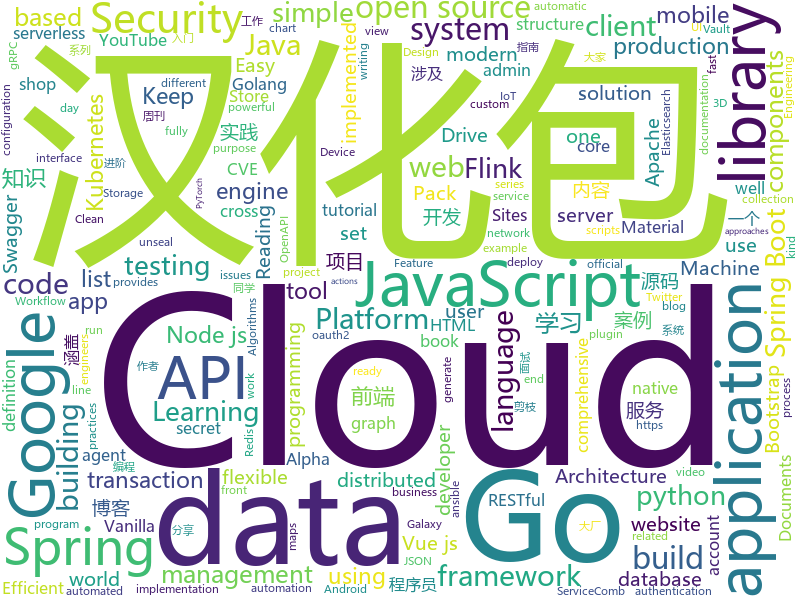

# 2019-12-10
See what the GitHub community is most excited about today.

## python
* [AIDungeon](https://github.com/AIDungeon/AIDungeon)(**415 stars today**): Infinite AI adventures await!
* [PythonPlantsVsZombies](https://github.com/marblexu/PythonPlantsVsZombies)(**56 stars today**): a simple PlantsVsZombies game
* [HelloGitHub](https://github.com/521xueweihan/HelloGitHub)(**426 stars today**): Find pearls on open-source seashore 分享 GitHub 上有趣、入门级的开源项目
* [cloud-custodian](https://github.com/cloud-custodian/cloud-custodian)(**7 stars today**): Rules engine for cloud security, cost optimization, and governance, DSL in yaml for policies to query, filter, and take actions on resources
* [PySyft](https://github.com/OpenMined/PySyft)(**11 stars today**): A library for encrypted, privacy preserving machine learning
* [sigma](https://github.com/Neo23x0/sigma)(**17 stars today**): Generic Signature Format for SIEM Systems
* [bert](https://github.com/google-research/bert)(**35 stars today**): TensorFlow code and pre-trained models for BERT
* [alpha_vantage](https://github.com/RomelTorres/alpha_vantage)(**40 stars today**): A python wrapper for Alpha Vantage API for financial data.
* [Osmedeus](https://github.com/j3ssie/Osmedeus)(**48 stars today**): Fully automated offensive security framework for reconnaissance and vulnerability scanning
* [Python](https://github.com/TheAlgorithms/Python)(**64 stars today**): All Algorithms implemented in Python
* [netbox](https://github.com/netbox-community/netbox)(**10 stars today**): IP address management (IPAM) and data center infrastructure management (DCIM) tool.
* [robotframework](https://github.com/robotframework/robotframework)(**7 stars today**): Generic automation framework for acceptance testing and RPA
* [galaxy-integrations-python-api](https://github.com/gogcom/galaxy-integrations-python-api)(**18 stars today**): NOTE: Please report here only issues related to the python API. Issues and general feedback regarding the Galaxy Client 2.0 shall be sent via Galaxy Client menu
* [ansible](https://github.com/ansible/ansible)(**28 stars today**): Ansible is a radically simple IT automation platform that makes your applications and systems easier to deploy. Avoid writing scripts or custom code to deploy and update your applications — automate in a language that approaches plain English, using SSH, with no agents to install on remote systems. https://docs.ansible.com/ansible/
* [Games](https://github.com/CharlesPikachu/Games)(**21 stars today**): Some games created by python code.
* [googleapis](https://github.com/googleapis/googleapis)(**6 stars today**): Public interface definitions of Google APIs.
* [python-docs-samples](https://github.com/GoogleCloudPlatform/python-docs-samples)(**7 stars today**): Code samples used on cloud.google.com
* [django-allauth](https://github.com/pennersr/django-allauth)(**3 stars today**): Integrated set of Django applications addressing authentication, registration, account management as well as 3rd party (social) account authentication.
* [30-Days-Of-Python](https://github.com/Asabeneh/30-Days-Of-Python)(**4 stars today**): A 30 days of python programming challenge
* [youtube-dl](https://github.com/ytdl-org/youtube-dl)(**85 stars today**): Command-line program to download videos from YouTube.com and other video sites
* [dbt](https://github.com/fishtown-analytics/dbt)(**1 stars today**): dbt (data build tool) enables data analysts and engineers to transform their data using the same practices that software engineers use to build applications.
* [yolov3-channel-and-layer-pruning](https://github.com/tanluren/yolov3-channel-and-layer-pruning)(**14 stars today**): yolov3 channel and layer pruning, Knowledge Distillation 层剪枝，通道剪枝，知识蒸馏
* [mlcourse.ai](https://github.com/Yorko/mlcourse.ai)(**6 stars today**): Open Machine Learning Course
* [yolov3-tf2](https://github.com/zzh8829/yolov3-tf2)(**6 stars today**): YoloV3 Implemented in Tensorflow 2.0
* [black](https://github.com/psf/black)(**22 stars today**): The uncompromising Python code formatter

## java
* [interviews](https://github.com/kdn251/interviews)(**39 stars today**): Everything you need to know to get the job.
* [SpringAll](https://github.com/wuyouzhuguli/SpringAll)(**59 stars today**): 循序渐进，学习Spring Boot、Spring Boot & Shiro、Spring Cloud、Spring Security & Spring Security OAuth2，博客Spring系列源码
* [halo](https://github.com/halo-dev/halo)(**100 stars today**): ✍ Halo 一款现代化的个人独立博客系统
* [flyway](https://github.com/flyway/flyway)(**8 stars today**): Flyway by Boxfuse • Database Migrations Made Easy.
* [thingsboard](https://github.com/thingsboard/thingsboard)(**18 stars today**): Open-source IoT Platform - Device management, data collection, processing and visualization.
* [servicecomb-pack](https://github.com/apache/servicecomb-pack)(**100 stars today**): Apache ServiceComb Pack is an eventually data consistency solution for micro-service applications. ServiceComb Pack currently provides TCC and Saga distributed transaction co-ordination solutions by using Alpha as a transaction coordinator and Omega as an transaction agent .
* [flink-learning](https://github.com/zhisheng17/flink-learning)(**69 stars today**): flink learning blog. http://www.54tianzhisheng.cn 含 Flink 入门、概念、原理、实战、性能调优、源码解析等内容。涉及 Flink Connector、Metrics、Library、DataStream API、Table API & SQL 等内容的学习案例，还有 Flink 落地应用的大型项目案例分享。
* [seata](https://github.com/seata/seata)(**23 stars today**): 🔥Seata is an easy-to-use, high-performance, open source distributed transaction solution.
* [SpringCloudLearning](https://github.com/forezp/SpringCloudLearning)(**39 stars today**): 《史上最简单的Spring Cloud教程源码》
* [dropwizard](https://github.com/dropwizard/dropwizard)(**3 stars today**): A damn simple library for building production-ready RESTful web services.
* [quarkus](https://github.com/quarkusio/quarkus)(**12 stars today**): Quarkus: Supersonic Subatomic Java.
* [tutorials](https://github.com/eugenp/tutorials)(**29 stars today**): Just Announced - "Learn Spring Security OAuth":
* [SpringCloud](https://github.com/zhoutaoo/SpringCloud)(**27 stars today**): 基于SpringCloud2.1的微服务开发脚手架，整合了spring-security-oauth2、nacos、feign、sentinel、springcloud-gateway等。服务治理方面引入elasticsearch、skywalking、springboot-admin、zipkin等，让项目开发快速进入业务开发，而不需过多时间花费在架构搭建上。持续更新中
* [Mycat-Server](https://github.com/MyCATApache/Mycat-Server)(**13 stars today**): 
* [flink](https://github.com/apache/flink)(**25 stars today**): Apache Flink
* [JavaGuide](https://github.com/Snailclimb/JavaGuide)(**159 stars today**): 【Java学习+面试指南】 一份涵盖大部分Java程序员所需要掌握的核心知识。
* [piggymetrics](https://github.com/sqshq/piggymetrics)(**8 stars today**): Microservice Architecture with Spring Boot, Spring Cloud and Docker
* [MPAndroidChart](https://github.com/PhilJay/MPAndroidChart)(**14 stars today**): A powerful🚀Android chart view / graph view library, supporting line- bar- pie- radar- bubble- and candlestick charts as well as scaling, dragging and animations.
* [hutool](https://github.com/looly/hutool)(**28 stars today**): A set of tools that keep Java sweet.
* [cachecloud](https://github.com/sohutv/cachecloud)(**7 stars today**): 搜狐视频(sohu tv)Redis私有云平台
* [aem-core-wcm-components](https://github.com/adobe/aem-core-wcm-components)(**2 stars today**): Adobe Experience Manager (AEM) Sites Core Components - flexible, extensible, and feature-rich components to build sites
* [BaseRecyclerViewAdapterHelper](https://github.com/CymChad/BaseRecyclerViewAdapterHelper)(**15 stars today**): BRVAH:Powerful and flexible RecyclerAdapter
* [Activiti](https://github.com/Activiti/Activiti)(**3 stars today**): Activiti is a light-weight workflow and Business Process Management (BPM) Platform targeted at business people, developers and system admins. Its core is a super-fast and rock-solid BPMN 2 process engine for Java. It's open-source and distributed under the Apache license. Activiti runs in any Java application, on a server, on a cluster or in the…
* [springboot-learning-example](https://github.com/JeffLi1993/springboot-learning-example)(**31 stars today**): spring boot 实践学习案例，是 spring boot 初学者及核心技术巩固的最佳实践。另外写博客，用 OpenWrite。
* [BigData-Notes](https://github.com/heibaiying/BigData-Notes)(**116 stars today**): 大数据入门指南⭐️

## unknown
* [weekly](https://github.com/ruanyf/weekly)(**159 stars today**): 科技爱好者周刊，每周五发布
* [Production-Level-Deep-Learning](https://github.com/alirezadir/Production-Level-Deep-Learning)(**77 stars today**): A guideline for building practical production-level deep learning systems to be deployed in real world applications.
* [Best-websites-a-programmer-should-visit](https://github.com/sdmg15/Best-websites-a-programmer-should-visit)(**200 stars today**): 🔗Some useful websites for programmers.
* [Huawei-Joke](https://github.com/HuaweiJoke/Huawei-Joke)(**111 stars today**): 本项目将收集因审查而被删除的关于华为公司的笑话。欢迎大家投稿。
* [You-Dont-Know-JS](https://github.com/getify/You-Dont-Know-JS)(**84 stars today**): A book series on JavaScript. @YDKJS on twitter.
* [incentivized-testnet-stakepool-registry](https://github.com/cardano-foundation/incentivized-testnet-stakepool-registry)(**1 stars today**): 
* [kubernetes-the-hard-way](https://github.com/kelseyhightower/kubernetes-the-hard-way)(**29 stars today**): Bootstrap Kubernetes the hard way on Google Cloud Platform. No scripts.
* [project-based-learning](https://github.com/tuvtran/project-based-learning)(**99 stars today**): Curated list of project-based tutorials
* [architect-awesome](https://github.com/xingshaocheng/architect-awesome)(**50 stars today**): 后端架构师技术图谱
* [955.WLB](https://github.com/formulahendry/955.WLB)(**37 stars today**): 955 不加班的公司名单 - 工作 955，work–life balance (工作与生活的平衡)
* [AZ-300-MicrosoftAzureArchitectTechnologies](https://github.com/MicrosoftLearning/AZ-300-MicrosoftAzureArchitectTechnologies)(**4 stars today**): 
* [developer-roadmap](https://github.com/kamranahmedse/developer-roadmap)(**68 stars today**): Roadmap to becoming a web developer in 2019
* [awesome-nodejs](https://github.com/sindresorhus/awesome-nodejs)(**65 stars today**): ⚡️Delightful Node.js packages and resources
* [verona](https://github.com/verona-lang/verona)(**13 stars today**): The Verona programming language base on Rust
* [JavaFamily](https://github.com/AobingJava/JavaFamily)(**121 stars today**): 【互联网一线大厂面试+学习指南】进阶知识完全扫盲：涵盖高并发、分布式、高可用、微服务等领域知识，作者风格幽默，看起来津津有味，把学习当做一种乐趣，何乐而不为，后端同学必看，前端同学我保证你也看得懂，看不懂你加我微信骂我渣男就好了。
* [weekly](https://github.com/dt-fe/weekly)(**18 stars today**): 前端精读周刊
* [awesome](https://github.com/sindresorhus/awesome)(**90 stars today**): 😎Awesome lists about all kinds of interesting topics
* [Cookbook](https://github.com/andkret/Cookbook)(**17 stars today**): The Data Engineering Cookbook
* [Game-Programmer-Study-Notes](https://github.com/QianMo/Game-Programmer-Study-Notes)(**25 stars today**): ⚓️我的游戏程序员生涯的读书笔记合辑。你可以把它看作一个加强版的Blog。涉及图形学、实时渲染、编程实践、GPU编程、设计模式、软件工程等内容。Keep Reading , Keep Writing , Keep Coding.
* [OpenAPI-Specification](https://github.com/OAI/OpenAPI-Specification)(**14 stars today**): The OpenAPI Specification Repository
* [cloud-run-faq](https://github.com/ahmetb/cloud-run-faq)(**5 stars today**): Unofficial FAQ for Google Cloud Run✨
* [stargan-v2](https://github.com/clovaai/stargan-v2)(**30 stars today**): StarGAN v2 - Official PyTorch Implementation
* [CKAD-exercises](https://github.com/dgkanatsios/CKAD-exercises)(**13 stars today**): A set of exercises to prepare for Certified Kubernetes Application Developer exam by Cloud Native Computing Foundation
* [GNNPapers](https://github.com/thunlp/GNNPapers)(**13 stars today**): Must-read papers on graph neural networks (GNN)
* [design](https://github.com/WebAssembly/design)(**9 stars today**): WebAssembly Design Documents

## javascript
* [javascript-algorithms](https://github.com/trekhleb/javascript-algorithms)(**132 stars today**): 📝Algorithms and data structures implemented in JavaScript with explanations and links to further readings
* [nodebestpractices](https://github.com/goldbergyoni/nodebestpractices)(**101 stars today**): ✅The largest Node.js best practices list (November 2019)
* [serverless](https://github.com/serverless/serverless)(**25 stars today**): Serverless Framework – Build web, mobile and IoT applications with serverless architectures using AWS Lambda, Azure Functions, Google CloudFunctions & more! –
* [CVE-2019-11708](https://github.com/0vercl0k/CVE-2019-11708)(**112 stars today**): Full exploit chain (CVE-2019-11708 & CVE-2019-9810) against Firefox on Windows 64-bit.
* [three.js](https://github.com/mrdoob/three.js)(**53 stars today**): JavaScript 3D library.
* [Google-Play-Music-Desktop-Player-UNOFFICIAL-](https://github.com/MarshallOfSound/Google-Play-Music-Desktop-Player-UNOFFICIAL-)(**6 stars today**): A beautiful cross platform Desktop Player for Google Play Music
* [react](https://github.com/facebook/react)(**72 stars today**): A declarative, efficient, and flexible JavaScript library for building user interfaces.
* [Daily-Interview-Question](https://github.com/Advanced-Frontend/Daily-Interview-Question)(**19 stars today**): 我是木易杨，公众号「高级前端进阶」作者，每天搞定一道前端大厂面试题，祝大家天天进步，一年后会看到不一样的自己。
* [bootstrap-vue](https://github.com/bootstrap-vue/bootstrap-vue)(**9 stars today**): BootstrapVue, with over 40 plugins and more than 80 custom components, provides one of the most comprehensive implementations of Bootstrap v4 components and grid system for Vue.js. With extensive and automated WAI-ARIA accessibility markup.
* [plugins](https://github.com/rollup/plugins)(**7 stars today**): 🍣The one-stop shop for official Rollup plugins
* [puppeteer](https://github.com/puppeteer/puppeteer)(**49 stars today**): Headless Chrome Node.js API
* [automerge](https://github.com/automerge/automerge)(**28 stars today**): A JSON-like data structure (a CRDT) that can be modified concurrently by different users, and merged again automatically.
* [vue](https://github.com/vuejs/vue)(**84 stars today**): 🖖Vue.js is a progressive, incrementally-adoptable JavaScript framework for building UI on the web.
* [react-native](https://github.com/facebook/react-native)(**51 stars today**): A framework for building native apps with React.
* [gatsby](https://github.com/gatsbyjs/gatsby)(**40 stars today**): Build blazing fast, modern apps and websites with React
* [jest](https://github.com/facebook/jest)(**24 stars today**): Delightful JavaScript Testing.
* [awx](https://github.com/ansible/awx)(**9 stars today**): AWX Project
* [juice-shop](https://github.com/bkimminich/juice-shop)(**14 stars today**): OWASP Juice Shop: Probably the most modern and sophisticated insecure web application
* [mapbox-gl-js](https://github.com/mapbox/mapbox-gl-js)(**5 stars today**): Interactive, thoroughly customizable maps in the browser, powered by vector tiles and WebGL
* [plyr](https://github.com/sampotts/plyr)(**14 stars today**): A simple HTML5, YouTube and Vimeo player
* [cesium](https://github.com/AnalyticalGraphicsInc/cesium)(**6 stars today**): An open-source JavaScript library for world-class 3D globes and maps🌎
* [nuxt.js](https://github.com/nuxt/nuxt.js)(**49 stars today**): The Vue.js Framework
* [gekko](https://github.com/askmike/gekko)(**2 stars today**): A bitcoin trading bot written in node - https://gekko.wizb.it/
* [bustag](https://github.com/gxtrobot/bustag)(**20 stars today**): a tag and recommend system for old bus driver 给老司机用的一个番号推荐系统
* [strapi](https://github.com/strapi/strapi)(**51 stars today**): 🚀Open source Node.js Headless CMS to easily build customisable APIs

## html
* [home-assistant.io](https://github.com/home-assistant/home-assistant.io)(**17 stars today**): 📘Home Assistant User documentation
* [FOSSASAT-1](https://github.com/FOSSASystems/FOSSASAT-1)(**4 stars today**): 
* [python_ebook](https://github.com/shihyu/python_ebook)(**4 stars today**): 
* [web-moderno](https://github.com/cod3rcursos/web-moderno)(**4 stars today**): 
* [JavaScript30](https://github.com/wesbos/JavaScript30)(**8 stars today**): 30 Day Vanilla JS Challenge
* [learning-area](https://github.com/mdn/learning-area)(**7 stars today**): Github repo for the MDN Learning Area.
* [ckeditor5-build-classic](https://github.com/ckeditor/ckeditor5-build-classic)(**1 stars today**): The classic editor build of CKEditor 5.
* [go101](https://github.com/go101/go101)(**6 stars today**): An online book focusing on Go syntax/semantics.
* [AR.js](https://github.com/jeromeetienne/AR.js)(**11 stars today**): Efficient Augmented Reality for the Web - 60fps on mobile!
* [foundation-sites](https://github.com/foundation/foundation-sites)(**4 stars today**): The most advanced responsive front-end framework in the world. Quickly create prototypes and production code for sites that work on any kind of device.
* [Front-end-Developer-Interview-Questions](https://github.com/h5bp/Front-end-Developer-Interview-Questions)(**12 stars today**): A list of helpful front-end related questions you can use to interview potential candidates, test yourself or completely ignore.
* [MatBlazor](https://github.com/SamProf/MatBlazor)(**8 stars today**): Material Design components for Blazor and Razor Components
* [owasp-mstg](https://github.com/OWASP/owasp-mstg)(**7 stars today**): The Mobile Security Testing Guide (MSTG) is a comprehensive manual for mobile app security development, testing and reverse engineering.
* [amp.dev](https://github.com/ampproject/amp.dev)(**0 stars today**): The AMP Project Website.
* [swagger-codegen](https://github.com/swagger-api/swagger-codegen)(**12 stars today**): swagger-codegen contains a template-driven engine to generate documentation, API clients and server stubs in different languages by parsing your OpenAPI / Swagger definition.
* [set_list_1909](https://github.com/turingschool-examples/set_list_1909)(**0 stars today**): 
* [docs](https://github.com/pingcap/docs)(**1 stars today**): TiDB/TiKV/PD documents.
* [tabler](https://github.com/tabler/tabler)(**12 stars today**): Tabler is free and open-source HTML Dashboard UI Kit built on Bootstrap
* [TranslatorX](https://github.com/pingfangx/TranslatorX)(**20 stars today**): JetBrains 系列软件汉化包 关键字: Android Studio 3.5 汉化包 CLion 2019.2 汉化包 DataGrip 2019.2 汉化包 GoLand 2019.2 汉化包 IntelliJ IDEA 2019.2 汉化包 PhpStorm 2019.2 汉化包 PyCharm 2019.2 汉化包 Rider 2019.2 汉化包 RubyMine 2019.2 汉化包 WebStorm 2019.2 汉化包
* [minimus](https://github.com/hamedbaatour/minimus)(**2 stars today**): A fully featured production ready Angular 8 weather app tutorial project
* [bootstrap-multiselect](https://github.com/davidstutz/bootstrap-multiselect)(**0 stars today**): JQuery multiselect plugin based on Twitter Bootstrap.
* [simpl](https://github.com/samdutton/simpl)(**1 stars today**): Simplest possible examples of HTML, CSS and Javascript:
* [awesome-modern-cpp](https://github.com/rigtorp/awesome-modern-cpp)(**7 stars today**): A collection of resources on modern C++
* [tiny-slider](https://github.com/ganlanyuan/tiny-slider)(**7 stars today**): Vanilla javascript slider for all purposes.
* [feast](https://github.com/gojek/feast)(**4 stars today**): Feature Store for Machine Learning

## go
* [rclone](https://github.com/rclone/rclone)(**102 stars today**): "rsync for cloud storage" - Google Drive, Amazon Drive, S3, Dropbox, Backblaze B2, One Drive, Swift, Hubic, Cloudfiles, Google Cloud Storage, Yandex Files
* [client_golang](https://github.com/prometheus/client_golang)(**4 stars today**): Prometheus instrumentation library for Go applications
* [protobuf](https://github.com/golang/protobuf)(**7 stars today**): Go support for Google's protocol buffers
* [sqlx](https://github.com/jmoiron/sqlx)(**9 stars today**): general purpose extensions to golang's database/sql
* [swag](https://github.com/swaggo/swag)(**7 stars today**): Automatically generate RESTful API documentation with Swagger 2.0 for Go.
* [fyne](https://github.com/fyne-io/fyne)(**14 stars today**): Cross platform GUI in Go based on Material Design
* [grpc-gateway](https://github.com/grpc-ecosystem/grpc-gateway)(**19 stars today**): gRPC to JSON proxy generator following the gRPC HTTP spec
* [go-clean-arch](https://github.com/bxcodec/go-clean-arch)(**22 stars today**): Go (Golang) Clean Architecture based on Reading Uncle Bob's Clean Architecture
* [distribution](https://github.com/docker/distribution)(**3 stars today**): The Docker toolset to pack, ship, store, and deliver content
* [hcl](https://github.com/hashicorp/hcl)(**2 stars today**): HCL is the HashiCorp configuration language.
* [lnd](https://github.com/lightningnetwork/lnd)(**5 stars today**): Lightning Network Daemon⚡️
* [errors](https://github.com/pkg/errors)(**13 stars today**): Simple error handling primitives
* [redis](https://github.com/go-redis/redis)(**13 stars today**): Type-safe Redis client for Golang
* [grpc-go](https://github.com/grpc/grpc-go)(**17 stars today**): The Go language implementation of gRPC. HTTP/2 based RPC
* [argo-cd](https://github.com/argoproj/argo-cd)(**10 stars today**): Declarative continuous deployment for Kubernetes.
* [goss](https://github.com/aelsabbahy/goss)(**5 stars today**): Quick and Easy server testing/validation
* [kubernetes-ingress](https://github.com/nginxinc/kubernetes-ingress)(**6 stars today**): NGINX and NGINX Plus Ingress Controllers for Kubernetes
* [kaniko](https://github.com/GoogleContainerTools/kaniko)(**8 stars today**): Build Container Images In Kubernetes
* [prometheus](https://github.com/prometheus/prometheus)(**30 stars today**): The Prometheus monitoring system and time series database.
* [elastic](https://github.com/olivere/elastic)(**4 stars today**): Elasticsearch client for Go.
* [gopl.io](https://github.com/adonovan/gopl.io)(**7 stars today**): Example programs from "The Go Programming Language"
* [argo](https://github.com/argoproj/argo)(**7 stars today**): Argo Workflows: Get stuff done with Kubernetes.
* [chi](https://github.com/go-chi/chi)(**10 stars today**): lightweight, idiomatic and composable router for building Go HTTP services
* [bank-vaults](https://github.com/banzaicloud/bank-vaults)(**4 stars today**): A Vault swiss-army knife: a K8s operator, Go client with automatic token renewal, automatic configuration, multiple unseal options and more. A CLI tool to init, unseal and configure Vault (auth methods, secret engines). Direct secret injection into Pods.
* [dns](https://github.com/miekg/dns)(**8 stars today**): DNS library in Go

## WordCloud

