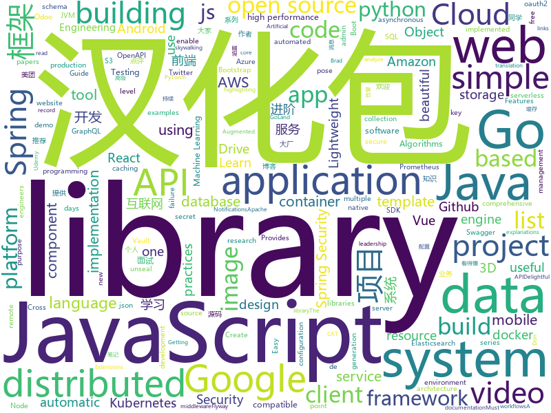

# 2019-12-11
See what the GitHub community is most excited about today.

## python
* [PythonPlantsVsZombies](https://github.com/marblexu/PythonPlantsVsZombies)(**142 stars today**): a simple PlantsVsZombies game
* [AIDungeon](https://github.com/AIDungeon/AIDungeon)(**343 stars today**): Infinite AI adventures await!
* [skillbox-chat](https://github.com/manchenkoff/skillbox-chat)(**52 stars today**): Skillbox demo application for the Python course
* [VideoPose3D](https://github.com/facebookresearch/VideoPose3D)(**86 stars today**): Efficient 3D human pose estimation in video using 2D keypoint trajectories
* [Python](https://github.com/TheAlgorithms/Python)(**351 stars today**): All Algorithms implemented in Python
* [ALBERT](https://github.com/google-research/ALBERT)(**21 stars today**): 
* [alpha_vantage](https://github.com/RomelTorres/alpha_vantage)(**57 stars today**): A python wrapper for Alpha Vantage API for financial data.
* [dronesploit](https://github.com/dhondta/dronesploit)(**44 stars today**): Drone pentesting framework console
* [dbt](https://github.com/fishtown-analytics/dbt)(**4 stars today**): dbt (data build tool) enables data analysts and engineers to transform their data using the same practices that software engineers use to build applications.
* [articles](https://github.com/Dobiasd/articles)(**35 stars today**): thoughts on programming
* [few-shot-vid2vid](https://github.com/NVlabs/few-shot-vid2vid)(**54 stars today**): Pytorch implementation for few-shot photorealistic video-to-video translation.
* [tlroadmap](https://github.com/tlbootcamp/tlroadmap)(**22 stars today**): 👩🏼‍💻👨🏻‍💻Карта навыков и модель развития тимлидов
* [system-design-primer](https://github.com/donnemartin/system-design-primer)(**73 stars today**): Learn how to design large-scale systems. Prep for the system design interview. Includes Anki flashcards.
* [video-to-pose3D](https://github.com/zh-plus/video-to-pose3D)(**64 stars today**): Convert video to 3D pose in one-key.
* [Games](https://github.com/CharlesPikachu/Games)(**21 stars today**): Some games created by python code.
* [distroless](https://github.com/GoogleContainerTools/distroless)(**144 stars today**): 🥑Language focused docker images, minus the operating system.
* [ml-agents](https://github.com/Unity-Technologies/ml-agents)(**17 stars today**): Unity Machine Learning Agents Toolkit
* [30-Days-Of-Python](https://github.com/Asabeneh/30-Days-Of-Python)(**8 stars today**): A 30 days of python programming challenge
* [moto](https://github.com/spulec/moto)(**6 stars today**): A library that allows you to easily mock out tests based on AWS infrastructure.
* [openbmc](https://github.com/openbmc/openbmc)(**2 stars today**): OpenBMC Distribution
* [airflow](https://github.com/apache/airflow)(**20 stars today**): Apache Airflow - A platform to programmatically author, schedule, and monitor workflows
* [aws-cloudformation-templates](https://github.com/awslabs/aws-cloudformation-templates)(**9 stars today**): A collection of useful CloudFormation templates
* [Osmedeus](https://github.com/j3ssie/Osmedeus)(**29 stars today**): Fully automated offensive security framework for reconnaissance and vulnerability scanning
* [maskrcnn-benchmark](https://github.com/facebookresearch/maskrcnn-benchmark)(**10 stars today**): Fast, modular reference implementation of Instance Segmentation and Object Detection algorithms in PyTorch.
* [PySyft](https://github.com/OpenMined/PySyft)(**8 stars today**): A library for encrypted, privacy preserving machine learning

## java
* [SpringAll](https://github.com/wuyouzhuguli/SpringAll)(**88 stars today**): 循序渐进，学习Spring Boot、Spring Boot & Shiro、Spring Cloud、Spring Security & Spring Security OAuth2，博客Spring系列源码
* [interviews](https://github.com/kdn251/interviews)(**64 stars today**): Everything you need to know to get the job.
* [tutorials](https://github.com/eugenp/tutorials)(**25 stars today**): Just Announced - "Learn Spring Security OAuth":
* [spring-framework](https://github.com/spring-projects/spring-framework)(**34 stars today**): Spring Framework
* [zipkin](https://github.com/openzipkin/zipkin)(**15 stars today**): Zipkin is a distributed tracing system
* [quarkus](https://github.com/quarkusio/quarkus)(**12 stars today**): Quarkus: Supersonic Subatomic Java.
* [halo](https://github.com/halo-dev/halo)(**108 stars today**): ✍ Halo 一款现代化的个人独立博客系统
* [dropwizard](https://github.com/dropwizard/dropwizard)(**4 stars today**): A damn simple library for building production-ready RESTful web services.
* [guava](https://github.com/google/guava)(**30 stars today**): Google core libraries for Java
* [SpringCloudLearning](https://github.com/forezp/SpringCloudLearning)(**38 stars today**): 《史上最简单的Spring Cloud教程源码》
* [react-native-push-notification](https://github.com/zo0r/react-native-push-notification)(**6 stars today**): React Native Local and Remote Notifications
* [parquet-mr](https://github.com/apache/parquet-mr)(**0 stars today**): Apache Parquet
* [Telegram](https://github.com/DrKLO/Telegram)(**13 stars today**): Telegram for Android source
* [kafka](https://github.com/apache/kafka)(**19 stars today**): Mirror of Apache Kafka
* [JsBridge](https://github.com/lzyzsd/JsBridge)(**10 stars today**): android java and javascript bridge, inspired by wechat webview jsbridge
* [apollo-android](https://github.com/apollographql/apollo-android)(**4 stars today**): 📟A strongly-typed, caching GraphQL client for Android and the JVM
* [cachecloud](https://github.com/sohutv/cachecloud)(**6 stars today**): 搜狐视频(sohu tv)Redis私有云平台
* [seata](https://github.com/seata/seata)(**23 stars today**): 🔥Seata is an easy-to-use, high-performance, open source distributed transaction solution.
* [cat](https://github.com/dianping/cat)(**22 stars today**): CAT 作为服务端项目基础组件，提供了 Java, C/C++, Node.js, Python, Go 等多语言客户端，已经在美团点评的基础架构中间件框架（MVC框架，RPC框架，数据库框架，缓存框架等，消息队列，配置系统等）深度集成，为美团点评各业务线提供系统丰富的性能指标、健康状况、实时告警等。
* [malmo](https://github.com/microsoft/malmo)(**7 stars today**): Project Malmo is a platform for Artificial Intelligence experimentation and research built on top of Minecraft. We aim to inspire a new generation of research into challenging new problems presented by this unique environment. --- For installation instructions, scroll down to *Getting Started* below, or visit the project page for more information:
* [Hystrix](https://github.com/Netflix/Hystrix)(**14 stars today**): Hystrix is a latency and fault tolerance library designed to isolate points of access to remote systems, services and 3rd party libraries, stop cascading failure and enable resilience in complex distributed systems where failure is inevitable.
* [RxJava](https://github.com/ReactiveX/RxJava)(**16 stars today**): RxJava – Reactive Extensions for the JVM – a library for composing asynchronous and event-based programs using observable sequences for the Java VM.
* [SpringCloud](https://github.com/zhoutaoo/SpringCloud)(**26 stars today**): 基于SpringCloud2.1的微服务开发脚手架，整合了spring-security-oauth2、nacos、feign、sentinel、springcloud-gateway等。服务治理方面引入elasticsearch、skywalking、springboot-admin、zipkin等，让项目开发快速进入业务开发，而不需过多时间花费在架构搭建上。持续更新中
* [incubator-shardingsphere](https://github.com/apache/incubator-shardingsphere)(**12 stars today**): Distributed database middleware
* [flyway](https://github.com/flyway/flyway)(**5 stars today**): Flyway by Boxfuse • Database Migrations Made Easy.

## unknown
* [You-Dont-Know-JS](https://github.com/getify/You-Dont-Know-JS)(**208 stars today**): A book series on JavaScript. @YDKJS on twitter.
* [web-development-2020-course-list](https://github.com/andrews1022/web-development-2020-course-list)(**161 stars today**): A list of Udemy courses from Brad Traversy's Web Development 2020 video
* [Huawei-Joke](https://github.com/HuaweiJoke/Huawei-Joke)(**232 stars today**): 本项目将收集因审查而被删除的关于华为公司的笑话。欢迎大家投稿。
* [Best-websites-a-programmer-should-visit](https://github.com/sdmg15/Best-websites-a-programmer-should-visit)(**204 stars today**): 🔗Some useful websites for programmers.
* [JavaFamily](https://github.com/AobingJava/JavaFamily)(**164 stars today**): 【互联网一线大厂面试+学习指南】进阶知识完全扫盲：涵盖高并发、分布式、高可用、微服务等领域知识，作者风格幽默，看起来津津有味，把学习当做一种乐趣，何乐而不为，后端同学必看，前端同学我保证你也看得懂，看不懂你加我微信骂我渣男就好了。
* [computer-science](https://github.com/ossu/computer-science)(**64 stars today**): 🎓Path to a free self-taught education in Computer Science!
* [AZ-300-MicrosoftAzureArchitectTechnologies](https://github.com/MicrosoftLearning/AZ-300-MicrosoftAzureArchitectTechnologies)(**3 stars today**): 
* [weekly](https://github.com/ruanyf/weekly)(**186 stars today**): 科技爱好者周刊，每周五发布
* [handbook](https://github.com/basecamp/handbook)(**40 stars today**): Basecamp Employee Handbook
* [Production-Level-Deep-Learning](https://github.com/alirezadir/Production-Level-Deep-Learning)(**189 stars today**): A guideline for building practical production-level deep learning systems to be deployed in real world applications.
* [Cookbook](https://github.com/andkret/Cookbook)(**15 stars today**): The Data Engineering Cookbook
* [cryptocurrency-ticks-data](https://github.com/Nucs/cryptocurrency-ticks-data)(**12 stars today**): 590 days of trade ticks on BTC/ETH/LTC/NEO to USDT
* [free-books](https://github.com/ruanyf/free-books)(**32 stars today**): 互联网上的免费书籍
* [google-cloud-4-words](https://github.com/gregsramblings/google-cloud-4-words)(**8 stars today**): The Google Cloud Developer's Cheat Sheet
* [awesome-point-cloud-analysis](https://github.com/Yochengliu/awesome-point-cloud-analysis)(**9 stars today**): A list of papers and datasets about point cloud analysis (processing)
* [OpenAPI-Specification](https://github.com/OAI/OpenAPI-Specification)(**10 stars today**): The OpenAPI Specification Repository
* [Learn_Machine_Learning_in_3_Months](https://github.com/llSourcell/Learn_Machine_Learning_in_3_Months)(**4 stars today**): This is the code for "Learn Machine Learning in 3 Months" by Siraj Raval on Youtube
* [eng-practices](https://github.com/google/eng-practices)(**12 stars today**): Google's Engineering Practices documentation
* [GNNPapers](https://github.com/thunlp/GNNPapers)(**18 stars today**): Must-read papers on graph neural networks (GNN)
* [architecture_decision_record](https://github.com/joelparkerhenderson/architecture_decision_record)(**10 stars today**): Architecture decision record (ADR) examples for software planning, IT leadership, and template documenation
* [GitHubDaily](https://github.com/GitHubDaily/GitHubDaily)(**21 stars today**): GitHubDaily 分享内容定期整理与分类。欢迎推荐、自荐项目，让更多人知道你的项目。
* [awsome-java](https://github.com/Snailclimb/awsome-java)(**22 stars today**): Great Java project on Github(Github 上非常棒的 Java 开源项目).
* [reverse-interview-zh](https://github.com/yifeikong/reverse-interview-zh)(**12 stars today**): 技术面试最后反问面试官的话
* [cpplinks](https://github.com/MattPD/cpplinks)(**3 stars today**): A categorized list of C++ resources.
* [azure-pipelines-yaml](https://github.com/microsoft/azure-pipelines-yaml)(**3 stars today**): Azure Pipelines YAML examples, templates, and community interaction

## javascript
* [flowy](https://github.com/alyssaxuu/flowy)(**257 stars today**): The minimal javascript library to create flowcharts✨
* [geoapi](https://github.com/Risk3sixty-Labs/geoapi)(**94 stars today**): Lightweight API service to get geolocation data from IP addresses.
* [serverless](https://github.com/serverless/serverless)(**65 stars today**): Serverless Framework – Build web, mobile and IoT applications with serverless architectures using AWS Lambda, Azure Functions, Google CloudFunctions & more! –
* [nodebestpractices](https://github.com/goldbergyoni/nodebestpractices)(**105 stars today**): ✅The largest Node.js best practices list (November 2019)
* [bustag](https://github.com/gxtrobot/bustag)(**39 stars today**): a tag and recommend system for old bus driver 给老司机用的一个番号推荐系统
* [react-native](https://github.com/facebook/react-native)(**45 stars today**): A framework for building native apps with React.
* [Daily-Interview-Question](https://github.com/Advanced-Frontend/Daily-Interview-Question)(**21 stars today**): 我是木易杨，公众号「高级前端进阶」作者，每天搞定一道前端大厂面试题，祝大家天天进步，一年后会看到不一样的自己。
* [javascript-algorithms](https://github.com/trekhleb/javascript-algorithms)(**168 stars today**): 📝Algorithms and data structures implemented in JavaScript with explanations and links to further readings
* [cloudmapper](https://github.com/duo-labs/cloudmapper)(**5 stars today**): CloudMapper helps you analyze your Amazon Web Services (AWS) environments.
* [goober](https://github.com/cristianbote/goober)(**65 stars today**): 🥜goober, a less than 1KB🎉css-in-js alternative with a familiar API
* [jest](https://github.com/facebook/jest)(**23 stars today**): Delightful JavaScript Testing.
* [openlayers](https://github.com/openlayers/openlayers)(**90 stars today**): OpenLayers
* [jitsi-meet](https://github.com/jitsi/jitsi-meet)(**32 stars today**): Jitsi Meet - Secure, Simple and Scalable Video Conferences that you use as a standalone app or embed in your web application.
* [monaco-editor](https://github.com/microsoft/monaco-editor)(**20 stars today**): A browser based code editor
* [carbon](https://github.com/carbon-app/carbon)(**55 stars today**): 🎨Create and share beautiful images of your source code
* [react-query](https://github.com/tannerlinsley/react-query)(**29 stars today**): ⚛️Hooks for fetching, caching and updating asynchronous data in React
* [bootstrap-vue](https://github.com/bootstrap-vue/bootstrap-vue)(**13 stars today**): BootstrapVue, with over 40 plugins and more than 80 custom components, provides one of the most comprehensive implementations of Bootstrap v4 components and grid system for Vue.js. With extensive and automated WAI-ARIA accessibility markup.
* [insomnia](https://github.com/Kong/insomnia)(**21 stars today**): Cross-platform HTTP and GraphQL Client
* [microsoft-authentication-library-for-js](https://github.com/AzureAD/microsoft-authentication-library-for-js)(**2 stars today**): Microsoft Authentication Library (MSAL) for JS
* [yup](https://github.com/jquense/yup)(**24 stars today**): Dead simple Object schema validation
* [react-jsonschema-form](https://github.com/rjsf-team/react-jsonschema-form)(**9 stars today**): A React component for building Web forms from JSON Schema.
* [uni-app](https://github.com/dcloudio/uni-app)(**69 stars today**): uni-app 是使用 Vue 语法开发小程序、H5、App的统一框架
* [vue](https://github.com/vuejs/vue)(**100 stars today**): 🖖Vue.js is a progressive, incrementally-adoptable JavaScript framework for building UI on the web.
* [code-surfer](https://github.com/pomber/code-surfer)(**64 stars today**): Rad code slides <🏄/>
* [three.js](https://github.com/mrdoob/three.js)(**56 stars today**): JavaScript 3D library.

## html
* [mxgraph](https://github.com/jgraph/mxgraph)(**7 stars today**): mxGraph is a fully client side JavaScript diagramming library
* [owasp-mstg](https://github.com/OWASP/owasp-mstg)(**8 stars today**): The Mobile Security Testing Guide (MSTG) is a comprehensive manual for mobile app security development, testing and reverse engineering.
* [hyperblog](https://github.com/freddier/hyperblog)(**6 stars today**): Un blog increíble para el curso de Git y Github de Platzi
* [TranslatorX](https://github.com/pingfangx/TranslatorX)(**20 stars today**): JetBrains 系列软件汉化包 关键字: Android Studio 3.5 汉化包 CLion 2019.2 汉化包 DataGrip 2019.2 汉化包 GoLand 2019.2 汉化包 IntelliJ IDEA 2019.2 汉化包 PhpStorm 2019.2 汉化包 PyCharm 2019.2 汉化包 Rider 2019.2 汉化包 RubyMine 2019.2 汉化包 WebStorm 2019.2 汉化包
* [keep-a-changelog](https://github.com/olivierlacan/keep-a-changelog)(**5 stars today**): If you build software, keep a changelog.
* [AR.js](https://github.com/jeromeetienne/AR.js)(**13 stars today**): Efficient Augmented Reality for the Web - 60fps on mobile!
* [jsonplaceholder](https://github.com/typicode/jsonplaceholder)(**8 stars today**): A simple online fake REST API server
* [MatBlazor](https://github.com/SamProf/MatBlazor)(**8 stars today**): Material Design components for Blazor and Razor Components
* [sql-formatter](https://github.com/jdorn/sql-formatter)(**7 stars today**): A lightweight php class for formatting sql statements. Handles automatic indentation and syntax highlighting.
* [rellax](https://github.com/dixonandmoe/rellax)(**3 stars today**): Lightweight, vanilla javascript parallax library
* [awesome-modern-cpp](https://github.com/rigtorp/awesome-modern-cpp)(**10 stars today**): A collection of resources on modern C++
* [server-tools](https://github.com/OCA/server-tools)(**0 stars today**): Tools for Odoo Administrators to improve some technical features on Odoo.
* [Fake-flash.cn](https://github.com/r00tSe7en/Fake-flash.cn)(**10 stars today**): www.flash.cn 的钓鱼页，中文+英文
* [boost](https://github.com/boostorg/boost)(**2 stars today**): Super-project for modularized Boost
* [tiny-slider](https://github.com/ganlanyuan/tiny-slider)(**7 stars today**): Vanilla javascript slider for all purposes.
* [awesome-piracy](https://github.com/Igglybuff/awesome-piracy)(**9 stars today**): A curated list of awesome warez and piracy links
* [postmark-templates](https://github.com/wildbit/postmark-templates)(**2 stars today**): Rock-solid email templates for applications.
* [Coursera-ML-AndrewNg-Notes](https://github.com/fengdu78/Coursera-ML-AndrewNg-Notes)(**30 stars today**): 吴恩达老师的机器学习课程个人笔记
* [swagger-codegen](https://github.com/swagger-api/swagger-codegen)(**7 stars today**): swagger-codegen contains a template-driven engine to generate documentation, API clients and server stubs in different languages by parsing your OpenAPI / Swagger definition.
* [ace](https://github.com/bopoda/ace)(**1 stars today**): Twitter bootstrap 3 admin template
* [styleguide](https://github.com/google/styleguide)(**14 stars today**): Style guides for Google-originated open-source projects
* [beautiful-jekyll](https://github.com/daattali/beautiful-jekyll)(**5 stars today**): ✨Build a beautiful and simple website in literally minutes. Demo at http://deanattali.com/beautiful-jekyll
* [FOSSASAT-1](https://github.com/FOSSASystems/FOSSASAT-1)(**1 stars today**): 
* [Java-Interview-Advanced](https://github.com/shishan100/Java-Interview-Advanced)(**12 stars today**): 中华石杉--互联网Java进阶面试训练营
* [web-moderno](https://github.com/cod3rcursos/web-moderno)(**3 stars today**): 

## go
* [rclone](https://github.com/rclone/rclone)(**228 stars today**): "rsync for cloud storage" - Google Drive, Amazon Drive, S3, Dropbox, Backblaze B2, One Drive, Swift, Hubic, Cloudfiles, Google Cloud Storage, Yandex Files
* [bank-vaults](https://github.com/banzaicloud/bank-vaults)(**5 stars today**): A Vault swiss-army knife: a K8s operator, Go client with automatic token renewal, automatic configuration, multiple unseal options and more. A CLI tool to init, unseal and configure Vault (auth methods, secret engines). Direct secret injection into Pods.
* [stripe-go](https://github.com/stripe/stripe-go)(**5 stars today**): Go library for the Stripe API.
* [client_golang](https://github.com/prometheus/client_golang)(**11 stars today**): Prometheus instrumentation library for Go applications
* [rancher](https://github.com/rancher/rancher)(**14 stars today**): Complete container management platform
* [kaniko](https://github.com/GoogleContainerTools/kaniko)(**9 stars today**): Build Container Images In Kubernetes
* [grpc-go](https://github.com/grpc/grpc-go)(**17 stars today**): The Go language implementation of gRPC. HTTP/2 based RPC
* [docker-slim](https://github.com/docker-slim/docker-slim)(**1,060 stars today**): DockerSlim (docker-slim): Don't change anything in your Docker container image and minify it by up to 30x (and for compiled languages even more) making it secure too! (free and open source)
* [dep](https://github.com/golang/dep)(**6 stars today**): Go dependency management tool
* [excelize](https://github.com/360EntSecGroup-Skylar/excelize)(**23 stars today**): Golang library for reading and writing Microsoft Excel™ (XLSX) files.
* [opa](https://github.com/open-policy-agent/opa)(**12 stars today**): An open source, general-purpose policy engine.
* [aws-sdk-go](https://github.com/aws/aws-sdk-go)(**4 stars today**): AWS SDK for the Go programming language.
* [prometheus](https://github.com/prometheus/prometheus)(**30 stars today**): The Prometheus monitoring system and time series database.
* [fyne](https://github.com/fyne-io/fyne)(**15 stars today**): Cross platform GUI in Go based on Material Design
* [etcd](https://github.com/etcd-io/etcd)(**36 stars today**): Distributed reliable key-value store for the most critical data of a distributed system
* [packer](https://github.com/hashicorp/packer)(**6 stars today**): Packer is a tool for creating identical machine images for multiple platforms from a single source configuration.
* [enhancements](https://github.com/kubernetes/enhancements)(**2 stars today**): Features tracking repo for Kubernetes releases
* [cadvisor](https://github.com/google/cadvisor)(**9 stars today**): Analyzes resource usage and performance characteristics of running containers.
* [operator-sdk](https://github.com/operator-framework/operator-sdk)(**6 stars today**): SDK for building Kubernetes applications. Provides high level APIs, useful abstractions, and project scaffolding.
* [minio](https://github.com/minio/minio)(**28 stars today**): MinIO is a high performance object storage server compatible with Amazon S3 APIs
* [squirrel](https://github.com/Masterminds/squirrel)(**4 stars today**): Fluent SQL generation for golang
* [argo-cd](https://github.com/argoproj/argo-cd)(**6 stars today**): Declarative continuous deployment for Kubernetes.
* [elastic](https://github.com/olivere/elastic)(**6 stars today**): Elasticsearch client for Go.
* [tidb](https://github.com/pingcap/tidb)(**36 stars today**): TiDB is an open source distributed HTAP database compatible with the MySQL protocol
* [go](https://github.com/json-iterator/go)(**19 stars today**): A high-performance 100% compatible drop-in replacement of "encoding/json"

## WordCloud

