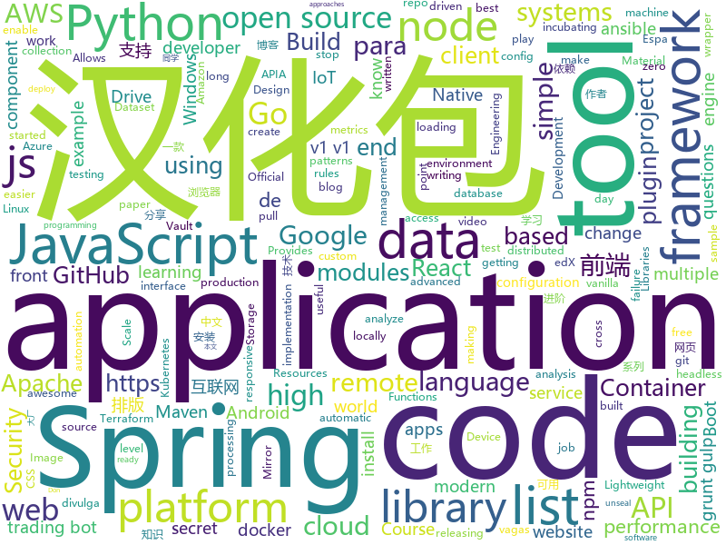

# 2019-12-12
See what the GitHub community is most excited about today.

## python
* [PythonPlantsVsZombies](https://github.com/marblexu/PythonPlantsVsZombies)(**218 stars today**): a simple PlantsVsZombies game
* [alpha_vantage](https://github.com/RomelTorres/alpha_vantage)(**37 stars today**): A python wrapper for Alpha Vantage API for financial data.
* [30-Days-Of-Python](https://github.com/Asabeneh/30-Days-Of-Python)(**42 stars today**): A 30 days of python programming challenge
* [Python](https://github.com/TheAlgorithms/Python)(**132 stars today**): All Algorithms implemented in Python
* [dronesploit](https://github.com/dhondta/dronesploit)(**60 stars today**): Drone pentesting framework console
* [12306](https://github.com/testerSunshine/12306)(**77 stars today**): 12306智能刷票，订票
* [DeepFaceLab](https://github.com/iperov/DeepFaceLab)(**15 stars today**): DeepFaceLab is a tool that utilizes machine learning to replace faces in videos. Includes prebuilt ready to work standalone Windows 7,8,10 binary (look readme.md).
* [ansible](https://github.com/ansible/ansible)(**23 stars today**): Ansible is a radically simple IT automation platform that makes your applications and systems easier to deploy. Avoid writing scripts or custom code to deploy and update your applications — automate in a language that approaches plain English, using SSH, with no agents to install on remote systems. https://docs.ansible.com/ansible/
* [skillbox-chat](https://github.com/manchenkoff/skillbox-chat)(**47 stars today**): Skillbox demo application for the Python course
* [HelloGitHub](https://github.com/521xueweihan/HelloGitHub)(**344 stars today**): Find pearls on open-source seashore 分享 GitHub 上有趣、入门级的开源项目
* [VideoPose3D](https://github.com/facebookresearch/VideoPose3D)(**67 stars today**): Efficient 3D human pose estimation in video using 2D keypoint trajectories
* [pandas](https://github.com/pandas-dev/pandas)(**17 stars today**): Flexible and powerful data analysis / manipulation library for Python, providing labeled data structures similar to R data.frame objects, statistical functions, and much more
* [Games](https://github.com/CharlesPikachu/Games)(**24 stars today**): Some games created by python code.
* [github-typo-corpus](https://github.com/mhagiwara/github-typo-corpus)(**24 stars today**): GitHub Typo Corpus: A Large-Scale Multilingual Dataset of Misspellings and Grammatical Errors
* [saleor](https://github.com/mirumee/saleor)(**11 stars today**): A modular, high performance, headless e-commerce storefront built with Python, GraphQL, Django, and ReactJS.
* [aws-glue-samples](https://github.com/aws-samples/aws-glue-samples)(**3 stars today**): AWS Glue code samples
* [BlackFridayScrape](https://github.com/KalleHallden/BlackFridayScrape)(**7 stars today**): 
* [models](https://github.com/tensorflow/models)(**44 stars today**): Models and examples built with TensorFlow
* [edx-platform](https://github.com/edx/edx-platform)(**4 stars today**): The Open edX platform, the software that powers edX!
* [PreSumm](https://github.com/nlpyang/PreSumm)(**8 stars today**): code for EMNLP 2019 paper Text Summarization with Pretrained Encoders
* [spinnaker](https://github.com/spinnaker/spinnaker)(**9 stars today**): Spinnaker is an open source, multi-cloud continuous delivery platform for releasing software changes with high velocity and confidence.
* [spyder](https://github.com/spyder-ide/spyder)(**8 stars today**): Official repository for Spyder - The Scientific Python Development Environment
* [ALBERT](https://github.com/google-research/ALBERT)(**25 stars today**): 
* [papermill](https://github.com/nteract/papermill)(**7 stars today**): 📚Parameterize, execute, and analyze notebooks
* [helm-charts](https://github.com/elastic/helm-charts)(**4 stars today**): You know, for Kubernetes

## java
* [interviews](https://github.com/kdn251/interviews)(**94 stars today**): Everything you need to know to get the job.
* [SpringAll](https://github.com/wuyouzhuguli/SpringAll)(**158 stars today**): 循序渐进，学习Spring Boot、Spring Boot & Shiro、Spring Cloud、Spring Security & Spring Security OAuth2，博客Spring系列源码
* [spring-framework](https://github.com/spring-projects/spring-framework)(**33 stars today**): Spring Framework
* [material-components-android](https://github.com/material-components/material-components-android)(**48 stars today**): Modular and customizable Material Design UI components for Android
* [halo](https://github.com/halo-dev/halo)(**124 stars today**): ✍ Halo 一款现代化的个人独立博客系统
* [tutorials](https://github.com/eugenp/tutorials)(**24 stars today**): Just Announced - "Learn Spring Security OAuth":
* [Hystrix](https://github.com/Netflix/Hystrix)(**14 stars today**): Hystrix is a latency and fault tolerance library designed to isolate points of access to remote systems, services and 3rd party libraries, stop cascading failure and enable resilience in complex distributed systems where failure is inevitable.
* [rocketmq-externals](https://github.com/apache/rocketmq-externals)(**8 stars today**): Mirror of Apache RocketMQ (Incubating)
* [nifi](https://github.com/apache/nifi)(**2 stars today**): Mirror of Apache NiFi
* [micrometer](https://github.com/micrometer-metrics/micrometer)(**3 stars today**): An application metrics facade for the most popular monitoring tools. Think SLF4J, but for metrics.
* [easy-rules](https://github.com/j-easy/easy-rules)(**6 stars today**): The simple, stupid rules engine for Java
* [react-native-push-notification](https://github.com/zo0r/react-native-push-notification)(**3 stars today**): React Native Local and Remote Notifications
* [kafka-streams-examples](https://github.com/confluentinc/kafka-streams-examples)(**2 stars today**): Demo applications and code examples for Apache Kafka's Streams API.
* [spring-data-examples](https://github.com/spring-projects/spring-data-examples)(**4 stars today**): Spring Data Example Projects
* [karate](https://github.com/intuit/karate)(**7 stars today**): Test Automation Made Simple
* [flutter_webview_plugin](https://github.com/fluttercommunity/flutter_webview_plugin)(**5 stars today**): WebView Plugin - Allows Flutter to communicate with a native WebView. Maintainer: @charafau
* [dbeaver](https://github.com/dbeaver/dbeaver)(**12 stars today**): Free universal database tool and SQL client
* [reactor-core](https://github.com/reactor/reactor-core)(**4 stars today**): Non-Blocking Reactive Foundation for the JVM
* [HikariCP](https://github.com/brettwooldridge/HikariCP)(**8 stars today**): 光 HikariCP・A solid, high-performance, JDBC connection pool at last.
* [frontend-maven-plugin](https://github.com/eirslett/frontend-maven-plugin)(**2 stars today**): "Maven-node-grunt-gulp-npm-node-plugin to end all maven-node-grunt-gulp-npm-plugins." A Maven plugin that downloads/installs Node and NPM locally, runs NPM install, Grunt, Gulp and/or Karma.
* [phimpme-android](https://github.com/fossasia/phimpme-android)(**8 stars today**): Phimp.me Photo Imaging and Picture Editor https://play.google.com/store/apps/details?id=org.fossasia.phimpme
* [grafika](https://github.com/google/grafika)(**4 stars today**): Grafika test app
* [quickstart-android](https://github.com/firebase/quickstart-android)(**5 stars today**): Firebase Quickstart Samples for Android
* [liferay-portal](https://github.com/liferay/liferay-portal)(**0 stars today**): 
* [thingsboard](https://github.com/thingsboard/thingsboard)(**10 stars today**): Open-source IoT Platform - Device management, data collection, processing and visualization.

## unknown
* [fengrenjie](https://github.com/renjie-feng-trash/fengrenjie)(**202 stars today**): 这个repo是为了锤北大垃圾教授——冯仁杰
* [awesome-reverse-engineering](https://github.com/alphaSeclab/awesome-reverse-engineering)(**77 stars today**): Reverse Engineering Resources About All Platforms(Windows/Linux/macOS/Android/iOS/IoT) And Every Aspect!
* [JavaFamily](https://github.com/AobingJava/JavaFamily)(**159 stars today**): 【互联网一线大厂面试+学习指南】进阶知识完全扫盲：涵盖高并发、分布式、高可用、微服务等领域知识，作者风格幽默，看起来津津有味，把学习当做一种乐趣，何乐而不为，后端同学必看，前端同学我保证你也看得懂，看不懂你加我微信骂我渣男就好了。
* [You-Dont-Know-JS](https://github.com/getify/You-Dont-Know-JS)(**137 stars today**): A book series on JavaScript. @YDKJS on twitter.
* [javascript-questions](https://github.com/lydiahallie/javascript-questions)(**30 stars today**): A long list of (advanced) JavaScript questions, and their explanations✨
* [955.WLB](https://github.com/formulahendry/955.WLB)(**75 stars today**): 955 不加班的公司名单 - 工作 955，work–life balance (工作与生活的平衡)
* [web-development-2020-course-list](https://github.com/andrews1022/web-development-2020-course-list)(**190 stars today**): A list of Udemy courses from Brad Traversy's Web Development 2020 video
* [API-Security-Checklist](https://github.com/shieldfy/API-Security-Checklist)(**16 stars today**): Checklist of the most important security countermeasures when designing, testing, and releasing your API
* [Production-Level-Deep-Learning](https://github.com/alirezadir/Production-Level-Deep-Learning)(**49 stars today**): A guideline for building practical production-level deep learning systems to be deployed in real world applications.
* [Cookbook](https://github.com/andkret/Cookbook)(**34 stars today**): The Data Engineering Cookbook
* [free-books](https://github.com/ruanyf/free-books)(**10 stars today**): 互联网上的免费书籍
* [established-remote](https://github.com/yanirs/established-remote)(**34 stars today**): A list of established remote companies
* [hacker-laws](https://github.com/dwmkerr/hacker-laws)(**27 stars today**): 💻📖Laws, Theories, Principles and Patterns that developers will find useful. #hackerlaws
* [machine-learning-for-software-engineers](https://github.com/ZuzooVn/machine-learning-for-software-engineers)(**40 stars today**): A complete daily plan for studying to become a machine learning engineer.
* [kkndme_tianya](https://github.com/iambryanshen/kkndme_tianya)(**5 stars today**): 天涯 kkndme 神贴聊房价
* [awesome-point-cloud-analysis](https://github.com/Yochengliu/awesome-point-cloud-analysis)(**12 stars today**): A list of papers and datasets about point cloud analysis (processing)
* [vagas](https://github.com/backend-br/vagas)(**4 stars today**): ✌️Espaço para divulgação de vagas para backenders
* [handbook](https://github.com/basecamp/handbook)(**14 stars today**): Basecamp Employee Handbook
* [react-typescript-cheatsheet](https://github.com/typescript-cheatsheets/react-typescript-cheatsheet)(**29 stars today**): Cheatsheets for experienced React developers getting started with TypeScript
* [awesome-react-components](https://github.com/brillout/awesome-react-components)(**19 stars today**): Curated List of React Components & Libraries.
* [awesome-remote-job](https://github.com/lukasz-madon/awesome-remote-job)(**12 stars today**): A curated list of awesome remote jobs and resources. Inspired by https://github.com/vinta/awesome-python
* [vagas](https://github.com/frontendbr/vagas)(**7 stars today**): 🔬Espaço para divulgação de vagas para front-enders.
* [AZ-103-MicrosoftAzureAdministrator](https://github.com/MicrosoftLearning/AZ-103-MicrosoftAzureAdministrator)(**3 stars today**): AZ-103: Microsoft Azure Administrator
* [Vulkan-Guide](https://github.com/KhronosGroup/Vulkan-Guide)(**3 stars today**): One stop shop for getting started with the Vulkan API
* [git-flight-rules](https://github.com/k88hudson/git-flight-rules)(**9 stars today**): Flight rules for git

## javascript
* [How-To-Ask-Questions-The-Smart-Way](https://github.com/ryanhanwu/How-To-Ask-Questions-The-Smart-Way)(**70 stars today**): 本文原文由知名 Hacker Eric S. Raymond 所撰寫，教你如何正確的提出技術問題並獲得你滿意的答案。
* [puppeteer](https://github.com/puppeteer/puppeteer)(**55 stars today**): Headless Chrome Node.js API
* [gekko](https://github.com/askmike/gekko)(**12 stars today**): A bitcoin trading bot written in node - https://gekko.wizb.it/
* [react-native-swiper](https://github.com/leecade/react-native-swiper)(**7 stars today**): The best Swiper component for React Native.
* [jest](https://github.com/facebook/jest)(**23 stars today**): Delightful JavaScript Testing.
* [generator-jhipster](https://github.com/jhipster/generator-jhipster)(**12 stars today**): Open Source application platform for creating Spring Boot + Angular/React projects in seconds!
* [incubator-superset](https://github.com/apache/incubator-superset)(**22 stars today**): Apache Superset (incubating) is a modern, enterprise-ready business intelligence web application
* [quasar](https://github.com/quasarframework/quasar)(**23 stars today**): Quasar Framework - Build high-performance VueJS user interfaces in record time
* [nodebestpractices](https://github.com/goldbergyoni/nodebestpractices)(**123 stars today**): ✅The largest Node.js best practices list (November 2019)
* [Watch-Me-Build-a-Trading-Bot](https://github.com/llSourcell/Watch-Me-Build-a-Trading-Bot)(**3 stars today**): This is the code for "Watch Me Build a Trading Bot" by Siraj Raval on Youtube
* [lerna](https://github.com/lerna/lerna)(**34 stars today**): 🐉A tool for managing JavaScript projects with multiple packages.
* [gitmoji](https://github.com/carloscuesta/gitmoji)(**65 stars today**): An emoji guide for your commit messages.😜
* [Google-Play-Music-Desktop-Player-UNOFFICIAL-](https://github.com/MarshallOfSound/Google-Play-Music-Desktop-Player-UNOFFICIAL-)(**13 stars today**): A beautiful cross platform Desktop Player for Google Play Music
* [serverless](https://github.com/serverless/serverless)(**112 stars today**): Serverless Framework – Build web, mobile and IoT applications with serverless architectures using AWS Lambda, Azure Functions, Google CloudFunctions & more! –
* [gatsby](https://github.com/gatsbyjs/gatsby)(**22 stars today**): Build blazing fast, modern apps and websites with React
* [reselect](https://github.com/reduxjs/reselect)(**9 stars today**): Selector library for Redux
* [svelte](https://github.com/sveltejs/svelte)(**64 stars today**): Cybernetically enhanced web apps
* [Crash-Course-Computer-Science-Chinese](https://github.com/1c7/Crash-Course-Computer-Science-Chinese)(**44 stars today**): 💻计算机速成课 | Crash Course 字幕组 (全40集 2018-5-1 精校完成)
* [Daily-Interview-Question](https://github.com/Advanced-Frontend/Daily-Interview-Question)(**48 stars today**): 我是木易杨，公众号「高级前端进阶」作者，每天搞定一道前端大厂面试题，祝大家天天进步，一年后会看到不一样的自己。
* [cloudmapper](https://github.com/duo-labs/cloudmapper)(**4 stars today**): CloudMapper helps you analyze your Amazon Web Services (AWS) environments.
* [highcharts](https://github.com/highcharts/highcharts)(**3 stars today**): Highcharts JS, the JavaScript charting framework
* [cube.js](https://github.com/cube-js/cube.js)(**13 stars today**): 📊Cube.js - Open Source Analytics Framework
* [sheetjs](https://github.com/SheetJS/sheetjs)(**28 stars today**): 📗SheetJS Community Edition -- Spreadsheet Data Toolkit
* [webpack](https://github.com/webpack/webpack)(**29 stars today**): A bundler for javascript and friends. Packs many modules into a few bundled assets. Code Splitting allows for loading parts of the application on demand. Through "loaders", modules can be CommonJs, AMD, ES6 modules, CSS, Images, JSON, Coffeescript, LESS, ... and your custom stuff.
* [baidu-netdisk-downloaderx](https://github.com/88250/baidu-netdisk-downloaderx)(**43 stars today**): ⚡️一款图形界面的百度网盘不限速下载器，支持 Windows、Linux 和 Mac。

## html
* [EIPs](https://github.com/ethereum/EIPs)(**5 stars today**): The Ethereum Improvement Proposal repository
* [foundation-sites](https://github.com/foundation/foundation-sites)(**7 stars today**): The most advanced responsive front-end framework in the world. Quickly create prototypes and production code for sites that work on any kind of device.
* [webdevbootcamp](https://github.com/nax3t/webdevbootcamp)(**3 stars today**): All source code for back-end projects from the Web Developer Bootcamp
* [zenbot](https://github.com/DeviaVir/zenbot)(**7 stars today**): Zenbot is a command-line cryptocurrency trading bot using Node.js and MongoDB.
* [blog_os](https://github.com/phil-opp/blog_os)(**9 stars today**): Writing an OS in Rust
* [JavaScript30](https://github.com/wesbos/JavaScript30)(**8 stars today**): 30 Day Vanilla JS Challenge
* [sal](https://github.com/mciastek/sal)(**9 stars today**): 🚀Performance focused, lightweight scroll animation library🚀
* [responsive-html-email-template](https://github.com/leemunroe/responsive-html-email-template)(**9 stars today**): A free simple responsive HTML email template
* [chosen](https://github.com/harvesthq/chosen)(**0 stars today**): Chosen is a library for making long, unwieldy select boxes more friendly.
* [datasciencecoursera](https://github.com/mGalarnyk/datasciencecoursera)(**1 stars today**): Data Science Repo and blog for John Hopkins Coursera Courses. Please let me know if you have any questions.
* [rellax](https://github.com/dixonandmoe/rellax)(**2 stars today**): Lightweight, vanilla javascript parallax library
* [frontendDaily](https://github.com/kujian/frontendDaily)(**4 stars today**): 前端开发技术日报，每日分享互联网最精彩的前端技术、前端资讯、后端编程、设计和资源等，欢迎关注Watch
* [TranslatorX](https://github.com/pingfangx/TranslatorX)(**5 stars today**): JetBrains 系列软件汉化包 关键字: Android Studio 3.5 汉化包 CLion 2019.2 汉化包 DataGrip 2019.2 汉化包 GoLand 2019.2 汉化包 IntelliJ IDEA 2019.2 汉化包 PhpStorm 2019.2 汉化包 PyCharm 2019.2 汉化包 Rider 2019.2 汉化包 RubyMine 2019.2 汉化包 WebStorm 2019.2 汉化包
* [seleniumhq.github.io](https://github.com/SeleniumHQ/seleniumhq.github.io)(**0 stars today**): Official Selenium website and documentation
* [aws-nodejs-eb](https://github.com/backspace-academy/aws-nodejs-eb)(**2 stars today**): AWS Elastic Beanstalk NodeJS sample application
* [mescroll](https://github.com/mescroll/mescroll)(**4 stars today**): 精致的下拉刷新和上拉加载 js框架.支持vue,完美运行于移动端和主流PC浏览器 (JS framework for pull-refresh and pull-up-loading)
* [nginxconfig.io](https://github.com/digitalocean/nginxconfig.io)(**6 stars today**): ⚙️NGiИX config generator on steroids💉
* [Front-end-Developer-Interview-Questions](https://github.com/h5bp/Front-end-Developer-Interview-Questions)(**15 stars today**): A list of helpful front-end related questions you can use to interview potential candidates, test yourself or completely ignore.
* [zh.javascript.info](https://github.com/javascript-tutorial/zh.javascript.info)(**12 stars today**): 现代 JavaScript 教程（The Modern JavaScript Tutorial）
* [OpenClash](https://github.com/vernesong/OpenClash)(**3 stars today**): A Clash Client For OpenWrt
* [mxgraph](https://github.com/jgraph/mxgraph)(**6 stars today**): mxGraph is a fully client side JavaScript diagramming library
* [swagger-codegen](https://github.com/swagger-api/swagger-codegen)(**9 stars today**): swagger-codegen contains a template-driven engine to generate documentation, API clients and server stubs in different languages by parsing your OpenAPI / Swagger definition.
* [hyperblog](https://github.com/freddier/hyperblog)(**6 stars today**): Un blog increíble para el curso de Git y Github de Platzi
* [typo.css](https://github.com/sofish/typo.css)(**2 stars today**): 中文网页重设与排版：一致化浏览器排版效果，构建最适合中文阅读的网页排版
* [flag-icon-css](https://github.com/lipis/flag-icon-css)(**5 stars today**): 🎏A collection of all country flags in SVG — plus the CSS for easier integration

## go
* [docker-slim](https://github.com/docker-slim/docker-slim)(**1,249 stars today**): DockerSlim (docker-slim): Don't change anything in your Docker container image and minify it by up to 30x (and for compiled languages even more) making it secure too! (free and open source)
* [cron](https://github.com/robfig/cron)(**13 stars today**): a cron library for go
* [terraform](https://github.com/hashicorp/terraform)(**21 stars today**): Terraform enables you to safely and predictably create, change, and improve infrastructure. It is an open source tool that codifies APIs into declarative configuration files that can be shared amongst team members, treated as code, edited, reviewed, and versioned.
* [rclone](https://github.com/rclone/rclone)(**212 stars today**): "rsync for cloud storage" - Google Drive, Amazon Drive, S3, Dropbox, Backblaze B2, One Drive, Swift, Hubic, Cloudfiles, Google Cloud Storage, Yandex Files
* [operator-sdk](https://github.com/operator-framework/operator-sdk)(**6 stars today**): SDK for building Kubernetes applications. Provides high level APIs, useful abstractions, and project scaffolding.
* [fyne](https://github.com/fyne-io/fyne)(**46 stars today**): Cross platform GUI in Go based on Material Design
* [cri-o](https://github.com/cri-o/cri-o)(**6 stars today**): Open Container Initiative-based implementation of Kubernetes Container Runtime Interface
* [cosmos-sdk](https://github.com/cosmos/cosmos-sdk)(**4 stars today**): ⛓A Framework for Building High Value Public Blockchains✨
* [terragrunt](https://github.com/gruntwork-io/terragrunt)(**5 stars today**): Terragrunt is a thin wrapper for Terraform that provides extra tools for working with multiple Terraform modules.
* [hugo](https://github.com/gohugoio/hugo)(**62 stars today**): The world’s fastest framework for building websites.
* [vault](https://github.com/hashicorp/vault)(**14 stars today**): A tool for secrets management, encryption as a service, and privileged access management
* [sealos](https://github.com/fanux/sealos)(**97 stars today**): kubernetes高可用安装工具，一条命令，离线安装，包含所有依赖，内核负载不依赖haproxy keepalived,纯golang开发,99年证书,支持v1.16.3 v1.15.6 v1.14.9 v1.17.0!
* [aws-sdk-go](https://github.com/aws/aws-sdk-go)(**0 stars today**): AWS SDK for the Go programming language.
* [grpc-go](https://github.com/grpc/grpc-go)(**8 stars today**): The Go language implementation of gRPC. HTTP/2 based RPC
* [kubernetes](https://github.com/kubernetes/kubernetes)(**70 stars today**): Production-Grade Container Scheduling and Management
* [tidb](https://github.com/pingcap/tidb)(**37 stars today**): TiDB is an open source distributed HTAP database compatible with the MySQL protocol
* [dive](https://github.com/wagoodman/dive)(**47 stars today**): A tool for exploring each layer in a docker image
* [terraform-provider-aws](https://github.com/terraform-providers/terraform-provider-aws)(**5 stars today**): Terraform AWS provider
* [go-patterns](https://github.com/tmrts/go-patterns)(**17 stars today**): Curated list of Go design patterns, recipes and idioms
* [ffuf](https://github.com/ffuf/ffuf)(**59 stars today**): Fast web fuzzer written in Go
* [serving](https://github.com/knative/serving)(**8 stars today**): Kubernetes-based, scale-to-zero, request-driven compute
* [mkcert](https://github.com/FiloSottile/mkcert)(**80 stars today**): A simple zero-config tool to make locally trusted development certificates with any names you'd like.
* [viper](https://github.com/spf13/viper)(**22 stars today**): Go configuration with fangs
* [bank-vaults](https://github.com/banzaicloud/bank-vaults)(**26 stars today**): A Vault swiss-army knife: a K8s operator, Go client with automatic token renewal, automatic configuration, multiple unseal options and more. A CLI tool to init, unseal and configure Vault (auth methods, secret engines). Direct secret injection into Pods.
* [stripe-go](https://github.com/stripe/stripe-go)(**11 stars today**): Go library for the Stripe API.

## WordCloud

