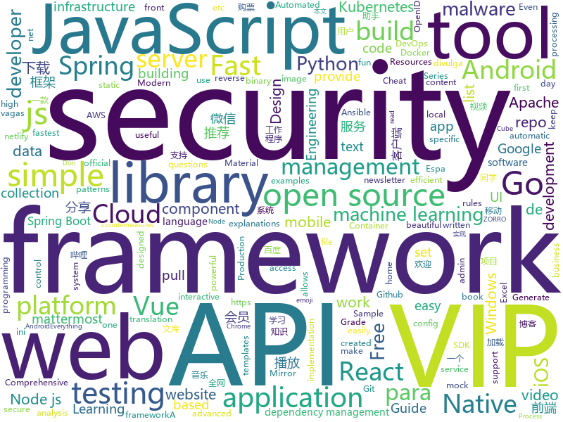

# 2019-12-13
See what the GitHub community is most excited about today.

## python
* [geo-heatmap](https://github.com/luka1199/geo-heatmap)(**191 stars today**): 🗺Generate an interactive geo heatmap from your Google location data
* [12306](https://github.com/testerSunshine/12306)(**73 stars today**): 12306智能刷票，订票
* [PythonPlantsVsZombies](https://github.com/marblexu/PythonPlantsVsZombies)(**199 stars today**): a simple PlantsVsZombies game
* [stylegan2](https://github.com/NVlabs/stylegan2)(**330 stars today**): StyleGAN2 - Official TensorFlow Implementation
* [Mobile-Security-Framework-MobSF](https://github.com/MobSF/Mobile-Security-Framework-MobSF)(**27 stars today**): Mobile Security Framework (MobSF) is an automated, all-in-one mobile application (Android/iOS/Windows) pen-testing, malware analysis and security assessment framework capable of performing static and dynamic analysis.
* [30-Days-Of-Python](https://github.com/Asabeneh/30-Days-Of-Python)(**54 stars today**): A 30 days of python programming challenge
* [bert](https://github.com/google-research/bert)(**42 stars today**): TensorFlow code and pre-trained models for BERT
* [dronesploit](https://github.com/dhondta/dronesploit)(**41 stars today**): Drone pentesting framework console
* [ALBERT](https://github.com/google-research/ALBERT)(**19 stars today**): 
* [poetry](https://github.com/python-poetry/poetry)(**108 stars today**): Python dependency management and packaging made easy.
* [DeepFaceLab](https://github.com/iperov/DeepFaceLab)(**37 stars today**): DeepFaceLab is a tool that utilizes machine learning to replace faces in videos. Includes prebuilt ready to work standalone Windows 7,8,10 binary (look readme.md).
* [airflow](https://github.com/apache/airflow)(**25 stars today**): Apache Airflow - A platform to programmatically author, schedule, and monitor workflows
* [python-patterns](https://github.com/faif/python-patterns)(**15 stars today**): A collection of design patterns/idioms in Python
* [home-assistant](https://github.com/home-assistant/home-assistant)(**44 stars today**): 🏡Open source home automation that puts local control and privacy first
* [py12306](https://github.com/pjialin/py12306)(**51 stars today**): 🚂12306 购票助手，支持集群，多账号，多任务购票以及 Web 页面管理
* [ansible-for-devops](https://github.com/geerlingguy/ansible-for-devops)(**5 stars today**): Ansible examples from Ansible for DevOps.
* [public-apis](https://github.com/public-apis/public-apis)(**165 stars today**): A collective list of free APIs for use in software and web development.
* [streamlit](https://github.com/streamlit/streamlit)(**60 stars today**): Streamlit — The fastest way to build custom ML tools
* [FaceForensics](https://github.com/ondyari/FaceForensics)(**9 stars today**): Github of the FaceForensics dataset
* [netbox](https://github.com/netbox-community/netbox)(**11 stars today**): IP address management (IPAM) and data center infrastructure management (DCIM) tool.
* [few-shot-vid2vid](https://github.com/NVlabs/few-shot-vid2vid)(**31 stars today**): Pytorch implementation for few-shot photorealistic video-to-video translation.
* [attack_range](https://github.com/splunk/attack_range)(**13 stars today**): A tool that allows you to create vulnerable instrumented local or cloud environments to simulate attacks against and collect the data into Splunk
* [CheatSheetSeries](https://github.com/OWASP/CheatSheetSeries)(**21 stars today**): The OWASP Cheat Sheet Series was created to provide a concise collection of high value information on specific application security topics.
* [cvat](https://github.com/opencv/cvat)(**6 stars today**): Powerful and efficient Computer Vision Annotation Tool (CVAT)
* [moto](https://github.com/spulec/moto)(**7 stars today**): A library that allows you to easily mock out tests based on AWS infrastructure.

## java
* [SpringAll](https://github.com/wuyouzhuguli/SpringAll)(**166 stars today**): 循序渐进，学习Spring Boot、Spring Boot & Shiro、Spring Cloud、Spring Security & Spring Security OAuth2，博客Spring系列源码
* [rocketmq](https://github.com/apache/rocketmq)(**20 stars today**): Mirror of Apache RocketMQ
* [vertx-examples](https://github.com/vert-x3/vertx-examples)(**5 stars today**): Vert.x examples
* [solo](https://github.com/88250/solo)(**13 stars today**): 🎸一款小而美的博客系统，专为程序员设计。
* [DoraemonKit](https://github.com/didi/DoraemonKit)(**32 stars today**): 简称 "DoKit" 。一款功能齐全的客户端（ iOS 、Android、微信小程序 ）研发助手，你值得拥有。
* [tutorials](https://github.com/eugenp/tutorials)(**33 stars today**): Just Announced - "Learn Spring Security OAuth":
* [easy-rules](https://github.com/j-easy/easy-rules)(**9 stars today**): The simple, stupid rules engine for Java
* [material-components-android](https://github.com/material-components/material-components-android)(**52 stars today**): Modular and customizable Material Design UI components for Android
* [x7](https://github.com/x-ream/x7)(**23 stars today**): 
* [interviews](https://github.com/kdn251/interviews)(**91 stars today**): Everything you need to know to get the job.
* [react-native-datetimepicker](https://github.com/react-native-community/react-native-datetimepicker)(**5 stars today**): React Native date & time picker component for iOS and Android
* [nifi](https://github.com/apache/nifi)(**4 stars today**): Mirror of Apache NiFi
* [react-native-camera](https://github.com/react-native-community/react-native-camera)(**5 stars today**): A Camera component for React Native. Also supports barcode scanning!
* [resilience4j](https://github.com/resilience4j/resilience4j)(**9 stars today**): Resilience4j is a fault tolerance library designed for Java8 and functional programming
* [incubator-hudi](https://github.com/apache/incubator-hudi)(**7 stars today**): Upserts And Incremental Processing on Big Data
* [antlr4](https://github.com/antlr/antlr4)(**10 stars today**): ANTLR (ANother Tool for Language Recognition) is a powerful parser generator for reading, processing, executing, or translating structured text or binary files.
* [DKVideoPlayer](https://github.com/dueeeke/DKVideoPlayer)(**13 stars today**): Android Video Player. 安卓视频播放器，封装MediaPlayer、ExoPlayer、IjkPlayer。模仿抖音并实现预加载，列表播放，悬浮播放，广告播放，弹幕
* [dddsample-core](https://github.com/citerus/dddsample-core)(**5 stars today**): This is the new home of the original DDD Sample app (previously hosted at sf.net)..
* [sonarqube](https://github.com/SonarSource/sonarqube)(**8 stars today**): Continuous Inspection
* [h2o-3](https://github.com/h2oai/h2o-3)(**4 stars today**): Open Source Fast Scalable Machine Learning Platform For Smarter Applications: Deep Learning, Gradient Boosting & XGBoost, Random Forest, Generalized Linear Modeling (Logistic Regression, Elastic Net), K-Means, PCA, Stacked Ensembles, Automatic Machine Learning (AutoML), etc.
* [litemall](https://github.com/linlinjava/litemall)(**24 stars today**): 又一个小商城。litemall = Spring Boot后端 + Vue管理员前端 + 微信小程序用户前端 + Vue用户移动端
* [PhotoEditor](https://github.com/burhanrashid52/PhotoEditor)(**4 stars today**): A Photo Editor library with simple, easy support for image editing using paints,text,filters,emoji and Sticker like stories.
* [flowable-engine](https://github.com/flowable/flowable-engine)(**7 stars today**): A compact and highly efficient workflow and Business Process Management (BPM) platform for developers, system admins and business users.
* [hutool](https://github.com/looly/hutool)(**39 stars today**): A set of tools that keep Java sweet.
* [springfox](https://github.com/springfox/springfox)(**3 stars today**): Automated JSON API documentation for API's built with Spring

## unknown
* [flutter_vignettes](https://github.com/gskinnerTeam/flutter_vignettes)(**204 stars today**): A collection of fun Flutter experiments, created by gskinner, in partnership with Google.
* [fengrenjie](https://github.com/renjie-feng-trash/fengrenjie)(**123 stars today**): 这个repo是为了锤北大垃圾教授——冯仁杰
* [google-cloud-4-words](https://github.com/gregsramblings/google-cloud-4-words)(**13 stars today**): The Google Cloud Developer's Cheat Sheet
* [awesome-reverse-engineering](https://github.com/alphaSeclab/awesome-reverse-engineering)(**78 stars today**): Reverse Engineering Resources About All Platforms(Windows/Linux/macOS/Android/iOS/IoT) And Every Aspect!
* [machine-learning-for-software-engineers](https://github.com/ZuzooVn/machine-learning-for-software-engineers)(**17 stars today**): A complete daily plan for studying to become a machine learning engineer.
* [JavaFamily](https://github.com/AobingJava/JavaFamily)(**222 stars today**): 【互联网一线大厂面试+学习指南】进阶知识完全扫盲：涵盖高并发、分布式、高可用、微服务等领域知识，作者风格幽默，看起来津津有味，把学习当做一种乐趣，何乐而不为，后端同学必看，前端同学我保证你也看得懂，看不懂你加我微信骂我渣男就好了。
* [955.WLB](https://github.com/formulahendry/955.WLB)(**91 stars today**): 955 不加班的公司名单 - 工作 955，work–life balance (工作与生活的平衡)
* [javascript-questions](https://github.com/lydiahallie/javascript-questions)(**88 stars today**): A long list of (advanced) JavaScript questions, and their explanations✨
* [reverse-engineering-and-malware-analysis](https://github.com/abhisek/reverse-engineering-and-malware-analysis)(**8 stars today**): Course content and slides from my ancient training on Reverse Engineering & Malware Analysis
* [API-Security-Checklist](https://github.com/shieldfy/API-Security-Checklist)(**16 stars today**): Checklist of the most important security countermeasures when designing, testing, and releasing your API
* [react-typescript-cheatsheet](https://github.com/typescript-cheatsheets/react-typescript-cheatsheet)(**37 stars today**): Cheatsheets for experienced React developers getting started with TypeScript
* [GitHubDaily](https://github.com/GitHubDaily/GitHubDaily)(**20 stars today**): GitHubDaily 分享内容定期整理与分类。欢迎推荐、自荐项目，让更多人知道你的项目。
* [free-programming-books](https://github.com/EbookFoundation/free-programming-books)(**73 stars today**): 📚Freely available programming books
* [vagas](https://github.com/frontendbr/vagas)(**6 stars today**): 🔬Espaço para divulgação de vagas para front-enders.
* [1024app-android](https://github.com/yuuwill/1024app-android)(**7 stars today**): 草榴官方客户端，小草客户端，Android
* [javascript-testing-best-practices](https://github.com/goldbergyoni/javascript-testing-best-practices)(**23 stars today**): 📗🌐🚢Comprehensive and exhaustive JavaScript & Node.js testing best practices (August 2019)
* [vagas](https://github.com/backend-br/vagas)(**5 stars today**): ✌️Espaço para divulgação de vagas para backenders
* [awesome-vue](https://github.com/vuejs/awesome-vue)(**33 stars today**): 🎉A curated list of awesome things related to Vue.js
* [uber_go_guide_cn](https://github.com/xxjwxc/uber_go_guide_cn)(**96 stars today**): Uber Go 语言编码规范中文版. The Uber Go Style Guide .
* [goQuality-dev-contents](https://github.com/Integerous/goQuality-dev-contents)(**14 stars today**): { 고퀄리티⚡️개발 컨텐츠 모음 }
* [General](https://github.com/JuliaRegistries/General)(**0 stars today**): The official registry of general Julia packages
* [Specs](https://github.com/CocoaPods/Specs)(**6 stars today**): The CocoaPods Master Repo
* [wildcat-vip-account](https://github.com/wuxingsanren/wildcat-vip-account)(**28 stars today**): 野猫VIP - 每天分享最新的百度网盘SVIP、迅雷超级会员、优酷VIP会员、哔哩哔哩大会员、百度文库VIP、苹果ID、天眼查VIP等等各类VIP帐号，随取随用，完全免费，绝无套路，同时提供：百度文库VIP下载、图库素材VIP下载、学术论文VIP下载、全网视频VIP解析、全网音乐MP3免费听及下载 ，欢迎推荐分享给好友！
* [Become-A-Full-Stack-Web-Developer](https://github.com/bmorelli25/Become-A-Full-Stack-Web-Developer)(**3 stars today**): Free resources for learning Full Stack Web Development
* [build-your-own-x](https://github.com/danistefanovic/build-your-own-x)(**77 stars today**): 🤓Build your own (insert technology here)

## javascript
* [graphql-engine](https://github.com/hasura/graphql-engine)(**53 stars today**): Blazing fast, instant realtime GraphQL APIs on Postgres with fine grained access control, also trigger webhooks on database events.
* [javascript-algorithms](https://github.com/trekhleb/javascript-algorithms)(**400 stars today**): 📝Algorithms and data structures implemented in JavaScript with explanations and links to further readings
* [Rocket.Chat](https://github.com/RocketChat/Rocket.Chat)(**22 stars today**): The ultimate Free Open Source Solution for team communications.
* [chakra-ui](https://github.com/chakra-ui/chakra-ui)(**37 stars today**): ⚡️Simple, Modular & Accessible UI Components for your React Applications
* [cube.js](https://github.com/cube-js/cube.js)(**22 stars today**): 📊Cube.js - Open Source Analytics Framework
* [NeteaseCloudMusicApi](https://github.com/Binaryify/NeteaseCloudMusicApi)(**101 stars today**): 网易云音乐 Node.js API service
* [yarn](https://github.com/yarnpkg/yarn)(**16 stars today**): 📦🐈Fast, reliable, and secure dependency management.
* [selectize.js](https://github.com/selectize/selectize.js)(**3 stars today**): Selectize is the hybrid of a textbox and <select> box. It's jQuery based and it has autocomplete and native-feeling keyboard navigation; useful for tagging, contact lists, etc.
* [How-To-Ask-Questions-The-Smart-Way](https://github.com/ryanhanwu/How-To-Ask-Questions-The-Smart-Way)(**55 stars today**): 本文原文由知名 Hacker Eric S. Raymond 所撰寫，教你如何正確的提出技術問題並獲得你滿意的答案。
* [strapi](https://github.com/strapi/strapi)(**46 stars today**): 🚀Open source Node.js Headless CMS to easily build customisable APIs
* [Leaflet](https://github.com/Leaflet/Leaflet)(**23 stars today**): 🍃JavaScript library for mobile-friendly interactive maps
* [puppeteer](https://github.com/puppeteer/puppeteer)(**44 stars today**): Headless Chrome Node.js API
* [tsdx](https://github.com/jaredpalmer/tsdx)(**20 stars today**): Zero-config CLI for TypeScript package development
* [eslint-plugin-react](https://github.com/yannickcr/eslint-plugin-react)(**8 stars today**): React specific linting rules for ESLint
* [highcharts](https://github.com/highcharts/highcharts)(**4 stars today**): Highcharts JS, the JavaScript charting framework
* [knex](https://github.com/knex/knex)(**15 stars today**): A query builder for PostgreSQL, MySQL and SQLite3, designed to be flexible, portable, and fun to use.
* [leonardo](https://github.com/adobe/leonardo)(**54 stars today**): Generate colors based on a desired contrast ratio
* [next.js](https://github.com/zeit/next.js)(**39 stars today**): The React Framework
* [bustag](https://github.com/gxtrobot/bustag)(**27 stars today**): a tag and recommend system for old bus driver 给老司机用的一个番号推荐系统
* [You-Dont-Know-JS](https://github.com/cezaraugusto/You-Dont-Know-JS)(**18 stars today**): 📗📒(PT-BR translation) JS Book Series.
* [jest](https://github.com/facebook/jest)(**21 stars today**): Delightful JavaScript Testing.
* [create-react-app](https://github.com/facebook/create-react-app)(**59 stars today**): Set up a modern web app by running one command.
* [express](https://github.com/expressjs/express)(**21 stars today**): Fast, unopinionated, minimalist web framework for node.
* [mattermost-webapp](https://github.com/mattermost/mattermost-webapp)(**2 stars today**): Webapp of Mattermost server: https://github.com/mattermost/mattermost-server
* [vue](https://github.com/vuejs/vue)(**109 stars today**): 🖖Vue.js is a progressive, incrementally-adoptable JavaScript framework for building UI on the web.

## html
* [hyperblog](https://github.com/freddier/hyperblog)(**9 stars today**): Un blog increíble para el curso de Git y Github de Platzi
* [mkdocs-material](https://github.com/squidfunk/mkdocs-material)(**3 stars today**): A Material Design theme for MkDocs
* [beautiful-jekyll](https://github.com/daattali/beautiful-jekyll)(**3 stars today**): ✨Build a beautiful and simple website in literally minutes. Demo at http://deanattali.com/beautiful-jekyll
* [docsy](https://github.com/google/docsy)(**4 stars today**): A set of Hugo doc templates for launching open source content.
* [Screenshot-to-code](https://github.com/emilwallner/Screenshot-to-code)(**20 stars today**): A neural network that transforms a design mock-up into a static website.
* [keep-a-changelog](https://github.com/olivierlacan/keep-a-changelog)(**5 stars today**): If you build software, keep a changelog.
* [APT-Sample](https://github.com/Cherishao/APT-Sample)(**12 stars today**): Pull some Malware samples here for other security researchers/malware analyst's to analyze and play with.
* [windows_protocol](https://github.com/daikerSec/windows_protocol)(**22 stars today**): 
* [keycloak-documentation](https://github.com/keycloak/keycloak-documentation)(**0 stars today**): 
* [personal-website](https://github.com/github/personal-website)(**7 stars today**): Code that'll help you kickstart a personal website that showcases your work as a software developer.
* [FakeLocation](https://github.com/Lerist/FakeLocation)(**7 stars today**): Fake Location
* [schemaspy](https://github.com/schemaspy/schemaspy)(**3 stars today**): SchemaSpy code home
* [Cerberus](https://github.com/TedGoas/Cerberus)(**2 stars today**): A few simple, but solid patterns for responsive HTML email templates and newsletters. Even in Outlook and Gmail.
* [mescroll](https://github.com/mescroll/mescroll)(**5 stars today**): 精致的下拉刷新和上拉加载 js框架.支持vue,完美运行于移动端和主流PC浏览器 (JS framework for pull-refresh and pull-up-loading)
* [patchwork](https://github.com/jlord/patchwork)(**0 stars today**): All the Git-it Workshop completers!
* [JavaScript30](https://github.com/wesbos/JavaScript30)(**11 stars today**): 30 Day Vanilla JS Challenge
* [owasp-mstg](https://github.com/OWASP/owasp-mstg)(**6 stars today**): The Mobile Security Testing Guide (MSTG) is a comprehensive manual for mobile app security development, testing and reverse engineering.
* [DevOps-Guide](https://github.com/Tikam02/DevOps-Guide)(**7 stars today**): DevOps Guide from basic to advanced with Interview Questions and Notes🔥
* [en.javascript.info](https://github.com/javascript-tutorial/en.javascript.info)(**12 stars today**): Modern JavaScript Tutorial
* [ng-alain](https://github.com/ng-alain/ng-alain)(**2 stars today**): NG-ZORRO admin panel front-end framework (netlify mirror https://netlify.ng-alain.com/)
* [excalibur](https://github.com/camelot-dev/excalibur)(**0 stars today**): A web interface to extract tabular data from PDFs
* [xlwings](https://github.com/xlwings/xlwings)(**2 stars today**): xlwings is a BSD-licensed Python library that makes it easy to call Python from Excel and vice versa. It works with Microsoft Excel on Windows and Mac. Sign up for the newsletter or follow us on twitter via
* [learning-area](https://github.com/mdn/learning-area)(**4 stars today**): Github repo for the MDN Learning Area.
* [fastText](https://github.com/facebookresearch/fastText)(**10 stars today**): Library for fast text representation and classification.
* [Spoon-Knife](https://github.com/octocat/Spoon-Knife)(**1 stars today**): This repo is for demonstration purposes only.

## go
* [traefik](https://github.com/containous/traefik)(**48 stars today**): The Cloud Native Edge Router
* [docker-slim](https://github.com/docker-slim/docker-slim)(**694 stars today**): DockerSlim (docker-slim): Don't change anything in your Docker container image and minify it by up to 30x (and for compiled languages even more) making it secure too! (free and open source)
* [telegraf](https://github.com/influxdata/telegraf)(**6 stars today**): The plugin-driven server agent for collecting & reporting metrics.
* [caddy](https://github.com/caddyserver/caddy)(**29 stars today**): Fast, cross-platform HTTP/2 web server with automatic HTTPS
* [slack](https://github.com/nlopes/slack)(**4 stars today**): Slack API in Go
* [ffuf](https://github.com/ffuf/ffuf)(**44 stars today**): Fast web fuzzer written in Go
* [cron](https://github.com/robfig/cron)(**40 stars today**): a cron library for go
* [kratos](https://github.com/bilibili/kratos)(**22 stars today**): Kratos是bilibili开源的一套Go微服务框架，包含大量微服务相关框架及工具。
* [kops](https://github.com/kubernetes/kops)(**9 stars today**): Kubernetes Operations (kops) - Production Grade K8s Installation, Upgrades, and Management
* [client-go](https://github.com/kubernetes/client-go)(**8 stars today**): Go client for Kubernetes.
* [terraform-provider-aws](https://github.com/terraform-providers/terraform-provider-aws)(**10 stars today**): Terraform AWS provider
* [helmfile](https://github.com/roboll/helmfile)(**41 stars today**): Deploy Kubernetes Helm Charts
* [hugo](https://github.com/gohugoio/hugo)(**56 stars today**): The world’s fastest framework for building websites.
* [dep](https://github.com/golang/dep)(**4 stars today**): Go dependency management tool
* [sarama](https://github.com/Shopify/sarama)(**5 stars today**): Sarama is a Go library for Apache Kafka 0.8, and up.
* [operator-sdk](https://github.com/operator-framework/operator-sdk)(**12 stars today**): SDK for building Kubernetes applications. Provides high level APIs, useful abstractions, and project scaffolding.
* [kubernetes](https://github.com/kubernetes/kubernetes)(**51 stars today**): Production-Grade Container Scheduling and Management
* [charts](https://github.com/helm/charts)(**10 stars today**): Curated applications for Kubernetes
* [hydra](https://github.com/ory/hydra)(**25 stars today**): OAuth2 Server and OpenID Certified™ OpenID Connect Provider written in Go - cloud native, security-first, open source API security for your infrastructure. SDKs for any language.
* [blackbox_exporter](https://github.com/prometheus/blackbox_exporter)(**2 stars today**): Blackbox prober exporter
* [mkcert](https://github.com/FiloSottile/mkcert)(**51 stars today**): A simple zero-config tool to make locally trusted development certificates with any names you'd like.
* [gaia](https://github.com/cosmos/gaia)(**1 stars today**): Cosmos Hub
* [go-swagger](https://github.com/go-swagger/go-swagger)(**9 stars today**): Swagger 2.0 implementation for go
* [ini](https://github.com/go-ini/ini)(**9 stars today**): Package ini provides INI file read and write functionality in Go.
* [vault](https://github.com/hashicorp/vault)(**10 stars today**): A tool for secrets management, encryption as a service, and privileged access management

## WordCloud

