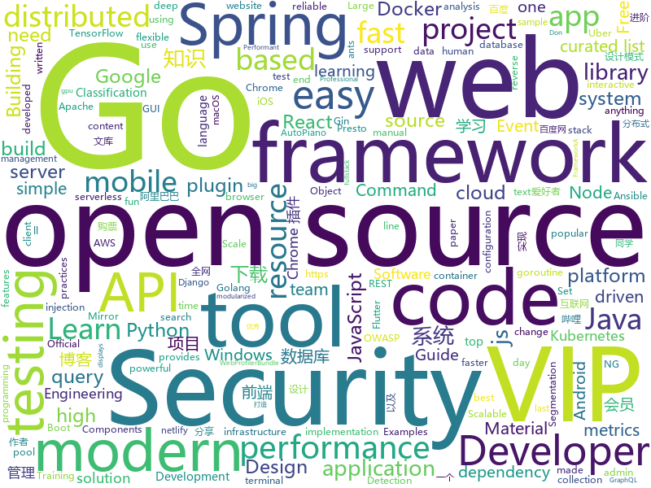

# 2019-12-14
See what the GitHub community is most excited about today.

## python
* [stylegan2](https://github.com/NVlabs/stylegan2)(**409 stars today**): StyleGAN2 - Official TensorFlow Implementation
* [12306](https://github.com/testerSunshine/12306)(**123 stars today**): 12306智能刷票，订票
* [py12306](https://github.com/pjialin/py12306)(**46 stars today**): 🚂12306 购票助手，支持集群，多账号，多任务购票以及 Web 页面管理
* [poetry](https://github.com/python-poetry/poetry)(**430 stars today**): Python dependency management and packaging made easy.
* [Mobile-Security-Framework-MobSF](https://github.com/MobSF/Mobile-Security-Framework-MobSF)(**30 stars today**): Mobile Security Framework (MobSF) is an automated, all-in-one mobile application (Android/iOS/Windows) pen-testing, malware analysis and security assessment framework capable of performing static and dynamic analysis.
* [faceswap](https://github.com/deepfakes/faceswap)(**45 stars today**): Deepfakes Software For All
* [pipenv](https://github.com/pypa/pipenv)(**41 stars today**): Python Development Workflow for Humans.
* [streamlit](https://github.com/streamlit/streamlit)(**85 stars today**): Streamlit — The fastest way to build custom ML tools
* [geo-heatmap](https://github.com/luka1199/geo-heatmap)(**179 stars today**): 🗺Generate an interactive geo heatmap from your Google location data
* [zulip](https://github.com/zulip/zulip)(**19 stars today**): Zulip server - powerful open source team chat
* [Douyin-Bot](https://github.com/wangshub/Douyin-Bot)(**34 stars today**): 😍Python 抖音机器人，论如何在抖音上找到漂亮小姐姐？
* [devs-against-the-machine](https://github.com/developers-against-repressions/devs-against-the-machine)(**22 stars today**): I онлайн-хакатон в поддержку политических заключенных
* [batea](https://github.com/delvelabs/batea)(**26 stars today**): AI-based, context-driven network device ranking
* [ChromeAppHeroes](https://github.com/zhaoolee/ChromeAppHeroes)(**194 stars today**): 🌈谷粒-Chrome插件英雄榜, 为优秀的Chrome插件写一本中文说明书, 让Chrome插件英雄们造福人类~ ChromePluginHeroes, Write a Chinese manual for the excellent Chrome plugin, let the Chrome plugin heroes benefit the human~
* [localstack](https://github.com/localstack/localstack)(**25 stars today**): 💻A fully functional local AWS cloud stack. Develop and test your cloud & Serverless apps offline!
* [stylegan](https://github.com/NVlabs/stylegan)(**20 stars today**): StyleGAN - Official TensorFlow Implementation
* [NeMo](https://github.com/NVIDIA/NeMo)(**17 stars today**): Neural Modules: a toolkit for conversational AI
* [mtprotoproxy](https://github.com/alexbers/mtprotoproxy)(**8 stars today**): Async MTProto proxy for Telegram
* [detectron2](https://github.com/facebookresearch/detectron2)(**47 stars today**): Detectron2 is FAIR's next-generation research platform for object detection and segmentation.
* [RDSNet](https://github.com/wangsr126/RDSNet)(**57 stars today**): implement for paper: "RDSNet: A New Deep Architecture for Reciprocal Object Detection and Instance Segmentation"
* [ansible-for-devops](https://github.com/geerlingguy/ansible-for-devops)(**5 stars today**): Ansible examples from Ansible for DevOps.
* [incubator-tvm](https://github.com/apache/incubator-tvm)(**9 stars today**): Open deep learning compiler stack for cpu, gpu and specialized accelerators
* [simpletransformers](https://github.com/ThilinaRajapakse/simpletransformers)(**6 stars today**): Transformers made simple with training, evaluation, and prediction possible with one line each. Currently supports Sequence Classification (binary, multiclass, multilabel), Token Classification (NER), and Question Answering. Built on top of the Hugging Face Transformer library.
* [system-design-primer](https://github.com/donnemartin/system-design-primer)(**66 stars today**): Learn how to design large-scale systems. Prep for the system design interview. Includes Anki flashcards.
* [30-Days-Of-Python](https://github.com/Asabeneh/30-Days-Of-Python)(**118 stars today**): A 30 days of python programming challenge

## java
* [seata](https://github.com/seata/seata)(**16 stars today**): 🔥Seata is an easy-to-use, high-performance, open source distributed transaction solution.
* [miaosha](https://github.com/qiurunze123/miaosha)(**49 stars today**): ⭐⭐⭐⭐秒杀系统设计与实现.互联网工程师进阶与分析🙋🐓
* [micrometer](https://github.com/micrometer-metrics/micrometer)(**6 stars today**): An application metrics facade for the most popular monitoring tools. Think SLF4J, but for metrics.
* [SpringAll](https://github.com/wuyouzhuguli/SpringAll)(**195 stars today**): 循序渐进，学习Spring Boot、Spring Boot & Shiro、Spring Cloud、Spring Security & Spring Security OAuth2，博客Spring系列源码
* [druid](https://github.com/alibaba/druid)(**21 stars today**): 阿里巴巴数据库事业部出品，为监控而生的数据库连接池
* [otter](https://github.com/alibaba/otter)(**7 stars today**): 阿里巴巴分布式数据库同步系统(解决中美异地机房)
* [shopping-management-system](https://github.com/zhanglei-workspace/shopping-management-system)(**10 stars today**): 该项目为多个小项目的集合（持续更新中...）。内容类似淘宝、京东等网购管理系统以及图书管理、超市管理等系统。目的在于便于Java初级爱好者在学习完某一部分Java知识后有一个合适的项目锻炼、运用所学知识，完善知识体系。适用人群：Java基础到入门的爱好者。
* [micronaut-core](https://github.com/micronaut-projects/micronaut-core)(**5 stars today**): Micronaut Application Framework
* [rest-assured](https://github.com/rest-assured/rest-assured)(**4 stars today**): Java DSL for easy testing of REST services
* [pulsar](https://github.com/apache/pulsar)(**8 stars today**): Apache Pulsar - distributed pub-sub messaging system
* [HikariCP](https://github.com/brettwooldridge/HikariCP)(**12 stars today**): 光 HikariCP・A solid, high-performance, JDBC connection pool at last.
* [maven](https://github.com/apache/maven)(**2 stars today**): Apache Maven core
* [mockito](https://github.com/mockito/mockito)(**9 stars today**): Most popular Mocking framework for unit tests written in Java
* [interviews](https://github.com/kdn251/interviews)(**76 stars today**): Everything you need to know to get the job.
* [tutorials](https://github.com/eugenp/tutorials)(**22 stars today**): Just Announced - "Learn Spring Security OAuth":
* [kafka](https://github.com/apache/kafka)(**17 stars today**): Mirror of Apache Kafka
* [presto](https://github.com/prestosql/presto)(**3 stars today**): Official home of the community managed version of Presto, the distributed SQL query engine for big data, under the auspices of the Presto Software Foundation.
* [views-widgets-samples](https://github.com/android/views-widgets-samples)(**10 stars today**): Multiple samples showing the best practices in views-widgets on Android.
* [janusgraph](https://github.com/JanusGraph/janusgraph)(**5 stars today**): JanusGraph: an open-source, distributed graph database
* [lucene-solr](https://github.com/apache/lucene-solr)(**2 stars today**): Apache Lucene and Solr open-source search software
* [guice](https://github.com/google/guice)(**10 stars today**): Guice (pronounced 'juice') is a lightweight dependency injection framework for Java 6 and above, brought to you by Google.
* [solo](https://github.com/88250/solo)(**21 stars today**): 🎸一款小而美的博客系统，专为程序员设计。
* [kubernetes-client](https://github.com/fabric8io/kubernetes-client)(**3 stars today**): Java client for Kubernetes & OpenShift
* [camel](https://github.com/apache/camel)(**4 stars today**): Apache Camel
* [lottie-react-native](https://github.com/react-native-community/lottie-react-native)(**10 stars today**): Lottie wrapper for React Native.

## unknown
* [flutter_vignettes](https://github.com/gskinnerTeam/flutter_vignettes)(**243 stars today**): A collection of fun Flutter experiments, created by gskinner, in partnership with Google.
* [kkndme_tianya](https://github.com/iambryanshen/kkndme_tianya)(**66 stars today**): 天涯 kkndme 神贴聊房价
* [awesome-reverse-engineering](https://github.com/alphaSeclab/awesome-reverse-engineering)(**154 stars today**): Reverse Engineering Resources About All Platforms(Windows/Linux/macOS/Android/iOS/IoT) And Every Aspect!
* [api-guidelines](https://github.com/microsoft/api-guidelines)(**252 stars today**): Microsoft REST API Guidelines
* [awesome-dynamodb](https://github.com/alexdebrie/awesome-dynamodb)(**54 stars today**): List of resources for learning about modeling, operating, and using Amazon DynamoDB
* [dxcriteria](https://github.com/cto-a/dxcriteria)(**44 stars today**): the Criteria for Two DXs (Digital Transformation and Developer eXperience)
* [awesome-ddd](https://github.com/heynickc/awesome-ddd)(**14 stars today**): A curated list of Domain-Driven Design (DDD), Command Query Responsibility Segregation (CQRS), Event Sourcing, and Event Storming resources
* [awesome-pentest](https://github.com/enaqx/awesome-pentest)(**16 stars today**): A collection of awesome penetration testing resources, tools and other shiny things
* [Flutter-Course-Resources](https://github.com/londonappbrewery/Flutter-Course-Resources)(**13 stars today**): Learn to Code While Building Apps - The Complete Flutter Development Bootcamp
* [AMD_Vanilla](https://github.com/AMD-OSX/AMD_Vanilla)(**10 stars today**): Native AMD macOS via Clover & OpenCore
* [bugcrowd_university](https://github.com/bugcrowd/bugcrowd_university)(**6 stars today**): Open source education content for the researcher community
* [aws-modern-application-workshop](https://github.com/aws-samples/aws-modern-application-workshop)(**5 stars today**): A tutorial for developers that want to learn about how to build modern applications on top of AWS. You will build a sample website that leverages infrastructure as code, containers, serverless code functions, CI/CD, and more.
* [awesome-monte-carlo-tree-search-papers](https://github.com/benedekrozemberczki/awesome-monte-carlo-tree-search-papers)(**23 stars today**): A curated list of Monte Carlo tree search papers with implementations.
* [wildcat-vip-account](https://github.com/wuxingsanren/wildcat-vip-account)(**33 stars today**): 野猫VIP - 每天分享最新的百度网盘SVIP、迅雷超级会员、优酷VIP会员、哔哩哔哩大会员、百度文库VIP、苹果ID、天眼查VIP等等各类VIP帐号，随取随用，完全免费，绝无套路，同时提供：百度文库VIP下载、图库素材VIP下载、学术论文VIP下载、全网视频VIP解析、全网音乐MP3免费听及下载 ，欢迎推荐分享给好友！
* [golang-developer-roadmap](https://github.com/Alikhll/golang-developer-roadmap)(**11 stars today**): Roadmap to becoming a Go developer in 2019
* [clash_for_windows_pkg](https://github.com/Fndroid/clash_for_windows_pkg)(**27 stars today**): A Windows GUI based on Clash
* [awesome-scalability](https://github.com/binhnguyennus/awesome-scalability)(**13 stars today**): The Patterns of Scalable, Reliable, and Performant Large-Scale Systems
* [awesome-sre](https://github.com/dastergon/awesome-sre)(**92 stars today**): A curated list of Site Reliability and Production Engineering resources.
* [You-Dont-Know-JS](https://github.com/getify/You-Dont-Know-JS)(**71 stars today**): A book series on JavaScript. @YDKJS on twitter.
* [0](https://github.com/0-01/0)(**21 stars today**): 
* [uber_go_guide_cn](https://github.com/xxjwxc/uber_go_guide_cn)(**49 stars today**): Uber Go 语言编码规范中文版. The Uber Go Style Guide .
* [modern-cpp-features](https://github.com/AnthonyCalandra/modern-cpp-features)(**7 stars today**): A cheatsheet of modern C++ language and library features.
* [JavaFamily](https://github.com/AobingJava/JavaFamily)(**122 stars today**): 【互联网一线大厂面试+学习指南】进阶知识完全扫盲：涵盖高并发、分布式、高可用、微服务等领域知识，作者风格幽默，看起来津津有味，把学习当做一种乐趣，何乐而不为，后端同学必看，前端同学我保证你也看得懂，看不懂你加我微信骂我渣男就好了。
* [learn-regex](https://github.com/ziishaned/learn-regex)(**41 stars today**): Learn regex the easy way
* [awesome-project-ideas](https://github.com/NirantK/awesome-project-ideas)(**6 stars today**): Curated list of Machine Learning, NLP, Vision, Recommender Systems Project Ideas

## javascript
* [javascript-algorithms](https://github.com/trekhleb/javascript-algorithms)(**423 stars today**): 📝Algorithms and data structures implemented in JavaScript with explanations and links to further readings
* [cypress](https://github.com/cypress-io/cypress)(**38 stars today**): Fast, easy and reliable testing for anything that runs in a browser.
* [cube.js](https://github.com/cube-js/cube.js)(**27 stars today**): 📊Cube.js - Open Source Analytics Framework
* [Rocket.Chat](https://github.com/RocketChat/Rocket.Chat)(**44 stars today**): The ultimate Free Open Source Solution for team communications.
* [awx](https://github.com/ansible/awx)(**8 stars today**): AWX Project
* [preact](https://github.com/preactjs/preact)(**23 stars today**): ⚛️Fast 3kB React alternative with the same modern API. Components & Virtual DOM.
* [fx](https://github.com/antonmedv/fx)(**98 stars today**): Command-line tool and terminal JSON viewer🔥
* [realworld](https://github.com/gothinkster/realworld)(**46 stars today**): "The mother of all demo apps" — Exemplary fullstack Medium.com clone powered by React, Angular, Node, Django, and many more🏅
* [drawio](https://github.com/jgraph/drawio)(**100 stars today**): Source to www.draw.io
* [incubator-echarts](https://github.com/apache/incubator-echarts)(**47 stars today**): A powerful, interactive charting and visualization library for browser
* [lite-youtube-embed](https://github.com/paulirish/lite-youtube-embed)(**65 stars today**): A faster youtube embed.
* [create-react-app](https://github.com/facebook/create-react-app)(**63 stars today**): Set up a modern web app by running one command.
* [baidupankey](https://github.com/wu-dada/baidupankey)(**4 stars today**): 查询百度网盘&蓝奏盘提取码
* [curso-javascript-ninja](https://github.com/da2k/curso-javascript-ninja)(**3 stars today**): Curso Javascript Ninja
* [AutoPiano](https://github.com/WarpPrism/AutoPiano)(**12 stars today**): 自由钢琴🎹AutoPiano ( https://www.autopiano.cn ) Simple & Elegant Piano Online
* [cypress-documentation](https://github.com/cypress-io/cypress-documentation)(**1 stars today**): Cypress Documentation including Guides, API, Plugins, Examples, & FAQ.
* [Blog](https://github.com/ljianshu/Blog)(**12 stars today**): 关注基础知识，打造优质前端博客，公众号[前端工匠]的作者
* [slick](https://github.com/kenwheeler/slick)(**8 stars today**): the last carousel you'll ever need
* [strapi](https://github.com/strapi/strapi)(**42 stars today**): 🚀Open source Node.js Headless CMS to easily build customisable APIs
* [graphql-engine](https://github.com/hasura/graphql-engine)(**87 stars today**): Blazing fast, instant realtime GraphQL APIs on Postgres with fine grained access control, also trigger webhooks on database events.
* [vue](https://github.com/vuejs/vue)(**87 stars today**): 🖖Vue.js is a progressive, incrementally-adoptable JavaScript framework for building UI on the web.
* [fingerprintjs2](https://github.com/Valve/fingerprintjs2)(**121 stars today**): Modern & flexible browser fingerprinting library
* [react-table](https://github.com/tannerlinsley/react-table)(**28 stars today**): ⚛️Hooks for building fast and extendable tables and datagrids for React
* [next.js](https://github.com/zeit/next.js)(**33 stars today**): The React Framework
* [knex](https://github.com/knex/knex)(**16 stars today**): A query builder for PostgreSQL, MySQL and SQLite3, designed to be flexible, portable, and fun to use.

## html
* [fastText](https://github.com/facebookresearch/fastText)(**8 stars today**): Library for fast text representation and classification.
* [owasp-mstg](https://github.com/OWASP/owasp-mstg)(**8 stars today**): The Mobile Security Testing Guide (MSTG) is a comprehensive manual for mobile app security development, testing and reverse engineering.
* [web-profiler-bundle](https://github.com/symfony/web-profiler-bundle)(**3 stars today**): The WebProfilerBundle provides detailed technical information about each request execution and displays it in both the web debug toolbar and the profiler.
* [keycloak-documentation](https://github.com/keycloak/keycloak-documentation)(**0 stars today**): 
* [personal-website](https://github.com/github/personal-website)(**4 stars today**): Code that'll help you kickstart a personal website that showcases your work as a software developer.
* [devdocs](https://github.com/magento/devdocs)(**0 stars today**): Magento Developer Documentation
* [docsy](https://github.com/google/docsy)(**4 stars today**): A set of Hugo doc templates for launching open source content.
* [ng-alain](https://github.com/ng-alain/ng-alain)(**4 stars today**): NG-ZORRO admin panel front-end framework (netlify mirror https://netlify.ng-alain.com/)
* [NodeGoat](https://github.com/OWASP/NodeGoat)(**8 stars today**): The OWASP NodeGoat project provides an environment to learn how OWASP Top 10 security risks apply to web applications developed using Node.js and how to effectively address them.
* [zfaka](https://github.com/zlkbdotnet/zfaka)(**0 stars today**): 免费、安全、稳定、高效的发卡系统，值得拥有!
* [webdevbootcamp](https://github.com/nax3t/webdevbootcamp)(**2 stars today**): All source code for back-end projects from the Web Developer Bootcamp
* [AR.js](https://github.com/jeromeetienne/AR.js)(**9 stars today**): Efficient Augmented Reality for the Web - 60fps on mobile!
* [stisla](https://github.com/stisla/stisla)(**3 stars today**): Free Bootstrap Admin Template
* [ctf-wiki](https://github.com/ctf-wiki/ctf-wiki)(**5 stars today**): CTF Wiki Online. Come and join us, we need you!
* [subspace](https://github.com/subspacecloud/subspace)(**5 stars today**): A simple WireGuard VPN server GUI
* [compat-table](https://github.com/kangax/compat-table)(**0 stars today**): ECMAScript 5/6/7 compatibility tables
* [professional-services](https://github.com/GoogleCloudPlatform/professional-services)(**3 stars today**): Common solutions and tools developed by Google Cloud's Professional Services team
* [Django-CRM](https://github.com/MicroPyramid/Django-CRM)(**3 stars today**): Open Source Python CRM based on Django aimed to salesforce compatible for migrating to
* [portainer](https://github.com/portainer/portainer)(**15 stars today**): Making Docker management easy.
* [MatBlazor](https://github.com/SamProf/MatBlazor)(**10 stars today**): Material Design components for Blazor and Razor Components
* [docs](https://github.com/pingcap/docs)(**2 stars today**): TiDB/TiKV/PD documents.
* [WebFundamentals](https://github.com/google/WebFundamentals)(**9 stars today**): Best practices for modern web development
* [JavaScript30](https://github.com/wesbos/JavaScript30)(**10 stars today**): 30 Day Vanilla JS Challenge
* [schemaspy](https://github.com/schemaspy/schemaspy)(**4 stars today**): SchemaSpy code home
* [boost](https://github.com/boostorg/boost)(**2 stars today**): Super-project for modularized Boost

## go
* [sqlc](https://github.com/kyleconroy/sqlc)(**194 stars today**): Generate type safe Go from SQL
* [nebula](https://github.com/slackhq/nebula)(**237 stars today**): A scalable overlay networking tool with a focus on performance, simplicity and security
* [ants](https://github.com/panjf2000/ants)(**11 stars today**): 🐜🐜🐜ants is a high-performance and low-cost goroutine pool in Go, inspired by fasthttp./ ants 是一个高性能且低损耗的 goroutine 池。
* [helm](https://github.com/helm/helm)(**26 stars today**): The Kubernetes Package Manager
* [elastic](https://github.com/olivere/elastic)(**7 stars today**): Elasticsearch client for Go.
* [gin](https://github.com/gin-gonic/gin)(**40 stars today**): Gin is a HTTP web framework written in Go (Golang). It features a Martini-like API with much better performance -- up to 40 times faster. If you need smashing performance, get yourself some Gin.
* [uni](https://github.com/arp242/uni)(**219 stars today**): Query the Unicode database from the commandline, with good support for emojis
* [mongo-go-driver](https://github.com/mongodb/mongo-go-driver)(**12 stars today**): The Go driver for MongoDB
* [gotraining](https://github.com/ardanlabs/gotraining)(**88 stars today**): Go Training Class Material :
* [telegraf](https://github.com/influxdata/telegraf)(**21 stars today**): The plugin-driven server agent for collecting & reporting metrics.
* [viper](https://github.com/spf13/viper)(**8 stars today**): Go configuration with fangs
* [terraform-provider-azurerm](https://github.com/terraform-providers/terraform-provider-azurerm)(**1 stars today**): Terraform provider for Azure Resource Manager
* [docker-slim](https://github.com/docker-slim/docker-slim)(**594 stars today**): DockerSlim (docker-slim): Don't change anything in your Docker container image and minify it by up to 30x (and for compiled languages even more) making it secure too! (free and open source)
* [helmfile](https://github.com/roboll/helmfile)(**24 stars today**): Deploy Kubernetes Helm Charts
* [wire](https://github.com/google/wire)(**12 stars today**): Compile-time Dependency Injection for Go
* [golang-design-pattern](https://github.com/senghoo/golang-design-pattern)(**11 stars today**): 设计模式 Golang实现－《研磨设计模式》读书笔记
* [dive](https://github.com/wagoodman/dive)(**63 stars today**): A tool for exploring each layer in a docker image
* [OpenDiablo2](https://github.com/OpenDiablo2/OpenDiablo2)(**21 stars today**): An open source re-implementation of Diablo 2
* [fyne](https://github.com/fyne-io/fyne)(**38 stars today**): Cross platform GUI in Go based on Material Design
* [aws-sdk-go](https://github.com/aws/aws-sdk-go)(**4 stars today**): AWS SDK for the Go programming language.
* [caddy](https://github.com/caddyserver/caddy)(**28 stars today**): Fast, cross-platform HTTP/2 web server with automatic HTTPS
* [terraform](https://github.com/hashicorp/terraform)(**33 stars today**): Terraform enables you to safely and predictably create, change, and improve infrastructure. It is an open source tool that codifies APIs into declarative configuration files that can be shared amongst team members, treated as code, edited, reviewed, and versioned.
* [jaeger](https://github.com/jaegertracing/jaeger)(**20 stars today**): CNCF Jaeger, a Distributed Tracing Platform
* [micro](https://github.com/zyedidia/micro)(**11 stars today**): A modern and intuitive terminal-based text editor
* [cosmos-sdk](https://github.com/cosmos/cosmos-sdk)(**3 stars today**): ⛓A Framework for Building High Value Public Blockchains✨

## WordCloud

