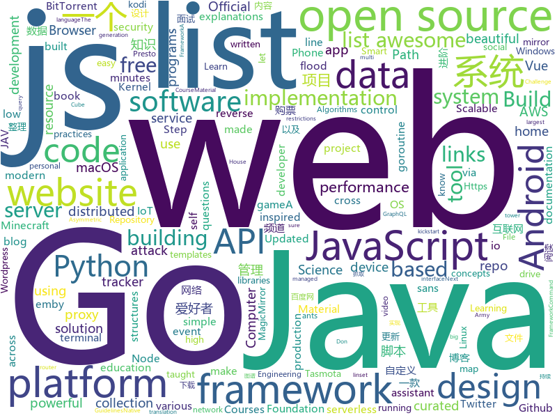

# 2019-12-15
See what the GitHub community is most excited about today.

## python
* [JAV-Scraper-and-Rename-local-files](https://github.com/junerain123/JAV-Scraper-and-Rename-local-files)(**191 stars today**): JAV影片信息整理工具，抓取元数据nfo，自定义重命名文件(夹)，下载fanart裁剪poster，为emby、kodi、极影派铺路。jav-scrapy 老司机 javbus
* [stylegan2](https://github.com/NVlabs/stylegan2)(**245 stars today**): StyleGAN2 - Official TensorFlow Implementation
* [zhao](https://github.com/programthink/zhao)(**20 stars today**): 【编程随想】整理的《太子党关系网络》，专门揭露赵国的权贵
* [12306](https://github.com/testerSunshine/12306)(**149 stars today**): 12306智能刷票，订票
* [poetry](https://github.com/python-poetry/poetry)(**187 stars today**): Python dependency management and packaging made easy.
* [system-design-primer](https://github.com/donnemartin/system-design-primer)(**50 stars today**): Learn how to design large-scale systems. Prep for the system design interview. Includes Anki flashcards.
* [shadowsocks](https://github.com/shadowsocks/shadowsocks)(**11 stars today**): 
* [devs-against-the-machine](https://github.com/developers-against-repressions/devs-against-the-machine)(**14 stars today**): I онлайн-хакатон в поддержку политических заключенных
* [home-assistant](https://github.com/home-assistant/home-assistant)(**34 stars today**): 🏡Open source home automation that puts local control and privacy first
* [AV_Data_Capture](https://github.com/yoshiko2/AV_Data_Capture)(**34 stars today**): 日本电影元数据刮削器，配合kodi,emby等本地媒体管理工具使用
* [Buku](https://github.com/jarun/Buku)(**5 stars today**): 🔖Browser-independent bookmark manager
* [py12306](https://github.com/pjialin/py12306)(**50 stars today**): 🚂12306 购票助手，支持集群，多账号，多任务购票以及 Web 页面管理
* [kornia](https://github.com/kornia/kornia)(**3 stars today**): Open Source Differentiable Computer Vision Library for PyTorch
* [CC-attack](https://github.com/Leeon123/CC-attack)(**6 stars today**): Using Socks4/5 proxy to make a multithread Http-flood/Https-flood (cc) attack.
* [zulip](https://github.com/zulip/zulip)(**13 stars today**): Zulip server - powerful open source team chat
* [esptool](https://github.com/espressif/esptool)(**3 stars today**): ESP8266 and ESP32 serial bootloader utility
* [sherlock](https://github.com/sherlock-project/sherlock)(**27 stars today**): 🔎Find usernames across social networks
* [awesome-python](https://github.com/vinta/awesome-python)(**54 stars today**): A curated list of awesome Python frameworks, libraries, software and resources
* [ACNet](https://github.com/DingXiaoH/ACNet)(**12 stars today**): ACNet: Strengthening the Kernel Skeletons for Powerful CNN via Asymmetric Convolution Blocks
* [discord.py](https://github.com/Rapptz/discord.py)(**6 stars today**): An API wrapper for Discord written in Python.
* [Instagram](https://github.com/Pure-L0G1C/Instagram)(**2 stars today**): Bruteforce attack for Instagram
* [PhoneInfoga](https://github.com/sundowndev/PhoneInfoga)(**7 stars today**): Advanced information gathering & OSINT tool for phone numbers
* [mtprotoproxy](https://github.com/alexbers/mtprotoproxy)(**3 stars today**): Async MTProto proxy for Telegram
* [iptv-m3u-maker](https://github.com/EvilCult/iptv-m3u-maker)(**16 stars today**): IPTV 国内+国外 电视台直播源m3u文件, 收集&汇总脚本,目前状况: 收录频道总数:2269, 优质频道数:563
* [anki](https://github.com/dae/anki)(**6 stars today**): Anki for desktop computers

## java
* [miaosha](https://github.com/qiurunze123/miaosha)(**26 stars today**): ⭐⭐⭐⭐秒杀系统设计与实现.互联网工程师进阶与分析🙋🐓
* [kafdrop](https://github.com/obsidiandynamics/kafdrop)(**24 stars today**): Kafka Web UI
* [zeppelin](https://github.com/apache/zeppelin)(**5 stars today**): Mirror of Apache Zeppelin
* [igniter](https://github.com/trojan-gfw/igniter)(**5 stars today**): A trojan client for Android (UNDER CONSTRUCTION).
* [solo](https://github.com/88250/solo)(**14 stars today**): 🎸一款小而美的博客系统，专为程序员设计。
* [Mindustry](https://github.com/Anuken/Mindustry)(**8 stars today**): A sandbox tower defense game
* [Algorithms](https://github.com/williamfiset/Algorithms)(**11 stars today**): A collection of algorithms and data structures
* [shopping-management-system](https://github.com/zhanglei-workspace/shopping-management-system)(**11 stars today**): 该项目为多个小项目的集合（持续更新中...）。内容类似淘宝、京东等网购管理系统以及图书管理、超市管理等系统。目的在于便于Java初级爱好者在学习完某一部分Java知识后有一个合适的项目锻炼、运用所学知识，完善知识体系。适用人群：Java基础到入门的爱好者。
* [AndroidTutorialForBeginners](https://github.com/hussien89aa/AndroidTutorialForBeginners)(**5 stars today**): Step by step to build Android apps using Android Studio
* [soul](https://github.com/Dromara/soul)(**32 stars today**): High-Performance Java API Gateway
* [otter](https://github.com/alibaba/otter)(**5 stars today**): 阿里巴巴分布式数据库同步系统(解决中美异地机房)
* [ForestBlog](https://github.com/saysky/ForestBlog)(**12 stars today**): 一个简单漂亮的SSM(Spring+SpringMVC+Mybatis)博客系统
* [seata](https://github.com/seata/seata)(**39 stars today**): 🔥Seata is an easy-to-use, high-performance, open source distributed transaction solution.
* [ghidra](https://github.com/NationalSecurityAgency/ghidra)(**23 stars today**): Ghidra is a software reverse engineering (SRE) framework
* [ftgo-application](https://github.com/microservices-patterns/ftgo-application)(**2 stars today**): Example code for the book Microservice patterns
* [KitDB](https://github.com/frost373/KitDB)(**70 stars today**): KitDB是一个内嵌式持久型的 高速NoSQL存储 lib
* [baritone](https://github.com/cabaletta/baritone)(**12 stars today**): google maps for block game
* [dynmap](https://github.com/webbukkit/dynmap)(**2 stars today**): A set of Minecraft mods that provide a real time web-based map system for various Minecraft server implementations.
* [presto](https://github.com/prestosql/presto)(**3 stars today**): Official home of the community managed version of Presto, the distributed SQL query engine for big data, under the auspices of the Presto Software Foundation.
* [realworld-serverless-application](https://github.com/awslabs/realworld-serverless-application)(**5 stars today**): This project is inspired by the design and development of the AWS Serverless Application Repository - a production-grade AWS service. Learn how AWS built a production service using serverless technologies.
* [NewPipe](https://github.com/TeamNewPipe/NewPipe)(**9 stars today**): A libre lightweight streaming front-end for Android.
* [clojure](https://github.com/clojure/clojure)(**8 stars today**): The Clojure programming language
* [effective-java-3e-source-code](https://github.com/jbloch/effective-java-3e-source-code)(**5 stars today**): The source code from the third edition of Effective Java, with minor additions as necessary to make it runnable.
* [MyBookshelf](https://github.com/gedoor/MyBookshelf)(**7 stars today**): 阅读是一款可以自定义来源阅读网络内容的工具，为广大网络文学爱好者提供一种方便、快捷舒适的试读体验。
* [HackerRank](https://github.com/RyanFehr/HackerRank)(**1 stars today**): HackerRank solutions in Java/JS/Python/C++/C#

## unknown
* [awesome-reverse-engineering](https://github.com/alphaSeclab/awesome-reverse-engineering)(**195 stars today**): Reverse Engineering Resources About All Platforms(Windows/Linux/macOS/Android/iOS/IoT) And Every Aspect!
* [powerbiadoption](https://github.com/pbiaf/powerbiadoption)(**14 stars today**): Power BI Adoption Framework
* [evil-man](https://github.com/CNwoman-bot/evil-man)(**125 stars today**): 
* [javascript-questions](https://github.com/lydiahallie/javascript-questions)(**94 stars today**): A long list of (advanced) JavaScript questions, and their explanations✨
* [build-your-own-x](https://github.com/danistefanovic/build-your-own-x)(**101 stars today**): 🤓Build your own (insert technology here)
* [kkndme_tianya](https://github.com/iambryanshen/kkndme_tianya)(**89 stars today**): 天涯 kkndme 神贴聊房价
* [Xiaomi_Kernel_OpenSource](https://github.com/MiCode/Xiaomi_Kernel_OpenSource)(**5 stars today**): Xiaomi Mobile Phone Kernel OpenSource
* [electron-ssr-backup](https://github.com/qingshuisiyuan/electron-ssr-backup)(**18 stars today**): electron-ssr原作者删除了这个伟大的项目，故备份了下来，不继续开发,且用且珍惜
* [Java-Interview](https://github.com/gzc426/Java-Interview)(**32 stars today**): Java 面试必会 直通BAT
* [api-guidelines](https://github.com/microsoft/api-guidelines)(**192 stars today**): Microsoft REST API Guidelines
* [AMD_Vanilla](https://github.com/AMD-OSX/AMD_Vanilla)(**6 stars today**): Native AMD macOS via Clover & OpenCore
* [architect-awesome](https://github.com/xingshaocheng/architect-awesome)(**55 stars today**): 后端架构师技术图谱
* [web-security-basics](https://github.com/vasanthk/web-security-basics)(**64 stars today**): Web security concepts
* [you-dont-know-js-ru](https://github.com/azat-io/you-dont-know-js-ru)(**8 stars today**): 📚Russian translation of "You Don't Know JS" book series
* [NeverSink-Filter](https://github.com/NeverSinkDev/NeverSink-Filter)(**18 stars today**): This is a lootfilter for the game "Path of Exile". It hides low value items, uses a markup-scheme and sounds to highlight expensive gear and is based on economy data mining.
* [awesome-for-beginners](https://github.com/MunGell/awesome-for-beginners)(**26 stars today**): A list of awesome beginners-friendly projects.
* [awesome-graph-classification](https://github.com/benedekrozemberczki/awesome-graph-classification)(**25 stars today**): A collection of important graph embedding, classification and representation learning papers with implementations.
* [computer-science](https://github.com/ossu/computer-science)(**52 stars today**): 🎓Path to a free self-taught education in Computer Science!
* [TrackersListCollection](https://github.com/XIU2/TrackersListCollection)(**29 stars today**): 🎈Updated daily! A list of popular public BitTorrent trackers. / 每天更新！全网热门公共 BitTorrent Tracker 列表！
* [udacity-nanodegrees](https://github.com/mikesprague/udacity-nanodegrees)(**6 stars today**): 🎓List of Udacity Nanodegree programs with links to the free courses in their curricula
* [data-science](https://github.com/ossu/data-science)(**5 stars today**): 📊Path to a free self-taught education in Data Science!
* [system_design](https://github.com/shashank88/system_design)(**8 stars today**): Preparation links and resources for system design questions
* [developer-roadmap](https://github.com/kamranahmedse/developer-roadmap)(**60 stars today**): Roadmap to becoming a web developer in 2019
* [Awesome-Hacking](https://github.com/Hack-with-Github/Awesome-Hacking)(**23 stars today**): A collection of various awesome lists for hackers, pentesters and security researchers

## javascript
* [cube.js](https://github.com/cube-js/cube.js)(**53 stars today**): 📊Cube.js - Open Source Analytics Framework
* [fx](https://github.com/antonmedv/fx)(**122 stars today**): Command-line tool and terminal JSON viewer🔥
* [javascript-algorithms](https://github.com/trekhleb/javascript-algorithms)(**261 stars today**): 📝Algorithms and data structures implemented in JavaScript with explanations and links to further readings
* [clean-code-javascript](https://github.com/ryanmcdermott/clean-code-javascript)(**88 stars today**): 🛁Clean Code concepts adapted for JavaScript
* [nodebestpractices](https://github.com/goldbergyoni/nodebestpractices)(**99 stars today**): ✅The largest Node.js best practices list (November 2019)
* [Functional-Light-JS](https://github.com/getify/Functional-Light-JS)(**52 stars today**): Pragmatic, balanced FP in JavaScript. @FLJSBook on twitter.
* [lite-youtube-embed](https://github.com/paulirish/lite-youtube-embed)(**56 stars today**): A faster youtube embed.
* [leonsans](https://github.com/cmiscm/leonsans)(**30 stars today**): Leon Sans is a geometric sans-serif typeface made with code in 2019 by Jongmin Kim.
* [electron-react-boilerplate](https://github.com/electron-react-boilerplate/electron-react-boilerplate)(**13 stars today**): A Foundation for Scalable Cross-Platform Apps
* [junior-recruit-scheduler](https://github.com/jojoldu/junior-recruit-scheduler)(**8 stars today**): 주니어 개발자 채용 정보
* [Home-AssistantConfig](https://github.com/CCOSTAN/Home-AssistantConfig)(**3 stars today**): 🏠Home Assistant configuration & Documentation for my Smart House. Write ups, videos, part lists and links throughout. Be sure to⭐️it. Updated FREQUENTLY!
* [graphql-engine](https://github.com/hasura/graphql-engine)(**68 stars today**): Blazing fast, instant realtime GraphQL APIs on Postgres with fine grained access control, also trigger webhooks on database events.
* [aframe](https://github.com/aframevr/aframe)(**2 stars today**): 🅰️web framework for building virtual reality experiences.
* [comments-api](https://github.com/dev-mastery/comments-api)(**12 stars today**): 
* [wp-calypso](https://github.com/Automattic/wp-calypso)(**3 stars today**): The JavaScript and API powered WordPress.com
* [overreacted.io](https://github.com/gaearon/overreacted.io)(**5 stars today**): Personal blog by Dan Abramov.
* [vue-router](https://github.com/vuejs/vue-router)(**9 stars today**): 🚦The official router for Vue.js.
* [vue](https://github.com/vuejs/vue)(**65 stars today**): 🖖Vue.js is a progressive, incrementally-adoptable JavaScript framework for building UI on the web.
* [etcher](https://github.com/balena-io/etcher)(**15 stars today**): Flash OS images to SD cards & USB drives, safely and easily.
* [MagicMirror](https://github.com/MichMich/MagicMirror)(**11 stars today**): MagicMirror² is an open source modular smart mirror platform. With a growing list of installable modules, the MagicMirror² allows you to convert your hallway or bathroom mirror into your personal assistant.
* [baiduyun](https://github.com/syhyz1990/baiduyun)(**24 stars today**): 🖖油猴脚本 一个脚本搞定百度网盘下载 https://www.baiduyun.wiki
* [nginx-proxy-manager](https://github.com/jc21/nginx-proxy-manager)(**2 stars today**): Docker container for managing Nginx proxy hosts with a simple, powerful interface
* [brave-browser](https://github.com/brave/brave-browser)(**12 stars today**): Next generation Brave browser for macOS, Windows, Linux, and eventually Android
* [eslint-config-wesbos](https://github.com/wesbos/eslint-config-wesbos)(**22 stars today**): No-Sweat™ Eslint and Prettier Setup - with or without VS Code

## html
* [nginx-blackout](https://github.com/podivilov/nginx-blackout)(**109 stars today**): 
* [JavaScript30](https://github.com/wesbos/JavaScript30)(**9 stars today**): 30 Day Vanilla JS Challenge
* [beautiful-jekyll](https://github.com/daattali/beautiful-jekyll)(**7 stars today**): ✨Build a beautiful and simple website in literally minutes. Demo at http://deanattali.com/beautiful-jekyll
* [personal-website](https://github.com/github/personal-website)(**6 stars today**): Code that'll help you kickstart a personal website that showcases your work as a software developer.
* [learning-area](https://github.com/mdn/learning-area)(**1 stars today**): Github repo for the MDN Learning Area.
* [website](https://github.com/kubernetes/website)(**3 stars today**): Kubernetes website and documentation repo:
* [fluxion](https://github.com/FluxionNetwork/fluxion)(**2 stars today**): Fluxion is a remake of linset by vk496 with less bugs and enhanced functionality.
* [awesome-piracy](https://github.com/Igglybuff/awesome-piracy)(**10 stars today**): A curated list of awesome warez and piracy links
* [datasciencecoursera](https://github.com/mGalarnyk/datasciencecoursera)(**3 stars today**): Data Science Repo and blog for John Hopkins Coursera Courses. Please let me know if you have any questions.
* [stisla](https://github.com/stisla/stisla)(**2 stars today**): Free Bootstrap Admin Template
* [luci-app-clash](https://github.com/frainzy1477/luci-app-clash)(**3 stars today**): Luci interface for Clash Openwrt
* [WebFundamentals](https://github.com/google/WebFundamentals)(**8 stars today**): Best practices for modern web development
* [hugo-academic](https://github.com/gcushen/hugo-academic)(**13 stars today**): 📝The website builder for Hugo. Build and deploy a beautiful website in minutes!
* [GDIndex](https://github.com/maple3142/GDIndex)(**4 stars today**): A Google Drive Index built with Vue Running on CloudFlare Workers
* [curso-algebra-lineal](https://github.com/joanby/curso-algebra-lineal)(**1 stars today**): Curso de Álgebra Lineal
* [node-ytdl-core](https://github.com/fent/node-ytdl-core)(**1 stars today**): YouTube video downloader in javascript.
* [Java-Interview-Advanced](https://github.com/shishan100/Java-Interview-Advanced)(**8 stars today**): 中华石杉--互联网Java进阶面试训练营
* [zfaka](https://github.com/zlkbdotnet/zfaka)(**2 stars today**): 免费、安全、稳定、高效的发卡系统，值得拥有!
* [shellphish](https://github.com/thelinuxchoice/shellphish)(**3 stars today**): Phishing Tool for 18 social media: Instagram, Facebook, Snapchat, Github, Twitter, Yahoo, Protonmail, Spotify, Netflix, Linkedin, Wordpress, Origin, Steam, Microsoft, InstaFollowers, Gitlab, Pinterest
* [blog_os](https://github.com/phil-opp/blog_os)(**7 stars today**): Writing an OS in Rust
* [css-grid](https://github.com/wesbos/css-grid)(**1 stars today**): Starter Files + Solutions to my CSSGrid.io Course
* [MatBlazor](https://github.com/SamProf/MatBlazor)(**10 stars today**): Material Design components for Blazor and Razor Components
* [zenbot](https://github.com/DeviaVir/zenbot)(**5 stars today**): Zenbot is a command-line cryptocurrency trading bot using Node.js and MongoDB.
* [templates](https://github.com/blakadder/templates)(**0 stars today**): Tasmota Device Templates Repository. Your one stop shop to get templates for devices running Tasmota!
* [web-starter-kit](https://github.com/google/web-starter-kit)(**3 stars today**): Web Starter Kit - a workflow for multi-device websites

## go
* [nebula](https://github.com/slackhq/nebula)(**309 stars today**): A scalable overlay networking tool with a focus on performance, simplicity and security
* [sqlc](https://github.com/kyleconroy/sqlc)(**260 stars today**): Generate type safe Go from SQL
* [fyne](https://github.com/fyne-io/fyne)(**37 stars today**): Cross platform GUI in Go based on Material Design
* [ultimate-go](https://github.com/hoanhan101/ultimate-go)(**38 stars today**): Ultimate Go study guide, with heavily documented code and programs analysis, all in 1 place
* [AdGuardHome](https://github.com/AdguardTeam/AdGuardHome)(**13 stars today**): Network-wide ads & trackers blocking DNS server
* [bettercap](https://github.com/bettercap/bettercap)(**5 stars today**): The Swiss Army knife for 802.11, BLE and Ethernet networks reconnaissance and MITM attacks.
* [spikeSystem](https://github.com/GuoZhaoran/spikeSystem)(**16 stars today**): 
* [v2ray-core](https://github.com/v2ray/v2ray-core)(**32 stars today**): A platform for building proxies to bypass network restrictions.
* [pipeline](https://github.com/tektoncd/pipeline)(**8 stars today**): A K8s-native Pipeline resource.
* [ants](https://github.com/panjf2000/ants)(**10 stars today**): 🐜🐜🐜ants is a high-performance and low-cost goroutine pool in Go, inspired by fasthttp./ ants 是一个高性能且低损耗的 goroutine 池。
* [govim](https://github.com/govim/govim)(**4 stars today**): govim is a Go development plugin for Vim8, written in Go
* [gobot](https://github.com/hybridgroup/gobot)(**9 stars today**): Golang framework for robotics, drones, and the Internet of Things (IoT)
* [gotraining](https://github.com/ardanlabs/gotraining)(**44 stars today**): Go Training Class Material :
* [colly](https://github.com/gocolly/colly)(**12 stars today**): Elegant Scraper and Crawler Framework for Golang
* [awesome-go](https://github.com/avelino/awesome-go)(**32 stars today**): A curated list of awesome Go frameworks, libraries and software
* [rita](https://github.com/activecm/rita)(**4 stars today**): Real Intelligence Threat Analytics
* [OpenDiablo2](https://github.com/OpenDiablo2/OpenDiablo2)(**17 stars today**): An open source re-implementation of Diablo 2
* [caddy](https://github.com/caddyserver/caddy)(**21 stars today**): Fast, cross-platform HTTP/2 web server with automatic HTTPS
* [micro](https://github.com/zyedidia/micro)(**15 stars today**): A modern and intuitive terminal-based text editor
* [BaiduPCS-Go](https://github.com/iikira/BaiduPCS-Go)(**33 stars today**): 百度网盘客户端 - Go语言编写
* [staticgen](https://github.com/tj/staticgen)(**112 stars today**): Static website generator that lets you use HTTP servers and frameworks you already know
* [dapr](https://github.com/dapr/dapr)(**14 stars today**): Dapr is a portable, event-driven, runtime for building distributed applications across cloud and edge.
* [service](https://github.com/kardianos/service)(**12 stars today**): Run go programs as a service on major platforms.
* [dolt](https://github.com/liquidata-inc/dolt)(**28 stars today**): Dolt – It's Git for Data
* [filebrowser](https://github.com/filebrowser/filebrowser)(**9 stars today**): 📂Web File Browser which can be used as a middleware or standalone app.

## WordCloud

