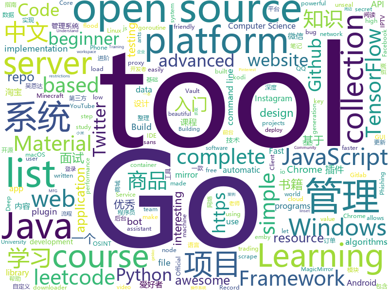

# 2019-12-16
See what the GitHub community is most excited about today.

## python
* [stylegan2](https://github.com/NVlabs/stylegan2)(**390 stars today**): StyleGAN2 - Official TensorFlow Implementation
* [12306](https://github.com/testerSunshine/12306)(**112 stars today**): 12306智能刷票，订票
* [YouTube-Report](https://github.com/A3M4/YouTube-Report)(**42 stars today**): Generate a YouTube report from your Takeout data
* [zhao](https://github.com/programthink/zhao)(**31 stars today**): 【编程随想】整理的《太子党关系网络》，专门揭露赵国的权贵
* [seeprettyface-generator-wanghong](https://github.com/a312863063/seeprettyface-generator-wanghong)(**92 stars today**): 这是一个用StyleGAN训练出的网红脸生成器
* [keras](https://github.com/keras-team/keras)(**36 stars today**): Deep Learning for humans
* [JAV-Scraper-and-Rename-local-files](https://github.com/junerain123/JAV-Scraper-and-Rename-local-files)(**318 stars today**): JAV影片信息整理工具，抓取元数据nfo，自定义重命名文件(夹)，下载fanart裁剪poster，为emby、kodi、极影派铺路。jav-scrapy 老司机 javbus
* [you-get](https://github.com/soimort/you-get)(**60 stars today**): ⏬Dumb downloader that scrapes the web
* [ChromeAppHeroes](https://github.com/zhaoolee/ChromeAppHeroes)(**154 stars today**): 🌈谷粒-Chrome插件英雄榜, 为优秀的Chrome插件写一本中文说明书, 让Chrome插件英雄们造福人类~ ChromePluginHeroes, Write a Chinese manual for the excellent Chrome plugin, let the Chrome plugin heroes benefit the human~
* [AV_Data_Capture](https://github.com/yoshiko2/AV_Data_Capture)(**48 stars today**): 日本电影元数据刮削器，配合kodi,emby等本地媒体管理工具使用
* [InstaPy](https://github.com/timgrossmann/InstaPy)(**15 stars today**): 📷Instagram Bot - Tool for automated Instagram interactions
* [examples-of-web-crawlers](https://github.com/shengqiangzhang/examples-of-web-crawlers)(**31 stars today**): 一些非常有趣的python爬虫例子,对新手比较友好,主要爬取淘宝、天猫、微信、豆瓣、QQ等网站。(Some interesting examples of python crawlers that are friendly to beginners. )
* [code_snippets](https://github.com/CoreyMSchafer/code_snippets)(**7 stars today**): 
* [zulip](https://github.com/zulip/zulip)(**20 stars today**): Zulip server - powerful open source team chat
* [mycroft-core](https://github.com/MycroftAI/mycroft-core)(**15 stars today**): Mycroft Core, the Mycroft Artificial Intelligence platform.
* [python-telegram-bot](https://github.com/python-telegram-bot/python-telegram-bot)(**18 stars today**): We have made you a wrapper you can't refuse
* [stylegan](https://github.com/NVlabs/stylegan)(**29 stars today**): StyleGAN - Official TensorFlow Implementation
* [CC-attack](https://github.com/Leeon123/CC-attack)(**10 stars today**): Using Socks4/5 proxy to make a multithread Http-flood/Https-flood (cc) attack.
* [ml-agents](https://github.com/Unity-Technologies/ml-agents)(**35 stars today**): Unity Machine Learning Agents Toolkit
* [GitHub-Chinese-Top-Charts](https://github.com/kon9chunkit/GitHub-Chinese-Top-Charts)(**237 stars today**): 🇨🇳GitHub中文排行榜，帮助你发现高分优秀中文项目、更高效地吸收国人的优秀经验成果；榜单每周更新一次，敬请关注！
* [PhoneInfoga](https://github.com/sundowndev/PhoneInfoga)(**11 stars today**): Advanced information gathering & OSINT tool for phone numbers
* [eth2.0-specs](https://github.com/ethereum/eth2.0-specs)(**5 stars today**): Ethereum 2.0 Specifications
* [twint](https://github.com/twintproject/twint)(**38 stars today**): An advanced Twitter scraping & OSINT tool written in Python that doesn't use Twitter's API, allowing you to scrape a user's followers, following, Tweets and more while evading most API limitations.
* [Deep-Learning-with-TensorFlow-book](https://github.com/dragen1860/Deep-Learning-with-TensorFlow-book)(**72 stars today**): 深度学习入门开源书，基于TensorFlow 2.0案例实战。Open source Deep Learning book, based on TensorFlow 2.0 framework.
* [DeDRM_tools](https://github.com/apprenticeharper/DeDRM_tools)(**7 stars today**): DeDRM tools for ebooks

## java
* [miaosha](https://github.com/qiurunze123/miaosha)(**66 stars today**): ⭐⭐⭐⭐秒杀系统设计与实现.互联网工程师进阶与分析🙋🐓
* [solo](https://github.com/88250/solo)(**28 stars today**): 🎸一款小而美的博客系统，专为程序员设计。
* [idempiere](https://github.com/idempiere/idempiere)(**14 stars today**): iDempiere. Community Powered Enterprise. Full Open Source Business Suite ERP/CRM/MFG/SCM/POS
* [Mindustry](https://github.com/Anuken/Mindustry)(**15 stars today**): A sandbox tower defense game
* [Interview-Questions](https://github.com/rishabh115/Interview-Questions)(**6 stars today**): Most comprehensive list📋of tech interview questions📘of companies scraped from Geeksforgeeks, CareerCup and Glassdoor.
* [micronaut-core](https://github.com/micronaut-projects/micronaut-core)(**8 stars today**): Micronaut Application Framework
* [JavaGuide](https://github.com/Snailclimb/JavaGuide)(**194 stars today**): 【Java学习+面试指南】 一份涵盖大部分Java程序员所需要掌握的核心知识。
* [CS-Notes](https://github.com/CyC2018/CS-Notes)(**163 stars today**): 📚技术面试必备基础知识、Leetcode、计算机操作系统、计算机网络、系统设计、Java、Python、C++
* [Algorithms](https://github.com/williamfiset/Algorithms)(**22 stars today**): A collection of algorithms and data structures
* [Terasology](https://github.com/MovingBlocks/Terasology)(**4 stars today**): Terasology - open source voxel world
* [che](https://github.com/eclipse/che)(**7 stars today**): Eclipse Che: Next-generation Eclipse IDE. Open source workspace server and cloud IDE.
* [EhViewer](https://github.com/seven332/EhViewer)(**9 stars today**): [DEPRECATED] An Unofficial E-Hentai Application for Android
* [mall](https://github.com/macrozheng/mall)(**190 stars today**): mall项目是一套电商系统，包括前台商城系统及后台管理系统，基于SpringBoot+MyBatis实现。 前台商城系统包含首页门户、商品推荐、商品搜索、商品展示、购物车、订单流程、会员中心、客户服务、帮助中心等模块。 后台管理系统包含商品管理、订单管理、会员管理、促销管理、运营管理、内容管理、统计报表、财务管理、权限管理、设置等模块。
* [Lawnchair](https://github.com/LawnchairLauncher/Lawnchair)(**5 stars today**): No clever tagline needed
* [MinecraftForge](https://github.com/MinecraftForge/MinecraftForge)(**5 stars today**): Modifications to the Minecraft base files to assist in compatibility between mods.
* [MaterialDialog-Android](https://github.com/PatilShreyas/MaterialDialog-Android)(**34 stars today**): 📱Android Library to implement animated,😍beautiful,🎨stylish Material Dialog in android apps easily.
* [JustAuth](https://github.com/justauth/JustAuth)(**11 stars today**): 💯史上最全的整合第三方登录的开源库。目前已支持Github、Gitee、微博、钉钉、百度、Coding、腾讯云开发者平台、OSChina、支付宝、QQ、微信、淘宝、Google、Facebook、抖音、领英、小米、微软、今日头条、Teambition、StackOverflow、Pinterest、人人、华为、企业微信、酷家乐、Gitlab、美团、饿了么和推特等第三方平台的授权登录。 Login, so easy!
* [MyBookshelf](https://github.com/gedoor/MyBookshelf)(**15 stars today**): 阅读是一款可以自定义来源阅读网络内容的工具，为广大网络文学爱好者提供一种方便、快捷舒适的试读体验。
* [zeppelin](https://github.com/apache/zeppelin)(**6 stars today**): Mirror of Apache Zeppelin
* [BTNotifierAndroid](https://github.com/RomascuAndrei/BTNotifierAndroid)(**0 stars today**): 
* [shopping-management-system](https://github.com/zhanglei-workspace/shopping-management-system)(**20 stars today**): 该项目为多个小项目的集合（持续更新中...）。内容类似淘宝、京东等网购管理系统以及图书管理、超市管理等系统。目的在于便于Java初级爱好者在学习完某一部分Java知识后有一个合适的项目锻炼、运用所学知识，完善知识体系。适用人群：Java基础到入门的爱好者。
* [SpringBoot-Labs](https://github.com/YunaiV/SpringBoot-Labs)(**22 stars today**): 
* [xDrip](https://github.com/NightscoutFoundation/xDrip)(**4 stars today**): Nightscout version of xDrip+
* [Towny](https://github.com/TownyAdvanced/Towny)(**1 stars today**): Towny Advanced Minecraft plugin for Bukkit/Spigot.
* [android_packages_apps_GmsCore](https://github.com/microg/android_packages_apps_GmsCore)(**6 stars today**): Implementation of Play Services Core package

## unknown
* [architect-awesome](https://github.com/xingshaocheng/architect-awesome)(**90 stars today**): 后端架构师技术图谱
* [awesome](https://github.com/sindresorhus/awesome)(**158 stars today**): 😎Awesome lists about all kinds of interesting topics
* [awesome-java-books](https://github.com/sorenduan/awesome-java-books)(**22 stars today**): Java开发者技术书籍大全 - Java入门书籍，Java基础及进阶书籍，框架与中间件，架构设计，设计模式，数学与算法，JVM周边语言，项目管理&领导力&流程，职业素养与个人成长，格局与视野，面试参考书等。
* [evil-man](https://github.com/CNwoman-bot/evil-man)(**142 stars today**): 
* [coding-interview-university](https://github.com/jwasham/coding-interview-university)(**92 stars today**): A complete computer science study plan to become a software engineer.
* [awesome-reverse-engineering](https://github.com/alphaSeclab/awesome-reverse-engineering)(**400 stars today**): Reverse Engineering Resources About All Platforms(Windows/Linux/macOS/Android/iOS/IoT) And Every Aspect!
* [awesome-shodan-queries](https://github.com/jakejarvis/awesome-shodan-queries)(**63 stars today**): 🔍A collection of interesting, funny, and depressing search queries to plug into https://shodan.io/👩‍💻
* [Red-Teaming-Toolkit](https://github.com/infosecn1nja/Red-Teaming-Toolkit)(**26 stars today**): A collection of open source and commercial tools that aid in red team operations.
* [Tvlist-awesome-m3u-m3u8](https://github.com/billy21/Tvlist-awesome-m3u-m3u8)(**11 stars today**): 直播源相关资源汇总📺💯IPTV、M3U
* [powerbiadoption](https://github.com/pbiaf/powerbiadoption)(**29 stars today**): Power BI Adoption Framework
* [Beginner-Network-Pentesting](https://github.com/hmaverickadams/Beginner-Network-Pentesting)(**14 stars today**): Notes for Beginner Network Pentesting Course
* [Awesome](https://github.com/Awesome-Windows/Awesome)(**22 stars today**): 💻An awesome & curated list of best applications and tools for Windows.
* [awesome-for-beginners](https://github.com/MunGell/awesome-for-beginners)(**45 stars today**): A list of awesome beginners-friendly projects.
* [awesome-courses](https://github.com/prakhar1989/awesome-courses)(**26 stars today**): 📚List of awesome university courses for learning Computer Science!
* [NeverSink-Filter](https://github.com/NeverSinkDev/NeverSink-Filter)(**23 stars today**): This is a lootfilter for the game "Path of Exile". It hides low value items, uses a markup-scheme and sounds to highlight expensive gear and is based on economy data mining.
* [pua-books](https://github.com/it-ebooks/pua-books)(**8 stars today**): 📚PUA 书籍
* [Xiaomi_Kernel_OpenSource](https://github.com/MiCode/Xiaomi_Kernel_OpenSource)(**8 stars today**): Xiaomi Mobile Phone Kernel OpenSource
* [udacity-nanodegrees](https://github.com/mikesprague/udacity-nanodegrees)(**11 stars today**): 🎓List of Udacity Nanodegree programs with links to the free courses in their curricula
* [Flutter-Course-Resources](https://github.com/londonappbrewery/Flutter-Course-Resources)(**14 stars today**): Learn to Code While Building Apps - The Complete Flutter Development Bootcamp
* [Java-Interview](https://github.com/gzc426/Java-Interview)(**47 stars today**): Java 面试必会 直通BAT
* [clash_for_windows_pkg](https://github.com/Fndroid/clash_for_windows_pkg)(**39 stars today**): A Windows GUI based on Clash
* [0](https://github.com/0-01/0)(**17 stars today**): 
* [Awesome-Hacking-Resources](https://github.com/vitalysim/Awesome-Hacking-Resources)(**11 stars today**): A collection of hacking / penetration testing resources to make you better!
* [Resources-for-Beginner-Bug-Bounty-Hunters](https://github.com/nahamsec/Resources-for-Beginner-Bug-Bounty-Hunters)(**22 stars today**): A list of resources for those interested in getting started in bug bounties
* [fancyss_history_package](https://github.com/hq450/fancyss_history_package)(**33 stars today**): 科学上网插件的离线安装包储存在这里

## javascript
* [fx](https://github.com/antonmedv/fx)(**181 stars today**): Command-line tool and terminal JSON viewer🔥
* [iptv](https://github.com/iptv-org/iptv)(**134 stars today**): Collection of 8000+ publicly available IPTV channels from all over the world
* [cube.js](https://github.com/cube-js/cube.js)(**117 stars today**): 📊Cube.js - Open Source Analytics Framework
* [lx-music-desktop](https://github.com/lyswhut/lx-music-desktop)(**58 stars today**): 一个基于 electron 的音乐软件
* [lite-youtube-embed](https://github.com/paulirish/lite-youtube-embed)(**146 stars today**): A faster youtube embed.
* [Functional-Light-JS](https://github.com/getify/Functional-Light-JS)(**70 stars today**): Pragmatic, balanced FP in JavaScript. @FLJSBook on twitter.
* [leonsans](https://github.com/cmiscm/leonsans)(**38 stars today**): Leon Sans is a geometric sans-serif typeface made with code in 2019 by Jongmin Kim.
* [complete-javascript-course](https://github.com/jonasschmedtmann/complete-javascript-course)(**20 stars today**): Starter files, final projects and FAQ for my Complete JavaScript course
* [discord-api-docs](https://github.com/discordapp/discord-api-docs)(**3 stars today**): Official Discord API Documentation
* [nginx-proxy-manager](https://github.com/jc21/nginx-proxy-manager)(**5 stars today**): Docker container for managing Nginx proxy hosts with a simple, powerful interface
* [react-redux-realworld-example-app](https://github.com/gothinkster/react-redux-realworld-example-app)(**7 stars today**): Exemplary real world application built with React + Redux
* [eslint-config-wesbos](https://github.com/wesbos/eslint-config-wesbos)(**36 stars today**): No-Sweat™ Eslint and Prettier Setup - with or without VS Code
* [algorithm-visualizer](https://github.com/algorithm-visualizer/algorithm-visualizer)(**72 stars today**): 🎆Interactive Online Platform that Visualizes Algorithms from Code
* [material-ui](https://github.com/mui-org/material-ui)(**65 stars today**): React components for faster and easier web development. Build your own design system, or start with Material Design.
* [node-express-realworld-example-app](https://github.com/gothinkster/node-express-realworld-example-app)(**5 stars today**): 
* [leetcode](https://github.com/azl397985856/leetcode)(**90 stars today**): LeetCode Solutions: A Record of My Problem Solving Journey.( leetcode题解，记录自己的leetcode解题之路。)
* [udemy-docker-mastery](https://github.com/BretFisher/udemy-docker-mastery)(**10 stars today**): Udemy Course to build, compose, deploy, and manage containers from local development to high-availability in the cloud
* [brave-browser](https://github.com/brave/brave-browser)(**21 stars today**): Next generation Brave browser for macOS, Windows, Linux, and eventually Android
* [jest](https://github.com/facebook/jest)(**39 stars today**): Delightful JavaScript Testing.
* [MagicMirror](https://github.com/MichMich/MagicMirror)(**15 stars today**): MagicMirror² is an open source modular smart mirror platform. With a growing list of installable modules, the MagicMirror² allows you to convert your hallway or bathroom mirror into your personal assistant.
* [redux-code](https://github.com/StephenGrider/redux-code)(**7 stars today**): Companion Repo for a course on Udemy
* [gekko](https://github.com/askmike/gekko)(**13 stars today**): A bitcoin trading bot written in node - https://gekko.wizb.it/
* [comments-api](https://github.com/dev-mastery/comments-api)(**20 stars today**): 
* [kubernetes-basicLearning](https://github.com/knrt10/kubernetes-basicLearning)(**18 stars today**): Understand kubernetes step by step. A simple repo for beginners🔥
* [fre](https://github.com/yisar/fre)(**38 stars today**): 👻Tiny React16 like library with Concurrent and Suspense.

## html
* [machine-learning-systems-design](https://github.com/chiphuyen/machine-learning-systems-design)(**56 stars today**): A booklet on machine learning systems design with exercises
* [blaze](https://github.com/blenderskool/blaze)(**55 stars today**): ⚡ File sharing progressive web app built using WebRTC and WebSockets
* [free-for-dev](https://github.com/ripienaar/free-for-dev)(**66 stars today**): A list of SaaS, PaaS and IaaS offerings that have free tiers of interest to devops and infradev
* [deeplearning_ai_books](https://github.com/fengdu78/deeplearning_ai_books)(**20 stars today**): deeplearning.ai（吴恩达老师的深度学习课程笔记及资源）
* [learning-area](https://github.com/mdn/learning-area)(**4 stars today**): Github repo for the MDN Learning Area.
* [hugo-academic](https://github.com/gcushen/hugo-academic)(**16 stars today**): 📝The website builder for Hugo. Build and deploy a beautiful website in minutes!
* [fluxion](https://github.com/FluxionNetwork/fluxion)(**2 stars today**): Fluxion is a remake of linset by vk496 with less bugs and enhanced functionality.
* [en.javascript.info](https://github.com/javascript-tutorial/en.javascript.info)(**25 stars today**): Modern JavaScript Tutorial
* [zphisher](https://github.com/htr-tech/zphisher)(**2 stars today**): Automated Phishing Tool for Termux
* [Coursera-ML-AndrewNg-Notes](https://github.com/fengdu78/Coursera-ML-AndrewNg-Notes)(**21 stars today**): 吴恩达老师的机器学习课程个人笔记
* [nginx-blackout](https://github.com/podivilov/nginx-blackout)(**129 stars today**): 
* [blackeye](https://github.com/thelinuxchoice/blackeye)(**4 stars today**): The most complete Phishing Tool, with 32 templates +1 customizable
* [video](https://github.com/zccxyz/video)(**32 stars today**): 
* [JavaScript-Piano](https://github.com/WebDevSimplified/JavaScript-Piano)(**14 stars today**): 
* [ShowKeyPlus](https://github.com/Superfly-Inc/ShowKeyPlus)(**3 stars today**): Windows product key finder and validation checker
* [node-ytdl-core](https://github.com/fent/node-ytdl-core)(**2 stars today**): YouTube video downloader in javascript.
* [cs231n.github.io](https://github.com/cs231n/cs231n.github.io)(**10 stars today**): Public facing notes page
* [web-moderno](https://github.com/cod3rcursos/web-moderno)(**3 stars today**): 
* [zenbot](https://github.com/DeviaVir/zenbot)(**6 stars today**): Zenbot is a command-line cryptocurrency trading bot using Node.js and MongoDB.
* [meu-primeiro-jogo-multiplayer](https://github.com/filipedeschamps/meu-primeiro-jogo-multiplayer)(**2 stars today**): Um jogo multiplayer bastante simples para testarmos o Socket.io
* [website](https://github.com/kubernetes/website)(**4 stars today**): Kubernetes website and documentation repo:
* [REKCARC-TSC-UHT](https://github.com/PKUanonym/REKCARC-TSC-UHT)(**22 stars today**): 清华大学计算机系课程攻略 Guidance for courses in Department of Computer Science and Technology, Tsinghua University
* [home-assistant.io](https://github.com/home-assistant/home-assistant.io)(**4 stars today**): 📘Home Assistant User documentation
* [shellphish](https://github.com/thelinuxchoice/shellphish)(**5 stars today**): Phishing Tool for 18 social media: Instagram, Facebook, Snapchat, Github, Twitter, Yahoo, Protonmail, Spotify, Netflix, Linkedin, Wordpress, Origin, Steam, Microsoft, InstaFollowers, Gitlab, Pinterest
* [OpenClash](https://github.com/vernesong/OpenClash)(**5 stars today**): A Clash Client For OpenWrt

## go
* [nebula](https://github.com/slackhq/nebula)(**336 stars today**): A scalable overlay networking tool with a focus on performance, simplicity and security
* [sqlc](https://github.com/kyleconroy/sqlc)(**221 stars today**): Generate type safe Go from SQL
* [gasper](https://github.com/sdslabs/gasper)(**162 stars today**): Your Cloud in a Binary
* [gotraining](https://github.com/ardanlabs/gotraining)(**68 stars today**): Go Training Class Material :
* [BaiduPCS-Go](https://github.com/iikira/BaiduPCS-Go)(**51 stars today**): 百度网盘客户端 - Go语言编写
* [v2ray-core](https://github.com/v2ray/v2ray-core)(**41 stars today**): A platform for building proxies to bypass network restrictions.
* [ultimate-go](https://github.com/hoanhan101/ultimate-go)(**53 stars today**): Ultimate Go study guide, with heavily documented code and programs analysis, all in 1 place
* [bank-vaults](https://github.com/banzaicloud/bank-vaults)(**16 stars today**): A Vault swiss-army knife: a K8s operator, Go client with automatic token renewal, automatic configuration, multiple unseal options and more. A CLI tool to init, unseal and configure Vault (auth methods, secret engines). Direct secret injection into Pods.
* [ants](https://github.com/panjf2000/ants)(**22 stars today**): 🐜🐜🐜ants is a high-performance and low-cost goroutine pool in Go, inspired by fasthttp./ ants 是一个高性能且低损耗的 goroutine 池。
* [coredns](https://github.com/coredns/coredns)(**12 stars today**): CoreDNS is a DNS server that chains plugins
* [badger](https://github.com/dgraph-io/badger)(**23 stars today**): Fast key-value DB in Go.
* [caddy](https://github.com/caddyserver/caddy)(**35 stars today**): Fast, cross-platform HTTP/2 web server with automatic HTTPS
* [the-way-to-go_ZH_CN](https://github.com/unknwon/the-way-to-go_ZH_CN)(**36 stars today**): 《The Way to Go》中文译本，中文正式名《Go 入门指南》
* [cayley](https://github.com/cayleygraph/cayley)(**7 stars today**): An open-source graph database
* [fyne](https://github.com/fyne-io/fyne)(**61 stars today**): Cross platform GUI in Go based on Material Design
* [OpenDiablo2](https://github.com/OpenDiablo2/OpenDiablo2)(**34 stars today**): An open source re-implementation of Diablo 2
* [staticgen](https://github.com/tj/staticgen)(**130 stars today**): Static website generator that lets you use HTTP servers and frameworks you already know
* [hornet](https://github.com/gohornet/hornet)(**2 stars today**): HORNET is a lightweight alternative to IOTA's fullnode software “IRI”
* [goreleaser](https://github.com/goreleaser/goreleaser)(**7 stars today**): Deliver Go binaries as fast and easily as possible
* [iter](https://github.com/disksing/iter)(**59 stars today**): Go implementation of C++ STL iterators and algorithms.
* [annie](https://github.com/iawia002/annie)(**17 stars today**): 👾Fast, simple and clean video downloader
* [service](https://github.com/kardianos/service)(**16 stars today**): Run go programs as a service on major platforms.
* [terraform-provider-azurerm](https://github.com/terraform-providers/terraform-provider-azurerm)(**13 stars today**): Terraform provider for Azure Resource Manager
* [fortio](https://github.com/fortio/fortio)(**9 stars today**): Fortio load testing library, command line tool, advanced echo server and web UI in go (golang). Allows to specify a set query-per-second load and record latency histograms and other useful stats.
* [WindowsSpyBlocker](https://github.com/crazy-max/WindowsSpyBlocker)(**5 stars today**): 🛡Block spying and tracking on Windows

## WordCloud

