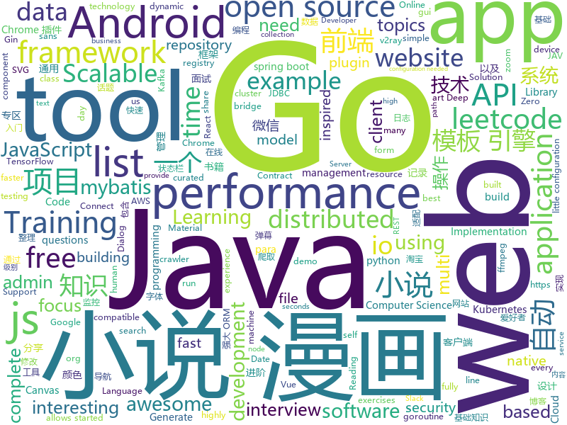

# 2019-12-17
See what the GitHub community is most excited about today.

## python
* [YouTube-Report](https://github.com/A3M4/YouTube-Report)(**38 stars today**): Generate a YouTube report from your Takeout data
* [Autoticket](https://github.com/Entromorgan/Autoticket)(**20 stars today**): 大麦网自动抢票工具
* [12306](https://github.com/testerSunshine/12306)(**235 stars today**): 12306智能刷票，订票
* [zhao](https://github.com/programthink/zhao)(**60 stars today**): 【编程随想】整理的《太子党关系网络》，专门揭露赵国的权贵
* [Real-Time-Voice-Cloning](https://github.com/CorentinJ/Real-Time-Voice-Cloning)(**229 stars today**): Clone a voice in 5 seconds to generate arbitrary speech in real-time
* [ChromeAppHeroes](https://github.com/zhaoolee/ChromeAppHeroes)(**107 stars today**): 🌈谷粒-Chrome插件英雄榜, 为优秀的Chrome插件写一本中文说明书, 让Chrome插件英雄们造福人类~ ChromePluginHeroes, Write a Chinese manual for the excellent Chrome plugin, let the Chrome plugin heroes benefit the human~
* [JAV-Scraper-and-Rename-local-files](https://github.com/junerain123/JAV-Scraper-and-Rename-local-files)(**269 stars today**): JAV影片信息整理工具，抓取元数据nfo，自定义重命名文件(夹)，下载fanart裁剪poster，为emby、kodi、极影派铺路。jav-scrapy 老司机 javbus
* [stylegan2](https://github.com/NVlabs/stylegan2)(**259 stars today**): StyleGAN2 - Official TensorFlow Implementation
* [you-get](https://github.com/soimort/you-get)(**86 stars today**): ⏬Dumb downloader that scrapes the web
* [yolact](https://github.com/dbolya/yolact)(**31 stars today**): A simple, fully convolutional model for real-time instance segmentation.
* [odoo](https://github.com/odoo/odoo)(**24 stars today**): Odoo. Open Source Apps To Grow Your Business.
* [seeprettyface-generator-wanghong](https://github.com/a312863063/seeprettyface-generator-wanghong)(**44 stars today**): 这是一个用StyleGAN训练出的网红脸生成器
* [celery](https://github.com/celery/celery)(**14 stars today**): Distributed Task Queue (development branch)
* [node-gyp](https://github.com/nodejs/node-gyp)(**8 stars today**): Node.js native addon build tool
* [models](https://github.com/tensorflow/models)(**45 stars today**): Models and examples built with TensorFlow
* [keras](https://github.com/keras-team/keras)(**28 stars today**): Deep Learning for humans
* [BMW-TensorFlow-Training-GUI](https://github.com/BMW-InnovationLab/BMW-TensorFlow-Training-GUI)(**165 stars today**): This repository allows you to get started with a gui based training a State-of-the-art Deep Learning model with little to no configuration needed! Training with TensorFlow has never been so easy.
* [andriller](https://github.com/den4uk/andriller)(**103 stars today**): Andriller - is software utility with a collection of forensic tools for smartphones. It performs read-only, forensically sound, non-destructive acquisition from Android devices.
* [BMW-YOLOv3-Training-Automation](https://github.com/BMW-InnovationLab/BMW-YOLOv3-Training-Automation)(**119 stars today**): This repository allows you to get started with training a state-of-the-art Deep Learning model with little to no configuration needed! You provide your labeled dataset and you can start the training right away and monitor it in many different ways like TensorBoard or a custom REST API and GUI. Training with YOLOv3 has never been so easy.
* [examples-of-web-crawlers](https://github.com/shengqiangzhang/examples-of-web-crawlers)(**51 stars today**): 一些非常有趣的python爬虫例子,对新手比较友好,主要爬取淘宝、天猫、微信、豆瓣、QQ等网站。(Some interesting examples of python crawlers that are friendly to beginners. )
* [EfficientDet.Pytorch](https://github.com/toandaominh1997/EfficientDet.Pytorch)(**24 stars today**): Implementation EfficientDet: Scalable and Efficient Object Detection in PyTorch
* [faceswap](https://github.com/deepfakes/faceswap)(**47 stars today**): Deepfakes Software For All
* [VIBE](https://github.com/mkocabas/VIBE)(**26 stars today**): Reference implementation of "VIBE: Video Inference for Human Body Pose and Shape Estimation"
* [iOS-DeviceSupport](https://github.com/iGhibli/iOS-DeviceSupport)(**15 stars today**): This repository holds the device support files for the iOS, and I will update it regularly.
* [NeuralNLP-NeuralClassifier](https://github.com/Tencent/NeuralNLP-NeuralClassifier)(**4 stars today**): An Open-source Neural Hierarchical Multi-label Text Classification Toolkit

## java
* [miaosha](https://github.com/qiurunze123/miaosha)(**121 stars today**): ⭐⭐⭐⭐秒杀系统设计与实现.互联网工程师进阶与分析🙋🐓
* [solo](https://github.com/88250/solo)(**34 stars today**): 🎸一款小而美的博客系统，专为程序员设计。
* [LeetCodeAnimation](https://github.com/MisterBooo/LeetCodeAnimation)(**140 stars today**): Demonstrate all the questions on LeetCode in the form of animation.（用动画的形式呈现解LeetCode题目的思路）
* [spring-boot-demo](https://github.com/xkcoding/spring-boot-demo)(**29 stars today**): spring boot demo 是一个用来深度学习并实战 spring boot 的项目，目前总共包含 63 个集成demo，已经完成 52 个。 该项目已成功集成 actuator(监控)、admin(可视化监控)、logback(日志)、aopLog(通过AOP记录web请求日志)、统一异常处理(json级别和页面级别)、freemarker(模板引擎)、thymeleaf(模板引擎)、Beetl(模板引擎)、Enjoy(模板引擎)、JdbcTemplate(通用JDBC操作数据库)、JPA(强大的ORM框架)、mybatis(强大的ORM框架)、通用Mapper(快速操作Mybatis)、PageHelper(通用的Mybatis分页插件)、mybatis-plus(快速操作M…
* [shopping-management-system](https://github.com/zhanglei-workspace/shopping-management-system)(**26 stars today**): 该项目为多个小项目的集合（持续更新中...）。内容类似淘宝、京东等网购管理系统以及图书管理、超市管理等系统。目的在于便于Java初级爱好者在学习完某一部分Java知识后有一个合适的项目锻炼、运用所学知识，完善知识体系。适用人群：Java基础到入门的爱好者。
* [antlr4](https://github.com/antlr/antlr4)(**8 stars today**): ANTLR (ANother Tool for Language Recognition) is a powerful parser generator for reading, processing, executing, or translating structured text or binary files.
* [shiro](https://github.com/apache/shiro)(**2 stars today**): Mirror of Apache Shiro
* [sofa-boot](https://github.com/sofastack/sofa-boot)(**10 stars today**): SOFABoot is a framework that enhances Spring Boot and fully compatible with it, provides readiness check, class isolation, etc.
* [spring-security](https://github.com/spring-projects/spring-security)(**9 stars today**): Spring Security
* [soul](https://github.com/Dromara/soul)(**22 stars today**): High-Performance Java API Gateway
* [kubernetes-plugin](https://github.com/jenkinsci/kubernetes-plugin)(**2 stars today**): Jenkins plugin to run dynamic agents in a Kubernetes/Docker environment
* [kafka-connect-jdbc](https://github.com/confluentinc/kafka-connect-jdbc)(**0 stars today**): Kafka Connect connector for JDBC-compatible databases
* [elasticsearch](https://github.com/elastic/elasticsearch)(**24 stars today**): Open Source, Distributed, RESTful Search Engine
* [light-4j](https://github.com/networknt/light-4j)(**7 stars today**): A fast, lightweight and more productive microservices framework
* [flink](https://github.com/apache/flink)(**49 stars today**): Apache Flink
* [AndroidTutorialForBeginners](https://github.com/hussien89aa/AndroidTutorialForBeginners)(**3 stars today**): Step by step to build Android apps using Android Studio
* [Interview-Questions](https://github.com/rishabh115/Interview-Questions)(**3 stars today**): Most comprehensive list📋of tech interview questions📘of companies scraped from Geeksforgeeks, CareerCup and Glassdoor.
* [skywalking](https://github.com/apache/skywalking)(**38 stars today**): APM, Application Performance Monitoring System
* [spring-cloud-netflix](https://github.com/spring-cloud/spring-cloud-netflix)(**3 stars today**): Integration with Netflix OSS components
* [schema-registry](https://github.com/confluentinc/schema-registry)(**2 stars today**): Confluent Schema Registry for Kafka
* [CS-Notes](https://github.com/CyC2018/CS-Notes)(**94 stars today**): 📚技术面试必备基础知识、Leetcode、计算机操作系统、计算机网络、系统设计、Java、Python、C++
* [fiction_house](https://github.com/201206030/fiction_house)(**63 stars today**): 小说精品屋是一个多平台（web、安卓app、微信小程序）、功能完善的小说弹幕网站，包含精品小说专区、轻小说专区和漫画专区。包括小说/漫画分类、小说/漫画搜索、小说/漫画排行、完本小说/漫画、小说/漫画评分、小说/漫画在线阅读、小说/漫画书架、小说/漫画阅读记录、小说下载、小说弹幕、小说/漫画自动爬取、小说内容自动分享到微博、邮件自动推广、链接自动推送到百度搜索引擎等功能。
* [kafdrop](https://github.com/obsidiandynamics/kafdrop)(**13 stars today**): Kafka Web UI
* [MaterialDialog-Android](https://github.com/PatilShreyas/MaterialDialog-Android)(**40 stars today**): 📱Android Library to implement animated,😍beautiful,🎨stylish Material Dialog in android apps easily.
* [ImmersionBar](https://github.com/gyf-dev/ImmersionBar)(**14 stars today**): android 4.4以上沉浸式状态栏和沉浸式导航栏管理，适配横竖屏切换、刘海屏、软键盘弹出等问题，可以修改状态栏字体颜色和导航栏图标颜色，以及不可修改字体颜色手机的适配，适用于Activity、Fragment、DialogFragment、Dialog，PopupWindow，一句代码轻松实现，以及对bar的其他设置，详见README。简书请参考：http://www.jianshu.com/p/2a884e211a62

## unknown
* [architect-awesome](https://github.com/xingshaocheng/architect-awesome)(**167 stars today**): 后端架构师技术图谱
* [awesome](https://github.com/sindresorhus/awesome)(**151 stars today**): 😎Awesome lists about all kinds of interesting topics
* [computer-science](https://github.com/ossu/computer-science)(**93 stars today**): 🎓Path to a free self-taught education in Computer Science!
* [awesome-java-books](https://github.com/sorenduan/awesome-java-books)(**46 stars today**): Java开发者技术书籍大全 - Java入门书籍，Java基础及进阶书籍，框架与中间件，架构设计，设计模式，数学与算法，JVM周边语言，项目管理&领导力&流程，职业素养与个人成长，格局与视野，面试参考书等。
* [Specs](https://github.com/CocoaPods/Specs)(**4 stars today**): The CocoaPods Master Repo
* [Windows-10-Exploitation](https://github.com/peleghd/Windows-10-Exploitation)(**36 stars today**): 
* [awesome-standalones](https://github.com/davatron5000/awesome-standalones)(**56 stars today**): A curated list of awesome framework-agnostic standalone web components
* [clmystery](https://github.com/veltman/clmystery)(**48 stars today**): A command-line murder mystery
* [CKAD-exercises](https://github.com/dgkanatsios/CKAD-exercises)(**12 stars today**): A set of exercises to prepare for Certified Kubernetes Application Developer exam by Cloud Native Computing Foundation
* [stanford-cs-229-machine-learning](https://github.com/afshinea/stanford-cs-229-machine-learning)(**15 stars today**): VIP cheatsheets for Stanford's CS 229 Machine Learning
* [coding-interview-university](https://github.com/jwasham/coding-interview-university)(**48 stars today**): A complete computer science study plan to become a software engineer.
* [awesome-shodan-queries](https://github.com/jakejarvis/awesome-shodan-queries)(**24 stars today**): 🔍A collection of interesting, funny, and depressing search queries to plug into https://shodan.io/👩‍💻
* [eng-practices](https://github.com/google/eng-practices)(**24 stars today**): Google's Engineering Practices documentation
* [vagas](https://github.com/frontendbr/vagas)(**6 stars today**): 🔬Espaço para divulgação de vagas para front-enders.
* [1024app-android](https://github.com/yuuwill/1024app-android)(**22 stars today**): 草榴官方客户端，小草客户端，Android
* [awesome-postgres](https://github.com/dhamaniasad/awesome-postgres)(**11 stars today**): A curated list of awesome PostgreSQL software, libraries, tools and resources, inspired by awesome-mysql
* [evil-man](https://github.com/CNwoman-bot/evil-man)(**41 stars today**): 
* [AZ-300-MicrosoftAzureArchitectTechnologies](https://github.com/MicrosoftLearning/AZ-300-MicrosoftAzureArchitectTechnologies)(**4 stars today**): 
* [amundsen](https://github.com/lyft/amundsen)(**6 stars today**): Repository for the Amundsen project
* [Flutter-Course-Resources](https://github.com/londonappbrewery/Flutter-Course-Resources)(**9 stars today**): Learn to Code While Building Apps - The Complete Flutter Development Bootcamp
* [unmaintainable-code](https://github.com/Droogans/unmaintainable-code)(**3 stars today**): A more maintainable, easier to share version of the infamous http://mindprod.com/jgloss/unmain.html
* [Java-Interview](https://github.com/gzc426/Java-Interview)(**35 stars today**): Java 面试必会 直通BAT
* [OnJava8](https://github.com/LingCoder/OnJava8)(**35 stars today**): 《On Java 8》中文版，又名《Java编程思想》 第5版
* [chinese-independent-developer](https://github.com/1c7/chinese-independent-developer)(**49 stars today**): 👩🏿‍💻👨🏾‍💻👩🏼‍💻👨🏽‍💻👩🏻‍💻中国独立开发者项目列表 -- 分享大家都在做什么
* [Git-Commands](https://github.com/joshnh/Git-Commands)(**5 stars today**): A list of commonly used Git commands

## javascript
* [joplin](https://github.com/laurent22/joplin)(**222 stars today**): Joplin - an open source note taking and to-do application with synchronization capabilities for Windows, macOS, Linux, Android and iOS. Forum: https://discourse.joplinapp.org/
* [json-server](https://github.com/typicode/json-server)(**30 stars today**): Get a full fake REST API with zero coding in less than 30 seconds (seriously)
* [react-router](https://github.com/ReactTraining/react-router)(**26 stars today**): Declarative routing for React
* [junior-recruit-scheduler](https://github.com/jojoldu/junior-recruit-scheduler)(**15 stars today**): 주니어 개발자 채용 정보
* [daterangepicker](https://github.com/dangrossman/daterangepicker)(**5 stars today**): JavaScript Date Range, Date and Time Picker Component
* [iDataV](https://github.com/yyhsong/iDataV)(**16 stars today**): 大屏数据可视化 Big screen data visualization demo
* [leetcode](https://github.com/azl397985856/leetcode)(**55 stars today**): LeetCode Solutions: A Record of My Problem Solving Journey.( leetcode题解，记录自己的leetcode解题之路。)
* [front-end-interview-handbook](https://github.com/yangshun/front-end-interview-handbook)(**38 stars today**): 🕸Almost complete answers to "Front-end Job Interview Questions" which you can use to interview potential candidates, test yourself or completely ignore
* [clean-code-javascript](https://github.com/ryanmcdermott/clean-code-javascript)(**152 stars today**): 🛁Clean Code concepts adapted for JavaScript
* [fx](https://github.com/antonmedv/fx)(**156 stars today**): Command-line tool and terminal JSON viewer🔥
* [fabric.js](https://github.com/fabricjs/fabric.js)(**47 stars today**): Javascript Canvas Library, SVG-to-Canvas (& canvas-to-SVG) Parser
* [jest](https://github.com/facebook/jest)(**21 stars today**): Delightful JavaScript Testing.
* [incubator-superset](https://github.com/apache/incubator-superset)(**44 stars today**): Apache Superset (incubating) is a modern, enterprise-ready business intelligence web application
* [openzeppelin-contracts](https://github.com/OpenZeppelin/openzeppelin-contracts)(**4 stars today**): OpenZeppelin Contracts is a library for secure smart contract development.
* [todomvc](https://github.com/tastejs/todomvc)(**23 stars today**): Helping you select an MV* framework - Todo apps for React.js, Ember.js, Angular, and many more
* [leonsans](https://github.com/cmiscm/leonsans)(**43 stars today**): Leon Sans is a geometric sans-serif typeface made with code in 2019 by Jongmin Kim.
* [vue-chartjs](https://github.com/apertureless/vue-chartjs)(**14 stars today**): 📊Vue.js wrapper for Chart.js
* [react-table](https://github.com/tannerlinsley/react-table)(**20 stars today**): ⚛️Hooks for building fast and extendable tables and datagrids for React
* [renovate](https://github.com/renovatebot/renovate)(**9 stars today**): Universal dependency update tool that fits into your workflows.
* [axios](https://github.com/axios/axios)(**54 stars today**): Promise based HTTP client for the browser and node.js
* [zigbee2mqtt](https://github.com/Koenkk/zigbee2mqtt)(**10 stars today**): Zigbee🐝to MQTT bridge🌉, get rid of your proprietary Zigbee bridges🔨
* [react-boilerplate](https://github.com/react-boilerplate/react-boilerplate)(**16 stars today**): 🔥A highly scalable, offline-first foundation with the best developer experience and a focus on performance and best practices.
* [aframe](https://github.com/aframevr/aframe)(**8 stars today**): 🅰️web framework for building virtual reality experiences.
* [Blog](https://github.com/ljianshu/Blog)(**12 stars today**): 关注基础知识，打造优质前端博客，公众号[前端工匠]的作者
* [Vue.Draggable](https://github.com/SortableJS/Vue.Draggable)(**13 stars today**): Vue drag-and-drop component based on Sortable.js

## html
* [blaze](https://github.com/blenderskool/blaze)(**39 stars today**): ⚡ File sharing progressive web app built using WebRTC and WebSockets
* [blog](https://github.com/lifesinger/blog)(**40 stars today**): 岁月如歌
* [stisla](https://github.com/stisla/stisla)(**9 stars today**): Free Bootstrap Admin Template
* [REKCARC-TSC-UHT](https://github.com/PKUanonym/REKCARC-TSC-UHT)(**15 stars today**): 清华大学计算机系课程攻略 Guidance for courses in Department of Computer Science and Technology, Tsinghua University
* [django-DefectDojo](https://github.com/DefectDojo/django-DefectDojo)(**4 stars today**): DefectDojo is an open-source application vulnerability correlation and security orchestration tool.
* [free-for-dev](https://github.com/ripienaar/free-for-dev)(**49 stars today**): A list of SaaS, PaaS and IaaS offerings that have free tiers of interest to devops and infradev
* [meu-primeiro-jogo-multiplayer](https://github.com/filipedeschamps/meu-primeiro-jogo-multiplayer)(**3 stars today**): Um jogo multiplayer bastante simples para testarmos o Socket.io
* [quickstart-js](https://github.com/firebase/quickstart-js)(**4 stars today**): Firebase Quickstart Samples for Web
* [tiny-slider](https://github.com/ganlanyuan/tiny-slider)(**9 stars today**): Vanilla javascript slider for all purposes.
* [cypress-example-kitchensink](https://github.com/cypress-io/cypress-example-kitchensink)(**3 stars today**): This is an example app used to showcase Cypress.io testing.
* [JavaScript30](https://github.com/wesbos/JavaScript30)(**10 stars today**): 30 Day Vanilla JS Challenge
* [compat-table](https://github.com/kangax/compat-table)(**5 stars today**): ECMAScript 5/6/7 compatibility tables
* [ecma262](https://github.com/tc39/ecma262)(**17 stars today**): Status, process, and documents for ECMA-262
* [machine-learning-systems-design](https://github.com/chiphuyen/machine-learning-systems-design)(**37 stars today**): A booklet on machine learning systems design with exercises
* [frontend_daily_question](https://github.com/sanyuan0704/frontend_daily_question)(**29 stars today**): 前端每日一问，积累前端核心知识，全面进阶高级前端。
* [ctf-wiki](https://github.com/ctf-wiki/ctf-wiki)(**8 stars today**): CTF Wiki Online. Come and join us, we need you!
* [v2-ui](https://github.com/sprov065/v2-ui)(**7 stars today**): 支持多协议多用户的 v2ray 面板，Support multi-protocol multi-user v2ray panel
* [TheHive](https://github.com/TheHive-Project/TheHive)(**6 stars today**): TheHive: a Scalable, Open Source and Free Security Incident Response Platform
* [krabby](https://github.com/alexherbo2/krabby)(**13 stars today**): A keyboard interface to the web, inspired by Kakoune
* [node-fluent-ffmpeg](https://github.com/fluent-ffmpeg/node-fluent-ffmpeg)(**8 stars today**): A fluent API to FFMPEG (http://www.ffmpeg.org)
* [learn-to-send-email-via-google-script-html-no-server](https://github.com/dwyl/learn-to-send-email-via-google-script-html-no-server)(**2 stars today**): ✉️An Example of using an HTML form (e.g: "Contact Us" on a website) to send Email without a Backend Server (using a Google Script) perfect for static websites that need to collect data.
* [keycloak-documentation](https://github.com/keycloak/keycloak-documentation)(**1 stars today**): 
* [coreui-free-bootstrap-admin-template](https://github.com/coreui/coreui-free-bootstrap-admin-template)(**6 stars today**): CoreUI is free bootstrap admin template
* [a11yproject.com](https://github.com/a11yproject/a11yproject.com)(**3 stars today**): A community–driven effort to make web accessibility easier.
* [hugo-academic](https://github.com/gcushen/hugo-academic)(**7 stars today**): 📝The website builder for Hugo. Build and deploy a beautiful website in minutes!

## go
* [terraform-provider-azurerm](https://github.com/terraform-providers/terraform-provider-azurerm)(**10 stars today**): Terraform provider for Azure Resource Manager
* [nebula](https://github.com/slackhq/nebula)(**194 stars today**): A scalable overlay networking tool with a focus on performance, simplicity and security
* [BaiduPCS-Go](https://github.com/iikira/BaiduPCS-Go)(**98 stars today**): 百度网盘客户端 - Go语言编写
* [service](https://github.com/kardianos/service)(**19 stars today**): Run go programs as a service on major platforms.
* [gotraining](https://github.com/ardanlabs/gotraining)(**38 stars today**): Go Training Class Material :
* [consul](https://github.com/hashicorp/consul)(**5 stars today**): Consul is a distributed, highly available, and data center aware solution to connect and configure applications across dynamic, distributed infrastructure.
* [aws-sdk-go](https://github.com/aws/aws-sdk-go)(**5 stars today**): AWS SDK for the Go programming language.
* [fasthttp](https://github.com/valyala/fasthttp)(**16 stars today**): Fast HTTP package for Go. Tuned for high performance. Zero memory allocations in hot paths. Up to 10x faster than net/http
* [colly](https://github.com/gocolly/colly)(**28 stars today**): Elegant Scraper and Crawler Framework for Golang
* [harbor](https://github.com/goharbor/harbor)(**25 stars today**): An open source trusted cloud native registry project that stores, signs, and scans content.
* [night-reading-go](https://github.com/developer-learning/night-reading-go)(**21 stars today**): Night-Reading-Go《Go 夜读》 > Share the related technical topics of Go every week through zoom online live broadcast, every day on the WeChat/Slack to communicate programming technology topics. 每周通过 zoom 在线直播的方式分享 Go 相关的技术话题，每天大家在微信/Slack 上及时沟通交流编程技术话题。
* [ants](https://github.com/panjf2000/ants)(**27 stars today**): 🐜🐜🐜ants is a high-performance and low-cost goroutine pool in Go, inspired by fasthttp./ ants 是一个高性能且低损耗的 goroutine 池。
* [elastic](https://github.com/olivere/elastic)(**10 stars today**): Elasticsearch client for Go.
* [gin](https://github.com/gin-gonic/gin)(**37 stars today**): Gin is a HTTP web framework written in Go (Golang). It features a Martini-like API with much better performance -- up to 40 times faster. If you need smashing performance, get yourself some Gin.
* [sqlc](https://github.com/kyleconroy/sqlc)(**127 stars today**): Generate type safe Go from SQL
* [go](https://github.com/golang/go)(**66 stars today**): The Go programming language
* [go-micro](https://github.com/micro/go-micro)(**19 stars today**): A Go microservices development framework
* [mongo-go-driver](https://github.com/mongodb/mongo-go-driver)(**14 stars today**): The Go driver for MongoDB
* [origin](https://github.com/openshift/origin)(**5 stars today**): The self-managing, auto-upgrading, Kubernetes distribution for everyone
* [cluster-api](https://github.com/kubernetes-sigs/cluster-api)(**3 stars today**): Home for the Cluster Management API work, a subproject of sig-cluster-lifecycle
* [logrus](https://github.com/sirupsen/logrus)(**10 stars today**): Structured, pluggable logging for Go.
* [terraform-provider-aws](https://github.com/terraform-providers/terraform-provider-aws)(**5 stars today**): Terraform AWS provider
* [graphql-go](https://github.com/graph-gophers/graphql-go)(**7 stars today**): GraphQL server with a focus on ease of use
* [google-cloud-go](https://github.com/googleapis/google-cloud-go)(**6 stars today**): Google Cloud Client Libraries for Go.
* [vault](https://github.com/hashicorp/vault)(**6 stars today**): A tool for secrets management, encryption as a service, and privileged access management

## WordCloud

