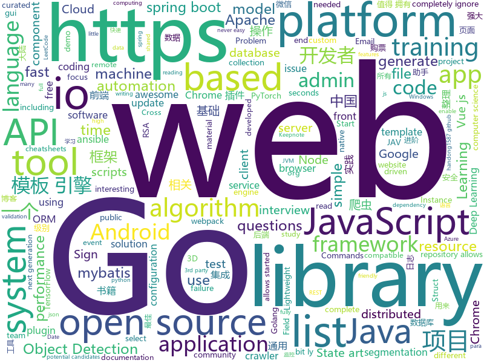

# 2019-12-18
See what the GitHub community is most excited about today.

## python
* [12306](https://github.com/testerSunshine/12306)(**307 stars today**): 12306智能刷票，订票
* [coding-problems](https://github.com/MTrajK/coding-problems)(**121 stars today**): Solutions for various coding/algorithmic problems and many useful resources for learning algorithms and data structures
* [you-get](https://github.com/soimort/you-get)(**142 stars today**): ⏬Dumb downloader that scrapes the web
* [transformers](https://github.com/huggingface/transformers)(**182 stars today**): 🤗Transformers: State-of-the-art Natural Language Processing for TensorFlow 2.0 and PyTorch.
* [Real-Time-Voice-Cloning](https://github.com/CorentinJ/Real-Time-Voice-Cloning)(**163 stars today**): Clone a voice in 5 seconds to generate arbitrary speech in real-time
* [yolact](https://github.com/dbolya/yolact)(**75 stars today**): A simple, fully convolutional model for real-time instance segmentation.
* [JAV-Scraper-and-Rename-local-files](https://github.com/junerain123/JAV-Scraper-and-Rename-local-files)(**180 stars today**): JAV影片信息整理工具，抓取元数据nfo，自定义重命名文件(夹)，下载fanart裁剪poster，为emby、kodi、极影派铺路。jav-scrapy 老司机 javbus
* [ChromeAppHeroes](https://github.com/zhaoolee/ChromeAppHeroes)(**91 stars today**): 🌈谷粒-Chrome插件英雄榜, 为优秀的Chrome插件写一本中文说明书, 让Chrome插件英雄们造福人类~ ChromePluginHeroes, Write a Chinese manual for the excellent Chrome plugin, let the Chrome plugin heroes benefit the human~
* [seeprettyface-generator-wanghong](https://github.com/a312863063/seeprettyface-generator-wanghong)(**103 stars today**): 这是一个用StyleGAN训练出的网红脸生成器
* [Autoticket](https://github.com/Entromorgan/Autoticket)(**63 stars today**): 大麦网自动抢票工具
* [py12306](https://github.com/pjialin/py12306)(**80 stars today**): 🚂12306 购票助手，支持集群，多账号，多任务购票以及 Web 页面管理
* [detectron2](https://github.com/facebookresearch/detectron2)(**57 stars today**): Detectron2 is FAIR's next-generation research platform for object detection and segmentation.
* [ansible](https://github.com/ansible/ansible)(**24 stars today**): Ansible is a radically simple IT automation platform that makes your applications and systems easier to deploy. Avoid writing scripts or custom code to deploy and update your applications — automate in a language that approaches plain English, using SSH, with no agents to install on remote systems. https://docs.ansible.com/ansible/
* [YouTube-Report](https://github.com/A3M4/YouTube-Report)(**87 stars today**): 📊Generate a personal YouTube report from your Google Takeout data
* [BMW-TensorFlow-Training-GUI](https://github.com/BMW-InnovationLab/BMW-TensorFlow-Training-GUI)(**100 stars today**): This repository allows you to get started with a gui based training a State-of-the-art Deep Learning model with little to no configuration needed! Training with TensorFlow has never been so easy.
* [zhao](https://github.com/programthink/zhao)(**43 stars today**): 【编程随想】整理的《太子党关系网络》，专门揭露赵国的权贵
* [andriller](https://github.com/den4uk/andriller)(**70 stars today**): Andriller - is software utility with a collection of forensic tools for smartphones. It performs read-only, forensically sound, non-destructive acquisition from Android devices.
* [odoo](https://github.com/odoo/odoo)(**24 stars today**): Odoo. Open Source Apps To Grow Your Business.
* [maskrcnn-benchmark](https://github.com/facebookresearch/maskrcnn-benchmark)(**11 stars today**): Fast, modular reference implementation of Instance Segmentation and Object Detection algorithms in PyTorch.
* [albert_vi](https://github.com/ngoanpv/albert_vi)(**29 stars today**): ALBERT for Vietnamese
* [examples-of-web-crawlers](https://github.com/shengqiangzhang/examples-of-web-crawlers)(**43 stars today**): 一些非常有趣的python爬虫例子,对新手比较友好,主要爬取淘宝、天猫、微信、豆瓣、QQ等网站。(Some interesting examples of python crawlers that are friendly to beginners. )
* [ihatemoney](https://github.com/spiral-project/ihatemoney)(**8 stars today**): A simple shared budget manager web application
* [trt_pose](https://github.com/NVIDIA-AI-IOT/trt_pose)(**16 stars today**): Real-time pose estimation accelerated with NVIDIA TensorRT
* [12306_code_server](https://github.com/YinAoXiong/12306_code_server)(**13 stars today**): 该仓库用于构建自托管的12306验证码识别服务器
* [BMW-YOLOv3-Training-Automation](https://github.com/BMW-InnovationLab/BMW-YOLOv3-Training-Automation)(**83 stars today**): This repository allows you to get started with training a state-of-the-art Deep Learning model with little to no configuration needed! You provide your labeled dataset and you can start the training right away and monitor it in many different ways like TensorBoard or a custom REST API and GUI. Training with YOLOv3 has never been so easy.

## java
* [spring-boot-demo](https://github.com/xkcoding/spring-boot-demo)(**37 stars today**): spring boot demo 是一个用来深度学习并实战 spring boot 的项目，目前总共包含 63 个集成demo，已经完成 52 个。 该项目已成功集成 actuator(监控)、admin(可视化监控)、logback(日志)、aopLog(通过AOP记录web请求日志)、统一异常处理(json级别和页面级别)、freemarker(模板引擎)、thymeleaf(模板引擎)、Beetl(模板引擎)、Enjoy(模板引擎)、JdbcTemplate(通用JDBC操作数据库)、JPA(强大的ORM框架)、mybatis(强大的ORM框架)、通用Mapper(快速操作Mybatis)、PageHelper(通用的Mybatis分页插件)、mybatis-plus(快速操作M…
* [LeetCodeAnimation](https://github.com/MisterBooo/LeetCodeAnimation)(**113 stars today**): Demonstrate all the questions on LeetCode in the form of animation.（用动画的形式呈现解LeetCode题目的思路）
* [miaosha](https://github.com/qiurunze123/miaosha)(**141 stars today**): ⭐⭐⭐⭐秒杀系统设计与实现.互联网工程师进阶与分析🙋🐓
* [Alink](https://github.com/alibaba/Alink)(**59 stars today**): Alink is the Machine Learning algorithm platform based on Flink, developed by the PAI team of Alibaba computing platform.
* [DataX](https://github.com/alibaba/DataX)(**19 stars today**): 
* [selenium](https://github.com/SeleniumHQ/selenium)(**14 stars today**): A browser automation framework and ecosystem.
* [cas](https://github.com/apereo/cas)(**10 stars today**): Apereo CAS - Enterprise Single Sign On for all earthlings and beyond.
* [RxJava](https://github.com/ReactiveX/RxJava)(**33 stars today**): RxJava – Reactive Extensions for the JVM – a library for composing asynchronous and event-based programs using observable sequences for the Java VM.
* [spring-boot](https://github.com/spring-projects/spring-boot)(**51 stars today**): Spring Boot
* [debezium](https://github.com/debezium/debezium)(**14 stars today**): Change data capture for a variety of databases. https://debezium.io Please log issues in our JIRA at https://issues.jboss.org/projects/DBZ/issues
* [quarkus](https://github.com/quarkusio/quarkus)(**16 stars today**): Quarkus: Supersonic Subatomic Java.
* [tinker](https://github.com/Tencent/tinker)(**10 stars today**): Tinker is a hot-fix solution library for Android, it supports dex, library and resources update without reinstall apk.
* [MinecraftForge](https://github.com/MinecraftForge/MinecraftForge)(**6 stars today**): Modifications to the Minecraft base files to assist in compatibility between mods.
* [Hystrix](https://github.com/Netflix/Hystrix)(**21 stars today**): Hystrix is a latency and fault tolerance library designed to isolate points of access to remote systems, services and 3rd party libraries, stop cascading failure and enable resilience in complex distributed systems where failure is inevitable.
* [DoraemonKit](https://github.com/didi/DoraemonKit)(**109 stars today**): 简称 "DoKit" 。一款功能齐全的客户端（ iOS 、Android、微信小程序 ）研发助手，你值得拥有。
* [springboot-learning-example](https://github.com/JeffLi1993/springboot-learning-example)(**18 stars today**): spring boot 实践学习案例，是 spring boot 初学者及核心技术巩固的最佳实践。另外写博客，用 OpenWrite。
* [k-9](https://github.com/k9mail/k-9)(**5 stars today**): K-9 Mail – An Email app for Android
* [Java](https://github.com/TheAlgorithms/Java)(**44 stars today**): All Algorithms implemented in Java
* [zipkin](https://github.com/openzipkin/zipkin)(**14 stars today**): Zipkin is a distributed tracing system
* [light-4j](https://github.com/networknt/light-4j)(**10 stars today**): A fast, lightweight and more productive microservices framework
* [spring-kafka](https://github.com/spring-projects/spring-kafka)(**4 stars today**): Provides Familiar Spring Abstractions for Apache Kafka
* [ballerina-lang](https://github.com/ballerina-platform/ballerina-lang)(**7 stars today**): The Ballerina Programming Language
* [ignite](https://github.com/apache/ignite)(**3 stars today**): Mirror of Apache Ignite
* [shiro](https://github.com/apache/shiro)(**6 stars today**): Mirror of Apache Shiro
* [bigbluebutton](https://github.com/bigbluebutton/bigbluebutton)(**11 stars today**): Complete open source web conferencing system.

## unknown
* [architect-awesome](https://github.com/xingshaocheng/architect-awesome)(**455 stars today**): 后端架构师技术图谱
* [awesome](https://github.com/sindresorhus/awesome)(**248 stars today**): 😎Awesome lists about all kinds of interesting topics
* [proposals](https://github.com/tc39/proposals)(**37 stars today**): Tracking ECMAScript Proposals
* [AZ-103-MicrosoftAzureAdministrator](https://github.com/MicrosoftLearning/AZ-103-MicrosoftAzureAdministrator)(**5 stars today**): AZ-103: Microsoft Azure Administrator
* [the-book-of-secret-knowledge](https://github.com/trimstray/the-book-of-secret-knowledge)(**36 stars today**): A collection of inspiring lists, manuals, cheatsheets, blogs, hacks, one-liners, cli/web tools and more.
* [conference-school-notes](https://github.com/RobertTLange/conference-school-notes)(**30 stars today**): Collected Conference & Summer School Notes
* [awesome-object-detection](https://github.com/amusi/awesome-object-detection)(**22 stars today**): Awesome Object Detection based on handong1587 github: https://handong1587.github.io/deep_learning/2015/10/09/object-detection.html
* [awesome-standalones](https://github.com/davatron5000/awesome-standalones)(**40 stars today**): A curated list of awesome framework-agnostic standalone web components
* [awesome-java-books](https://github.com/sorenduan/awesome-java-books)(**104 stars today**): Java开发者技术书籍大全 - Java入门书籍，Java基础及进阶书籍，框架与中间件，架构设计，设计模式，数学与算法，JVM周边语言，项目管理&领导力&流程，职业素养与个人成长，格局与视野，面试参考书等。
* [stanford-cs-229-machine-learning](https://github.com/afshinea/stanford-cs-229-machine-learning)(**18 stars today**): VIP cheatsheets for Stanford's CS 229 Machine Learning
* [14th](https://github.com/d2forum/14th)(**476 stars today**): 第十四届D2前端技术论坛
* [chinese-independent-developer](https://github.com/1c7/chinese-independent-developer)(**39 stars today**): 👩🏿‍💻👨🏾‍💻👩🏼‍💻👨🏽‍💻👩🏻‍💻中国独立开发者项目列表 -- 分享大家都在做什么
* [vagas](https://github.com/frontendbr/vagas)(**4 stars today**): 🔬Espaço para divulgação de vagas para front-enders.
* [papers_we_read](https://github.com/vlgiitr/papers_we_read)(**16 stars today**): Summaries of the papers that are discussed by VLG
* [CKAD-exercises](https://github.com/dgkanatsios/CKAD-exercises)(**11 stars today**): A set of exercises to prepare for Certified Kubernetes Application Developer exam by Cloud Native Computing Foundation
* [sec-chart](https://github.com/SecWiki/sec-chart)(**23 stars today**): 安全思维导图集合
* [reverse-interview](https://github.com/viraptor/reverse-interview)(**18 stars today**): Questions to ask the company during your interview
* [coding-interview-university](https://github.com/jwasham/coding-interview-university)(**68 stars today**): A complete computer science study plan to become a software engineer.
* [eng-practices](https://github.com/google/eng-practices)(**20 stars today**): Google's Engineering Practices documentation
* [papers-we-love](https://github.com/papers-we-love/papers-we-love)(**22 stars today**): Papers from the computer science community to read and discuss.
* [3y](https://github.com/ZhongFuCheng3y/3y)(**45 stars today**): 📓从Java基础、JavaWeb基础到常用的框架再到面试题都有完整的教程，几乎涵盖了Java后端必备的知识点
* [hosts](https://github.com/googlehosts/hosts)(**24 stars today**): 镜像：https://coding.net/u/scaffrey/p/hosts/git
* [Java-Interview](https://github.com/gzc426/Java-Interview)(**17 stars today**): Java 面试必会 直通BAT
* [show-me-the-code](https://github.com/Yixiaohan/show-me-the-code)(**10 stars today**): Python 练习册，每天一个小程序
* [altium-library](https://github.com/issus/altium-library)(**9 stars today**): Open source Altium Database Library with over 100,000 high quality components and full 3d models.

## javascript
* [nuxt.js](https://github.com/nuxt/nuxt.js)(**37 stars today**): The Vue.js Framework
* [joplin](https://github.com/laurent22/joplin)(**140 stars today**): Joplin - an open source note taking and to-do application with synchronization capabilities for Windows, macOS, Linux, Android and iOS. Forum: https://discourse.joplinapp.org/
* [front-end-interview-handbook](https://github.com/yangshun/front-end-interview-handbook)(**45 stars today**): 🕸Almost complete answers to "Front-end Job Interview Questions" which you can use to interview potential candidates, test yourself or completely ignore
* [clean-code-javascript](https://github.com/ryanmcdermott/clean-code-javascript)(**82 stars today**): 🛁Clean Code concepts adapted for JavaScript
* [webpack-box](https://github.com/luoxue-victor/webpack-box)(**56 stars today**): 我有一个梦想，就是将所有webpack相关的最佳实践都集成在这里，本项目长期维护/更新，有兴趣的同学可以一起成为维护者。issue下面TODO标签是接下来要做的事情，欢迎所有人都可以来提，让我们共创 webpack 工厂！
* [axios](https://github.com/axios/axios)(**46 stars today**): Promise based HTTP client for the browser and node.js
* [svelte](https://github.com/sveltejs/svelte)(**84 stars today**): Cybernetically enhanced web apps
* [gatsby](https://github.com/gatsbyjs/gatsby)(**31 stars today**): Build blazing fast, modern apps and websites with React
* [algorithm-visualizer](https://github.com/algorithm-visualizer/algorithm-visualizer)(**54 stars today**): 🎆Interactive Online Platform that Visualizes Algorithms from Code
* [puppeteer](https://github.com/puppeteer/puppeteer)(**59 stars today**): Headless Chrome Node.js API
* [renovate](https://github.com/renovatebot/renovate)(**7 stars today**): Universal dependency update tool that fits into your workflows.
* [json-server](https://github.com/typicode/json-server)(**35 stars today**): Get a full fake REST API with zero coding in less than 30 seconds (seriously)
* [vue-chartjs](https://github.com/apertureless/vue-chartjs)(**11 stars today**): 📊Vue.js wrapper for Chart.js
* [You-Dont-Need-Lodash-Underscore](https://github.com/you-dont-need/You-Dont-Need-Lodash-Underscore)(**16 stars today**): List of JavaScript methods which you can use natively + ESLint Plugin
* [shri-2020-task-1](https://github.com/yndx-shri-reviewer/shri-2020-task-1)(**3 stars today**): Задание 1. Реализуйте дизайн-систему — ШРИ, Москва, 2020
* [Blog](https://github.com/ljianshu/Blog)(**16 stars today**): 关注基础知识，打造优质前端博客，公众号[前端工匠]的作者
* [vue-test-utils](https://github.com/vuejs/vue-test-utils)(**4 stars today**): 🔬Utilities for testing Vue components
* [monaco-editor](https://github.com/microsoft/monaco-editor)(**28 stars today**): A browser based code editor
* [chinese-poetry](https://github.com/chinese-poetry/chinese-poetry)(**40 stars today**): 最全中华古诗词数据库, 唐宋两朝近一万四千古诗人, 接近5.5万首唐诗加26万宋诗. 两宋时期1564位词人，21050首词。
* [svgo](https://github.com/svg/svgo)(**8 stars today**): 🐯Node.js tool for optimizing SVG files
* [vue-multiselect](https://github.com/shentao/vue-multiselect)(**4 stars today**): Universal select/multiselect/tagging component for Vue.js
* [appium](https://github.com/appium/appium)(**10 stars today**): 📱Automation for iOS, Android, and Windows Apps.
* [daterangepicker](https://github.com/dangrossman/daterangepicker)(**9 stars today**): JavaScript Date Range, Date and Time Picker Component
* [RSSHub](https://github.com/DIYgod/RSSHub)(**17 stars today**): 🍰万物皆可 RSS
* [cgm-remote-monitor](https://github.com/nightscout/cgm-remote-monitor)(**4 stars today**): nightscout web monitor

## html
* [free-for-dev](https://github.com/ripienaar/free-for-dev)(**65 stars today**): A list of SaaS, PaaS and IaaS offerings that have free tiers of interest to devops and infradev
* [stisla](https://github.com/stisla/stisla)(**10 stars today**): Free Bootstrap Admin Template
* [blaze](https://github.com/blenderskool/blaze)(**32 stars today**): ⚡ File sharing progressive web app built using WebRTC and WebSockets
* [Crawler_Illegal_Cases_In_China](https://github.com/HiddenStrawberry/Crawler_Illegal_Cases_In_China)(**25 stars today**): Collection of China illegal cases about web crawler 本项目用来整理所有中国大陆爬虫开发者涉诉与违规相关的新闻、资料与法律法规。致力于帮助在中国大陆工作的爬虫行业从业者了解我国相关法律，避免触碰数据合规红线。
* [wysiwyg-editor](https://github.com/froala/wysiwyg-editor)(**8 stars today**): The next generation Javascript WYSIWYG HTML Editor.
* [Cerberus](https://github.com/TedGoas/Cerberus)(**5 stars today**): A few simple, but solid patterns for responsive HTML email templates and newsletters. Even in Outlook and Gmail.
* [Front-end-Developer-Interview-Questions](https://github.com/h5bp/Front-end-Developer-Interview-Questions)(**16 stars today**): A list of helpful front-end related questions you can use to interview potential candidates, test yourself or completely ignore.
* [keep-a-changelog](https://github.com/olivierlacan/keep-a-changelog)(**4 stars today**): If you build software, keep a changelog.
* [startbootstrap-sb-admin-2](https://github.com/BlackrockDigital/startbootstrap-sb-admin-2)(**6 stars today**): A free, open source, Bootstrap admin theme created by Start Bootstrap
* [web-moderno](https://github.com/cod3rcursos/web-moderno)(**3 stars today**): 
* [swagger-codegen](https://github.com/swagger-api/swagger-codegen)(**10 stars today**): swagger-codegen contains a template-driven engine to generate documentation, API clients and server stubs in different languages by parsing your OpenAPI / Swagger definition.
* [OSCPRepo](https://github.com/rewardone/OSCPRepo)(**18 stars today**): A list of commands, scripts, resources, and more that I have gathered and attempted to consolidate for use as OSCP (and more) study material. Commands in 'Usefulcommands' Keepnote. Bookmarks and reading material in 'BookmarkList' Keepnote. Reconscan in scripts folder.
* [awesome-piracy](https://github.com/Igglybuff/awesome-piracy)(**16 stars today**): A curated list of awesome warez and piracy links
* [glTF](https://github.com/KhronosGroup/glTF)(**1 stars today**): glTF – Runtime 3D Asset Delivery
* [professional-services](https://github.com/GoogleCloudPlatform/professional-services)(**7 stars today**): Common solutions and tools developed by Google Cloud's Professional Services team
* [istio.io](https://github.com/istio/istio.io)(**3 stars today**): Source for the istio.io site
* [jsrsasign](https://github.com/kjur/jsrsasign)(**2 stars today**): The 'jsrsasign' (RSA-Sign JavaScript Library) is an opensource free cryptography library supporting RSA/RSAPSS/ECDSA/DSA signing/validation, ASN.1, PKCS#1/5/8 private/public key, X.509 certificate, CRL, OCSP, CMS SignedData, TimeStamp, CAdES JSON Web Signature/Token in pure JavaScript.
* [machine-learning-systems-design](https://github.com/chiphuyen/machine-learning-systems-design)(**53 stars today**): A booklet on machine learning systems design with exercises
* [beautifulhugo](https://github.com/halogenica/beautifulhugo)(**0 stars today**): Theme for the Hugo static website generator
* [fastText](https://github.com/facebookresearch/fastText)(**6 stars today**): Library for fast text representation and classification.
* [rellax](https://github.com/dixonandmoe/rellax)(**5 stars today**): Lightweight, vanilla javascript parallax library
* [lottie](https://github.com/airbnb/lottie)(**12 stars today**): Lottie documentation for http://airbnb.io/lottie
* [chosen](https://github.com/harvesthq/chosen)(**2 stars today**): Chosen is a library for making long, unwieldy select boxes more friendly.
* [wpt](https://github.com/web-platform-tests/wpt)(**3 stars today**): Test suites for Web platform specs — including WHATWG, W3C, and others
* [zfaka](https://github.com/zlkbdotnet/zfaka)(**6 stars today**): 免费、安全、稳定、高效的发卡系统，值得拥有!

## go
* [crawlab](https://github.com/crawlab-team/crawlab)(**106 stars today**): Distributed web crawler admin platform for spiders management regardless of languages and frameworks.
* [prometheus-operator](https://github.com/coreos/prometheus-operator)(**5 stars today**): Prometheus Operator creates/configures/manages Prometheus clusters atop Kubernetes
* [charts](https://github.com/helm/charts)(**21 stars today**): Curated applications for Kubernetes
* [gin](https://github.com/gin-gonic/gin)(**36 stars today**): Gin is a HTTP web framework written in Go (Golang). It features a Martini-like API with much better performance -- up to 40 times faster. If you need smashing performance, get yourself some Gin.
* [harbor](https://github.com/goharbor/harbor)(**21 stars today**): An open source trusted cloud native registry project that stores, signs, and scans content.
* [sarama](https://github.com/Shopify/sarama)(**10 stars today**): Sarama is a Go library for Apache Kafka 0.8, and up.
* [service](https://github.com/kardianos/service)(**9 stars today**): Run go programs as a service on major platforms.
* [amqp](https://github.com/streadway/amqp)(**3 stars today**): Go client for AMQP 0.9.1
* [BaiduPCS-Go](https://github.com/iikira/BaiduPCS-Go)(**116 stars today**): 百度网盘客户端 - Go语言编写
* [gqlgen](https://github.com/99designs/gqlgen)(**5 stars today**): go generate based graphql server library
* [xlsx](https://github.com/tealeg/xlsx)(**10 stars today**): Google Go (golang) library for reading and writing XLSX files.
* [nebula](https://github.com/slackhq/nebula)(**156 stars today**): A scalable overlay networking tool with a focus on performance, simplicity and security
* [aws-sdk-go](https://github.com/aws/aws-sdk-go)(**6 stars today**): AWS SDK for the Go programming language.
* [validator](https://github.com/go-playground/validator)(**6 stars today**): 💯Go Struct and Field validation, including Cross Field, Cross Struct, Map, Slice and Array diving
* [iris](https://github.com/kataras/iris)(**22 stars today**): 感谢中国开发者 - https://bit.ly/謝謝 | The fastest community-driven web framework for Go. Webassembly, Automatic HTTPS with Public Domain, MVC, Sessions, Caching, Versioning API, Problem API, Websocket, Dependency Injection and more. Fully compatible with the standard library and 3rd-party middleware packages. | https://bit.ly/iriscandothat1 | https://bi…
* [logrus](https://github.com/sirupsen/logrus)(**5 stars today**): Structured, pluggable logging for Go.
* [terraform](https://github.com/hashicorp/terraform)(**10 stars today**): Terraform enables you to safely and predictably create, change, and improve infrastructure. It is an open source tool that codifies APIs into declarative configuration files that can be shared amongst team members, treated as code, edited, reviewed, and versioned.
* [node_exporter](https://github.com/prometheus/node_exporter)(**8 stars today**): Exporter for machine metrics
* [kubernetes](https://github.com/kubernetes/kubernetes)(**68 stars today**): Production-Grade Container Scheduling and Management
* [minio](https://github.com/minio/minio)(**21 stars today**): MinIO is a high performance object storage server compatible with Amazon S3 APIs
* [pg](https://github.com/go-pg/pg)(**8 stars today**): Golang ORM with focus on PostgreSQL features and performance
* [terraform-provider-azurerm](https://github.com/terraform-providers/terraform-provider-azurerm)(**7 stars today**): Terraform provider for Azure Resource Manager
* [pq](https://github.com/lib/pq)(**6 stars today**): Pure Go Postgres driver for database/sql
* [dsiem](https://github.com/defenxor/dsiem)(**9 stars today**): Security event correlation engine for ELK stack
* [atlantis](https://github.com/runatlantis/atlantis)(**8 stars today**): Terraform Pull Request Automation

## WordCloud

