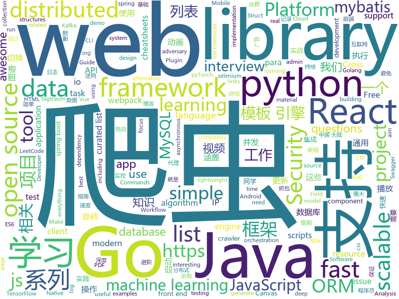

# 2019-12-19
See what the GitHub community is most excited about today.

## python
* [ML-From-Scratch](https://github.com/eriklindernoren/ML-From-Scratch)(**168 stars today**): Machine Learning From Scratch. Bare bones NumPy implementations of machine learning models and algorithms with a focus on accessibility. Aims to cover everything from linear regression to deep learning.
* [examples-of-web-crawlers](https://github.com/shengqiangzhang/examples-of-web-crawlers)(**81 stars today**): 一些非常有趣的python爬虫例子,对新手比较友好,主要爬取淘宝、天猫、微信、豆瓣、QQ等网站。(Some interesting examples of python crawlers that are friendly to beginners. )
* [coding-problems](https://github.com/MTrajK/coding-problems)(**113 stars today**): Solutions for various coding/algorithmic problems and many useful resources for learning algorithms and data structures
* [you-get](https://github.com/soimort/you-get)(**150 stars today**): ⏬Dumb downloader that scrapes the web
* [proxy_pool](https://github.com/jhao104/proxy_pool)(**30 stars today**): Python爬虫代理IP池(proxy pool)
* [transformers](https://github.com/huggingface/transformers)(**211 stars today**): 🤗Transformers: State-of-the-art Natural Language Processing for TensorFlow 2.0 and PyTorch.
* [Real-Time-Voice-Cloning](https://github.com/CorentinJ/Real-Time-Voice-Cloning)(**141 stars today**): Clone a voice in 5 seconds to generate arbitrary speech in real-time
* [insightface](https://github.com/deepinsight/insightface)(**16 stars today**): Face Analysis Project on MXNet
* [12306](https://github.com/testerSunshine/12306)(**275 stars today**): 12306智能刷票，订票
* [learn_python3_spider](https://github.com/wistbean/learn_python3_spider)(**19 stars today**): python爬虫教程系列、从0到1学习python爬虫，包括浏览器抓包，手机APP抓包，如 fiddler、mitmproxy，各种爬虫涉及的模块的使用，如：requests、beautifulSoup、selenium、appium、scrapy等，以及IP代理，验证码识别，Mysql，MongoDB数据库的python使用，多线程多进程爬虫的使用，css 爬虫加密逆向破解，JS爬虫逆向，分布式爬虫，爬虫项目实战实例等
* [odoo](https://github.com/odoo/odoo)(**20 stars today**): Odoo. Open Source Apps To Grow Your Business.
* [ray](https://github.com/ray-project/ray)(**44 stars today**): A fast and simple framework for building and running distributed applications. Ray is packaged with RLlib, a scalable reinforcement learning library, and Tune, a scalable hyperparameter tuning library.
* [BurpExtension-WhatsApp-Decryption-CheckPoint](https://github.com/romanzaikin/BurpExtension-WhatsApp-Decryption-CheckPoint)(**18 stars today**): This tool was created during our research at Checkpoint Software Technologies on Whatsapp Protocol (This repository will be updated after BlackHat 2019)
* [Silver](https://github.com/s0md3v/Silver)(**100 stars today**): Mass scan IPs for vulnerable services
* [intro-to-apis-course](https://github.com/craigsdennis/intro-to-apis-course)(**20 stars today**): Introduction to APIs course
* [caldera](https://github.com/mitre/caldera)(**9 stars today**): Automated Adversary Emulation
* [cogdl](https://github.com/THUDM/cogdl)(**64 stars today**): CogDL: An Extensive Research Platform for Representation Learning on Graphs
* [PyFlow](https://github.com/wonderworks-software/PyFlow)(**26 stars today**): Visual scripting framework for python - https://wonderworks-software.github.io/PyFlow
* [secretx](https://github.com/xyele/secretx)(**22 stars today**): Extracting api keys and secrets by requesting each url at the your list.
* [pandas](https://github.com/pandas-dev/pandas)(**17 stars today**): Flexible and powerful data analysis / manipulation library for Python, providing labeled data structures similar to R data.frame objects, statistical functions, and much more
* [django](https://github.com/django/django)(**35 stars today**): The Web framework for perfectionists with deadlines.
* [CTFd](https://github.com/CTFd/CTFd)(**10 stars today**): CTFs as you need them
* [cs230-code-examples](https://github.com/cs230-stanford/cs230-code-examples)(**16 stars today**): Code examples in pyTorch and Tensorflow for CS230
* [yolact](https://github.com/dbolya/yolact)(**98 stars today**): A simple, fully convolutional model for real-time instance segmentation.
* [aws-cloudformation-templates](https://github.com/awslabs/aws-cloudformation-templates)(**5 stars today**): A collection of useful CloudFormation templates

## java
* [spring-boot-demo](https://github.com/xkcoding/spring-boot-demo)(**141 stars today**): spring boot demo 是一个用来深度学习并实战 spring boot 的项目，目前总共包含 63 个集成demo，已经完成 52 个。 该项目已成功集成 actuator(监控)、admin(可视化监控)、logback(日志)、aopLog(通过AOP记录web请求日志)、统一异常处理(json级别和页面级别)、freemarker(模板引擎)、thymeleaf(模板引擎)、Beetl(模板引擎)、Enjoy(模板引擎)、JdbcTemplate(通用JDBC操作数据库)、JPA(强大的ORM框架)、mybatis(强大的ORM框架)、通用Mapper(快速操作Mybatis)、PageHelper(通用的Mybatis分页插件)、mybatis-plus(快速操作M…
* [miaosha](https://github.com/qiurunze123/miaosha)(**152 stars today**): ⭐⭐⭐⭐秒杀系统设计与实现.互联网工程师进阶与分析🙋🐓
* [LeetCodeAnimation](https://github.com/MisterBooo/LeetCodeAnimation)(**129 stars today**): Demonstrate all the questions on LeetCode in the form of animation.（用动画的形式呈现解LeetCode题目的思路）
* [debezium](https://github.com/debezium/debezium)(**12 stars today**): Change data capture for a variety of databases. https://debezium.io Please log issues in our JIRA at https://issues.jboss.org/projects/DBZ/issues
* [neo4j](https://github.com/neo4j/neo4j)(**13 stars today**): Graphs for Everyone
* [tutorials](https://github.com/eugenp/tutorials)(**29 stars today**): Just Announced - "Learn Spring Security OAuth":
* [GSYVideoPlayer](https://github.com/CarGuo/GSYVideoPlayer)(**17 stars today**): 视频播放器（IJKplayer、ExoPlayer、MediaPlayer），HTTPS，支持弹幕，支持滤镜、水印、gif截图，片头广告、中间广告，多个同时播放，支持基本的拖动，声音、亮度调节，支持边播边缓存，支持视频自带rotation的旋转（90,270之类），重力旋转与手动旋转的同步支持，支持列表播放 ，列表全屏动画，视频加载速度，列表小窗口支持拖动，动画效果，调整比例，多分辨率切换，支持切换播放器，进度条小窗口预览，列表切换详情页面无缝播放，rtsp、concat、mpeg。
* [maxwell](https://github.com/zendesk/maxwell)(**10 stars today**): Maxwell's daemon, a mysql-to-json kafka producer
* [JavaGuide](https://github.com/Snailclimb/JavaGuide)(**145 stars today**): 【Java学习+面试指南】 一份涵盖大部分Java程序员所需要掌握的核心知识。
* [testcontainers-java](https://github.com/testcontainers/testcontainers-java)(**8 stars today**): Testcontainers is a Java library that supports JUnit tests, providing lightweight, throwaway instances of common databases, Selenium web browsers, or anything else that can run in a Docker container.
* [springboot-learning-example](https://github.com/JeffLi1993/springboot-learning-example)(**18 stars today**): spring boot 实践学习案例，是 spring boot 初学者及核心技术巩固的最佳实践。另外写博客，用 OpenWrite。
* [light-4j](https://github.com/networknt/light-4j)(**21 stars today**): A fast, lightweight and more productive microservices framework
* [bigbluebutton](https://github.com/bigbluebutton/bigbluebutton)(**10 stars today**): Complete open source web conferencing system.
* [easyexcel](https://github.com/alibaba/easyexcel)(**54 stars today**): 快速、简单避免OOM的java处理Excel工具
* [spring-kafka](https://github.com/spring-projects/spring-kafka)(**3 stars today**): Provides Familiar Spring Abstractions for Apache Kafka
* [RxJava](https://github.com/ReactiveX/RxJava)(**26 stars today**): RxJava – Reactive Extensions for the JVM – a library for composing asynchronous and event-based programs using observable sequences for the Java VM.
* [presto](https://github.com/prestodb/presto)(**10 stars today**): The official home of the Presto distributed SQL query engine for big data
* [BigData-Notes](https://github.com/heibaiying/BigData-Notes)(**88 stars today**): 大数据入门指南⭐️
* [GCViewer](https://github.com/chewiebug/GCViewer)(**5 stars today**): Fork of tagtraum industries' GCViewer. Tagtraum stopped development in 2008, I aim to improve support for Sun's / Oracle's java 1.6+ garbage collector logs (including G1 collector)
* [react-native-webview](https://github.com/react-native-community/react-native-webview)(**3 stars today**): React Native Cross-Platform WebView
* [lombok-intellij-plugin](https://github.com/mplushnikov/lombok-intellij-plugin)(**8 stars today**): Lombok Plugin for IntelliJ IDEA
* [SpringCloud-Learning](https://github.com/dyc87112/SpringCloud-Learning)(**9 stars today**): Spring Cloud基础教程，持续连载更新中
* [react-native-camera](https://github.com/react-native-community/react-native-camera)(**4 stars today**): A Camera component for React Native. Also supports barcode scanning!
* [canal](https://github.com/alibaba/canal)(**36 stars today**): 阿里巴巴 MySQL binlog 增量订阅&消费组件
* [JCSprout](https://github.com/crossoverJie/JCSprout)(**19 stars today**): 👨‍🎓Java Core Sprout : basic, concurrent, algorithm

## unknown
* [14th](https://github.com/d2forum/14th)(**353 stars today**): 第十四届D2前端技术论坛「创心」
* [architect-awesome](https://github.com/xingshaocheng/architect-awesome)(**513 stars today**): 后端架构师技术图谱
* [stanford-cs-229-machine-learning](https://github.com/afshinea/stanford-cs-229-machine-learning)(**10 stars today**): VIP cheatsheets for Stanford's CS 229 Machine Learning
* [awesome](https://github.com/sindresorhus/awesome)(**216 stars today**): 😎Awesome lists about all kinds of interesting topics
* [ansible](https://github.com/iaasweek/ansible)(**33 stars today**): 
* [Winter-Internships-2019](https://github.com/ashutoshaneja/Winter-Internships-2019)(**10 stars today**): List of winter internships where you can spend your christmas.
* [Blog](https://github.com/mqyqingfeng/Blog)(**24 stars today**): 冴羽写博客的地方，预计写四个系列：JavaScript深入系列、JavaScript专题系列、ES6系列、React系列。
* [vagas](https://github.com/frontendbr/vagas)(**8 stars today**): 🔬Espaço para divulgação de vagas para front-enders.
* [flink-training-course](https://github.com/flink-china/flink-training-course)(**8 stars today**): Flink 中文视频课程（持续更新...）
* [react-typescript-cheatsheet](https://github.com/typescript-cheatsheets/react-typescript-cheatsheet)(**29 stars today**): Cheatsheets for experienced React developers getting started with TypeScript
* [laravel-best-practices](https://github.com/alexeymezenin/laravel-best-practices)(**5 stars today**): Laravel best practices
* [webkit](https://github.com/WebKit/webkit)(**2 stars today**): Unofficial mirror of the WebKit SVN repository
* [AD-Attack-Defense](https://github.com/infosecn1nja/AD-Attack-Defense)(**2 stars today**): Attack and defend active directory using modern post exploitation adversary tradecraft activity
* [proposals](https://github.com/tc39/proposals)(**38 stars today**): Tracking ECMAScript Proposals
* [awesome-react-hooks](https://github.com/rehooks/awesome-react-hooks)(**10 stars today**): Awesome React Hooks
* [3y](https://github.com/ZhongFuCheng3y/3y)(**28 stars today**): 📓从Java基础、JavaWeb基础到常用的框架再到面试题都有完整的教程，几乎涵盖了Java后端必备的知识点
* [daily-paper-computer-vision](https://github.com/amusi/daily-paper-computer-vision)(**9 stars today**): 记录每天整理的计算机视觉/深度学习/机器学习相关方向的论文
* [the-book-of-secret-knowledge](https://github.com/trimstray/the-book-of-secret-knowledge)(**34 stars today**): A collection of inspiring lists, manuals, cheatsheets, blogs, hacks, one-liners, cli/web tools and more.
* [iPhoneOSDeviceSupport](https://github.com/filsv/iPhoneOSDeviceSupport)(**24 stars today**): Xcode iPhoneOS DeviceSupport files (6.0 - 13.3)
* [awesome-nuxt](https://github.com/nuxt-community/awesome-nuxt)(**4 stars today**): A curated list of awesome things related to Nuxt.js
* [react-redux-links](https://github.com/markerikson/react-redux-links)(**11 stars today**): Curated tutorial and resource links I've collected on React, Redux, ES6, and more
* [JavaFamily](https://github.com/AobingJava/JavaFamily)(**100 stars today**): 【互联网一线大厂面试+学习指南】进阶知识完全扫盲：涵盖高并发、分布式、高可用、微服务等领域知识，作者风格幽默，看起来津津有味，把学习当做一种乐趣，何乐而不为，后端同学必看，前端同学我保证你也看得懂，看不懂你加我微信骂我渣男就好了。
* [Specs](https://github.com/CocoaPods/Specs)(**4 stars today**): The CocoaPods Master Repo
* [kubernetes-the-hard-way](https://github.com/kelseyhightower/kubernetes-the-hard-way)(**19 stars today**): Bootstrap Kubernetes the hard way on Google Cloud Platform. No scripts.
* [AZ-103-MicrosoftAzureAdministrator](https://github.com/MicrosoftLearning/AZ-103-MicrosoftAzureAdministrator)(**4 stars today**): AZ-103: Microsoft Azure Administrator

## javascript
* [wenyan-lang](https://github.com/LingDong-/wenyan-lang)(**4,918 stars today**): 文言文編程語言 A programming language for the ancient Chinese.
* [nuxt.js](https://github.com/nuxt/nuxt.js)(**61 stars today**): The Vue.js Framework
* [chinese-poetry](https://github.com/chinese-poetry/chinese-poetry)(**29 stars today**): 最全中华古诗词数据库, 唐宋两朝近一万四千古诗人, 接近5.5万首唐诗加26万宋诗. 两宋时期1564位词人，21050首词。
* [open-source-saas-boilerpate](https://github.com/saasforge/open-source-saas-boilerpate)(**80 stars today**): Free SaaS boilerplate (Python/PostgreSQL/ReactJS/Webpack)
* [webpack-box](https://github.com/luoxue-victor/webpack-box)(**83 stars today**): 我有一个梦想，就是将所有webpack相关的最佳实践都集成在这里，本项目长期维护/更新，有兴趣的同学可以一起成为维护者。issue下面TODO标签是接下来要做的事情，欢迎所有人都可以来提，让我们共创 webpack 工厂！
* [nativefier](https://github.com/jiahaog/nativefier)(**49 stars today**): Make any web page a desktop application
* [gatsby](https://github.com/gatsbyjs/gatsby)(**30 stars today**): Build blazing fast, modern apps and websites with React
* [fabric.js](https://github.com/fabricjs/fabric.js)(**34 stars today**): Javascript Canvas Library, SVG-to-Canvas (& canvas-to-SVG) Parser
* [amphtml](https://github.com/ampproject/amphtml)(**5 stars today**): The AMP web component framework.
* [front-end-interview-handbook](https://github.com/yangshun/front-end-interview-handbook)(**62 stars today**): 🕸Almost complete answers to "Front-end Job Interview Questions" which you can use to interview potential candidates, test yourself or completely ignore
* [Signal-Desktop](https://github.com/signalapp/Signal-Desktop)(**8 stars today**): Signal — Private Messenger for Windows, Mac, and Linux
* [dayjs](https://github.com/iamkun/dayjs)(**62 stars today**): ⏰Day.js 2KB immutable date library alternative to Moment.js with the same modern API
* [joplin](https://github.com/laurent22/joplin)(**156 stars today**): Joplin - an open source note taking and to-do application with synchronization capabilities for Windows, macOS, Linux, Android and iOS. Forum: https://discourse.joplinapp.org/
* [netron](https://github.com/lutzroeder/netron)(**33 stars today**): Visualizer for neural network, deep learning and machine learning models
* [sequelize](https://github.com/sequelize/sequelize)(**19 stars today**): An easy-to-use multi SQL dialect ORM for Node.js
* [Awesome-Design-Tools](https://github.com/LisaDziuba/Awesome-Design-Tools)(**23 stars today**): The best design tools and plugins for everything👉
* [mapbox-gl-js](https://github.com/mapbox/mapbox-gl-js)(**5 stars today**): Interactive, thoroughly customizable maps in the browser, powered by vector tiles and WebGL
* [node](https://github.com/nodejs/node)(**31 stars today**): Node.js JavaScript runtime✨🐢🚀✨
* [svelte](https://github.com/sveltejs/svelte)(**66 stars today**): Cybernetically enhanced web apps
* [carbon](https://github.com/carbon-design-system/carbon)(**2 stars today**): A design system built by IBM
* [vivus](https://github.com/maxwellito/vivus)(**18 stars today**): JavaScript library to make drawing animation on SVG
* [vue-multiselect](https://github.com/shentao/vue-multiselect)(**5 stars today**): Universal select/multiselect/tagging component for Vue.js
* [jsPDF](https://github.com/MrRio/jsPDF)(**11 stars today**): Client-side JavaScript PDF generation for everyone.
* [react-table](https://github.com/tannerlinsley/react-table)(**22 stars today**): ⚛️Hooks for building fast and extendable tables and datagrids for React
* [renovate](https://github.com/renovatebot/renovate)(**8 stars today**): Universal dependency update tool that fits into your workflows.

## html
* [meu-primeiro-jogo-multiplayer](https://github.com/filipedeschamps/meu-primeiro-jogo-multiplayer)(**27 stars today**): Um jogo multiplayer bastante simples para testarmos o Socket.io
* [awesome-piracy](https://github.com/Igglybuff/awesome-piracy)(**14 stars today**): A curated list of awesome warez and piracy links
* [Crawler_Illegal_Cases_In_China](https://github.com/HiddenStrawberry/Crawler_Illegal_Cases_In_China)(**13 stars today**): Collection of China illegal cases about web crawler 本项目用来整理所有中国大陆爬虫开发者涉诉与违规相关的新闻、资料与法律法规。致力于帮助在中国大陆工作的爬虫行业从业者了解我国相关法律，避免触碰数据合规红线。 [AD]中文知识图谱门户
* [web-moderno](https://github.com/cod3rcursos/web-moderno)(**3 stars today**): 
* [owasp-mstg](https://github.com/OWASP/owasp-mstg)(**10 stars today**): The Mobile Security Testing Guide (MSTG) is a comprehensive manual for mobile app security development, testing and reverse engineering.
* [ctf-wiki](https://github.com/ctf-wiki/ctf-wiki)(**5 stars today**): CTF Wiki Online. Come and join us, we need you!
* [web-3d-flashy](https://github.com/RoyAaron/web-3d-flashy)(**47 stars today**): 一个超炫酷的Web 3d特效。
* [OSCPRepo](https://github.com/rewardone/OSCPRepo)(**33 stars today**): A list of commands, scripts, resources, and more that I have gathered and attempted to consolidate for use as OSCP (and more) study material. Commands in 'Usefulcommands' Keepnote. Bookmarks and reading material in 'BookmarkList' Keepnote. Reconscan in scripts folder.
* [front-end-handbook-2019](https://github.com/FrontendMasters/front-end-handbook-2019)(**12 stars today**): [Book] 2019 edition of our front-end development handbook
* [alpha](https://github.com/alibaba/alpha)(**3 stars today**): Alpha是一个基于PERT图构建的Android异步启动框架，它简单，高效，功能完善。 在应用启动的时候，我们通常会有很多工作需要做，为了提高启动速度，我们会尽可能让这些工作并发进行。但这些工作之间可能存在前后依赖的关系，所以我们又需要想办法保证他们执行顺序的正确性。Alpha就是为此而设计的，使用者只需定义好自己的task，并描述它依赖的task，将它添加到Project中。框架会自动并发有序地执行这些task，并将执行的结果抛出来。
* [skill-map](https://github.com/TeamStuQ/skill-map)(**12 stars today**): 程序员技能图谱
* [swagger-codegen](https://github.com/swagger-api/swagger-codegen)(**10 stars today**): swagger-codegen contains a template-driven engine to generate documentation, API clients and server stubs in different languages by parsing your OpenAPI / Swagger definition.
* [flutter-in-action](https://github.com/flutterchina/flutter-in-action)(**19 stars today**): 《Flutter实战》电子书
* [quicklink](https://github.com/GoogleChromeLabs/quicklink)(**6 stars today**): ⚡️Faster subsequent page-loads by prefetching in-viewport links during idle time
* [ru.javascript.info](https://github.com/javascript-tutorial/ru.javascript.info)(**5 stars today**): Современный учебник JavaScript
* [webdevbootcamp](https://github.com/nax3t/webdevbootcamp)(**0 stars today**): All source code for back-end projects from the Web Developer Bootcamp
* [sale-workflow](https://github.com/OCA/sale-workflow)(**0 stars today**): Odoo Sales, Workflow and Organization
* [django-DefectDojo](https://github.com/DefectDojo/django-DefectDojo)(**1 stars today**): DefectDojo is an open-source application vulnerability correlation and security orchestration tool.
* [Front-end-Developer-Interview-Questions](https://github.com/h5bp/Front-end-Developer-Interview-Questions)(**14 stars today**): A list of helpful front-end related questions you can use to interview potential candidates, test yourself or completely ignore.
* [TheHive](https://github.com/TheHive-Project/TheHive)(**2 stars today**): TheHive: a Scalable, Open Source and Free Security Incident Response Platform
* [DevOps-Guide](https://github.com/Tikam02/DevOps-Guide)(**8 stars today**): DevOps Guide from basic to advanced with Interview Questions and Notes🔥
* [responsive-html-email-template](https://github.com/leemunroe/responsive-html-email-template)(**7 stars today**): A free simple responsive HTML email template
* [typedoc](https://github.com/TypeStrong/typedoc)(**5 stars today**): Documentation generator for TypeScript projects.
* [csswg-drafts](https://github.com/w3c/csswg-drafts)(**5 stars today**): CSS Working Group Editor Drafts
* [pdf2htmlEX](https://github.com/coolwanglu/pdf2htmlEX)(**4 stars today**): Convert PDF to HTML without losing text or format.

## go
* [crawlab](https://github.com/crawlab-team/crawlab)(**158 stars today**): Distributed web crawler admin platform for spiders management regardless of languages and frameworks.
* [sarama](https://github.com/Shopify/sarama)(**13 stars today**): Sarama is a Go library for Apache Kafka 0.8, and up.
* [kit](https://github.com/go-kit/kit)(**20 stars today**): A standard library for microservices.
* [tidb](https://github.com/pingcap/tidb)(**20 stars today**): TiDB is an open source distributed HTAP database compatible with the MySQL protocol
* [eksctl](https://github.com/weaveworks/eksctl)(**6 stars today**): The official CLI for Amazon EKS
* [annie](https://github.com/iawia002/annie)(**13 stars today**): 👾Fast, simple and clean video downloader
* [cadence](https://github.com/uber/cadence)(**4 stars today**): Cadence is a distributed, scalable, durable, and highly available orchestration engine to execute asynchronous long-running business logic in a scalable and resilient way.
* [websocket](https://github.com/gorilla/websocket)(**16 stars today**): A fast, well-tested and widely used WebSocket implementation for Go.
* [amqp](https://github.com/streadway/amqp)(**6 stars today**): Go client for AMQP 0.9.1
* [mattermost-server](https://github.com/mattermost/mattermost-server)(**17 stars today**): Open source Slack-alternative in Golang and React - Mattermost
* [xlsx](https://github.com/tealeg/xlsx)(**11 stars today**): Google Go (golang) library for reading and writing XLSX files.
* [terraform-provider-aws](https://github.com/terraform-providers/terraform-provider-aws)(**10 stars today**): Terraform AWS provider
* [logrus](https://github.com/sirupsen/logrus)(**16 stars today**): Structured, pluggable logging for Go.
* [validator](https://github.com/go-playground/validator)(**9 stars today**): 💯Go Struct and Field validation, including Cross Field, Cross Struct, Map, Slice and Array diving
* [sqlboiler](https://github.com/volatiletech/sqlboiler)(**5 stars today**): Generate a Go ORM tailored to your database schema.
* [service](https://github.com/kardianos/service)(**24 stars today**): Run go programs as a service on major platforms.
* [dep](https://github.com/golang/dep)(**5 stars today**): Go dependency management tool
* [awesome-go](https://github.com/avelino/awesome-go)(**47 stars today**): A curated list of awesome Go frameworks, libraries and software
* [redis](https://github.com/go-redis/redis)(**7 stars today**): Type-safe Redis client for Golang
* [Burrow](https://github.com/linkedin/Burrow)(**4 stars today**): Kafka Consumer Lag Checking
* [cert-manager](https://github.com/jetstack/cert-manager)(**12 stars today**): Automatically provision and manage TLS certificates in Kubernetes
* [node_exporter](https://github.com/prometheus/node_exporter)(**3 stars today**): Exporter for machine metrics
* [gocron](https://github.com/ouqiang/gocron)(**9 stars today**): 定时任务管理系统
* [mongo-go-driver](https://github.com/mongodb/mongo-go-driver)(**8 stars today**): The Go driver for MongoDB
* [pg](https://github.com/go-pg/pg)(**6 stars today**): Golang ORM with focus on PostgreSQL features and performance

## WordCloud

