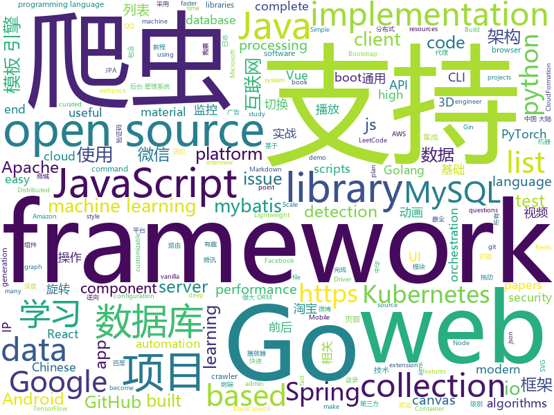

# 2019-12-20
See what the GitHub community is most excited about today.

## python
* [12306](https://github.com/testerSunshine/12306)(**326 stars today**): 12306智能刷票，订票
* [HelloGitHub](https://github.com/521xueweihan/HelloGitHub)(**427 stars today**): Find pearls on open-source seashore 分享 GitHub 上有趣、入门级的开源项目
* [ML-From-Scratch](https://github.com/eriklindernoren/ML-From-Scratch)(**142 stars today**): Machine Learning From Scratch. Bare bones NumPy implementations of machine learning models and algorithms with a focus on accessibility. Aims to cover everything from linear regression to deep learning.
* [examples-of-web-crawlers](https://github.com/shengqiangzhang/examples-of-web-crawlers)(**163 stars today**): 一些非常有趣的python爬虫例子,对新手比较友好,主要爬取淘宝、天猫、微信、豆瓣、QQ等网站。(Some interesting examples of python crawlers that are friendly to beginners. )
* [coding-problems](https://github.com/MTrajK/coding-problems)(**188 stars today**): Solutions for various coding/algorithmic problems and many useful resources for learning algorithms and data structures
* [Silver](https://github.com/s0md3v/Silver)(**39 stars today**): Mass scan IPs for vulnerable services
* [caldera](https://github.com/mitre/caldera)(**6 stars today**): Automated Adversary Emulation
* [CenterNet](https://github.com/xingyizhou/CenterNet)(**13 stars today**): Object detection, 3D detection, and pose estimation using center point detection:
* [fastapi](https://github.com/tiangolo/fastapi)(**53 stars today**): FastAPI framework, high performance, easy to learn, fast to code, ready for production
* [proxy_pool](https://github.com/jhao104/proxy_pool)(**55 stars today**): Python爬虫代理IP池(proxy pool)
* [easy12306](https://github.com/zhaipro/easy12306)(**32 stars today**): 使用机器学习算法完成对12306验证码的自动识别
* [transformers](https://github.com/huggingface/transformers)(**113 stars today**): 🤗Transformers: State-of-the-art Natural Language Processing for TensorFlow 2.0 and PyTorch.
* [home-assistant](https://github.com/home-assistant/home-assistant)(**30 stars today**): 🏡Open source home automation that puts local control and privacy first
* [learn_python3_spider](https://github.com/wistbean/learn_python3_spider)(**19 stars today**): python爬虫教程系列、从0到1学习python爬虫，包括浏览器抓包，手机APP抓包，如 fiddler、mitmproxy，各种爬虫涉及的模块的使用，如：requests、beautifulSoup、selenium、appium、scrapy等，以及IP代理，验证码识别，Mysql，MongoDB数据库的python使用，多线程多进程爬虫的使用，css 爬虫加密逆向破解，JS爬虫逆向，分布式爬虫，爬虫项目实战实例等
* [intro-to-apis-course](https://github.com/craigsdennis/intro-to-apis-course)(**18 stars today**): Introduction to APIs course
* [OneList](https://github.com/MoeClub/OneList)(**45 stars today**): Simple index for onedrive
* [zulip](https://github.com/zulip/zulip)(**12 stars today**): Zulip server - powerful open source team chat
* [Deep-Reinforcement-Learning-Algorithms-with-PyTorch](https://github.com/p-christ/Deep-Reinforcement-Learning-Algorithms-with-PyTorch)(**16 stars today**): PyTorch implementations of deep reinforcement learning algorithms and environments
* [qutebrowser](https://github.com/qutebrowser/qutebrowser)(**15 stars today**): A keyboard-driven, vim-like browser based on PyQt5.
* [horovod](https://github.com/horovod/horovod)(**15 stars today**): Distributed training framework for TensorFlow, Keras, PyTorch, and Apache MXNet.
* [you-get](https://github.com/soimort/you-get)(**111 stars today**): ⏬Dumb downloader that scrapes the web
* [PyFlow](https://github.com/wonderworks-software/PyFlow)(**37 stars today**): Visual scripting framework for python - https://wonderworks-software.github.io/PyFlow
* [allennlp](https://github.com/allenai/allennlp)(**11 stars today**): An open-source NLP research library, built on PyTorch.
* [py12306](https://github.com/pjialin/py12306)(**73 stars today**): 🚂12306 购票助手，支持集群，多账号，多任务购票以及 Web 页面管理
* [aws-cloudformation-templates](https://github.com/awslabs/aws-cloudformation-templates)(**5 stars today**): A collection of useful CloudFormation templates

## java
* [spring-boot-demo](https://github.com/xkcoding/spring-boot-demo)(**259 stars today**): spring boot demo 是一个用来深度学习并实战 spring boot 的项目，目前总共包含 63 个集成demo，已经完成 52 个。 该项目已成功集成 actuator(监控)、admin(可视化监控)、logback(日志)、aopLog(通过AOP记录web请求日志)、统一异常处理(json级别和页面级别)、freemarker(模板引擎)、thymeleaf(模板引擎)、Beetl(模板引擎)、Enjoy(模板引擎)、JdbcTemplate(通用JDBC操作数据库)、JPA(强大的ORM框架)、mybatis(强大的ORM框架)、通用Mapper(快速操作Mybatis)、PageHelper(通用的Mybatis分页插件)、mybatis-plus(快速操作M…
* [LeetCodeAnimation](https://github.com/MisterBooo/LeetCodeAnimation)(**172 stars today**): Demonstrate all the questions on LeetCode in the form of animation.（用动画的形式呈现解LeetCode题目的思路）
* [miaosha](https://github.com/qiurunze123/miaosha)(**150 stars today**): ⭐⭐⭐⭐秒杀系统设计与实现.互联网工程师进阶与分析🙋🐓
* [reliable](https://github.com/x-ream/reliable)(**14 stars today**): 
* [eladmin](https://github.com/elunez/eladmin)(**48 stars today**): 项目基于 Spring Boot 2.1.0 、 Jpa、 Spring Security、redis、Vue的前后端分离的后台管理系统，项目采用分模块开发方式， 权限控制采用 RBAC，支持数据字典与数据权限管理，支持一键生成前后端代码，支持动态路由
* [JustAuth](https://github.com/justauth/JustAuth)(**54 stars today**): 💯史上最全的整合第三方登录的开源库。目前已支持Github、Gitee、微博、钉钉、百度、Coding、腾讯云开发者平台、OSChina、支付宝、QQ、微信、淘宝、Google、Facebook、抖音、领英、小米、微软、今日头条、Teambition、StackOverflow、Pinterest、人人、华为、企业微信、酷家乐、Gitlab、美团、饿了么和推特等第三方平台的授权登录。 Login, so easy!
* [kubernetes-plugin](https://github.com/jenkinsci/kubernetes-plugin)(**4 stars today**): Jenkins plugin to run dynamic agents in a Kubernetes/Docker environment
* [ksql](https://github.com/confluentinc/ksql)(**10 stars today**): The event streaming database purpose-built for stream processing applications
* [openapi-generator](https://github.com/OpenAPITools/openapi-generator)(**9 stars today**): OpenAPI Generator allows generation of API client libraries (SDK generation), server stubs, documentation and configuration automatically given an OpenAPI Spec (v2, v3)
* [druid](https://github.com/alibaba/druid)(**25 stars today**): 阿里巴巴数据库事业部出品，为监控而生的数据库连接池
* [dubbo](https://github.com/apache/dubbo)(**27 stars today**): Apache Dubbo is a high-performance, java based, open source RPC framework.
* [spring-analysis](https://github.com/seaswalker/spring-analysis)(**11 stars today**): Spring源码阅读
* [CameraView](https://github.com/natario1/CameraView)(**10 stars today**): 📸A well documented, high-level Android interface that makes capturing pictures and videos easy, addressing all of the common issues and needs. Real-time filters, gestures, watermarks, frame processing, RAW, output of any size.
* [lucene-solr](https://github.com/apache/lucene-solr)(**12 stars today**): Apache Lucene and Solr open-source search software
* [quarkus](https://github.com/quarkusio/quarkus)(**11 stars today**): Quarkus: Supersonic Subatomic Java.
* [spring-security-oauth](https://github.com/spring-projects/spring-security-oauth)(**2 stars today**): Support for adding OAuth1(a) and OAuth2 features (consumer and provider) for Spring web applications.
* [rsocket-java](https://github.com/rsocket/rsocket-java)(**3 stars today**): Java implementation of RSocket
* [GSYVideoPlayer](https://github.com/CarGuo/GSYVideoPlayer)(**22 stars today**): 视频播放器（IJKplayer、ExoPlayer、MediaPlayer），HTTPS，支持弹幕，支持滤镜、水印、gif截图，片头广告、中间广告，多个同时播放，支持基本的拖动，声音、亮度调节，支持边播边缓存，支持视频自带rotation的旋转（90,270之类），重力旋转与手动旋转的同步支持，支持列表播放 ，列表全屏动画，视频加载速度，列表小窗口支持拖动，动画效果，调整比例，多分辨率切换，支持切换播放器，进度条小窗口预览，列表切换详情页面无缝播放，rtsp、concat、mpeg。
* [debezium](https://github.com/debezium/debezium)(**25 stars today**): Change data capture for a variety of databases. https://debezium.io Please log issues in our JIRA at https://issues.jboss.org/projects/DBZ/issues
* [tracker-control-android](https://github.com/OxfordHCC/tracker-control-android)(**8 stars today**): TrackerControl aims to inform, empower, and educate users with regards to tracking in apps, that is, collection of data about user behaviour.
* [xmall](https://github.com/Exrick/xmall)(**8 stars today**): 基于SOA架构的分布式电商购物商城 前后端分离 前台商城:Vue全家桶 后台管理系统:Dubbo/SSM/Elasticsearch/Redis/MySQL/ActiveMQ/Shiro/Zookeeper等
* [karate](https://github.com/intuit/karate)(**6 stars today**): Test Automation Made Simple
* [ARouter](https://github.com/alibaba/ARouter)(**8 stars today**): 💪A framework for assisting in the renovation of Android componentization (帮助 Android App 进行组件化改造的路由框架)
* [canal](https://github.com/alibaba/canal)(**32 stars today**): 阿里巴巴 MySQL binlog 增量订阅&消费组件
* [alluxio](https://github.com/Alluxio/alluxio)(**4 stars today**): Alluxio, data orchestration for analytics and machine learning in the cloud

## unknown
* [14th](https://github.com/d2forum/14th)(**242 stars today**): 第十四届D2前端技术论坛「创心」
* [3y](https://github.com/ZhongFuCheng3y/3y)(**71 stars today**): 📓从Java基础、JavaWeb基础到常用的框架再到面试题都有完整的教程，几乎涵盖了Java后端必备的知识点
* [awesome-scalability](https://github.com/binhnguyennus/awesome-scalability)(**14 stars today**): The Patterns of Scalable, Reliable, and Performant Large-Scale Systems
* [awesome-graph-classification](https://github.com/benedekrozemberczki/awesome-graph-classification)(**24 stars today**): A collection of important graph embedding, classification and representation learning papers with implementations.
* [awesome-point-cloud-analysis](https://github.com/Yochengliu/awesome-point-cloud-analysis)(**11 stars today**): A list of papers and datasets about point cloud analysis (processing)
* [A-Programmers-Guide-to-English](https://github.com/yujiangshui/A-Programmers-Guide-to-English)(**48 stars today**): 专为程序员编写的英语学习指南 v1.2。在线版本请点 ->
* [awesome-fraud-detection-papers](https://github.com/benedekrozemberczki/awesome-fraud-detection-papers)(**14 stars today**): A curated list of data mining papers about fraud detection.
* [awesome-react](https://github.com/enaqx/awesome-react)(**20 stars today**): A collection of awesome things regarding React ecosystem
* [gitignore](https://github.com/github/gitignore)(**58 stars today**): A collection of useful .gitignore templates
* [AZ-103-MicrosoftAzureAdministrator](https://github.com/MicrosoftLearning/AZ-103-MicrosoftAzureAdministrator)(**4 stars today**): AZ-103: Microsoft Azure Administrator
* [12306model](https://github.com/testerSunshine/12306model)(**1 stars today**): 本地识别模型下载
* [machine-learning-for-software-engineers](https://github.com/ZuzooVn/machine-learning-for-software-engineers)(**13 stars today**): A complete daily plan for studying to become a machine learning engineer.
* [javascript-testing-best-practices](https://github.com/goldbergyoni/javascript-testing-best-practices)(**30 stars today**): 📗🌐🚢Comprehensive and exhaustive JavaScript & Node.js testing best practices (August 2019)
* [coding-interview-university](https://github.com/jwasham/coding-interview-university)(**51 stars today**): A complete computer science study plan to become a software engineer.
* [proposals](https://github.com/tc39/proposals)(**23 stars today**): Tracking ECMAScript Proposals
* [xamarin-forms-goodlooking-UI](https://github.com/jsuarezruiz/xamarin-forms-goodlooking-UI)(**3 stars today**): Xamarin.Forms goodlooking UI samples
* [architecture.of.internet-product](https://github.com/davideuler/architecture.of.internet-product)(**13 stars today**): 互联网公司技术架构，微信/淘宝/微博/腾讯/阿里/美团点评/百度/Google/Facebook/Amazon/eBay的架构，欢迎PR补充
* [aws-cloudformation-coverage-roadmap](https://github.com/aws-cloudformation/aws-cloudformation-coverage-roadmap)(**2 stars today**): The AWS CloudFormation Public Coverage Roadmap
* [awesome-production-machine-learning](https://github.com/EthicalML/awesome-production-machine-learning)(**8 stars today**): A curated list of awesome open source libraries to deploy, monitor, version and scale your machine learning
* [corefx](https://github.com/dotnet/corefx)(**3 stars today**): CoreFX is the foundational class libraries for .NET Core. It includes types for collections, file systems, console, JSON, XML, async and many others.
* [kubernetes-the-hard-way](https://github.com/kelseyhightower/kubernetes-the-hard-way)(**22 stars today**): Bootstrap Kubernetes the hard way on Google Cloud Platform. No scripts.
* [ansible](https://github.com/iaasweek/ansible)(**16 stars today**): 
* [Xiaomi_Kernel_OpenSource](https://github.com/MiCode/Xiaomi_Kernel_OpenSource)(**5 stars today**): Xiaomi Mobile Phone Kernel OpenSource
* [newschool-frontend](https://github.com/NewSchoolBR/newschool-frontend)(**7 stars today**): 
* [webkit](https://github.com/WebKit/webkit)(**3 stars today**): Unofficial mirror of the WebKit SVN repository

## javascript
* [wenyan-lang](https://github.com/LingDong-/wenyan-lang)(**3,053 stars today**): 文言文編程語言 A programming language for the ancient Chinese.
* [nuxt.js](https://github.com/nuxt/nuxt.js)(**116 stars today**): The Vue.js Framework
* [webpack-box](https://github.com/luoxue-victor/webpack-box)(**220 stars today**): 我有一个梦想，就是将所有webpack相关的最佳实践都集成在这里，本项目长期维护/更新，有兴趣的同学可以一起成为维护者。issue下面TODO标签是接下来要做的事情，欢迎所有人都可以来提，让我们共创 webpack 工厂！
* [x-spreadsheet](https://github.com/myliang/x-spreadsheet)(**165 stars today**): A web-based JavaScript（canvas） spreadsheet
* [svelte](https://github.com/sveltejs/svelte)(**145 stars today**): Cybernetically enhanced web apps
* [lite-youtube-embed](https://github.com/paulirish/lite-youtube-embed)(**91 stars today**): A faster youtube embed.
* [chinese-poetry](https://github.com/chinese-poetry/chinese-poetry)(**114 stars today**): 最全中华古诗词数据库, 唐宋两朝近一万四千古诗人, 接近5.5万首唐诗加26万宋诗. 两宋时期1564位词人，21050首词。
* [cope](https://github.com/LingDong-/cope)(**48 stars today**): A modern IDE for writing classical Chinese poetry 格律诗编辑程序
* [jsPDF](https://github.com/MrRio/jsPDF)(**19 stars today**): Client-side JavaScript PDF generation for everyone.
* [markdown-here](https://github.com/adam-p/markdown-here)(**26 stars today**): Google Chrome, Firefox, and Thunderbird extension that lets you write email in Markdown and render it before sending.
* [gatsby](https://github.com/gatsbyjs/gatsby)(**30 stars today**): Build blazing fast, modern apps and websites with React
* [mapbox-gl-js](https://github.com/mapbox/mapbox-gl-js)(**4 stars today**): Interactive, thoroughly customizable maps in the browser, powered by vector tiles and WebGL
* [slate](https://github.com/ianstormtaylor/slate)(**16 stars today**): A completely customizable framework for building rich text editors. (Currently in beta.)
* [alpine](https://github.com/alpinejs/alpine)(**111 stars today**): A rugged, minimal framework for composing JavaScript behavior in your markup.
* [fabric.js](https://github.com/fabricjs/fabric.js)(**33 stars today**): Javascript Canvas Library, SVG-to-Canvas (& canvas-to-SVG) Parser
* [vant](https://github.com/youzan/vant)(**21 stars today**): Lightweight Mobile UI Components built on Vue
* [vivus](https://github.com/maxwellito/vivus)(**17 stars today**): JavaScript library to make drawing animation on SVG
* [carbon](https://github.com/carbon-design-system/carbon)(**7 stars today**): A design system built by IBM
* [front-end-interview-handbook](https://github.com/yangshun/front-end-interview-handbook)(**89 stars today**): 🕸Almost complete answers to "Front-end Job Interview Questions" which you can use to interview potential candidates, test yourself or completely ignore
* [protractor](https://github.com/angular/protractor)(**3 stars today**): E2E test framework for Angular apps
* [material-table](https://github.com/mbrn/material-table)(**8 stars today**): Datatable for React based on material-ui's table with additional features
* [Viewers](https://github.com/OHIF/Viewers)(**6 stars today**): OHIF zero-footprint DICOM viewer and oncology specific Lesion Tracker, plus shared extension packages
* [webdriverio](https://github.com/webdriverio/webdriverio)(**3 stars today**): Next-gen WebDriver test automation framework for Node.js
* [30-seconds-of-code](https://github.com/30-seconds/30-seconds-of-code)(**57 stars today**): Short JavaScript code snippets for all your development needs
* [bootstrap-datepicker](https://github.com/uxsolutions/bootstrap-datepicker)(**4 stars today**): A datepicker for twitter bootstrap (@twbs)

## html
* [homepage](https://github.com/omegasisters/homepage)(**14 stars today**): おめシスのホームページを作りたい
* [OSCPRepo](https://github.com/rewardone/OSCPRepo)(**13 stars today**): A list of commands, scripts, resources, and more that I have gathered and attempted to consolidate for use as OSCP (and more) study material. Commands in 'Usefulcommands' Keepnote. Bookmarks and reading material in 'BookmarkList' Keepnote. Reconscan in scripts folder.
* [shan-shui-inf](https://github.com/LingDong-/shan-shui-inf)(**56 stars today**): Procedurally generated Chinese landscape painting.
* [tagify](https://github.com/yairEO/tagify)(**2 stars today**): lightweight, efficient Tags input component in Vanilla JS / React / Angular
* [Crawler_Illegal_Cases_In_China](https://github.com/HiddenStrawberry/Crawler_Illegal_Cases_In_China)(**10 stars today**): Collection of China illegal cases about web crawler 本项目用来整理所有中国大陆爬虫开发者涉诉与违规相关的新闻、资料与法律法规。致力于帮助在中国大陆工作的爬虫行业从业者了解我国相关法律，避免触碰数据合规红线。 [AD]中文知识图谱门户
* [keep-a-changelog](https://github.com/olivierlacan/keep-a-changelog)(**4 stars today**): If you build software, keep a changelog.
* [glTF](https://github.com/KhronosGroup/glTF)(**4 stars today**): glTF – Runtime 3D Asset Delivery
* [styleguide](https://github.com/google/styleguide)(**13 stars today**): Style guides for Google-originated open-source projects
* [rellax](https://github.com/dixonandmoe/rellax)(**6 stars today**): Lightweight, vanilla javascript parallax library
* [meu-primeiro-jogo-multiplayer](https://github.com/filipedeschamps/meu-primeiro-jogo-multiplayer)(**12 stars today**): Um jogo multiplayer bastante simples para testarmos o Socket.io
* [github-markdown-css](https://github.com/sindresorhus/github-markdown-css)(**6 stars today**): The minimal amount of CSS to replicate the GitHub Markdown style
* [tw-family-names](https://github.com/imdataman/tw-family-names)(**5 stars today**): 台灣姓氏分佈地圖 Taiwan Family Name Map
* [Java-Interview-Advanced](https://github.com/shishan100/Java-Interview-Advanced)(**18 stars today**): 中华石杉--互联网Java进阶面试训练营
* [django-DefectDojo](https://github.com/DefectDojo/django-DefectDojo)(**0 stars today**): DefectDojo is an open-source application vulnerability correlation and security orchestration tool.
* [3d-force-graph](https://github.com/vasturiano/3d-force-graph)(**7 stars today**): 3D force-directed graph component using ThreeJS/WebGL
* [fastclick](https://github.com/ftlabs/fastclick)(**5 stars today**): Polyfill to remove click delays on browsers with touch UIs
* [craftinginterpreters](https://github.com/munificent/craftinginterpreters)(**4 stars today**): Repository for the book "Crafting Interpreters"
* [blog](https://github.com/gwuhaolin/blog)(**3 stars today**): 浩麟的技术博客
* [front-end-handbook-2019](https://github.com/FrontendMasters/front-end-handbook-2019)(**9 stars today**): [Book] 2019 edition of our front-end development handbook
* [linux-command](https://github.com/jaywcjlove/linux-command)(**11 stars today**): Linux命令大全搜索工具，内容包含Linux命令手册、详解、学习、搜集。https://git.io/linux
* [country-list](https://github.com/umpirsky/country-list)(**3 stars today**): 🌐List of all countries with names and ISO 3166-1 codes in all languages and data formats.
* [technical-books](https://github.com/doocs/technical-books)(**9 stars today**): 😆国内外互联网技术大牛们都写了哪些书籍：计算机基础、网络、前端、后端、数据库、架构、大数据、深度学习...
* [webdevbootcamp](https://github.com/nax3t/webdevbootcamp)(**2 stars today**): All source code for back-end projects from the Web Developer Bootcamp
* [flutter-in-action](https://github.com/flutterchina/flutter-in-action)(**10 stars today**): 《Flutter实战》电子书
* [Coursera-ML-AndrewNg-Notes](https://github.com/fengdu78/Coursera-ML-AndrewNg-Notes)(**16 stars today**): 吴恩达老师的机器学习课程个人笔记

## go
* [crawlab](https://github.com/crawlab-team/crawlab)(**229 stars today**): Distributed web crawler admin platform for spiders management regardless of languages and frameworks.
* [aws-sdk-go](https://github.com/aws/aws-sdk-go)(**6 stars today**): AWS SDK for the Go programming language.
* [eksctl](https://github.com/weaveworks/eksctl)(**7 stars today**): The official CLI for Amazon EKS
* [k9s](https://github.com/derailed/k9s)(**22 stars today**): 🐶Kubernetes CLI To Manage Your Clusters In Style!
* [chat](https://github.com/tinode/chat)(**10 stars today**): Instant messaging server; backend in Go; iOS, Android, web, command line clients; chatbots
* [packer](https://github.com/hashicorp/packer)(**4 stars today**): Packer is a tool for creating identical machine images for multiple platforms from a single source configuration.
* [gin](https://github.com/gin-gonic/gin)(**37 stars today**): Gin is a HTTP web framework written in Go (Golang). It features a Martini-like API with much better performance -- up to 40 times faster. If you need smashing performance, get yourself some Gin.
* [client_golang](https://github.com/prometheus/client_golang)(**7 stars today**): Prometheus instrumentation library for Go applications
* [redigo](https://github.com/gomodule/redigo)(**11 stars today**): Go client for Redis
* [rook](https://github.com/rook/rook)(**9 stars today**): Storage Orchestration for Kubernetes
* [rancher](https://github.com/rancher/rancher)(**12 stars today**): Complete container management platform
* [beats](https://github.com/elastic/beats)(**5 stars today**): 🐠Beats - Lightweight shippers for Elasticsearch & Logstash
* [go-git](https://github.com/src-d/go-git)(**5 stars today**): A highly extensible Git implementation in pure Go.
* [sarama](https://github.com/Shopify/sarama)(**16 stars today**): Sarama is a Go library for Apache Kafka 0.8, and up.
* [mysql](https://github.com/go-sql-driver/mysql)(**9 stars today**): Go MySQL Driver is a MySQL driver for Go's (golang) database/sql package
* [mock](https://github.com/golang/mock)(**10 stars today**): GoMock is a mocking framework for the Go programming language.
* [excelize](https://github.com/360EntSecGroup-Skylar/excelize)(**6 stars today**): Golang library for reading and writing Microsoft Excel™ (XLSX) files.
* [cobra](https://github.com/spf13/cobra)(**22 stars today**): A Commander for modern Go CLI interactions
* [grpc-go](https://github.com/grpc/grpc-go)(**12 stars today**): The Go language implementation of gRPC. HTTP/2 based RPC
* [kubernetes](https://github.com/kubernetes/kubernetes)(**39 stars today**): Production-Grade Container Scheduling and Management
* [helm](https://github.com/helm/helm)(**21 stars today**): The Kubernetes Package Manager
* [coredns](https://github.com/coredns/coredns)(**17 stars today**): CoreDNS is a DNS server that chains plugins
* [gosec](https://github.com/securego/gosec)(**2 stars today**): Golang security checker
* [kit](https://github.com/go-kit/kit)(**40 stars today**): A standard library for microservices.
* [autoscaler](https://github.com/kubernetes/autoscaler)(**4 stars today**): Autoscaling components for Kubernetes

## WordCloud

