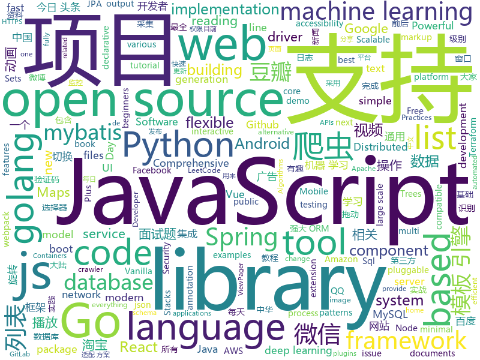

# 2019-12-21
See what the GitHub community is most excited about today.

## python
* [ML-From-Scratch](https://github.com/eriklindernoren/ML-From-Scratch)(**227 stars today**): Machine Learning From Scratch. Bare bones NumPy implementations of machine learning models and algorithms with a focus on accessibility. Aims to cover everything from linear regression to deep learning.
* [12306](https://github.com/testerSunshine/12306)(**538 stars today**): 12306智能刷票，订票
* [HelloGitHub](https://github.com/521xueweihan/HelloGitHub)(**281 stars today**): Find pearls on open-source seashore 分享 GitHub 上有趣、入门级的开源项目
* [examples-of-web-crawlers](https://github.com/shengqiangzhang/examples-of-web-crawlers)(**288 stars today**): 一些非常有趣的python爬虫例子,对新手比较友好,主要爬取淘宝、天猫、微信、豆瓣、QQ等网站。(Some interesting examples of python crawlers that are friendly to beginners. )
* [arcanevm](https://github.com/f-prime/arcanevm)(**129 stars today**): A Fully Homomorphic Encryption Brainfuck virtual machine
* [detectron2](https://github.com/facebookresearch/detectron2)(**51 stars today**): Detectron2 is FAIR's next-generation research platform for object detection and segmentation.
* [easy12306](https://github.com/zhaipro/easy12306)(**43 stars today**): 使用机器学习算法完成对12306验证码的自动识别
* [12306_code_server](https://github.com/YinAoXiong/12306_code_server)(**15 stars today**): 该仓库用于构建自托管的12306验证码识别服务器
* [home-assistant](https://github.com/home-assistant/home-assistant)(**32 stars today**): 🏡Open source home automation that puts local control and privacy first
* [ThreatHunter-Playbook](https://github.com/hunters-forge/ThreatHunter-Playbook)(**9 stars today**): A Threat hunter's playbook to aid the development of techniques and hypothesis for hunting campaigns.
* [intro-to-apis-course](https://github.com/craigsdennis/intro-to-apis-course)(**17 stars today**): Introduction to APIs course
* [ECommerceCrawlers](https://github.com/DropsDevopsOrg/ECommerceCrawlers)(**11 stars today**): 实战🐍多种网站、电商数据爬虫🕷。包含🕸：淘宝商品、微信公众号、大众点评、招聘网站、闲鱼、阿里任务、博客园、微博、百度贴吧、豆瓣电影、包图网、全景网、豆瓣音乐、某省药监局、搜狐新闻、机器学习文本采集、fofa资产采集、汽车之家、国家统计局、百度关键词收录数、蜘蛛泛目录、今日头条、豆瓣影评、携程❤️❤️❤️。微信爬虫展示项目:
* [ALBERT](https://github.com/google-research/ALBERT)(**21 stars today**): 
* [AutoRecon](https://github.com/Tib3rius/AutoRecon)(**5 stars today**): AutoRecon is a multi-threaded network reconnaissance tool which performs automated enumeration of services.
* [fbi](https://github.com/xHak9x/fbi)(**8 stars today**): Facebook Information
* [cs230-code-examples](https://github.com/cs230-stanford/cs230-code-examples)(**33 stars today**): Code examples in pyTorch and Tensorflow for CS230
* [labelme](https://github.com/wkentaro/labelme)(**11 stars today**): Image Polygonal Annotation with Python (polygon, rectangle, circle, line, point and image-level flag annotation).
* [incubator-mxnet](https://github.com/apache/incubator-mxnet)(**5 stars today**): Lightweight, Portable, Flexible Distributed/Mobile Deep Learning with Dynamic, Mutation-aware Dataflow Dep Scheduler; for Python, R, Julia, Scala, Go, Javascript and more
* [sagemaker-python-sdk](https://github.com/aws/sagemaker-python-sdk)(**2 stars today**): A library for training and deploying machine learning models on Amazon SageMaker
* [c9-python-getting-started](https://github.com/microsoft/c9-python-getting-started)(**16 stars today**): Sample code for Channel 9 Python for Beginners course
* [oppia](https://github.com/oppia/oppia)(**1 stars today**): Tool for collaboratively building interactive lessons.
* [100-Days-Of-ML-Code](https://github.com/Avik-Jain/100-Days-Of-ML-Code)(**16 stars today**): 100 Days of ML Coding
* [gpt-2-simple](https://github.com/minimaxir/gpt-2-simple)(**7 stars today**): Python package to easily retrain OpenAI's GPT-2 text-generating model on new texts
* [astropy](https://github.com/astropy/astropy)(**2 stars today**): Repository for the Astropy core package
* [synapse](https://github.com/matrix-org/synapse)(**25 stars today**): Synapse: Matrix reference homeserver

## java
* [spring-boot-demo](https://github.com/xkcoding/spring-boot-demo)(**354 stars today**): spring boot demo 是一个用来深度学习并实战 spring boot 的项目，目前总共包含 63 个集成demo，已经完成 52 个。 该项目已成功集成 actuator(监控)、admin(可视化监控)、logback(日志)、aopLog(通过AOP记录web请求日志)、统一异常处理(json级别和页面级别)、freemarker(模板引擎)、thymeleaf(模板引擎)、Beetl(模板引擎)、Enjoy(模板引擎)、JdbcTemplate(通用JDBC操作数据库)、JPA(强大的ORM框架)、mybatis(强大的ORM框架)、通用Mapper(快速操作Mybatis)、PageHelper(通用的Mybatis分页插件)、mybatis-plus(快速操作M…
* [beam](https://github.com/apache/beam)(**7 stars today**): Apache Beam
* [LeetCodeAnimation](https://github.com/MisterBooo/LeetCodeAnimation)(**234 stars today**): Demonstrate all the questions on LeetCode in the form of animation.（用动画的形式呈现解LeetCode题目的思路）
* [JustAuth](https://github.com/justauth/JustAuth)(**95 stars today**): 💯史上最全的整合第三方登录的开源库。目前已支持Github、Gitee、微博、钉钉、百度、Coding、腾讯云开发者平台、OSChina、支付宝、QQ、微信、淘宝、Google、Facebook、抖音、领英、小米、微软、今日头条、Teambition、StackOverflow、Pinterest、人人、华为、企业微信、酷家乐、Gitlab、美团、饿了么和推特等第三方平台的授权登录。 Login, so easy!
* [elasticsearch](https://github.com/elastic/elasticsearch)(**44 stars today**): Open Source, Distributed, RESTful Search Engine
* [flink](https://github.com/apache/flink)(**34 stars today**): Apache Flink
* [angel](https://github.com/Angel-ML/angel)(**36 stars today**): A Flexible and Powerful Parameter Server for large-scale machine learning
* [canal](https://github.com/alibaba/canal)(**33 stars today**): 阿里巴巴 MySQL binlog 增量订阅&消费组件
* [hive](https://github.com/apache/hive)(**3 stars today**): Apache Hive
* [bazel](https://github.com/bazelbuild/bazel)(**11 stars today**): a fast, scalable, multi-language and extensible build system
* [eladmin](https://github.com/elunez/eladmin)(**38 stars today**): 项目基于 Spring Boot 2.1.0 、 Jpa、 Spring Security、redis、Vue的前后端分离的后台管理系统，项目采用分模块开发方式， 权限控制采用 RBAC，支持数据字典与数据权限管理，支持一键生成前后端代码，支持动态路由
* [tutorials](https://github.com/eugenp/tutorials)(**30 stars today**): Just Announced - "Learn Spring Security OAuth":
* [OpenRefine](https://github.com/OpenRefine/OpenRefine)(**10 stars today**): OpenRefine is a free, open source power tool for working with messy data and improving it
* [reliable](https://github.com/x-ream/reliable)(**16 stars today**): 
* [janusgraph](https://github.com/JanusGraph/janusgraph)(**8 stars today**): JanusGraph: an open-source, distributed graph database
* [GSYVideoPlayer](https://github.com/CarGuo/GSYVideoPlayer)(**32 stars today**): 视频播放器（IJKplayer、ExoPlayer、MediaPlayer），HTTPS，支持弹幕，支持滤镜、水印、gif截图，片头广告、中间广告，多个同时播放，支持基本的拖动，声音、亮度调节，支持边播边缓存，支持视频自带rotation的旋转（90,270之类），重力旋转与手动旋转的同步支持，支持列表播放 ，列表全屏动画，视频加载速度，列表小窗口支持拖动，动画效果，调整比例，多分辨率切换，支持切换播放器，进度条小窗口预览，列表切换详情页面无缝播放，rtsp、concat、mpeg。
* [PictureSelector](https://github.com/LuckSiege/PictureSelector)(**20 stars today**): Picture Selector Library for Android or 图片选择器
* [spring-boot](https://github.com/spring-projects/spring-boot)(**47 stars today**): Spring Boot
* [BaseRecyclerViewAdapterHelper](https://github.com/CymChad/BaseRecyclerViewAdapterHelper)(**17 stars today**): BRVAH:Powerful and flexible RecyclerAdapter
* [Android-PickerView](https://github.com/Bigkoo/Android-PickerView)(**12 stars today**): This is a picker view for android , support linkage effect, timepicker and optionspicker.（时间选择器、省市区三级联动）
* [UltraViewPager](https://github.com/alibaba/UltraViewPager)(**6 stars today**): UltraViewPager is an extension for ViewPager to provide multiple features in a single ViewPager.
* [AndroidAutoSize](https://github.com/JessYanCoding/AndroidAutoSize)(**12 stars today**): 🔥A low-cost Android screen adaptation solution (今日头条屏幕适配方案终极版，一个极低成本的 Android 屏幕适配方案).
* [antlr4](https://github.com/antlr/antlr4)(**8 stars today**): ANTLR (ANother Tool for Language Recognition) is a powerful parser generator for reading, processing, executing, or translating structured text or binary files.
* [NetGuard](https://github.com/M66B/NetGuard)(**2 stars today**): A simple way to block access to the internet per app
* [JiaoZiVideoPlayer](https://github.com/lipangit/JiaoZiVideoPlayer)(**3 stars today**): Deprecated

## unknown
* [javascript-testing-best-practices](https://github.com/goldbergyoni/javascript-testing-best-practices)(**67 stars today**): 📗🌐🚢Comprehensive and exhaustive JavaScript & Node.js testing best practices (August 2019)
* [3y](https://github.com/ZhongFuCheng3y/3y)(**107 stars today**): 📓从Java基础、JavaWeb基础到常用的框架再到面试题都有完整的教程，几乎涵盖了Java后端必备的知识点
* [awesome-scalability](https://github.com/binhnguyennus/awesome-scalability)(**26 stars today**): The Patterns of Scalable, Reliable, and Performant Large-Scale Systems
* [Reverse-Engineering-Intel-x64-101](https://github.com/0xdidu/Reverse-Engineering-Intel-x64-101)(**71 stars today**): Material for a RE 101 class on Intel x64 binaries
* [handbook](https://github.com/jaywcjlove/handbook)(**27 stars today**): 放置我的笔记、搜集、摘录、实践，保持好奇心。看文需谨慎，后果很严重。
* [A-Programmers-Guide-to-English](https://github.com/yujiangshui/A-Programmers-Guide-to-English)(**44 stars today**): 专为程序员编写的英语学习指南 v1.2。在线版本请点 ->
* [wxappUnpacker](https://github.com/qwerty472123/wxappUnpacker)(**10 stars today**): wxml被“编译“后”压缩“一下多好！😀
* [NGC.SS.JJ](https://github.com/NGC-HenryLee/NGC.SS.JJ)(**13 stars today**): NGC.SS.JJ
* [weekly](https://github.com/ruanyf/weekly)(**29 stars today**): 科技爱好者周刊，每周五发布
* [react-typescript-cheatsheet](https://github.com/typescript-cheatsheets/react-typescript-cheatsheet)(**32 stars today**): Cheatsheets for experienced React developers getting started with TypeScript
* [Project-Based-Tutorials-in-C](https://github.com/rby90/Project-Based-Tutorials-in-C)(**8 stars today**): A curated list of project-based tutorials in C
* [android-developer-roadmap](https://github.com/mobile-roadmap/android-developer-roadmap)(**6 stars today**): Android Developer Roadmap 2019
* [trackerslist](https://github.com/ngosang/trackerslist)(**64 stars today**): Updated list of public BitTorrent trackers
* [open-source-cs](https://github.com/ForrestKnight/open-source-cs)(**14 stars today**): Video discussing this curriculum:
* [coding-interview-university](https://github.com/jwasham/coding-interview-university)(**49 stars today**): A complete computer science study plan to become a software engineer.
* [flink-training-course](https://github.com/flink-china/flink-training-course)(**11 stars today**): Flink 中文视频课程（持续更新...）
* [chinese-independent-developer](https://github.com/1c7/chinese-independent-developer)(**33 stars today**): 👩🏿‍💻👨🏾‍💻👩🏼‍💻👨🏽‍💻👩🏻‍💻中国独立开发者项目列表 -- 分享大家都在做什么
* [Xiaomi_Kernel_OpenSource](https://github.com/MiCode/Xiaomi_Kernel_OpenSource)(**7 stars today**): Xiaomi Mobile Phone Kernel OpenSource
* [eng-practices](https://github.com/google/eng-practices)(**28 stars today**): Google's Engineering Practices documentation
* [Announcements](https://github.com/aspnet/Announcements)(**1 stars today**): Subscribe to this repo to be notified about major changes in ASP.NET Core and Entity Framework Core
* [Python-Books](https://github.com/manash-biswal/Python-Books)(**3 stars today**): 
* [GoBooks](https://github.com/dariubs/GoBooks)(**7 stars today**): List of Golang books
* [DeepRec](https://github.com/imsheridan/DeepRec)(**37 stars today**): 推荐、广告工业界经典以及最前沿的论文、资料集合/ Must-read Papers on Recommendation System and CTR Prediction
* [toml](https://github.com/toml-lang/toml)(**17 stars today**): Tom's Obvious, Minimal Language
* [12306model](https://github.com/testerSunshine/12306model)(**3 stars today**): 本地识别模型下载

## javascript
* [tesseract.js](https://github.com/naptha/tesseract.js)(**528 stars today**): Pure Javascript OCR for more than 100 Languages📖🎉🖥
* [chinese-poetry](https://github.com/chinese-poetry/chinese-poetry)(**389 stars today**): 最全中华古诗词数据库, 唐宋两朝近一万四千古诗人, 接近5.5万首唐诗加26万宋诗. 两宋时期1564位词人，21050首词。
* [webpack-box](https://github.com/luoxue-victor/webpack-box)(**290 stars today**): 我有一个梦想，就是将所有webpack相关的最佳实践都集成在这里，本项目长期维护/更新，有兴趣的同学可以一起成为维护者。issue下面TODO标签是接下来要做的事情，欢迎所有人都可以来提，让我们共创 webpack 工厂！
* [svelte](https://github.com/sveltejs/svelte)(**226 stars today**): Cybernetically enhanced web apps
* [http-decision-diagram](https://github.com/for-GET/http-decision-diagram)(**279 stars today**): An activity diagram to describe the resolution of HTTP response status codes, given various headers.
* [alpine](https://github.com/alpinejs/alpine)(**70 stars today**): A rugged, minimal framework for composing JavaScript behavior in your markup.
* [mapbox-gl-js](https://github.com/mapbox/mapbox-gl-js)(**23 stars today**): Interactive, thoroughly customizable maps in the browser, powered by vector tiles and WebGL
* [x-spreadsheet](https://github.com/myliang/x-spreadsheet)(**175 stars today**): A web-based JavaScript（canvas） spreadsheet
* [fe-interview](https://github.com/haizlin/fe-interview)(**46 stars today**): 前端面试每日 3+1，以面试题来驱动学习，提倡每日学习与思考，每天进步一点！每天早上5点纯手工发布面试题（死磕自己，愉悦大家）
* [awesome-selfhosted](https://github.com/awesome-selfhosted/awesome-selfhosted)(**97 stars today**): A list of Free Software network services and web applications which can be hosted locally. Selfhosting is the process of hosting and managing applications instead of renting from Software-as-a-Service providers
* [exif-js](https://github.com/exif-js/exif-js)(**4 stars today**): JavaScript library for reading EXIF image metadata
* [three.js](https://github.com/mrdoob/three.js)(**40 stars today**): JavaScript 3D library.
* [eslint](https://github.com/eslint/eslint)(**8 stars today**): A fully pluggable tool for identifying and reporting on patterns in JavaScript
* [nuxt.js](https://github.com/nuxt/nuxt.js)(**121 stars today**): The Vue.js Framework
* [Awesome-Design-Tools](https://github.com/LisaDziuba/Awesome-Design-Tools)(**42 stars today**): The best design tools and plugins for everything👉
* [grokking_algorithms](https://github.com/egonSchiele/grokking_algorithms)(**6 stars today**): Code for the book Grokking Algorithms (https://amzn.to/29rVyHf)
* [puppeteer](https://github.com/puppeteer/puppeteer)(**51 stars today**): Headless Chrome Node.js API
* [next.js](https://github.com/zeit/next.js)(**35 stars today**): The React Framework
* [bootstrap-vue](https://github.com/bootstrap-vue/bootstrap-vue)(**9 stars today**): BootstrapVue, with over 40 plugins and more than 80 custom components, provides one of the most comprehensive implementations of Bootstrap v4 components and grid system for Vue.js. With extensive and automated WAI-ARIA accessibility markup.
* [dayjs](https://github.com/iamkun/dayjs)(**54 stars today**): ⏰Day.js 2KB immutable date library alternative to Moment.js with the same modern API
* [react](https://github.com/facebook/react)(**72 stars today**): A declarative, efficient, and flexible JavaScript library for building user interfaces.
* [Semantic-UI](https://github.com/Semantic-Org/Semantic-UI)(**15 stars today**): Semantic is a UI component framework based around useful principles from natural language.
* [netron](https://github.com/lutzroeder/netron)(**27 stars today**): Visualizer for neural network, deep learning and machine learning models
* [ckeditor5](https://github.com/ckeditor/ckeditor5)(**7 stars today**): Powerful rich text editor framework with a modular architecture, modern integrations and features like collaborative editing.
* [30-seconds-of-code](https://github.com/30-seconds/30-seconds-of-code)(**59 stars today**): Short JavaScript code snippets for all your development needs

## html
* [zh.javascript.info](https://github.com/javascript-tutorial/zh.javascript.info)(**33 stars today**): 现代 JavaScript 教程（The Modern JavaScript Tutorial）
* [snakemake](https://github.com/snakemake/snakemake)(**5 stars today**): This is the development home of the workflow management system Snakemake. For general information, see
* [flexboxgrid](https://github.com/kristoferjoseph/flexboxgrid)(**7 stars today**): Grid based on CSS3 flexbox
* [kubernetes-failure-stories](https://github.com/hjacobs/kubernetes-failure-stories)(**5 stars today**): Compilation of public failure/horror stories related to Kubernetes
* [bigbuckaws](https://github.com/xssfox/bigbuckaws)(**18 stars today**): 
* [styleguide](https://github.com/google/styleguide)(**13 stars today**): Style guides for Google-originated open-source projects
* [wysiwyg-editor](https://github.com/froala/wysiwyg-editor)(**5 stars today**): The next generation Javascript WYSIWYG HTML Editor.
* [fe4ml-zh](https://github.com/apachecn/fe4ml-zh)(**11 stars today**): 📖[译] 面向机器学习的特征工程
* [JavaScript30](https://github.com/wesbos/JavaScript30)(**9 stars today**): 30 Day Vanilla JS Challenge
* [realworld](https://github.com/sveltejs/realworld)(**9 stars today**): Svelte/Sapper implementation of the RealWorld app
* [svelte-material-ui](https://github.com/hperrin/svelte-material-ui)(**5 stars today**): Svelte Material UI Components
* [Django-CRM](https://github.com/MicroPyramid/Django-CRM)(**1 stars today**): Open Source Python CRM based on Django aimed to salesforce compatible for migrating to
* [wpt](https://github.com/web-platform-tests/wpt)(**5 stars today**): Test suites for Web platform specs — including WHATWG, W3C, and others
* [tagify](https://github.com/yairEO/tagify)(**3 stars today**): lightweight, efficient Tags input component in Vanilla JS / React / Angular
* [hyperblog](https://github.com/freddier/hyperblog)(**9 stars today**): Un blog increíble para el curso de Git y Github de Platzi
* [Crawler_Illegal_Cases_In_China](https://github.com/HiddenStrawberry/Crawler_Illegal_Cases_In_China)(**23 stars today**): Collection of China illegal cases about web crawler 本项目用来整理所有中国大陆爬虫开发者涉诉与违规相关的新闻、资料与法律法规。致力于帮助在中国大陆工作的爬虫行业从业者了解我国相关法律，避免触碰数据合规红线。 [AD]中文知识图谱门户
* [node-ytdl-core](https://github.com/fent/node-ytdl-core)(**3 stars today**): YouTube video downloader in javascript.
* [docs](https://github.com/pingcap/docs)(**0 stars today**): TiDB/TiKV/PD documents.
* [web](https://github.com/OCA/web)(**0 stars today**): Odoo web client UI related addons
* [ecma262](https://github.com/tc39/ecma262)(**6 stars today**): Status, process, and documents for ECMA-262
* [Java-Interview-Advanced](https://github.com/shishan100/Java-Interview-Advanced)(**15 stars today**): 中华石杉--互联网Java进阶面试训练营
* [email-templates](https://github.com/sendgrid/email-templates)(**1 stars today**): A repository of common email templates to use and modify to your heart's content.
* [all-contributors](https://github.com/all-contributors/all-contributors)(**3 stars today**): ✨Recognize all contributors, not just the ones who push code✨
* [schemaorg](https://github.com/schemaorg/schemaorg)(**4 stars today**): Schema.org - schemas and (appengine) software
* [NGINX-Demos](https://github.com/nginxinc/NGINX-Demos)(**1 stars today**): NGINX and NGINX Plus demos

## go
* [sqlx](https://github.com/jmoiron/sqlx)(**13 stars today**): general purpose extensions to golang's database/sql
* [mysql](https://github.com/go-sql-driver/mysql)(**6 stars today**): Go MySQL Driver is a MySQL driver for Go's (golang) database/sql package
* [eksctl](https://github.com/weaveworks/eksctl)(**19 stars today**): The official CLI for Amazon EKS
* [excelize](https://github.com/360EntSecGroup-Skylar/excelize)(**12 stars today**): Golang library for reading and writing Microsoft Excel™ (XLSX) files.
* [mattermost-server](https://github.com/mattermost/mattermost-server)(**24 stars today**): Open source Slack-alternative in Golang and React - Mattermost
* [xorfilter](https://github.com/FastFilter/xorfilter)(**112 stars today**): Go library implementing xor filters
* [terraform](https://github.com/hashicorp/terraform)(**27 stars today**): Terraform enables you to safely and predictably create, change, and improve infrastructure. It is an open source tool that codifies APIs into declarative configuration files that can be shared amongst team members, treated as code, edited, reviewed, and versioned.
* [kit](https://github.com/go-kit/kit)(**54 stars today**): A standard library for microservices.
* [external-dns](https://github.com/kubernetes-sigs/external-dns)(**16 stars today**): Configure external DNS servers (AWS Route53, Google CloudDNS and others) for Kubernetes Ingresses and Services
* [aws-sdk-go](https://github.com/aws/aws-sdk-go)(**19 stars today**): AWS SDK for the Go programming language.
* [golangci-lint](https://github.com/golangci/golangci-lint)(**7 stars today**): Linters Runner for Go. 5x faster than gometalinter. Nice colored output. Can report only new issues. Fewer false-positives. Yaml/toml config.
* [goss](https://github.com/aelsabbahy/goss)(**8 stars today**): Quick and Easy server testing/validation
* [citop](https://github.com/nbedos/citop)(**33 stars today**): Monitor CI pipelines from the command line (compatible with GitLab, Azure DevOps, Travis CI, AppVeyor and CircleCI)
* [go-sqlmock](https://github.com/DATA-DOG/go-sqlmock)(**6 stars today**): Sql mock driver for golang to test database interactions
* [grpc-go](https://github.com/grpc/grpc-go)(**14 stars today**): The Go language implementation of gRPC. HTTP/2 based RPC
* [gods](https://github.com/emirpasic/gods)(**16 stars today**): GoDS (Go Data Structures). Containers (Sets, Lists, Stacks, Maps, Trees), Sets (HashSet, TreeSet, LinkedHashSet), Lists (ArrayList, SinglyLinkedList, DoublyLinkedList), Stacks (LinkedListStack, ArrayStack), Maps (HashMap, TreeMap, HashBidiMap, TreeBidiMap, LinkedHashMap), Trees (RedBlackTree, AVLTree, BTree, BinaryHeap), Comparators, Iterators, …
* [cli](https://github.com/urfave/cli)(**13 stars today**): A simple, fast, and fun package for building command line apps in Go
* [helm](https://github.com/helm/helm)(**26 stars today**): The Kubernetes Package Manager
* [duplicacy](https://github.com/gilbertchen/duplicacy)(**95 stars today**): A new generation cloud backup tool
* [terraform-docs](https://github.com/segmentio/terraform-docs)(**4 stars today**): Generate documentation from Terraform modules in various output formats
* [trivy](https://github.com/aquasecurity/trivy)(**13 stars today**): A Simple and Comprehensive Vulnerability Scanner for Containers, Suitable for CI
* [logrus](https://github.com/sirupsen/logrus)(**17 stars today**): Structured, pluggable logging for Go.
* [easyjson](https://github.com/mailru/easyjson)(**5 stars today**): Fast JSON serializer for golang.
* [hugo](https://github.com/gohugoio/hugo)(**44 stars today**): The world’s fastest framework for building websites.
* [terraform-provider-aws](https://github.com/terraform-providers/terraform-provider-aws)(**9 stars today**): Terraform AWS provider

## WordCloud

