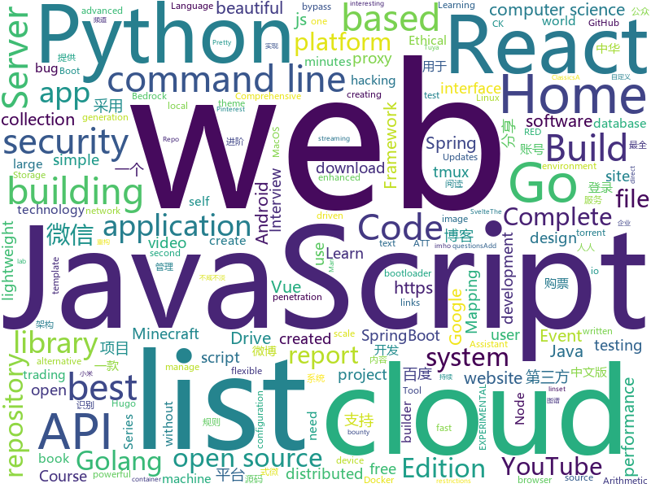

# 2019-12-23
See what the GitHub community is most excited about today.

## python
* [12306](https://github.com/testerSunshine/12306)(**187 stars today**): 12306智能刷票，订票
* [py12306](https://github.com/pjialin/py12306)(**45 stars today**): 🚂12306 购票助手，支持集群，多账号，多任务购票以及 Web 页面管理
* [youtube-dl](https://github.com/ytdl-org/youtube-dl)(**107 stars today**): Command-line program to download videos from YouTube.com and other video sites
* [interpy-zh](https://github.com/eastlakeside/interpy-zh)(**75 stars today**): 📘《Python进阶》（Intermediate Python 中文版）
* [manim](https://github.com/3b1b/manim)(**48 stars today**): Animation engine for explanatory math videos
* [CheatSheetSeries](https://github.com/OWASP/CheatSheetSeries)(**21 stars today**): The OWASP Cheat Sheet Series was created to provide a concise collection of high value information on specific application security topics.
* [home-assistant](https://github.com/home-assistant/home-assistant)(**73 stars today**): 🏡Open source home automation that puts local control and privacy first
* [YouTube-Report](https://github.com/A3M4/YouTube-Report)(**89 stars today**): 📊Generate a personal YouTube report from your Google Takeout data
* [docker-pi-hole](https://github.com/pi-hole/docker-pi-hole)(**4 stars today**): Pi-hole in a docker container
* [TTS](https://github.com/mozilla/TTS)(**8 stars today**): Deep learning for Text to Speech
* [youtube](https://github.com/engineer-man/youtube)(**7 stars today**): Code from the Engineer Man YouTube channel
* [system-design-primer](https://github.com/donnemartin/system-design-primer)(**116 stars today**): Learn how to design large-scale systems. Prep for the system design interview. Includes Anki flashcards.
* [wtfpython](https://github.com/satwikkansal/wtfpython)(**82 stars today**): Exploring Python through counter-intuitive snippets.
* [AIDungeon](https://github.com/thadunge2/AIDungeon)(**5 stars today**): 
* [open-event-server](https://github.com/fossasia/open-event-server)(**6 stars today**): The Open Event Organizer Server to Manage Events https://api.eventyay.com | http://open-event-api.herokuapp.com
* [freqtrade](https://github.com/freqtrade/freqtrade)(**9 stars today**): Free, open source crypto trading bot
* [esptool](https://github.com/espressif/esptool)(**5 stars today**): ESP8266 and ESP32 serial bootloader utility
* [magenta](https://github.com/tensorflow/magenta)(**8 stars today**): Magenta: Music and Art Generation with Machine Intelligence
* [public-apis](https://github.com/public-apis/public-apis)(**63 stars today**): A collective list of free APIs for use in software and web development.
* [gibMacOS](https://github.com/corpnewt/gibMacOS)(**3 stars today**): Py2/py3 script that can download macOS components direct from Apple
* [12306_code_server](https://github.com/YinAoXiong/12306_code_server)(**13 stars today**): 该仓库用于构建自托管的12306验证码识别服务器
* [mtprotoproxy](https://github.com/alexbers/mtprotoproxy)(**7 stars today**): Async MTProto proxy for Telegram
* [OctoPrint](https://github.com/foosel/OctoPrint)(**5 stars today**): OctoPrint is the snappy web interface for your 3D printer!
* [Code-the-Classics](https://github.com/Wireframe-Magazine/Code-the-Classics)(**1 stars today**): Assets from Code the Classics
* [tuya-convert](https://github.com/ct-Open-Source/tuya-convert)(**4 stars today**): A collection of scripts to flash Tuya IoT devices to alternative firmwares

## java
* [JustAuth](https://github.com/justauth/JustAuth)(**197 stars today**): 💯史上最全的整合第三方登录的开源库。目前已支持Github、Gitee、微博、钉钉、百度、Coding、腾讯云开发者平台、OSChina、支付宝、QQ、微信、淘宝、Google、Facebook、抖音、领英、小米、微软、今日头条、Teambition、StackOverflow、Pinterest、人人、华为、企业微信、酷家乐、Gitlab、美团、饿了么和推特等第三方平台的授权登录。 Login, so easy!
* [vhr](https://github.com/lenve/vhr)(**58 stars today**): 微人事是一个前后端分离的人力资源管理系统，项目采用SpringBoot+Vue开发。
* [halo](https://github.com/halo-dev/halo)(**54 stars today**): ✍ Halo 一款现代化的个人独立博客系统
* [NewPipe](https://github.com/TeamNewPipe/NewPipe)(**7 stars today**): A libre lightweight streaming front-end for Android.
* [VirtualXposed](https://github.com/android-hacker/VirtualXposed)(**10 stars today**): A simple app to use Xposed without root, unlock the bootloader or modify system image, etc.
* [angel](https://github.com/Angel-ML/angel)(**20 stars today**): A Flexible and Powerful Parameter Server for large-scale machine learning
* [Mindustry](https://github.com/Anuken/Mindustry)(**16 stars today**): A sandbox tower defense game
* [MyBookshelf](https://github.com/gedoor/MyBookshelf)(**9 stars today**): 阅读是一款可以自定义来源阅读网络内容的工具，为广大网络文学爱好者提供一种方便、快捷舒适的试读体验。
* [Pix-EzViewer](https://github.com/Notsfsssf/Pix-EzViewer)(**1 stars today**): 一个支持免代理直连及查看动图的第三方Pixiv android客户端
* [pysonar2](https://github.com/yinwang0/pysonar2)(**18 stars today**): PySonar2: an advanced semantic indexer for Python
* [UniversalMediaServer](https://github.com/UniversalMediaServer/UniversalMediaServer)(**2 stars today**): A DLNA, UPnP and HTTP(S) Media Server.
* [testcontainers-java](https://github.com/testcontainers/testcontainers-java)(**4 stars today**): Testcontainers is a Java library that supports JUnit tests, providing lightweight, throwaway instances of common databases, Selenium web browsers, or anything else that can run in a Docker container.
* [spring-in-action-5-samples](https://github.com/habuma/spring-in-action-5-samples)(**1 stars today**): Home for example code from Spring in Action 5.
* [toBeTopJavaer](https://github.com/hollischuang/toBeTopJavaer)(**21 stars today**): To Be Top Javaer - Java工程师成神之路
* [android](https://github.com/nextcloud/android)(**2 stars today**): 📱Nextcloud Android app
* [Geyser](https://github.com/GeyserMC/Geyser)(**6 stars today**): A bridge between Minecraft: Bedrock Edition and Minecraft: Java Edition.
* [SpringBlade](https://github.com/chillzhuang/SpringBlade)(**16 stars today**): SpringBlade 是一个由商业级项目升级优化而来的SpringCloud分布式微服务架构、SpringBoot单体式微服务架构并存的综合型项目，采用Java8 API重构了业务代码，完全遵循阿里巴巴编码规范。采用Spring Boot 2 、Spring Cloud Hoxton 、Mybatis 等核心技术，同时提供基于React和Vue的两个前端框架用于快速搭建企业级的SaaS多租户微服务平台。 官网：https://bladex.vip
* [termux-app](https://github.com/termux/termux-app)(**6 stars today**): Android terminal and Linux environment - app repository.
* [hibernate-orm](https://github.com/hibernate/hibernate-orm)(**2 stars today**): Hibernate's core Object/Relational Mapping functionality
* [spring-security](https://github.com/spring-projects/spring-security)(**15 stars today**): Spring Security
* [nifi](https://github.com/apache/nifi)(**4 stars today**): Mirror of Apache NiFi
* [Nukkit](https://github.com/NukkitX/Nukkit)(**2 stars today**): Nuclear-Powered Server Software for Minecraft: Bedrock Edition.
* [VBlog](https://github.com/lenve/VBlog)(**13 stars today**): V部落，Vue+SpringBoot实现的多用户博客管理平台!
* [interview](https://github.com/mission-peace/interview)(**5 stars today**): Interview questions
* [openhab-addons](https://github.com/openhab/openhab-addons)(**1 stars today**): Add-ons for openHAB

## unknown
* [MixNMatch](https://github.com/Yuheng-Li/MixNMatch)(**79 stars today**): 
* [Awesome-Hacking](https://github.com/Hack-with-Github/Awesome-Hacking)(**87 stars today**): A collection of various awesome lists for hackers, pentesters and security researchers
* [the-art-of-command-line](https://github.com/jlevy/the-art-of-command-line)(**36 stars today**): Master the command line, in one page
* [awesome-java-cn](https://github.com/jobbole/awesome-java-cn)(**19 stars today**): Java资源大全中文版，包括开发库、开发工具、网站、博客、微信、微博等，由伯乐在线持续更新。
* [.tmux](https://github.com/gpakosz/.tmux)(**21 stars today**): 🇫🇷Oh My Tmux! Pretty & versatile tmux configuration made with❤️(imho the best tmux configuration that just works)
* [You-Dont-Know-JS](https://github.com/getify/You-Dont-Know-JS)(**56 stars today**): A book series on JavaScript. @YDKJS on twitter.
* [Flutter-Course-Resources](https://github.com/londonappbrewery/Flutter-Course-Resources)(**7 stars today**): Learn to Code While Building Apps - The Complete Flutter Development Bootcamp
* [gitignore](https://github.com/github/gitignore)(**51 stars today**): A collection of useful .gitignore templates
* [everyone-can-use-english](https://github.com/xiaolai/everyone-can-use-english)(**2 stars today**): 人人都能用英语
* [BaiduYunVIP](https://github.com/BlameKidd/BaiduYunVIP)(**11 stars today**): 百度云超级会员账号分享, 另分享多款百度云不限速下载工具.
* [deploy-your-own-saas](https://github.com/Atarity/deploy-your-own-saas)(**52 stars today**): List of "only yours" cloud services for everyday needs🏴
* [PENTESTING-BIBLE](https://github.com/blaCCkHatHacEEkr/PENTESTING-BIBLE)(**11 stars today**): This repository was created and developed by Ammar Amer @cry__pto Only. Updates to this repository will continue to arrive until the number of links reaches 10000 links & 10000 pdf files .Learn Ethical Hacking and penetration testing .hundreds of ethical hacking & penetration testing & red team & cyber security & computer science resources.
* [developer-roadmap](https://github.com/kamranahmedse/developer-roadmap)(**70 stars today**): Roadmap to becoming a web developer in 2019
* [Blog](https://github.com/YunaiV/Blog)(**17 stars today**): 每周一篇，内容精简，不咸不淡，期盼探讨。微信公众号：芋道源码【纯源码分享公众号】
* [papers-we-love](https://github.com/papers-we-love/papers-we-love)(**70 stars today**): Papers from the computer science community to read and discuss.
* [PandaOCR](https://github.com/miaomiaosoft/PandaOCR)(**12 stars today**): PandaOCR - 图像字符云识别
* [Interview_Question_for_Beginner](https://github.com/JaeYeopHan/Interview_Question_for_Beginner)(**15 stars today**): 👦👧Technical-Interview guidelines written for those who started studying programming. I wish you all the best.👾
* [computer-science](https://github.com/ossu/computer-science)(**40 stars today**): 🎓Path to a free self-taught education in Computer Science!
* [javascript-testing-best-practices](https://github.com/goldbergyoni/javascript-testing-best-practices)(**66 stars today**): 📗🌐🚢Comprehensive and exhaustive JavaScript & Node.js testing best practices (August 2019)
* [fancyss_history_package](https://github.com/hq450/fancyss_history_package)(**12 stars today**): 科学上网插件的离线安装包储存在这里
* [ACL4SSR](https://github.com/ACL4SSR/ACL4SSR)(**11 stars today**): SSR 去广告ACL规则/SS完整GFWList规则，Telegram频道订阅地址
* [trackerslist](https://github.com/ngosang/trackerslist)(**84 stars today**): Updated list of public BitTorrent trackers
* [go-perfbook](https://github.com/dgryski/go-perfbook)(**108 stars today**): Thoughts on Go performance optimization
* [bugbounty-cheatsheet](https://github.com/EdOverflow/bugbounty-cheatsheet)(**10 stars today**): A list of interesting payloads, tips and tricks for bug bounty hunters.
* [build-your-own-x](https://github.com/danistefanovic/build-your-own-x)(**42 stars today**): 🤓Build your own (insert technology here)

## javascript
* [tesseract.js](https://github.com/naptha/tesseract.js)(**635 stars today**): Pure Javascript OCR for more than 100 Languages📖🎉🖥
* [complete-javascript-course](https://github.com/jonasschmedtmann/complete-javascript-course)(**20 stars today**): Starter files, final projects and FAQ for my Complete JavaScript course
* [discord.js](https://github.com/discordjs/discord.js)(**5 stars today**): A powerful JavaScript library for interacting with the Discord API
* [etcher](https://github.com/balena-io/etcher)(**18 stars today**): Flash OS images to SD cards & USB drives, safely and easily.
* [svelte](https://github.com/sveltejs/svelte)(**76 stars today**): Cybernetically enhanced web apps
* [Advanced-React](https://github.com/wesbos/Advanced-React)(**2 stars today**): Starter Files and Solutions for Full Stack Advanced React and GraphQL
* [flowy](https://github.com/alyssaxuu/flowy)(**155 stars today**): The minimal javascript library to create flowcharts✨
* [chinese-poetry](https://github.com/chinese-poetry/chinese-poetry)(**139 stars today**): The most comprehensive database of Chinese poetry 🧶最全中华古诗词数据库, 唐宋两朝近一万四千古诗人, 接近5.5万首唐诗加26万宋诗. 两宋时期1564位词人，21050首词。
* [webui-aria2](https://github.com/ziahamza/webui-aria2)(**24 stars today**): The aim for this project is to create the worlds best and hottest interface to interact with aria2. Very simple to use, just download and open index.html in any web browser.
* [tram](https://github.com/mitre-attack/tram)(**28 stars today**): Threat Report ATT&CK™ Mapping (TRAM) is a tool to aid analyst in mapping finished reports to ATT&CK.
* [blocks](https://github.com/blocks/blocks)(**16 stars today**): A JSX-based page builder for creating beautiful websites without writing code
* [magnetW](https://github.com/xiandanin/magnetW)(**42 stars today**): 磁力链接聚合搜索 - https://magnetw.app
* [Crash-Course-Computer-Science-Chinese](https://github.com/1c7/Crash-Course-Computer-Science-Chinese)(**109 stars today**): 💻计算机速成课 | Crash Course 字幕组 (全40集 2018-5-1 精校完成)
* [complete-intro-to-react-v5](https://github.com/btholt/complete-intro-to-react-v5)(**9 stars today**): The Complete Intro to React, the fifth version
* [pwnagotchi](https://github.com/evilsocket/pwnagotchi)(**3 stars today**): (⌐■_■) - Deep Reinforcement Learning instrumenting bettercap for WiFi pwning.
* [atom](https://github.com/atom/atom)(**17 stars today**): The hackable text editor
* [RDR2CollectorsMap](https://github.com/jeanropke/RDR2CollectorsMap)(**3 stars today**): 
* [generator-jhipster](https://github.com/jhipster/generator-jhipster)(**13 stars today**): Open Source application platform for creating Spring Boot + Angular/React projects in seconds!
* [template](https://github.com/sveltejs/template)(**4 stars today**): Template for building basic applications with Svelte
* [next.js](https://github.com/zeit/next.js)(**31 stars today**): The React Framework
* [vuex](https://github.com/vuejs/vuex)(**11 stars today**): 🗃️Centralized State Management for Vue.js.
* [theme-ui](https://github.com/system-ui/theme-ui)(**4 stars today**): Build consistent, themeable React apps based on constraint-based design principles
* [cgm-remote-monitor](https://github.com/nightscout/cgm-remote-monitor)(**3 stars today**): nightscout web monitor
* [react](https://github.com/facebook/react)(**63 stars today**): A declarative, efficient, and flexible JavaScript library for building user interfaces.
* [home-assistant-config](https://github.com/frenck/home-assistant-config)(**4 stars today**): 🏠My Home Assistant config & docs (Hass.io based). Be sure to🌟this repository for updates!

## html
* [REKCARC-TSC-UHT](https://github.com/PKUanonym/REKCARC-TSC-UHT)(**21 stars today**): 清华大学计算机系课程攻略 Guidance for courses in Department of Computer Science and Technology, Tsinghua University
* [Java-Interview-Advanced](https://github.com/shishan100/Java-Interview-Advanced)(**11 stars today**): 中华石杉--互联网Java进阶面试训练营
* [JavaScript30](https://github.com/wesbos/JavaScript30)(**13 stars today**): 30 Day Vanilla JS Challenge
* [zfaka](https://github.com/zlkbdotnet/zfaka)(**5 stars today**): 免费、安全、稳定、高效的发卡系统，值得拥有!
* [skill-map](https://github.com/TeamStuQ/skill-map)(**24 stars today**): 程序员技能图谱
* [home-assistant.io](https://github.com/home-assistant/home-assistant.io)(**0 stars today**): 📘Home Assistant User documentation
* [dragon-book-exercise-answers](https://github.com/fool2fish/dragon-book-exercise-answers)(**6 stars today**): Compilers Principles, Techniques, & Tools (purple dragon book) second edition exercise answers. 编译原理（紫龙书）第2版习题答案。
* [signalstickers](https://github.com/romainricard/signalstickers)(**15 stars today**): A gallery of stickers for Signal, the secure messenger!
* [zenbot](https://github.com/DeviaVir/zenbot)(**2 stars today**): Zenbot is a command-line cryptocurrency trading bot using Node.js and MongoDB.
* [fluxion](https://github.com/FluxionNetwork/fluxion)(**2 stars today**): Fluxion is a remake of linset by vk496 with less bugs and enhanced functionality.
* [hugo-academic](https://github.com/gcushen/hugo-academic)(**27 stars today**): 📝The website builder for Hugo. Build and deploy a beautiful website in minutes!
* [node-ytdl-core](https://github.com/fent/node-ytdl-core)(**3 stars today**): YouTube video downloader in javascript.
* [beautiful-jekyll](https://github.com/daattali/beautiful-jekyll)(**4 stars today**): ✨Build a beautiful and simple website in literally minutes. Demo at http://deanattali.com/beautiful-jekyll
* [datasciencecoursera](https://github.com/mGalarnyk/datasciencecoursera)(**4 stars today**): Data Science Repo and blog for John Hopkins Coursera Courses. Please let me know if you have any questions.
* [stable-nalu](https://github.com/AndreasMadsen/stable-nalu)(**13 stars today**): Code for Neural Arithmetic Units (ICLR) and Measuring Arithmetic Extrapolation Performance (SEDL|NeurIPS)
* [pybluez](https://github.com/pybluez/pybluez)(**1 stars today**): Bluetooth Python extension module
* [hansel](https://github.com/destabilizer/hansel)(**3 stars today**): Hansel is a platform and physical device for alarming in situations like police arrest (a bit like RED BUTTON software)
* [python-istihza](https://github.com/yazbel/python-istihza)(**3 stars today**): istihza Python Belgeleri
* [DetectionLab](https://github.com/clong/DetectionLab)(**5 stars today**): Vagrant & Packer scripts to build a lab environment complete with security tooling and logging best practices
* [GTFOBins.github.io](https://github.com/GTFOBins/GTFOBins.github.io)(**9 stars today**): Curated list of Unix binaries that can be exploited to bypass system security restrictions
* [home](https://github.com/rime/home)(**4 stars today**): Rime::Home is home to Rime users and developers
* [py4e](https://github.com/csev/py4e)(**0 stars today**): Web site for www.py4e.com and source to the Python 3.0 textbook
* [startbootstrap-sb-admin-2](https://github.com/BlackrockDigital/startbootstrap-sb-admin-2)(**2 stars today**): A free, open source, Bootstrap admin theme created by Start Bootstrap
* [gohugo-theme-ananke](https://github.com/budparr/gohugo-theme-ananke)(**0 stars today**): Ananke: A theme for Hugo Sites
* [Introduction-to-Web-Development](https://github.com/WebDevSimplified/Introduction-to-Web-Development)(**2 stars today**): 

## go
* [rclone](https://github.com/rclone/rclone)(**19 stars today**): "rsync for cloud storage" - Google Drive, Amazon Drive, S3, Dropbox, Backblaze B2, One Drive, Swift, Hubic, Cloudfiles, Google Cloud Storage, Yandex Files
* [frp](https://github.com/fatedier/frp)(**33 stars today**): A fast reverse proxy to help you expose a local server behind a NAT or firewall to the internet.
* [httprobe](https://github.com/tomnomnom/httprobe)(**4 stars today**): Take a list of domains and probe for working HTTP and HTTPS servers
* [gin](https://github.com/gin-gonic/gin)(**50 stars today**): Gin is a HTTP web framework written in Go (Golang). It features a Martini-like API with much better performance -- up to 40 times faster. If you need smashing performance, get yourself some Gin.
* [dgraph](https://github.com/dgraph-io/dgraph)(**12 stars today**): Fast, Distributed Graph DB
* [duplicacy](https://github.com/gilbertchen/duplicacy)(**44 stars today**): A new generation cloud backup tool
* [go-github](https://github.com/google/go-github)(**4 stars today**): Go library for accessing the GitHub API
* [brook](https://github.com/txthinking/brook)(**13 stars today**): Brook is a cross-platform(Linux/MacOS/Windows/Android/iOS) proxy/vpn software
* [dapr](https://github.com/dapr/dapr)(**21 stars today**): Dapr is a portable, event-driven, runtime for building distributed applications across cloud and edge.
* [learn-go-with-tests](https://github.com/quii/learn-go-with-tests)(**10 stars today**): Learn Go with test-driven development
* [go-micro](https://github.com/micro/go-micro)(**13 stars today**): A Go microservices development framework
* [fzf](https://github.com/junegunn/fzf)(**27 stars today**): 🌸A command-line fuzzy finder
* [bettercap](https://github.com/bettercap/bettercap)(**7 stars today**): The Swiss Army knife for 802.11, BLE and Ethernet networks reconnaissance and MITM attacks.
* [cloud-torrent](https://github.com/jpillora/cloud-torrent)(**4 stars today**): ☁️Cloud Torrent: a self-hosted remote torrent client
* [v2ray-core](https://github.com/v2ray/v2ray-core)(**23 stars today**): A platform for building proxies to bypass network restrictions.
* [syncthing](https://github.com/syncthing/syncthing)(**26 stars today**): Open Source Continuous File Synchronization
* [hornet](https://github.com/gohornet/hornet)(**0 stars today**): HORNET is a lightweight alternative to IOTA's fullnode software “IRI”
* [lbadd](https://github.com/tomarrell/lbadd)(**21 stars today**): LBADD: An experimental, distributed SQL database
* [GolangTraining](https://github.com/GoesToEleven/GolangTraining)(**8 stars today**): Training for Golang (go language)
* [arduino-cli](https://github.com/arduino/arduino-cli)(**1 stars today**): Arduino command line interface
* [golang-gin-realworld-example-app](https://github.com/gothinkster/golang-gin-realworld-example-app)(**5 stars today**): Exemplary real world application built with Golang + Gin
* [lazydocker](https://github.com/jesseduffield/lazydocker)(**21 stars today**): The lazier way to manage everything docker
* [clash](https://github.com/Dreamacro/clash)(**21 stars today**): A rule-based tunnel in Go.
* [kube-query](https://github.com/aquasecurity/kube-query)(**15 stars today**): [EXPERIMENTAL] Extend osquery to report on Kubernetes
* [colly](https://github.com/gocolly/colly)(**14 stars today**): Elegant Scraper and Crawler Framework for Golang

## WordCloud

