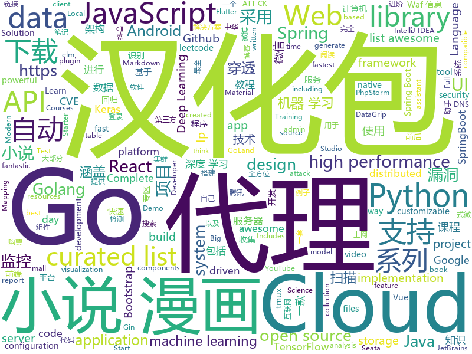

# 2019-12-24
See what the GitHub community is most excited about today.

## python
* [12306](https://github.com/testerSunshine/12306)(**935 stars today**): 12306智能刷票，订票
* [py12306](https://github.com/pjialin/py12306)(**292 stars today**): 🚂12306 购票助手，支持集群，多账号，多任务购票以及 Web 页面管理
* [wtfpython](https://github.com/satwikkansal/wtfpython)(**678 stars today**): Exploring Python through counter-intuitive snippets. If you think you know Python, think once more!
* [Deep-Learning-Papers-Reading-Roadmap](https://github.com/floodsung/Deep-Learning-Papers-Reading-Roadmap)(**47 stars today**): Deep Learning papers reading roadmap for anyone who are eager to learn this amazing tech!
* [python-small-examples](https://github.com/jackzhenguo/python-small-examples)(**93 stars today**): Python小例子、小Demo一网打尽。Python基础、Web开发、数据科学、机器学习、TensorFlow、Pytorch，一切都是小例子。
* [system-design-primer](https://github.com/donnemartin/system-design-primer)(**115 stars today**): Learn how to design large-scale systems. Prep for the system design interview. Includes Anki flashcards.
* [Douyin-Bot](https://github.com/wangshub/Douyin-Bot)(**40 stars today**): 😍Python 抖音机器人，论如何在抖音上找到漂亮小姐姐？
* [checkov](https://github.com/bridgecrewio/checkov)(**31 stars today**): Prevent cloud misconfigurations during build time
* [awesome-machine-learning](https://github.com/josephmisiti/awesome-machine-learning)(**26 stars today**): A curated list of awesome Machine Learning frameworks, libraries and software.
* [nlp-recipes](https://github.com/microsoft/nlp-recipes)(**45 stars today**): Natural Language Processing Best Practices & Examples
* [wttr.in](https://github.com/chubin/wttr.in)(**88 stars today**): ⛅️The right way to check the weather
* [youtube-dl](https://github.com/ytdl-org/youtube-dl)(**131 stars today**): Command-line program to download videos from YouTube.com and other video sites
* [alpaca-trade-api-python](https://github.com/alpacahq/alpaca-trade-api-python)(**6 stars today**): Python client for Alpaca's trade API
* [Cerberus](https://github.com/YagamiiLight/Cerberus)(**43 stars today**): 一款功能强大的漏洞扫描器，子域名爆破使用aioDNS，asyncio异步快速扫描，覆盖目标全方位资产进行批量漏洞扫描，中间件信息收集，自动收集ip代理，探测Waf信息时自动使用来保护本机真实Ip，在本机Ip被Waf杀死后，自动切换代理Ip进行扫描，Waf信息收集(国内外100+款waf信息)包括安全狗，云锁，阿里云，云盾，腾讯云等，提供部分已知waf bypass 方案，中间件漏洞检测(Thinkphp,weblogic等 CVE-2018-5955,CVE-2018-12613,CVE-2018-11759等)，支持SQL注入, XSS, 命令执行,文件包含, ssrf 漏洞扫描, 支持自定义漏洞邮箱推送功能
* [Mooc_Downloader](https://github.com/PyJun/Mooc_Downloader)(**3 stars today**): 慕课下载器，Mooc下载，中国大学下载，爱课程下载；支持视频，课件同时下载
* [LSTM-Neural-Network-for-Time-Series-Prediction](https://github.com/jaungiers/LSTM-Neural-Network-for-Time-Series-Prediction)(**9 stars today**): LSTM built using Keras Python package to predict time series steps and sequences. Includes sin wave and stock market data
* [quay](https://github.com/quay/quay)(**13 stars today**): Build, Store, and Distribute your Applications and Containers
* [streamlit](https://github.com/streamlit/streamlit)(**51 stars today**): Streamlit — The fastest way to build custom ML tools
* [manim](https://github.com/3b1b/manim)(**71 stars today**): Animation engine for explanatory math videos
* [keras-yolo3](https://github.com/qqwweee/keras-yolo3)(**18 stars today**): A Keras implementation of YOLOv3 (Tensorflow backend)
* [deep-learning-models](https://github.com/fchollet/deep-learning-models)(**12 stars today**): Keras code and weights files for popular deep learning models.
* [Python-100-Days](https://github.com/ZiniuLu/Python-100-Days)(**16 stars today**): 出处：https://github.com/jackfrued/Python-100-Days.git
* [nni](https://github.com/microsoft/nni)(**7 stars today**): An open source AutoML toolkit for neural architecture search, model compression and hyper-parameter tuning.
* [12306_code_server](https://github.com/YinAoXiong/12306_code_server)(**22 stars today**): 该仓库用于构建自托管的12306验证码识别服务器
* [YOLOv3_TensorFlow](https://github.com/wizyoung/YOLOv3_TensorFlow)(**6 stars today**): Complete YOLO v3 TensorFlow implementation. Support training on your own dataset.

## java
* [vhr](https://github.com/lenve/vhr)(**50 stars today**): 微人事是一个前后端分离的人力资源管理系统，项目采用SpringBoot+Vue开发。
* [JustAuth](https://github.com/justauth/JustAuth)(**392 stars today**): 💯史上最全的整合第三方登录的开源库。目前已支持Github、Gitee、微博、钉钉、百度、Coding、腾讯云开发者平台、OSChina、支付宝、QQ、微信、淘宝、Google、Facebook、抖音、领英、小米、微软、今日头条、Teambition、StackOverflow、Pinterest、人人、华为、企业微信、酷家乐、Gitlab、美团、饿了么和推特等第三方平台的授权登录。 Login, so easy!
* [advanced-java](https://github.com/doocs/advanced-java)(**98 stars today**): 😮互联网 Java 工程师进阶知识完全扫盲：涵盖高并发、分布式、高可用、微服务、海量数据处理等领域知识，后端同学必看，前端同学也可学习
* [mall-learning](https://github.com/macrozheng/mall-learning)(**34 stars today**): mall学习教程，架构、业务、技术要点全方位解析。mall项目（25k+star）是一套电商系统，使用现阶段主流技术实现。 涵盖了SpringBoot2.1.3、MyBatis3.4.6、Elasticsearch6.2.2、RabbitMQ3.7.15、Redis3.2、Mongodb3.2、Mysql5.7等技术，采用Docker容器化部署。
* [halo](https://github.com/halo-dev/halo)(**52 stars today**): ✍ Halo 一款现代化的个人独立博客系统
* [CS-Notes](https://github.com/CyC2018/CS-Notes)(**181 stars today**): 📚技术面试必备基础知识、Leetcode、计算机操作系统、计算机网络、系统设计、Java、Python、C++
* [SpringBlade](https://github.com/chillzhuang/SpringBlade)(**18 stars today**): SpringBlade 是一个由商业级项目升级优化而来的SpringCloud分布式微服务架构、SpringBoot单体式微服务架构并存的综合型项目，采用Java8 API重构了业务代码，完全遵循阿里巴巴编码规范。采用Spring Boot 2 、Spring Cloud Hoxton 、Mybatis 等核心技术，同时提供基于React和Vue的两个前端框架用于快速搭建企业级的SaaS多租户微服务平台。 官网：https://bladex.vip
* [seata](https://github.com/seata/seata)(**70 stars today**): 🔥Seata is an easy-to-use, high-performance, open source distributed transaction solution.
* [automatic-api-attack-tool](https://github.com/imperva/automatic-api-attack-tool)(**24 stars today**): Imperva's customizable API attack tool takes an API specification as an input, generates and runs attacks that are based on it as an output.
* [react-native-push-notification](https://github.com/zo0r/react-native-push-notification)(**4 stars today**): React Native Local and Remote Notifications
* [DoraemonKit](https://github.com/didi/DoraemonKit)(**129 stars today**): 简称 "DoKit" 。一款功能齐全的客户端（ iOS 、Android、微信小程序 ）研发助手，你值得拥有。
* [QMUI_Android](https://github.com/Tencent/QMUI_Android)(**88 stars today**): 提高 Android UI 开发效率的 UI 库
* [incubator-hudi](https://github.com/apache/incubator-hudi)(**4 stars today**): Upserts And Incremental Processing on Big Data
* [wooyun-payload](https://github.com/boy-hack/wooyun-payload)(**184 stars today**): 从wooyun中提取的payload，以及burp插件
* [fiction_house](https://github.com/201206030/fiction_house)(**44 stars today**): 小说精品屋是一个多平台（web、安卓app、微信小程序）、功能完善的响应式小说弹幕网站，包含精品小说专区、轻小说专区和漫画专区。包括小说/漫画分类、小说/漫画搜索、小说/漫画排行、完本小说/漫画、小说/漫画评分、小说/漫画在线阅读、小说/漫画书架、小说/漫画阅读记录、小说下载、小说弹幕、小说/漫画自动采集/更新/纠错、小说内容自动分享到微博、邮件自动推广、链接自动推送到百度搜索引擎等功能.
* [bazel](https://github.com/bazelbuild/bazel)(**28 stars today**): a fast, scalable, multi-language and extensible build system
* [DataSphereStudio](https://github.com/WeBankFinTech/DataSphereStudio)(**15 stars today**): DataSphereStudio is a one stop data application development& management portal, covering scenarios including data exchange, desensitization/cleansing, analysis/mining, quality measurement, visualization, and task scheduling.
* [XQuickEnergy](https://github.com/pansong291/XQuickEnergy)(**4 stars today**): 快速收取蚂蚁森林能量
* [start.spring.io](https://github.com/spring-io/start.spring.io)(**5 stars today**): https://start.spring.io
* [TubeMQ](https://github.com/Tencent/TubeMQ)(**40 stars today**): TubeMQ focuses on high-performance storage and transmission of massive data in big data scenarios
* [wgcloud](https://github.com/tianshiyeben/wgcloud)(**35 stars today**): linux开源服务器监控解决方案，IT运维，进程监控，集群监控，内存监控，CPU监控，心跳检测
* [eladmin](https://github.com/elunez/eladmin)(**47 stars today**): 项目基于 Spring Boot 2.1.0 、 Jpa、 Spring Security、redis、Vue的前后端分离的后台管理系统，项目采用分模块开发方式， 权限控制采用 RBAC，支持数据字典与数据权限管理，支持一键生成前后端代码，支持动态路由
* [java-tron](https://github.com/tronprotocol/java-tron)(**0 stars today**): Java implementation of the Tron whitepaper
* [material-components-android](https://github.com/material-components/material-components-android)(**18 stars today**): Modular and customizable Material Design UI components for Android
* [springcloud-learning](https://github.com/macrozheng/springcloud-learning)(**19 stars today**): 一套涵盖大部分核心组件使用的Spring Cloud教程，包括Spring Cloud Alibaba及分布式事务Seata，基于Spring Cloud Greenwich及SpringBoot 2.1.7。20篇文章，篇篇精华，30个Demo，涵盖大部分应用场景。

## unknown
* [Awesome-Hacking](https://github.com/Hack-with-Github/Awesome-Hacking)(**177 stars today**): A collection of various awesome lists for hackers, pentesters and security researchers
* [MixNMatch](https://github.com/Yuheng-Li/MixNMatch)(**97 stars today**): 
* [Blog](https://github.com/mqyqingfeng/Blog)(**32 stars today**): 冴羽写博客的地方，预计写四个系列：JavaScript深入系列、JavaScript专题系列、ES6系列、React系列。
* [jetbrains-in-chinese](https://github.com/pingfangx/jetbrains-in-chinese)(**27 stars today**): JetBrains 系列软件汉化包 关键字: Android Studio 3.5 汉化包 CLion 2019.3 汉化包 DataGrip 2019.3 汉化包 GoLand 2019.3 汉化包 IntelliJ IDEA 2019.3 汉化包 PhpStorm 2019.3 汉化包 PyCharm 2019.3 汉化包 Rider 2019.3 汉化包 RubyMine 2019.3 汉化包 WebStorm 2019.3 汉化包
* [goQuality-dev-contents](https://github.com/Integerous/goQuality-dev-contents)(**31 stars today**): { 고퀄리티⚡️개발 컨텐츠 모음 }
* [weekly](https://github.com/dt-fe/weekly)(**36 stars today**): 前端精读周刊
* [.tmux](https://github.com/gpakosz/.tmux)(**29 stars today**): 🇫🇷Oh My Tmux! Pretty & versatile tmux configuration made with❤️(imho the best tmux configuration that just works)
* [Book_List](https://github.com/mukeshmithrakumar/Book_List)(**5 stars today**): Python, Machine Learning, Deep Learning and Data Science Books
* [DeepLearning-500-questions](https://github.com/scutan90/DeepLearning-500-questions)(**42 stars today**): 深度学习500问，以问答形式对常用的概率知识、线性代数、机器学习、深度学习、计算机视觉等热点问题进行阐述，以帮助自己及有需要的读者。 全书分为18个章节，50余万字。由于水平有限，书中不妥之处恳请广大读者批评指正。 未完待续............ 如有意合作，联系scutjy2015@163.com 版权所有，违权必究 Tan 2018.06
* [12306model](https://github.com/testerSunshine/12306model)(**14 stars today**): 本地识别模型下载
* [kubernetes-the-hard-way](https://github.com/kelseyhightower/kubernetes-the-hard-way)(**24 stars today**): Bootstrap Kubernetes the hard way on Google Cloud Platform. No scripts.
* [awesome-osint](https://github.com/jivoi/awesome-osint)(**11 stars today**): 😱A curated list of amazingly awesome OSINT
* [A-to-Z-Resources-for-Students](https://github.com/dipakkr/A-to-Z-Resources-for-Students)(**28 stars today**): ✅Curated list of resources for college students
* [handbook](https://github.com/basecamp/handbook)(**9 stars today**): Basecamp Employee Handbook
* [FFXIV_Auxiliary_Tools](https://github.com/553469159/FFXIV_Auxiliary_Tools)(**8 stars today**): 
* [Flutter-Course-Resources](https://github.com/londonappbrewery/Flutter-Course-Resources)(**13 stars today**): Learn to Code While Building Apps - The Complete Flutter Development Bootcamp
* [awesome-taleb](https://github.com/cetiny/awesome-taleb)(**8 stars today**): A curated list of awesome things about Nassim Nicholas Taleb
* [awesome-kotlin](https://github.com/KotlinBy/awesome-kotlin)(**11 stars today**): A curated list of awesome Kotlin related stuff Inspired by awesome-java.
* [Machine-Learning-Tutorials](https://github.com/ujjwalkarn/Machine-Learning-Tutorials)(**5 stars today**): machine learning and deep learning tutorials, articles and other resources
* [flutter_vignettes](https://github.com/gskinnerTeam/flutter_vignettes)(**53 stars today**): A collection of fun Flutter experiments, created by gskinner, in partnership with Google.
* [PandaOCR](https://github.com/miaomiaosoft/PandaOCR)(**17 stars today**): PandaOCR - 图像字符云识别
* [free-programming-books-zh_CN](https://github.com/justjavac/free-programming-books-zh_CN)(**91 stars today**): 📚免费的计算机编程类中文书籍，欢迎投稿
* [curriculum](https://github.com/cncf/curriculum)(**4 stars today**): 📚Open Source Curriculum for CNCF Certification Courses
* [iCSS](https://github.com/chokcoco/iCSS)(**93 stars today**): 不止于 CSS

## javascript
* [discord.js](https://github.com/discordjs/discord.js)(**19 stars today**): A powerful JavaScript library for interacting with the Discord API
* [magnetW](https://github.com/xiandanin/magnetW)(**65 stars today**): 磁力链接聚合搜索 - https://magnetw.app
* [22120](https://github.com/dosyago/22120)(**185 stars today**): 🏛22120 - An archivist browser controller that caches everything you browse, a library server with full text search to serve your archive.
* [tesseract.js](https://github.com/naptha/tesseract.js)(**503 stars today**): Pure Javascript OCR for more than 100 Languages📖🎉🖥
* [outline](https://github.com/outline/outline)(**14 stars today**): The fastest wiki and knowledge base for growing teams. Beautiful, feature rich, markdown compatible and open source.
* [vant-weapp](https://github.com/youzan/vant-weapp)(**29 stars today**): 轻量、可靠的小程序 UI 组件库
* [UnblockNeteaseMusic](https://github.com/nondanee/UnblockNeteaseMusic)(**79 stars today**): Revive unavailable songs for Netease Cloud Music
* [gatsby](https://github.com/gatsbyjs/gatsby)(**37 stars today**): Build blazing fast, modern apps and websites with React
* [kutt](https://github.com/thedevs-network/kutt)(**178 stars today**): Free Modern URL Shortener.
* [tram](https://github.com/mitre-attack/tram)(**25 stars today**): Threat Report ATT&CK™ Mapping (TRAM) is a tool to aid analyst in mapping finished reports to ATT&CK.
* [cube-ui](https://github.com/didi/cube-ui)(**38 stars today**): 🔶A fantastic mobile ui lib implement by Vue
* [chinese-poetry](https://github.com/chinese-poetry/chinese-poetry)(**302 stars today**): The most comprehensive database of Chinese poetry 🧶最全中华古诗词数据库, 唐宋两朝近一万四千古诗人, 接近5.5万首唐诗加26万宋诗. 两宋时期1564位词人，21050首词。
* [flowy](https://github.com/alyssaxuu/flowy)(**101 stars today**): The minimal javascript library to create flowcharts✨
* [complete-javascript-course](https://github.com/jonasschmedtmann/complete-javascript-course)(**37 stars today**): Starter files, final projects and FAQ for my Complete JavaScript course
* [leetcode](https://github.com/azl397985856/leetcode)(**96 stars today**): LeetCode Solutions: A Record of My Problem Solving Journey.( leetcode题解，记录自己的leetcode解题之路。)
* [quasar](https://github.com/quasarframework/quasar)(**26 stars today**): Quasar Framework - Build high-performance VueJS user interfaces in record time
* [joi](https://github.com/hapijs/joi)(**12 stars today**): The most powerful data validation library for JS
* [generator-jhipster](https://github.com/jhipster/generator-jhipster)(**13 stars today**): Open Source application platform for creating Spring Boot + Angular/React projects in seconds!
* [Advanced-React](https://github.com/wesbos/Advanced-React)(**3 stars today**): Starter Files and Solutions for Full Stack Advanced React and GraphQL
* [material-components-web](https://github.com/material-components/material-components-web)(**11 stars today**): Modular and customizable Material Design UI components for the web
* [vxe-table](https://github.com/xuliangzhan/vxe-table)(**11 stars today**): 🐬vxe-table 表格解决方案
* [OwlCarousel2](https://github.com/OwlCarousel2/OwlCarousel2)(**5 stars today**): DEPRECATED jQuery Responsive Carousel.
* [dva](https://github.com/dvajs/dva)(**13 stars today**): 🌱React and redux based, lightweight and elm-style framework. (Inspired by elm and choo)
* [incubator-echarts](https://github.com/apache/incubator-echarts)(**68 stars today**): A powerful, interactive charting and visualization library for browser
* [overreacted.io](https://github.com/gaearon/overreacted.io)(**10 stars today**): Personal blog by Dan Abramov.

## html
* [homepage](https://github.com/omegasisters/homepage)(**48 stars today**): おめシスのホームページを作りたい
* [TranslatorX](https://github.com/pingfangx/TranslatorX)(**53 stars today**): JetBrains 系列软件汉化包 关键字: Android Studio 3.5 汉化包 CLion 2019.3 汉化包 DataGrip 2019.3 汉化包 GoLand 2019.3 汉化包 IntelliJ IDEA 2019.3 汉化包 PhpStorm 2019.3 汉化包 PyCharm 2019.3 汉化包 Rider 2019.3 汉化包 RubyMine 2019.3 汉化包 WebStorm 2019.3 汉化包
* [learning-area](https://github.com/mdn/learning-area)(**5 stars today**): Github repo for the MDN Learning Area.
* [go101](https://github.com/go101/go101)(**11 stars today**): An online book focusing on Go syntax/semantics.
* [awesome-webpack](https://github.com/webpack-contrib/awesome-webpack)(**3 stars today**): A curated list of awesome Webpack resources, libraries and tools
* [compat-table](https://github.com/kangax/compat-table)(**7 stars today**): ECMAScript 5/6/7 compatibility tables
* [skill-map](https://github.com/TeamStuQ/skill-map)(**16 stars today**): 程序员技能图谱
* [web-moderno](https://github.com/cod3rcursos/web-moderno)(**6 stars today**): 
* [rhasspy](https://github.com/synesthesiam/rhasspy)(**3 stars today**): Rhasspy voice assistant for Home Assistant and Hass.IO
* [deeplearning_ai_books](https://github.com/fengdu78/deeplearning_ai_books)(**19 stars today**): deeplearning.ai（吴恩达老师的深度学习课程笔记及资源）
* [signalstickers](https://github.com/romainricard/signalstickers)(**9 stars today**): A gallery of stickers for Signal, the secure messenger!
* [github-markdown-css](https://github.com/sindresorhus/github-markdown-css)(**12 stars today**): The minimal amount of CSS to replicate the GitHub Markdown style
* [webgpu-trial](https://github.com/takahirox/webgpu-trial)(**20 stars today**): WebGPU trial
* [Disclosures](https://github.com/badd1e/Disclosures)(**2 stars today**): Zero-day and N-day security vulnerability notes, analysis, and proof-of-concepts
* [webdevbootcamp](https://github.com/nax3t/webdevbootcamp)(**1 stars today**): All source code for back-end projects from the Web Developer Bootcamp
* [Coursera-ML-AndrewNg-Notes](https://github.com/fengdu78/Coursera-ML-AndrewNg-Notes)(**22 stars today**): 吴恩达老师的机器学习课程个人笔记
* [wpt](https://github.com/web-platform-tests/wpt)(**1 stars today**): Test suites for Web platform specs — including WHATWG, W3C, and others
* [coreui-free-bootstrap-admin-template](https://github.com/coreui/coreui-free-bootstrap-admin-template)(**5 stars today**): CoreUI is free bootstrap admin template
* [machine-learning-systems-design](https://github.com/chiphuyen/machine-learning-systems-design)(**37 stars today**): A booklet on machine learning systems design with exercises
* [startbootstrap-sb-admin-2](https://github.com/BlackrockDigital/startbootstrap-sb-admin-2)(**5 stars today**): A free, open source, Bootstrap admin theme created by Start Bootstrap
* [Machine-Learning](https://github.com/Jack-Cherish/Machine-Learning)(**11 stars today**): ⚡️机器学习实战（Python3）：kNN、决策树、贝叶斯、逻辑回归、SVM、线性回归、树回归
* [node-ytdl-core](https://github.com/fent/node-ytdl-core)(**4 stars today**): YouTube video downloader in javascript.
* [beginner-javascript](https://github.com/wesbos/beginner-javascript)(**22 stars today**): Slam Dunk JavaScript
* [Java-Interview-Advanced](https://github.com/shishan100/Java-Interview-Advanced)(**8 stars today**): 中华石杉--互联网Java进阶面试训练营
* [REKCARC-TSC-UHT](https://github.com/PKUanonym/REKCARC-TSC-UHT)(**17 stars today**): 清华大学计算机系课程攻略 Guidance for courses in Department of Computer Science and Technology, Tsinghua University

## go
* [go](https://github.com/json-iterator/go)(**19 stars today**): A high-performance 100% compatible drop-in replacement of "encoding/json"
* [bigcache](https://github.com/allegro/bigcache)(**255 stars today**): Efficient cache for gigabytes of data written in Go.
* [go](https://github.com/golang/go)(**57 stars today**): The Go programming language
* [go-micro](https://github.com/micro/go-micro)(**27 stars today**): A Go microservices development framework
* [thanos](https://github.com/thanos-io/thanos)(**14 stars today**): Highly available Prometheus setup with long term storage capabilities. CNCF Sandbox project.
* [nats-server](https://github.com/nats-io/nats-server)(**9 stars today**): High-Performance server for NATS, the cloud native messaging system.
* [chubaofs](https://github.com/chubaofs/chubaofs)(**167 stars today**): A distributed storage system for cloud native applications to separate storage from compute.
* [learn-go-with-tests](https://github.com/quii/learn-go-with-tests)(**19 stars today**): Learn Go with test-driven development
* [httprouter](https://github.com/julienschmidt/httprouter)(**18 stars today**): A high performance HTTP request router that scales well
* [gorm](https://github.com/jinzhu/gorm)(**34 stars today**): The fantastic ORM library for Golang, aims to be developer friendly
* [dapr](https://github.com/dapr/dapr)(**28 stars today**): Dapr is a portable, event-driven, runtime for building distributed applications across cloud and edge.
* [migrate](https://github.com/golang-migrate/migrate)(**11 stars today**): Database migrations. CLI and Golang library.
* [gin](https://github.com/gin-gonic/gin)(**39 stars today**): Gin is a HTTP web framework written in Go (Golang). It features a Martini-like API with much better performance -- up to 40 times faster. If you need smashing performance, get yourself some Gin.
* [GolangTraining](https://github.com/GoesToEleven/GolangTraining)(**9 stars today**): Training for Golang (go language)
* [protoc-gen-validate](https://github.com/envoyproxy/protoc-gen-validate)(**4 stars today**): protoc plugin to generate polyglot message validators
* [mongo-go-driver](https://github.com/mongodb/mongo-go-driver)(**8 stars today**): The Go driver for MongoDB
* [frp](https://github.com/fatedier/frp)(**49 stars today**): A fast reverse proxy to help you expose a local server behind a NAT or firewall to the internet.
* [cors](https://github.com/rs/cors)(**2 stars today**): Go net/http configurable handler to handle CORS requests
* [graphql](https://github.com/graphql-go/graphql)(**9 stars today**): An implementation of GraphQL for Go / Golang
* [Free-PAC](https://github.com/xiaoming2028/Free-PAC)(**115 stars today**): 科学上网/梯子/自由上网/翻墙 SS/SSR/V2Ray/Brook 搭建教程
* [redigo](https://github.com/gomodule/redigo)(**9 stars today**): Go client for Redis
* [telegraf](https://github.com/influxdata/telegraf)(**11 stars today**): The plugin-driven server agent for collecting & reporting metrics.
* [vault](https://github.com/hashicorp/vault)(**9 stars today**): A tool for secrets management, encryption as a service, and privileged access management
* [goproxy](https://github.com/snail007/goproxy)(**27 stars today**): Proxy是高性能全功能的http代理、https代理、socks5代理、内网穿透、内网穿透p2p、内网穿透代理、内网穿透反向代理、内网穿透服务器、Websocket代理、TCP代理、UDP代理、DNS代理、DNS加密代理，代理API认证，全能跨平台代理服务器。
* [viper](https://github.com/spf13/viper)(**20 stars today**): Go configuration with fangs

## WordCloud

