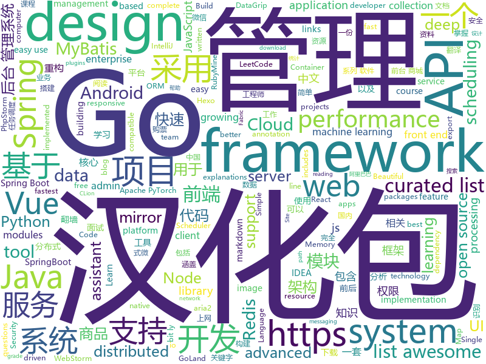

# 2019-12-26
See what the GitHub community is most excited about today.

## python
* [12306](https://github.com/testerSunshine/12306)(**1,968 stars today**): 12306智能刷票，订票
* [py12306](https://github.com/pjialin/py12306)(**906 stars today**): 🚂12306 购票助手，支持集群，多账号，多任务购票以及 Web 页面管理
* [system-design-primer](https://github.com/donnemartin/system-design-primer)(**220 stars today**): Learn how to design large-scale systems. Prep for the system design interview. Includes Anki flashcards.
* [vedaseg](https://github.com/Media-Smart/vedaseg)(**62 stars today**): A semantic segmentation toolbox based on pytorch
* [nlp-recipes](https://github.com/microsoft/nlp-recipes)(**80 stars today**): Natural Language Processing Best Practices & Examples
* [PhoneInfoga](https://github.com/sundowndev/PhoneInfoga)(**8 stars today**): Advanced information gathering & OSINT tool for phone numbers
* [12306_code_server](https://github.com/YinAoXiong/12306_code_server)(**57 stars today**): 该仓库用于构建自托管的12306验证码识别服务器
* [FRDA](https://github.com/Star-Clouds/FRDA)(**39 stars today**): Face reconstruction and dense alignment
* [trax](https://github.com/google/trax)(**95 stars today**): Trax — your path to advanced deep learning
* [USTC-Course](https://github.com/USTC-Resource/USTC-Course)(**15 stars today**): ❤️中国科学技术大学课程资源
* [PyTorch-YOLOv3](https://github.com/eriklindernoren/PyTorch-YOLOv3)(**20 stars today**): Minimal PyTorch implementation of YOLOv3
* [incubator-tvm](https://github.com/apache/incubator-tvm)(**14 stars today**): Open deep learning compiler stack for cpu, gpu and specialized accelerators
* [KnowledgeGraphData](https://github.com/ownthink/KnowledgeGraphData)(**21 stars today**): 史上最大规模1.4亿中文知识图谱开源下载
* [Tello-Python](https://github.com/dji-sdk/Tello-Python)(**4 stars today**): This is a collection of python modules that interact with the Ryze Tello drone.
* [labelme](https://github.com/wkentaro/labelme)(**15 stars today**): Image Polygonal Annotation with Python (polygon, rectangle, circle, line, point and image-level flag annotation).
* [optuna](https://github.com/optuna/optuna)(**10 stars today**): A hyperparameter optimization framework
* [DeDRM_tools](https://github.com/apprenticeharper/DeDRM_tools)(**13 stars today**): DeDRM tools for ebooks
* [redis-rdb-tools](https://github.com/sripathikrishnan/redis-rdb-tools)(**9 stars today**): Parse Redis dump.rdb files, Analyze Memory, and Export Data to JSON
* [Deep-Learning-Papers-Reading-Roadmap](https://github.com/floodsung/Deep-Learning-Papers-Reading-Roadmap)(**195 stars today**): Deep Learning papers reading roadmap for anyone who are eager to learn this amazing tech!
* [chainer](https://github.com/chainer/chainer)(**3 stars today**): A flexible framework of neural networks for deep learning
* [Mario-Level-1](https://github.com/justinmeister/Mario-Level-1)(**11 stars today**): The first level of Super Mario Bros made with Python and Pygame.
* [XSS-Finder](https://github.com/haroonawanofficial/XSS-Finder)(**12 stars today**): Heavy-duty and Advanced Cross Site Scripting Scanner
* [ml-agents](https://github.com/Unity-Technologies/ml-agents)(**22 stars today**): Unity Machine Learning Agents Toolkit
* [pytorch-image-models](https://github.com/rwightman/pytorch-image-models)(**10 stars today**): PyTorch image models, scripts, pretrained weights -- (SE)ResNet/ResNeXT, DPN, EfficientNet, MixNet, MobileNet-V3/V2/V1, MNASNet, Single-Path NAS, FBNet, and more
* [torch2trt](https://github.com/NVIDIA-AI-IOT/torch2trt)(**16 stars today**): An easy to use PyTorch to TensorRT converter

## java
* [advanced-java](https://github.com/doocs/advanced-java)(**281 stars today**): 😮互联网 Java 工程师进阶知识完全扫盲：涵盖高并发、分布式、高可用、微服务、海量数据处理等领域知识，后端同学必看，前端同学也可学习
* [JavaGuide](https://github.com/Snailclimb/JavaGuide)(**268 stars today**): 【Java学习+面试指南】 一份涵盖大部分Java程序员所需要掌握的核心知识。
* [ForestBlog](https://github.com/saysky/ForestBlog)(**25 stars today**): 一个简单漂亮的SSM(Spring+SpringMVC+Mybatis)博客系统
* [vhr](https://github.com/lenve/vhr)(**173 stars today**): 微人事是一个前后端分离的人力资源管理系统，项目采用SpringBoot+Vue开发。
* [incubator-hudi](https://github.com/apache/incubator-hudi)(**15 stars today**): Upserts And Incremental Processing on Big Data
* [SpringBlade](https://github.com/chillzhuang/SpringBlade)(**65 stars today**): SpringBlade 是一个由商业级项目升级优化而来的SpringCloud分布式微服务架构、SpringBoot单体式微服务架构并存的综合型项目，采用Java8 API重构了业务代码，完全遵循阿里巴巴编码规范。采用Spring Boot 2 、Spring Cloud Hoxton 、Mybatis 等核心技术，同时提供基于React和Vue的两个前端框架用于快速搭建企业级的SaaS多租户微服务平台。 官网：https://bladex.vip
* [nacos](https://github.com/alibaba/nacos)(**53 stars today**): an easy-to-use dynamic service discovery, configuration and service management platform for building cloud native applications.
* [seata](https://github.com/seata/seata)(**91 stars today**): 🔥Seata is an easy-to-use, high-performance, open source distributed transaction solution.
* [redisson](https://github.com/redisson/redisson)(**51 stars today**): Redisson - Redis Java client with features of In-Memory Data Grid. Over 50 Redis based Java objects and services: Set, Multimap, SortedSet, Map, List, Queue, Deque, Semaphore, Lock, AtomicLong, Map Reduce, Publish / Subscribe, Bloom filter, Spring Cache, Tomcat, Scheduler, JCache API, Hibernate, MyBatis, RPC ...
* [dubbo-admin](https://github.com/apache/dubbo-admin)(**12 stars today**): The ops and reference implementation for Apache Dubbo
* [soul](https://github.com/Dromara/soul)(**18 stars today**): High-Performance Java API Gateway
* [arthas](https://github.com/alibaba/arthas)(**69 stars today**): Alibaba Java Diagnostic Tool Arthas/Alibaba Java诊断利器Arthas
* [eladmin](https://github.com/elunez/eladmin)(**80 stars today**): 项目基于 Spring Boot 2.1.0 、 Jpa、 Spring Security、redis、Vue的前后端分离的后台管理系统，项目采用分模块开发方式， 权限控制采用 RBAC，支持数据字典与数据权限管理，支持一键生成前后端代码，支持动态路由
* [rocketmq](https://github.com/apache/rocketmq)(**36 stars today**): Mirror of Apache RocketMQ
* [druid](https://github.com/alibaba/druid)(**48 stars today**): 阿里巴巴数据库事业部出品，为监控而生的数据库连接池
* [skywalking](https://github.com/apache/skywalking)(**52 stars today**): APM, Application Performance Monitoring System
* [MVVMHabit](https://github.com/goldze/MVVMHabit)(**20 stars today**): 👕基于谷歌最新AAC架构，MVVM设计模式的一套快速开发库，整合Okhttp+RxJava+Retrofit+Glide等主流模块，满足日常开发需求。使用该框架可以快速开发一个高质量、易维护的Android应用。
* [ExoPlayer](https://github.com/google/ExoPlayer)(**19 stars today**): An extensible media player for Android
* [java-design-patterns](https://github.com/iluwatar/java-design-patterns)(**72 stars today**): Design patterns implemented in Java
* [xxl-job](https://github.com/xuxueli/xxl-job)(**65 stars today**): A distributed task scheduling framework.（分布式任务调度平台XXL-JOB）
* [incubator-dolphinscheduler](https://github.com/apache/incubator-dolphinscheduler)(**14 stars today**): Dolphin Scheduler is a distributed and easy-to-expand visual DAG workflow scheduling system, dedicated to solving the complex dependencies in data processing, making the scheduling system out of the box for data processing.(分布式易扩展的可视化工作流任务调度)
* [LeetCodeAnimation](https://github.com/MisterBooo/LeetCodeAnimation)(**382 stars today**): Demonstrate all the questions on LeetCode in the form of animation.（用动画的形式呈现解LeetCode题目的思路）
* [mall](https://github.com/macrozheng/mall)(**229 stars today**): mall项目是一套电商系统，包括前台商城系统及后台管理系统，基于SpringBoot+MyBatis实现，采用Docker容器化部署。 前台商城系统包含首页门户、商品推荐、商品搜索、商品展示、购物车、订单流程、会员中心、客户服务、帮助中心等模块。 后台管理系统包含商品管理、订单管理、会员管理、促销管理、运营管理、内容管理、统计报表、财务管理、权限管理、设置等模块。
* [spring-boot-api-project-seed](https://github.com/lihengming/spring-boot-api-project-seed)(**31 stars today**): 🌱🚀一个基于Spring Boot & MyBatis的种子项目，用于快速构建中小型API、RESTful API项目~
* [cas](https://github.com/apereo/cas)(**5 stars today**): Apereo CAS - Enterprise Single Sign On for all earthlings and beyond.

## unknown
* [free-programming-books](https://github.com/EbookFoundation/free-programming-books)(**109 stars today**): 📚Freely available programming books
* [Awesome-Hacking](https://github.com/Hack-with-Github/Awesome-Hacking)(**697 stars today**): A collection of various awesome lists for hackers, pentesters and security researchers
* [developer-roadmap](https://github.com/kamranahmedse/developer-roadmap)(**115 stars today**): Roadmap to becoming a web developer in 2019
* [free-programming-books-zh_CN](https://github.com/justjavac/free-programming-books-zh_CN)(**232 stars today**): 📚免费的计算机编程类中文书籍，欢迎投稿
* [xray](https://github.com/chaitin/xray)(**39 stars today**): 一款完善的安全评估工具，支持常见 web 安全问题扫描和自定义 poc | 使用之前务必先阅读文档
* [build-your-own-x](https://github.com/danistefanovic/build-your-own-x)(**279 stars today**): 🤓Build your own (insert technology here)
* [12306model](https://github.com/testerSunshine/12306model)(**22 stars today**): 本地识别模型下载
* [machine-learning-for-software-engineers](https://github.com/ZuzooVn/machine-learning-for-software-engineers)(**69 stars today**): A complete daily plan for studying to become a machine learning engineer.
* [awesome-computer-vision](https://github.com/jbhuang0604/awesome-computer-vision)(**58 stars today**): A curated list of awesome computer vision resources
* [awesome-android-ui](https://github.com/wasabeef/awesome-android-ui)(**32 stars today**): A curated list of awesome Android UI/UX libraries
* [jetbrains-in-chinese](https://github.com/pingfangx/jetbrains-in-chinese)(**43 stars today**): JetBrains 系列软件汉化包 关键字: Android Studio 3.5 汉化包 CLion 2019.3 汉化包 DataGrip 2019.3 汉化包 GoLand 2019.3 汉化包 IntelliJ IDEA 2019.3 汉化包 PhpStorm 2019.3 汉化包 PyCharm 2019.3 汉化包 Rider 2019.3 汉化包 RubyMine 2019.3 汉化包 WebStorm 2019.3 汉化包
* [iCSS](https://github.com/chokcoco/iCSS)(**130 stars today**): 不止于 CSS
* [regular-investing-in-box](https://github.com/xiaolai/regular-investing-in-box)(**23 stars today**): 定投改变命运 —— 让时间陪你慢慢变富
* [udacity-nanodegrees](https://github.com/mikesprague/udacity-nanodegrees)(**12 stars today**): 🎓List of Udacity Nanodegree programs with links to the free courses in their curricula
* [app-ideas](https://github.com/florinpop17/app-ideas)(**44 stars today**): A Collection of application ideas which can be used to improve your coding skills.
* [Miles](https://github.com/ugvf2009/Miles)(**5 stars today**): 二爷翻墙，专注翻墙30年，但没有掌握核心科技^_^
* [javascript-questions](https://github.com/lydiahallie/javascript-questions)(**41 stars today**): A long list of (advanced) JavaScript questions, and their explanations✨
* [gold-miner](https://github.com/xitu/gold-miner)(**52 stars today**): 🥇掘金翻译计划，可能是世界最大最好的英译中技术社区，最懂读者和译者的翻译平台：
* [awesome-nodejs](https://github.com/sindresorhus/awesome-nodejs)(**113 stars today**): ⚡️Delightful Node.js packages and resources
* [wxappUnpacker](https://github.com/qwerty472123/wxappUnpacker)(**10 stars today**): wxml被“编译“后”压缩“一下多好！😀
* [awesome-taleb](https://github.com/cetiny/awesome-taleb)(**15 stars today**): A curated list of awesome things about Nassim Nicholas Taleb
* [NiNiTechnology](https://github.com/pipirapira/NiNiTechnology)(**8 stars today**): ff14时间轴和触发器
* [web-interview](https://github.com/yisainan/web-interview)(**8 stars today**): 我是「齐丶先丶森」，公众号「前端面试秘籍」作者，收集整理全网面试题及面试技巧，旨在帮助前端工程师们找到一份好工作！
* [awesome-deep-learning](https://github.com/ChristosChristofidis/awesome-deep-learning)(**52 stars today**): A curated list of awesome Deep Learning tutorials, projects and communities.

## javascript
* [outline](https://github.com/outline/outline)(**291 stars today**): The fastest wiki and knowledge base for growing teams. Beautiful, feature rich, markdown compatible and open source.
* [Motrix](https://github.com/agalwood/Motrix)(**256 stars today**): A full-featured download manager.
* [Learn-Vue-Source-Code](https://github.com/NLRX-WJC/Learn-Vue-Source-Code)(**253 stars today**): 👍👍逐行剖析Vue.js源码 在线阅读地址https://nlrx-wjc.github.io/Learn-Vue-Source-Code/
* [Awesome-Design-Tools](https://github.com/LisaDziuba/Awesome-Design-Tools)(**176 stars today**): The best design tools and plugins for everything👉
* [magnetW](https://github.com/xiandanin/magnetW)(**299 stars today**): 磁力链接聚合搜索 - https://magnetw.app
* [homebridge](https://github.com/nfarina/homebridge)(**20 stars today**): HomeKit support for the impatient
* [MagicMirror](https://github.com/MichMich/MagicMirror)(**13 stars today**): MagicMirror² is an open source modular smart mirror platform. With a growing list of installable modules, the MagicMirror² allows you to convert your hallway or bathroom mirror into your personal assistant.
* [vue](https://github.com/vuejs/vue)(**152 stars today**): 🖖Vue.js is a progressive, incrementally-adoptable JavaScript framework for building UI on the web.
* [three.js](https://github.com/mrdoob/three.js)(**67 stars today**): JavaScript 3D library.
* [TIMSDK](https://github.com/tencentyun/TIMSDK)(**3 stars today**): 腾讯云即时通信 IM 服务，国内下载镜像：
* [ice](https://github.com/alibaba/ice)(**19 stars today**): 🚀Simple and friendly front-end development system（飞冰，简单而友好的前端研发体系 ）
* [comlink](https://github.com/GoogleChromeLabs/comlink)(**24 stars today**): Comlink makes WebWorkers enjoyable.
* [javascript-algorithms](https://github.com/trekhleb/javascript-algorithms)(**139 stars today**): 📝Algorithms and data structures implemented in JavaScript with explanations and links to further readings
* [awesome-blockchain-cn](https://github.com/chaozh/awesome-blockchain-cn)(**20 stars today**): 收集所有区块链(BlockChain)技术开发相关资料，包括Fabric和Ethereum开发资料
* [BaiduExporter](https://github.com/acgotaku/BaiduExporter)(**20 stars today**): Assistant for Baidu to export download links to aria2/aria2-rpc
* [realworld](https://github.com/gothinkster/realworld)(**127 stars today**): "The mother of all demo apps" — Exemplary fullstack Medium.com clone powered by React, Angular, Node, Django, and many more🏅
* [style2paints](https://github.com/lllyasviel/style2paints)(**15 stars today**): sketch + style = paints🎨
* [Orca](https://github.com/hundredrabbits/Orca)(**8 stars today**): Esoteric Programming Language
* [egg](https://github.com/eggjs/egg)(**26 stars today**): 🥚Born to build better enterprise frameworks and apps with Node.js & Koa
* [plugins](https://github.com/rollup/plugins)(**11 stars today**): 🍣The one-stop shop for official Rollup plugins
* [Spring-Cloud-Admin](https://github.com/wxiaoqi/Spring-Cloud-Admin)(**12 stars today**): Cloud-Admin是国内首个基于Spring Cloud微服务化开发平台，具有统一授权、认证后台管理系统，其中包含具备用户管理、资源权限管理、网关API管理等多个模块，支持多业务系统并行开发，可以作为后端服务的开发脚手架。代码简洁，架构清晰，适合学习和直接项目中使用。核心技术采用Spring Boot2以及Spring Cloud Gateway相关核心组件，前端采用vue-element-admin组件。
* [baidupankey](https://github.com/wu-dada/baidupankey)(**5 stars today**): 查询百度网盘&蓝奏盘提取码
* [weui-wxss](https://github.com/Tencent/weui-wxss)(**23 stars today**): A UI library by WeChat official design team, includes the most useful widgets/modules.
* [yarn](https://github.com/yarnpkg/yarn)(**18 stars today**): 📦🐈Fast, reliable, and secure dependency management.
* [pai](https://github.com/microsoft/pai)(**6 stars today**): Resource scheduling and cluster management for AI

## html
* [qiubaiying.github.io](https://github.com/qiubaiying/qiubaiying.github.io)(**9 stars today**): BY Blog ->
* [tabler](https://github.com/tabler/tabler)(**27 stars today**): Tabler is free and open-source HTML Dashboard UI Kit built on Bootstrap
* [machine-learning-systems-design](https://github.com/chiphuyen/machine-learning-systems-design)(**61 stars today**): A booklet on machine learning systems design with exercises
* [TranslatorX](https://github.com/pingfangx/TranslatorX)(**148 stars today**): JetBrains 系列软件汉化包 关键字: Android Studio 3.5 汉化包 CLion 2019.3 汉化包 DataGrip 2019.3 汉化包 GoLand 2019.3 汉化包 IntelliJ IDEA 2019.3 汉化包 PhpStorm 2019.3 汉化包 PyCharm 2019.3 汉化包 Rider 2019.3 汉化包 RubyMine 2019.3 汉化包 WebStorm 2019.3 汉化包
* [awesome-piracy](https://github.com/Igglybuff/awesome-piracy)(**19 stars today**): A curated list of awesome warez and piracy links
* [phantomjs](https://github.com/ariya/phantomjs)(**11 stars today**): Scriptable Headless Browser
* [docs](https://github.com/pingcap/docs)(**1 stars today**): TiDB/TiKV/PD documents.
* [pcc_2e](https://github.com/ehmatthes/pcc_2e)(**5 stars today**): Online resources for Python Crash Course (Second Edition), from No Starch Press
* [TinDog-Start](https://github.com/londonappbrewery/TinDog-Start)(**3 stars today**): 
* [rhasspy](https://github.com/synesthesiam/rhasspy)(**7 stars today**): Rhasspy voice assistant for Home Assistant and Hass.IO
* [ng-alain](https://github.com/ng-alain/ng-alain)(**4 stars today**): NG-ZORRO admin panel front-end framework (netlify mirror https://netlify.ng-alain.com/)
* [wechat_web_devtools](https://github.com/cytle/wechat_web_devtools)(**7 stars today**): 微信开发者工具(微信小程序)linux完美支持
* [CobaltStrikeForensic](https://github.com/RomanEmelyanov/CobaltStrikeForensic)(**43 stars today**): Toolset for research malware and Cobalt Strike beacons
* [flutter-in-action](https://github.com/flutterchina/flutter-in-action)(**23 stars today**): 《Flutter实战》电子书
* [OneList](https://github.com/MoeClub/OneList)(**20 stars today**): Simple index for onedrive
* [xiaolai.github.io](https://github.com/xiaolai/xiaolai.github.io)(**6 stars today**): an ever-growing brain
* [REKCARC-TSC-UHT](https://github.com/PKUanonym/REKCARC-TSC-UHT)(**23 stars today**): 清华大学计算机系课程攻略 Guidance for courses in Department of Computer Science and Technology, Tsinghua University
* [speedtest](https://github.com/librespeed/speedtest)(**6 stars today**): Self-hosted Speedtest for HTML5 and more. Easy setup, examples, configurable, mobile friendly. Supports PHP, Node, Multiple servers, and more
* [hackathon-toolkit](https://github.com/GoogleCloudPlatform/hackathon-toolkit)(**33 stars today**): GCP Hackathon Toolkit
* [d3js_doc](https://github.com/xswei/d3js_doc)(**5 stars today**): D3js中文文档 D3中文📊📈🎉
* [typedoc](https://github.com/TypeStrong/typedoc)(**4 stars today**): Documentation generator for TypeScript projects.
* [foundation-sites](https://github.com/foundation/foundation-sites)(**7 stars today**): The most advanced responsive front-end framework in the world. Quickly create prototypes and production code for sites that work on any kind of device.
* [blackeye](https://github.com/thelinuxchoice/blackeye)(**3 stars today**): The most complete Phishing Tool, with 32 templates +1 customizable
* [fluxion](https://github.com/FluxionNetwork/fluxion)(**6 stars today**): Fluxion is a remake of linset by vk496 with less bugs and enhanced functionality.
* [hexo-theme-matery](https://github.com/blinkfox/hexo-theme-matery)(**15 stars today**): A beautiful hexo blog theme with material design and responsive design.一个基于材料设计和响应式设计而成的全面、美观的Hexo主题。

## go
* [awesome-go](https://github.com/avelino/awesome-go)(**96 stars today**): A curated list of awesome Go frameworks, libraries and software
* [glow](https://github.com/charmbracelet/glow)(**306 stars today**): Render markdown on the CLI, with pizzazz! 💅🏻
* [frp](https://github.com/fatedier/frp)(**121 stars today**): A fast reverse proxy to help you expose a local server behind a NAT or firewall to the internet.
* [runtime](https://github.com/kata-containers/runtime)(**63 stars today**): Kata Containers runtime
* [xorm](https://github.com/go-xorm/xorm)(**8 stars today**): Simple and Powerful ORM for Go, support mysql,postgres,tidb,sqlite3,mssql,oracle, Moved to https://gitea.com/xorm/xorm
* [goldmark](https://github.com/yuin/goldmark)(**37 stars today**): 🏆A markdown parser written in Go. Easy to extend, standard(CommonMark) compliant, well structured.
* [protobuf](https://github.com/golang/protobuf)(**14 stars today**): Go support for Google's protocol buffers
* [coca](https://github.com/phodal/coca)(**125 stars today**): Coca is a toolbox which is design for legacy system refactoring. Coca 是一个用于系统重构、系统迁移和系统分析的瑞士军刀。它可以分析代码中的 badsmell，行数统计，分析调用与依赖，进行 Git 分析，以及自动化重构等。
* [kratos](https://github.com/bilibili/kratos)(**57 stars today**): Kratos是bilibili开源的一套Go微服务框架，包含大量微服务相关框架及工具。
* [Free-PAC](https://github.com/xiaoming2028/Free-PAC)(**174 stars today**): 科学上网/梯子/自由上网/翻墙 SS/SSR/V2Ray/Brook 搭建教程
* [nats-server](https://github.com/nats-io/nats-server)(**9 stars today**): High-Performance server for NATS, the cloud native messaging system.
* [redis](https://github.com/go-redis/redis)(**17 stars today**): Type-safe Redis client for Golang
* [mongo-go-driver](https://github.com/mongodb/mongo-go-driver)(**13 stars today**): The Go driver for MongoDB
* [fabric](https://github.com/hyperledger/fabric)(**30 stars today**): Hyperledger Fabric is an enterprise-grade permissioned distributed ledger framework for developing solutions and applications. Its modular and versatile design satisfies a broad range of industry use cases. It offers a unique approach to consensus that enables performance at scale while preserving privacy.
* [clash](https://github.com/Dreamacro/clash)(**44 stars today**): A rule-based tunnel in Go.
* [chat](https://github.com/tinode/chat)(**7 stars today**): Instant messaging server; backend in Go; iOS, Android, web, command line clients; chatbots
* [go-plugins](https://github.com/micro/go-plugins)(**16 stars today**): Community maintained plugins for micro
* [v2ray-core](https://github.com/v2ray/v2ray-core)(**86 stars today**): A platform for building proxies to bypass network restrictions.
* [go-ipfs](https://github.com/ipfs/go-ipfs)(**12 stars today**): IPFS implementation in Go
* [iris](https://github.com/kataras/iris)(**33 stars today**): 感谢中国开发者 - https://bit.ly/謝謝 | The fastest community-driven web framework for Go. Webassembly, Automatic HTTPS with Public Domain, MVC, Sessions, Caching, Versioning API, Problem API, Websocket, Dependency Injection and more. Fully compatible with the standard library and 3rd-party middleware packages. | https://bit.ly/iriscandothat1 | https://bi…
* [go-micro](https://github.com/micro/go-micro)(**172 stars today**): A Go microservices development framework
* [kubernetes](https://github.com/kubernetes/kubernetes)(**93 stars today**): Production-Grade Container Scheduling and Management
* [gorm](https://github.com/jinzhu/gorm)(**42 stars today**): The fantastic ORM library for Golang, aims to be developer friendly
* [learn-go-with-tests](https://github.com/quii/learn-go-with-tests)(**45 stars today**): Learn Go with test-driven development
* [gin](https://github.com/gin-gonic/gin)(**64 stars today**): Gin is a HTTP web framework written in Go (Golang). It features a Martini-like API with much better performance -- up to 40 times faster. If you need smashing performance, get yourself some Gin.

## WordCloud

