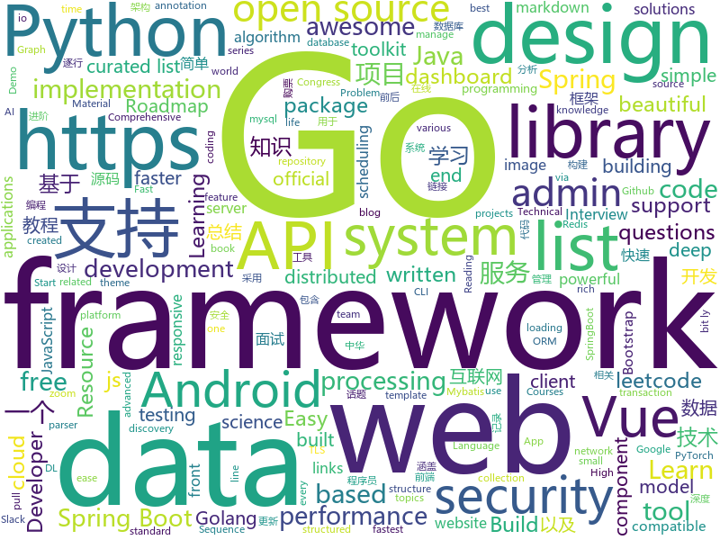

# 2019-12-27
See what the GitHub community is most excited about today.

## python
* [py12306](https://github.com/pjialin/py12306)(**1,083 stars today**): 🚂12306 购票助手，支持集群，多账号，多任务购票以及 Web 页面管理
* [system-design-primer](https://github.com/donnemartin/system-design-primer)(**237 stars today**): Learn how to design large-scale systems. Prep for the system design interview. Includes Anki flashcards.
* [nni](https://github.com/microsoft/nni)(**151 stars today**): An open source AutoML toolkit for neural architecture search, model compression and hyper-parameter tuning.
* [ru_transformers](https://github.com/mgrankin/ru_transformers)(**75 stars today**): 
* [12306](https://github.com/testerSunshine/12306)(**1,132 stars today**): 12306智能刷票，订票
* [PrettyErrors](https://github.com/onelivesleft/PrettyErrors)(**37 stars today**): Prettify Python exception output to make it legible.
* [metaflow](https://github.com/Netflix/metaflow)(**27 stars today**): Build and manage real-life data science projects with ease.
* [fairseq](https://github.com/pytorch/fairseq)(**19 stars today**): Facebook AI Research Sequence-to-Sequence Toolkit written in Python.
* [integration](https://github.com/hacs/integration)(**7 stars today**): Manage (Install, track, upgrade) and discover custom elements for Home Assistant.
* [labelme](https://github.com/wkentaro/labelme)(**16 stars today**): Image Polygonal Annotation with Python (polygon, rectangle, circle, line, point and image-level flag annotation).
* [dagster](https://github.com/dagster-io/dagster)(**10 stars today**): A Python library for building data applications: ETL, ML, Data Pipelines, and more.
* [typer](https://github.com/tiangolo/typer)(**116 stars today**): Typer, build great CLIs. Easy to code. Based on Python type hints.
* [ParlAI](https://github.com/facebookresearch/ParlAI)(**8 stars today**): A framework for training and evaluating AI models on a variety of openly available dialogue datasets.
* [maskrcnn-benchmark](https://github.com/facebookresearch/maskrcnn-benchmark)(**12 stars today**): Fast, modular reference implementation of Instance Segmentation and Object Detection algorithms in PyTorch.
* [python-cheatsheet](https://github.com/gto76/python-cheatsheet)(**12 stars today**): Comprehensive Python Cheatsheet
* [dgl](https://github.com/dmlc/dgl)(**24 stars today**): Python package built to ease deep learning on graph, on top of existing DL frameworks.
* [peewee](https://github.com/coleifer/peewee)(**10 stars today**): a small, expressive orm -- supports postgresql, mysql and sqlite
* [interview_internal_reference](https://github.com/0voice/interview_internal_reference)(**46 stars today**): 2019年最新总结，阿里，腾讯，百度，美团，头条等技术面试题目，以及答案，专家出题人分析汇总。
* [models](https://github.com/PaddlePaddle/models)(**21 stars today**): Pre-trained and Reproduced Deep Learning Models （『飞桨』官方模型库，包含多种学术前沿和工业场景验证的深度学习模型）
* [trax](https://github.com/google/trax)(**42 stars today**): Trax — your path to advanced deep learning
* [catalyst](https://github.com/catalyst-team/catalyst)(**4 stars today**): Accelerated DL & RL
* [celery](https://github.com/celery/celery)(**18 stars today**): Distributed Task Queue (development branch)
* [google-api-python-client](https://github.com/googleapis/google-api-python-client)(**7 stars today**): 🐍The official Python client library for Google's discovery based APIs.
* [12306_code_server](https://github.com/YinAoXiong/12306_code_server)(**36 stars today**): 该仓库用于构建自托管的12306验证码识别服务器

## java
* [advanced-java](https://github.com/doocs/advanced-java)(**521 stars today**): 😮互联网 Java 工程师进阶知识完全扫盲：涵盖高并发、分布式、高可用、微服务、海量数据处理等领域知识，后端同学必看，前端同学也可学习
* [spring-boot](https://github.com/spring-projects/spring-boot)(**42 stars today**): Spring Boot
* [JavaGuide](https://github.com/Snailclimb/JavaGuide)(**441 stars today**): 【Java学习+面试指南】 一份涵盖大部分Java程序员所需要掌握的核心知识。
* [nacos](https://github.com/alibaba/nacos)(**29 stars today**): an easy-to-use dynamic service discovery, configuration and service management platform for building cloud native applications.
* [xoroshiro-inverse](https://github.com/pattirudon/xoroshiro-inverse)(**12 stars today**): 
* [incubator-hudi](https://github.com/apache/incubator-hudi)(**41 stars today**): Upserts And Incremental Processing on Big Data
* [ForestBlog](https://github.com/saysky/ForestBlog)(**53 stars today**): 一个简单漂亮的SSM(Spring+SpringMVC+Mybatis)博客系统
* [tx-lcn](https://github.com/codingapi/tx-lcn)(**16 stars today**): LCN distributed transaction framework, compatible with dubbo, spring cloud and Motan framework, supports various relational databases
* [glide](https://github.com/bumptech/glide)(**19 stars today**): An image loading and caching library for Android focused on smooth scrolling
* [antlr4](https://github.com/antlr/antlr4)(**13 stars today**): ANTLR (ANother Tool for Language Recognition) is a powerful parser generator for reading, processing, executing, or translating structured text or binary files.
* [reliable](https://github.com/x-ream/reliable)(**14 stars today**): mq transaction, tcc, eventually consistency. tx life cycle: all listeners handled, if necessary, produce next message
* [spring-best-practices](https://github.com/othorizon/spring-best-practices)(**200 stars today**): spring 最佳实践 Demo案例
* [SpringCloud](https://github.com/zhoutaoo/SpringCloud)(**44 stars today**): 基于SpringCloud2.1的微服务开发脚手架，整合了spring-security-oauth2、nacos、feign、sentinel、springcloud-gateway等。服务治理方面引入elasticsearch、skywalking、springboot-admin、zipkin等，让项目开发快速进入业务开发，而不需过多时间花费在架构搭建上。持续更新中
* [eladmin](https://github.com/elunez/eladmin)(**45 stars today**): 项目基于 Spring Boot 2.1.0 、 Jpa、 Spring Security、redis、Vue的前后端分离的后台管理系统，项目采用分模块开发方式， 权限控制采用 RBAC，支持数据字典与数据权限管理，支持一键生成前后端代码，支持动态路由
* [Algorithms](https://github.com/williamfiset/Algorithms)(**12 stars today**): A collection of algorithms and data structures
* [SpringBoot](https://github.com/lxy-go/SpringBoot)(**6 stars today**): 这是一个SpringBoot的从入门程序集锦
* [spring-boot-examples](https://github.com/ityouknow/spring-boot-examples)(**57 stars today**): about learning Spring Boot via examples. Spring Boot 教程、技术栈示例代码，快速简单上手教程。
* [tutorials](https://github.com/eugenp/tutorials)(**33 stars today**): Just Announced - "Learn Spring Security OAuth":
* [spring-boot-api-project-seed](https://github.com/lihengming/spring-boot-api-project-seed)(**11 stars today**): 🌱🚀一个基于Spring Boot & MyBatis的种子项目，用于快速构建中小型API、RESTful API项目~
* [HackerRank_solutions](https://github.com/RodneyShag/HackerRank_solutions)(**3 stars today**): 317 efficient solutions to HackerRank problems
* [okhttp](https://github.com/square/okhttp)(**20 stars today**): An HTTP client for Android, Kotlin, and Java.
* [android-developer-roadmap](https://github.com/MindorksOpenSource/android-developer-roadmap)(**5 stars today**): Android Developer Roadmap - A complete roadmap to learn Android App Development
* [android-chat](https://github.com/wildfirechat/android-chat)(**6 stars today**): 开源即时通讯(野火IM)系统Android端 高仿微信
* [LeetCodeAnimation](https://github.com/MisterBooo/LeetCodeAnimation)(**201 stars today**): Demonstrate all the questions on LeetCode in the form of animation.（用动画的形式呈现解LeetCode题目的思路）
* [incubator-dolphinscheduler](https://github.com/apache/incubator-dolphinscheduler)(**116 stars today**): Dolphin Scheduler is a distributed and easy-to-expand visual DAG workflow scheduling system, dedicated to solving the complex dependencies in data processing, making the scheduling system out of the box for data processing.(分布式易扩展的可视化工作流任务调度)

## unknown
* [awesome-network-stuff](https://github.com/alphaSeclab/awesome-network-stuff)(**63 stars today**): Resources about network security, including: Proxy/GFW/ReverseProxy/Tunnel/VPN/Tor/I2P, and MiTM/PortKnocking/NetworkSniff/NetworkAnalysis/etc。More than 1700 open source tools for now. Post incoming.
* [free-programming-books-zh_CN](https://github.com/justjavac/free-programming-books-zh_CN)(**299 stars today**): 📚免费的计算机编程类中文书籍，欢迎投稿
* [free-programming-books](https://github.com/EbookFoundation/free-programming-books)(**158 stars today**): 📚Freely available programming books
* [ShadowsocksBio](https://github.com/JadaGates/ShadowsocksBio)(**127 stars today**): 记录一下SS的前世今生，以及一个简单的教程总结
* [Awesome-Hacking](https://github.com/Hack-with-Github/Awesome-Hacking)(**247 stars today**): A collection of various awesome lists for hackers, pentesters and security researchers
* [PENTESTING-BIBLE](https://github.com/blaCCkHatHacEEkr/PENTESTING-BIBLE)(**30 stars today**): This repository was created and developed by Ammar Amer @cry__pto Only. Updates to this repository will continue to arrive until the number of links reaches 10000 links & 10000 pdf files .Learn Ethical Hacking and penetration testing .hundreds of ethical hacking & penetration testing & red team & cyber security & computer science resources.
* [xray](https://github.com/chaitin/xray)(**64 stars today**): 一款完善的安全评估工具，支持常见 web 安全问题扫描和自定义 poc | 使用之前务必先阅读文档
* [You-Dont-Know-JS](https://github.com/getify/You-Dont-Know-JS)(**57 stars today**): A book series on JavaScript. @YDKJS on twitter.
* [udacity-nanodegrees](https://github.com/mikesprague/udacity-nanodegrees)(**25 stars today**): 🎓List of Udacity Nanodegree programs with links to the free courses in their curricula
* [regular-investing-in-box](https://github.com/xiaolai/regular-investing-in-box)(**13 stars today**): 定投改变命运 —— 让时间陪你慢慢变富
* [developer-roadmap](https://github.com/kamranahmedse/developer-roadmap)(**147 stars today**): Roadmap to becoming a web developer in 2019
* [EmojiPackage](https://github.com/getActivity/EmojiPackage)(**94 stars today**): A rich emoji package resources
* [awesome-shell](https://github.com/alebcay/awesome-shell)(**19 stars today**): A curated list of awesome command-line frameworks, toolkits, guides and gizmos. Inspired by awesome-php.
* [reactjs-interview-questions](https://github.com/sudheerj/reactjs-interview-questions)(**14 stars today**): List of top 500 ReactJS Interview Questions & Answers....Coding exercise questions are coming soon!!
* [howto-make-more-money](https://github.com/easychen/howto-make-more-money)(**22 stars today**): 程序员如何优雅的挣零花钱
* [awesome-design-patterns](https://github.com/DovAmir/awesome-design-patterns)(**45 stars today**): A curated list of software and architecture related design patterns.
* [vagas](https://github.com/frontendbr/vagas)(**4 stars today**): 🔬Espaço para divulgação de vagas para front-enders.
* [Interview_Question_for_Beginner](https://github.com/JaeYeopHan/Interview_Question_for_Beginner)(**13 stars today**): 👦👧Technical-Interview guidelines written for those who started studying programming. I wish you all the best.👾
* [awesome-robotics](https://github.com/kiloreux/awesome-robotics)(**7 stars today**): A list of awesome Robotics resources
* [stargan-v2](https://github.com/clovaai/stargan-v2)(**9 stars today**): StarGAN v2 - Official PyTorch Implementation
* [books](https://github.com/programthink/books)(**24 stars today**): 【编程随想】收藏的电子书清单（多个学科，含下载链接）
* [CongressChecklist](https://github.com/MacLemon/CongressChecklist)(**5 stars today**): A list of things to do, to pack and tips on attending a congress, especially Chaos Communication Congress.
* [jvm](https://github.com/doocs/jvm)(**16 stars today**): 🤗JVM 底层原理知识总结
* [open-source-cs](https://github.com/ForrestKnight/open-source-cs)(**9 stars today**): Video discussing this curriculum:
* [goQuality-dev-contents](https://github.com/Integerous/goQuality-dev-contents)(**21 stars today**): { 고퀄리티⚡️개발 컨텐츠 모음 }

## javascript
* [Learn-Vue-Source-Code](https://github.com/NLRX-WJC/Learn-Vue-Source-Code)(**377 stars today**): 👍👍逐行剖析Vue.js源码 在线阅读地址https://nlrx-wjc.github.io/Learn-Vue-Source-Code/
* [outline](https://github.com/outline/outline)(**227 stars today**): The fastest wiki and knowledge base for growing teams. Beautiful, feature rich, markdown compatible and open source.
* [atree](https://github.com/anvaka/atree)(**491 stars today**): Just a simple Christmas tree, based on reddit story
* [chinese-poetry](https://github.com/chinese-poetry/chinese-poetry)(**1,217 stars today**): The most comprehensive database of Chinese poetry 🧶最全中华古诗词数据库, 唐宋两朝近一万四千古诗人, 接近5.5万首唐诗加26万宋诗. 两宋时期1564位词人，21050首词。
* [magnetW](https://github.com/xiandanin/magnetW)(**187 stars today**): 磁力链接聚合搜索 - https://magnetw.app
* [Awesome-Design-Tools](https://github.com/LisaDziuba/Awesome-Design-Tools)(**312 stars today**): The best design tools and plugins for everything👉
* [Motrix](https://github.com/agalwood/Motrix)(**508 stars today**): A full-featured download manager.
* [fastify](https://github.com/fastify/fastify)(**26 stars today**): Fast and low overhead web framework, for Node.js
* [leetcode](https://github.com/azl397985856/leetcode)(**107 stars today**): LeetCode Solutions: A Record of My Problem Solving Journey.( leetcode题解，记录自己的leetcode解题之路。)
* [pai](https://github.com/microsoft/pai)(**6 stars today**): Resource scheduling and cluster management for AI
* [NativeBase](https://github.com/GeekyAnts/NativeBase)(**11 stars today**): Essential cross-platform UI components for React Native
* [microservices-demo](https://github.com/parkroolucas/microservices-demo)(**23 stars today**): 
* [material-ui](https://github.com/mui-org/material-ui)(**45 stars today**): React components for faster and easier web development. Build your own design system, or start with Material Design.
* [cesium](https://github.com/AnalyticalGraphicsInc/cesium)(**11 stars today**): An open-source JavaScript library for world-class 3D globes and maps🌎
* [vue](https://github.com/qq281113270/vue)(**26 stars today**): vue源码逐行注释分析+40多m的vue源码程序流程图思维导图 （diff部分待后续更新）
* [one-click.js](https://github.com/jordwalke/one-click.js)(**136 stars today**): One Click, Offline, CommonJS Modules in the browser
* [rax](https://github.com/alibaba/rax)(**16 stars today**): Write once, run anywhere. https://rax.js.org
* [v4](https://github.com/bchiang7/v4)(**9 stars today**): Fourth iteration of my personal website
* [emoji-mart](https://github.com/missive/emoji-mart)(**29 stars today**): One component to pick them all 👊🏼
* [AdminLTE](https://github.com/ColorlibHQ/AdminLTE)(**39 stars today**): AdminLTE - Free admin dashboard template based on Bootstrap 4 & 3
* [plugins](https://github.com/rollup/plugins)(**9 stars today**): 🍣The one-stop shop for official Rollup plugins
* [devconnector_2.0](https://github.com/bradtraversy/devconnector_2.0)(**4 stars today**): Social network for developers, built on the MERN stack
* [karma](https://github.com/prymitive/karma)(**22 stars today**): Alert dashboard for Prometheus Alertmanager
* [G6](https://github.com/antvis/G6)(**22 stars today**): ♾ A Graph Visualization Framework in JavaScript
* [appium](https://github.com/appium/appium)(**10 stars today**): 📱Automation for iOS, Android, and Windows Apps.

## html
* [free-for-dev](https://github.com/ripienaar/free-for-dev)(**280 stars today**): A list of SaaS, PaaS and IaaS offerings that have free tiers of interest to devops and infradev
* [Java-Interview-Advanced](https://github.com/shishan100/Java-Interview-Advanced)(**10 stars today**): 中华石杉--互联网Java进阶面试训练营
* [mescroll](https://github.com/mescroll/mescroll)(**6 stars today**): 精致的下拉刷新和上拉加载 js框架.支持vue,完美运行于移动端和主流PC浏览器 (JS framework for pull-refresh and pull-up-loading)
* [learning-area](https://github.com/mdn/learning-area)(**5 stars today**): Github repo for the MDN Learning Area.
* [webdevbootcamp](https://github.com/nax3t/webdevbootcamp)(**5 stars today**): All source code for back-end projects from the Web Developer Bootcamp
* [CobaltStrikeForensic](https://github.com/RomanEmelyanov/CobaltStrikeForensic)(**13 stars today**): Toolset for research malware and Cobalt Strike beacons
* [startbootstrap-sb-admin-2](https://github.com/BlackrockDigital/startbootstrap-sb-admin-2)(**6 stars today**): A free, open source, Bootstrap admin theme created by Start Bootstrap
* [hr](https://github.com/OCA/hr)(**0 stars today**): Odoo Human Resources Addons
* [AR.js](https://github.com/jeromeetienne/AR.js)(**11 stars today**): Efficient Augmented Reality for the Web - 60fps on mobile!
* [web-moderno](https://github.com/cod3rcursos/web-moderno)(**4 stars today**): 
* [devopsdays-web](https://github.com/devopsdays/devopsdays-web)(**1 stars today**): This is the website for devopsdays
* [ng-alain](https://github.com/ng-alain/ng-alain)(**3 stars today**): NG-ZORRO admin panel front-end framework (netlify mirror https://netlify.ng-alain.com/)
* [gentelella](https://github.com/ColorlibHQ/gentelella)(**11 stars today**): Free Bootstrap 4 Admin Dashboard Template
* [electron-api-demos](https://github.com/electron/electron-api-demos)(**10 stars today**): Explore the Electron APIs
* [foundation-sites](https://github.com/foundation/foundation-sites)(**7 stars today**): The most advanced responsive front-end framework in the world. Quickly create prototypes and production code for sites that work on any kind of device.
* [beautiful-jekyll](https://github.com/daattali/beautiful-jekyll)(**3 stars today**): ✨Build a beautiful and simple website in literally minutes. Demo at http://deanattali.com/beautiful-jekyll
* [SVG-Loaders](https://github.com/SamHerbert/SVG-Loaders)(**5 stars today**): Loading icons and small animations built with pure SVG.
* [blog](https://github.com/lifesinger/blog)(**2 stars today**): 岁月如歌
* [datasciencecoursera](https://github.com/mGalarnyk/datasciencecoursera)(**2 stars today**): Data Science Repo and blog for John Hopkins Coursera Courses. Please let me know if you have any questions.
* [hexo-theme-matery](https://github.com/blinkfox/hexo-theme-matery)(**10 stars today**): A beautiful hexo blog theme with material design and responsive design.一个基于材料设计和响应式设计而成的全面、美观的Hexo主题。
* [computer-science-flash-cards](https://github.com/jwasham/computer-science-flash-cards)(**4 stars today**): Mini website for testing both general CS knowledge and enforce coding practice and common algorithm/data structure memorization.
* [OneList](https://github.com/MoeClub/OneList)(**17 stars today**): Simple index for onedrive
* [blog_os](https://github.com/phil-opp/blog_os)(**14 stars today**): Writing an OS in Rust
* [technical-books](https://github.com/doocs/technical-books)(**15 stars today**): 😆国内外互联网技术大牛们都写了哪些书籍：计算机基础、网络、前端、后端、数据库、架构、大数据、深度学习...
* [dashboards](https://github.com/keen/dashboards)(**2 stars today**): Responsive dashboard templates📊✨

## go
* [protobuf](https://github.com/golang/protobuf)(**10 stars today**): Go support for Google's protocol buffers
* [gin](https://github.com/gin-gonic/gin)(**55 stars today**): Gin is a HTTP web framework written in Go (Golang). It features a Martini-like API with much better performance -- up to 40 times faster. If you need smashing performance, get yourself some Gin.
* [awesome-go](https://github.com/avelino/awesome-go)(**58 stars today**): A curated list of awesome Go frameworks, libraries and software
* [redis](https://github.com/go-redis/redis)(**12 stars today**): Type-safe Redis client for Golang
* [autocertdelegate](https://github.com/bradfitz/autocertdelegate)(**81 stars today**): Get LetsEncrypt TLS certs for internal-only TLS servers via a delegated golang.org/x/crypto/acme/autocert server.
* [night-reading-go](https://github.com/developer-learning/night-reading-go)(**13 stars today**): Night-Reading-Go《Go 夜读》 > Share the related technical topics of Go every week through zoom online live broadcast, every day on the WeChat/Slack to communicate programming technology topics. 每周通过 zoom 在线直播的方式分享 Go 相关的技术话题，每天大家在微信/Slack 上及时沟通交流编程技术话题。
* [iris](https://github.com/kataras/iris)(**28 stars today**): 感谢中国开发者 - https://bit.ly/謝謝 | The fastest community-driven web framework for Go. Webassembly, Automatic HTTPS with Public Domain, MVC, Sessions, Caching, Versioning API, Problem API, Websocket, Dependency Injection and more. Fully compatible with the standard library and 3rd-party middleware packages. | https://bit.ly/iriscandothat1 | https://bi…
* [MineEarth](https://github.com/WencoChen/MineEarth)(**35 stars today**): 我的地球🌏--让卫星为你拍壁纸🛰
* [mux](https://github.com/gorilla/mux)(**14 stars today**): A powerful HTTP router and URL matcher for building Go web servers with🦍
* [grpc-go](https://github.com/grpc/grpc-go)(**15 stars today**): The Go language implementation of gRPC. HTTP/2 based RPC
* [xorm](https://github.com/go-xorm/xorm)(**4 stars today**): Simple and Powerful ORM for Go, support mysql,postgres,tidb,sqlite3,mssql,oracle, Moved to https://gitea.com/xorm/xorm
* [fasthttp](https://github.com/valyala/fasthttp)(**14 stars today**): Fast HTTP package for Go. Tuned for high performance. Zero memory allocations in hot paths. Up to 10x faster than net/http
* [glow](https://github.com/charmbracelet/glow)(**240 stars today**): Render markdown on the CLI, with pizzazz! 💅🏻
* [cron](https://github.com/robfig/cron)(**8 stars today**): a cron library for go
* [bk-cmdb](https://github.com/Tencent/bk-cmdb)(**8 stars today**): 蓝鲸智云配置平台(BlueKing CMDB)
* [goldmark](https://github.com/yuin/goldmark)(**47 stars today**): 🏆A markdown parser written in Go. Easy to extend, standard(CommonMark) compliant, well structured.
* [fabric](https://github.com/hyperledger/fabric)(**17 stars today**): Hyperledger Fabric is an enterprise-grade permissioned distributed ledger framework for developing solutions and applications. Its modular and versatile design satisfies a broad range of industry use cases. It offers a unique approach to consensus that enables performance at scale while preserving privacy.
* [dive](https://github.com/wagoodman/dive)(**26 stars today**): A tool for exploring each layer in a docker image
* [go-cloud](https://github.com/google/go-cloud)(**5 stars today**): The Go Cloud Development Kit (Go CDK): A library and tools for open cloud development in Go.
* [jwt-go](https://github.com/dgrijalva/jwt-go)(**15 stars today**): Golang implementation of JSON Web Tokens (JWT)
* [kratos](https://github.com/bilibili/kratos)(**27 stars today**): Kratos是bilibili开源的一套Go微服务框架，包含大量微服务相关框架及工具。
* [nuclio](https://github.com/nuclio/nuclio)(**6 stars today**): High-Performance Serverless event and data processing platform
* [mockery](https://github.com/vektra/mockery)(**6 stars today**): A mock code autogenerator for golang
* [prometheus](https://github.com/prometheus/prometheus)(**47 stars today**): The Prometheus monitoring system and time series database.
* [go-swagger](https://github.com/go-swagger/go-swagger)(**4 stars today**): Swagger 2.0 implementation for go

## WordCloud

