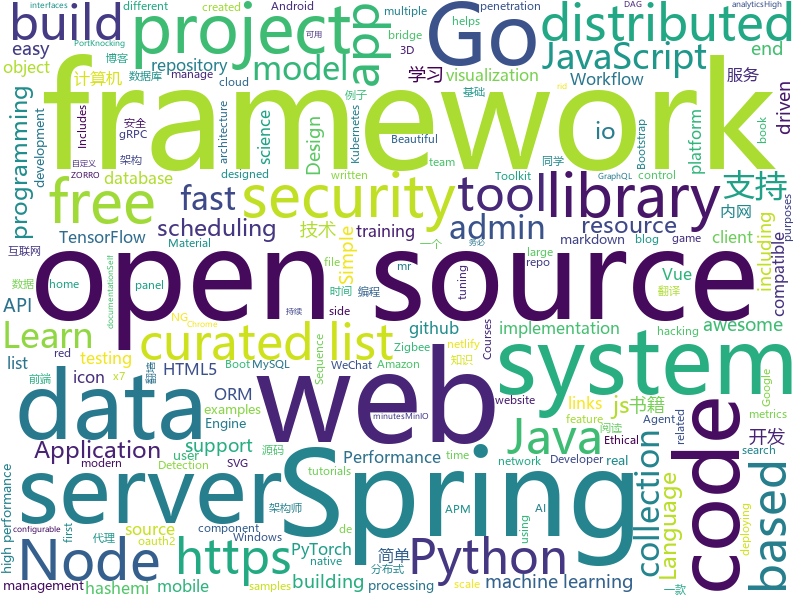

# 2019-12-28
See what the GitHub community is most excited about today.

## python
* [nni](https://github.com/microsoft/nni)(**219 stars today**): An open source AutoML toolkit for neural architecture search, model compression and hyper-parameter tuning.
* [system-design-primer](https://github.com/donnemartin/system-design-primer)(**401 stars today**): Learn how to design large-scale systems. Prep for the system design interview. Includes Anki flashcards.
* [python-small-examples](https://github.com/jackzhenguo/python-small-examples)(**219 stars today**): Python有趣的小例子、小Demo一网打尽。Python基础、Web开发、数据科学、机器学习、TensorFlow、Pytorch，一切都是简单易懂的小例子。
* [code_snippets](https://github.com/CoreyMSchafer/code_snippets)(**17 stars today**): 
* [sagemaker-python-sdk](https://github.com/aws/sagemaker-python-sdk)(**8 stars today**): A library for training and deploying machine learning models on Amazon SageMaker
* [fairseq](https://github.com/pytorch/fairseq)(**29 stars today**): Facebook AI Research Sequence-to-Sequence Toolkit written in Python.
* [machine_learning_examples](https://github.com/lazyprogrammer/machine_learning_examples)(**11 stars today**): A collection of machine learning examples and tutorials.
* [trax](https://github.com/google/trax)(**118 stars today**): Trax — your path to advanced deep learning
* [jupyterhub](https://github.com/jupyterhub/jupyterhub)(**8 stars today**): Multi-user server for Jupyter notebooks
* [spleeter](https://github.com/deezer/spleeter)(**44 stars today**): Deezer source separation library including pretrained models.
* [ru_transformers](https://github.com/mgrankin/ru_transformers)(**140 stars today**): 
* [qgis-earthengine-examples](https://github.com/giswqs/qgis-earthengine-examples)(**60 stars today**): A collection of 260+ Python examples for using Google Earth Engine in QGIS
* [apex](https://github.com/NVIDIA/apex)(**22 stars today**): A PyTorch Extension: Tools for easy mixed precision and distributed training in Pytorch
* [metaflow](https://github.com/Netflix/metaflow)(**48 stars today**): Build and manage real-life data science projects with ease.
* [nightmare](https://github.com/guyinatuxedo/nightmare)(**47 stars today**): 
* [DeepFaceLab](https://github.com/iperov/DeepFaceLab)(**47 stars today**): DeepFaceLab is a tool that utilizes machine learning to replace faces in videos. Includes prebuilt ready to work standalone Windows 7,8,10 binary (look readme.md).
* [ERNIE](https://github.com/PaddlePaddle/ERNIE)(**21 stars today**): An Implementation of ERNIE For Language Understanding (including Pre-training models and Fine-tuning tools)
* [awesome-advent-of-code](https://github.com/Bogdanp/awesome-advent-of-code)(**9 stars today**): A collection of awesome resources related to the yearly Advent of Code challenge.
* [PayloadsAllTheThings](https://github.com/swisskyrepo/PayloadsAllTheThings)(**51 stars today**): A list of useful payloads and bypass for Web Application Security and Pentest/CTF
* [transformers](https://github.com/huggingface/transformers)(**160 stars today**): 🤗Transformers: State-of-the-art Natural Language Processing for TensorFlow 2.0 and PyTorch.
* [sanic](https://github.com/huge-success/sanic)(**18 stars today**): Async Python 3.6+ web server/framework | Build fast. Run fast.
* [ml-agents](https://github.com/Unity-Technologies/ml-agents)(**18 stars today**): Unity Machine Learning Agents Toolkit
* [tfx](https://github.com/tensorflow/tfx)(**4 stars today**): TFX is an end-to-end platform for deploying production ML pipelines
* [TensorFlow-Object-Detection-API-Tutorial-Train-Multiple-Objects-Windows-10](https://github.com/EdjeElectronics/TensorFlow-Object-Detection-API-Tutorial-Train-Multiple-Objects-Windows-10)(**5 stars today**): How to train a TensorFlow Object Detection Classifier for multiple object detection on Windows
* [home-assistant](https://github.com/home-assistant/home-assistant)(**54 stars today**): 🏡Open source home automation that puts local control and privacy first

## java
* [HikariCP](https://github.com/brettwooldridge/HikariCP)(**79 stars today**): 光 HikariCP・A solid, high-performance, JDBC connection pool at last.
* [ForestBlog](https://github.com/saysky/ForestBlog)(**147 stars today**): 一个简单漂亮的SSM(Spring+SpringMVC+Mybatis)博客系统
* [incubator-dolphinscheduler](https://github.com/apache/incubator-dolphinscheduler)(**165 stars today**): Dolphin Scheduler is a distributed and easy-to-expand visual DAG workflow scheduling system, dedicated to solving the complex dependencies in data processing, making the scheduling system out of the box for data processing.(分布式易扩展的可视化工作流任务调度)
* [RIBs](https://github.com/uber/RIBs)(**9 stars today**): Uber's cross-platform mobile architecture framework.
* [pinpoint](https://github.com/naver/pinpoint)(**14 stars today**): APM, (Application Performance Management) tool for large-scale distributed systems written in Java.
* [skywalking](https://github.com/apache/skywalking)(**44 stars today**): APM, Application Performance Monitoring System
* [mr-hashemi](https://github.com/mr-hashemi/mr-hashemi)(**103 stars today**): Mr. Hashemi Programming Language https://mr-hashemi.github.io/mr-hashemi/
* [advanced-java](https://github.com/doocs/advanced-java)(**569 stars today**): 😮互联网 Java 工程师进阶知识完全扫盲：涵盖高并发、分布式、高可用、微服务、海量数据处理等领域知识，后端同学必看，前端同学也可学习
* [x7](https://github.com/x-ream/x7)(**33 stars today**): x7-repository: simple orm based on spring jdbcTemplate； x7-reyc: wrap resilience4j for k8s, plus distribution transaction
* [quickstart-android](https://github.com/firebase/quickstart-android)(**16 stars today**): Firebase Quickstart Samples for Android
* [JFoenix](https://github.com/jfoenixadmin/JFoenix)(**12 stars today**): JavaFX Material Design Library
* [SpringCloud](https://github.com/zhoutaoo/SpringCloud)(**58 stars today**): 基于SpringCloud2.1的微服务开发脚手架，整合了spring-security-oauth2、nacos、feign、sentinel、springcloud-gateway等。服务治理方面引入elasticsearch、skywalking、springboot-admin、zipkin等，让项目开发快速进入业务开发，而不需过多时间花费在架构搭建上。持续更新中
* [testing-samples](https://github.com/android/testing-samples)(**12 stars today**): A collection of samples demonstrating different frameworks and techniques for automated testing
* [SpringAll](https://github.com/wuyouzhuguli/SpringAll)(**96 stars today**): 循序渐进，学习Spring Boot、Spring Boot & Shiro、Spring Cloud、Spring Security & Spring Security OAuth2，博客Spring系列源码
* [grpc-java](https://github.com/grpc/grpc-java)(**8 stars today**): The Java gRPC implementation. HTTP/2 based RPC
* [interview](https://github.com/mission-peace/interview)(**9 stars today**): Interview questions
* [libgdx](https://github.com/libgdx/libgdx)(**14 stars today**): Desktop/Android/HTML5/iOS Java game development framework
* [DataSphereStudio](https://github.com/WeBankFinTech/DataSphereStudio)(**11 stars today**): DataSphereStudio is a one stop data application development& management portal, covering scenarios including data exchange, desensitization/cleansing, analysis/mining, quality measurement, visualization, and task scheduling.
* [zeebe](https://github.com/zeebe-io/zeebe)(**16 stars today**): Distributed Workflow Engine for Microservices Orchestration
* [spring-framework](https://github.com/spring-projects/spring-framework)(**69 stars today**): Spring Framework
* [WeChatLuckyMoney](https://github.com/geeeeeeeeek/WeChatLuckyMoney)(**4 stars today**): 💸WeChat's lucky money helper (微信抢红包插件) by Zhongyi Tong. An Android app that helps you snatch red packets in WeChat groups.
* [geoserver](https://github.com/geoserver/geoserver)(**6 stars today**): Official GeoServer repository
* [react-native-share](https://github.com/react-native-community/react-native-share)(**3 stars today**): Social share, sending simple data to other apps.
* [druid](https://github.com/apache/druid)(**9 stars today**): Apache Druid: a high performance real-time analytics database.
* [tech-weekly](https://github.com/mercyblitz/tech-weekly)(**10 stars today**): 「小马哥技术周报」

## unknown
* [CS-Book](https://github.com/iamshuaidi/CS-Book)(**294 stars today**): 为方便查找对应的书籍，整理了几百本计算机类常用书籍，并且附带下载链接
* [You-Dont-Know-JS](https://github.com/getify/You-Dont-Know-JS)(**95 stars today**): A book series on JavaScript. @YDKJS on twitter.
* [free-programming-books](https://github.com/EbookFoundation/free-programming-books)(**230 stars today**): 📚Freely available programming books
* [udacity-nanodegrees](https://github.com/mikesprague/udacity-nanodegrees)(**30 stars today**): 🎓List of Udacity Nanodegree programs with links to the free courses in their curricula
* [free-programming-books-zh_CN](https://github.com/justjavac/free-programming-books-zh_CN)(**408 stars today**): 📚免费的计算机编程类中文书籍，欢迎投稿
* [awesome-network-stuff](https://github.com/alphaSeclab/awesome-network-stuff)(**104 stars today**): Resources about network security, including: Proxy/GFW/ReverseProxy/Tunnel/VPN/Tor/I2P, and MiTM/PortKnocking/NetworkSniff/NetworkAnalysis/etc。More than 1700 open source tools for now. Post incoming.
* [ShadowsocksBio](https://github.com/JadaGates/ShadowsocksBio)(**182 stars today**): 记录一下SS的前世今生，以及一个简单的教程总结
* [awesome-shodan-queries](https://github.com/jakejarvis/awesome-shodan-queries)(**56 stars today**): 🔍A collection of interesting, funny, and depressing search queries to plug into https://shodan.io/👩‍💻
* [beto](https://github.com/dccuchile/beto)(**56 stars today**): BETO - Spanish version of the BERT model
* [awesome-architecture](https://github.com/toutiaoio/awesome-architecture)(**48 stars today**): 架构师技术图谱，助你早日成为架构师
* [regular-investing-in-box](https://github.com/xiaolai/regular-investing-in-box)(**33 stars today**): 定投改变命运 —— 让时间陪你慢慢变富
* [xray](https://github.com/chaitin/xray)(**268 stars today**): 一款完善的安全评估工具，支持常见 web 安全问题扫描和自定义 poc | 使用之前务必先阅读文档
* [Python-programming-exercises](https://github.com/zhiwehu/Python-programming-exercises)(**25 stars today**): 100+ Python challenging programming exercises
* [PENTESTING-BIBLE](https://github.com/blaCCkHatHacEEkr/PENTESTING-BIBLE)(**48 stars today**): This repository was created and developed by Ammar Amer @cry__pto Only. Updates to this repository will continue to arrive until the number of links reaches 10000 links & 10000 pdf files .Learn Ethical Hacking and penetration testing .hundreds of ethical hacking & penetration testing & red team & cyber security & computer science resources.
* [Flutter-Course-Resources](https://github.com/londonappbrewery/Flutter-Course-Resources)(**20 stars today**): Learn to Code While Building Apps - The Complete Flutter Development Bootcamp
* [Project-Based-Tutorials-in-C](https://github.com/rby90/Project-Based-Tutorials-in-C)(**11 stars today**): A curated list of project-based tutorials in C
* [Beginner-Network-Pentesting](https://github.com/hmaverickadams/Beginner-Network-Pentesting)(**17 stars today**): Notes for Beginner Network Pentesting Course
* [DCA](https://github.com/Evalle/DCA)(**4 stars today**): Docker Certified Associate Exam Preparation Guide
* [gold-miner](https://github.com/xitu/gold-miner)(**53 stars today**): 🥇掘金翻译计划，可能是世界最大最好的英译中技术社区，最懂读者和译者的翻译平台：
* [Miles](https://github.com/ugvf2009/Miles)(**34 stars today**): 二爷翻墙，专注翻墙30年，但没有掌握核心科技^_^
* [OnJava8](https://github.com/LingCoder/OnJava8)(**58 stars today**): 《On Java 8》中文版，又名《Java编程思想》 第5版
* [project-based-learning](https://github.com/tuvtran/project-based-learning)(**89 stars today**): Curated list of project-based tutorials
* [developer-roadmap](https://github.com/kamranahmedse/developer-roadmap)(**179 stars today**): Roadmap to becoming a web developer in 2019
* [awesome-docker](https://github.com/veggiemonk/awesome-docker)(**20 stars today**): 🐳A curated list of Docker resources and projects
* [sec-tool-list](https://github.com/alphaSeclab/sec-tool-list)(**64 stars today**): More than 18K security related open source tools, sorted by star count. Both in markdown and json format.

## javascript
* [chinese-poetry](https://github.com/chinese-poetry/chinese-poetry)(**1,575 stars today**): The most comprehensive database of Chinese poetry 🧶最全中华古诗词数据库, 唐宋两朝近一万四千古诗人, 接近5.5万首唐诗加26万宋诗. 两宋时期1564位词人，21050首词。
* [outline](https://github.com/outline/outline)(**318 stars today**): The fastest wiki and knowledge base for growing teams. Beautiful, feature rich, markdown compatible and open source.
* [Learn-Vue-Source-Code](https://github.com/NLRX-WJC/Learn-Vue-Source-Code)(**697 stars today**): 👍👍逐行剖析Vue.js源码 在线阅读地址https://nlrx-wjc.github.io/Learn-Vue-Source-Code/
* [vue](https://github.com/vuejs/vue)(**191 stars today**): 🖖Vue.js is a progressive, incrementally-adoptable JavaScript framework for building UI on the web.
* [fastify](https://github.com/fastify/fastify)(**38 stars today**): Fast and low overhead web framework, for Node.js
* [freeCodeCamp](https://github.com/freeCodeCamp/freeCodeCamp)(**101 stars today**): The https://www.freeCodeCamp.org open source codebase and curriculum. Learn to code for free together with millions of people.
* [egg](https://github.com/eggjs/egg)(**36 stars today**): 🥚Born to build better enterprise frameworks and apps with Node.js & Koa
* [axios](https://github.com/axios/axios)(**98 stars today**): Promise based HTTP client for the browser and node.js
* [dropzone](https://github.com/enyo/dropzone)(**4 stars today**): Dropzone is an easy to use drag'n'drop library. It supports image previews and shows nice progress bars.
* [bootstrap](https://github.com/twbs/bootstrap)(**75 stars today**): The most popular HTML, CSS, and JavaScript framework for developing responsive, mobile first projects on the web.
* [zigbee2mqtt](https://github.com/Koenkk/zigbee2mqtt)(**27 stars today**): Zigbee🐝to MQTT bridge🌉, get rid of your proprietary Zigbee bridges🔨
* [Chart.js](https://github.com/chartjs/Chart.js)(**36 stars today**): Simple HTML5 Charts using the <canvas> tag
* [emoji-mart](https://github.com/missive/emoji-mart)(**44 stars today**): One component to pick them all 👊🏼
* [v4](https://github.com/bchiang7/v4)(**13 stars today**): Fourth iteration of my personal website
* [react-table](https://github.com/tannerlinsley/react-table)(**28 stars today**): ⚛️Hooks for building fast and extendable tables and datagrids for React
* [puppeteer](https://github.com/puppeteer/puppeteer)(**75 stars today**): Headless Chrome Node.js API
* [javascript](https://github.com/airbnb/javascript)(**85 stars today**): JavaScript Style Guide
* [Iosevka](https://github.com/be5invis/Iosevka)(**33 stars today**): Slender typeface for code, from code.
* [three.js](https://github.com/mrdoob/three.js)(**74 stars today**): JavaScript 3D library.
* [pai](https://github.com/microsoft/pai)(**16 stars today**): Resource scheduling and cluster management for AI
* [strapi](https://github.com/strapi/strapi)(**64 stars today**): 🚀Open source Node.js Headless CMS to easily build customisable APIs
* [G6](https://github.com/antvis/G6)(**31 stars today**): ♾ A Graph Visualization Framework in JavaScript
* [api-platform](https://github.com/api-platform/api-platform)(**11 stars today**): REST and GraphQL framework to build modern API-driven projects (server-side and client-side)
* [react](https://github.com/facebook/react)(**136 stars today**): A declarative, efficient, and flexible JavaScript library for building user interfaces.
* [gatsby](https://github.com/gatsbyjs/gatsby)(**49 stars today**): Build blazing fast, modern apps and websites with React

## html
* [free-for-dev](https://github.com/ripienaar/free-for-dev)(**402 stars today**): A list of SaaS, PaaS and IaaS offerings that have free tiers of interest to devops and infradev
* [webdevbootcamp](https://github.com/nax3t/webdevbootcamp)(**8 stars today**): All source code for back-end projects from the Web Developer Bootcamp
* [awesome-competitive-programming](https://github.com/lnishan/awesome-competitive-programming)(**13 stars today**): 💎A curated list of awesome Competitive Programming, Algorithm and Data Structure resources
* [blog_os](https://github.com/phil-opp/blog_os)(**17 stars today**): Writing an OS in Rust
* [Spoon-Knife](https://github.com/octocat/Spoon-Knife)(**3 stars today**): This repo is for demonstration purposes only.
* [awesome-piracy](https://github.com/Igglybuff/awesome-piracy)(**27 stars today**): A curated list of awesome warez and piracy links
* [coreui-icons](https://github.com/coreui/coreui-icons)(**677 stars today**): CoreUI Free Icons - Premium designed free icon set with marks in SVG, Webfont and raster formats
* [datasciencecoursera](https://github.com/mGalarnyk/datasciencecoursera)(**2 stars today**): Data Science Repo and blog for John Hopkins Coursera Courses. Please let me know if you have any questions.
* [cats-of-jasnah](https://github.com/countable/cats-of-jasnah)(**78 stars today**): Cats of Jasnah, a game for learning categories and logic
* [technical-books](https://github.com/doocs/technical-books)(**20 stars today**): 😆国内外互联网技术大牛们都写了哪些书籍：计算机基础、网络、前端、后端、数据库、架构、大数据、深度学习...
* [SVG-Loaders](https://github.com/SamHerbert/SVG-Loaders)(**11 stars today**): Loading icons and small animations built with pure SVG.
* [ng-alain](https://github.com/ng-alain/ng-alain)(**8 stars today**): NG-ZORRO admin panel front-end framework (netlify mirror https://netlify.ng-alain.com/)
* [MatBlazor](https://github.com/SamProf/MatBlazor)(**11 stars today**): Material Design components for Blazor and Razor Components
* [bootstrap-switch](https://github.com/Bttstrp/bootstrap-switch)(**2 stars today**): Turn checkboxes and radio buttons in toggle switches.
* [glTF](https://github.com/KhronosGroup/glTF)(**6 stars today**): glTF – Runtime 3D Asset Delivery
* [swagger-codegen](https://github.com/swagger-api/swagger-codegen)(**14 stars today**): swagger-codegen contains a template-driven engine to generate documentation, API clients and server stubs in different languages by parsing your OpenAPI / Swagger definition.
* [expressjs.com](https://github.com/expressjs/expressjs.com)(**7 stars today**): 
* [coreui-free-bootstrap-admin-template](https://github.com/coreui/coreui-free-bootstrap-admin-template)(**9 stars today**): CoreUI is free bootstrap admin template
* [hyperblog](https://github.com/freddier/hyperblog)(**13 stars today**): Un blog increíble para el curso de Git y Github de Platzi
* [Winds](https://github.com/GetStream/Winds)(**13 stars today**): A Beautiful Open Source RSS & Podcast App Powered by Getstream.io
* [home-assistant.io](https://github.com/home-assistant/home-assistant.io)(**3 stars today**): 📘Home Assistant User documentation
* [homenet6.github.io](https://github.com/homenet6/homenet6.github.io)(**4 stars today**): 
* [speedtest](https://github.com/librespeed/speedtest)(**13 stars today**): Self-hosted Speedtest for HTML5 and more. Easy setup, examples, configurable, mobile friendly. Supports PHP, Node, Multiple servers, and more
* [startbootstrap-sb-admin-2](https://github.com/BlackrockDigital/startbootstrap-sb-admin-2)(**9 stars today**): A free, open source, Bootstrap admin theme created by Start Bootstrap
* [tiny-slider](https://github.com/ganlanyuan/tiny-slider)(**7 stars today**): Vanilla javascript slider for all purposes.

## go
* [lbadd](https://github.com/tomarrell/lbadd)(**114 stars today**): LBADD: An experimental, distributed SQL database
* [telegraf](https://github.com/influxdata/telegraf)(**17 stars today**): The plugin-driven server agent for collecting & reporting metrics.
* [charts](https://github.com/helm/charts)(**27 stars today**): Curated applications for Kubernetes
* [go](https://github.com/golang/go)(**95 stars today**): The Go programming language
* [fsnotify](https://github.com/fsnotify/fsnotify)(**10 stars today**): Cross-platform file system notifications for Go.
* [geph2](https://github.com/geph-official/geph2)(**139 stars today**): Geph (迷霧通) is a modular Internet censorship circumvention system designed specifically to deal with national filtering.
* [protobuf](https://github.com/golang/protobuf)(**28 stars today**): Go support for Google's protocol buffers
* [glow](https://github.com/charmbracelet/glow)(**388 stars today**): Render markdown on the CLI, with pizzazz! 💅🏻
* [cron](https://github.com/robfig/cron)(**17 stars today**): a cron library for go
* [grpc-go](https://github.com/grpc/grpc-go)(**21 stars today**): The Go language implementation of gRPC. HTTP/2 based RPC
* [nps](https://github.com/cnlh/nps)(**43 stars today**): 一款轻量级、功能强大的内网穿透代理服务器。支持tcp、udp流量转发，支持内网http代理、内网socks5代理，同时支持snappy压缩、站点保护、加密传输、多路复用、header修改等。支持web图形化管理，集成多用户模式。
* [argo](https://github.com/argoproj/argo)(**14 stars today**): Argo Workflows: Get stuff done with Kubernetes.
* [learn-go-with-tests](https://github.com/quii/learn-go-with-tests)(**60 stars today**): Learn Go with test-driven development
* [pg](https://github.com/go-pg/pg)(**12 stars today**): Golang ORM with focus on PostgreSQL features and performance
* [awesome-go](https://github.com/avelino/awesome-go)(**108 stars today**): A curated list of awesome Go frameworks, libraries and software
* [influxdb](https://github.com/influxdata/influxdb)(**17 stars today**): Scalable datastore for metrics, events, and real-time analytics
* [nats-server](https://github.com/nats-io/nats-server)(**13 stars today**): High-Performance server for NATS, the cloud native messaging system.
* [kubeedge](https://github.com/kubeedge/kubeedge)(**5 stars today**): Kubernetes Native Edge Computing Framework (project under CNCF)
* [xorm](https://github.com/go-xorm/xorm)(**16 stars today**): Simple and Powerful ORM for Go, support mysql,postgres,tidb,sqlite3,mssql,oracle, Moved to https://gitea.com/xorm/xorm
* [cert-manager](https://github.com/jetstack/cert-manager)(**14 stars today**): Automatically provision and manage TLS certificates in Kubernetes
* [kubernetes](https://github.com/kubernetes/kubernetes)(**149 stars today**): Production-Grade Container Scheduling and Management
* [tidb](https://github.com/pingcap/tidb)(**33 stars today**): TiDB is an open source distributed HTAP database compatible with the MySQL protocol
* [istio](https://github.com/istio/istio)(**51 stars today**): Connect, secure, control, and observe services.
* [go-admin](https://github.com/GoAdminGroup/go-admin)(**26 stars today**): A golang framework helps gopher to build a data visualization and admin panel in ten minutes
* [minio](https://github.com/minio/minio)(**52 stars today**): MinIO is a high performance object storage server compatible with Amazon S3 APIs

## WordCloud

