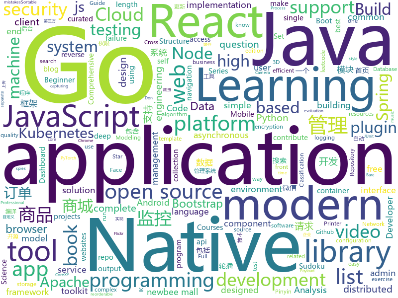

# 2019-12-31
See what the GitHub community is most excited about today.

## python
* [AI_Sudoku](https://github.com/neeru1207/AI_Sudoku)(**113 stars today**): GUI based Smart Sudoku Solver that tries to extract a sudoku puzzle from a photo and solve it
* [nni](https://github.com/microsoft/nni)(**603 stars today**): An open source AutoML toolkit for neural architecture search, model compression and hyper-parameter tuning.
* [numpy-ml](https://github.com/ddbourgin/numpy-ml)(**51 stars today**): Machine learning, in numpy
* [cascadia-code](https://github.com/microsoft/cascadia-code)(**56 stars today**): This is a fun, new monospaced font that includes programming ligatures and is designed to enhance the modern look and feel of the Windows Terminal.
* [astropy](https://github.com/astropy/astropy)(**18 stars today**): Repository for the Astropy core package
* [PrettyErrors](https://github.com/onelivesleft/PrettyErrors)(**59 stars today**): Prettify Python exception output to make it legible.
* [public-apis](https://github.com/public-apis/public-apis)(**233 stars today**): A collective list of free APIs for use in software and web development.
* [SlowFast](https://github.com/facebookresearch/SlowFast)(**17 stars today**): PySlowFast: video understanding codebase from FAIR for reproducing state-of-the-art video models.
* [airflow](https://github.com/apache/airflow)(**26 stars today**): Apache Airflow - A platform to programmatically author, schedule, and monitor workflows
* [compose](https://github.com/docker/compose)(**13 stars today**): Define and run multi-container applications with Docker
* [bert-as-service](https://github.com/hanxiao/bert-as-service)(**19 stars today**): Mapping a variable-length sentence to a fixed-length vector using BERT model
* [ffmpeg-python](https://github.com/kkroening/ffmpeg-python)(**583 stars today**): Python bindings for FFmpeg - with complex filtering support
* [ML-From-Scratch](https://github.com/eriklindernoren/ML-From-Scratch)(**47 stars today**): Machine Learning From Scratch. Bare bones NumPy implementations of machine learning models and algorithms with a focus on accessibility. Aims to cover everything from linear regression to deep learning.
* [home-assistant](https://github.com/home-assistant/home-assistant)(**147 stars today**): 🏡Open source home automation that puts local control and privacy first
* [sqlalchemy](https://github.com/sqlalchemy/sqlalchemy)(**5 stars today**): The Database Toolkit for Python
* [keras](https://github.com/keras-team/keras)(**34 stars today**): Deep Learning for humans
* [CheatSheetSeries](https://github.com/OWASP/CheatSheetSeries)(**19 stars today**): The OWASP Cheat Sheet Series was created to provide a concise collection of high value information on specific application security topics.
* [FinSpy-Tools](https://github.com/devio/FinSpy-Tools)(**11 stars today**): Tools for the analysis of FinSpy/FinFisher components #spyware #trojan #govware
* [pymc3](https://github.com/pymc-devs/pymc3)(**6 stars today**): Probabilistic Programming in Python: Bayesian Modeling and Probabilistic Machine Learning with Theano
* [hyperopt](https://github.com/hyperopt/hyperopt)(**9 stars today**): Distributed Asynchronous Hyperparameter Optimization in Python
* [meson](https://github.com/mesonbuild/meson)(**2 stars today**): The Meson Build System
* [simpletransformers](https://github.com/ThilinaRajapakse/simpletransformers)(**9 stars today**): Transformers made simple with training, evaluation, and prediction possible with one line each. Currently supports Sequence Classification (binary, multiclass, multilabel), Token Classification (NER), and Question Answering. Built on top of the Hugging Face Transformer library.
* [ffhq-dataset](https://github.com/NVlabs/ffhq-dataset)(**3 stars today**): Flickr-Faces-HQ Dataset (FFHQ)
* [python-spider](https://github.com/Jack-Cherish/python-spider)(**21 stars today**): 🌈Python3网络爬虫实战
* [100-Days-Of-ML-Code](https://github.com/Avik-Jain/100-Days-Of-ML-Code)(**40 stars today**): 100 Days of ML Coding

## java
* [SpringBoot-Labs](https://github.com/YunaiV/SpringBoot-Labs)(**69 stars today**): Spring Boot 2.X 专栏更新中，未来更新 Spring Cloud Alibaba 。欢迎胖友 Star 一波
* [hadoop](https://github.com/apache/hadoop)(**10 stars today**): Apache Hadoop
* [java-guide](https://github.com/forax/java-guide)(**118 stars today**): A guide of modern Java (Java 17)
* [ghidra](https://github.com/NationalSecurityAgency/ghidra)(**37 stars today**): Ghidra is a software reverse engineering (SRE) framework
* [wgcloud](https://github.com/tianshiyeben/wgcloud)(**169 stars today**): linux开源服务器监控解决方案，IT运维，进程监控，集群监控，内存监控，CPU监控，心跳检测
* [newbee-mall](https://github.com/newbee-ltd/newbee-mall)(**98 stars today**): newbee-mall 项目（新蜂商城）是一套电商系统，包括 newbee-mall 商城系统及 newbee-mall-admin 商城后台管理系统，基于 Spring Boot 2.X 及相关技术栈开发。 前台商城系统包含首页门户、商品分类、新品上线、首页轮播、商品推荐、商品搜索、商品展示、购物车、订单结算、订单流程、个人订单管理、会员中心、帮助中心等模块。 后台管理系统包含数据面板、轮播图管理、商品管理、订单管理、会员管理、分类管理、设置等模块。
* [react-native-screens](https://github.com/kmagiera/react-native-screens)(**3 stars today**): Native navigation primitives for your React Native app.
* [react-native-camera](https://github.com/react-native-community/react-native-camera)(**6 stars today**): A Camera component for React Native. Also supports barcode scanning!
* [reliable](https://github.com/x-ream/reliable)(**15 stars today**): mq transaction, tcc, eventually consistency. tx life cycle: all listeners handled, if necessary, produce next message
* [zookeeper](https://github.com/apache/zookeeper)(**15 stars today**): Mirror of Apache Hadoop ZooKeeper
* [react-native-webview](https://github.com/react-native-community/react-native-webview)(**6 stars today**): React Native Cross-Platform WebView
* [micronaut-core](https://github.com/micronaut-projects/micronaut-core)(**11 stars today**): Micronaut Application Framework
* [elasticsearch-analysis-pinyin](https://github.com/medcl/elasticsearch-analysis-pinyin)(**7 stars today**): This Pinyin Analysis plugin is used to do conversion between Chinese characters and Pinyin.
* [testcontainers-java](https://github.com/testcontainers/testcontainers-java)(**7 stars today**): Testcontainers is a Java library that supports JUnit tests, providing lightweight, throwaway instances of common databases, Selenium web browsers, or anything else that can run in a Docker container.
* [okhttp](https://github.com/square/okhttp)(**33 stars today**): An HTTP client for Android, Kotlin, and Java.
* [Hystrix](https://github.com/Netflix/Hystrix)(**12 stars today**): Hystrix is a latency and fault tolerance library designed to isolate points of access to remote systems, services and 3rd party libraries, stop cascading failure and enable resilience in complex distributed systems where failure is inevitable.
* [elasticsearch](https://github.com/elastic/elasticsearch)(**44 stars today**): Open Source, Distributed, RESTful Search Engine
* [skywalking](https://github.com/apache/skywalking)(**20 stars today**): APM, Application Performance Monitoring System
* [okhttp-RxHttp](https://github.com/liujingxing/okhttp-RxHttp)(**43 stars today**): OkHttp+RxJava 30秒上手，新一代Http请求神器，史上最优雅的实现文件上传/下载/进度监听、动态/多域名、缓存；支持第三方数据解析工具、自定义请求、自动关闭请求等等
* [react-native-navigation](https://github.com/wix/react-native-navigation)(**8 stars today**): A complete native navigation solution for React Native
* [Telegram](https://github.com/DrKLO/Telegram)(**20 stars today**): Telegram for Android source
* [elasticsearch-analysis-ik](https://github.com/medcl/elasticsearch-analysis-ik)(**11 stars today**): The IK Analysis plugin integrates Lucene IK analyzer into elasticsearch, support customized dictionary.
* [cas](https://github.com/apereo/cas)(**12 stars today**): Apereo CAS - Enterprise Single Sign On for all earthlings and beyond.
* [CameraView](https://github.com/natario1/CameraView)(**10 stars today**): 📸A well documented, high-level Android interface that makes capturing pictures and videos easy, addressing all of the common issues and needs. Real-time filters, gestures, watermarks, frame processing, RAW, output of any size.
* [flowable-engine](https://github.com/flowable/flowable-engine)(**5 stars today**): A compact and highly efficient workflow and Business Process Management (BPM) platform for developers, system admins and business users.

## unknown
* [awesome-stock-resources](https://github.com/neutraltone/awesome-stock-resources)(**588 stars today**): 🌇A collection of links for free stock photography, video and Illustration websites
* [DevYouTubeList](https://github.com/ErikCH/DevYouTubeList)(**419 stars today**): List of Development YouTube Channels
* [javascript-testing-best-practices](https://github.com/goldbergyoni/javascript-testing-best-practices)(**56 stars today**): 📗🌐🚢Comprehensive and exhaustive JavaScript & Node.js testing best practices (August 2019)
* [computer-science](https://github.com/ossu/computer-science)(**104 stars today**): 🎓Path to a free self-taught education in Computer Science!
* [stargan-v2](https://github.com/clovaai/stargan-v2)(**36 stars today**): StarGAN v2 - Official PyTorch Implementation
* [free-api](https://github.com/fangzesheng/free-api)(**138 stars today**): 收集免费的接口服务,做一个api的搬运工
* [sec-tool-list](https://github.com/alphaSeclab/sec-tool-list)(**24 stars today**): More than 18K security related open source tools, sorted by star count. Both in markdown and json format.
* [You-Dont-Know-JS](https://github.com/getify/You-Dont-Know-JS)(**91 stars today**): A book series on JavaScript. @YDKJS on twitter.
* [OpenAPI-Specification](https://github.com/OAI/OpenAPI-Specification)(**24 stars today**): The OpenAPI Specification Repository
* [Flutter-Course-Resources](https://github.com/londonappbrewery/Flutter-Course-Resources)(**17 stars today**): Learn to Code While Building Apps - The Complete Flutter Development Bootcamp
* [OpenWrt-CI](https://github.com/KFERMercer/OpenWrt-CI)(**12 stars today**): OpenWrt CI 在线集成自动编译环境
* [CKAD-exercises](https://github.com/dgkanatsios/CKAD-exercises)(**16 stars today**): A set of exercises to prepare for Certified Kubernetes Application Developer exam by Cloud Native Computing Foundation
* [Beginner-Network-Pentesting](https://github.com/hmaverickadams/Beginner-Network-Pentesting)(**42 stars today**): Notes for Beginner Network Pentesting Course
* [AZ-103-MicrosoftAzureAdministrator](https://github.com/MicrosoftLearning/AZ-103-MicrosoftAzureAdministrator)(**4 stars today**): AZ-103: Microsoft Azure Administrator
* [A-to-Z-Resources-for-Students](https://github.com/dipakkr/A-to-Z-Resources-for-Students)(**26 stars today**): ✅Curated list of resources for college students
* [gecko-dev](https://github.com/mozilla/gecko-dev)(**2 stars today**): Read-only Git mirror of the Mercurial gecko repositories at https://hg.mozilla.org. How to contribute: http://bit.ly/contribute-code
* [Voron-2](https://github.com/VoronDesign/Voron-2)(**3 stars today**): Voron 2 CoreXY 3D Printer design
* [you-dont-know-js-ru](https://github.com/azat-io/you-dont-know-js-ru)(**4 stars today**): 📚Russian translation of "You Don't Know JS" book series
* [open-source-cs](https://github.com/ForrestKnight/open-source-cs)(**5 stars today**): Video discussing this curriculum:
* [learn](https://github.com/in28minutes/learn)(**6 stars today**): Amazing Cloud, Full Stack and Microservice Courses and Videos from in28Minutes
* [Cookbook](https://github.com/andkret/Cookbook)(**20 stars today**): The Data Engineering Cookbook
* [xss-payload-list](https://github.com/payloadbox/xss-payload-list)(**2 stars today**): 🎯Cross Site Scripting ( XSS ) Vulnerability Payload List
* [OnJava8](https://github.com/LingCoder/OnJava8)(**35 stars today**): 《On Java 8》中文版，又名《Java编程思想》 第5版
* [sysmon-config](https://github.com/SwiftOnSecurity/sysmon-config)(**4 stars today**): Sysmon configuration file template with default high-quality event tracing

## javascript
* [spark-joy](https://github.com/sw-yx/spark-joy)(**769 stars today**): ✨😂easy ways to add design flair, user delight, and whimsy to your product.
* [magnetW](https://github.com/xiandanin/magnetW)(**442 stars today**): 磁力链接聚合搜索
* [keystone](https://github.com/keystonejs/keystone)(**25 stars today**): A scalable platform and CMS to build Node.js applications
* [lucky-draw](https://github.com/vitozyf/lucky-draw)(**66 stars today**): 年会抽奖程序
* [gatsby](https://github.com/gatsbyjs/gatsby)(**107 stars today**): Build blazing fast, modern apps and websites with React
* [eternal](https://github.com/kousun12/eternal)(**62 stars today**): 👾~ music, eternal ~👾
* [react-native](https://github.com/facebook/react-native)(**43 stars today**): A framework for building native apps with React.
* [create-react-app](https://github.com/facebook/create-react-app)(**48 stars today**): Set up a modern web app by running one command.
* [any-rule](https://github.com/any86/any-rule)(**143 stars today**): 🦕 常用正则大全, 支持web / vscode插件2种查询方式.
* [react](https://github.com/facebook/react)(**88 stars today**): A declarative, efficient, and flexible JavaScript library for building user interfaces.
* [jupyterlab](https://github.com/jupyterlab/jupyterlab)(**9 stars today**): JupyterLab computational environment.
* [react-query](https://github.com/tannerlinsley/react-query)(**11 stars today**): ⚛️Hooks for fetching, caching and updating asynchronous data in React
* [airframe-react](https://github.com/0wczar/airframe-react)(**6 stars today**): Free Open Source High Quality Dashboard based on Bootstrap 4 & React 16: http://dashboards.webkom.co/react/airframe
* [mongoose](https://github.com/Automattic/mongoose)(**12 stars today**): MongoDB object modeling designed to work in an asynchronous environment.
* [academicpages.github.io](https://github.com/academicpages/academicpages.github.io)(**9 stars today**): Github Pages template for academic personal websites, forked from mmistakes/minimal-mistakes
* [Sortable](https://github.com/SortableJS/Sortable)(**15 stars today**): Sortable — is a JavaScript library for reorderable drag-and-drop lists on modern browsers and touch devices. No jQuery required. Supports Meteor, AngularJS, React, Polymer, Vue, Ember, Knockout and any CSS library, e.g. Bootstrap.
* [axios](https://github.com/axios/axios)(**64 stars today**): Promise based HTTP client for the browser and node.js
* [leetcode](https://github.com/azl397985856/leetcode)(**103 stars today**): LeetCode Solutions: A Record of My Problem Solving Journey.( leetcode题解，记录自己的leetcode解题之路。)
* [jest](https://github.com/facebook/jest)(**29 stars today**): Delightful JavaScript Testing.
* [Motrix](https://github.com/agalwood/Motrix)(**383 stars today**): A full-featured download manager.
* [three.js](https://github.com/mrdoob/three.js)(**42 stars today**): JavaScript 3D library.
* [jeesite](https://github.com/thinkgem/jeesite)(**10 stars today**): JeeSite 是一个企业信息化开发基础平台，Java企业应用开源框架，Java EE（J2EE）快速开发框架，使用经典技术组合（Spring、Spring MVC、Apache Shiro、MyBatis、Bootstrap UI），包括核心模块如：组织机构、角色用户、权限授权、数据权限、内容管理、工作流等。
* [ARC](https://github.com/fchollet/ARC)(**7 stars today**): The Abstraction and Reasoning Corpus
* [sinon](https://github.com/sinonjs/sinon)(**8 stars today**): Test spies, stubs and mocks for JavaScript.

## html
* [awesome-competitive-programming](https://github.com/lnishan/awesome-competitive-programming)(**33 stars today**): 💎A curated list of awesome Competitive Programming, Algorithm and Data Structure resources
* [v2board](https://github.com/v2board/v2board)(**22 stars today**): 🚀A v2ray panel application interface
* [DetectionLab](https://github.com/clong/DetectionLab)(**14 stars today**): Vagrant & Packer scripts to build a lab environment complete with security tooling and logging best practices
* [Front-end-Developer-Interview-Questions](https://github.com/h5bp/Front-end-Developer-Interview-Questions)(**19 stars today**): A list of helpful front-end related questions you can use to interview potential candidates, test yourself or completely ignore.
* [learning-area](https://github.com/mdn/learning-area)(**4 stars today**): Github repo for the MDN Learning Area.
* [OpenClash](https://github.com/vernesong/OpenClash)(**5 stars today**): A Clash Client For OpenWrt
* [wechat_web_devtools](https://github.com/cytle/wechat_web_devtools)(**7 stars today**): 微信开发者工具(微信小程序)linux完美支持
* [en.javascript.info](https://github.com/javascript-tutorial/en.javascript.info)(**17 stars today**): Modern JavaScript Tutorial
* [qifi](https://github.com/evgeni/qifi)(**28 stars today**): pure JS WiFi QR Code Generator
* [lucky-ball](https://github.com/kaysonli/lucky-ball)(**30 stars today**): A simple lottery program.
* [professional-services](https://github.com/GoogleCloudPlatform/professional-services)(**4 stars today**): Common solutions and tools developed by Google Cloud's Professional Services team
* [go101](https://github.com/go101/go101)(**26 stars today**): An online book focusing on Go syntax/semantics.
* [owasp-mstg](https://github.com/OWASP/owasp-mstg)(**7 stars today**): The Mobile Security Testing Guide (MSTG) is a comprehensive manual for mobile app security development, testing and reverse engineering.
* [beginner-javascript](https://github.com/wesbos/beginner-javascript)(**24 stars today**): Slam Dunk JavaScript
* [book](https://github.com/PaddlePaddle/book)(**6 stars today**): Deep Learning 101 with PaddlePaddle （『飞桨』深度学习框架入门教程）
* [typedoc](https://github.com/TypeStrong/typedoc)(**7 stars today**): Documentation generator for TypeScript projects.
* [dragon-book-exercise-answers](https://github.com/fool2fish/dragon-book-exercise-answers)(**5 stars today**): Compilers Principles, Techniques, & Tools (purple dragon book) second edition exercise answers. 编译原理（紫龙书）第2版习题答案。
* [RedMatic](https://github.com/rdmtc/RedMatic)(**3 stars today**): Node-RED packaged as Addon for the Homematic CCU3 and RaspberryMatic🤹‍♂️
* [MatBlazor](https://github.com/SamProf/MatBlazor)(**9 stars today**): Material Design components for Blazor and Razor Components
* [datasciencecoursera](https://github.com/mGalarnyk/datasciencecoursera)(**1 stars today**): Data Science Repo and blog for John Hopkins Coursera Courses. Please let me know if you have any questions.
* [webdevbootcamp](https://github.com/nax3t/webdevbootcamp)(**2 stars today**): All source code for back-end projects from the Web Developer Bootcamp
* [pybluez](https://github.com/pybluez/pybluez)(**4 stars today**): Bluetooth Python extension module
* [gopherlabs](https://github.com/collabnix/gopherlabs)(**9 stars today**): Go - Beginners | Intermediate | Advanced
* [startbootstrap-clean-blog-jekyll](https://github.com/BlackrockDigital/startbootstrap-clean-blog-jekyll)(**3 stars today**): A Jekyll version of the Clean Blog theme by Start Bootstrap
* [front-end-handbook-2019](https://github.com/FrontendMasters/front-end-handbook-2019)(**17 stars today**): [Book] 2019 edition of our front-end development handbook

## go
* [age](https://github.com/FiloSottile/age)(**472 stars today**): A simple, modern and secure encryption tool with small explicit keys, no config options, and UNIX-style composability.
* [go-spew](https://github.com/davecgh/go-spew)(**6 stars today**): Implements a deep pretty printer for Go data structures to aid in debugging
* [helm](https://github.com/helm/helm)(**24 stars today**): The Kubernetes Package Manager
* [cobra](https://github.com/spf13/cobra)(**25 stars today**): A Commander for modern Go CLI interactions
* [origin](https://github.com/openshift/origin)(**6 stars today**): The self-managing, auto-upgrading, Kubernetes distribution for everyone
* [kops](https://github.com/kubernetes/kops)(**11 stars today**): Kubernetes Operations (kops) - Production Grade K8s Installation, Upgrades, and Management
* [crawlab](https://github.com/crawlab-team/crawlab)(**51 stars today**): Distributed web crawler admin platform for spiders management regardless of languages and frameworks.
* [gopl.io](https://github.com/adonovan/gopl.io)(**14 stars today**): Example programs from "The Go Programming Language"
* [raft](https://github.com/hashicorp/raft)(**14 stars today**): Golang implementation of the Raft consensus protocol
* [chromedp](https://github.com/chromedp/chromedp)(**18 stars today**): A faster, simpler way to drive browsers supporting the Chrome DevTools Protocol.
* [chubaofs](https://github.com/chubaofs/chubaofs)(**39 stars today**): A distributed storage system for cloud native applications to separate storage from compute.
* [ent](https://github.com/facebookincubator/ent)(**22 stars today**): An entity framework for Go
* [go](https://github.com/golang/go)(**68 stars today**): The Go programming language
* [aws-sdk-go](https://github.com/aws/aws-sdk-go)(**4 stars today**): AWS SDK for the Go programming language.
* [kubernetes-ingress-controller](https://github.com/Kong/kubernetes-ingress-controller)(**6 stars today**): Kong for Kubernetes
* [amazon-vpc-cni-k8s](https://github.com/aws/amazon-vpc-cni-k8s)(**3 stars today**): Networking plugin repository for pod networking in Kubernetes using Elastic Network Interfaces on AWS
* [protoc-gen-validate](https://github.com/envoyproxy/protoc-gen-validate)(**4 stars today**): protoc plugin to generate polyglot message validators
* [charts](https://github.com/helm/charts)(**19 stars today**): Curated applications for Kubernetes
* [terraform-provider-aws](https://github.com/terraform-providers/terraform-provider-aws)(**5 stars today**): Terraform AWS provider
* [dig](https://github.com/uber-go/dig)(**13 stars today**): A reflection based dependency injection toolkit for Go.
* [vault](https://github.com/hashicorp/vault)(**14 stars today**): A tool for secrets management, encryption as a service, and privileged access management
* [packer](https://github.com/hashicorp/packer)(**3 stars today**): Packer is a tool for creating identical machine images for multiple platforms from a single source configuration.
* [govmomi](https://github.com/vmware/govmomi)(**3 stars today**): Go library for the VMware vSphere API
* [opa](https://github.com/open-policy-agent/opa)(**8 stars today**): An open source, general-purpose policy engine.
* [logrus](https://github.com/sirupsen/logrus)(**18 stars today**): Structured, pluggable logging for Go.

## WordCloud

