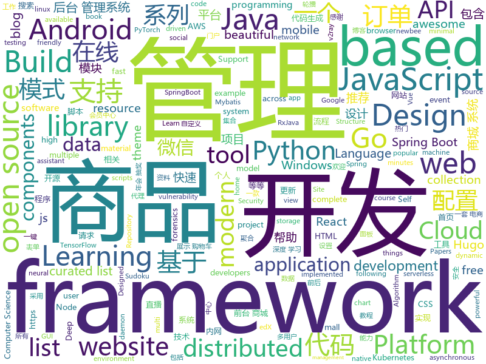

# 2020-01-01
See what the GitHub community is most excited about today.

## python
* [ALBERT](https://github.com/google-research/ALBERT)(**73 stars today**): ALBERT: A Lite BERT for Self-supervised Learning of Language Representations
* [AI_Sudoku](https://github.com/neeru1207/AI_Sudoku)(**235 stars today**): GUI based Smart Sudoku Solver that tries to extract a sudoku puzzle from a photo and solve it
* [numpy-ml](https://github.com/ddbourgin/numpy-ml)(**63 stars today**): Machine learning, in numpy
* [cascadia-code](https://github.com/microsoft/cascadia-code)(**61 stars today**): This is a fun, new monospaced font that includes programming ligatures and is designed to enhance the modern look and feel of the Windows Terminal.
* [nni](https://github.com/microsoft/nni)(**341 stars today**): An open source AutoML toolkit for neural architecture search, model compression and hyper-parameter tuning.
* [astropy](https://github.com/astropy/astropy)(**19 stars today**): Repository for the Astropy core package
* [checkov](https://github.com/bridgecrewio/checkov)(**30 stars today**): Prevent cloud misconfigurations during build time
* [ItChat](https://github.com/littlecodersh/ItChat)(**19 stars today**): A complete and graceful API for Wechat. 微信个人号接口、微信机器人及命令行微信，三十行即可自定义个人号机器人。
* [awesome-python](https://github.com/vinta/awesome-python)(**62 stars today**): A curated list of awesome Python frameworks, libraries, software and resources
* [cpython](https://github.com/python/cpython)(**46 stars today**): The Python programming language
* [scikit-learn](https://github.com/scikit-learn/scikit-learn)(**20 stars today**): scikit-learn: machine learning in Python
* [Deep-Learning-with-TensorFlow-book](https://github.com/dragen1860/Deep-Learning-with-TensorFlow-book)(**30 stars today**): 深度学习入门开源书，基于TensorFlow 2.0案例实战。Open source Deep Learning book, based on TensorFlow 2.0 framework.
* [algo](https://github.com/wangzheng0822/algo)(**32 stars today**): 数据结构和算法必知必会的50个代码实现
* [edx-platform](https://github.com/edx/edx-platform)(**4 stars today**): The Open edX platform, the software that powers edX!
* [face_recognition](https://github.com/ageitgey/face_recognition)(**32 stars today**): The world's simplest facial recognition api for Python and the command line
* [emacs-application-framework](https://github.com/manateelazycat/emacs-application-framework)(**8 stars today**): Emacs application framework
* [public-apis](https://github.com/public-apis/public-apis)(**210 stars today**): A collective list of free APIs for use in software and web development.
* [netbox](https://github.com/netbox-community/netbox)(**5 stars today**): IP address management (IPAM) and data center infrastructure management (DCIM) tool.
* [mypy](https://github.com/python/mypy)(**13 stars today**): Optional static typing for Python 3 and 2 (PEP 484)
* [motioneye](https://github.com/ccrisan/motioneye)(**2 stars today**): A web frontend for the motion daemon.
* [home-assistant](https://github.com/home-assistant/home-assistant)(**103 stars today**): 🏡Open source home automation that puts local control and privacy first
* [kivy](https://github.com/kivy/kivy)(**8 stars today**): Open source UI framework written in Python, running on Windows, Linux, macOS, Android and iOS
* [bert](https://github.com/google-research/bert)(**30 stars today**): TensorFlow code and pre-trained models for BERT
* [content](https://github.com/demisto/content)(**0 stars today**): Demisto Platform ever-growing Content Repository
* [sherlock](https://github.com/sherlock-project/sherlock)(**20 stars today**): 🔎Hunt down social media accounts by username across social networks

## java
* [java-design-patterns](https://github.com/iluwatar/java-design-patterns)(**65 stars today**): Design patterns implemented in Java
* [SpringBoot-Labs](https://github.com/YunaiV/SpringBoot-Labs)(**140 stars today**): Spring Boot 2.X 专栏更新中，未来更新 Spring Cloud Alibaba 。欢迎胖友 Star 一波
* [Mindustry](https://github.com/Anuken/Mindustry)(**23 stars today**): A sandbox tower defense game
* [jeecg-boot](https://github.com/zhangdaiscott/jeecg-boot)(**44 stars today**): 一款基于代码生成器的JAVA快速开发平台(低代码开发平台)，开源界“小普元”超越传统商业企业级开发平台！采用前后端分离架构：SpringBoot 2.x，Ant Design&Vue，Mybatis-plus，Shiro，JWT。强大的代码生成器让前后端代码一键生成，无需写任何代码! 引领新的开发模式(OnlineCoding模式-> 代码生成器模式-> 手工MERGE智能开发)，帮助Java项目解决70%的重复工作，让开发更多关注业务逻辑。既能快速提高开发效率，帮助公司节省成本，同时又不失灵活性。JeecgBoot还独创在线开发模式（No代码）：在线表单配置（表单设计器）、移动配置能力、在线工作流配置（流程设计器）、在线报表配置、在线图表配置、插件能力（可插拔）等等
* [Telegram](https://github.com/DrKLO/Telegram)(**23 stars today**): Telegram for Android source
* [mall](https://github.com/macrozheng/mall)(**127 stars today**): mall项目是一套电商系统，包括前台商城系统及后台管理系统，基于SpringBoot+MyBatis实现，采用Docker容器化部署。 前台商城系统包含首页门户、商品推荐、商品搜索、商品展示、购物车、订单流程、会员中心、客户服务、帮助中心等模块。 后台管理系统包含商品管理、订单管理、会员管理、促销管理、运营管理、内容管理、统计报表、财务管理、权限管理、设置等模块。
* [RxJava](https://github.com/ReactiveX/RxJava)(**22 stars today**): RxJava – Reactive Extensions for the JVM – a library for composing asynchronous and event-based programs using observable sequences for the Java VM.
* [Java](https://github.com/TheAlgorithms/Java)(**42 stars today**): All Algorithms implemented in Java
* [newbee-mall](https://github.com/newbee-ltd/newbee-mall)(**118 stars today**): newbee-mall 项目（新蜂商城）是一套电商系统，包括 newbee-mall 商城系统及 newbee-mall-admin 商城后台管理系统，基于 Spring Boot 2.X 及相关技术栈开发。 前台商城系统包含首页门户、商品分类、新品上线、首页轮播、商品推荐、商品搜索、商品展示、购物车、订单结算、订单流程、个人订单管理、会员中心、帮助中心等模块。 后台管理系统包含数据面板、轮播图管理、商品管理、订单管理、会员管理、分类管理、设置等模块。
* [okhttp-RxHttp](https://github.com/liujingxing/okhttp-RxHttp)(**50 stars today**): OkHttp+RxJava 30秒上手，新一代Http请求神器，史上最优雅的实现文件上传/下载/进度监听、动态/多域名、缓存；支持第三方数据解析工具、自定义请求、自动关闭请求等等
* [spring-boot-examples](https://github.com/ityouknow/spring-boot-examples)(**40 stars today**): about learning Spring Boot via examples. Spring Boot 教程、技术栈示例代码，快速简单上手教程。
* [AndroidUtilCode](https://github.com/Blankj/AndroidUtilCode)(**18 stars today**): 🔥Android developers should collect the following utils(updating).
* [kafka](https://github.com/apache/kafka)(**4 stars today**): Mirror of Apache Kafka
* [dubbo](https://github.com/apache/dubbo)(**21 stars today**): Apache Dubbo is a high-performance, java based, open source RPC framework.
* [graphql-java](https://github.com/graphql-java/graphql-java)(**5 stars today**): GraphQL Java implementation
* [maxwell](https://github.com/zendesk/maxwell)(**3 stars today**): Maxwell's daemon, a mysql-to-json kafka producer
* [netty](https://github.com/netty/netty)(**18 stars today**): Netty project - an event-driven asynchronous network application framework
* [tutorials](https://github.com/eugenp/tutorials)(**24 stars today**): Just Announced - "Learn Spring Security OAuth":
* [MPAndroidChart](https://github.com/PhilJay/MPAndroidChart)(**15 stars today**): A powerful🚀Android chart view / graph view library, supporting line- bar- pie- radar- bubble- and candlestick charts as well as scaling, dragging and animations.
* [Leaf](https://github.com/Meituan-Dianping/Leaf)(**21 stars today**): Distributed ID Generate Service
* [YCSB](https://github.com/brianfrankcooper/YCSB)(**0 stars today**): Yahoo! Cloud Serving Benchmark
* [igniter](https://github.com/trojan-gfw/igniter)(**10 stars today**): A trojan client for Android (UNDER CONSTRUCTION).
* [Auto.js](https://github.com/hyb1996/Auto.js)(**11 stars today**): A UiAutomator on android, does not need root access(安卓平台上的JavaScript自动化工具)
* [java-guide](https://github.com/forax/java-guide)(**130 stars today**): A guide of modern Java (Java 17)

## unknown
* [awesome-stock-resources](https://github.com/neutraltone/awesome-stock-resources)(**698 stars today**): 🌇A collection of links for free stock photography, video and Illustration websites
* [awesome-morocco](https://github.com/DevC-Casa/awesome-morocco)(**43 stars today**): 👩‍💻🇲🇦List of awesome Moroccan things for developers🇲🇦👨🏻‍💻
* [awesome-forensics](https://github.com/alphaSeclab/awesome-forensics)(**95 stars today**): Awesome Forensics Resources. Almost 300 open source forensics tools, and 600 blog posts about forensics.
* [DevYouTubeList](https://github.com/ErikCH/DevYouTubeList)(**640 stars today**): List of Development YouTube Channels
* [computer-science](https://github.com/ossu/computer-science)(**97 stars today**): 🎓Path to a free self-taught education in Computer Science!
* [awesome-rat](https://github.com/alphaSeclab/awesome-rat)(**36 stars today**): Open source RAT collection, and RAT analysis blog/video collection.
* [crawlergo](https://github.com/0Kee-Team/crawlergo)(**47 stars today**): A powerful dynamic crawler for web vulnerability scanners
* [the-incredible-pytorch](https://github.com/ritchieng/the-incredible-pytorch)(**34 stars today**): The Incredible PyTorch: a curated list of tutorials, papers, projects, communities and more relating to PyTorch.
* [awesome-nlp-polish](https://github.com/ksopyla/awesome-nlp-polish)(**18 stars today**): A curated list of resources dedicated to Natural Language Processing (NLP) in polish. Models, tools, datasets.
* [hosts](https://github.com/googlehosts/hosts)(**18 stars today**): 镜像：https://coding.net/u/scaffrey/p/hosts/git
* [kubernetes-the-hard-way](https://github.com/kelseyhightower/kubernetes-the-hard-way)(**16 stars today**): Bootstrap Kubernetes the hard way on Google Cloud Platform. No scripts.
* [CS224N-Stanford-Winter-2019](https://github.com/zhanlaoban/CS224N-Stanford-Winter-2019)(**16 stars today**): The collection of ALL relevant materials about CS224N-Stanford/Winter 2019 course. THANKS TO THE PROFESSOR AND TAs! 斯坦福大学CS224N 【2019】课程的【所有】相关的资料。感谢Chris Manning教授和Abigail See，感谢所有助教！
* [browser-2020](https://github.com/luruke/browser-2020)(**54 stars today**): Things you can do with a browser in 2020☕️
* [coding-interview-university](https://github.com/jwasham/coding-interview-university)(**50 stars today**): A complete computer science study plan to become a software engineer.
* [1](https://github.com/jie188/1)(**5 stars today**): 
* [clash_for_windows_pkg](https://github.com/Fndroid/clash_for_windows_pkg)(**32 stars today**): A Windows GUI based on Clash
* [TimLiu-iOS](https://github.com/Tim9Liu9/TimLiu-iOS)(**5 stars today**): iOS开发常用三方库、插件、知名博客等等
* [Windows10EtwEvents](https://github.com/jdu2600/Windows10EtwEvents)(**35 stars today**): Events from all manifest-based and mof-based ETW providers across Windows 10 versions
* [DeepRec](https://github.com/imsheridan/DeepRec)(**15 stars today**): 推荐、广告工业界经典以及最前沿的论文、资料集合/ Must-read Papers on Recommendation System and CTR Prediction
* [proposals](https://github.com/tc39/proposals)(**15 stars today**): Tracking ECMAScript Proposals
* [url](https://github.com/baacloud/url)(**3 stars today**): Baacloud官网
* [100-days-of-code](https://github.com/kallaway/100-days-of-code)(**4 stars today**): Fork this template for the 100 days journal - to keep yourself accountable (multiple languages available)
* [sec-chart](https://github.com/SecWiki/sec-chart)(**5 stars today**): 安全思维导图集合
* [Blog](https://github.com/mqyqingfeng/Blog)(**18 stars today**): 冴羽写博客的地方，预计写四个系列：JavaScript深入系列、JavaScript专题系列、ES6系列、React系列。
* [xss-payload-list](https://github.com/payloadbox/xss-payload-list)(**2 stars today**): 🎯Cross Site Scripting ( XSS ) Vulnerability Payload List

## javascript
* [spark-joy](https://github.com/sw-yx/spark-joy)(**853 stars today**): ✨😂easy ways to add design flair, user delight, and whimsy to your product.
* [lucky-draw](https://github.com/vitozyf/lucky-draw)(**169 stars today**): 年会抽奖程序
* [magnetW](https://github.com/xiandanin/magnetW)(**527 stars today**): 磁力链接聚合搜索
* [gatsby](https://github.com/gatsbyjs/gatsby)(**81 stars today**): Build blazing fast, modern apps and websites with React
* [massCode](https://github.com/antonreshetov/massCode)(**222 stars today**): A free and open source code snippets manager for developers.
* [quasar](https://github.com/quasarframework/quasar)(**21 stars today**): Quasar Framework - Build high-performance VueJS user interfaces in record time
* [baiduyun](https://github.com/syhyz1990/baiduyun)(**30 stars today**): 🖖油猴脚本 一个脚本搞定百度网盘下载 https://www.baiduyun.wiki
* [Sortable](https://github.com/SortableJS/Sortable)(**21 stars today**): Sortable — is a JavaScript library for reorderable drag-and-drop lists on modern browsers and touch devices. No jQuery required. Supports Meteor, AngularJS, React, Polymer, Vue, Ember, Knockout and any CSS library, e.g. Bootstrap.
* [preact](https://github.com/preactjs/preact)(**17 stars today**): ⚛️Fast 3kB React alternative with the same modern API. Components & Virtual DOM.
* [d2-admin](https://github.com/d2-projects/d2-admin)(**17 stars today**): 🌈An elegant dashboard
* [jest](https://github.com/facebook/jest)(**32 stars today**): Delightful JavaScript Testing.
* [bootstrap](https://github.com/twbs/bootstrap)(**33 stars today**): The most popular HTML, CSS, and JavaScript framework for developing responsive, mobile first projects on the web.
* [next.js](https://github.com/zeit/next.js)(**37 stars today**): The React Framework
* [plugins](https://github.com/rollup/plugins)(**8 stars today**): 🍣The one-stop shop for official Rollup plugins
* [material-ui](https://github.com/mui-org/material-ui)(**26 stars today**): React components for faster and easier web development. Build your own design system, or start with Material Design.
* [JSpider](https://github.com/scrapyhub/JSpider)(**4 stars today**): JSpider会每周更新至少一个网站的JS解密方式，欢迎 Star
* [react-dates](https://github.com/airbnb/react-dates)(**2 stars today**): An easily internationalizable, mobile-friendly datepicker library for the web
* [flowy](https://github.com/alyssaxuu/flowy)(**41 stars today**): The minimal javascript library to create flowcharts✨
* [pako](https://github.com/nodeca/pako)(**2 stars today**): high speed zlib port to javascript, works in browser & node.js
* [evil-huawei](https://github.com/evil-huawei/evil-huawei)(**9 stars today**): Evil Huawei - 华为作过的恶
* [d3](https://github.com/d3/d3)(**20 stars today**): Bring data to life with SVG, Canvas and HTML.📊📈🎉
* [lottery](https://github.com/fouber/lottery)(**14 stars today**): 年会抽奖程序
* [serverless](https://github.com/serverless/serverless)(**24 stars today**): Serverless Framework – Build web, mobile and IoT applications with serverless architectures using AWS Lambda, Azure Functions, Google CloudFunctions & more! –
* [node](https://github.com/nodejs/node)(**28 stars today**): Node.js JavaScript runtime✨🐢🚀✨
* [typeahead.js](https://github.com/twitter/typeahead.js)(**2 stars today**): typeahead.js is a fast and fully-featured autocomplete library

## html
* [awesome-competitive-programming](https://github.com/lnishan/awesome-competitive-programming)(**63 stars today**): 💎A curated list of awesome Competitive Programming, Algorithm and Data Structure resources
* [v2-ui](https://github.com/sprov065/v2-ui)(**5 stars today**): 支持多协议多用户的 v2ray 面板，Support multi-protocol multi-user v2ray panel
* [hexo-theme-matery](https://github.com/blinkfox/hexo-theme-matery)(**14 stars today**): A beautiful hexo blog theme with material design and responsive design.一个基于材料设计和响应式设计而成的全面、美观的Hexo主题。
* [nndl.github.io](https://github.com/nndl/nndl.github.io)(**11 stars today**): 《神经网络与深度学习》 邱锡鹏著 Neural Network and Deep Learning
* [iptv](https://github.com/woniuzfb/iptv)(**4 stars today**): 看HBO直播 + 集各广电直播源 + 一键管理 IPTV 直播频道脚本 mpegts => hls
* [beautiful-jekyll](https://github.com/daattali/beautiful-jekyll)(**6 stars today**): ✨Build a beautiful and simple website in literally minutes. Demo at http://deanattali.com/beautiful-jekyll
* [MatBlazor](https://github.com/SamProf/MatBlazor)(**5 stars today**): Material Design components for Blazor and Razor Components
* [DetectionLab](https://github.com/clong/DetectionLab)(**11 stars today**): Vagrant & Packer scripts to build a lab environment complete with security tooling and logging best practices
* [wechat_web_devtools](https://github.com/cytle/wechat_web_devtools)(**5 stars today**): 微信开发者工具(微信小程序)linux完美支持
* [favorites-web](https://github.com/cloudfavorites/favorites-web)(**1 stars today**): 云收藏 Spring Boot 2.X 开源项目
* [web-3d-flashy](https://github.com/RoyAaron/web-3d-flashy)(**6 stars today**): 一个超炫酷的Web 3d特效。
* [speedtest](https://github.com/librespeed/speedtest)(**14 stars today**): Self-hosted Speedtest for HTML5 and more. Easy setup, examples, configurable, mobile friendly. Supports PHP, Node, Multiple servers, and more
* [learning-area](https://github.com/mdn/learning-area)(**4 stars today**): Github repo for the MDN Learning Area.
* [hugo-academic](https://github.com/gcushen/hugo-academic)(**7 stars today**): 📝The website builder for Hugo. Build and deploy a beautiful website in minutes!
* [hugo-coder-portfolio](https://github.com/naro143/hugo-coder-portfolio)(**0 stars today**): It is a theme to have you know yourself than developed based on "hugo-coder".
* [front-end-handbook-2019](https://github.com/FrontendMasters/front-end-handbook-2019)(**8 stars today**): [Book] 2019 edition of our front-end development handbook
* [material-design-lite](https://github.com/google/material-design-lite)(**10 stars today**): Material Design Components in HTML/CSS/JS
* [zfaka](https://github.com/zlkbdotnet/zfaka)(**5 stars today**): 免费、安全、稳定、高效的发卡系统，值得拥有!
* [docs](https://github.com/pingcap/docs)(**0 stars today**): TiDB/TiKV/PD documents.
* [rhasspy](https://github.com/synesthesiam/rhasspy)(**3 stars today**): Rhasspy voice assistant for Home Assistant and Hass.IO
* [ClashA](https://github.com/ccg2018/ClashA)(**7 stars today**): A Android GUI for Clash
* [ezhil](https://github.com/vividvilla/ezhil)(**1 stars today**): Clean and minimal personal blog theme for Hugo
* [Java-Interview-Advanced](https://github.com/shishan100/Java-Interview-Advanced)(**6 stars today**): 中华石杉--互联网Java进阶面试训练营
* [gohugo-theme-ananke](https://github.com/budparr/gohugo-theme-ananke)(**1 stars today**): Ananke: A theme for Hugo Sites
* [REKCARC-TSC-UHT](https://github.com/PKUanonym/REKCARC-TSC-UHT)(**12 stars today**): 清华大学计算机系课程攻略 Guidance for courses in Department of Computer Science and Technology, Tsinghua University

## go
* [learn-go-with-tests](https://github.com/quii/learn-go-with-tests)(**274 stars today**): Learn Go with test-driven development
* [terraform-provider-aws](https://github.com/terraform-providers/terraform-provider-aws)(**5 stars today**): Terraform AWS provider
* [consul](https://github.com/hashicorp/consul)(**16 stars today**): Consul is a distributed, highly available, and data center aware solution to connect and configure applications across dynamic, distributed infrastructure.
* [douyin](https://github.com/cnbattle/douyin)(**8 stars today**): 抖音推荐列表视频爬虫方案,基于app(虚拟机或真机) 相关技术 golang adb nodejs anyproxy
* [clash](https://github.com/Dreamacro/clash)(**28 stars today**): A rule-based tunnel in Go.
* [TopList](https://github.com/tophubs/TopList)(**82 stars today**): 今日热榜，一个获取各大热门网站热门头条的聚合网站，使用Go语言编写，多协程异步快速抓取信息，预览:https://mo.fish
* [ent](https://github.com/facebookincubator/ent)(**24 stars today**): An entity framework for Go
* [mongo-go-driver](https://github.com/mongodb/mongo-go-driver)(**4 stars today**): The Go driver for MongoDB
* [chaos-mesh](https://github.com/pingcap/chaos-mesh)(**89 stars today**): A Chaos Engineering Platform for Kubernetes
* [go-spew](https://github.com/davecgh/go-spew)(**28 stars today**): Implements a deep pretty printer for Go data structures to aid in debugging
* [go-restful-api](https://github.com/qiangxue/go-restful-api)(**7 stars today**): An idiomatic Go RESTful API starter kit (boilerplate) following SOLID principles and Clean Architecture
* [loki](https://github.com/grafana/loki)(**14 stars today**): Like Prometheus, but for logs.
* [helm](https://github.com/helm/helm)(**27 stars today**): The Kubernetes Package Manager
* [opa](https://github.com/open-policy-agent/opa)(**10 stars today**): An open source, general-purpose policy engine.
* [chubaofs](https://github.com/chubaofs/chubaofs)(**44 stars today**): A distributed storage system for cloud native applications to separate storage from compute.
* [nps](https://github.com/cnlh/nps)(**112 stars today**): 一款轻量级、功能强大的内网穿透代理服务器。支持tcp、udp流量转发，支持内网http代理、内网socks5代理，同时支持snappy压缩、站点保护、加密传输、多路复用、header修改等。支持web图形化管理，集成多用户模式。
* [Yearning](https://github.com/cookieY/Yearning)(**10 stars today**): A most popular sql audit platform for mysql
* [rqlite](https://github.com/rqlite/rqlite)(**13 stars today**): The lightweight, distributed relational database built on SQLite.
* [gopl.io](https://github.com/adonovan/gopl.io)(**21 stars today**): Example programs from "The Go Programming Language"
* [autoscaler](https://github.com/kubernetes/autoscaler)(**5 stars today**): Autoscaling components for Kubernetes
* [packer](https://github.com/hashicorp/packer)(**4 stars today**): Packer is a tool for creating identical machine images for multiple platforms from a single source configuration.
* [k9s](https://github.com/derailed/k9s)(**16 stars today**): 🐶Kubernetes CLI To Manage Your Clusters In Style!
* [subfinder](https://github.com/projectdiscovery/subfinder)(**2 stars today**): Subfinder is a subdomain discovery tool that discovers valid subdomains for websites. Designed as a passive framework to be useful for bug bounties and safe for penetration testing.
* [pipeline](https://github.com/tektoncd/pipeline)(**8 stars today**): A K8s-native Pipeline resource.
* [aws-vault](https://github.com/99designs/aws-vault)(**7 stars today**): A vault for securely storing and accessing AWS credentials in development environments

## WordCloud

