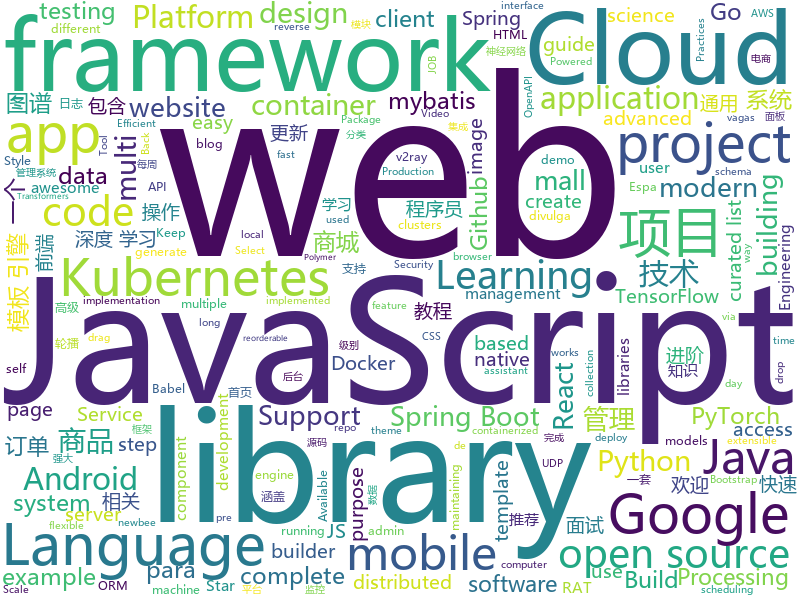

# 2020-01-03
See what the GitHub community is most excited about today.

## python
* [ALBERT](https://github.com/google-research/ALBERT)(**151 stars today**): ALBERT: A Lite BERT for Self-supervised Learning of Language Representations
* [awesome-python](https://github.com/vinta/awesome-python)(**49 stars today**): A curated list of awesome Python frameworks, libraries, software and resources
* [rq](https://github.com/rq/rq)(**195 stars today**): Simple job queues for Python
* [transformers](https://github.com/huggingface/transformers)(**82 stars today**): 🤗Transformers: State-of-the-art Natural Language Processing for TensorFlow 2.0 and PyTorch.
* [bert](https://github.com/google-research/bert)(**34 stars today**): TensorFlow code and pre-trained models for BERT
* [models](https://github.com/tensorflow/models)(**33 stars today**): Models and examples built with TensorFlow
* [HanLP](https://github.com/hankcs/HanLP)(**62 stars today**): Natural Language Processing for the next decade
* [sheetfu](https://github.com/socialpoint-labs/sheetfu)(**192 stars today**): Python library to interact with Google Sheets V4 API
* [airflow](https://github.com/apache/airflow)(**22 stars today**): Apache Airflow - A platform to programmatically author, schedule, and monitor workflows
* [localstack](https://github.com/localstack/localstack)(**22 stars today**): 💻A fully functional local AWS cloud stack. Develop and test your cloud & Serverless apps offline!
* [dlinject](https://github.com/DavidBuchanan314/dlinject)(**120 stars today**): Inject a shared library (i.e. arbitrary code) into a live linux process, without ptrace
* [telegram-finance-bot](https://github.com/alexey-goloburdin/telegram-finance-bot)(**16 stars today**): Телеграм бот для учёта личных расходов и ведения бюджета
* [fuzzDicts](https://github.com/TheKingOfDuck/fuzzDicts)(**49 stars today**): Web Pentesting Fuzz 字典,一个就够了。
* [vidgear](https://github.com/abhiTronix/vidgear)(**122 stars today**): Most Powerful multi-threaded Video Processing Python framework powerpacked with unique trailblazing features.
* [pre-commit](https://github.com/pre-commit/pre-commit)(**10 stars today**): A framework for managing and maintaining multi-language pre-commit hooks.
* [pytorch-lightning](https://github.com/williamFalcon/pytorch-lightning)(**15 stars today**): The lightweight PyTorch wrapper for ML researchers. Scale your models. Write less boilerplate
* [Lenia](https://github.com/Chakazul/Lenia)(**68 stars today**): Lenia - Mathematical Life Forms
* [nlp-recipes](https://github.com/microsoft/nlp-recipes)(**52 stars today**): Natural Language Processing Best Practices & Examples
* [ext_portrait_segmentation](https://github.com/clovaai/ext_portrait_segmentation)(**8 stars today**): 
* [pytorch-CycleGAN-and-pix2pix](https://github.com/junyanz/pytorch-CycleGAN-and-pix2pix)(**13 stars today**): Image-to-Image Translation in PyTorch
* [LASER](https://github.com/facebookresearch/LASER)(**8 stars today**): Language-Agnostic SEntence Representations
* [macaw](https://github.com/microsoft/macaw)(**22 stars today**): An Extensible Conversational Information Seeking Platform
* [ssd.pytorch](https://github.com/amdegroot/ssd.pytorch)(**9 stars today**): A PyTorch Implementation of Single Shot MultiBox Detector
* [oppia](https://github.com/oppia/oppia)(**14 stars today**): Tool for collaboratively building interactive lessons.
* [flask](https://github.com/pallets/flask)(**33 stars today**): The Python micro framework for building web applications.

## java
* [java-design-patterns](https://github.com/iluwatar/java-design-patterns)(**190 stars today**): Design patterns implemented in Java
* [spring-boot-demo](https://github.com/xkcoding/spring-boot-demo)(**132 stars today**): spring boot demo 是一个用来深度学习并实战 spring boot 的项目，目前总共包含 63 个集成demo，已经完成 52 个。 该项目已成功集成 actuator(监控)、admin(可视化监控)、logback(日志)、aopLog(通过AOP记录web请求日志)、统一异常处理(json级别和页面级别)、freemarker(模板引擎)、thymeleaf(模板引擎)、Beetl(模板引擎)、Enjoy(模板引擎)、JdbcTemplate(通用JDBC操作数据库)、JPA(强大的ORM框架)、mybatis(强大的ORM框架)、通用Mapper(快速操作Mybatis)、PageHelper(通用的Mybatis分页插件)、mybatis-plus(快速操作M…
* [spring-boot-examples](https://github.com/ityouknow/spring-boot-examples)(**45 stars today**): about learning Spring Boot via examples. Spring Boot 教程、技术栈示例代码，快速简单上手教程。
* [JavaGuide](https://github.com/Snailclimb/JavaGuide)(**206 stars today**): 【Java学习+面试指南】 一份涵盖大部分Java程序员所需要掌握的核心知识。
* [SpringBoot-Labs](https://github.com/YunaiV/SpringBoot-Labs)(**151 stars today**): Spring Boot 2.X 专栏更新中，未来更新 Spring Cloud Alibaba 。欢迎胖友 Star 一波
* [elasticsearch](https://github.com/elastic/elasticsearch)(**59 stars today**): Open Source, Distributed, RESTful Search Engine
* [aeron](https://github.com/real-logic/aeron)(**35 stars today**): Efficient reliable UDP unicast, UDP multicast, and IPC message transport
* [strimzi-kafka-operator](https://github.com/strimzi/strimzi-kafka-operator)(**4 stars today**): Apache Kafka running on Kubernetes
* [guava](https://github.com/google/guava)(**66 stars today**): Google core libraries for Java
* [H-Viewer](https://github.com/PureDark/H-Viewer)(**6 stars today**): An android feed reader application which fetch data with selector and regular expression.
* [mall-learning](https://github.com/macrozheng/mall-learning)(**32 stars today**): mall学习教程，架构、业务、技术要点全方位解析。mall项目（25k+star）是一套电商系统，使用现阶段主流技术实现。 涵盖了SpringBoot2.1.3、MyBatis3.4.6、Elasticsearch6.2.2、RabbitMQ3.7.15、Redis3.2、Mongodb3.2、Mysql5.7等技术，采用Docker容器化部署。
* [zipkin](https://github.com/openzipkin/zipkin)(**15 stars today**): Zipkin is a distributed tracing system
* [xxl-job](https://github.com/xuxueli/xxl-job)(**70 stars today**): A distributed task scheduling framework.（分布式任务调度平台XXL-JOB）
* [spotless](https://github.com/diffplug/spotless)(**3 stars today**): Keep your code spotless
* [newbee-mall](https://github.com/newbee-ltd/newbee-mall)(**49 stars today**): newbee-mall 项目（新蜂商城）是一套电商系统，包括 newbee-mall 商城系统及 newbee-mall-admin 商城后台管理系统，基于 Spring Boot 2.X 及相关技术栈开发。 前台商城系统包含首页门户、商品分类、新品上线、首页轮播、商品推荐、商品搜索、商品展示、购物车、订单结算、订单流程、个人订单管理、会员中心、帮助中心等模块。 后台管理系统包含数据面板、轮播图管理、商品管理、订单管理、会员管理、分类管理、设置等模块。
* [javacv](https://github.com/bytedeco/javacv)(**10 stars today**): Java interface to OpenCV, FFmpeg, and more
* [jib](https://github.com/GoogleContainerTools/jib)(**13 stars today**): 🏗Build container images for your Java applications.
* [vaquarkhan](https://github.com/vaquarkhan/vaquarkhan)(**2 stars today**): 
* [FlowLayout](https://github.com/hongyangAndroid/FlowLayout)(**4 stars today**): [不再维护]Android流式布局，支持单选、多选等，适合用于产品标签等。
* [bazel](https://github.com/bazelbuild/bazel)(**12 stars today**): a fast, scalable, multi-language and extensible build system
* [uhabits](https://github.com/iSoron/uhabits)(**8 stars today**): Loop Habit Tracker, a mobile app for creating and maintaining long-term positive habits
* [Auto.js](https://github.com/hyb1996/Auto.js)(**19 stars today**): A UiAutomator on android, does not need root access(安卓平台上的JavaScript自动化工具)
* [backtobackswe](https://github.com/bephrem1/backtobackswe)(**8 stars today**): Code Examples For Back To Back SWE Lessons
* [jhipster-registry](https://github.com/jhipster/jhipster-registry)(**2 stars today**): JHipster Registry, based on Spring Cloud Netflix Eureka and Spring Cloud Config
* [keycloak](https://github.com/keycloak/keycloak)(**14 stars today**): Open Source Identity and Access Management For Modern Applications and Services

## unknown
* [fxxkmakeding](https://github.com/xyjoey/fxxkmakeding)(**193 stars today**): 
* [coding_challenge-25](https://github.com/zero-to-mastery/coding_challenge-25)(**21 stars today**): 
* [computer-science](https://github.com/ossu/computer-science)(**106 stars today**): 🎓Path to a free self-taught education in Computer Science!
* [GitHubDaily](https://github.com/GitHubDaily/GitHubDaily)(**94 stars today**): GitHubDaily 分享内容定期整理与分类。欢迎推荐、自荐项目，让更多人知道你的项目。
* [architect-awesome](https://github.com/xingshaocheng/architect-awesome)(**81 stars today**): 后端架构师技术图谱
* [coding-interview-university](https://github.com/jwasham/coding-interview-university)(**48 stars today**): A complete computer science study plan to become a software engineer.
* [AlphaTree-graphic-deep-neural-network](https://github.com/weslynn/AlphaTree-graphic-deep-neural-network)(**78 stars today**): 机器学习(Machine Learning)、深度学习(Deep Learning)、对抗神经网络(GAN），图神经网络（GNN），NLP，大数据相关的发展路书(roadmap), 并附海量源码（python，pytorch）带大家消化基本知识点，突破面试，完成从新手到合格工程师的跨越，其中深度学习相关论文附有tensorflow caffe官方源码，应用部分含推荐算法和知识图谱
* [eng-practices](https://github.com/google/eng-practices)(**57 stars today**): Google's Engineering Practices documentation
* [OpenAPI-Specification](https://github.com/OAI/OpenAPI-Specification)(**15 stars today**): The OpenAPI Specification Repository
* [100-days-of-code](https://github.com/kallaway/100-days-of-code)(**8 stars today**): Fork this template for the 100 days journal - to keep yourself accountable (multiple languages available)
* [awesome-java](https://github.com/Snailclimb/awesome-java)(**48 stars today**): Collection of awesome Java project on Github(Github 上非常棒的 Java 开源项目集合).
* [vagas](https://github.com/backend-br/vagas)(**6 stars today**): ✌️Espaço para divulgação de vagas para backenders
* [programmer-advancement](https://github.com/Snailclimb/programmer-advancement)(**15 stars today**): 程序员应该有的一些好习惯！
* [vagas](https://github.com/frontendbr/vagas)(**6 stars today**): 🔬Espaço para divulgação de vagas para front-enders.
* [awesome-rat](https://github.com/alphaSeclab/awesome-rat)(**59 stars today**): RAT resources. 100+ open source RAT, 500+ RAT analysis blog/video.
* [industry-machine-learning](https://github.com/firmai/industry-machine-learning)(**8 stars today**): A curated list of applied machine learning and data science notebooks and libraries across different industries.
* [flutter_vignettes](https://github.com/gskinnerTeam/flutter_vignettes)(**30 stars today**): A collection of fun Flutter experiments, created by gskinner, in partnership with Google.
* [kubernetes-the-hard-way](https://github.com/kelseyhightower/kubernetes-the-hard-way)(**26 stars today**): Bootstrap Kubernetes the hard way on Google Cloud Platform. No scripts.
* [Specs](https://github.com/CocoaPods/Specs)(**5 stars today**): The CocoaPods Master Repo
* [proposals](https://github.com/tc39/proposals)(**16 stars today**): Tracking ECMAScript Proposals
* [AMD_Vanilla](https://github.com/AMD-OSX/AMD_Vanilla)(**4 stars today**): Native AMD macOS via Clover & OpenCore
* [blog](https://github.com/yygmind/blog)(**14 stars today**): 我是木易杨，公众号「高级前端进阶」作者，跟着我每周重点攻克一个前端面试重难点。接下来让我带你走进高级前端的世界，在进阶的路上，共勉！
* [system-design-interview](https://github.com/checkcheckzz/system-design-interview)(**10 stars today**): System design interview for IT companies
* [babel-handbook](https://github.com/jamiebuilds/babel-handbook)(**12 stars today**): 📘A guided handbook on how to use Babel and how to create plugins for Babel.
* [curriculum](https://github.com/cncf/curriculum)(**3 stars today**): 📚Open Source Curriculum for CNCF Certification Courses

## javascript
* [AndroidKnowledgeSystem](https://github.com/feelschaotic/AndroidKnowledgeSystem)(**230 stars today**): The most complete Android advanced route knowledge map⭐️你想要的最全 Android 进阶路线知识图谱+干货资料收集🚀
* [nodetube](https://github.com/mayeaux/nodetube)(**288 stars today**): Open-source YouTube alternative that also supports image and audio uploads. Powered by NodeJS
* [isocity](https://github.com/victorqribeiro/isocity)(**377 stars today**): A isometric city builder in JavaScript
* [flowy](https://github.com/alyssaxuu/flowy)(**72 stars today**): The minimal javascript library to create flowcharts✨
* [overreacted.io](https://github.com/gaearon/overreacted.io)(**26 stars today**): Personal blog by Dan Abramov.
* [riot-web](https://github.com/vector-im/riot-web)(**25 stars today**): A glossy Matrix collaboration client for the web.
* [react-select](https://github.com/JedWatson/react-select)(**12 stars today**): The Select Component for React.js
* [Sortable](https://github.com/SortableJS/Sortable)(**29 stars today**): Sortable — is a JavaScript library for reorderable drag-and-drop lists on modern browsers and touch devices. No jQuery required. Supports Meteor, AngularJS, React, Polymer, Vue, Ember, Knockout and any CSS library, e.g. Bootstrap.
* [wappalyzer](https://github.com/AliasIO/wappalyzer)(**26 stars today**): Cross-platform utility that uncovers the technologies used on websites.
* [react-native](https://github.com/facebook/react-native)(**51 stars today**): A framework for building native apps with React.
* [30-seconds-of-code](https://github.com/30-seconds/30-seconds-of-code)(**56 stars today**): Short JavaScript code snippets for all your development needs
* [complete-javascript-course](https://github.com/jonasschmedtmann/complete-javascript-course)(**8 stars today**): Starter files, final projects and FAQ for my Complete JavaScript course
* [create-react-app](https://github.com/facebook/create-react-app)(**43 stars today**): Set up a modern web app by running one command.
* [react](https://github.com/facebook/react)(**58 stars today**): A declarative, efficient, and flexible JavaScript library for building user interfaces.
* [bootstrap](https://github.com/twbs/bootstrap)(**30 stars today**): The most popular HTML, CSS, and JavaScript framework for developing responsive, mobile first projects on the web.
* [material-ui](https://github.com/mui-org/material-ui)(**42 stars today**): React components for faster and easier web development. Build your own design system, or start with Material Design.
* [slick](https://github.com/kenwheeler/slick)(**8 stars today**): the last carousel you'll ever need
* [RTCode](https://github.com/gsilvamartin/RTCode)(**14 stars today**): Real time code sharing web application
* [elementor](https://github.com/elementor/elementor)(**3 stars today**): The most advanced frontend drag & drop page builder. Create high-end, pixel perfect websites at record speeds. Any theme, any page, any design.
* [JSpider](https://github.com/scrapyhub/JSpider)(**62 stars today**): JSpider会每周更新至少一个网站的JS解密方式，欢迎 Star
* [javascript-algorithms](https://github.com/trekhleb/javascript-algorithms)(**85 stars today**): 📝Algorithms and data structures implemented in JavaScript with explanations and links to further readings
* [WebGL-Fluid-Simulation](https://github.com/PavelDoGreat/WebGL-Fluid-Simulation)(**17 stars today**): Play with fluids in your browser (works even on mobile)
* [Rhubarb](https://github.com/oguzeroglu/Rhubarb)(**32 stars today**): A WebSocket library for multiplayer JS games, works on WebWorkers with binary data.
* [chatify](https://github.com/munafio/chatify)(**11 stars today**): A package for Laravel PHP Framework to add a complete real-time chat system to your app by only a few steps.
* [react-leaflet](https://github.com/PaulLeCam/react-leaflet)(**6 stars today**): ⚛️React components for🍃Leaflet maps

## html
* [rhasspy](https://github.com/synesthesiam/rhasspy)(**111 stars today**): Rhasspy voice assistant for Home Assistant and Hass.IO
* [learning-area](https://github.com/mdn/learning-area)(**5 stars today**): Github repo for the MDN Learning Area.
* [fastText](https://github.com/facebookresearch/fastText)(**11 stars today**): Library for fast text representation and classification.
* [beginner-javascript](https://github.com/wesbos/beginner-javascript)(**31 stars today**): Slam Dunk JavaScript
* [portainer](https://github.com/portainer/portainer)(**16 stars today**): Making Docker management easy.
* [JavaScript30](https://github.com/wesbos/JavaScript30)(**8 stars today**): 30 Day Vanilla JS Challenge
* [swagger-codegen](https://github.com/swagger-api/swagger-codegen)(**9 stars today**): swagger-codegen contains a template-driven engine to generate documentation, API clients and server stubs in different languages by parsing your OpenAPI / Swagger definition.
* [web-moderno](https://github.com/cod3rcursos/web-moderno)(**5 stars today**): 
* [intro.js](https://github.com/usablica/intro.js)(**9 stars today**): A better way for new feature introduction and step-by-step users guide for your website and project.
* [skill-map](https://github.com/TeamStuQ/skill-map)(**14 stars today**): 程序员技能图谱
* [AR.js](https://github.com/jeromeetienne/AR.js)(**7 stars today**): Efficient Augmented Reality for the Web - 60fps on mobile!
* [HiddenEye](https://github.com/DarkSecDevelopers/HiddenEye)(**17 stars today**): Modern Phishing Tool With Advanced Functionality And Multiple Tunnelling Services [ Android-Support-Available ]
* [cypress-example-kitchensink](https://github.com/cypress-io/cypress-example-kitchensink)(**1 stars today**): This is an example app used to showcase Cypress.io testing.
* [chosen](https://github.com/harvesthq/chosen)(**3 stars today**): Chosen is a library for making long, unwieldy select boxes more friendly.
* [owasp-mstg](https://github.com/OWASP/owasp-mstg)(**8 stars today**): The Mobile Security Testing Guide (MSTG) is a comprehensive manual for mobile app security development, testing and reverse engineering.
* [schemaorg](https://github.com/schemaorg/schemaorg)(**5 stars today**): Schema.org - schemas and (appengine) software
* [turndown](https://github.com/domchristie/turndown)(**10 stars today**): 🛏An HTML to Markdown converter written in JavaScript
* [awesome-piracy](https://github.com/Igglybuff/awesome-piracy)(**39 stars today**): A curated list of awesome warez and piracy links
* [twofactorauth](https://github.com/2factorauth/twofactorauth)(**0 stars today**): List of sites with two factor auth support which includes SMS, email, phone calls, hardware, and software.
* [styleguide](https://github.com/google/styleguide)(**16 stars today**): Style guides for Google-originated open-source projects
* [hugo-academic](https://github.com/gcushen/hugo-academic)(**8 stars today**): 📝The website builder for Hugo. Build and deploy a beautiful website in minutes!
* [Spoon-Knife](https://github.com/octocat/Spoon-Knife)(**2 stars today**): This repo is for demonstration purposes only.
* [modern-resume-theme](https://github.com/sproogen/modern-resume-theme)(**3 stars today**): A modern static resume template and theme. Powered by Jekyll and GitHub pages.
* [v2-ui](https://github.com/sprov065/v2-ui)(**9 stars today**): 支持多协议多用户的 v2ray 面板，Support multi-protocol multi-user v2ray panel
* [en.javascript.info](https://github.com/javascript-tutorial/en.javascript.info)(**16 stars today**): Modern JavaScript Tutorial

## go
* [chaos-mesh](https://github.com/pingcap/chaos-mesh)(**286 stars today**): A Chaos Engineering Platform for Kubernetes
* [terraform-provider-google](https://github.com/terraform-providers/terraform-provider-google)(**3 stars today**): Terraform Google Cloud Platform provider
* [mongo-go-driver](https://github.com/mongodb/mongo-go-driver)(**11 stars today**): The Go driver for MongoDB
* [go-swagger](https://github.com/go-swagger/go-swagger)(**7 stars today**): Swagger 2.0 implementation for go
* [kind](https://github.com/kubernetes-sigs/kind)(**16 stars today**): Kubernetes IN Docker - local clusters for testing Kubernetes
* [vault](https://github.com/hashicorp/vault)(**13 stars today**): A tool for secrets management, encryption as a service, and privileged access management
* [kubebuilder](https://github.com/kubernetes-sigs/kubebuilder)(**6 stars today**): Kubebuilder - SDK for building Kubernetes APIs using CRDs
* [gqlgen](https://github.com/99designs/gqlgen)(**16 stars today**): go generate based graphql server library
* [nomad](https://github.com/hashicorp/nomad)(**5 stars today**): Nomad is an easy-to-use, flexible, and performant workload orchestrator that can deploy a mix of microservice, batch, containerized, and non-containerized applications. Nomad is easy to operate and scale and has native Consul and Vault integrations.
* [kubernetes](https://github.com/kubernetes/kubernetes)(**80 stars today**): Production-Grade Container Scheduling and Management
* [go](https://github.com/golang/go)(**74 stars today**): The Go programming language
* [oauth2_proxy](https://github.com/pusher/oauth2_proxy)(**7 stars today**): A reverse proxy that provides authentication with Google, Github or other providers.
* [moby](https://github.com/moby/moby)(**21 stars today**): Moby Project - a collaborative project for the container ecosystem to assemble container-based systems
* [opa](https://github.com/open-policy-agent/opa)(**11 stars today**): An open source, general-purpose policy engine.
* [datadog-agent](https://github.com/DataDog/datadog-agent)(**1 stars today**): Datadog Agent
* [kustomize](https://github.com/kubernetes-sigs/kustomize)(**15 stars today**): Customization of kubernetes YAML configurations
* [go-elasticsearch](https://github.com/elastic/go-elasticsearch)(**10 stars today**): The official Go client for Elasticsearch
* [nats-server](https://github.com/nats-io/nats-server)(**19 stars today**): High-Performance server for NATS, the cloud native messaging system.
* [client-go](https://github.com/kubernetes/client-go)(**2 stars today**): Go client for Kubernetes.
* [helm](https://github.com/helm/helm)(**29 stars today**): The Kubernetes Package Manager
* [charts](https://github.com/helm/charts)(**18 stars today**): Curated applications for Kubernetes
* [dashboard](https://github.com/kubernetes/dashboard)(**14 stars today**): General-purpose web UI for Kubernetes clusters
* [terraform-provider-aws](https://github.com/terraform-providers/terraform-provider-aws)(**15 stars today**): Terraform AWS provider
* [kubesphere](https://github.com/kubesphere/kubesphere)(**62 stars today**): Easy-to-use Production Ready Container Platform
* [k9s](https://github.com/derailed/k9s)(**22 stars today**): 🐶Kubernetes CLI To Manage Your Clusters In Style!

## WordCloud

