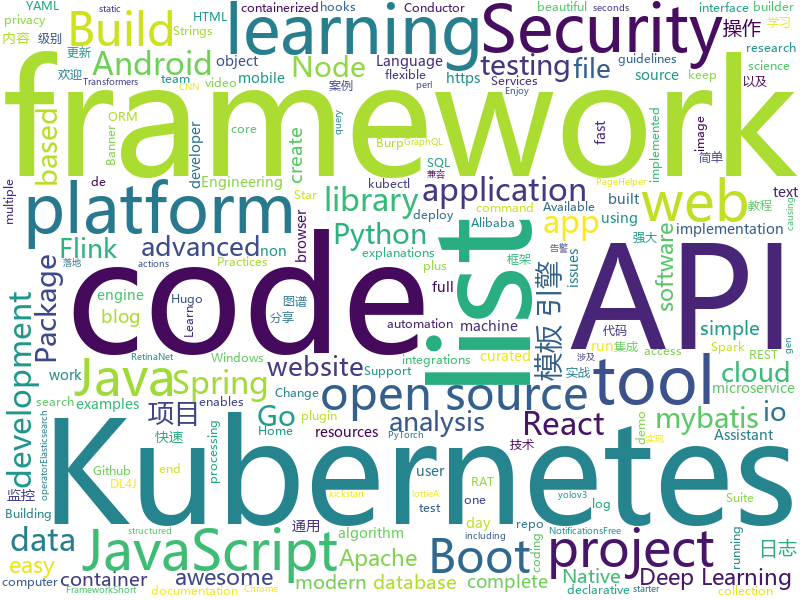

# 2020-01-04
See what the GitHub community is most excited about today.

## python
* [rq](https://github.com/rq/rq)(**379 stars today**): Simple job queues for Python
* [awesome-python](https://github.com/vinta/awesome-python)(**167 stars today**): A curated list of awesome Python frameworks, libraries, software and resources
* [coding_challenge-25](https://github.com/zero-to-mastery/coding_challenge-25)(**28 stars today**): 
* [cloud-custodian](https://github.com/cloud-custodian/cloud-custodian)(**2 stars today**): Rules engine for cloud security, cost optimization, and governance, DSL in yaml for policies to query, filter, and take actions on resources
* [models](https://github.com/tensorflow/models)(**88 stars today**): Models and examples built with TensorFlow
* [tensortrade](https://github.com/notadamking/tensortrade)(**1 stars today**): An open source reinforcement learning framework for training, evaluating, and deploying robust trading agents.
* [deep_sort_pytorch](https://github.com/ZQPei/deep_sort_pytorch)(**25 stars today**): MOT tracking using deepsort and yolov3 with pytorch
* [ThePassiveInvestor](https://github.com/JerBouma/ThePassiveInvestor)(**54 stars today**): Passive Investing for the Average Joe
* [lsassy](https://github.com/Hackndo/lsassy)(**92 stars today**): Extract credentials from lsass remotely
* [d2l-en](https://github.com/d2l-ai/d2l-en)(**57 stars today**): Dive into Deep Learning: an interactive deep learning book with code, math, and discussions, based on the NumPy interface.
* [streamlit](https://github.com/streamlit/streamlit)(**43 stars today**): Streamlit — The fastest way to build custom ML tools
* [doccano](https://github.com/doccano/doccano)(**7 stars today**): Open source text annotation tool for machine learning practitioner.
* [robotframework](https://github.com/robotframework/robotframework)(**8 stars today**): Generic automation framework for acceptance testing and RPA
* [30-Days-Of-Python](https://github.com/Asabeneh/30-Days-Of-Python)(**15 stars today**): A 30 days of python programming challenge
* [CppCoreGuidelines](https://github.com/isocpp/CppCoreGuidelines)(**16 stars today**): The C++ Core Guidelines are a set of tried-and-true guidelines, rules, and best practices about coding in C++
* [dgl](https://github.com/dmlc/dgl)(**15 stars today**): Python package built to ease deep learning on graph, on top of existing DL frameworks.
* [airflow](https://github.com/apache/airflow)(**12 stars today**): Apache Airflow - A platform to programmatically author, schedule, and monitor workflows
* [insightface](https://github.com/deepinsight/insightface)(**14 stars today**): Face Analysis Project on MXNet
* [kitty](https://github.com/kovidgoyal/kitty)(**17 stars today**): A cross-platform, fast, feature full, GPU based terminal emulator
* [Detectron](https://github.com/facebookresearch/Detectron)(**17 stars today**): FAIR's research platform for object detection research, implementing popular algorithms like Mask R-CNN and RetinaNet.
* [electricitymap-contrib](https://github.com/tmrowco/electricitymap-contrib)(**4 stars today**): A real-time visualisation of the CO2 emissions of electricity consumption
* [Mobile-Security-Framework-MobSF](https://github.com/MobSF/Mobile-Security-Framework-MobSF)(**7 stars today**): Mobile Security Framework (MobSF) is an automated, all-in-one mobile application (Android/iOS/Windows) pen-testing, malware analysis and security assessment framework capable of performing static and dynamic analysis.
* [big-list-of-naughty-strings](https://github.com/minimaxir/big-list-of-naughty-strings)(**11 stars today**): The Big List of Naughty Strings is a list of strings which have a high probability of causing issues when used as user-input data.
* [transformers](https://github.com/huggingface/transformers)(**75 stars today**): 🤗Transformers: State-of-the-art Natural Language Processing for TensorFlow 2.0 and PyTorch.
* [helm-charts](https://github.com/elastic/helm-charts)(**4 stars today**): You know, for Kubernetes

## java
* [java-design-patterns](https://github.com/iluwatar/java-design-patterns)(**183 stars today**): Design patterns implemented in Java
* [spring-boot-demo](https://github.com/xkcoding/spring-boot-demo)(**125 stars today**): spring boot demo 是一个用来深度学习并实战 spring boot 的项目，目前总共包含 63 个集成demo，已经完成 52 个。 该项目已成功集成 actuator(监控)、admin(可视化监控)、logback(日志)、aopLog(通过AOP记录web请求日志)、统一异常处理(json级别和页面级别)、freemarker(模板引擎)、thymeleaf(模板引擎)、Beetl(模板引擎)、Enjoy(模板引擎)、JdbcTemplate(通用JDBC操作数据库)、JPA(强大的ORM框架)、mybatis(强大的ORM框架)、通用Mapper(快速操作Mybatis)、PageHelper(通用的Mybatis分页插件)、mybatis-plus(快速操作M…
* [graal](https://github.com/oracle/graal)(**22 stars today**): GraalVM: Run Programs Faster Anywhere🚀
* [LumiBee_beta](https://github.com/madaeon01/LumiBee_beta)(**14 stars today**): 
* [tutorials](https://github.com/eugenp/tutorials)(**29 stars today**): Just Announced - "Learn Spring Security OAuth":
* [BannerViewPager](https://github.com/zhpanvip/BannerViewPager)(**35 stars today**): 🚀An awesome banner for Android. 这可能是全网最好用的Banner。简单、高效，无缝衔接Kotlin。一行代码实现循环轮播，一屏三页任意变，指示器样式任你挑。
* [conductor](https://github.com/Netflix/conductor)(**6 stars today**): Conductor is a microservices orchestration engine - https://netflix.github.io/conductor/
* [elasticsearch](https://github.com/elastic/elasticsearch)(**43 stars today**): Open Source, Distributed, RESTful Search Engine
* [jib](https://github.com/GoogleContainerTools/jib)(**10 stars today**): 🏗Build container images for your Java applications.
* [quarkus](https://github.com/quarkusio/quarkus)(**11 stars today**): Quarkus: Supersonic Subatomic Java.
* [strimzi-kafka-operator](https://github.com/strimzi/strimzi-kafka-operator)(**4 stars today**): Apache Kafka running on Kubernetes
* [SpringBoot-Labs](https://github.com/YunaiV/SpringBoot-Labs)(**138 stars today**): Spring Boot 2.X 专栏更新中，未来更新 Spring Cloud Alibaba 。欢迎胖友 Star 一波
* [debezium](https://github.com/debezium/debezium)(**9 stars today**): Change data capture for a variety of databases. https://debezium.io Please log issues in our JIRA at https://issues.jboss.org/projects/DBZ/issues
* [swagger-core](https://github.com/swagger-api/swagger-core)(**3 stars today**): Examples and server integrations for generating the Swagger API Specification, which enables easy access to your REST API
* [spring-boot-examples](https://github.com/ityouknow/spring-boot-examples)(**39 stars today**): about learning Spring Boot via examples. Spring Boot 教程、技术栈示例代码，快速简单上手教程。
* [lottie-react-native](https://github.com/react-native-community/lottie-react-native)(**11 stars today**): Lottie wrapper for React Native.
* [storm](https://github.com/apache/storm)(**5 stars today**): Mirror of Apache Storm
* [vavr](https://github.com/vavr-io/vavr)(**8 stars today**): VAVR (formerly called Javaslang) is a non-commercial, non-profit object-functional library that runs with Java 8+. It aims to reduce the lines of code and increase code quality.
* [jackson-databind](https://github.com/FasterXML/jackson-databind)(**2 stars today**): General data-binding package for Jackson (2.x): works on streaming API (core) implementation(s)
* [antlr4](https://github.com/antlr/antlr4)(**13 stars today**): ANTLR (ANother Tool for Language Recognition) is a powerful parser generator for reading, processing, executing, or translating structured text or binary files.
* [deeplearning4j-examples](https://github.com/eclipse/deeplearning4j-examples)(**2 stars today**): Deeplearning4j Examples (DL4J, DL4J Spark, DataVec)
* [Alink](https://github.com/alibaba/Alink)(**22 stars today**): Alink is the Machine Learning algorithm platform based on Flink, developed by the PAI team of Alibaba computing platform.
* [react-native-push-notification](https://github.com/zo0r/react-native-push-notification)(**3 stars today**): React Native Local and Remote Notifications
* [dbeaver](https://github.com/dbeaver/dbeaver)(**17 stars today**): Free universal database tool and SQL client
* [flink-learning](https://github.com/zhisheng17/flink-learning)(**39 stars today**): flink learning blog. http://www.54tianzhisheng.cn 含 Flink 入门、概念、原理、实战、性能调优、源码解析等内容。涉及 Flink Connector、Metrics、Library、DataStream API、Table API & SQL 等内容的学习案例，还有 Flink 落地应用的大型项目案例（PVUV、日志存储、百亿数据实时去重、监控告警）分享。

## unknown
* [javascript-questions](https://github.com/lydiahallie/javascript-questions)(**148 stars today**): A long list of (advanced) JavaScript questions, and their explanations✨
* [deploy-your-own-saas](https://github.com/Atarity/deploy-your-own-saas)(**221 stars today**): List of "only yours" cloud services for everyday needs🏴
* [Resources-for-Beginner-Bug-Bounty-Hunters](https://github.com/nahamsec/Resources-for-Beginner-Bug-Bounty-Hunters)(**47 stars today**): A list of resources for those interested in getting started in bug bounties
* [architect-awesome](https://github.com/xingshaocheng/architect-awesome)(**181 stars today**): 后端架构师技术图谱
* [GitHubDaily](https://github.com/GitHubDaily/GitHubDaily)(**219 stars today**): GitHubDaily 分享内容定期整理与分类。欢迎推荐、自荐项目，让更多人知道你的项目。
* [coding-interview-university](https://github.com/jwasham/coding-interview-university)(**143 stars today**): A complete computer science study plan to become a software engineer.
* [awesome-burp-suite](https://github.com/alphaSeclab/awesome-burp-suite)(**104 stars today**): Awesome Burp Suite Resources. 400+ open source Burp plugins, 500+ posts and videos.
* [Flutter-Course-Resources](https://github.com/londonappbrewery/Flutter-Course-Resources)(**29 stars today**): Learn to Code While Building Apps - The Complete Flutter Development Bootcamp
* [fxxkmakeding](https://github.com/xyjoey/fxxkmakeding)(**96 stars today**): 
* [awesome-rat](https://github.com/alphaSeclab/awesome-rat)(**43 stars today**): RAT resources. 100+ open source RAT, 500+ RAT analysis blog/video.
* [golang-developer-roadmap](https://github.com/Alikhll/golang-developer-roadmap)(**14 stars today**): Roadmap to becoming a Go developer in 2019
* [browser-2020](https://github.com/luruke/browser-2020)(**149 stars today**): Things you can do with a browser in 2020☕️
* [caprivacy](https://github.com/caprivacy/caprivacy)(**9 stars today**): California Consumer Privacy Directory
* [computer-science](https://github.com/ossu/computer-science)(**196 stars today**): 🎓Path to a free self-taught education in Computer Science!
* [SpotifyAdBlock](https://github.com/x0uid/SpotifyAdBlock)(**21 stars today**): Protect your privacy by blocking all annoying Spotify ads & analytics in Linux, OSX and Windows with hosts file.
* [100-days-of-code](https://github.com/kallaway/100-days-of-code)(**13 stars today**): Fork this template for the 100 days journal - to keep yourself accountable (multiple languages available)
* [API-Security](https://github.com/OWASP/API-Security)(**17 stars today**): OWASP API Security Project
* [awesome-falsehood](https://github.com/kdeldycke/awesome-falsehood)(**165 stars today**): 😱Falsehoods Programmers Believe in
* [frontend-roadmap](https://github.com/helloroman/frontend-roadmap)(**13 stars today**): 
* [OnJava8](https://github.com/LingCoder/OnJava8)(**61 stars today**): 《On Java 8》中文版，又名《Java编程思想》 第5版
* [SoTA-Point-Cloud](https://github.com/QingyongHu/SoTA-Point-Cloud)(**21 stars today**): Deep Learning for 3D Point Clouds
* [awesome-blazor](https://github.com/AdrienTorris/awesome-blazor)(**8 stars today**): Resources for Blazor, a .NET web framework using C#/Razor and HTML that runs in the browser with WebAssembly.
* [build-your-own-x](https://github.com/danistefanovic/build-your-own-x)(**53 stars today**): 🤓Build your own (insert technology here)
* [eng-practices](https://github.com/google/eng-practices)(**35 stars today**): Google's Engineering Practices documentation
* [Specs](https://github.com/CocoaPods/Specs)(**3 stars today**): The CocoaPods Master Repo

## javascript
* [nodetube](https://github.com/mayeaux/nodetube)(**498 stars today**): Open-source YouTube alternative that also supports image and audio uploads. Powered by NodeJS
* [beautiful-react-hooks](https://github.com/antonioru/beautiful-react-hooks)(**124 stars today**): 🔥A collection of beautiful and (hopefully) useful React hooks to speed-up your components and hooks development🔥
* [30DaysOfJavaScript](https://github.com/Asabeneh/30DaysOfJavaScript)(**69 stars today**): 
* [react](https://github.com/facebook/react)(**53 stars today**): A declarative, efficient, and flexible JavaScript library for building user interfaces.
* [json-server](https://github.com/typicode/json-server)(**18 stars today**): Get a full fake REST API with zero coding in less than 30 seconds (seriously)
* [isocity](https://github.com/victorqribeiro/isocity)(**609 stars today**): A isometric city builder in JavaScript
* [clean-code-javascript](https://github.com/ryanmcdermott/clean-code-javascript)(**52 stars today**): 🛁Clean Code concepts adapted for JavaScript
* [next.js](https://github.com/zeit/next.js)(**35 stars today**): The React Framework
* [30-seconds-of-code](https://github.com/30-seconds/30-seconds-of-code)(**40 stars today**): Short JavaScript code snippets for all your development needs
* [graphql-engine](https://github.com/hasura/graphql-engine)(**26 stars today**): Blazing fast, instant realtime GraphQL APIs on Postgres with fine grained access control, also trigger webhooks on database events.
* [TaskConfig](https://github.com/sazs34/TaskConfig)(**15 stars today**): Quantumult签到(京东/网易/爱奇艺/贴吧)以及天气信息获取，以及surge/qx兼容脚本
* [javascript-algorithms](https://github.com/trekhleb/javascript-algorithms)(**76 stars today**): 📝Algorithms and data structures implemented in JavaScript with explanations and links to further readings
* [flowy](https://github.com/alyssaxuu/flowy)(**90 stars today**): The minimal javascript library to create flowcharts✨
* [AndroidKnowledgeSystem](https://github.com/feelschaotic/AndroidKnowledgeSystem)(**373 stars today**): The most complete Android advanced route knowledge map⭐️你想要的最全 Android 进阶路线知识图谱+干货资料收集🚀
* [commitlint](https://github.com/conventional-changelog/commitlint)(**29 stars today**): 📓Lint commit messages
* [flexsearch](https://github.com/nextapps-de/flexsearch)(**45 stars today**): Next-Generation full text search library for Browser and Node.js
* [renovate](https://github.com/renovatebot/renovate)(**4 stars today**): Universal dependency update tool that fits into your workflows.
* [esercizi-di-programmazione-javascript](https://github.com/AlbertoOlla/esercizi-di-programmazione-javascript)(**4 stars today**): Esercizi di informatica! Impara a programmare, metti alla prova!
* [angular.js](https://github.com/angular/angular.js)(**6 stars today**): AngularJS - HTML enhanced for web apps!
* [react-typescript-chrome-extension-starter](https://github.com/aeksco/react-typescript-chrome-extension-starter)(**54 stars today**): 🖥A Chrome Extension starter kit built with React, TypeScript, SCSS, Storybook, Jest, EsLint, Prettier, Webpack and Bootstrap
* [fastify](https://github.com/fastify/fastify)(**20 stars today**): Fast and low overhead web framework, for Node.js
* [gatsby](https://github.com/gatsbyjs/gatsby)(**29 stars today**): Build blazing fast, modern apps and websites with React
* [core-js](https://github.com/zloirock/core-js)(**11 stars today**): Standard Library
* [webdriverio](https://github.com/webdriverio/webdriverio)(**1 stars today**): Next-gen WebDriver test automation framework for Node.js
* [create-react-app](https://github.com/facebook/create-react-app)(**39 stars today**): Set up a modern web app by running one command.

## html
* [awesome-piracy](https://github.com/Igglybuff/awesome-piracy)(**53 stars today**): A curated list of awesome warez and piracy links
* [HiddenEye](https://github.com/DarkSecDevelopers/HiddenEye)(**40 stars today**): Modern Phishing Tool With Advanced Functionality And Multiple Tunnelling Services [ Android-Support-Available ]
* [rhasspy](https://github.com/synesthesiam/rhasspy)(**88 stars today**): Rhasspy voice assistant for Home Assistant and Hass.IO
* [web-moderno](https://github.com/cod3rcursos/web-moderno)(**3 stars today**): 
* [webdevbootcamp](https://github.com/nax3t/webdevbootcamp)(**8 stars today**): All source code for back-end projects from the Web Developer Bootcamp
* [learning-area](https://github.com/mdn/learning-area)(**2 stars today**): Github repo for the MDN Learning Area.
* [foundation-sites](https://github.com/foundation/foundation-sites)(**6 stars today**): The most advanced responsive front-end framework in the world. Quickly create prototypes and production code for sites that work on any kind of device.
* [wpt](https://github.com/web-platform-tests/wpt)(**6 stars today**): Test suites for Web platform specs — including WHATWG, W3C, and others
* [Mi1k7ea.github.io](https://github.com/mi1k7ea/Mi1k7ea.github.io)(**15 stars today**): 
* [hyperblog](https://github.com/freddier/hyperblog)(**7 stars today**): Un blog increíble para el curso de Git y Github de Platzi
* [flag-icon-css](https://github.com/lipis/flag-icon-css)(**6 stars today**): 🎏A collection of all country flags in SVG — plus the CSS for easier integration
* [2019-too-warm](https://github.com/vis4/2019-too-warm)(**8 stars today**): 
* [JavaScript30](https://github.com/wesbos/JavaScript30)(**13 stars today**): 30 Day Vanilla JS Challenge
* [personal-website](https://github.com/github/personal-website)(**7 stars today**): Code that'll help you kickstart a personal website that showcases your work as a software developer.
* [portainer](https://github.com/portainer/portainer)(**12 stars today**): Making Docker management easy.
* [en.javascript.info](https://github.com/javascript-tutorial/en.javascript.info)(**18 stars today**): Modern JavaScript Tutorial
* [owasp-mstg](https://github.com/OWASP/owasp-mstg)(**3 stars today**): The Mobile Security Testing Guide (MSTG) is a comprehensive manual for mobile app security development, testing and reverse engineering.
* [sample-code](https://github.com/appium-boneyard/sample-code)(**0 stars today**): appium sample code (dotnet, java, node, perl, php, python, ruby, etc.)
* [hugo-academic](https://github.com/gcushen/hugo-academic)(**4 stars today**): 📝The website builder for Hugo. Build and deploy a beautiful website in minutes!
* [hugo-book](https://github.com/alex-shpak/hugo-book)(**5 stars today**): Hugo documentation theme as simple as plain book
* [blog_os](https://github.com/phil-opp/blog_os)(**11 stars today**): Writing an OS in Rust
* [lottie](https://github.com/airbnb/lottie)(**4 stars today**): Lottie documentation for http://airbnb.io/lottie
* [machine-learning-systems-design](https://github.com/chiphuyen/machine-learning-systems-design)(**8 stars today**): A booklet on machine learning systems design with exercises
* [home-assistant.io](https://github.com/home-assistant/home-assistant.io)(**4 stars today**): 📘Home Assistant User documentation
* [keep-a-changelog](https://github.com/olivierlacan/keep-a-changelog)(**1 stars today**): If you build software, keep a changelog.

## go
* [kubectl-tree](https://github.com/ahmetb/kubectl-tree)(**287 stars today**): kubectl plugin to browse Kubernetes object hierarchies as a tree🎄(using? star the repo!)
* [helm](https://github.com/helm/helm)(**28 stars today**): The Kubernetes Package Manager
* [nomad](https://github.com/hashicorp/nomad)(**8 stars today**): Nomad is an easy-to-use, flexible, and performant workload orchestrator that can deploy a mix of microservice, batch, containerized, and non-containerized applications. Nomad is easy to operate and scale and has native Consul and Vault integrations.
* [moby](https://github.com/moby/moby)(**14 stars today**): Moby Project - a collaborative project for the container ecosystem to assemble container-based systems
* [loki](https://github.com/grafana/loki)(**9 stars today**): Like Prometheus, but for logs.
* [charts](https://github.com/helm/charts)(**13 stars today**): Curated applications for Kubernetes
* [blackbox_exporter](https://github.com/prometheus/blackbox_exporter)(**8 stars today**): Blackbox prober exporter
* [go-grpc-middleware](https://github.com/grpc-ecosystem/go-grpc-middleware)(**6 stars today**): Golang gRPC Middlewares: interceptor chaining, auth, logging, retries and more.
* [go-micro](https://github.com/micro/go-micro)(**26 stars today**): A Go microservices development framework
* [testify](https://github.com/stretchr/testify)(**10 stars today**): A toolkit with common assertions and mocks that plays nicely with the standard library
* [alertmanager](https://github.com/prometheus/alertmanager)(**4 stars today**): Prometheus Alertmanager
* [mongo-go-driver](https://github.com/mongodb/mongo-go-driver)(**9 stars today**): The Go driver for MongoDB
* [k9s](https://github.com/derailed/k9s)(**19 stars today**): 🐶Kubernetes CLI To Manage Your Clusters In Style!
* [sampler](https://github.com/sqshq/sampler)(**130 stars today**): Tool for shell commands execution, visualization and alerting. Configured with a simple YAML file.
* [spark-on-k8s-operator](https://github.com/GoogleCloudPlatform/spark-on-k8s-operator)(**2 stars today**): Kubernetes operator for managing the lifecycle of Apache Spark applications on Kubernetes.
* [flux](https://github.com/fluxcd/flux)(**5 stars today**): The GitOps Kubernetes operator
* [elastic](https://github.com/olivere/elastic)(**5 stars today**): Elasticsearch client for Go.
* [krew](https://github.com/kubernetes-sigs/krew)(**31 stars today**): 📦Package manager for kubectl plugins
* [chaos-mesh](https://github.com/pingcap/chaos-mesh)(**346 stars today**): A Chaos Engineering Platform for Kubernetes
* [minikube](https://github.com/kubernetes/minikube)(**17 stars today**): Run Kubernetes locally
* [controller-runtime](https://github.com/kubernetes-sigs/controller-runtime)(**2 stars today**): Repo for the controller-runtime subproject of kubebuilder (sig-apimachinery)
* [terraform](https://github.com/hashicorp/terraform)(**16 stars today**): Terraform enables you to safely and predictably create, change, and improve infrastructure. It is an open source tool that codifies APIs into declarative configuration files that can be shared amongst team members, treated as code, edited, reviewed, and versioned.
* [quorum](https://github.com/jpmorganchase/quorum)(**3 stars today**): A permissioned implementation of Ethereum supporting data privacy
* [go-swagger](https://github.com/go-swagger/go-swagger)(**7 stars today**): Swagger 2.0 implementation for go
* [cloud-on-k8s](https://github.com/elastic/cloud-on-k8s)(**4 stars today**): Elastic Cloud on Kubernetes

## WordCloud

