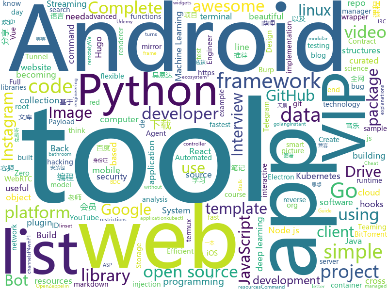

# 2020-01-05
See what the GitHub community is most excited about today.

## python
* [d2l-en](https://github.com/d2l-ai/d2l-en)(**83 stars today**): Dive into Deep Learning: an interactive deep learning book with code, math, and discussions, based on the NumPy interface.
* [EfficientDet.Pytorch](https://github.com/toandaominh1997/EfficientDet.Pytorch)(**39 stars today**): Implementation EfficientDet: Scalable and Efficient Object Detection in PyTorch
* [freqtrade](https://github.com/freqtrade/freqtrade)(**15 stars today**): Free, open source crypto trading bot
* [pandas](https://github.com/pandas-dev/pandas)(**34 stars today**): Flexible and powerful data analysis / manipulation library for Python, providing labeled data structures similar to R data.frame objects, statistical functions, and much more
* [awesome-python](https://github.com/vinta/awesome-python)(**163 stars today**): A curated list of awesome Python frameworks, libraries, software and resources
* [youtube-dl](https://github.com/ytdl-org/youtube-dl)(**101 stars today**): Command-line program to download videos from YouTube.com and other video sites
* [lsassy](https://github.com/Hackndo/lsassy)(**103 stars today**): Extract credentials from lsass remotely
* [python-telegram-bot](https://github.com/python-telegram-bot/python-telegram-bot)(**15 stars today**): We have made you a wrapper you can't refuse
* [sqlmap](https://github.com/sqlmapproject/sqlmap)(**39 stars today**): Automatic SQL injection and database takeover tool
* [2019-CCF-BDCI-OCR-MCZJ-OCR-IdentificationIDElement](https://github.com/Mingtzge/2019-CCF-BDCI-OCR-MCZJ-OCR-IdentificationIDElement)(**50 stars today**): 2019CCF-BDCI大赛 最佳创新探索奖获得者 基于OCR身份证要素提取赛题冠军 天晨破晓团队 赛题源码
* [wtfpython](https://github.com/satwikkansal/wtfpython)(**134 stars today**): Exploring Python through counter-intuitive snippets. If you think you know Python, think once more!
* [InstaPy](https://github.com/timgrossmann/InstaPy)(**12 stars today**): 📷Instagram Bot - Tool for automated Instagram interactions
* [Computer-Networking-A-Top-Down-Approach-NOTES](https://github.com/moranzcw/Computer-Networking-A-Top-Down-Approach-NOTES)(**14 stars today**): 《计算机网络－自顶向下方法(原书第6版)》编程作业，Wireshark实验文档的翻译和解答。
* [interactive-coding-challenges](https://github.com/donnemartin/interactive-coding-challenges)(**23 stars today**): 120+ interactive Python coding interview challenges (algorithms and data structures). Includes Anki flashcards.
* [ml-agents](https://github.com/Unity-Technologies/ml-agents)(**16 stars today**): Unity Machine Learning Agents Toolkit
* [DeDRM_tools](https://github.com/apprenticeharper/DeDRM_tools)(**7 stars today**): DeDRM tools for ebooks
* [code_snippets](https://github.com/CoreyMSchafer/code_snippets)(**13 stars today**): 
* [instaloader](https://github.com/instaloader/instaloader)(**13 stars today**): Download pictures (or videos) along with their captions and other metadata from Instagram.
* [PhoneInfoga](https://github.com/sundowndev/PhoneInfoga)(**24 stars today**): Advanced information gathering & OSINT tool for phone numbers
* [Tool-X](https://github.com/Rajkumrdusad/Tool-X)(**7 stars today**): Tool-X is a kali linux hacking Tool installer. Tool-X developed for termux and other android terminals. using Tool-X you can install almost 370+ hacking tools in termux app and other linux based distributions.
* [alpha_vantage](https://github.com/RomelTorres/alpha_vantage)(**11 stars today**): A python wrapper for Alpha Vantage API for financial data.
* [KivyMD](https://github.com/HeaTTheatR/KivyMD)(**3 stars today**): KivyMD is a collection of Material Design compliant widgets for use with Kivy, a framework for cross-platform, touch-enabled graphical applications.
* [AutoRCCar](https://github.com/hamuchiwa/AutoRCCar)(**6 stars today**): OpenCV Python Neural Network Autonomous RC Car
* [awesome-machine-learning](https://github.com/josephmisiti/awesome-machine-learning)(**31 stars today**): A curated list of awesome Machine Learning frameworks, libraries and software.
* [EagleEye](https://github.com/ThoughtfulDev/EagleEye)(**12 stars today**): Stalk your Friends. Find their Instagram, FB and Twitter Profiles using Image Recognition and Reverse Image Search.

## java
* [portfolio](https://github.com/buchen/portfolio)(**6 stars today**): A simple tool to calculate the overall performance of an investment portfolio.
* [HackerRank_solutions](https://github.com/RodneyShag/HackerRank_solutions)(**6 stars today**): 317 efficient solutions to HackerRank problems
* [ridesharing-android](https://github.com/hypertrack/ridesharing-android)(**49 stars today**): Ridesharing driver & rider sample apps using HyperTrack SDK
* [phimpme-android](https://github.com/fossasia/phimpme-android)(**11 stars today**): Phimp.me Photo Imaging and Picture Editor https://play.google.com/store/apps/details?id=org.fossasia.phimpme
* [android-interview-questions](https://github.com/MindorksOpenSource/android-interview-questions)(**5 stars today**): Your Cheat Sheet For Android Interview - Android Interview Questions
* [JCTools](https://github.com/JCTools/JCTools)(**24 stars today**): 
* [Auto.js](https://github.com/hyb1996/Auto.js)(**17 stars today**): A UiAutomator on android, does not need root access(安卓平台上的JavaScript自动化工具)
* [TelegramBots](https://github.com/rubenlagus/TelegramBots)(**4 stars today**): Java library to create bots using Telegram Bots API
* [openhab-addons](https://github.com/openhab/openhab-addons)(**1 stars today**): Add-ons for openHAB
* [backtobackswe](https://github.com/bephrem1/backtobackswe)(**11 stars today**): Code Examples For Back To Back SWE Lessons
* [Arduino](https://github.com/arduino/Arduino)(**7 stars today**): open-source electronics prototyping platform
* [quickstart-android](https://github.com/firebase/quickstart-android)(**7 stars today**): Firebase Quickstart Samples for Android
* [openhab-core](https://github.com/openhab/openhab-core)(**4 stars today**): Core framework of openHAB
* [spring-in-action-5-samples](https://github.com/habuma/spring-in-action-5-samples)(**4 stars today**): Home for example code from Spring in Action 5.
* [java-design-patterns](https://github.com/iluwatar/java-design-patterns)(**276 stars today**): Design patterns implemented in Java
* [XPrivacyLua](https://github.com/M66B/XPrivacyLua)(**5 stars today**): Really simple to use privacy manager for Android 6.0 Marshmallow and later
* [NewPipe](https://github.com/TeamNewPipe/NewPipe)(**21 stars today**): A libre lightweight streaming front-end for Android.
* [android-fundamentals-apps-v2](https://github.com/google-developer-training/android-fundamentals-apps-v2)(**0 stars today**): 
* [termux-app](https://github.com/termux/termux-app)(**14 stars today**): Android terminal and Linux environment - app repository.
* [LumiBee_beta](https://github.com/madaeon01/LumiBee_beta)(**16 stars today**): 
* [SAI](https://github.com/Aefyr/SAI)(**6 stars today**): Android split APKs installer
* [FastHub](https://github.com/k0shk0sh/FastHub)(**12 stars today**): FastHub the ultimate GitHub client for Android.
* [interviews](https://github.com/kdn251/interviews)(**31 stars today**): Everything you need to know to get the job.
* [AntennaPod](https://github.com/AntennaPod/AntennaPod)(**2 stars today**): A podcast manager for Android
* [VirtualXposed](https://github.com/android-hacker/VirtualXposed)(**26 stars today**): A simple app to use Xposed without root, unlock the bootloader or modify system image, etc.

## unknown
* [awesome-mobile-security](https://github.com/vaib25vicky/awesome-mobile-security)(**211 stars today**): An effort to build a single place for all useful android and iOS security related stuff. All references and tools are belong to their respective owners. I'm just maintaining it.
* [javascript-questions](https://github.com/lydiahallie/javascript-questions)(**237 stars today**): A long list of (advanced) JavaScript questions, and their explanations✨
* [Resources-for-Beginner-Bug-Bounty-Hunters](https://github.com/nahamsec/Resources-for-Beginner-Bug-Bounty-Hunters)(**61 stars today**): A list of resources for those interested in getting started in bug bounties
* [developer-roadmap](https://github.com/kamranahmedse/developer-roadmap)(**121 stars today**): Roadmap to becoming a web developer in 2020
* [GitHubDaily](https://github.com/GitHubDaily/GitHubDaily)(**231 stars today**): GitHubDaily 分享内容定期整理与分类。欢迎推荐、自荐项目，让更多人知道你的项目。
* [trackerslist](https://github.com/ngosang/trackerslist)(**134 stars today**): Updated list of public BitTorrent trackers
* [Flutter-Course-Resources](https://github.com/londonappbrewery/Flutter-Course-Resources)(**38 stars today**): Learn to Code While Building Apps - The Complete Flutter Development Bootcamp
* [deploy-your-own-saas](https://github.com/Atarity/deploy-your-own-saas)(**270 stars today**): List of "only yours" cloud services for everyday needs🏴
* [awesome-burp-suite](https://github.com/alphaSeclab/awesome-burp-suite)(**113 stars today**): Awesome Burp Suite Resources. 400+ open source Burp plugins, 500+ posts and videos.
* [coding-interview-university](https://github.com/jwasham/coding-interview-university)(**160 stars today**): A complete computer science study plan to become a software engineer.
* [programmer-advancement](https://github.com/Snailclimb/programmer-advancement)(**154 stars today**): 程序员应该有的一些好习惯！
* [architect-awesome](https://github.com/xingshaocheng/architect-awesome)(**230 stars today**): 后端架构师技术图谱
* [OnJava8](https://github.com/LingCoder/OnJava8)(**75 stars today**): 《On Java 8》中文版，又名《Java编程思想》 第5版
* [xss-payload-list](https://github.com/payloadbox/xss-payload-list)(**20 stars today**): 🎯Cross Site Scripting ( XSS ) Vulnerability Payload List
* [build-your-own-x](https://github.com/danistefanovic/build-your-own-x)(**92 stars today**): 🤓Build your own (insert technology here)
* [Python-programming-exercises](https://github.com/zhiwehu/Python-programming-exercises)(**36 stars today**): 100+ Python challenging programming exercises
* [wildcat-vip-account](https://github.com/wuxingsanren/wildcat-vip-account)(**43 stars today**): 野猫VIP - 每天分享最新的百度网盘SVIP、迅雷超级会员、优酷VIP会员、哔哩哔哩大会员、百度文库VIP、苹果ID、天眼查VIP等等各类VIP帐号，随取随用，完全免费，绝无套路，同时提供：百度文库VIP下载、图库素材VIP下载、学术论文VIP下载、全网视频VIP解析、全网音乐MP3免费听及下载 ，欢迎推荐分享给好友！
* [fancyss_history_package](https://github.com/hq450/fancyss_history_package)(**24 stars today**): 科学上网插件的离线安装包储存在这里
* [gitignore](https://github.com/github/gitignore)(**87 stars today**): A collection of useful .gitignore templates
* [command-injection-payload-list](https://github.com/payloadbox/command-injection-payload-list)(**24 stars today**): 🎯Command Injection Payload List
* [sre-interview-prep-guide](https://github.com/mxssl/sre-interview-prep-guide)(**50 stars today**): Site Reliability Engineer Interview Preparation Guide
* [awesome-project-ideas](https://github.com/NirantK/awesome-project-ideas)(**10 stars today**): Curated list of Machine Learning, NLP, Vision, Recommender Systems Project Ideas
* [AspNetCore-Developer-Roadmap](https://github.com/MoienTajik/AspNetCore-Developer-Roadmap)(**47 stars today**): Roadmap to becoming an ASP.NET Core developer in 2019
* [heroicons-ui](https://github.com/sschoger/heroicons-ui)(**16 stars today**): 
* [Awesome-Red-Teaming](https://github.com/yeyintminthuhtut/Awesome-Red-Teaming)(**8 stars today**): List of Awesome Red Teaming Resources

## javascript
* [30DaysOfJavaScript](https://github.com/Asabeneh/30DaysOfJavaScript)(**80 stars today**): A 30 days of JavaScript programming challenge
* [nodetube](https://github.com/mayeaux/nodetube)(**484 stars today**): Open-source YouTube alternative that also supports image and audio uploads. Powered by NodeJS
* [MagicMirror](https://github.com/MichMich/MagicMirror)(**13 stars today**): MagicMirror² is an open source modular smart mirror platform. With a growing list of installable modules, the MagicMirror² allows you to convert your hallway or bathroom mirror into your personal assistant.
* [node](https://github.com/nodejs/node)(**50 stars today**): Node.js JavaScript runtime✨🐢🚀✨
* [complete-node-bootcamp](https://github.com/jonasschmedtmann/complete-node-bootcamp)(**2 stars today**): Starter files, final projects and FAQ for my Complete Node.js Bootcamp
* [vue-next-webpack-preview](https://github.com/vuejs/vue-next-webpack-preview)(**27 stars today**): 
* [TaskConfig](https://github.com/sazs34/TaskConfig)(**27 stars today**): Quantumult签到(京东/网易/爱奇艺/贴吧)以及天气信息获取，以及surge/qx兼容脚本
* [nuxt.js](https://github.com/nuxt/nuxt.js)(**45 stars today**): The Vue.js Framework
* [dear-github-2.0](https://github.com/drop-ice/dear-github-2.0)(**12 stars today**): 📨An open letter to GitHub from the maintainers of open source projects
* [beautiful-react-hooks](https://github.com/antonioru/beautiful-react-hooks)(**163 stars today**): 🔥A collection of beautiful and (hopefully) useful React hooks to speed-up your components and hooks development🔥
* [freeCodeCamp](https://github.com/freeCodeCamp/freeCodeCamp)(**79 stars today**): The https://www.freeCodeCamp.org open source codebase and curriculum. Learn to code for free together with millions of people.
* [thelounge](https://github.com/thelounge/thelounge)(**7 stars today**): 💬Modern, responsive, cross-platform, self-hosted web IRC client
* [react-developer-roadmap](https://github.com/adam-golab/react-developer-roadmap)(**12 stars today**): Roadmap to becoming a React developer in 2019
* [fre](https://github.com/yisar/fre)(**31 stars today**): 👻Tiny React16 like framework with Concurrent.
* [lx-music-desktop](https://github.com/lyswhut/lx-music-desktop)(**64 stars today**): 一个基于 electron 的音乐软件
* [flexsearch](https://github.com/nextapps-de/flexsearch)(**58 stars today**): Next-Generation full text search library for Browser and Node.js
* [simple-peer](https://github.com/feross/simple-peer)(**19 stars today**): 📡Simple WebRTC video, voice, and data channels
* [P4wnP1_aloa](https://github.com/mame82/P4wnP1_aloa)(**5 stars today**): P4wnP1 A.L.O.A. by MaMe82 is a framework which turns a Rapsberry Pi Zero W into a flexible, low-cost platform for pentesting, red teaming and physical engagements ... or into "A Little Offensive Appliance".
* [udemy-downloader-gui](https://github.com/FaisalUmair/udemy-downloader-gui)(**14 stars today**): A desktop application for downloading Udemy Courses
* [pixi.js](https://github.com/pixijs/pixi.js)(**33 stars today**): The HTML5 Creation Engine: Create beautiful digital content with the fastest, most flexible 2D WebGL renderer.
* [RSSHub](https://github.com/DIYgod/RSSHub)(**35 stars today**): 🍰万物皆可 RSS
* [Crash-Course-Computer-Science-Chinese](https://github.com/1c7/Crash-Course-Computer-Science-Chinese)(**71 stars today**): 💻计算机速成课 | Crash Course 字幕组 (全40集 2018-5-1 精校完成)
* [openzeppelin-contracts](https://github.com/OpenZeppelin/openzeppelin-contracts)(**5 stars today**): OpenZeppelin Contracts is a library for secure smart contract development.
* [simplenote-electron](https://github.com/Automattic/simplenote-electron)(**6 stars today**): A Simplenote React app packaged via Electron for Windows and Linux
* [webtorrent](https://github.com/webtorrent/webtorrent)(**23 stars today**): ⚡️Streaming torrent client for the web

## html
* [awesome-piracy](https://github.com/Igglybuff/awesome-piracy)(**77 stars today**): A curated list of awesome warez and piracy links
* [hyperblog](https://github.com/freddier/hyperblog)(**10 stars today**): Un blog increíble para el curso de Git y Github de Platzi
* [REKCARC-TSC-UHT](https://github.com/PKUanonym/REKCARC-TSC-UHT)(**26 stars today**): 清华大学计算机系课程攻略 Guidance for courses in Department of Computer Science and Technology, Tsinghua University
* [fluxion](https://github.com/FluxionNetwork/fluxion)(**7 stars today**): Fluxion is a remake of linset by vk496 with less bugs and enhanced functionality.
* [deeplearning_ai_books](https://github.com/fengdu78/deeplearning_ai_books)(**23 stars today**): deeplearning.ai（吴恩达老师的深度学习课程笔记及资源）
* [Coursera-ML-AndrewNg-Notes](https://github.com/fengdu78/Coursera-ML-AndrewNg-Notes)(**39 stars today**): 吴恩达老师的机器学习课程个人笔记
* [owasp-mstg](https://github.com/OWASP/owasp-mstg)(**8 stars today**): The Mobile Security Testing Guide (MSTG) is a comprehensive manual for mobile app security development, testing and reverse engineering.
* [cvessentials](https://github.com/onlyphantom/cvessentials)(**19 stars today**): Essentials of computer vision
* [complete-web-developer-manual](https://github.com/zero-to-mastery/complete-web-developer-manual)(**1 stars today**): All resources and notes from the Complete Web Developer in 2018: Zero to Mastery course
* [AR.js](https://github.com/jeromeetienne/AR.js)(**18 stars today**): Efficient Augmented Reality for the Web - 60fps on mobile!
* [golang101](https://github.com/golang101/golang101)(**67 stars today**): Go语言101 : 一本侧重于Go语言语法和语义的编程解释和指导书
* [webdevbootcamp](https://github.com/nax3t/webdevbootcamp)(**8 stars today**): All source code for back-end projects from the Web Developer Bootcamp
* [learning-area](https://github.com/mdn/learning-area)(**4 stars today**): Github repo for the MDN Learning Area.
* [hugo-academic](https://github.com/gcushen/hugo-academic)(**11 stars today**): 📝The website builder for Hugo. Build and deploy a beautiful website in minutes!
* [tools](https://github.com/googlecodelabs/tools)(**7 stars today**): Codelabs management & hosting tools
* [beginner-javascript](https://github.com/wesbos/beginner-javascript)(**35 stars today**): Slam Dunk JavaScript
* [GDIndex](https://github.com/maple3142/GDIndex)(**7 stars today**): A Google Drive Index built with Vue Running on CloudFlare Workers
* [JavaScript30](https://github.com/wesbos/JavaScript30)(**20 stars today**): 30 Day Vanilla JS Challenge
* [qiubaiying.github.io](https://github.com/qiubaiying/qiubaiying.github.io)(**11 stars today**): BY Blog ->
* [Deep-Learning-Training-GUI](https://github.com/mustafamerttunali/Deep-Learning-Training-GUI)(**6 stars today**): Train and predict your model on pre-trained deep learning models through the GUI (web app). No more many parameters, no more data preprocessing.
* [portable-hugo-links](https://github.com/bep/portable-hugo-links)(**2 stars today**): A test repo to test out the new Markdown Render Hooks in Hugo 0.62.0
* [hermit](https://github.com/Track3/hermit)(**2 stars today**): A minimal & fast Hugo theme for bloggers
* [JavaScript-Piano](https://github.com/WebDevSimplified/JavaScript-Piano)(**4 stars today**): 
* [DnDAppFiles](https://github.com/ceryliae/DnDAppFiles)(**0 stars today**): Files for the Fifth Edition apps by Lion's Den
* [blackeye](https://github.com/thelinuxchoice/blackeye)(**5 stars today**): The most complete Phishing Tool, with 32 templates +1 customizable

## go
* [hakrawler](https://github.com/hakluke/hakrawler)(**202 stars today**): Simple, fast web crawler designed for easy, quick discovery of endpoints and assets within a web application
* [kubectl-tree](https://github.com/ahmetb/kubectl-tree)(**344 stars today**): kubectl plugin to browse Kubernetes object hierarchies as a tree🎄(using? star the repo!)
* [webrtc](https://github.com/pion/webrtc)(**37 stars today**): Pure Go implementation of the WebRTC API
* [loki](https://github.com/grafana/loki)(**19 stars today**): Like Prometheus, but for logs.
* [v2ray-core](https://github.com/v2ray/v2ray-core)(**76 stars today**): A platform for building proxies to bypass network restrictions.
* [reviewdog](https://github.com/reviewdog/reviewdog)(**9 stars today**): 🐶Automated code review tool integrated with any code analysis tools regardless of programming language
* [hub](https://github.com/github/hub)(**23 stars today**): A command-line tool that makes git easier to use with GitHub.
* [ReverseProxy](https://github.com/ilanyu/ReverseProxy)(**13 stars today**): ReverseProxy in golang
* [gost](https://github.com/ginuerzh/gost)(**10 stars today**): GO Simple Tunnel - a simple tunnel written in golang
* [chat](https://github.com/tinode/chat)(**8 stars today**): Instant messaging server; backend in Go; iOS, Android, web, command line clients; chatbots
* [xTeVe](https://github.com/xteve-project/xTeVe)(**2 stars today**): M3U Proxy for Plex DVR and Emby Live TV
* [telegraf](https://github.com/influxdata/telegraf)(**9 stars today**): The plugin-driven server agent for collecting & reporting metrics.
* [torrent](https://github.com/anacrolix/torrent)(**27 stars today**): Full-featured BitTorrent-client package and utilities
* [sprig](https://github.com/Masterminds/sprig)(**10 stars today**): Useful template functions for Go templates.
* [go](https://github.com/golang/go)(**84 stars today**): The Go programming language
* [rclone](https://github.com/rclone/rclone)(**42 stars today**): "rsync for cloud storage" - Google Drive, Amazon Drive, S3, Dropbox, Backblaze B2, One Drive, Swift, Hubic, Cloudfiles, Google Cloud Storage, Yandex Files
* [hugo](https://github.com/gohugoio/hugo)(**61 stars today**): The world’s fastest framework for building websites.
* [telegram-bot-api](https://github.com/go-telegram-bot-api/telegram-bot-api)(**4 stars today**): Golang bindings for the Telegram Bot API
* [mapstructure](https://github.com/mitchellh/mapstructure)(**14 stars today**): Go library for decoding generic map values into native Go structures.
* [k3os](https://github.com/rancher/k3os)(**6 stars today**): Purpose-built OS for Kubernetes, fully managed by Kubernetes.
* [nats-streaming-server](https://github.com/nats-io/nats-streaming-server)(**5 stars today**): NATS Streaming System Server
* [moby](https://github.com/moby/moby)(**20 stars today**): Moby Project - a collaborative project for the container ecosystem to assemble container-based systems
* [controller-runtime](https://github.com/kubernetes-sigs/controller-runtime)(**3 stars today**): Repo for the controller-runtime subproject of kubebuilder (sig-apimachinery)
* [goth](https://github.com/markbates/goth)(**5 stars today**): Package goth provides a simple, clean, and idiomatic way to write authentication packages for Go web applications.
* [go-term-markdown](https://github.com/MichaelMure/go-term-markdown)(**9 stars today**): A markdown renderer package for the terminal

## WordCloud

