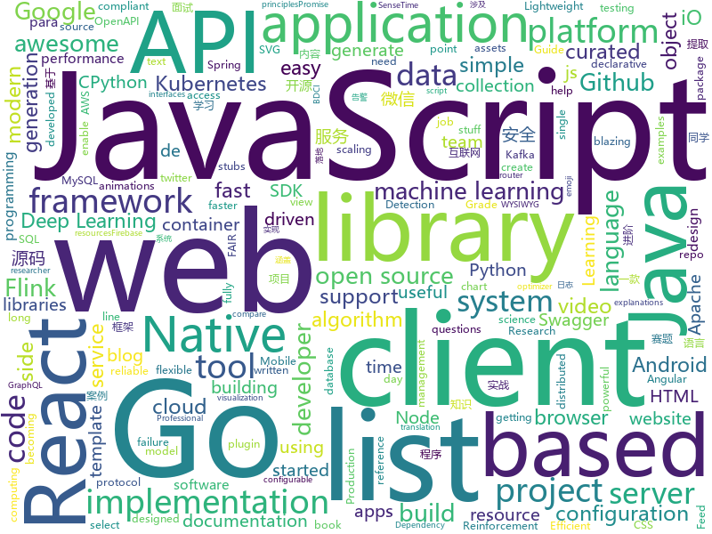

# 2020-01-07
See what the GitHub community is most excited about today.

## python
* [JobFunnel](https://github.com/PaulMcInnis/JobFunnel)(**414 stars today**): Tool for scraping job websites, and filtering and reviewing the job listings
* [Awesome-Linux-Software](https://github.com/luong-komorebi/Awesome-Linux-Software)(**74 stars today**): A list of awesome applications, software, tools and other materials for Linux distros.
* [2019-CCF-BDCI-OCR-MCZJ-OCR-IdentificationIDElement](https://github.com/Mingtzge/2019-CCF-BDCI-OCR-MCZJ-OCR-IdentificationIDElement)(**95 stars today**): 2019CCF-BDCI大赛 最佳创新探索奖获得者 基于OCR身份证要素提取赛题冠军 天晨破晓团队 赛题源码
* [CPython-Internals](https://github.com/zpoint/CPython-Internals)(**59 stars today**): Dive into CPython internals, trying to illustrate every detail of CPython implementation | CPython 源码阅读笔记, 多图展示底层实现细节
* [incubator-mxnet](https://github.com/apache/incubator-mxnet)(**7 stars today**): Lightweight, Portable, Flexible Distributed/Mobile Deep Learning with Dynamic, Mutation-aware Dataflow Dep Scheduler; for Python, R, Julia, Scala, Go, Javascript and more
* [efficientdet](https://github.com/signatrix/efficientdet)(**47 stars today**): (Pretrained weights provided) EfficientDet: Scalable and Efficient Object Detection implementation by Signatrix GmbH
* [auto-cpufreq](https://github.com/AdnanHodzic/auto-cpufreq)(**55 stars today**): Automatic CPU speed & power optimizer for Linux
* [Resemblyzer](https://github.com/resemble-ai/Resemblyzer)(**14 stars today**): A python package to analyze and compare voices with deep learning
* [sentence-transformers](https://github.com/UKPLab/sentence-transformers)(**12 stars today**): Sentence Embeddings with BERT & XLNet
* [gensim](https://github.com/RaRe-Technologies/gensim)(**6 stars today**): Topic Modelling for Humans
* [mlframework](https://github.com/abhishekkrthakur/mlframework)(**8 stars today**): 
* [XLM](https://github.com/facebookresearch/XLM)(**8 stars today**): PyTorch original implementation of Cross-lingual Language Model Pretraining.
* [keras](https://github.com/keras-team/keras)(**20 stars today**): Deep Learning for humans
* [confluent-kafka-python](https://github.com/confluentinc/confluent-kafka-python)(**0 stars today**): Confluent's Kafka Python Client
* [stuffz](https://github.com/0vercl0k/stuffz)(**17 stars today**): Basically a script thrift shop
* [few-shot-vid2vid](https://github.com/NVlabs/few-shot-vid2vid)(**7 stars today**): Pytorch implementation for few-shot photorealistic video-to-video translation.
* [streamlit](https://github.com/streamlit/streamlit)(**40 stars today**): Streamlit — The fastest way to build custom ML tools
* [gym](https://github.com/openai/gym)(**14 stars today**): A toolkit for developing and comparing reinforcement learning algorithms.
* [WiFi-Pumpkin](https://github.com/P0cL4bs/WiFi-Pumpkin)(**7 stars today**): Framework for Rogue Wi-Fi Access Point Attack
* [fastapi](https://github.com/tiangolo/fastapi)(**63 stars today**): FastAPI framework, high performance, easy to learn, fast to code, ready for production
* [SlowFast](https://github.com/facebookresearch/SlowFast)(**98 stars today**): PySlowFast: video understanding codebase from FAIR for reproducing state-of-the-art video models.
* [BurpSuite-Secret_Finder](https://github.com/m4ll0k/BurpSuite-Secret_Finder)(**26 stars today**): Burp Suite extension to discover apikeys/accesstokens and sensitive data from HTTP response.
* [tensorlayer](https://github.com/tensorlayer/tensorlayer)(**8 stars today**): Deep Learning and Reinforcement Learning Library for Scientists🔥
* [pysot](https://github.com/STVIR/pysot)(**5 stars today**): SenseTime Research platform for single object tracking, implementing algorithms like SiamRPN and SiamMask.
* [detectron2](https://github.com/facebookresearch/detectron2)(**45 stars today**): Detectron2 is FAIR's next-generation research platform for object detection and segmentation.

## java
* [thingsboard](https://github.com/thingsboard/thingsboard)(**12 stars today**): Open-source IoT Platform - Device management, data collection, processing and visualization.
* [quarkus](https://github.com/quarkusio/quarkus)(**13 stars today**): Quarkus: Supersonic Subatomic Java.
* [halo](https://github.com/halo-dev/halo)(**102 stars today**): ✍ Halo 一款现代化的个人独立博客系统
* [flink-learning](https://github.com/zhisheng17/flink-learning)(**56 stars today**): flink learning blog. http://www.54tianzhisheng.cn 含 Flink 入门、概念、原理、实战、性能调优、源码解析等内容。涉及 Flink Connector、Metrics、Library、DataStream API、Table API & SQL 等内容的学习案例，还有 Flink 落地应用的大型项目案例（PVUV、日志存储、百亿数据实时去重、监控告警）分享。
* [feign](https://github.com/OpenFeign/feign)(**13 stars today**): Feign makes writing java http clients easier
* [MPAndroidChart](https://github.com/PhilJay/MPAndroidChart)(**17 stars today**): A powerful🚀Android chart view / graph view library, supporting line- bar- pie- radar- bubble- and candlestick charts as well as scaling, dragging and animations.
* [incubator-tubemq](https://github.com/apache/incubator-tubemq)(**32 stars today**): Apache TubeMQ
* [openapi-generator](https://github.com/OpenAPITools/openapi-generator)(**6 stars today**): OpenAPI Generator allows generation of API client libraries (SDK generation), server stubs, documentation and configuration automatically given an OpenAPI Spec (v2, v3)
* [lottie-android](https://github.com/airbnb/lottie-android)(**25 stars today**): Render After Effects animations natively on Android and iOS, Web, and React Native
* [canal](https://github.com/alibaba/canal)(**27 stars today**): 阿里巴巴 MySQL binlog 增量订阅&消费组件
* [spring-cloud-netflix](https://github.com/spring-cloud/spring-cloud-netflix)(**3 stars today**): Integration with Netflix OSS components
* [DoraemonKit](https://github.com/didi/DoraemonKit)(**36 stars today**): 简称 "DoKit" 。一款功能齐全的客户端（ iOS 、Android、微信小程序 ）研发助手，你值得拥有。
* [react-native-svg](https://github.com/react-native-community/react-native-svg)(**3 stars today**): SVG library for React Native, React Native Web, and plain React web projects.
* [kafka-streams-examples](https://github.com/confluentinc/kafka-streams-examples)(**1 stars today**): Demo applications and code examples for Apache Kafka's Streams API.
* [PhotoEditor](https://github.com/burhanrashid52/PhotoEditor)(**3 stars today**): A Photo Editor library with simple, easy support for image editing using paints,text,filters,emoji and Sticker like stories.
* [jvm-sandbox](https://github.com/alibaba/jvm-sandbox)(**10 stars today**): Real - time non-invasive AOP framework container based on JVM
* [netty](https://github.com/netty/netty)(**25 stars today**): Netty project - an event-driven asynchronous network application framework
* [seata-samples](https://github.com/seata/seata-samples)(**4 stars today**): seata-samples
* [nifi](https://github.com/apache/nifi)(**2 stars today**): Mirror of Apache NiFi
* [checkstyle](https://github.com/checkstyle/checkstyle)(**4 stars today**): Checkstyle is a development tool to help programmers write Java code that adheres to a coding standard. By default it supports the Google Java Style Guide and Sun Code Conventions, but is highly configurable. It can be invoked with an ANT task and a command line program.
* [aws-sdk-java](https://github.com/aws/aws-sdk-java)(**0 stars today**): The official AWS SDK for Java.
* [Hystrix](https://github.com/Netflix/Hystrix)(**11 stars today**): Hystrix is a latency and fault tolerance library designed to isolate points of access to remote systems, services and 3rd party libraries, stop cascading failure and enable resilience in complex distributed systems where failure is inevitable.
* [spring-cloud-config](https://github.com/spring-cloud/spring-cloud-config)(**1 stars today**): External configuration (server and client) for Spring Cloud
* [Alink](https://github.com/alibaba/Alink)(**29 stars today**): Alink is the Machine Learning algorithm platform based on Flink, developed by the PAI team of Alibaba computing platform.
* [spring-retry](https://github.com/spring-projects/spring-retry)(**7 stars today**): 

## unknown
* [degoogle](https://github.com/tycrek/degoogle)(**432 stars today**): Repo for the r/privacy "degoogle" megathread
* [coding-interview-university](https://github.com/jwasham/coding-interview-university)(**313 stars today**): A complete computer science study plan to become a software engineer.
* [toolbox](https://github.com/amitness/toolbox)(**62 stars today**): Curated list of libraries for a faster machine learning workflow
* [Resources-for-Beginner-Bug-Bounty-Hunters](https://github.com/nahamsec/Resources-for-Beginner-Bug-Bounty-Hunters)(**73 stars today**): A list of resources for those interested in getting started in bug bounties
* [awesome-mobile-security](https://github.com/vaib25vicky/awesome-mobile-security)(**232 stars today**): An effort to build a single place for all useful android and iOS security related stuff. All references and tools are belong to their respective owners. I'm just maintaining it.
* [awesome-java](https://github.com/Snailclimb/awesome-java)(**102 stars today**): Collection of awesome Java project on Github(Github 上非常棒的 Java 开源项目集合).
* [eng-practices](https://github.com/google/eng-practices)(**48 stars today**): Google's Engineering Practices documentation
* [AspNetCore-Developer-Roadmap](https://github.com/MoienTajik/AspNetCore-Developer-Roadmap)(**51 stars today**): Roadmap to becoming an ASP.NET Core developer in 2019
* [CKAD-exercises](https://github.com/dgkanatsios/CKAD-exercises)(**10 stars today**): A set of exercises to prepare for Certified Kubernetes Application Developer exam by Cloud Native Computing Foundation
* [You-Dont-Know-JS](https://github.com/getify/You-Dont-Know-JS)(**61 stars today**): A book series on JavaScript. @YDKJS on twitter.
* [JavaFamily](https://github.com/AobingJava/JavaFamily)(**126 stars today**): 【互联网一线大厂面试+学习指南】进阶知识完全扫盲：涵盖高并发、分布式、高可用、微服务等领域知识，作者风格幽默，看起来津津有味，把学习当做一种乐趣，何乐而不为，后端同学必看，前端同学我保证你也看得懂，看不懂你加我微信骂我渣男就好了。
* [deploy-your-own-saas](https://github.com/Atarity/deploy-your-own-saas)(**162 stars today**): List of "only yours" cloud services for everyday needs🏴
* [developer-roadmap](https://github.com/kamranahmedse/developer-roadmap)(**126 stars today**): Roadmap to becoming a web developer in 2020
* [Projects](https://github.com/karan/Projects)(**42 stars today**): 📃A list of practical projects that anyone can solve in any programming language.
* [bugcrowd_university](https://github.com/bugcrowd/bugcrowd_university)(**10 stars today**): Open source education content for the researcher community
* [Book_List](https://github.com/mukeshmithrakumar/Book_List)(**8 stars today**): Python, Machine Learning, Deep Learning and Data Science Books
* [Free-OReilly-Books](https://github.com/mohnkhan/Free-OReilly-Books)(**11 stars today**): Free O Reilly Books
* [awesome-github-wechat-weapp](https://github.com/opendigg/awesome-github-wechat-weapp)(**7 stars today**): 微信小程序开源项目库汇总
* [awesome-interview-questions](https://github.com/MaximAbramchuck/awesome-interview-questions)(**16 stars today**): A curated awesome list of lists of interview questions. Feel free to contribute!🎓
* [javascript-questions](https://github.com/lydiahallie/javascript-questions)(**161 stars today**): A long list of (advanced) JavaScript questions, and their explanations✨
* [vagas](https://github.com/backend-br/vagas)(**10 stars today**): ✌️Espaço para divulgação de vagas para backenders
* [3D-Machine-Learning](https://github.com/timzhang642/3D-Machine-Learning)(**20 stars today**): A resource repository for 3D machine learning
* [0x4447_product_s3_email](https://github.com/0x4447/0x4447_product_s3_email)(**227 stars today**): 📫A serverless email server on AWS using S3 and SES
* [react-typescript-cheatsheet](https://github.com/typescript-cheatsheets/react-typescript-cheatsheet)(**37 stars today**): Cheatsheets for experienced React developers getting started with TypeScript
* [gbfs](https://github.com/NABSA/gbfs)(**4 stars today**): Documentation for the General Bikeshare Feed Specification, a standardized data feed for bike share system availability

## javascript
* [30DaysOfJavaScript](https://github.com/Asabeneh/30DaysOfJavaScript)(**214 stars today**): A 30 days of JavaScript programming challenge
* [gatsby](https://github.com/gatsbyjs/gatsby)(**48 stars today**): Build blazing fast, modern apps and websites with React
* [cypress](https://github.com/cypress-io/cypress)(**28 stars today**): Fast, easy and reliable testing for anything that runs in a browser.
* [react-native](https://github.com/facebook/react-native)(**110 stars today**): A framework for building native apps with React.
* [d3](https://github.com/d3/d3)(**28 stars today**): Bring data to life with SVG, Canvas and HTML.📊📈🎉
* [lx-music-desktop](https://github.com/lyswhut/lx-music-desktop)(**57 stars today**): 一个基于 electron 的音乐软件
* [selectize.js](https://github.com/selectize/selectize.js)(**2 stars today**): Selectize is the hybrid of a textbox and <select> box. It's jQuery based and it has autocomplete and native-feeling keyboard navigation; useful for tagging, contact lists, etc.
* [api-platform](https://github.com/api-platform/api-platform)(**3 stars today**): REST and GraphQL framework to build modern API-driven projects (server-side and client-side)
* [algorithm-visualizer](https://github.com/algorithm-visualizer/algorithm-visualizer)(**28 stars today**): 🎆Interactive Online Platform that Visualizes Algorithms from Code
* [dash.js](https://github.com/Dash-Industry-Forum/dash.js)(**5 stars today**): A reference client implementation for the playback of MPEG DASH via Javascript and compliant browsers.
* [theme-ui](https://github.com/system-ui/theme-ui)(**18 stars today**): Build consistent, themeable React apps based on constraint-based design principles
* [axios](https://github.com/axios/axios)(**60 stars today**): Promise based HTTP client for the browser and node.js
* [parcel](https://github.com/parcel-bundler/parcel)(**107 stars today**): 📦🚀Blazing fast, zero configuration web application bundler
* [generator-jhipster](https://github.com/jhipster/generator-jhipster)(**17 stars today**): Open Source application platform for creating Spring Boot + Angular/React projects in seconds!
* [faker.js](https://github.com/Marak/faker.js)(**18 stars today**): generate massive amounts of realistic fake data in Node.js and the browser
* [intl-tel-input](https://github.com/jackocnr/intl-tel-input)(**6 stars today**): A JavaScript plugin for entering and validating international telephone numbers
* [carbon](https://github.com/carbon-design-system/carbon)(**10 stars today**): A design system built by IBM
* [summernote](https://github.com/summernote/summernote)(**7 stars today**): Super simple WYSIWYG editor
* [swagger-ui](https://github.com/swagger-api/swagger-ui)(**11 stars today**): Swagger UI is a collection of HTML, Javascript, and CSS assets that dynamically generate beautiful documentation from a Swagger-compliant API.
* [jsPDF](https://github.com/MrRio/jsPDF)(**7 stars today**): Client-side JavaScript PDF generation for everyone.
* [next.js](https://github.com/zeit/next.js)(**54 stars today**): The React Framework
* [moment](https://github.com/moment/moment)(**7 stars today**): Parse, validate, manipulate, and display dates in javascript.
* [oidc-client-js](https://github.com/IdentityModel/oidc-client-js)(**2 stars today**): OpenID Connect (OIDC) and OAuth2 protocol support for browser-based JavaScript applications
* [semantic-release](https://github.com/semantic-release/semantic-release)(**13 stars today**): 📦🚀Fully automated version management and package publishing
* [react](https://github.com/facebook/react)(**90 stars today**): A declarative, efficient, and flexible JavaScript library for building user interfaces.

## html
* [swagger-codegen](https://github.com/swagger-api/swagger-codegen)(**15 stars today**): swagger-codegen contains a template-driven engine to generate documentation, API clients and server stubs in different languages by parsing your OpenAPI / Swagger definition.
* [hyperblog](https://github.com/freddier/hyperblog)(**13 stars today**): Un blog increíble para el curso de Git y Github de Platzi
* [machine-learning-systems-design](https://github.com/chiphuyen/machine-learning-systems-design)(**20 stars today**): A booklet on machine learning systems design with exercises
* [styleguide](https://github.com/google/styleguide)(**18 stars today**): Style guides for Google-originated open-source projects
* [webdevbootcamp](https://github.com/nax3t/webdevbootcamp)(**6 stars today**): All source code for back-end projects from the Web Developer Bootcamp
* [hylia](https://github.com/hankchizljaw/hylia)(**6 stars today**): Hylia is a lightweight Eleventy starter kit to help you to create your own blog or personal website.
* [chosen](https://github.com/harvesthq/chosen)(**3 stars today**): Chosen is a library for making long, unwieldy select boxes more friendly.
* [golang101](https://github.com/golang101/golang101)(**52 stars today**): Go语言101 : 一本侧重于Go语言语法和语义的编程解释和指导书
* [flutter-in-action](https://github.com/flutterchina/flutter-in-action)(**22 stars today**): 《Flutter实战》电子书
* [mxgraph](https://github.com/jgraph/mxgraph)(**11 stars today**): mxGraph is a fully client side JavaScript diagramming library
* [AR.js](https://github.com/jeromeetienne/AR.js)(**14 stars today**): Efficient Augmented Reality for the Web - 60fps on mobile!
* [proposal-optional-chaining](https://github.com/tc39/proposal-optional-chaining)(**6 stars today**): 
* [en.javascript.info](https://github.com/javascript-tutorial/en.javascript.info)(**19 stars today**): Modern JavaScript Tutorial
* [Java-Interview-Advanced](https://github.com/shishan100/Java-Interview-Advanced)(**12 stars today**): 中华石杉--互联网Java进阶面试训练营
* [professional-services](https://github.com/GoogleCloudPlatform/professional-services)(**1 stars today**): Common solutions and tools developed by Google Cloud's Professional Services team
* [qcloud-documents](https://github.com/tencentyun/qcloud-documents)(**5 stars today**): 腾讯云官方文档 使用Markdown自动构建
* [keep-a-changelog](https://github.com/olivierlacan/keep-a-changelog)(**1 stars today**): If you build software, keep a changelog.
* [simpl](https://github.com/samdutton/simpl)(**2 stars today**): Simplest possible examples of HTML, CSS and Javascript:
* [hugo-theme-meme](https://github.com/reuixiy/hugo-theme-meme)(**2 stars today**): You can’t spell aWEsoME without MEME!😝
* [JavaScript30](https://github.com/wesbos/JavaScript30)(**8 stars today**): 30 Day Vanilla JS Challenge
* [EIPs](https://github.com/ethereum/EIPs)(**3 stars today**): The Ethereum Improvement Proposal repository
* [node-js-getting-started](https://github.com/heroku/node-js-getting-started)(**5 stars today**): Getting Started with Node on Heroku
* [awesome-angular](https://github.com/PatrickJS/awesome-angular)(**3 stars today**): 📄A curated list of awesome Angular resources
* [quickstart-js](https://github.com/firebase/quickstart-js)(**3 stars today**): Firebase Quickstart Samples for Web
* [sec_profile](https://github.com/tanjiti/sec_profile)(**19 stars today**): 爬取secwiki和xuanwu.github.io/sec.today,分析安全信息站点、安全趋势、提取安全工作者账号(twitter,weixin,github等)

## go
* [kratos](https://github.com/bilibili/kratos)(**113 stars today**): Kratos是bilibili开源的一套Go微服务框架，包含大量微服务相关框架及工具。
* [kubernetes](https://github.com/kubernetes/kubernetes)(**76 stars today**): Production-Grade Container Scheduling and Management
* [aws-sdk-go](https://github.com/aws/aws-sdk-go)(**3 stars today**): AWS SDK for the Go programming language.
* [hakrawler](https://github.com/hakluke/hakrawler)(**288 stars today**): Simple, fast web crawler designed for easy, quick discovery of endpoints and assets within a web application
* [gin](https://github.com/gin-gonic/gin)(**35 stars today**): Gin is a HTTP web framework written in Go (Golang). It features a Martini-like API with much better performance -- up to 40 times faster. If you need smashing performance, get yourself some Gin.
* [sprig](https://github.com/Masterminds/sprig)(**16 stars today**): Useful template functions for Go templates.
* [terraform](https://github.com/hashicorp/terraform)(**14 stars today**): Terraform enables you to safely and predictably create, change, and improve infrastructure. It is an open source tool that codifies APIs into declarative configuration files that can be shared amongst team members, treated as code, edited, reviewed, and versioned.
* [kubectl-tree](https://github.com/ahmetb/kubectl-tree)(**169 stars today**): kubectl plugin to browse Kubernetes object hierarchies as a tree🎄(using? star the repo!)
* [charts](https://github.com/helm/charts)(**19 stars today**): Curated applications for Kubernetes
* [go-swagger](https://github.com/go-swagger/go-swagger)(**11 stars today**): Swagger 2.0 implementation for go
* [grpc-go](https://github.com/grpc/grpc-go)(**14 stars today**): The Go language implementation of gRPC. HTTP/2 based RPC
* [protobuf](https://github.com/golang/protobuf)(**8 stars today**): Go support for Google's protocol buffers
* [micro](https://github.com/zyedidia/micro)(**57 stars today**): A modern and intuitive terminal-based text editor
* [terraform-provider-azurerm](https://github.com/terraform-providers/terraform-provider-azurerm)(**2 stars today**): Terraform provider for Azure Resource Manager
* [torrent-client](https://github.com/veggiedefender/torrent-client)(**80 stars today**): Tiny BitTorrent client written in Go
* [mux](https://github.com/gorilla/mux)(**9 stars today**): A powerful HTTP router and URL matcher for building Go web servers with🦍
* [kops](https://github.com/kubernetes/kops)(**8 stars today**): Kubernetes Operations (kops) - Production Grade K8s Installation, Upgrades, and Management
* [vitess](https://github.com/vitessio/vitess)(**9 stars today**): Vitess is a database clustering system for horizontal scaling of MySQL.
* [containerd](https://github.com/containerd/containerd)(**13 stars today**): An open and reliable container runtime
* [client_golang](https://github.com/prometheus/client_golang)(**4 stars today**): Prometheus instrumentation library for Go applications
* [argo](https://github.com/argoproj/argo)(**4 stars today**): Argo Workflows: Get stuff done with Kubernetes.
* [cockroach](https://github.com/cockroachdb/cockroach)(**9 stars today**): CockroachDB - the open source, cloud-native SQL database.
* [twirp](https://github.com/twitchtv/twirp)(**4 stars today**): A simple RPC framework with protobuf service definitions
* [vegeta](https://github.com/tsenart/vegeta)(**10 stars today**): HTTP load testing tool and library. It's over 9000!
* [wire](https://github.com/google/wire)(**13 stars today**): Compile-time Dependency Injection for Go

## WordCloud

