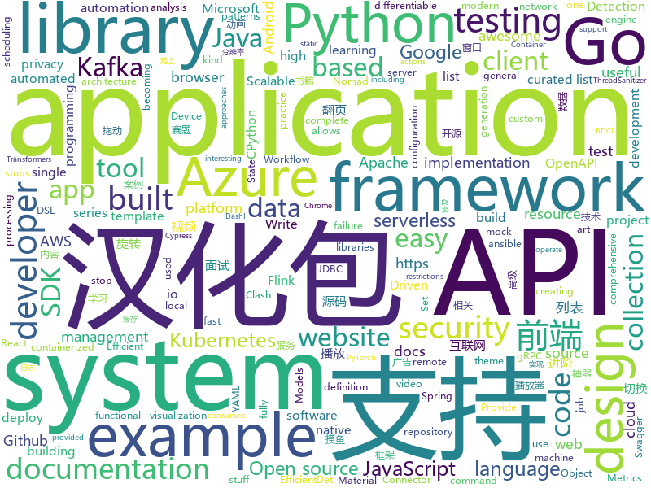

# 2020-01-08
See what the GitHub community is most excited about today.

## python
* [SlowFast](https://github.com/facebookresearch/SlowFast)(**202 stars today**): PySlowFast: video understanding codebase from FAIR for reproducing state-of-the-art video models.
* [CPython-Internals](https://github.com/zpoint/CPython-Internals)(**106 stars today**): Dive into CPython internals, trying to illustrate every detail of CPython implementation | CPython 源码阅读笔记, 多图展示底层实现细节
* [JobFunnel](https://github.com/PaulMcInnis/JobFunnel)(**313 stars today**): Tool for scraping job websites, and filtering and reviewing the job listings
* [Awesome-Linux-Software](https://github.com/luong-komorebi/Awesome-Linux-Software)(**230 stars today**): A list of awesome applications, software, tools and other materials for Linux distros.
* [black](https://github.com/psf/black)(**21 stars today**): The uncompromising Python code formatter
* [googleapis](https://github.com/googleapis/googleapis)(**4 stars today**): Public interface definitions of Google APIs.
* [karateclub](https://github.com/benedekrozemberczki/karateclub)(**38 stars today**): A general purpose community detection and network embedding library for research built on NetworkX.
* [pipenv](https://github.com/pypa/pipenv)(**12 stars today**): Python Development Workflow for Humans.
* [sanitizers](https://github.com/google/sanitizers)(**10 stars today**): AddressSanitizer, ThreadSanitizer, MemorySanitizer
* [cloud-custodian](https://github.com/cloud-custodian/cloud-custodian)(**7 stars today**): Rules engine for cloud security, cost optimization, and governance, DSL in yaml for policies to query, filter, and take actions on resources
* [confluent-kafka-python](https://github.com/confluentinc/confluent-kafka-python)(**1 stars today**): Confluent's Kafka Python Client
* [EfficientDet.Pytorch](https://github.com/toandaominh1997/EfficientDet.Pytorch)(**27 stars today**): Implementation EfficientDet: Scalable and Efficient Object Detection in PyTorch
* [streamlit](https://github.com/streamlit/streamlit)(**33 stars today**): Streamlit — The fastest way to build custom ML tools
* [2019-CCF-BDCI-OCR-MCZJ-OCR-IdentificationIDElement](https://github.com/Mingtzge/2019-CCF-BDCI-OCR-MCZJ-OCR-IdentificationIDElement)(**99 stars today**): 2019CCF-BDCI大赛 最佳创新探索奖获得者 基于OCR身份证要素提取赛题冠军 天晨破晓团队 赛题源码
* [models](https://github.com/tensorflow/models)(**55 stars today**): Models and examples built with TensorFlow
* [azure-sdk-for-python](https://github.com/Azure/azure-sdk-for-python)(**2 stars today**): This repository is intended for active development of the Azure SDK for Python. For consumers of the SDK we recommend visiting our public developer docs at https://docs.microsoft.com/en-us/python/azure/ or our versioned developer docs at https://azure.github.io/azure-sdk-for-python.
* [localstack](https://github.com/localstack/localstack)(**17 stars today**): 💻A fully functional local AWS cloud stack. Develop and test your cloud & Serverless apps offline!
* [c9-python-getting-started](https://github.com/microsoft/c9-python-getting-started)(**23 stars today**): Sample code for Channel 9 Python for Beginners course
* [CheatSheetSeries](https://github.com/OWASP/CheatSheetSeries)(**24 stars today**): The OWASP Cheat Sheet Series was created to provide a concise collection of high value information on specific application security topics.
* [efficientdet](https://github.com/signatrix/efficientdet)(**44 stars today**): (Pretrained weights provided) EfficientDet: Scalable and Efficient Object Detection implementation by Signatrix GmbH
* [transformers](https://github.com/huggingface/transformers)(**54 stars today**): 🤗Transformers: State-of-the-art Natural Language Processing for TensorFlow 2.0 and PyTorch.
* [home-assistant](https://github.com/home-assistant/home-assistant)(**50 stars today**): 🏡Open source home automation that puts local control and privacy first
* [cupy](https://github.com/cupy/cupy)(**2 stars today**): NumPy-like API accelerated with CUDA
* [ansible](https://github.com/ansible/ansible)(**17 stars today**): Ansible is a radically simple IT automation platform that makes your applications and systems easier to deploy. Avoid writing scripts or custom code to deploy and update your applications — automate in a language that approaches plain English, using SSH, with no agents to install on remote systems. https://docs.ansible.com/ansible/
* [moto](https://github.com/spulec/moto)(**1 stars today**): A library that allows you to easily mock out tests based on AWS infrastructure.

## java
* [aws-doc-sdk-examples](https://github.com/awsdocs/aws-doc-sdk-examples)(**3 stars today**): Code examples used in the official AWS SDK documentation.
* [bigbluebutton](https://github.com/bigbluebutton/bigbluebutton)(**3 stars today**): Complete open source web conferencing system.
* [selenium](https://github.com/SeleniumHQ/selenium)(**9 stars today**): A browser automation framework and ecosystem.
* [micronaut-core](https://github.com/micronaut-projects/micronaut-core)(**6 stars today**): Micronaut Application Framework
* [GSYVideoPlayer](https://github.com/CarGuo/GSYVideoPlayer)(**31 stars today**): 视频播放器（IJKplayer、ExoPlayer、MediaPlayer），HTTPS，支持弹幕，外挂字幕，支持滤镜、水印、gif截图，片头广告、中间广告，多个同时播放，支持基本的拖动，声音、亮度调节，支持边播边缓存，支持视频自带rotation的旋转（90,270之类），重力旋转与手动旋转的同步支持，支持列表播放 ，列表全屏动画，视频加载速度，列表小窗口支持拖动，动画效果，调整比例，多分辨率切换，支持切换播放器，进度条小窗口预览，列表切换详情页面无缝播放，rtsp、concat、mpeg。
* [DataSphereStudio](https://github.com/WeBankFinTech/DataSphereStudio)(**6 stars today**): DataSphereStudio is a one stop data application development& management portal, covering scenarios including data exchange, desensitization/cleansing, analysis/mining, quality measurement, visualization, and task scheduling.
* [cas](https://github.com/apereo/cas)(**9 stars today**): Apereo CAS - Enterprise Single Sign On for all earthlings and beyond.
* [kafka-connect-jdbc](https://github.com/confluentinc/kafka-connect-jdbc)(**0 stars today**): Kafka Connect connector for JDBC-compatible databases
* [AgentWeb](https://github.com/Justson/AgentWeb)(**10 stars today**): AgentWeb is a powerful library based on Android WebView.
* [schema-registry](https://github.com/confluentinc/schema-registry)(**3 stars today**): Confluent Schema Registry for Kafka
* [hbase](https://github.com/apache/hbase)(**2 stars today**): Mirror of Apache HBase
* [kafka-streams-examples](https://github.com/confluentinc/kafka-streams-examples)(**2 stars today**): Demo applications and code examples for Apache Kafka's Streams API.
* [springfox](https://github.com/springfox/springfox)(**5 stars today**): Automated JSON API documentation for API's built with Spring
* [spring-security](https://github.com/spring-projects/spring-security)(**5 stars today**): Spring Security
* [HikariCP](https://github.com/brettwooldridge/HikariCP)(**13 stars today**): 光 HikariCP・A solid, high-performance, JDBC connection pool at last.
* [spring-boot](https://github.com/spring-projects/spring-boot)(**39 stars today**): Spring Boot
* [rest-assured](https://github.com/rest-assured/rest-assured)(**5 stars today**): Java DSL for easy testing of REST services
* [thingsboard](https://github.com/thingsboard/thingsboard)(**18 stars today**): Open-source IoT Platform - Device management, data collection, processing and visualization.
* [grpc-java](https://github.com/grpc/grpc-java)(**7 stars today**): The Java gRPC implementation. HTTP/2 based RPC
* [flink-learning](https://github.com/zhisheng17/flink-learning)(**49 stars today**): flink learning blog. http://www.54tianzhisheng.cn 含 Flink 入门、概念、原理、实战、性能调优、源码解析等内容。涉及 Flink Connector、Metrics、Library、DataStream API、Table API & SQL 等内容的学习案例，还有 Flink 落地应用的大型项目案例（PVUV、日志存储、百亿数据实时去重、监控告警）分享。
* [ignite](https://github.com/apache/ignite)(**3 stars today**): Mirror of Apache Ignite
* [retrofit](https://github.com/square/retrofit)(**13 stars today**): Type-safe HTTP client for Android and Java by Square, Inc.
* [openapi-generator](https://github.com/OpenAPITools/openapi-generator)(**10 stars today**): OpenAPI Generator allows generation of API client libraries (SDK generation), server stubs, documentation and configuration automatically given an OpenAPI Spec (v2, v3)
* [library](https://github.com/ddd-by-examples/library)(**6 stars today**): A comprehensive Domain-Driven Design example with problem space strategic analysis and various tactical patterns.
* [Hystrix](https://github.com/Netflix/Hystrix)(**9 stars today**): Hystrix is a latency and fault tolerance library designed to isolate points of access to remote systems, services and 3rd party libraries, stop cascading failure and enable resilience in complex distributed systems where failure is inevitable.

## unknown
* [coding-interview-university](https://github.com/jwasham/coding-interview-university)(**249 stars today**): A complete computer science study plan to become a software engineer.
* [eng-practices](https://github.com/google/eng-practices)(**164 stars today**): Google's Engineering Practices documentation
* [developer-roadmap](https://github.com/kamranahmedse/developer-roadmap)(**113 stars today**): Roadmap to becoming a web developer in 2020
* [difftaichi](https://github.com/yuanming-hu/difftaichi)(**90 stars today**): 10 differentiable physical simulators built with Taichi differentiable programming (DiffTaichi, ICLR 2020)
* [awesome-mobile-security](https://github.com/vaib25vicky/awesome-mobile-security)(**211 stars today**): An effort to build a single place for all useful android and iOS security related stuff. All references and tools are belong to their respective owners. I'm just maintaining it.
* [Rules](https://github.com/lhie1/Rules)(**21 stars today**): Rules / 规则：Surge / Shadowrocket / QuantumultX / Clash(X|A)
* [awesome](https://github.com/sindresorhus/awesome)(**158 stars today**): 😎Awesome lists about all kinds of interesting topics
* [awesome-uses](https://github.com/wesbos/awesome-uses)(**48 stars today**): Awesome Uses Page
* [gitignore](https://github.com/github/gitignore)(**48 stars today**): A collection of useful .gitignore templates
* [degoogle](https://github.com/tycrek/degoogle)(**333 stars today**): Repo for the r/privacy "degoogle" megathread
* [hacker-laws](https://github.com/dwmkerr/hacker-laws)(**33 stars today**): 💻📖Laws, Theories, Principles and Patterns that developers will find useful. #hackerlaws
* [howto-make-more-money](https://github.com/easychen/howto-make-more-money)(**22 stars today**): 程序员如何优雅的挣零花钱
* [awesome-bug-bounty](https://github.com/djadmin/awesome-bug-bounty)(**17 stars today**): A comprehensive curated list of available Bug Bounty & Disclosure Programs and Write-ups.
* [You-Dont-Know-JS](https://github.com/getify/You-Dont-Know-JS)(**46 stars today**): A book series on JavaScript. @YDKJS on twitter.
* [free-books](https://github.com/ruanyf/free-books)(**22 stars today**): 互联网上的免费书籍
* [architecture_decision_record](https://github.com/joelparkerhenderson/architecture_decision_record)(**5 stars today**): Architecture decision record (ADR) examples for software planning, IT leadership, and template documenation
* [Security_Ladders](https://github.com/product-security-group/Security_Ladders)(**11 stars today**): Open source security career ladders
* [AVA](https://github.com/antvis/AVA)(**61 stars today**): 🤖A framework for automated visual analytics.
* [AZ-300-MicrosoftAzureArchitectTechnologies](https://github.com/MicrosoftLearning/AZ-300-MicrosoftAzureArchitectTechnologies)(**3 stars today**): 
* [awesome-java](https://github.com/Snailclimb/awesome-java)(**122 stars today**): Collection of awesome Java project on Github(Github 上非常棒的 Java 开源项目集合).
* [AspNetCore-Developer-Roadmap](https://github.com/MoienTajik/AspNetCore-Developer-Roadmap)(**95 stars today**): Roadmap to becoming an ASP.NET Core developer in 2019
* [AZ-103-MicrosoftAzureAdministrator](https://github.com/MicrosoftLearning/AZ-103-MicrosoftAzureAdministrator)(**3 stars today**): AZ-103: Microsoft Azure Administrator
* [Learn_Synthetic_Biology](https://github.com/llSourcell/Learn_Synthetic_Biology)(**14 stars today**): 
* [awesome-threat-intelligence](https://github.com/hslatman/awesome-threat-intelligence)(**6 stars today**): A curated list of Awesome Threat Intelligence resources
* [blog](https://github.com/yygmind/blog)(**9 stars today**): 我是木易杨，公众号「高级前端进阶」作者，跟着我每周重点攻克一个前端面试重难点。接下来让我带你走进高级前端的世界，在进阶的路上，共勉！

## javascript
* [openlayers](https://github.com/openlayers/openlayers)(**27 stars today**): OpenLayers
* [30DaysOfJavaScript](https://github.com/Asabeneh/30DaysOfJavaScript)(**267 stars today**): A 30 days of JavaScript programming challenge
* [generator-jhipster](https://github.com/jhipster/generator-jhipster)(**15 stars today**): Open Source application platform for creating Spring Boot + Angular/React projects in seconds!
* [Thief-Book](https://github.com/cteamx/Thief-Book)(**47 stars today**): 一款可以在任务栏、桌面、TouchBar上进行摸鱼的最强的跨平台摸鱼神器，支持小说、股票、按键翻页、鼠标翻页、自动翻页让你体验不同的工作 996，上班族必备神器
* [Awesome-Design-Tools](https://github.com/LisaDziuba/Awesome-Design-Tools)(**46 stars today**): The best design tools and plugins for everything👉
* [Script](https://github.com/NobyDa/Script)(**11 stars today**): 
* [docusaurus](https://github.com/facebook/docusaurus)(**118 stars today**): Easy to maintain open source documentation websites.
* [gatsby](https://github.com/gatsbyjs/gatsby)(**59 stars today**): Build blazing fast, modern apps and websites with React
* [axios](https://github.com/axios/axios)(**54 stars today**): Promise based HTTP client for the browser and node.js
* [PaperWM](https://github.com/paperwm/PaperWM)(**47 stars today**): Tiled scrollable window management for Gnome Shell
* [awx](https://github.com/ansible/awx)(**13 stars today**): AWX Project
* [cypress](https://github.com/cypress-io/cypress)(**41 stars today**): Fast, easy and reliable testing for anything that runs in a browser.
* [create-react-app](https://github.com/facebook/create-react-app)(**40 stars today**): Set up a modern web app by running one command.
* [semantic-release](https://github.com/semantic-release/semantic-release)(**25 stars today**): 📦🚀Fully automated version management and package publishing
* [examples](https://github.com/serverless/examples)(**5 stars today**): Serverless Examples – A collection of boilerplates and examples of serverless architectures built with the Serverless Framework on AWS Lambda, Microsoft Azure, Google Cloud Functions, and more.
* [plotly.js](https://github.com/plotly/plotly.js)(**7 stars today**): Open-source JavaScript charting library behind Plotly and Dash
* [microservices-demo](https://github.com/lucaschen/microservices-demo)(**51 stars today**): I've made a full tutorial series on building this! ==>
* [ramda](https://github.com/ramda/ramda)(**40 stars today**): 🐏Practical functional Javascript
* [markdown-here](https://github.com/adam-p/markdown-here)(**32 stars today**): Google Chrome, Firefox, and Thunderbird extension that lets you write email in Markdown and render it before sending.
* [javascript](https://github.com/airbnb/javascript)(**44 stars today**): JavaScript Style Guide
* [react-native](https://github.com/facebook/react-native)(**122 stars today**): A framework for building native apps with React.
* [carbon](https://github.com/carbon-design-system/carbon)(**8 stars today**): A design system built by IBM
* [aws-serverless-workshops](https://github.com/aws-samples/aws-serverless-workshops)(**7 stars today**): Code and walkthrough labs to set up serverless applications for Wild Rydes workshops
* [moment](https://github.com/moment/moment)(**10 stars today**): Parse, validate, manipulate, and display dates in javascript.
* [vee-validate](https://github.com/logaretm/vee-validate)(**9 stars today**): ✔ Template Driven Validation Framework for Vue.js

## html
* [free-for-dev](https://github.com/ripienaar/free-for-dev)(**65 stars today**): A list of SaaS, PaaS and IaaS offerings that have free tiers of interest to devops and infradev
* [machine-learning-systems-design](https://github.com/chiphuyen/machine-learning-systems-design)(**23 stars today**): A booklet on machine learning systems design with exercises
* [mkdocs-material](https://github.com/squidfunk/mkdocs-material)(**4 stars today**): A Material Design theme for MkDocs
* [fastText](https://github.com/facebookresearch/fastText)(**8 stars today**): Library for fast text representation and classification.
* [learning-area](https://github.com/mdn/learning-area)(**6 stars today**): Github repo for the MDN Learning Area.
* [Java-Interview-Advanced](https://github.com/shishan100/Java-Interview-Advanced)(**11 stars today**): 中华石杉--互联网Java进阶面试训练营
* [swagger-codegen](https://github.com/swagger-api/swagger-codegen)(**9 stars today**): swagger-codegen contains a template-driven engine to generate documentation, API clients and server stubs in different languages by parsing your OpenAPI / Swagger definition.
* [web-moderno](https://github.com/cod3rcursos/web-moderno)(**4 stars today**): 
* [cypress-example-kitchensink](https://github.com/cypress-io/cypress-example-kitchensink)(**4 stars today**): This is an example app used to showcase Cypress.io testing.
* [computer-science-flash-cards](https://github.com/jwasham/computer-science-flash-cards)(**7 stars today**): Mini website for testing both general CS knowledge and enforce coding practice and common algorithm/data structure memorization.
* [docuapi](https://github.com/bep/docuapi)(**5 stars today**): Beautiful multilingual API documentation theme for Hugo
* [foundation-sites](https://github.com/foundation/foundation-sites)(**5 stars today**): The most advanced responsive front-end framework in the world. Quickly create prototypes and production code for sites that work on any kind of device.
* [simple-icons](https://github.com/simple-icons/simple-icons)(**6 stars today**): SVG icons for popular brands
* [OpenClash](https://github.com/vernesong/OpenClash)(**6 stars today**): A Clash Client For OpenWrt
* [TranslatorX](https://github.com/pingfangx/TranslatorX)(**18 stars today**): JetBrains 系列软件汉化包 关键字: Android Studio 3.5 汉化包 CLion 2019.3 汉化包 DataGrip 2019.3 汉化包 GoLand 2019.3 汉化包 IntelliJ IDEA 2019.3 汉化包 PhpStorm 2019.3 汉化包 PyCharm 2019.3 汉化包 Rider 2019.3 汉化包 RubyMine 2019.3 汉化包 WebStorm 2019.3 汉化包
* [privacytools.io](https://github.com/privacytoolsIO/privacytools.io)(**4 stars today**): 🛡🛠You are being watched. Protect your privacy against global mass surveillance.
* [Screenshot-to-code](https://github.com/emilwallner/Screenshot-to-code)(**20 stars today**): A neural network that transforms a design mock-up into a static website.
* [blog](https://github.com/biaochenxuying/blog)(**3 stars today**): 大前端技术为主，读书笔记、随笔、理财为辅，做个终身学习者。
* [proposal-optional-chaining](https://github.com/tc39/proposal-optional-chaining)(**4 stars today**): 
* [GTFOBins.github.io](https://github.com/GTFOBins/GTFOBins.github.io)(**11 stars today**): Curated list of Unix binaries that can be exploited to bypass system security restrictions
* [technical-books](https://github.com/doocs/technical-books)(**13 stars today**): 😆国内外互联网技术大牛们都写了哪些书籍：计算机基础、网络、前端、后端、数据库、架构、大数据、深度学习...
* [devdocs](https://github.com/magento/devdocs)(**0 stars today**): Magento Developer Documentation
* [AR.js](https://github.com/jeromeetienne/AR.js)(**2 stars today**): Efficient Augmented Reality for the Web - 60fps on mobile!
* [EIPs](https://github.com/ethereum/EIPs)(**4 stars today**): The Ethereum Improvement Proposal repository
* [Front-end-Web-Development-Interview-Question](https://github.com/paddingme/Front-end-Web-Development-Interview-Question)(**5 stars today**): 前端开发面试题大收集，前端面试集锦❤️💝💘

## go
* [kratos](https://github.com/bilibili/kratos)(**244 stars today**): Kratos是bilibili开源的一套Go微服务框架，包含大量微服务相关框架及工具。
* [Go-Questions](https://github.com/qcrao/Go-Questions)(**59 stars today**): 从问题切入，串连 Go 语言相关的所有知识，融会贯通。
* [pipeline](https://github.com/tektoncd/pipeline)(**12 stars today**): A K8s-native Pipeline resource.
* [packer](https://github.com/hashicorp/packer)(**5 stars today**): Packer is a tool for creating identical machine images for multiple platforms from a single source configuration.
* [kafka-go](https://github.com/segmentio/kafka-go)(**6 stars today**): Kafka library in Go
* [gin-jwt](https://github.com/appleboy/gin-jwt)(**4 stars today**): JWT Middleware for Gin framework
* [charts](https://github.com/helm/charts)(**17 stars today**): Curated applications for Kubernetes
* [mock](https://github.com/golang/mock)(**3 stars today**): GoMock is a mocking framework for the Go programming language.
* [argo](https://github.com/argoproj/argo)(**2 stars today**): Argo Workflows: Get stuff done with Kubernetes.
* [oauth2](https://github.com/golang/oauth2)(**5 stars today**): Go OAuth2
* [kubernetes](https://github.com/kubernetes/kubernetes)(**79 stars today**): Production-Grade Container Scheduling and Management
* [minikube](https://github.com/kubernetes/minikube)(**17 stars today**): Run Kubernetes locally
* [fzf](https://github.com/junegunn/fzf)(**78 stars today**): 🌸A command-line fuzzy finder
* [grpc-go](https://github.com/grpc/grpc-go)(**17 stars today**): The Go language implementation of gRPC. HTTP/2 based RPC
* [terraform-provider-azurerm](https://github.com/terraform-providers/terraform-provider-azurerm)(**4 stars today**): Terraform provider for Azure Resource Manager
* [protobuf](https://github.com/golang/protobuf)(**13 stars today**): Go support for Google's protocol buffers
* [lazygit](https://github.com/jesseduffield/lazygit)(**30 stars today**): simple terminal UI for git commands
* [goconvey](https://github.com/smartystreets/goconvey)(**6 stars today**): Go testing in the browser. Integrates with `go test`. Write behavioral tests in Go.
* [sarama](https://github.com/Shopify/sarama)(**2 stars today**): Sarama is a Go library for Apache Kafka 0.8, and up.
* [kustomize](https://github.com/kubernetes-sigs/kustomize)(**6 stars today**): Customization of kubernetes YAML configurations
* [operator-sdk](https://github.com/operator-framework/operator-sdk)(**9 stars today**): SDK for building Kubernetes applications. Provides high level APIs, useful abstractions, and project scaffolding.
* [nomad](https://github.com/hashicorp/nomad)(**7 stars today**): Nomad is an easy-to-use, flexible, and performant workload orchestrator that can deploy a mix of microservice, batch, containerized, and non-containerized applications. Nomad is easy to operate and scale and has native Consul and Vault integrations.
* [flagger](https://github.com/weaveworks/flagger)(**8 stars today**): Progressive delivery Kubernetes operator (Canary, A/B Testing and Blue/Green deployments)
* [influxdb](https://github.com/influxdata/influxdb)(**8 stars today**): Scalable datastore for metrics, events, and real-time analytics
* [metrics-server](https://github.com/kubernetes-sigs/metrics-server)(**4 stars today**): Cluster-wide aggregator of resource usage data.

## WordCloud

