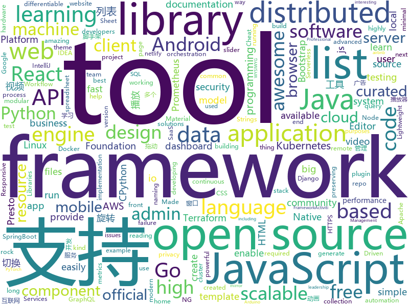

# 2020-01-10
See what the GitHub community is most excited about today.

## python
* [django](https://github.com/django/django)(**38 stars today**): The Web framework for perfectionists with deadlines.
* [mlflow](https://github.com/mlflow/mlflow)(**7 stars today**): Open source platform for the machine learning lifecycle
* [big-list-of-naughty-strings](https://github.com/minimaxir/big-list-of-naughty-strings)(**55 stars today**): The Big List of Naughty Strings is a list of strings which have a high probability of causing issues when used as user-input data.
* [requests](https://github.com/psf/requests)(**15 stars today**): A simple, yet elegant HTTP library.
* [CoupleGenerator](https://github.com/irfanICMLL/CoupleGenerator)(**101 stars today**): Generate your lover with your photo
* [ALBERT](https://github.com/google-research/ALBERT)(**125 stars today**): ALBERT: A Lite BERT for Self-supervised Learning of Language Representations
* [dask](https://github.com/dask/dask)(**11 stars today**): Parallel computing with task scheduling
* [CPython-Internals](https://github.com/zpoint/CPython-Internals)(**111 stars today**): Dive into CPython internals, trying to illustrate every detail of CPython implementation | CPython 源码阅读笔记, 多图展示底层实现细节
* [CheatSheetSeries](https://github.com/OWASP/CheatSheetSeries)(**25 stars today**): The OWASP Cheat Sheet Series was created to provide a concise collection of high value information on specific application security topics.
* [qiskit-terra](https://github.com/Qiskit/qiskit-terra)(**3 stars today**): Terra provides the foundations for Qiskit. It allows the user to write quantum circuits easily, and takes care of the constraints of real hardware.
* [graphene-django](https://github.com/graphql-python/graphene-django)(**9 stars today**): Integrate GraphQL into your Django project.
* [django-rest-framework](https://github.com/encode/django-rest-framework)(**15 stars today**): Web APIs for Django.🎸
* [fastapi](https://github.com/tiangolo/fastapi)(**71 stars today**): FastAPI framework, high performance, easy to learn, fast to code, ready for production
* [Deep-Learning-Papers-Reading-Roadmap](https://github.com/floodsung/Deep-Learning-Papers-Reading-Roadmap)(**43 stars today**): Deep Learning papers reading roadmap for anyone who are eager to learn this amazing tech!
* [dash](https://github.com/plotly/dash)(**11 stars today**): Analytical Web Apps for Python & R. No JavaScript Required.
* [python-cheatsheet](https://github.com/gto76/python-cheatsheet)(**33 stars today**): Comprehensive Python Cheatsheet
* [PySyft](https://github.com/OpenMined/PySyft)(**3 stars today**): A library for encrypted, privacy preserving machine learning
* [ray](https://github.com/ray-project/ray)(**17 stars today**): A fast and simple framework for building and running distributed applications. Ray is packaged with RLlib, a scalable reinforcement learning library, and Tune, a scalable hyperparameter tuning library.
* [SlowFast](https://github.com/facebookresearch/SlowFast)(**186 stars today**): PySlowFast: video understanding codebase from FAIR for reproducing state-of-the-art video models.
* [Autoticket](https://github.com/Entromorgan/Autoticket)(**14 stars today**): 大麦网自动抢票工具
* [matplotlib](https://github.com/matplotlib/matplotlib)(**7 stars today**): matplotlib: plotting with Python
* [linux-insides](https://github.com/0xAX/linux-insides)(**17 stars today**): A little bit about a linux kernel
* [incubator-tvm](https://github.com/apache/incubator-tvm)(**10 stars today**): Open deep learning compiler stack for cpu, gpu and specialized accelerators
* [docker-py](https://github.com/docker/docker-py)(**9 stars today**): A Python library for the Docker Engine API
* [localstack](https://github.com/localstack/localstack)(**22 stars today**): 💻A fully functional local AWS cloud stack. Develop and test your cloud & Serverless apps offline!

## java
* [micrometer](https://github.com/micrometer-metrics/micrometer)(**5 stars today**): An application metrics facade for the most popular monitoring tools. Think SLF4J, but for metrics.
* [presto](https://github.com/prestosql/presto)(**3 stars today**): Official home of the community managed version of Presto, the distributed SQL query engine for big data, under the auspices of the Presto Software Foundation.
* [GSYVideoPlayer](https://github.com/CarGuo/GSYVideoPlayer)(**66 stars today**): 视频播放器（IJKplayer、ExoPlayer、MediaPlayer），HTTPS，支持弹幕，外挂字幕，支持滤镜、水印、gif截图，片头广告、中间广告，多个同时播放，支持基本的拖动，声音、亮度调节，支持边播边缓存，支持视频自带rotation的旋转（90,270之类），重力旋转与手动旋转的同步支持，支持列表播放 ，列表全屏动画，视频加载速度，列表小窗口支持拖动，动画效果，调整比例，多分辨率切换，支持切换播放器，进度条小窗口预览，列表切换详情页面无缝播放，rtsp、concat、mpeg。
* [selenium](https://github.com/SeleniumHQ/selenium)(**19 stars today**): A browser automation framework and ecosystem.
* [tutorials](https://github.com/eugenp/tutorials)(**23 stars today**): Just Announced - "Learn Spring Security OAuth":
* [javapoet](https://github.com/square/javapoet)(**10 stars today**): A Java API for generating .java source files.
* [sonarqube](https://github.com/SonarSource/sonarqube)(**9 stars today**): Continuous Inspection
* [Head-First-Design-Patterns](https://github.com/bethrobson/Head-First-Design-Patterns)(**3 stars today**): Code for Head First Design Patterns book (2014)
* [karate](https://github.com/intuit/karate)(**6 stars today**): Test Automation Made Simple
* [reactor-core](https://github.com/reactor/reactor-core)(**5 stars today**): Non-Blocking Reactive Foundation for the JVM
* [presto](https://github.com/prestodb/presto)(**6 stars today**): The official home of the Presto distributed SQL query engine for big data
* [react-native-video](https://github.com/react-native-community/react-native-video)(**8 stars today**): A <Video /> component for react-native
* [aws-sdk-java](https://github.com/aws/aws-sdk-java)(**2 stars today**): The official AWS SDK for Java.
* [Telegram](https://github.com/DrKLO/Telegram)(**37 stars today**): Telegram for Android source
* [jacoco](https://github.com/jacoco/jacoco)(**4 stars today**): 🔬JaCoCo - Java Code Coverage Library
* [zuihou-admin-cloud](https://github.com/zuihou/zuihou-admin-cloud)(**18 stars today**): 基于SpringCloud(Hoxton.SR1) + SpringBoot(2.2.2.RELEASE) 的SaaS 微服务脚手架，具有统一授权、认证后台管理系统，其中包含具备用户管理、资源权限管理、网关API、分布式事务、大文件断点分片续传等多个模块，支持多业务系统并行开发，可以作为后端服务的开发脚手架。代码简洁，架构清晰，适合学习和直接项目中使用。核心技术采用Nacos、Fegin、Ribbon、Zuul、Hystrix、JWT Token、Mybatis、SpringBoot、Redis、RibbitMQ等主要框架和中间件。
* [dubbo](https://github.com/apache/dubbo)(**28 stars today**): Apache Dubbo is a high-performance, java based, open source RPC framework.
* [robolectric](https://github.com/robolectric/robolectric)(**3 stars today**): Android Unit Testing Framework
* [Activiti](https://github.com/Activiti/Activiti)(**9 stars today**): Activiti is a light-weight workflow and Business Process Management (BPM) Platform targeted at business people, developers and system admins. Its core is a super-fast and rock-solid BPMN 2 process engine for Java. It's open-source and distributed under the Apache license. Activiti runs in any Java application, on a server, on a cluster or in the…
* [antlr4](https://github.com/antlr/antlr4)(**12 stars today**): ANTLR (ANother Tool for Language Recognition) is a powerful parser generator for reading, processing, executing, or translating structured text or binary files.
* [apollo-android](https://github.com/apollographql/apollo-android)(**10 stars today**): 📟A strongly-typed, caching GraphQL client for Android and the JVM
* [Hystrix](https://github.com/Netflix/Hystrix)(**14 stars today**): Hystrix is a latency and fault tolerance library designed to isolate points of access to remote systems, services and 3rd party libraries, stop cascading failure and enable resilience in complex distributed systems where failure is inevitable.
* [FlycoTabLayout](https://github.com/H07000223/FlycoTabLayout)(**8 stars today**): An Android TabLayout Lib
* [react-native-push-notification](https://github.com/zo0r/react-native-push-notification)(**3 stars today**): React Native Local and Remote Notifications

## unknown
* [difftaichi](https://github.com/yuanming-hu/difftaichi)(**88 stars today**): 10 differentiable physical simulators built with Taichi differentiable programming (DiffTaichi, ICLR 2020)
* [coding-cheat-sheets](https://github.com/aspittel/coding-cheat-sheets)(**80 stars today**): Various cheat sheets on CS stuff
* [awesome-uses](https://github.com/wesbos/awesome-uses)(**150 stars today**): Awesome Uses Page
* [Red-Teaming-Toolkit](https://github.com/infosecn1nja/Red-Teaming-Toolkit)(**34 stars today**): A collection of open source and commercial tools that aid in red team operations.
* [how-to-exit-vim](https://github.com/hakluke/how-to-exit-vim)(**497 stars today**): Below are some simple methods for exiting vim.
* [jetbrain-activation-code](https://github.com/lubosson/jetbrain-activation-code)(**15 stars today**): jetbrain software全家桶激活码activation code, including intellij idea，pycharm，datagrip, webstorm...
* [awesome](https://github.com/sindresorhus/awesome)(**194 stars today**): 😎Awesome lists about all kinds of interesting topics
* [awesome-react-components](https://github.com/brillout/awesome-react-components)(**59 stars today**): Curated List of React Components & Libraries.
* [awesome-legal](https://github.com/ankane/awesome-legal)(**39 stars today**): Awesome free legal documents for companies
* [kubernetes-the-hard-way](https://github.com/kelseyhightower/kubernetes-the-hard-way)(**32 stars today**): Bootstrap Kubernetes the hard way on Google Cloud Platform. No scripts.
* [free-programming-books](https://github.com/EbookFoundation/free-programming-books)(**166 stars today**): 📚Freely available programming books
* [stargan-v2](https://github.com/clovaai/stargan-v2)(**10 stars today**): StarGAN v2 - Official PyTorch Implementation
* [awesome-malware-analysis](https://github.com/rshipp/awesome-malware-analysis)(**8 stars today**): A curated list of awesome malware analysis tools and resources.
* [Awesome](https://github.com/Awesome-Windows/Awesome)(**105 stars today**): 💻An awesome & curated list of best applications and tools for Windows.
* [awesome-for-beginners](https://github.com/MunGell/awesome-for-beginners)(**33 stars today**): A list of awesome beginners-friendly projects.
* [arduino-pro-ide](https://github.com/arduino/arduino-pro-ide)(**5 stars today**): The Arduino IDE for advanced users and developers. Experimental alpha version.
* [modern-cpp-features](https://github.com/AnthonyCalandra/modern-cpp-features)(**13 stars today**): A cheatsheet of modern C++ language and library features.
* [awesome-blazor](https://github.com/AdrienTorris/awesome-blazor)(**15 stars today**): Resources for Blazor, a .NET web framework using C#/Razor and HTML that runs in the browser with WebAssembly.
* [intellij-community](https://github.com/JetBrains/intellij-community)(**9 stars today**): IntelliJ IDEA Community Edition
* [How-To-Secure-A-Linux-Server](https://github.com/imthenachoman/How-To-Secure-A-Linux-Server)(**10 stars today**): An evolving how-to guide for securing a Linux server.
* [architecture_decision_record](https://github.com/joelparkerhenderson/architecture_decision_record)(**3 stars today**): Architecture decision record (ADR) examples for software planning, IT leadership, and template documenation
* [flexbugs](https://github.com/philipwalton/flexbugs)(**5 stars today**): A community-curated list of flexbox issues and cross-browser workarounds for them.
* [free-books](https://github.com/ruanyf/free-books)(**15 stars today**): 互联网上的免费书籍
* [naming-convention](https://github.com/ktaranov/naming-convention)(**4 stars today**): Templates for naming convention - TSQL, JavaScript, C#, R, Python, Powershell
* [Xiaomi_Kernel_OpenSource](https://github.com/MiCode/Xiaomi_Kernel_OpenSource)(**3 stars today**): Xiaomi Mobile Phone Kernel OpenSource

## javascript
* [redash](https://github.com/getredash/redash)(**21 stars today**): Make Your Company Data Driven. Connect to any data source, easily visualize, dashboard and share your data.
* [manifold](https://github.com/uber/manifold)(**119 stars today**): A model-agnostic visual debugging tool for machine learning
* [tech-interview-handbook](https://github.com/yangshun/tech-interview-handbook)(**127 stars today**): 💯Materials to help you rock your next coding interview
* [postgres](https://github.com/porsager/postgres)(**286 stars today**): Postgres.js - The Fastest full featured PostgreSQL client for Node.js
* [clean-code-javascript](https://github.com/ryanmcdermott/clean-code-javascript)(**87 stars today**): 🛁Clean Code concepts adapted for JavaScript
* [luban-h5](https://github.com/ly525/luban-h5)(**20 stars today**): [WIP]en: web design tool || mobile page builder/editor || mini webflow for mobile page. zh: 类似易企秀的H5制作、建站工具.
* [strapi](https://github.com/strapi/strapi)(**46 stars today**): 🚀Open source Node.js Headless CMS to easily build customisable APIs
* [alpine](https://github.com/alpinejs/alpine)(**62 stars today**): A rugged, minimal framework for composing JavaScript behavior in your markup.
* [codelf](https://github.com/unbug/codelf)(**48 stars today**): A search tool helps dev to solve the naming things problem.
* [OwlCarousel2](https://github.com/OwlCarousel2/OwlCarousel2)(**5 stars today**): DEPRECATED jQuery Responsive Carousel.
* [javascript-algorithms](https://github.com/trekhleb/javascript-algorithms)(**122 stars today**): 📝Algorithms and data structures implemented in JavaScript with explanations and links to further readings
* [swiper](https://github.com/nolimits4web/swiper)(**16 stars today**): Most modern mobile touch slider with hardware accelerated transitions
* [lottie-web](https://github.com/airbnb/lottie-web)(**14 stars today**): Render After Effects animations natively on Web, Android and iOS, and React Native. http://airbnb.io/lottie/
* [material-components-web](https://github.com/material-components/material-components-web)(**17 stars today**): Modular and customizable Material Design UI components for the web
* [docusaurus](https://github.com/facebook/docusaurus)(**71 stars today**): Easy to maintain open source documentation websites.
* [single-spa](https://github.com/CanopyTax/single-spa)(**28 stars today**): Microfrontends made easy
* [next.js](https://github.com/zeit/next.js)(**44 stars today**): The React Framework
* [snowpack](https://github.com/pikapkg/snowpack)(**240 stars today**): 📦✨Run npm packages directly in the browser. No Webpack, Parcel, or bundlers required.
* [openlayers](https://github.com/openlayers/openlayers)(**111 stars today**): OpenLayers
* [jexcel](https://github.com/paulhodel/jexcel)(**44 stars today**): jExcel is a lightweight vanilla javascript plugin to create amazing web-based interactive tables and spreadsheets compatible with Excel or any other spreadsheet software.
* [javascript](https://github.com/airbnb/javascript)(**44 stars today**): JavaScript Style Guide
* [serverless-offline](https://github.com/dherault/serverless-offline)(**7 stars today**): Emulate AWS λ and API Gateway locally when developing your Serverless project
* [d3](https://github.com/d3/d3)(**26 stars today**): Bring data to life with SVG, Canvas and HTML.📊📈🎉
* [Awesome-Design-Tools](https://github.com/LisaDziuba/Awesome-Design-Tools)(**74 stars today**): The best design tools and plugins for everything👉
* [airframe-react](https://github.com/0wczar/airframe-react)(**15 stars today**): Free Open Source High Quality Dashboard based on Bootstrap 4 & React 16: http://dashboards.webkom.co/react/airframe

## html
* [free-for-dev](https://github.com/ripienaar/free-for-dev)(**209 stars today**): A list of SaaS, PaaS and IaaS offerings that have free tiers of interest to devops and infradev
* [battlecode20](https://github.com/battlecode/battlecode20)(**2 stars today**): Battlecode 2020🍜
* [professional-services](https://github.com/GoogleCloudPlatform/professional-services)(**4 stars today**): Common solutions and tools developed by Google Cloud's Professional Services team
* [github-markdown-css](https://github.com/sindresorhus/github-markdown-css)(**5 stars today**): The minimal amount of CSS to replicate the GitHub Markdown style
* [OneList](https://github.com/MoeClub/OneList)(**10 stars today**): Simple index for onedrive
* [website](https://github.com/kubernetes/website)(**1 stars today**): Kubernetes website and documentation repo:
* [ng-alain](https://github.com/ng-alain/ng-alain)(**9 stars today**): NG-ZORRO admin panel front-end framework (netlify mirror https://netlify.ng-alain.com/)
* [compat-table](https://github.com/kangax/compat-table)(**3 stars today**): ECMAScript 5/6/7 compatibility tables
* [django-DefectDojo](https://github.com/DefectDojo/django-DefectDojo)(**3 stars today**): DefectDojo is an open-source application vulnerability correlation and security orchestration tool.
* [keep-a-changelog](https://github.com/olivierlacan/keep-a-changelog)(**5 stars today**): If you build software, keep a changelog.
* [coreui-free-bootstrap-admin-template](https://github.com/coreui/coreui-free-bootstrap-admin-template)(**12 stars today**): CoreUI is free bootstrap admin template
* [flexboxgrid](https://github.com/kristoferjoseph/flexboxgrid)(**4 stars today**): Grid based on CSS3 flexbox
* [startbootstrap-sb-admin-2](https://github.com/BlackrockDigital/startbootstrap-sb-admin-2)(**5 stars today**): A free, open source, Bootstrap admin theme created by Start Bootstrap
* [swagger-codegen](https://github.com/swagger-api/swagger-codegen)(**11 stars today**): swagger-codegen contains a template-driven engine to generate documentation, API clients and server stubs in different languages by parsing your OpenAPI / Swagger definition.
* [ATTACK-Tools](https://github.com/nshalabi/ATTACK-Tools)(**5 stars today**): Utilities for MITRE™ ATT&CK
* [tiny-slider](https://github.com/ganlanyuan/tiny-slider)(**8 stars today**): Vanilla javascript slider for all purposes.
* [hugo-coder](https://github.com/luizdepra/hugo-coder)(**3 stars today**): A minimalist blog theme for hugo.
* [linuxtools_rst](https://github.com/me115/linuxtools_rst)(**7 stars today**): Linux工具快速教程
* [wysiwyg-editor](https://github.com/froala/wysiwyg-editor)(**5 stars today**): The next generation Javascript WYSIWYG HTML Editor.
* [Java-Interview-Advanced](https://github.com/shishan100/Java-Interview-Advanced)(**10 stars today**): 中华石杉--互联网Java进阶面试训练营
* [cypress-example-kitchensink](https://github.com/cypress-io/cypress-example-kitchensink)(**0 stars today**): This is an example app used to showcase Cypress.io testing.
* [fe4ml-zh](https://github.com/apachecn/fe4ml-zh)(**2 stars today**): 📖[译] 面向机器学习的特征工程
* [csswg-drafts](https://github.com/w3c/csswg-drafts)(**5 stars today**): CSS Working Group Editor Drafts
* [foundation-sites](https://github.com/foundation/foundation-sites)(**6 stars today**): The most advanced responsive front-end framework in the world. Quickly create prototypes and production code for sites that work on any kind of device.
* [Spoon-Knife](https://github.com/octocat/Spoon-Knife)(**1 stars today**): This repo is for demonstration purposes only.

## go
* [beats](https://github.com/elastic/beats)(**4 stars today**): 🐠Beats - Lightweight shippers for Elasticsearch & Logstash
* [testify](https://github.com/stretchr/testify)(**34 stars today**): A toolkit with common assertions and mocks that plays nicely with the standard library
* [autoscaler](https://github.com/kubernetes/autoscaler)(**10 stars today**): Autoscaling components for Kubernetes
* [terraform](https://github.com/hashicorp/terraform)(**17 stars today**): Terraform enables you to safely and predictably create, change, and improve infrastructure. It is an open source tool that codifies APIs into declarative configuration files that can be shared amongst team members, treated as code, edited, reviewed, and versioned.
* [charts](https://github.com/helm/charts)(**22 stars today**): Curated applications for Kubernetes
* [cortex](https://github.com/cortexproject/cortex)(**9 stars today**): A horizontally scalable, highly available, multi-tenant, long term Prometheus.
* [kind](https://github.com/kubernetes-sigs/kind)(**12 stars today**): Kubernetes IN Docker - local clusters for testing Kubernetes
* [dgraph](https://github.com/dgraph-io/dgraph)(**16 stars today**): Fast, Distributed Graph DB
* [amqp](https://github.com/streadway/amqp)(**5 stars today**): Go client for AMQP 0.9.1
* [kustomize](https://github.com/kubernetes-sigs/kustomize)(**29 stars today**): Customization of kubernetes YAML configurations
* [argo](https://github.com/argoproj/argo)(**13 stars today**): Argo Workflows: Get stuff done with Kubernetes.
* [fabric](https://github.com/hyperledger/fabric)(**15 stars today**): Hyperledger Fabric is an enterprise-grade permissioned distributed ledger framework for developing solutions and applications. Its modular and versatile design satisfies a broad range of industry use cases. It offers a unique approach to consensus that enables performance at scale while preserving privacy.
* [pipeline](https://github.com/tektoncd/pipeline)(**14 stars today**): A K8s-native Pipeline resource.
* [client_golang](https://github.com/prometheus/client_golang)(**5 stars today**): Prometheus instrumentation library for Go applications
* [grpc-go](https://github.com/grpc/grpc-go)(**16 stars today**): The Go language implementation of gRPC. HTTP/2 based RPC
* [cortex](https://github.com/cortexlabs/cortex)(**66 stars today**): Deploy machine learning models in production
* [mux](https://github.com/gorilla/mux)(**14 stars today**): A powerful HTTP router and URL matcher for building Go web servers with🦍
* [go](https://github.com/golang/go)(**69 stars today**): The Go programming language
* [cadence](https://github.com/uber/cadence)(**9 stars today**): Cadence is a distributed, scalable, durable, and highly available orchestration engine to execute asynchronous long-running business logic in a scalable and resilient way.
* [concourse](https://github.com/concourse/concourse)(**2 stars today**): Concourse is a container-based continuous thing-doer written in Go and Elm.
* [terraform-provider-azurerm](https://github.com/terraform-providers/terraform-provider-azurerm)(**2 stars today**): Terraform provider for Azure Resource Manager
* [terragrunt](https://github.com/gruntwork-io/terragrunt)(**6 stars today**): Terragrunt is a thin wrapper for Terraform that provides extra tools for working with multiple Terraform modules.
* [alertmanager](https://github.com/prometheus/alertmanager)(**9 stars today**): Prometheus Alertmanager
* [kubernetes-ingress](https://github.com/nginxinc/kubernetes-ingress)(**5 stars today**): NGINX and NGINX Plus Ingress Controllers for Kubernetes
* [mock](https://github.com/golang/mock)(**15 stars today**): GoMock is a mocking framework for the Go programming language.

## WordCloud

