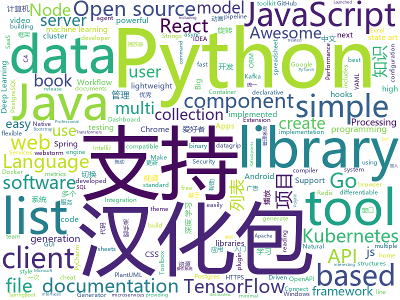

# 2020-01-11
See what the GitHub community is most excited about today.

## python
* [scalene](https://github.com/emeryberger/scalene)(**240 stars today**): a high-performance, high-precision CPU and memory profiler for Python
* [GitHub-Chinese-Top-Charts](https://github.com/kon9chunkit/GitHub-Chinese-Top-Charts)(**26 stars today**): 🇨🇳GitHub中文排行榜，帮助你发现高分优秀中文项目、更高效地吸收国人的优秀经验成果；榜单每周更新一次，敬请关注！
* [sentence-transformers](https://github.com/UKPLab/sentence-transformers)(**6 stars today**): Sentence Embeddings with BERT & XLNet
* [big-list-of-naughty-strings](https://github.com/minimaxir/big-list-of-naughty-strings)(**94 stars today**): The Big List of Naughty Strings is a list of strings which have a high probability of causing issues when used as user-input data.
* [cpython](https://github.com/python/cpython)(**23 stars today**): The Python programming language
* [httpx](https://github.com/encode/httpx)(**288 stars today**): A next generation HTTP client for Python.🦋
* [yolact](https://github.com/dbolya/yolact)(**64 stars today**): A simple, fully convolutional model for real-time instance segmentation.
* [flair](https://github.com/flairNLP/flair)(**5 stars today**): A very simple framework for state-of-the-art Natural Language Processing (NLP)
* [django-rest-framework](https://github.com/encode/django-rest-framework)(**18 stars today**): Web APIs for Django.🎸
* [SlowFast](https://github.com/facebookresearch/SlowFast)(**116 stars today**): PySlowFast: video understanding codebase from FAIR for reproducing state-of-the-art video models.
* [Deep-Learning-with-TensorFlow-book](https://github.com/dragen1860/Deep-Learning-with-TensorFlow-book)(**11 stars today**): 深度学习入门开源书，基于TensorFlow 2.0案例实战。Open source Deep Learning book, based on TensorFlow 2.0 framework.
* [pandas](https://github.com/pandas-dev/pandas)(**18 stars today**): Flexible and powerful data analysis / manipulation library for Python, providing labeled data structures similar to R data.frame objects, statistical functions, and much more
* [kedro](https://github.com/quantumblacklabs/kedro)(**5 stars today**): A Python library that implements software engineering best-practice for data and ML pipelines.
* [PySimpleGUI](https://github.com/PySimpleGUI/PySimpleGUI)(**31 stars today**): Launched in 2018 Actively developed and supported. Supports tkinter, Qt, WxPython, Remi (in browser). Create custom layout GUI's simply. Python 2.7 & 3 Support. 200+ Demo programs & Cookbook for rapid start. Extensive documentation. Examples using Machine Learning(GUI, OpenCV Integration, Chatterbot), Floating Desktop Widgets, Matplotlib + Pyplo…
* [transformers](https://github.com/huggingface/transformers)(**41 stars today**): 🤗Transformers: State-of-the-art Natural Language Processing for TensorFlow 2.0 and PyTorch.
* [dash](https://github.com/plotly/dash)(**7 stars today**): Analytical Web Apps for Python & R. No JavaScript Required.
* [DeepFaceLab](https://github.com/iperov/DeepFaceLab)(**22 stars today**): DeepFaceLab is a tool that utilizes machine learning to replace faces in videos. Includes prebuilt ready to work standalone Windows 7,8,10 binary (look readme.md).
* [nevergrad](https://github.com/facebookresearch/nevergrad)(**10 stars today**): A Python toolbox for performing gradient-free optimization
* [DeepDanbooru](https://github.com/KichangKim/DeepDanbooru)(**7 stars today**): AI based multi-label girl image classification system, implemented by using TensorFlow.
* [confluent-kafka-python](https://github.com/confluentinc/confluent-kafka-python)(**2 stars today**): Confluent's Kafka Python Client
* [yolov3-tf2](https://github.com/zzh8829/yolov3-tf2)(**4 stars today**): YoloV3 Implemented in Tensorflow 2.0
* [jupyterhub](https://github.com/jupyterhub/jupyterhub)(**2 stars today**): Multi-user server for Jupyter notebooks
* [pyecharts](https://github.com/pyecharts/pyecharts)(**5 stars today**): 🎨Python Echarts Plotting Library
* [requests](https://github.com/psf/requests)(**28 stars today**): A simple, yet elegant HTTP library.
* [pytorch_geometric](https://github.com/rusty1s/pytorch_geometric)(**10 stars today**): Geometric Deep Learning Extension Library for PyTorch

## java
* [djl](https://github.com/awslabs/djl)(**17 stars today**): An Engine-Agnostic Deep Learning Framework
* [react-native-webview](https://github.com/react-native-community/react-native-webview)(**5 stars today**): React Native Cross-Platform WebView
* [zuihou-admin-cloud](https://github.com/zuihou/zuihou-admin-cloud)(**15 stars today**): 基于SpringCloud(Hoxton.SR1) + SpringBoot(2.2.2.RELEASE) 的SaaS 微服务脚手架，具有统一授权、认证后台管理系统，其中包含具备用户管理、资源权限管理、网关API、分布式事务、大文件断点分片续传等多个模块，支持多业务系统并行开发，可以作为后端服务的开发脚手架。代码简洁，架构清晰，适合学习和直接项目中使用。核心技术采用Nacos、Fegin、Ribbon、Zuul、Hystrix、JWT Token、Mybatis、SpringBoot、Redis、RibbitMQ等主要框架和中间件。
* [GSYVideoPlayer](https://github.com/CarGuo/GSYVideoPlayer)(**99 stars today**): 视频播放器（IJKplayer、ExoPlayer、MediaPlayer），HTTPS，支持弹幕，外挂字幕，支持滤镜、水印、gif截图，片头广告、中间广告，多个同时播放，支持基本的拖动，声音、亮度调节，支持边播边缓存，支持视频自带rotation的旋转（90,270之类），重力旋转与手动旋转的同步支持，支持列表播放 ，列表全屏动画，视频加载速度，列表小窗口支持拖动，动画效果，调整比例，多分辨率切换，支持切换播放器，进度条小窗口预览，列表切换详情页面无缝播放，rtsp、concat、mpeg。
* [light-4j](https://github.com/networknt/light-4j)(**3 stars today**): A fast, lightweight and more productive microservices framework
* [firebase-android-sdk](https://github.com/firebase/firebase-android-sdk)(**4 stars today**): Firebase Android SDK
* [rest-assured](https://github.com/rest-assured/rest-assured)(**5 stars today**): Java DSL for easy testing of REST services
* [CS-Notes](https://github.com/CyC2018/CS-Notes)(**53 stars today**): 📚技术面试必备基础知识、Leetcode、计算机操作系统、计算机网络、系统设计、Java、Python、C++
* [lombok](https://github.com/rzwitserloot/lombok)(**3 stars today**): Very spicy additions to the Java programming language.
* [spring-security](https://github.com/spring-projects/spring-security)(**4 stars today**): Spring Security
* [tutorials](https://github.com/eugenp/tutorials)(**26 stars today**): Just Announced - "Learn Spring Security OAuth":
* [grpc-java](https://github.com/grpc/grpc-java)(**5 stars today**): The Java gRPC implementation. HTTP/2 based RPC
* [sonarqube](https://github.com/SonarSource/sonarqube)(**8 stars today**): Continuous Inspection
* [antlr4](https://github.com/antlr/antlr4)(**7 stars today**): ANTLR (ANother Tool for Language Recognition) is a powerful parser generator for reading, processing, executing, or translating structured text or binary files.
* [shopping-management-system](https://github.com/zhanglei-workspace/shopping-management-system)(**2 stars today**): 该项目为多个小项目的集合（持续更新中...）。内容类似淘宝、京东等网购管理系统以及图书管理、超市管理等系统。目的在于便于Java初级爱好者在学习完某一部分Java知识后有一个合适的项目锻炼、运用所学知识，完善知识体系。适用人群：Java基础到入门的爱好者。
* [spring-cloud-netflix](https://github.com/spring-cloud/spring-cloud-netflix)(**1 stars today**): Integration with Netflix OSS components
* [easyexcel](https://github.com/alibaba/easyexcel)(**10 stars today**): 快速、简单避免OOM的java处理Excel工具
* [kafka](https://github.com/apache/kafka)(**9 stars today**): Mirror of Apache Kafka
* [incubator-hudi](https://github.com/apache/incubator-hudi)(**1 stars today**): Upserts And Incremental Processing on Big Data
* [presto](https://github.com/prestodb/presto)(**4 stars today**): The official home of the Presto distributed SQL query engine for big data
* [openapi-generator](https://github.com/OpenAPITools/openapi-generator)(**9 stars today**): OpenAPI Generator allows generation of API client libraries (SDK generation), server stubs, documentation and configuration automatically given an OpenAPI Spec (v2, v3)
* [bazel](https://github.com/bazelbuild/bazel)(**6 stars today**): a fast, scalable, multi-language and extensible build system
* [lettuce-core](https://github.com/lettuce-io/lettuce-core)(**5 stars today**): Advanced Java Redis client for thread-safe sync, async, and reactive usage. Supports Cluster, Sentinel, Pipelining, and codecs.
* [spring-boot](https://github.com/spring-projects/spring-boot)(**22 stars today**): Spring Boot
* [kafka-connect-jdbc](https://github.com/confluentinc/kafka-connect-jdbc)(**0 stars today**): Kafka Connect connector for JDBC-compatible databases

## unknown
* [awesome-react-components](https://github.com/brillout/awesome-react-components)(**39 stars today**): Curated List of React Components & Libraries.
* [free-programming-books](https://github.com/EbookFoundation/free-programming-books)(**122 stars today**): 📚Freely available programming books
* [awesome](https://github.com/sindresorhus/awesome)(**153 stars today**): 😎Awesome lists about all kinds of interesting topics
* [browser-2020](https://github.com/luruke/browser-2020)(**109 stars today**): Things you can do with a browser in 2020☕️
* [coding-cheat-sheets](https://github.com/aspittel/coding-cheat-sheets)(**84 stars today**): Various cheat sheets on CS stuff
* [jetbrain-activation-code](https://github.com/lubosson/jetbrain-activation-code)(**39 stars today**): jetbrain software全家桶激活码activation code, including intellij idea，pycharm，datagrip, webstorm...
* [free-programming-books-zh_CN](https://github.com/justjavac/free-programming-books-zh_CN)(**32 stars today**): 📚免费的计算机编程类中文书籍，欢迎投稿
* [docs](https://github.com/laravel/docs)(**1 stars today**): 
* [Red-Teaming-Toolkit](https://github.com/infosecn1nja/Red-Teaming-Toolkit)(**49 stars today**): A collection of open source and commercial tools that aid in red team operations.
* [Tvlist-awesome-m3u-m3u8](https://github.com/billy21/Tvlist-awesome-m3u-m3u8)(**8 stars today**): 直播源相关资源汇总📺💯IPTV、M3U
* [elastic-beanstalk-roadmap](https://github.com/aws/elastic-beanstalk-roadmap)(**12 stars today**): AWS Elastic Beanstalk roadmap
* [You-Dont-Know-JS](https://github.com/getify/You-Dont-Know-JS)(**55 stars today**): A book series on JavaScript. @YDKJS on twitter.
* [how-to-exit-vim](https://github.com/hakluke/how-to-exit-vim)(**267 stars today**): Below are some simple methods for exiting vim.
* [aws-cloudformation-coverage-roadmap](https://github.com/aws-cloudformation/aws-cloudformation-coverage-roadmap)(**4 stars today**): The AWS CloudFormation Public Coverage Roadmap
* [Xiaomi_Kernel_OpenSource](https://github.com/MiCode/Xiaomi_Kernel_OpenSource)(**3 stars today**): Xiaomi Mobile Phone Kernel OpenSource
* [weekly](https://github.com/ruanyf/weekly)(**9 stars today**): 科技爱好者周刊，每周五发布
* [Awesome-Hacking-Resources](https://github.com/vitalysim/Awesome-Hacking-Resources)(**4 stars today**): A collection of hacking / penetration testing resources to make you better!
* [difftaichi](https://github.com/yuanming-hu/difftaichi)(**74 stars today**): 10 differentiable physical simulators built with Taichi differentiable programming (DiffTaichi, ICLR 2020)
* [DeepLearning-500-questions](https://github.com/scutan90/DeepLearning-500-questions)(**27 stars today**): 深度学习500问，以问答形式对常用的概率知识、线性代数、机器学习、深度学习、计算机视觉等热点问题进行阐述，以帮助自己及有需要的读者。 全书分为18个章节，50余万字。由于水平有限，书中不妥之处恳请广大读者批评指正。 未完待续............ 如有意合作，联系scutjy2015@163.com 版权所有，违权必究 Tan 2018.06
* [HEU_KMS_Activator](https://github.com/zbezj/HEU_KMS_Activator)(**2 stars today**): 
* [OpenAPI-Specification](https://github.com/OAI/OpenAPI-Specification)(**8 stars today**): The OpenAPI Specification Repository
* [awesome-pipeline](https://github.com/pditommaso/awesome-pipeline)(**7 stars today**): A curated list of awesome pipeline toolkits inspired by Awesome Sysadmin
* [you-dont-know-js-ru](https://github.com/azat-io/you-dont-know-js-ru)(**3 stars today**): 📚Russian translation of "You Don't Know JS" book series
* [corefx](https://github.com/dotnet/corefx)(**2 stars today**): CoreFX is the foundational class libraries for .NET Core. It includes types for collections, file systems, console, JSON, XML, async and many others.
* [C4-PlantUML](https://github.com/RicardoNiepel/C4-PlantUML)(**6 stars today**): C4-PlantUML combines the benefits of PlantUML and the C4 model for providing a simple way of describing and communicate software architectures

## javascript
* [awesome-uses](https://github.com/wesbos/awesome-uses)(**227 stars today**): A list of /uses pages detailing developer setups, gear, software and configs.
* [redash](https://github.com/getredash/redash)(**110 stars today**): Make Your Company Data Driven. Connect to any data source, easily visualize, dashboard and share your data.
* [tech-interview-handbook](https://github.com/yangshun/tech-interview-handbook)(**140 stars today**): 💯Materials to help you rock your next coding interview
* [alpine](https://github.com/alpinejs/alpine)(**99 stars today**): A rugged, minimal framework for composing JavaScript behavior in your markup.
* [postgres](https://github.com/porsager/postgres)(**319 stars today**): Postgres.js - The Fastest full featured PostgreSQL client for Node.js
* [jexcel](https://github.com/paulhodel/jexcel)(**31 stars today**): jExcel is a lightweight vanilla javascript plugin to create amazing web-based interactive tables and spreadsheets compatible with Excel or any other spreadsheet software.
* [javascript-algorithms](https://github.com/trekhleb/javascript-algorithms)(**165 stars today**): 📝Algorithms and data structures implemented in JavaScript with explanations and links to further readings
* [strapi](https://github.com/strapi/strapi)(**37 stars today**): 🚀Open source Node.js Headless CMS to easily build customisable APIs
* [javascript](https://github.com/airbnb/javascript)(**35 stars today**): JavaScript Style Guide
* [beautiful-react-hooks](https://github.com/beautifulinteractions/beautiful-react-hooks)(**123 stars today**): 🔥A collection of beautiful and (hopefully) useful React hooks to speed-up your components and hooks development🔥
* [request](https://github.com/request/request)(**10 stars today**): 🏊🏾 Simplified HTTP request client.
* [appium](https://github.com/appium/appium)(**8 stars today**): 📱Automation for iOS, Android, and Windows Apps.
* [renovate](https://github.com/renovatebot/renovate)(**3 stars today**): Universal dependency update tool that fits into your workflows.
* [clean-code-javascript](https://github.com/ryanmcdermott/clean-code-javascript)(**87 stars today**): 🛁Clean Code concepts adapted for JavaScript
* [sequelize](https://github.com/sequelize/sequelize)(**9 stars today**): An easy-to-use multi SQL dialect ORM for Node.js
* [puppeteer](https://github.com/puppeteer/puppeteer)(**40 stars today**): Headless Chrome Node.js API
* [styled-components](https://github.com/styled-components/styled-components)(**14 stars today**): Visual primitives for the component age. Use the best bits of ES6 and CSS to style your apps without stress💅
* [html-webpack-plugin](https://github.com/jantimon/html-webpack-plugin)(**3 stars today**): Simplifies creation of HTML files to serve your webpack bundles
* [FeHelper](https://github.com/zxlie/FeHelper)(**22 stars today**): 😍FeHelper--Web前端助手（Awesome！Chrome & Firefox Extension, All in one Toolbox!）
* [chakra-ui](https://github.com/chakra-ui/chakra-ui)(**65 stars today**): ⚡️Simple, Modular & Accessible UI Components for your React Applications
* [husky](https://github.com/typicode/husky)(**15 stars today**): Git hooks made easy🐶woof!
* [taro](https://github.com/NervJS/taro)(**35 stars today**): 多端统一开发框架，支持用 React 的开发方式编写一次代码，生成能运行在微信/百度/支付宝/字节跳动/ QQ 小程序/快应用/H5/React Native 等的应用。 https://taro.jd.com/
* [react](https://github.com/facebook/react)(**66 stars today**): A declarative, efficient, and flexible JavaScript library for building user interfaces.
* [sagemcom-fast-3890-exploit](https://github.com/Lyrebirds/sagemcom-fast-3890-exploit)(**21 stars today**): 
* [babel](https://github.com/babel/babel)(**12 stars today**): 🐠Babel is a compiler for writing next generation JavaScript.

## html
* [free-for-dev](https://github.com/ripienaar/free-for-dev)(**126 stars today**): A list of SaaS, PaaS and IaaS offerings that have free tiers of interest to devops and infradev
* [professional-services](https://github.com/GoogleCloudPlatform/professional-services)(**8 stars today**): Common solutions and tools developed by Google Cloud's Professional Services team
* [django-DefectDojo](https://github.com/DefectDojo/django-DefectDojo)(**3 stars today**): DefectDojo is an open-source application vulnerability correlation and security orchestration tool.
* [battlecode20](https://github.com/battlecode/battlecode20)(**3 stars today**): Battlecode 2020🍜
* [zTree_v3](https://github.com/zTree/zTree_v3)(**3 stars today**): jQuery Tree Plugin
* [TranslatorX](https://github.com/pingfangx/TranslatorX)(**13 stars today**): JetBrains 系列软件汉化包 关键字: Android Studio 3.5 汉化包 CLion 2019.3 汉化包 DataGrip 2019.3 汉化包 GoLand 2019.3 汉化包 IntelliJ IDEA 2019.3 汉化包 PhpStorm 2019.3 汉化包 PyCharm 2019.3 汉化包 Rider 2019.3 汉化包 RubyMine 2019.3 汉化包 WebStorm 2019.3 汉化包
* [sal](https://github.com/mciastek/sal)(**6 stars today**): 🚀Performance focused, lightweight scroll animation library🚀
* [ecma262](https://github.com/tc39/ecma262)(**4 stars today**): Status, process, and documents for ECMA-262
* [hugo-book](https://github.com/alex-shpak/hugo-book)(**2 stars today**): Hugo documentation theme as simple as plain book
* [tiny-slider](https://github.com/ganlanyuan/tiny-slider)(**6 stars today**): Vanilla javascript slider for all purposes.
* [conversational-form](https://github.com/space10-community/conversational-form)(**3 stars today**): Turning web forms into conversations
* [home-assistant.io](https://github.com/home-assistant/home-assistant.io)(**3 stars today**): 📘Home Assistant User documentation
* [frida-all-in-one](https://github.com/hookmaster/frida-all-in-one)(**2 stars today**): 《FRIDA操作手册》by @hluwa @r0ysue
* [portainer](https://github.com/portainer/portainer)(**15 stars today**): Making Docker management easy.
* [github-markdown-css](https://github.com/sindresorhus/github-markdown-css)(**5 stars today**): The minimal amount of CSS to replicate the GitHub Markdown style
* [python_ebook](https://github.com/shihyu/python_ebook)(**3 stars today**): 
* [MSEdgeExplainers](https://github.com/MicrosoftEdge/MSEdgeExplainers)(**2 stars today**): Home for explainer documents originated by the Microsoft Edge team
* [samples](https://github.com/GoogleChrome/samples)(**4 stars today**): A repo containing samples tied to new functionality in each release of Google Chrome.
* [stickyfill](https://github.com/wilddeer/stickyfill)(**0 stars today**): Polyfill for CSS `position: sticky`
* [Front-end-Developer-Interview-Questions](https://github.com/h5bp/Front-end-Developer-Interview-Questions)(**9 stars today**): A list of helpful front-end related questions you can use to interview potential candidates, test yourself or completely ignore.
* [sale-workflow](https://github.com/OCA/sale-workflow)(**0 stars today**): Odoo Sales, Workflow and Organization
* [hugo-coder](https://github.com/luizdepra/hugo-coder)(**5 stars today**): A minimalist blog theme for hugo.
* [training-kit](https://github.com/github/training-kit)(**0 stars today**): Open source cheat sheets for Git and GitHub
* [terraform-website](https://github.com/hashicorp/terraform-website)(**0 stars today**): Prototype of Terraform website being assembled from multiple repositories
* [gentelella](https://github.com/ColorlibHQ/gentelella)(**4 stars today**): Free Bootstrap 4 Admin Dashboard Template

## go
* [govalidate](https://github.com/rakyll/govalidate)(**28 stars today**): Validates your Go installation and dependencies.
* [argo](https://github.com/argoproj/argo)(**15 stars today**): Argo Workflows: Get stuff done with Kubernetes.
* [gorm](https://github.com/jinzhu/gorm)(**16 stars today**): The fantastic ORM library for Golang, aims to be developer friendly
* [tinygo](https://github.com/tinygo-org/tinygo)(**5 stars today**): Go compiler for small places. Microcontrollers, WebAssembly, and command-line tools. Based on LLVM.
* [cortex](https://github.com/cortexlabs/cortex)(**84 stars today**): Deploy machine learning models in production
* [testify](https://github.com/stretchr/testify)(**70 stars today**): A toolkit with common assertions and mocks that plays nicely with the standard library
* [telegraf](https://github.com/influxdata/telegraf)(**4 stars today**): The plugin-driven server agent for collecting & reporting metrics.
* [kustomize](https://github.com/kubernetes-sigs/kustomize)(**44 stars today**): Customization of kubernetes YAML configurations
* [autoscaler](https://github.com/kubernetes/autoscaler)(**16 stars today**): Autoscaling components for Kubernetes
* [kit](https://github.com/go-kit/kit)(**11 stars today**): A standard library for microservices.
* [ginkgo](https://github.com/onsi/ginkgo)(**1 stars today**): BDD Testing Framework for Go
* [helm](https://github.com/helm/helm)(**14 stars today**): The Kubernetes Package Manager
* [client_golang](https://github.com/prometheus/client_golang)(**1 stars today**): Prometheus instrumentation library for Go applications
* [swag](https://github.com/swaggo/swag)(**4 stars today**): Automatically generate RESTful API documentation with Swagger 2.0 for Go.
* [postgres-operator](https://github.com/zalando/postgres-operator)(**4 stars today**): Postgres operator creates and manages PostgreSQL clusters running in Kubernetes
* [client-go](https://github.com/kubernetes/client-go)(**1 stars today**): Go client for Kubernetes.
* [kube-state-metrics](https://github.com/kubernetes/kube-state-metrics)(**4 stars today**): Add-on agent to generate and expose cluster-level metrics.
* [cri-o](https://github.com/cri-o/cri-o)(**4 stars today**): Open Container Initiative-based implementation of Kubernetes Container Runtime Interface
* [mux](https://github.com/gorilla/mux)(**16 stars today**): A powerful HTTP router and URL matcher for building Go web servers with🦍
* [distribution](https://github.com/docker/distribution)(**3 stars today**): The Docker toolset to pack, ship, store, and deliver content
* [mongo-go-driver](https://github.com/mongodb/mongo-go-driver)(**3 stars today**): The Go driver for MongoDB
* [terraform](https://github.com/hashicorp/terraform)(**14 stars today**): Terraform enables you to safely and predictably create, change, and improve infrastructure. It is an open source tool that codifies APIs into declarative configuration files that can be shared amongst team members, treated as code, edited, reviewed, and versioned.
* [sarama](https://github.com/Shopify/sarama)(**5 stars today**): Sarama is a Go library for Apache Kafka 0.8, and up.
* [yq](https://github.com/mikefarah/yq)(**4 stars today**): yq is a portable command-line YAML processor
* [mmv](https://github.com/itchyny/mmv)(**20 stars today**): rename multiple files with editor

## WordCloud

