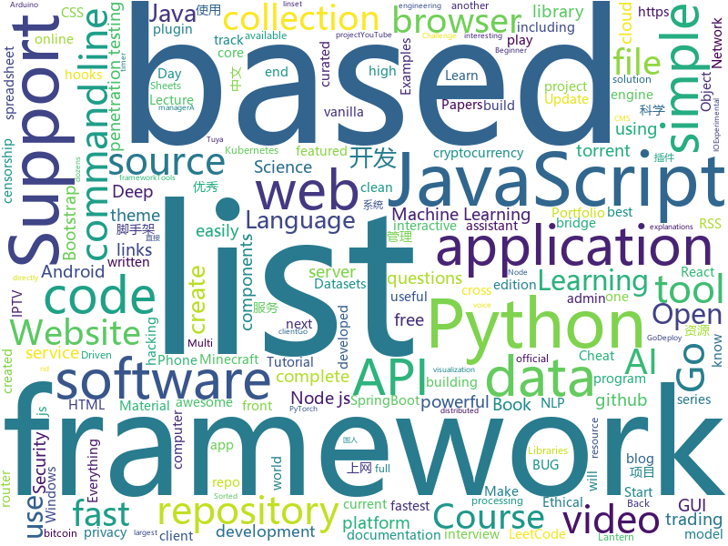

# 2020-01-12
See what the GitHub community is most excited about today.

## python
* [GitHub-Chinese-Top-Charts](https://github.com/kon9chunkit/GitHub-Chinese-Top-Charts)(**65 stars today**): 🇨🇳GitHub中文排行榜，帮助你发现高分优秀中文项目、更高效地吸收国人的优秀经验成果；榜单每周更新一次，敬请关注！
* [scalene](https://github.com/emeryberger/scalene)(**345 stars today**): a high-performance, high-precision CPU and memory profiler for Python
* [awesome-python](https://github.com/vinta/awesome-python)(**104 stars today**): A curated list of awesome Python frameworks, libraries, software and resources
* [PySimpleGUI](https://github.com/PySimpleGUI/PySimpleGUI)(**45 stars today**): Launched in 2018 Actively developed and supported. Supports tkinter, Qt, WxPython, Remi (in browser). Create custom layout GUI's simply. Python 2.7 & 3 Support. 200+ Demo programs & Cookbook for rapid start. Extensive documentation. Examples using Machine Learning(GUI, OpenCV Integration, Chatterbot), Floating Desktop Widgets, Matplotlib + Pyplo…
* [autogluon](https://github.com/awslabs/autogluon)(**124 stars today**): AutoGluon: AutoML Toolkit for Deep Learning
* [keras](https://github.com/keras-team/keras)(**28 stars today**): Deep Learning for humans
* [manim](https://github.com/3b1b/manim)(**40 stars today**): Animation engine for explanatory math videos
* [code_snippets](https://github.com/CoreyMSchafer/code_snippets)(**18 stars today**): 
* [binwalk](https://github.com/ReFirmLabs/binwalk)(**7 stars today**): Firmware Analysis Tool
* [NLP-progress](https://github.com/sebastianruder/NLP-progress)(**57 stars today**): Repository to track the progress in Natural Language Processing (NLP), including the datasets and the current state-of-the-art for the most common NLP tasks.
* [nightmare](https://github.com/guyinatuxedo/nightmare)(**125 stars today**): 
* [mlcourse.ai](https://github.com/Yorko/mlcourse.ai)(**7 stars today**): Open Machine Learning Course
* [yolact](https://github.com/dbolya/yolact)(**40 stars today**): A simple, fully convolutional model for real-time instance segmentation.
* [Python-100-Days](https://github.com/ZiniuLu/Python-100-Days)(**9 stars today**): 出处：https://github.com/jackfrued/Python-100-Days.git
* [a-PyTorch-Tutorial-to-Object-Detection](https://github.com/sgrvinod/a-PyTorch-Tutorial-to-Object-Detection)(**29 stars today**): SSD: Single Shot MultiBox Detector | a PyTorch Tutorial to Object Detection
* [AV_Data_Capture](https://github.com/yoshiko2/AV_Data_Capture)(**13 stars today**): 日本电影元数据刮削器，配合kodi,emby等本地媒体管理工具使用
* [youtube-dl](https://github.com/ytdl-org/youtube-dl)(**84 stars today**): Command-line program to download videos from YouTube.com and other video sites
* [zipline](https://github.com/quantopian/zipline)(**7 stars today**): Zipline, a Pythonic Algorithmic Trading Library
* [calibre](https://github.com/kovidgoyal/calibre)(**12 stars today**): The official source code repository for the calibre ebook manager
* [PayloadsAllTheThings](https://github.com/swisskyrepo/PayloadsAllTheThings)(**39 stars today**): A list of useful payloads and bypass for Web Application Security and Pentest/CTF
* [httpx](https://github.com/encode/httpx)(**365 stars today**): A next generation HTTP client for Python.🦋
* [ig-followers](https://github.com/aj-4/ig-followers)(**4 stars today**): see who unfollowed you with python
* [DeDRM_tools](https://github.com/apprenticeharper/DeDRM_tools)(**7 stars today**): DeDRM tools for ebooks
* [bottle](https://github.com/bottlepy/bottle)(**51 stars today**): bottle.py is a fast and simple micro-framework for python web-applications.
* [bips](https://github.com/bitcoin/bips)(**8 stars today**): Bitcoin Improvement Proposals

## java
* [Essentials](https://github.com/EssentialsX/Essentials)(**3 stars today**): EssentialsX: A maintained fork of Essentials 2.x.
* [zuihou-admin-cloud](https://github.com/zuihou/zuihou-admin-cloud)(**24 stars today**): 基于SpringCloud(Hoxton.SR1) + SpringBoot(2.2.2.RELEASE) 的SaaS 微服务脚手架，具有统一授权、认证后台管理系统，其中包含具备用户管理、资源权限管理、网关API、分布式事务、大文件断点分片续传等多个模块，支持多业务系统并行开发，可以作为后端服务的开发脚手架。代码简洁，架构清晰，适合学习和直接项目中使用。核心技术采用Nacos、Fegin、Ribbon、Zuul、Hystrix、JWT Token、Mybatis、SpringBoot、Redis、RibbitMQ等主要框架和中间件。
* [interviews](https://github.com/kdn251/interviews)(**25 stars today**): Everything you need to know to get the job.
* [AntennaPod](https://github.com/AntennaPod/AntennaPod)(**4 stars today**): A podcast manager for Android
* [android_packages_apps_GmsCore](https://github.com/microg/android_packages_apps_GmsCore)(**9 stars today**): Implementation of Play Services Core package
* [djl](https://github.com/awslabs/djl)(**22 stars today**): An Engine-Agnostic Deep Learning Framework
* [backtobackswe](https://github.com/bephrem1/backtobackswe)(**6 stars today**): Code Examples For Back To Back SWE Lessons
* [BTNotifierAndroid](https://github.com/RomascuAndrei/BTNotifierAndroid)(**0 stars today**): 
* [HMCL](https://github.com/huanghongxun/HMCL)(**5 stars today**): A Minecraft Launcher which is multi-functional, cross-platform and popular
* [CircleImageView](https://github.com/hdodenhof/CircleImageView)(**8 stars today**): A circular ImageView for Android
* [micronaut-core](https://github.com/micronaut-projects/micronaut-core)(**12 stars today**): Micronaut Application Framework
* [data-structures](https://github.com/williamfiset/data-structures)(**4 stars today**): A collection of powerful data structures
* [spring-petclinic](https://github.com/spring-projects/spring-petclinic)(**9 stars today**): A sample Spring-based application
* [effective-java-3e-source-code](https://github.com/jbloch/effective-java-3e-source-code)(**5 stars today**): The source code from the third edition of Effective Java, with minor additions as necessary to make it runnable.
* [ghidra](https://github.com/NationalSecurityAgency/ghidra)(**18 stars today**): Ghidra is a software reverse engineering (SRE) framework
* [dex2jar](https://github.com/pxb1988/dex2jar)(**5 stars today**): Tools to work with android .dex and java .class files
* [ByteX](https://github.com/bytedance/ByteX)(**89 stars today**): ByteX is a bytecode plugin platform based on Android Gradle Transform Api and ASM. 字节码插件开发平台
* [halo](https://github.com/halo-dev/halo)(**105 stars today**): ✍ Halo 一款现代化的个人独立博客系统
* [LeetCodeAnimation](https://github.com/MisterBooo/LeetCodeAnimation)(**125 stars today**): Demonstrate all the questions on LeetCode in the form of animation.（用动画的形式呈现解LeetCode题目的思路）
* [focus-android](https://github.com/mozilla-mobile/focus-android)(**3 stars today**): Firefox Focus: The privacy browser - Browse like no one’s watching.
* [antlr4](https://github.com/antlr/antlr4)(**5 stars today**): ANTLR (ANother Tool for Language Recognition) is a powerful parser generator for reading, processing, executing, or translating structured text or binary files.
* [HackerRank_solutions](https://github.com/RodneyShag/HackerRank_solutions)(**1 stars today**): 317 efficient solutions to HackerRank problems
* [termux-app](https://github.com/termux/termux-app)(**6 stars today**): Android terminal and Linux environment - app repository.
* [EdXposedManager](https://github.com/ElderDrivers/EdXposedManager)(**7 stars today**): Companion Android application for EdXposed
* [spring-security](https://github.com/spring-projects/spring-security)(**7 stars today**): Spring Security

## unknown
* [free-programming-books](https://github.com/EbookFoundation/free-programming-books)(**158 stars today**): 📚Freely available programming books
* [You-Dont-Know-JS](https://github.com/getify/You-Dont-Know-JS)(**111 stars today**): A book series on JavaScript. @YDKJS on twitter.
* [pwc](https://github.com/zziz/pwc)(**44 stars today**): Papers with code. Sorted by stars. Updated weekly.
* [browser-2020](https://github.com/luruke/browser-2020)(**177 stars today**): Things you can do with a browser in 2020☕️
* [awful-ai](https://github.com/daviddao/awful-ai)(**33 stars today**): 😈Awful AI is a curated list to track current scary usages of AI - hoping to raise awareness
* [PENTESTING-BIBLE](https://github.com/blaCCkHatHacEEkr/PENTESTING-BIBLE)(**13 stars today**): This repository was created and developed by Ammar Amer @cry__pto Only. Updates to this repository will continue to arrive until the number of links reaches 10000 links & 10000 pdf files .Learn Ethical Hacking and penetration testing .hundreds of ethical hacking & penetration testing & red team & cyber security & computer science resources.
* [the-book-of-secret-knowledge](https://github.com/trimstray/the-book-of-secret-knowledge)(**29 stars today**): A collection of inspiring lists, manuals, cheatsheets, blogs, hacks, one-liners, cli/web tools and more.
* [awesome](https://github.com/sindresorhus/awesome)(**113 stars today**): 😎Awesome lists about all kinds of interesting topics
* [Artificial-Intelligence](https://github.com/Niraj-Lunavat/Artificial-Intelligence)(**54 stars today**): Awesome AI Learning with +100 AI Cheat-Sheets, Free online Books, Top Courses, Best Videos and Lectures, Papers, Tutorials, +99 Researchers, Premium Websites, +121 Datasets, Conferences, Frameworks, Tools
* [clmystery](https://github.com/veltman/clmystery)(**11 stars today**): A command-line murder mystery
* [clash_for_windows_pkg](https://github.com/Fndroid/clash_for_windows_pkg)(**29 stars today**): A Windows GUI based on Clash
* [awesome-react-components](https://github.com/brillout/awesome-react-components)(**58 stars today**): Curated List of React Components & Libraries.
* [coding-cheat-sheets](https://github.com/aspittel/coding-cheat-sheets)(**128 stars today**): Various cheat sheets on CS stuff
* [keepnote](https://github.com/josephkingstone/keepnote)(**7 stars today**): Quick and Dirty Penetration Testing Notes
* [0](https://github.com/0-01/0)(**20 stars today**): 
* [Beginner-Network-Pentesting](https://github.com/hmaverickadams/Beginner-Network-Pentesting)(**13 stars today**): Notes for Beginner Network Pentesting Course
* [Tvlist-awesome-m3u-m3u8](https://github.com/billy21/Tvlist-awesome-m3u-m3u8)(**16 stars today**): 直播源相关资源汇总📺💯IPTV、M3U
* [AMD_Vanilla](https://github.com/AMD-OSX/AMD_Vanilla)(**12 stars today**): Native AMD macOS via Clover & OpenCore
* [fancyss_history_package](https://github.com/hq450/fancyss_history_package)(**23 stars today**): 科学上网插件的离线安装包储存在这里
* [MCM-ICM](https://github.com/dick20/MCM-ICM)(**9 stars today**): 2004-2017美赛O奖论文
* [Z-Stack-firmware](https://github.com/Koenkk/Z-Stack-firmware)(**4 stars today**): Compilation instructions and hex files for Z-Stack firmwares
* [shadowsocks-rss](https://github.com/shadowsocksr-backup/shadowsocks-rss)(**6 stars today**): ShadowsocksR update rss, SSR organization
* [jetbrain-activation-code](https://github.com/lubosson/jetbrain-activation-code)(**72 stars today**): jetbrain software全家桶激活码activation code, including intellij idea，pycharm，datagrip, webstorm...
* [Xiaomi_Kernel_OpenSource](https://github.com/MiCode/Xiaomi_Kernel_OpenSource)(**6 stars today**): Xiaomi Mobile Phone Kernel OpenSource
* [asuswrt-merlin](https://github.com/RMerl/asuswrt-merlin)(**4 stars today**): Enhanced version of Asus's router firmware (Asuswrt) (legacy code base)

## javascript
* [alpine](https://github.com/alpinejs/alpine)(**175 stars today**): A rugged, minimal framework for composing JavaScript behavior in your markup.
* [awesome-uses](https://github.com/wesbos/awesome-uses)(**185 stars today**): A list of /uses pages detailing developer setups, gear, software and configs.
* [redash](https://github.com/getredash/redash)(**225 stars today**): Make Your Company Data Driven. Connect to any data source, easily visualize, dashboard and share your data.
* [magnetW](https://github.com/xiandanin/magnetW)(**52 stars today**): 磁力链接聚合搜索
* [strapi](https://github.com/strapi/strapi)(**106 stars today**): 🚀Open source Node.js Headless CMS to easily build customisable APIs
* [tech-interview-handbook](https://github.com/yangshun/tech-interview-handbook)(**162 stars today**): 💯Materials to help you rock your next coding interview
* [nodebestpractices](https://github.com/goldbergyoni/nodebestpractices)(**73 stars today**): ✅The largest Node.js best practices list (December 2019)
* [beautiful-react-hooks](https://github.com/beautifulinteractions/beautiful-react-hooks)(**147 stars today**): 🔥A collection of beautiful and (hopefully) useful React hooks to speed-up your components and hooks development🔥
* [javascript-algorithms](https://github.com/trekhleb/javascript-algorithms)(**118 stars today**): 📝Algorithms and data structures implemented in JavaScript with explanations and links to further readings
* [sagemcom-fast-3890-exploit](https://github.com/Lyrebirds/sagemcom-fast-3890-exploit)(**31 stars today**): 
* [klona](https://github.com/lukeed/klona)(**178 stars today**): A tiny (281B) and fast utility to "deep clone" Objects, Arrays, Dates, RegExps, and more!
* [gt-linalg](https://github.com/QBobWatson/gt-linalg)(**28 stars today**): Interactive Linear Algebra, free online textbook at Georgia Tech
* [discord.js](https://github.com/discordjs/discord.js)(**11 stars today**): A powerful JavaScript library for interacting with the Discord API
* [jexcel](https://github.com/paulhodel/jexcel)(**59 stars today**): jExcel is a lightweight vanilla javascript plugin to create amazing web-based interactive tables and spreadsheets compatible with Excel or any other spreadsheet software.
* [homebridge](https://github.com/nfarina/homebridge)(**17 stars today**): HomeKit support for the impatient
* [RSSHub](https://github.com/DIYgod/RSSHub)(**16 stars today**): 🍰万物皆可 RSS
* [snowpack](https://github.com/pikapkg/snowpack)(**154 stars today**): 📦✨Run npm packages directly in the browser. No Webpack, Parcel, or bundlers required.
* [iptv](https://github.com/iptv-org/iptv)(**41 stars today**): Collection of 8000+ publicly available IPTV channels from all over the world
* [tuyapi](https://github.com/codetheweb/tuyapi)(**3 stars today**): 🌧An easy-to-use API for devices that use Tuya's cloud services. Documentation: https://codetheweb.github.io/tuyapi.
* [postgres](https://github.com/porsager/postgres)(**284 stars today**): Postgres.js - The Fastest full featured PostgreSQL client for Node.js
* [zigbee2mqtt](https://github.com/Koenkk/zigbee2mqtt)(**16 stars today**): Zigbee🐝to MQTT bridge🌉, get rid of your proprietary Zigbee bridges🔨
* [RDR2CollectorsMap](https://github.com/jeanropke/RDR2CollectorsMap)(**4 stars today**): 
* [webtorrent-desktop](https://github.com/webtorrent/webtorrent-desktop)(**6 stars today**): ❤️Streaming torrent app for Mac, Windows, and Linux
* [ccxt](https://github.com/ccxt/ccxt)(**11 stars today**): A JavaScript / Python / PHP cryptocurrency trading API with support for more than 120 bitcoin/altcoin exchanges
* [etcher](https://github.com/balena-io/etcher)(**22 stars today**): Flash OS images to SD cards & USB drives, safely and easily.

## html
* [rhasspy](https://github.com/synesthesiam/rhasspy)(**29 stars today**): Rhasspy voice assistant for Home Assistant and Hass.IO
* [infomate.club](https://github.com/vas3k/infomate.club)(**41 stars today**): Experimental project
* [node-ytdl-core](https://github.com/fent/node-ytdl-core)(**2 stars today**): YouTube video downloader in javascript.
* [zenbot](https://github.com/DeviaVir/zenbot)(**6 stars today**): Zenbot is a command-line cryptocurrency trading bot using Node.js and MongoDB.
* [Front-end-Developer-Interview-Questions](https://github.com/h5bp/Front-end-Developer-Interview-Questions)(**21 stars today**): A list of helpful front-end related questions you can use to interview potential candidates, test yourself or completely ignore.
* [datasciencecoursera](https://github.com/mGalarnyk/datasciencecoursera)(**3 stars today**): Data Science Repo and blog for John Hopkins Coursera Courses. Please let me know if you have any questions.
* [front-end-handbook-2019](https://github.com/FrontendMasters/front-end-handbook-2019)(**13 stars today**): [Book] 2019 edition of our front-end development handbook
* [simple-icons](https://github.com/simple-icons/simple-icons)(**28 stars today**): SVG icons for popular brands
* [JavaScript30](https://github.com/wesbos/JavaScript30)(**11 stars today**): 30 Day Vanilla JS Challenge
* [Java-Interview-Advanced](https://github.com/shishan100/Java-Interview-Advanced)(**10 stars today**): 中华石杉--互联网Java进阶面试训练营
* [twofactorauth](https://github.com/2factorauth/twofactorauth)(**3 stars today**): List of sites with two factor auth support which includes SMS, email, phone calls, hardware, and software.
* [REKCARC-TSC-UHT](https://github.com/PKUanonym/REKCARC-TSC-UHT)(**12 stars today**): 清华大学计算机系课程攻略 Guidance for courses in Department of Computer Science and Technology, Tsinghua University
* [startbootstrap-sb-admin-2](https://github.com/BlackrockDigital/startbootstrap-sb-admin-2)(**6 stars today**): A free, open source, Bootstrap admin theme created by Start Bootstrap
* [mkdocs-material](https://github.com/squidfunk/mkdocs-material)(**6 stars today**): A Material Design theme for MkDocs
* [fluxion](https://github.com/FluxionNetwork/fluxion)(**4 stars today**): Fluxion is a remake of linset by vk496 with less bugs and enhanced functionality.
* [lectures](https://github.com/uo-ec607/lectures)(**19 stars today**): Lecture notes for EC 607
* [ecma262](https://github.com/tc39/ecma262)(**7 stars today**): Status, process, and documents for ECMA-262
* [learning-area](https://github.com/mdn/learning-area)(**7 stars today**): Github repo for the MDN Learning Area.
* [boost](https://github.com/boostorg/boost)(**2 stars today**): Super-project for modularized Boost
* [Dism-Multi-language](https://github.com/Chuyu-Team/Dism-Multi-language)(**4 stars today**): Dism++ Multi-language Support & BUG Report
* [blackeye](https://github.com/thelinuxchoice/blackeye)(**1 stars today**): The most complete Phishing Tool, with 32 templates +1 customizable
* [privacytools.io](https://github.com/privacytoolsIO/privacytools.io)(**7 stars today**): 🛡🛠You are being watched. Protect your privacy against global mass surveillance.
* [PortFolio_Website](https://github.com/akashyap2013/PortFolio_Website)(**1 stars today**): Complete Portfolio Website with Bootstrap - HTML/CSS In this project, we are going to learn and build how to create a complete portfolio website with bootstrap using HTML and CSS. We will understand everything from scratch.
* [Mainroad](https://github.com/Vimux/Mainroad)(**1 stars today**): Responsive, simple, clean and content-focused Hugo theme based on the MH Magazine lite WordPress theme
* [django-grappelli](https://github.com/sehmaschine/django-grappelli)(**4 stars today**): A jazzy skin for the Django Admin-Interface (official repository).

## go
* [tanka](https://github.com/grafana/tanka)(**289 stars today**): Flexible, reusable and concise configuration for Kubernetes
* [goleak](https://github.com/uber-go/goleak)(**213 stars today**): Goroutine leak detector
* [sampler](https://github.com/sqshq/sampler)(**89 stars today**): Tool for shell commands execution, visualization and alerting. Configured with a simple YAML file.
* [yay](https://github.com/Jguer/yay)(**10 stars today**): Yet another Yogurt - An AUR Helper written in Go
* [cortex](https://github.com/cortexlabs/cortex)(**73 stars today**): Deploy machine learning models in production
* [dapr](https://github.com/dapr/dapr)(**21 stars today**): Dapr is a portable, event-driven, runtime for building distributed applications across cloud and edge.
* [caddy](https://github.com/caddyserver/caddy)(**23 stars today**): Fast, cross-platform HTTP/2 web server with automatic HTTPS
* [hugo](https://github.com/gohugoio/hugo)(**46 stars today**): The world’s fastest framework for building websites.
* [lantern](https://github.com/getlantern/lantern)(**18 stars today**): Lantern官方版本下载 蓝灯 翻墙 科学上网 外网 加速器 梯子 路由 lantern censorship-circumvention censorship gfw vpn accelerator
* [golang-web-dev](https://github.com/GoesToEleven/golang-web-dev)(**6 stars today**): 
* [cloud-torrent](https://github.com/jpillora/cloud-torrent)(**7 stars today**): ☁️Cloud Torrent: a self-hosted remote torrent client
* [tinygo](https://github.com/tinygo-org/tinygo)(**7 stars today**): Go compiler for small places. Microcontrollers, WebAssembly, and command-line tools. Based on LLVM.
* [govmomi](https://github.com/vmware/govmomi)(**2 stars today**): Go library for the VMware vSphere API
* [phantom](https://github.com/jhead/phantom)(**3 stars today**): Use your own Minecraft server with your Xbox or PS4 and play with friends!
* [clash](https://github.com/Dreamacro/clash)(**9 stars today**): A rule-based tunnel in Go.
* [ent](https://github.com/facebookincubator/ent)(**15 stars today**): An entity framework for Go
* [govalidate](https://github.com/rakyll/govalidate)(**34 stars today**): Validates your Go installation and dependencies.
* [pixel](https://github.com/faiface/pixel)(**6 stars today**): A hand-crafted 2D game library in Go
* [annie](https://github.com/iawia002/annie)(**19 stars today**): 👾Fast, simple and clean video downloader
* [gf](https://github.com/gogf/gf)(**11 stars today**): GoFrame is a modular, full-featured and production-ready application development framework of golang. Providing a series of core components and dozens of practical modules, such as: cache, logging, containers, timer, resource, validator, database orm, etc. Supporting web server integrated with router, cookie, session, middleware, logger, configu…
* [short](https://github.com/short-d/short)(**40 stars today**): URL shortening service written in Go and React
* [lnd](https://github.com/lightningnetwork/lnd)(**3 stars today**): Lightning Network Daemon⚡️
* [argo-cd](https://github.com/argoproj/argo-cd)(**11 stars today**): Declarative continuous deployment for Kubernetes.
* [arduino-cli](https://github.com/arduino/arduino-cli)(**8 stars today**): Arduino command line interface
* [antrea](https://github.com/vmware-tanzu/antrea)(**105 stars today**): A Kubernetes networking solution based on Open vSwitch

## WordCloud

