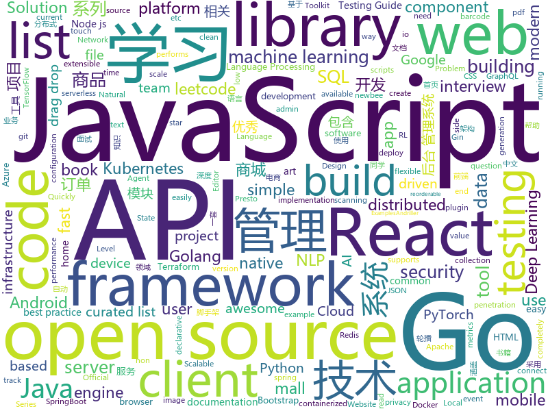

# 2020-01-14
See what the GitHub community is most excited about today.

## python
* [cve-2019-19781](https://github.com/trustedsec/cve-2019-19781)(**76 stars today**): This is a tool published for the Citrix ADC (NetScaler) vulnerability. We are only disclosing this due to others publishing the exploit code first.
* [cable-haunt-vulnerability-test](https://github.com/Lyrebirds/cable-haunt-vulnerability-test)(**32 stars today**): 
* [autogluon](https://github.com/awslabs/autogluon)(**488 stars today**): AutoGluon: AutoML Toolkit for Deep Learning
* [GitHub-Chinese-Top-Charts](https://github.com/kon9chunkit/GitHub-Chinese-Top-Charts)(**358 stars today**): 🇨🇳GitHub中文排行榜，帮助你发现高分优秀中文项目、更高效地吸收国人的优秀经验成果；榜单每周更新一次，敬请关注！
* [NLP-progress](https://github.com/sebastianruder/NLP-progress)(**64 stars today**): Repository to track the progress in Natural Language Processing (NLP), including the datasets and the current state-of-the-art for the most common NLP tasks.
* [apex](https://github.com/NVIDIA/apex)(**12 stars today**): A PyTorch Extension: Tools for easy mixed precision and distributed training in Pytorch
* [transformers](https://github.com/huggingface/transformers)(**112 stars today**): 🤗Transformers: State-of-the-art Natural Language Processing for TensorFlow 2.0 and PyTorch.
* [mlflow](https://github.com/mlflow/mlflow)(**18 stars today**): Open source platform for the machine learning lifecycle
* [data-science-from-scratch](https://github.com/joelgrus/data-science-from-scratch)(**13 stars today**): code for Data Science From Scratch book
* [FATE](https://github.com/FederatedAI/FATE)(**9 stars today**): An Industrial Level Federated Learning Framework
* [check-cve-2019-19781](https://github.com/cisagov/check-cve-2019-19781)(**4 stars today**): Test a host for susceptibility to CVE-2019-19781
* [serverless-application-model](https://github.com/awslabs/serverless-application-model)(**8 stars today**): AWS Serverless Application Model (SAM) is an open-source framework for building serverless applications
* [checkov](https://github.com/bridgecrewio/checkov)(**33 stars today**): Prevent cloud misconfigurations during build time
* [ml-agents](https://github.com/Unity-Technologies/ml-agents)(**10 stars today**): Unity Machine Learning Agents Toolkit
* [Autoticket](https://github.com/Entromorgan/Autoticket)(**25 stars today**): 大麦网自动抢票工具
* [keras](https://github.com/keras-team/keras)(**17 stars today**): Deep Learning for humans
* [devops-exercises](https://github.com/bregman-arie/devops-exercises)(**133 stars today**): Linux, Jenkins, AWS, SRE, Prometheus, Docker, Python, Ansible, Git, Kubernetes, Terraform, OpenStack, SQL, NoSQL, Azure, GCP, DNS, Elastic, Network, Virtualization
* [wagtail](https://github.com/wagtail/wagtail)(**8 stars today**): A Django content management system focused on flexibility and user experience
* [attention-cnn](https://github.com/epfml/attention-cnn)(**99 stars today**): Source code for "On the Relationship between Self-Attention and Convolutional Layers"
* [speck](https://github.com/lucashadfield/speck)(**39 stars today**): line art image renderer
* [home-assistant](https://github.com/home-assistant/home-assistant)(**42 stars today**): 🏡Open source home automation that puts local control and privacy first
* [nlp-recipes](https://github.com/microsoft/nlp-recipes)(**40 stars today**): Natural Language Processing Best Practices & Examples
* [andriller](https://github.com/den4uk/andriller)(**9 stars today**): Andriller - is software utility with a collection of forensic tools for smartphones. It performs read-only, forensically sound, non-destructive acquisition from Android devices.
* [google-cloud-python](https://github.com/googleapis/google-cloud-python)(**11 stars today**): Google Cloud Client Library for Python
* [stylegan](https://github.com/NVlabs/stylegan)(**12 stars today**): StyleGAN - Official TensorFlow Implementation

## java
* [CS-Notes](https://github.com/CyC2018/CS-Notes)(**245 stars today**): 📚技术面试必备基础知识、Leetcode、计算机操作系统、计算机网络、系统设计、Java、Python、C++
* [djl](https://github.com/awslabs/djl)(**19 stars today**): An Engine-Agnostic Deep Learning Framework
* [newbee-mall](https://github.com/newbee-ltd/newbee-mall)(**37 stars today**): newbee-mall 项目（新蜂商城）是一套电商系统，包括 newbee-mall 商城系统及 newbee-mall-admin 商城后台管理系统，基于 Spring Boot 2.X 及相关技术栈开发。 前台商城系统包含首页门户、商品分类、新品上线、首页轮播、商品推荐、商品搜索、商品展示、购物车、订单结算、订单流程、个人订单管理、会员中心、帮助中心等模块。 后台管理系统包含数据面板、轮播图管理、商品管理、订单管理、会员管理、分类管理、设置等模块。
* [react-native-push-notification](https://github.com/zo0r/react-native-push-notification)(**4 stars today**): React Native Local and Remote Notifications
* [kubernetes-client](https://github.com/fabric8io/kubernetes-client)(**7 stars today**): Java client for Kubernetes & OpenShift
* [zuihou-admin-cloud](https://github.com/zuihou/zuihou-admin-cloud)(**67 stars today**): 基于SpringCloud(Hoxton.SR1) + SpringBoot(2.2.2.RELEASE) 的SaaS 微服务脚手架，具有统一授权、认证后台管理系统，其中包含具备用户管理、资源权限管理、网关API、分布式事务、大文件断点分片续传等多个模块，支持多业务系统并行开发，可以作为后端服务的开发脚手架。代码简洁，架构清晰，适合学习和直接项目中使用。核心技术采用Nacos、Fegin、Ribbon、Zuul、Hystrix、JWT Token、Mybatis、SpringBoot、Redis、RibbitMQ等主要框架和中间件。
* [presto](https://github.com/prestosql/presto)(**2 stars today**): Official home of the community managed version of Presto, the distributed SQL query engine for big data, under the auspices of the Presto Software Foundation.
* [bazel](https://github.com/bazelbuild/bazel)(**9 stars today**): a fast, scalable, multi-language and extensible build system
* [react-native-camera](https://github.com/react-native-community/react-native-camera)(**4 stars today**): A Camera component for React Native. Also supports barcode scanning!
* [vosk-api](https://github.com/alphacep/vosk-api)(**9 stars today**): Kaldi API for Android, Python and Node
* [ByteX](https://github.com/bytedance/ByteX)(**64 stars today**): ByteX is a bytecode plugin platform based on Android Gradle Transform API and ASM. 字节码插件开发平台
* [graphql-java](https://github.com/graphql-java/graphql-java)(**2 stars today**): GraphQL Java implementation
* [FastBle](https://github.com/Jasonchenlijian/FastBle)(**7 stars today**): Android Bluetooth Low Energy (BLE) Fast Development Framework. It uses simple ways to filter, scan, connect, read ,write, notify, readRssi, setMTU, and multiConnection.
* [bc-java](https://github.com/bcgit/bc-java)(**2 stars today**): Bouncy Castle Java Distribution (Mirror)
* [strimzi-kafka-operator](https://github.com/strimzi/strimzi-kafka-operator)(**7 stars today**): Apache Kafka running on Kubernetes
* [storm](https://github.com/apache/storm)(**3 stars today**): Mirror of Apache Storm
* [lucene-solr](https://github.com/apache/lucene-solr)(**3 stars today**): Apache Lucene and Solr open-source search software
* [buckpal](https://github.com/thombergs/buckpal)(**3 stars today**): An example approach for implementing a Clean/Hexagonal Architecture
* [ExoPlayer](https://github.com/google/ExoPlayer)(**12 stars today**): An extensible media player for Android
* [mall-learning](https://github.com/macrozheng/mall-learning)(**26 stars today**): mall学习教程，架构、业务、技术要点全方位解析。mall项目（25k+star）是一套电商系统，使用现阶段主流技术实现。 涵盖了SpringBoot2.1.3、MyBatis3.4.6、Elasticsearch6.2.2、RabbitMQ3.7.15、Redis3.2、Mongodb3.2、Mysql5.7等技术，采用Docker容器化部署。
* [DSBridge-Android](https://github.com/wendux/DSBridge-Android)(**28 stars today**): 🌎A modern cross-platform JavaScript bridge, through which you can invoke each other's functions synchronously or asynchronously between JavaScript and native.
* [interviews](https://github.com/kdn251/interviews)(**31 stars today**): Everything you need to know to get the job.
* [zxing](https://github.com/zxing/zxing)(**14 stars today**): ZXing ("Zebra Crossing") barcode scanning library for Java, Android
* [robolectric](https://github.com/robolectric/robolectric)(**3 stars today**): Android Unit Testing Framework
* [libgdx](https://github.com/libgdx/libgdx)(**10 stars today**): Desktop/Android/HTML5/iOS Java game development framework

## unknown
* [You-Dont-Know-JS](https://github.com/getify/You-Dont-Know-JS)(**284 stars today**): A book series on JavaScript. @YDKJS on twitter.
* [browser-2020](https://github.com/luruke/browser-2020)(**340 stars today**): Things you can do with a browser in 2020☕️
* [JavaFamily](https://github.com/AobingJava/JavaFamily)(**133 stars today**): 【互联网一线大厂面试+学习指南】进阶知识完全扫盲：涵盖高并发、分布式、高可用、微服务等领域知识，作者风格幽默，看起来津津有味，把学习当做一种乐趣，何乐而不为，后端同学必看，前端同学我保证你也看得懂，看不懂你加我微信骂我渣男就好了。
* [pwc](https://github.com/zziz/pwc)(**120 stars today**): Papers with code. Sorted by stars. Updated weekly.
* [kubernetes-the-hard-way](https://github.com/kelseyhightower/kubernetes-the-hard-way)(**30 stars today**): Bootstrap Kubernetes the hard way on Google Cloud Platform. No scripts.
* [AZ-300-MicrosoftAzureArchitectTechnologies](https://github.com/MicrosoftLearning/AZ-300-MicrosoftAzureArchitectTechnologies)(**4 stars today**): 
* [free-programming-books](https://github.com/EbookFoundation/free-programming-books)(**201 stars today**): 📚Freely available programming books
* [awful-ai](https://github.com/daviddao/awful-ai)(**128 stars today**): 😈Awful AI is a curated list to track current scary usages of AI - hoping to raise awareness
* [what-happens-when](https://github.com/alex/what-happens-when)(**53 stars today**): An attempt to answer the age old interview question "What happens when you type google.com into your browser and press enter?"
* [AZ-103-MicrosoftAzureAdministrator](https://github.com/MicrosoftLearning/AZ-103-MicrosoftAzureAdministrator)(**5 stars today**): AZ-103: Microsoft Azure Administrator
* [awesome-production-machine-learning](https://github.com/EthicalML/awesome-production-machine-learning)(**6 stars today**): A curated list of awesome open source libraries to deploy, monitor, version and scale your machine learning
* [Blog](https://github.com/mqyqingfeng/Blog)(**29 stars today**): 冴羽写博客的地方，预计写四个系列：JavaScript深入系列、JavaScript专题系列、ES6系列、React系列。
* [leetcode](https://github.com/grandyang/leetcode)(**7 stars today**): Provide all my solutions and explanations in Chinese for all the Leetcode coding problems.
* [14th](https://github.com/d2forum/14th)(**11 stars today**): 第十四届D2前端技术论坛「创心」
* [xiaozhi](https://github.com/qq449245884/xiaozhi)(**15 stars today**): 
* [awesome-actions](https://github.com/sdras/awesome-actions)(**26 stars today**): A curated list of awesome actions to use on GitHub
* [design](https://github.com/WebAssembly/design)(**3 stars today**): WebAssembly Design Documents
* [Deep-learning-books](https://github.com/loveunk/Deep-learning-books)(**7 stars today**): Books for machine learning, deep learning, math, NLP, CV, RL, etc. 一些机器学习、深度学习等相关话题的书籍。
* [Awesome-CS-Books](https://github.com/wx-chevalier/Awesome-CS-Books)(**6 stars today**): 📚Awesome CS Books/Series(.pdf by git lfs) Warehouse for Geeks, ProgrammingLanguage, SoftwareEngineering, Web, AI, ServerSideApplication, Infrastructure, FE etc.💫优秀计算机科学与技术领域相关的书籍归档
* [javascript-interview-questions](https://github.com/sudheerj/javascript-interview-questions)(**3 stars today**): List of 1000 JavaScript Interview Questions
* [wstg](https://github.com/OWASP/wstg)(**4 stars today**): The OWASP Web Security Testing Guide includes a "best practice" penetration testing framework which users can implement in their own organizations and a "low level" penetration testing guide that describes techniques for testing most common web application and web service security issues.
* [ddia](https://github.com/Vonng/ddia)(**7 stars today**): 《Designing Data-Intensive Application》DDIA中文翻译
* [machine-learning-books](https://github.com/quincyliang/machine-learning-books)(**3 stars today**): a list of machine learning books, covering ML, RL, NLP
* [Fuck-XueXiQiangGuo](https://github.com/fuck-xuexiqiangguo/Fuck-XueXiQiangGuo)(**13 stars today**): 学习强国 懒人刷分工具 自动学习

## javascript
* [sagemcom-fast-3890-exploit](https://github.com/Lyrebirds/sagemcom-fast-3890-exploit)(**20 stars today**): 
* [react-beautiful-dnd](https://github.com/atlassian/react-beautiful-dnd)(**17 stars today**): Beautiful and accessible drag and drop for lists with React
* [leetcode](https://github.com/azl397985856/leetcode)(**114 stars today**): LeetCode Solutions: A Record of My Problem Solving Journey.( leetcode题解，记录自己的leetcode解题之路。)
* [swiper](https://github.com/nolimits4web/swiper)(**19 stars today**): Most modern mobile touch slider with hardware accelerated transitions
* [overreacted.io](https://github.com/gaearon/overreacted.io)(**39 stars today**): Personal blog by Dan Abramov.
* [next.js](https://github.com/zeit/next.js)(**38 stars today**): The React Framework
* [react-pdf](https://github.com/wojtekmaj/react-pdf)(**6 stars today**): Display PDFs in your React app as easily as if they were images.
* [showdoc](https://github.com/star7th/showdoc)(**139 stars today**): ShowDoc is a tool greatly applicable for an IT team to share documents online一个非常适合IT团队的在线API文档、技术文档工具
* [cypress-example-recipes](https://github.com/cypress-io/cypress-example-recipes)(**3 stars today**): Various recipes for testing common scenarios with Cypress
* [three.js](https://github.com/mrdoob/three.js)(**40 stars today**): JavaScript 3D library.
* [nodebestpractices](https://github.com/goldbergyoni/nodebestpractices)(**65 stars today**): ✅The largest Node.js best practices list (December 2019)
* [Sortable](https://github.com/SortableJS/Sortable)(**16 stars today**): Sortable — is a JavaScript library for reorderable drag-and-drop lists on modern browsers and touch devices. No jQuery required. Supports Meteor, AngularJS, React, Polymer, Vue, Ember, Knockout and any CSS library, e.g. Bootstrap.
* [api-platform](https://github.com/api-platform/api-platform)(**7 stars today**): REST and GraphQL framework to build modern API-driven projects (server-side and client-side)
* [home-assistant-config](https://github.com/basnijholt/home-assistant-config)(**40 stars today**): My Home Assistant config files and AppDaemon apps🏠🤖
* [Rocket.Chat](https://github.com/RocketChat/Rocket.Chat)(**20 stars today**): The ultimate Free Open Source Solution for team communications.
* [fullcalendar](https://github.com/fullcalendar/fullcalendar)(**10 stars today**): Full-sized drag & drop event calendar
* [react](https://github.com/facebook/react)(**73 stars today**): A declarative, efficient, and flexible JavaScript library for building user interfaces.
* [parse-server](https://github.com/parse-community/parse-server)(**6 stars today**): API server module for Node/Express
* [slate](https://github.com/ianstormtaylor/slate)(**19 stars today**): A completely customizable framework for building rich text editors. (Currently in beta.)
* [reveal.js](https://github.com/hakimel/reveal.js)(**19 stars today**): The HTML Presentation Framework
* [ieaseMusic](https://github.com/trazyn/ieaseMusic)(**15 stars today**): 网易云音乐第三方
* [strapi](https://github.com/strapi/strapi)(**61 stars today**): 🚀Open source Node.js Headless CMS to easily build customisable APIs
* [react-virtualized](https://github.com/bvaughn/react-virtualized)(**15 stars today**): React components for efficiently rendering large lists and tabular data
* [react-spring](https://github.com/react-spring/react-spring)(**50 stars today**): ✌️A spring physics based React animation library
* [d2-admin](https://github.com/d2-projects/d2-admin)(**97 stars today**): 🌈An elegant dashboard

## html
* [infomate.club](https://github.com/vas3k/infomate.club)(**44 stars today**): Experimental project
* [swagger-codegen](https://github.com/swagger-api/swagger-codegen)(**13 stars today**): swagger-codegen contains a template-driven engine to generate documentation, API clients and server stubs in different languages by parsing your OpenAPI / Swagger definition.
* [owasp-mstg](https://github.com/OWASP/owasp-mstg)(**11 stars today**): The Mobile Security Testing Guide (MSTG) is a comprehensive manual for mobile app security development, testing and reverse engineering.
* [DetectionLab](https://github.com/clong/DetectionLab)(**5 stars today**): Vagrant & Packer scripts to build a lab environment complete with security tooling and logging best practices
* [website](https://github.com/kubernetes/website)(**11 stars today**): Kubernetes website and documentation repo:
* [Front-end-Developer-Interview-Questions](https://github.com/h5bp/Front-end-Developer-Interview-Questions)(**24 stars today**): A list of helpful front-end related questions you can use to interview potential candidates, test yourself or completely ignore.
* [nndl.github.io](https://github.com/nndl/nndl.github.io)(**15 stars today**): 《神经网络与深度学习》 邱锡鹏著 Neural Network and Deep Learning
* [cypress-example-kitchensink](https://github.com/cypress-io/cypress-example-kitchensink)(**1 stars today**): This is an example app used to showcase Cypress.io testing.
* [keycloak-documentation](https://github.com/keycloak/keycloak-documentation)(**0 stars today**): 
* [golang101](https://github.com/golang101/golang101)(**28 stars today**): Go语言101 : 一本侧重于Go语言语法和语义的编程解释和指导书
* [node-interview](https://github.com/ElemeFE/node-interview)(**7 stars today**): How to pass the Node.js interview of ElemeFE.
* [foundation-emails](https://github.com/foundation/foundation-emails)(**2 stars today**): Quickly create responsive HTML emails that work on any device and client. Even Outlook.
* [webdevbootcamp](https://github.com/nax3t/webdevbootcamp)(**1 stars today**): All source code for back-end projects from the Web Developer Bootcamp
* [privacytools.io](https://github.com/privacytoolsIO/privacytools.io)(**3 stars today**): 🛡🛠You are being watched. Protect your privacy against global mass surveillance.
* [amp.dev](https://github.com/ampproject/amp.dev)(**1 stars today**): The AMP Project Website.
* [fastText](https://github.com/facebookresearch/fastText)(**10 stars today**): Library for fast text representation and classification.
* [keep-a-changelog](https://github.com/olivierlacan/keep-a-changelog)(**2 stars today**): If you build software, keep a changelog.
* [wysiwyg-editor](https://github.com/froala/wysiwyg-editor)(**1 stars today**): The next generation Javascript WYSIWYG HTML Editor.
* [MatBlazor](https://github.com/SamProf/MatBlazor)(**5 stars today**): Material Design components for Blazor and Razor Components
* [quickstart-js](https://github.com/firebase/quickstart-js)(**4 stars today**): Firebase Quickstart Samples for Web
* [gentelella](https://github.com/ColorlibHQ/gentelella)(**6 stars today**): Free Bootstrap 4 Admin Dashboard Template
* [AR.js](https://github.com/jeromeetienne/AR.js)(**10 stars today**): Efficient Augmented Reality for the Web - 60fps on mobile!
* [proposal-pipeline-operator](https://github.com/tc39/proposal-pipeline-operator)(**5 stars today**): A proposal for adding the simple-but-useful pipeline operator to JavaScript.
* [docs](https://github.com/knative/docs)(**1 stars today**): User documentation for Knative components
* [flag-icon-css](https://github.com/lipis/flag-icon-css)(**3 stars today**): 🎏A collection of all country flags in SVG — plus the CSS for easier integration

## go
* [sqlvet](https://github.com/houqp/sqlvet)(**156 stars today**): Go fearless SQL. Sqlvet performs static analysis on raw SQL queries in your Go code base.
* [mux](https://github.com/gorilla/mux)(**21 stars today**): A powerful HTTP router and URL matcher for building Go web servers with🦍
* [cosmos-sdk](https://github.com/cosmos/cosmos-sdk)(**3 stars today**): ⛓A Framework for Building High Value Public Blockchains✨
* [influxdb](https://github.com/influxdata/influxdb)(**10 stars today**): Scalable datastore for metrics, events, and real-time analytics
* [gjson](https://github.com/tidwall/gjson)(**9 stars today**): Get JSON values quickly - JSON parser for Go
* [mattermost-server](https://github.com/mattermost/mattermost-server)(**15 stars today**): Open source Slack-alternative in Golang and React - Mattermost
* [nomad](https://github.com/hashicorp/nomad)(**35 stars today**): Nomad is an easy-to-use, flexible, and performant workload orchestrator that can deploy a mix of microservice, batch, containerized, and non-containerized applications. Nomad is easy to operate and scale and has native Consul and Vault integrations.
* [gin](https://github.com/gin-gonic/gin)(**41 stars today**): Gin is a HTTP web framework written in Go (Golang). It features a Martini-like API with much better performance -- up to 40 times faster. If you need smashing performance, get yourself some Gin.
* [glow](https://github.com/charmbracelet/glow)(**49 stars today**): Render markdown on the CLI, with pizzazz! 💅🏻
* [terraform](https://github.com/hashicorp/terraform)(**19 stars today**): Terraform enables you to safely and predictably create, change, and improve infrastructure. It is an open source tool that codifies APIs into declarative configuration files that can be shared amongst team members, treated as code, edited, reviewed, and versioned.
* [terraform-provider-azurerm](https://github.com/terraform-providers/terraform-provider-azurerm)(**5 stars today**): Terraform provider for Azure Resource Manager
* [go-swagger](https://github.com/go-swagger/go-swagger)(**7 stars today**): Swagger 2.0 implementation for go
* [opa](https://github.com/open-policy-agent/opa)(**5 stars today**): An open source, general-purpose policy engine.
* [govalidator](https://github.com/asaskevich/govalidator)(**7 stars today**): [Go] Package of validators and sanitizers for strings, numerics, slices and structs
* [client-go](https://github.com/kubernetes/client-go)(**8 stars today**): Go client for Kubernetes.
* [squirrel](https://github.com/Masterminds/squirrel)(**7 stars today**): Fluent SQL generation for golang
* [annie](https://github.com/iawia002/annie)(**18 stars today**): 👾Fast, simple and clean video downloader
* [charts](https://github.com/helm/charts)(**24 stars today**): Curated applications for Kubernetes
* [MailHog](https://github.com/mailhog/MailHog)(**3 stars today**): Web and API based SMTP testing
* [sampler](https://github.com/sqshq/sampler)(**47 stars today**): Tool for shell commands execution, visualization and alerting. Configured with a simple YAML file.
* [gopherjs](https://github.com/gopherjs/gopherjs)(**14 stars today**): A compiler from Go to JavaScript for running Go code in a browser
* [consul](https://github.com/hashicorp/consul)(**15 stars today**): Consul is a distributed, highly available, and data center aware solution to connect and configure applications across dynamic, distributed infrastructure.
* [telegraf](https://github.com/influxdata/telegraf)(**7 stars today**): The plugin-driven server agent for collecting & reporting metrics.
* [viper](https://github.com/spf13/viper)(**15 stars today**): Go configuration with fangs
* [redis](https://github.com/go-redis/redis)(**8 stars today**): Type-safe Redis client for Golang

## WordCloud

