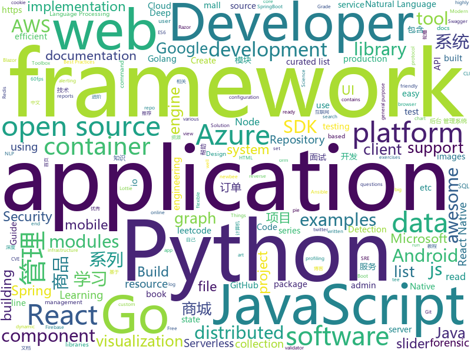

# 2020-01-15
See what the GitHub community is most excited about today.

## python
* [autogluon](https://github.com/awslabs/autogluon)(**269 stars today**): AutoGluon: AutoML Toolkit for Deep Learning
* [cable-haunt-vulnerability-test](https://github.com/Lyrebirds/cable-haunt-vulnerability-test)(**67 stars today**): 
* [check-cve-2019-19781](https://github.com/cisagov/check-cve-2019-19781)(**24 stars today**): Test a host for susceptibility to CVE-2019-19781
* [devops-exercises](https://github.com/bregman-arie/devops-exercises)(**141 stars today**): Linux, Jenkins, AWS, SRE, Prometheus, Docker, Python, Ansible, Git, Kubernetes, Terraform, OpenStack, SQL, NoSQL, Azure, GCP, DNS, Elastic, Network, Virtualization
* [GitHub-Chinese-Top-Charts](https://github.com/kon9chunkit/GitHub-Chinese-Top-Charts)(**311 stars today**): 🇨🇳GitHub中文排行榜，帮助你发现高分优秀中文项目、更高效地吸收国人的优秀经验成果；榜单每周更新一次，敬请关注！
* [nlp-recipes](https://github.com/microsoft/nlp-recipes)(**61 stars today**): Natural Language Processing Best Practices & Examples
* [transformers](https://github.com/huggingface/transformers)(**128 stars today**): 🤗Transformers: State-of-the-art Natural Language Processing for TensorFlow 2.0 and PyTorch.
* [aws-sam-cli](https://github.com/awslabs/aws-sam-cli)(**3 stars today**): CLI tool to build, test, debug, and deploy Serverless applications using AWS SAM
* [data-science-from-scratch](https://github.com/joelgrus/data-science-from-scratch)(**11 stars today**): code for Data Science From Scratch book
* [andriller](https://github.com/den4uk/andriller)(**19 stars today**): Andriller - is software utility with a collection of forensic tools for smartphones. It performs read-only, forensically sound, non-destructive acquisition from Android devices.
* [mlflow](https://github.com/mlflow/mlflow)(**17 stars today**): Open source platform for the machine learning lifecycle
* [dgl](https://github.com/dmlc/dgl)(**41 stars today**): Python package built to ease deep learning on graph, on top of existing DL frameworks.
* [NLP-progress](https://github.com/sebastianruder/NLP-progress)(**96 stars today**): Repository to track the progress in Natural Language Processing (NLP), including the datasets and the current state-of-the-art for the most common NLP tasks.
* [molecule](https://github.com/ansible/molecule)(**3 stars today**): Molecule aids in the development and testing of Ansible roles.
* [salt](https://github.com/saltstack/salt)(**6 stars today**): Software to automate the management and configuration of any infrastructure or application at scale. Get access to the Salt software package repository here:
* [compose](https://github.com/docker/compose)(**12 stars today**): Define and run multi-container applications with Docker
* [captum](https://github.com/pytorch/captum)(**9 stars today**): Model interpretability and understanding for PyTorch
* [models](https://github.com/tensorflow/models)(**37 stars today**): Models and examples built with TensorFlow
* [aiohttp](https://github.com/aio-libs/aiohttp)(**5 stars today**): Asynchronous HTTP client/server framework for asyncio and Python
* [azure-sdk-for-python](https://github.com/Azure/azure-sdk-for-python)(**1 stars today**): This repository is for active development of the Azure SDK for Python. For consumers of the SDK we recommend visiting our public developer docs at https://docs.microsoft.com/en-us/python/azure/ or our versioned developer docs at https://azure.github.io/azure-sdk-for-python.
* [elastalert](https://github.com/Yelp/elastalert)(**6 stars today**): Easy & Flexible Alerting With ElasticSearch
* [httpie](https://github.com/jakubroztocil/httpie)(**55 stars today**): As easy as HTTPie /aitch-tee-tee-pie/ 🥧 Modern command line HTTP client – user-friendly curl alternative with intuitive UI, JSON support, syntax highlighting, wget-like downloads, extensions, etc. https://twitter.com/clihttp
* [mmdetection](https://github.com/open-mmlab/mmdetection)(**18 stars today**): Open MMLab Detection Toolbox and Benchmark
* [pyod](https://github.com/yzhao062/pyod)(**8 stars today**): A Python Toolbox for Scalable Outlier Detection (Anomaly Detection)
* [pandas-profiling](https://github.com/pandas-profiling/pandas-profiling)(**17 stars today**): Create HTML profiling reports from pandas DataFrame objects

## java
* [newbee-mall](https://github.com/newbee-ltd/newbee-mall)(**43 stars today**): newbee-mall 项目（新蜂商城）是一套电商系统，包括 newbee-mall 商城系统及 newbee-mall-admin 商城后台管理系统，基于 Spring Boot 2.X 及相关技术栈开发。 前台商城系统包含首页门户、商品分类、新品上线、首页轮播、商品推荐、商品搜索、商品展示、购物车、订单结算、订单流程、个人订单管理、会员中心、帮助中心等模块。 后台管理系统包含数据面板、轮播图管理、商品管理、订单管理、会员管理、分类管理、设置等模块。
* [CS-Notes](https://github.com/CyC2018/CS-Notes)(**292 stars today**): 📚技术面试必备基础知识、Leetcode、计算机操作系统、计算机网络、系统设计、Java、Python、C++
* [lucene-solr](https://github.com/apache/lucene-solr)(**5 stars today**): Apache Lucene and Solr open-source search software
* [djl](https://github.com/awslabs/djl)(**23 stars today**): An Engine-Agnostic Deep Learning Framework
* [zuihou-admin-cloud](https://github.com/zuihou/zuihou-admin-cloud)(**116 stars today**): 基于SpringCloud(Hoxton.SR1) + SpringBoot(2.2.2.RELEASE) 的SaaS 微服务脚手架，具有统一授权、认证后台管理系统，其中包含具备用户管理、资源权限管理、网关API、分布式事务、大文件断点分片续传等多个模块，支持多业务系统并行开发，可以作为后端服务的开发脚手架。代码简洁，架构清晰，适合学习和直接项目中使用。核心技术采用Nacos、Fegin、Ribbon、Zuul、Hystrix、JWT Token、Mybatis、SpringBoot、Redis、RibbitMQ等主要框架和中间件。
* [canal](https://github.com/alibaba/canal)(**39 stars today**): 阿里巴巴 MySQL binlog 增量订阅&消费组件
* [tutorials](https://github.com/eugenp/tutorials)(**24 stars today**): Just Announced - "Learn Spring Security OAuth":
* [jib](https://github.com/GoogleContainerTools/jib)(**15 stars today**): 🏗Build container images for your Java applications.
* [spring-framework](https://github.com/spring-projects/spring-framework)(**43 stars today**): Spring Framework
* [elasticsearch](https://github.com/elastic/elasticsearch)(**32 stars today**): Open Source, Distributed, RESTful Search Engine
* [lottie-react-native](https://github.com/react-native-community/lottie-react-native)(**10 stars today**): Lottie wrapper for React Native.
* [graphql-java](https://github.com/graphql-java/graphql-java)(**3 stars today**): GraphQL Java implementation
* [aws-doc-sdk-examples](https://github.com/awsdocs/aws-doc-sdk-examples)(**10 stars today**): Code examples used in the AWS documentation, AWS SDK Developer Guides, and more.
* [nacos](https://github.com/alibaba/nacos)(**22 stars today**): an easy-to-use dynamic service discovery, configuration and service management platform for building cloud native applications.
* [react-native-push-notification](https://github.com/zo0r/react-native-push-notification)(**3 stars today**): React Native Local and Remote Notifications
* [react-native-camera](https://github.com/react-native-community/react-native-camera)(**3 stars today**): A Camera component for React Native. Also supports barcode scanning!
* [guava](https://github.com/google/guava)(**26 stars today**): Google core libraries for Java
* [flowable-engine](https://github.com/flowable/flowable-engine)(**4 stars today**): A compact and highly efficient workflow and Business Process Management (BPM) platform for developers, system admins and business users.
* [flink](https://github.com/apache/flink)(**19 stars today**): Apache Flink
* [rabbitmq-tutorials](https://github.com/rabbitmq/rabbitmq-tutorials)(**7 stars today**): Tutorials for using RabbitMQ in various ways
* [janusgraph](https://github.com/JanusGraph/janusgraph)(**1 stars today**): JanusGraph: an open-source, distributed graph database
* [presto](https://github.com/prestosql/presto)(**2 stars today**): Official home of the community managed version of Presto, the distributed SQL query engine for big data, under the auspices of the Presto Software Foundation.
* [fresco](https://github.com/facebook/fresco)(**3 stars today**): An Android library for managing images and the memory they use.
* [MPAndroidChart](https://github.com/PhilJay/MPAndroidChart)(**18 stars today**): A powerful🚀Android chart view / graph view library, supporting line- bar- pie- radar- bubble- and candlestick charts as well as scaling, dragging and animations.
* [ghidra](https://github.com/NationalSecurityAgency/ghidra)(**16 stars today**): Ghidra is a software reverse engineering (SRE) framework

## unknown
* [AZ-103-MicrosoftAzureAdministrator](https://github.com/MicrosoftLearning/AZ-103-MicrosoftAzureAdministrator)(**4 stars today**): AZ-103: Microsoft Azure Administrator
* [You-Dont-Know-JS](https://github.com/getify/You-Dont-Know-JS)(**213 stars today**): A book series on JavaScript. @YDKJS on twitter.
* [awesome-blazor](https://github.com/AdrienTorris/awesome-blazor)(**24 stars today**): Resources for Blazor, a .NET web framework using C#/Razor and HTML that runs in the browser with WebAssembly.
* [you-dont-know-js-ru](https://github.com/azat-io/you-dont-know-js-ru)(**5 stars today**): 📚Russian translation of "You Don't Know JS" book series
* [JavaFamily](https://github.com/AobingJava/JavaFamily)(**108 stars today**): 【互联网一线大厂面试+学习指南】进阶知识完全扫盲：涵盖高并发、分布式、高可用、微服务等领域知识，作者风格幽默，看起来津津有味，把学习当做一种乐趣，何乐而不为，后端同学必看，前端同学我保证你也看得懂，看不懂你加我微信骂我渣男就好了。
* [DeepLearning-500-questions](https://github.com/scutan90/DeepLearning-500-questions)(**40 stars today**): 深度学习500问，以问答形式对常用的概率知识、线性代数、机器学习、深度学习、计算机视觉等热点问题进行阐述，以帮助自己及有需要的读者。 全书分为18个章节，50余万字。由于水平有限，书中不妥之处恳请广大读者批评指正。 未完待续............ 如有意合作，联系scutjy2015@163.com 版权所有，违权必究 Tan 2018.06
* [OpenAPI-Specification](https://github.com/OAI/OpenAPI-Specification)(**15 stars today**): The OpenAPI Specification Repository
* [Blog](https://github.com/mqyqingfeng/Blog)(**21 stars today**): 冴羽写博客的地方，预计写四个系列：JavaScript深入系列、JavaScript专题系列、ES6系列、React系列。
* [browser-2020](https://github.com/luruke/browser-2020)(**329 stars today**): Things you can do with a browser in 2020☕️
* [awesome-react](https://github.com/enaqx/awesome-react)(**24 stars today**): A collection of awesome things regarding React ecosystem
* [Python-programming-exercises](https://github.com/zhiwehu/Python-programming-exercises)(**16 stars today**): 100+ Python challenging programming exercises
* [computer-science](https://github.com/ossu/computer-science)(**36 stars today**): 🎓Path to a free self-taught education in Computer Science!
* [Cookbook](https://github.com/andkret/Cookbook)(**8 stars today**): The Data Engineering Cookbook
* [javascript-questions](https://github.com/lydiahallie/javascript-questions)(**91 stars today**): A long list of (advanced) JavaScript questions, and their explanations✨
* [hackthebox-writeups](https://github.com/Hackplayers/hackthebox-writeups)(**8 stars today**): Writeups for HacktheBox 'boot2root' machines
* [CKAD-exercises](https://github.com/dgkanatsios/CKAD-exercises)(**9 stars today**): A set of exercises to prepare for Certified Kubernetes Application Developer exam by Cloud Native Computing Foundation
* [stats-illustrations](https://github.com/allisonhorst/stats-illustrations)(**20 stars today**): R & stats illustrations by @allison_horst
* [awesome-bigdata](https://github.com/onurakpolat/awesome-bigdata)(**4 stars today**): A curated list of awesome big data frameworks, ressources and other awesomeness.
* [Python](https://github.com/TwoWater/Python)(**15 stars today**): 最良心的 Python 教程：
* [bounty-targets-data](https://github.com/arkadiyt/bounty-targets-data)(**5 stars today**): This repo contains hourly-updated data dumps of bug bounty platform scopes (like Hackerone/Bugcrowd/etc) that are eligible for reports
* [DeepRec](https://github.com/imsheridan/DeepRec)(**13 stars today**): 推荐、广告工业界经典以及最前沿的论文、资料集合/ Must-read Papers on Recommendation System and CTR Prediction
* [the-art-of-command-line](https://github.com/jlevy/the-art-of-command-line)(**39 stars today**): Master the command line, in one page
* [fun-with-graphics](https://github.com/FancyVin/fun-with-graphics)(**58 stars today**): 这里整理了图形学相关的高校课程、书籍、教程、文章、博客、资源、开源项目。
* [awesome-android-ui](https://github.com/wasabeef/awesome-android-ui)(**10 stars today**): A curated list of awesome Android UI/UX libraries
* [awesome-forensics](https://github.com/alphaSeclab/awesome-forensics)(**66 stars today**): Awesome Forensics Resources. Almost 300 open source forensics tools, and 600 blog posts about forensics.

## javascript
* [sagemcom-fast-3890-exploit](https://github.com/Lyrebirds/sagemcom-fast-3890-exploit)(**37 stars today**): 
* [react](https://github.com/facebook/react)(**68 stars today**): A declarative, efficient, and flexible JavaScript library for building user interfaces.
* [deck.gl](https://github.com/uber/deck.gl)(**7 stars today**): WebGL2 powered geospatial visualization layers
* [leetcode](https://github.com/azl397985856/leetcode)(**138 stars today**): LeetCode Solutions: A Record of My Problem Solving Journey.( leetcode题解，记录自己的leetcode解题之路。)
* [next.js](https://github.com/zeit/next.js)(**50 stars today**): The React Framework
* [showdoc](https://github.com/star7th/showdoc)(**151 stars today**): ShowDoc is a tool greatly applicable for an IT team to share documents online一个非常适合IT团队的在线API文档、技术文档工具
* [swiper](https://github.com/nolimits4web/swiper)(**109 stars today**): Most modern mobile touch slider with hardware accelerated transitions
* [puppeteer](https://github.com/puppeteer/puppeteer)(**38 stars today**): Headless Chrome Node.js API
* [objection.js](https://github.com/Vincit/objection.js)(**6 stars today**): An SQL-friendly ORM for Node.js
* [material-ui](https://github.com/mui-org/material-ui)(**36 stars today**): React components for faster and easier web development. Build your own design system, or start with Material Design.
* [generator-jhipster](https://github.com/jhipster/generator-jhipster)(**11 stars today**): Open Source application platform for creating Spring Boot + Angular/React projects in seconds!
* [react-beautiful-dnd](https://github.com/atlassian/react-beautiful-dnd)(**39 stars today**): Beautiful and accessible drag and drop for lists with React
* [vis-timeline](https://github.com/visjs/vis-timeline)(**2 stars today**): 📈Create a fully customizable, interactive timelines and 2d-graphs with items and ranges.
* [vue](https://github.com/vuejs/vue)(**80 stars today**): 🖖Vue.js is a progressive, incrementally-adoptable JavaScript framework for building UI on the web.
* [nodebestpractices](https://github.com/goldbergyoni/nodebestpractices)(**56 stars today**): ✅The largest Node.js best practices list (December 2019)
* [semana-omnistack-9](https://github.com/Rocketseat/semana-omnistack-9)(**5 stars today**): Código do projeto produzido durante a Semana OmniStack 9.0
* [react-awesome-slider](https://github.com/rcaferati/react-awesome-slider)(**22 stars today**): React content transition slider. Awesome Slider is a 60fps, light weight, performant component that renders an animated set of production ready UI general purpose sliders.🖥️📱
* [examples](https://github.com/serverless/examples)(**9 stars today**): Serverless Examples – A collection of boilerplates and examples of serverless architectures built with the Serverless Framework on AWS Lambda, Microsoft Azure, Google Cloud Functions, and more.
* [react-native-firebase](https://github.com/invertase/react-native-firebase)(**12 stars today**): 🔥A well-tested feature-rich modular Firebase implementation for React Native. Supports both iOS & Android platforms for all Firebase services.
* [jest-dom](https://github.com/testing-library/jest-dom)(**7 stars today**): 🦉Custom jest matchers to test the state of the DOM
* [learnVue](https://github.com/answershuto/learnVue)(**18 stars today**): Vue.js 源码解析
* [react-native](https://github.com/facebook/react-native)(**42 stars today**): A framework for building native apps with React.
* [webpack](https://github.com/webpack/webpack)(**26 stars today**): A bundler for javascript and friends. Packs many modules into a few bundled assets. Code Splitting allows for loading parts of the application on demand. Through "loaders", modules can be CommonJs, AMD, ES6 modules, CSS, Images, JSON, Coffeescript, LESS, ... and your custom stuff.
* [three.js](https://github.com/mrdoob/three.js)(**34 stars today**): JavaScript 3D library.
* [jszip](https://github.com/Stuk/jszip)(**4 stars today**): Create, read and edit .zip files with Javascript

## html
* [AR.js](https://github.com/jeromeetienne/AR.js)(**7 stars today**): Efficient Augmented Reality for the Web - 60fps on mobile!
* [CitrixHoneypot](https://github.com/MalwareTech/CitrixHoneypot)(**17 stars today**): Detect and log CVE-2019-19781 scan and exploitation attempts.
* [lottie](https://github.com/airbnb/lottie)(**5 stars today**): Lottie documentation for http://airbnb.io/lottie
* [Java-Interview-Advanced](https://github.com/shishan100/Java-Interview-Advanced)(**10 stars today**): 中华石杉--互联网Java进阶面试训练营
* [infinite-scroll](https://github.com/metafizzy/infinite-scroll)(**3 stars today**): 📜Automatically add next page
* [swagger-codegen](https://github.com/swagger-api/swagger-codegen)(**9 stars today**): swagger-codegen contains a template-driven engine to generate documentation, API clients and server stubs in different languages by parsing your OpenAPI / Swagger definition.
* [tiny-helpers](https://github.com/stefanjudis/tiny-helpers)(**53 stars today**): A collection of useful online web development tools
* [web-moderno](https://github.com/cod3rcursos/web-moderno)(**3 stars today**): 
* [Django-CRM](https://github.com/MicroPyramid/Django-CRM)(**4 stars today**): Open Source Python CRM based on Django aimed to salesforce compatible for migrating to
* [webdevbootcamp](https://github.com/nax3t/webdevbootcamp)(**4 stars today**): All source code for back-end projects from the Web Developer Bootcamp
* [MatBlazor](https://github.com/SamProf/MatBlazor)(**5 stars today**): Material Design components for Blazor and Razor Components
* [owasp-mstg](https://github.com/OWASP/owasp-mstg)(**13 stars today**): The Mobile Security Testing Guide (MSTG) is a comprehensive manual for mobile app security development, testing and reverse engineering.
* [learning-area](https://github.com/mdn/learning-area)(**4 stars today**): Github repo for the MDN Learning Area.
* [personal-website](https://github.com/github/personal-website)(**9 stars today**): Code that'll help you kickstart a personal website that showcases your work as a software developer.
* [Front-end-Developer-Interview-Questions](https://github.com/h5bp/Front-end-Developer-Interview-Questions)(**13 stars today**): A list of helpful front-end related questions you can use to interview potential candidates, test yourself or completely ignore.
* [rellax](https://github.com/dixonandmoe/rellax)(**4 stars today**): Lightweight, vanilla javascript parallax library
* [samesite-examples](https://github.com/GoogleChromeLabs/samesite-examples)(**2 stars today**): Examples of using the SameSite cookie attribute in a variety of language, libraries, and frameworks.
* [complete-web-developer-manual](https://github.com/zero-to-mastery/complete-web-developer-manual)(**3 stars today**): All resources and notes from the Complete Web Developer in 2018: Zero to Mastery course
* [ASVS](https://github.com/OWASP/ASVS)(**2 stars today**): Application Security Verification Standard
* [kryo](https://github.com/EsotericSoftware/kryo)(**9 stars today**): Java binary serialization and cloning: fast, efficient, automatic
* [keep-a-changelog](https://github.com/olivierlacan/keep-a-changelog)(**2 stars today**): If you build software, keep a changelog.
* [dataviz](https://github.com/clauswilke/dataviz)(**3 stars today**): A book covering the fundamentals of data visualization.
* [styleguide](https://github.com/google/styleguide)(**14 stars today**): Style guides for Google-originated open-source projects
* [patchwork](https://github.com/jlord/patchwork)(**0 stars today**): All the Git-it Workshop completers!
* [stisla](https://github.com/stisla/stisla)(**4 stars today**): Free Bootstrap Admin Template

## go
* [gf](https://github.com/gogf/gf)(**32 stars today**): GoFrame is a modular, full-featured and production-ready application development framework of golang. Providing a series of core components and dozens of practical modules, such as: cache, logging, containers, timer, resource, validator, database orm, etc. Supporting web server integrated with router, cookie, session, middleware, logger, configu…
* [protobuf](https://github.com/golang/protobuf)(**16 stars today**): Go support for Google's protocol buffers
* [consul](https://github.com/hashicorp/consul)(**10 stars today**): Consul is a distributed, highly available, and data center aware solution to connect and configure applications across dynamic, distributed infrastructure.
* [loki](https://github.com/grafana/loki)(**11 stars today**): Like Prometheus, but for logs.
* [eksctl](https://github.com/weaveworks/eksctl)(**3 stars today**): The official CLI for Amazon EKS
* [sampler](https://github.com/sqshq/sampler)(**53 stars today**): Tool for shell commands execution, visualization and alerting. Configured with a simple YAML file.
* [awesome-go](https://github.com/avelino/awesome-go)(**47 stars today**): A curated list of awesome Go frameworks, libraries and software
* [fsnotify](https://github.com/fsnotify/fsnotify)(**9 stars today**): Cross-platform file system notifications for Go.
* [cob](https://github.com/knqyf263/cob)(**53 stars today**): Continuous Benchmark for Go Project
* [go-ethereum](https://github.com/ethereum/go-ethereum)(**16 stars today**): Official Go implementation of the Ethereum protocol
* [govalidator](https://github.com/asaskevich/govalidator)(**6 stars today**): [Go] Package of validators and sanitizers for strings, numerics, slices and structs
* [moby](https://github.com/moby/moby)(**22 stars today**): Moby Project - a collaborative project for the container ecosystem to assemble container-based systems
* [terraform-docs](https://github.com/segmentio/terraform-docs)(**6 stars today**): Generate documentation from Terraform modules in various output formats
* [yay](https://github.com/Jguer/yay)(**11 stars today**): Yet another Yogurt - An AUR Helper written in Go
* [grpc-go](https://github.com/grpc/grpc-go)(**9 stars today**): The Go language implementation of gRPC. HTTP/2 based RPC
* [aws-sdk-go](https://github.com/aws/aws-sdk-go)(**3 stars today**): AWS SDK for the Go programming language.
* [go-swagger](https://github.com/go-swagger/go-swagger)(**7 stars today**): Swagger 2.0 implementation for go
* [blackbox_exporter](https://github.com/prometheus/blackbox_exporter)(**2 stars today**): Blackbox prober exporter
* [kops](https://github.com/kubernetes/kops)(**10 stars today**): Kubernetes Operations (kops) - Production Grade K8s Installation, Upgrades, and Management
* [ffuf](https://github.com/ffuf/ffuf)(**7 stars today**): Fast web fuzzer written in Go
* [kubernetes](https://github.com/kubernetes/kubernetes)(**61 stars today**): Production-Grade Container Scheduling and Management
* [opa](https://github.com/open-policy-agent/opa)(**4 stars today**): An open source, general-purpose policy engine.
* [excelize](https://github.com/360EntSecGroup-Skylar/excelize)(**10 stars today**): Golang library for reading and writing Microsoft Excel™ (XLSX) files.
* [pprof](https://github.com/google/pprof)(**4 stars today**): pprof is a tool for visualization and analysis of profiling data
* [redis](https://github.com/go-redis/redis)(**10 stars today**): Type-safe Redis client for Golang

## WordCloud

