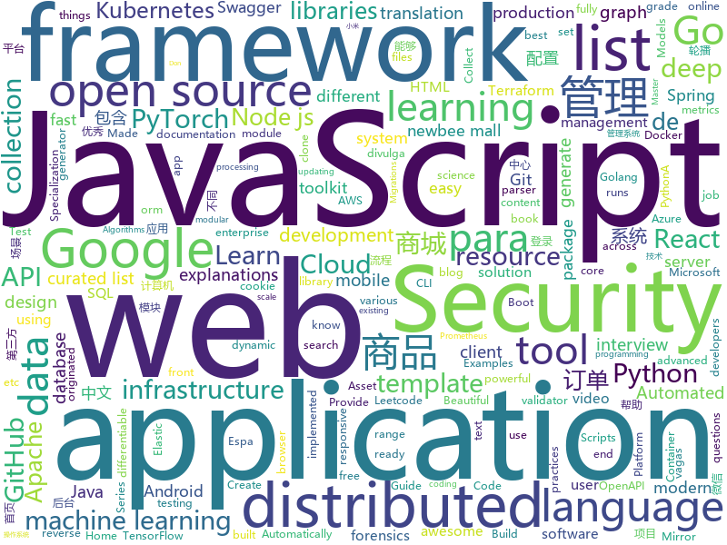

# 2020-01-16
See what the GitHub community is most excited about today.

## python
* [system-design-primer](https://github.com/donnemartin/system-design-primer)(**153 stars today**): Learn how to design large-scale systems. Prep for the system design interview. Includes Anki flashcards.
* [devops-exercises](https://github.com/bregman-arie/devops-exercises)(**137 stars today**): Linux, Jenkins, AWS, SRE, Prometheus, Docker, Python, Ansible, Git, Kubernetes, Terraform, OpenStack, SQL, NoSQL, Azure, GCP, DNS, Elastic, Network, Virtualization
* [GitHub-Chinese-Top-Charts](https://github.com/kon9chunkit/GitHub-Chinese-Top-Charts)(**311 stars today**): 🇨🇳GitHub中文排行榜，帮助你发现高分优秀中文项目、更高效地吸收国人的优秀经验成果；榜单每周更新一次，敬请关注！
* [check-cve-2019-19781](https://github.com/cisagov/check-cve-2019-19781)(**18 stars today**): Test a host for susceptibility to CVE-2019-19781
* [CheatSheetSeries](https://github.com/OWASP/CheatSheetSeries)(**28 stars today**): The OWASP Cheat Sheet Series was created to provide a concise collection of high value information on specific application security topics.
* [dgl](https://github.com/dmlc/dgl)(**44 stars today**): Python package built to ease deep learning on graph, on top of existing DL frameworks.
* [suministrospr](https://github.com/Code4PuertoRico/suministrospr)(**7 stars today**): Suministros Puerto Rico - Entérate, Ayuda, Informa
* [transformers](https://github.com/huggingface/transformers)(**112 stars today**): 🤗Transformers: State-of-the-art Natural Language Processing for TensorFlow 2.0 and PyTorch.
* [pipelines](https://github.com/kubeflow/pipelines)(**4 stars today**): Machine Learning Pipelines for Kubeflow
* [python-docs-samples](https://github.com/GoogleCloudPlatform/python-docs-samples)(**5 stars today**): Code samples used on cloud.google.com
* [seldon-core](https://github.com/SeldonIO/seldon-core)(**8 stars today**): Machine Learning Deployment for Kubernetes
* [scikit-learn](https://github.com/scikit-learn/scikit-learn)(**23 stars today**): scikit-learn: machine learning in Python
* [examples](https://github.com/pytorch/examples)(**15 stars today**): A set of examples around pytorch in Vision, Text, Reinforcement Learning, etc.
* [autogluon](https://github.com/awslabs/autogluon)(**243 stars today**): AutoGluon: AutoML Toolkit for Deep Learning
* [rq](https://github.com/rq/rq)(**9 stars today**): Simple job queues for Python
* [basketball_reference_scraper](https://github.com/vishaalagartha/basketball_reference_scraper)(**8 stars today**): A python module for scraping static and dynamic content from Basketball Reference.
* [AutoDL-Projects](https://github.com/D-X-Y/AutoDL-Projects)(**8 stars today**): Automated deep learning algorithms implemented in PyTorch or Tensorflow.
* [optuna](https://github.com/optuna/optuna)(**48 stars today**): A hyperparameter optimization framework
* [ScoutSuite](https://github.com/nccgroup/ScoutSuite)(**3 stars today**): Multi-Cloud Security Auditing Tool
* [jupyterhub](https://github.com/jupyterhub/jupyterhub)(**3 stars today**): Multi-user server for Jupyter notebooks
* [poetry](https://github.com/python-poetry/poetry)(**27 stars today**): Python dependency management and packaging made easy.
* [NSACodebreaker19](https://github.com/jselliott/NSACodebreaker19)(**6 stars today**): Scripts and Writeups for the NSA Codebreaker Challenge 2019
* [public-apis](https://github.com/public-apis/public-apis)(**55 stars today**): A collective list of free APIs for use in software and web development.
* [models](https://github.com/PaddlePaddle/models)(**11 stars today**): Pre-trained and Reproduced Deep Learning Models （『飞桨』官方模型库，包含多种学术前沿和工业场景验证的深度学习模型）
* [few-shot-vid2vid](https://github.com/NVlabs/few-shot-vid2vid)(**16 stars today**): Pytorch implementation for few-shot photorealistic video-to-video translation.

## java
* [newbee-mall](https://github.com/newbee-ltd/newbee-mall)(**176 stars today**): newbee-mall 项目（新蜂商城）是一套电商系统，包括 newbee-mall 商城系统及 newbee-mall-admin 商城后台管理系统，基于 Spring Boot 2.X 及相关技术栈开发。 前台商城系统包含首页门户、商品分类、新品上线、首页轮播、商品推荐、商品搜索、商品展示、购物车、订单结算、订单流程、个人订单管理、会员中心、帮助中心等模块。 后台管理系统包含数据面板、轮播图管理、商品管理、订单管理、会员管理、分类管理、设置等模块。
* [spring-boot](https://github.com/spring-projects/spring-boot)(**39 stars today**): Spring Boot
* [CS-Notes](https://github.com/CyC2018/CS-Notes)(**204 stars today**): 📚技术面试必备基础知识、Leetcode、计算机操作系统、计算机网络、系统设计、Java、Python、C++
* [micrometer](https://github.com/micrometer-metrics/micrometer)(**3 stars today**): An application metrics facade for the most popular monitoring tools. Think SLF4J, but for metrics.
* [flink](https://github.com/apache/flink)(**16 stars today**): Apache Flink
* [elasticsearch](https://github.com/elastic/elasticsearch)(**28 stars today**): Open Source, Distributed, RESTful Search Engine
* [lucene-solr](https://github.com/apache/lucene-solr)(**2 stars today**): Apache Lucene and Solr open-source search software
* [AndroidUtilCode](https://github.com/Blankj/AndroidUtilCode)(**22 stars today**): 🔥Android developers should collect the following utils(updating).
* [okhttp](https://github.com/square/okhttp)(**19 stars today**): An HTTP client for Android, Kotlin, and Java.
* [maven](https://github.com/apache/maven)(**1 stars today**): Apache Maven core
* [tutorials](https://github.com/eugenp/tutorials)(**13 stars today**): Just Announced - "Learn Spring Security OAuth":
* [bazel](https://github.com/bazelbuild/bazel)(**8 stars today**): a fast, scalable, multi-language and extensible build system
* [mybatis-plus](https://github.com/baomidou/mybatis-plus)(**14 stars today**): An powerful enhanced toolkit of MyBatis for simplify development
* [fastjson](https://github.com/alibaba/fastjson)(**17 stars today**): A fast JSON parser/generator for Java.
* [antlr4](https://github.com/antlr/antlr4)(**17 stars today**): ANTLR (ANother Tool for Language Recognition) is a powerful parser generator for reading, processing, executing, or translating structured text or binary files.
* [guava](https://github.com/google/guava)(**21 stars today**): Google core libraries for Java
* [schema-registry](https://github.com/confluentinc/schema-registry)(**1 stars today**): Confluent Schema Registry for Kafka
* [interviews](https://github.com/kdn251/interviews)(**24 stars today**): Everything you need to know to get the job.
* [apollo](https://github.com/ctripcorp/apollo)(**23 stars today**): Apollo（阿波罗）是携程框架部门研发的分布式配置中心，能够集中化管理应用不同环境、不同集群的配置，配置修改后能够实时推送到应用端，并且具备规范的权限、流程治理等特性，适用于微服务配置管理场景。
* [strimzi-kafka-operator](https://github.com/strimzi/strimzi-kafka-operator)(**4 stars today**): Apache Kafka running on Kubernetes
* [flyway](https://github.com/flyway/flyway)(**5 stars today**): Flyway by Redgate • Database Migrations Made Easy.
* [kafka](https://github.com/apache/kafka)(**14 stars today**): Mirror of Apache Kafka
* [janusgraph](https://github.com/JanusGraph/janusgraph)(**4 stars today**): JanusGraph: an open-source, distributed graph database
* [JustAuth](https://github.com/justauth/JustAuth)(**68 stars today**): 💯史上最全的整合第三方登录的开源库。目前已支持Github、Gitee、微博、钉钉、百度、Coding、腾讯云开发者平台、OSChina、支付宝、QQ、微信、淘宝、Google、Facebook、抖音、领英、小米、微软、今日头条、Teambition、StackOverflow、Pinterest、人人、华为、企业微信、酷家乐、Gitlab、美团、饿了么和推特等第三方平台的授权登录。 Login, so easy!
* [openjdk](https://github.com/unofficial-openjdk/openjdk)(**5 stars today**): Do not send pull requests! Automated Git clone of various OpenJDK branches

## unknown
* [difftaichi](https://github.com/yuanming-hu/difftaichi)(**95 stars today**): 10 differentiable physical simulators built with Taichi differentiable programming (DiffTaichi, ICLR 2020)
* [the-art-of-command-line](https://github.com/jlevy/the-art-of-command-line)(**36 stars today**): Master the command line, in one page
* [javascript-questions](https://github.com/lydiahallie/javascript-questions)(**122 stars today**): A long list of (advanced) JavaScript questions, and their explanations✨
* [leetcode](https://github.com/grandyang/leetcode)(**34 stars today**): Provide all my solutions and explanations in Chinese for all the Leetcode coding problems.
* [AZ-103-MicrosoftAzureAdministrator](https://github.com/MicrosoftLearning/AZ-103-MicrosoftAzureAdministrator)(**6 stars today**): AZ-103: Microsoft Azure Administrator
* [chromium](https://github.com/chromium/chromium)(**12 stars today**): The official GitHub mirror of the Chromium source
* [OpenAPI-Specification](https://github.com/OAI/OpenAPI-Specification)(**11 stars today**): The OpenAPI Specification Repository
* [awesome-php](https://github.com/ziadoz/awesome-php)(**19 stars today**): A curated list of amazingly awesome PHP libraries, resources and shiny things.
* [you-dont-know-js-ru](https://github.com/azat-io/you-dont-know-js-ru)(**6 stars today**): 📚Russian translation of "You Don't Know JS" book series
* [kubernetes-the-hard-way](https://github.com/kelseyhightower/kubernetes-the-hard-way)(**21 stars today**): Bootstrap Kubernetes the hard way on Google Cloud Platform. No scripts.
* [awesome-blazor](https://github.com/AdrienTorris/awesome-blazor)(**13 stars today**): Resources for Blazor, a .NET web framework using C#/Razor and HTML that runs in the browser with WebAssembly.
* [vagas](https://github.com/frontendbr/vagas)(**6 stars today**): 🔬Espaço para divulgação de vagas para front-enders.
* [books](https://github.com/ppatil9096/books)(**4 stars today**): 
* [Awesome-Android-Notebook](https://github.com/JsonChao/Awesome-Android-Notebook)(**11 stars today**): 💻A complete plan for better android developers.（continuous updating ...）
* [vagas](https://github.com/backend-br/vagas)(**3 stars today**): ✌️Espaço para divulgação de vagas para backenders
* [awesome-forensics](https://github.com/alphaSeclab/awesome-forensics)(**20 stars today**): Awesome Forensics Resources. Almost 300 open source forensics tools, and 600 blog posts about forensics.
* [Back-End-Developer-Interview-Questions](https://github.com/arialdomartini/Back-End-Developer-Interview-Questions)(**9 stars today**): A list of back-end related questions you can be inspired from to interview potential candidates, test yourself or completely ignore
* [awesome-distributed-systems](https://github.com/theanalyst/awesome-distributed-systems)(**11 stars today**): A curated list to learn about distributed systems
* [awesome-react](https://github.com/enaqx/awesome-react)(**26 stars today**): A collection of awesome things regarding React ecosystem
* [es6features](https://github.com/lukehoban/es6features)(**9 stars today**): Overview of ECMAScript 6 features
* [first-contributions](https://github.com/firstcontributions/first-contributions)(**14 stars today**): 🚀✨Help beginners to contribute to open source projects
* [PyQt5-Chinese-tutorial](https://github.com/maicss/PyQt5-Chinese-tutorial)(**5 stars today**): PyQt5中文教程
* [industry-machine-learning](https://github.com/firmai/industry-machine-learning)(**4 stars today**): A curated list of applied machine learning and data science notebooks and libraries across different industries.
* [awesome-react-hooks](https://github.com/rehooks/awesome-react-hooks)(**26 stars today**): Awesome React Hooks
* [Specs](https://github.com/CocoaPods/Specs)(**3 stars today**): The CocoaPods Master Repo

## javascript
* [nodebestpractices](https://github.com/goldbergyoni/nodebestpractices)(**89 stars today**): ✅The largest Node.js best practices list (December 2019)
* [react-beautiful-dnd](https://github.com/atlassian/react-beautiful-dnd)(**100 stars today**): Beautiful and accessible drag and drop for lists with React
* [curso-javascript-ninja](https://github.com/da2k/curso-javascript-ninja)(**4 stars today**): Curso Javascript Ninja
* [Functional-Light-JS](https://github.com/getify/Functional-Light-JS)(**29 stars today**): Pragmatic, balanced FP in JavaScript. @FLJSBook on twitter.
* [react](https://github.com/facebook/react)(**73 stars today**): A declarative, efficient, and flexible JavaScript library for building user interfaces.
* [javascript-algorithms](https://github.com/trekhleb/javascript-algorithms)(**108 stars today**): 📝Algorithms and data structures implemented in JavaScript with explanations and links to further readings
* [react-i18next](https://github.com/i18next/react-i18next)(**7 stars today**): Internationalization for react done right. Using the i18next i18n ecosystem.
* [gatsby-ja](https://github.com/gatsbyjs/gatsby-ja)(**24 stars today**): Japanese translation of Gatsbyjs.org
* [alpine](https://github.com/alpinejs/alpine)(**134 stars today**): A rugged, minimal framework for composing JavaScript behavior in your markup.
* [next.js](https://github.com/zeit/next.js)(**42 stars today**): The React Framework
* [clean-code-javascript](https://github.com/ryanmcdermott/clean-code-javascript)(**93 stars today**): 🛁Clean Code concepts adapted for JavaScript
* [hacker-scripts](https://github.com/NARKOZ/hacker-scripts)(**37 stars today**): Based on a true story
* [Crash-Course-Computer-Science-Chinese](https://github.com/1c7/Crash-Course-Computer-Science-Chinese)(**40 stars today**): 💻计算机速成课 | Crash Course 字幕组 (全40集 2018-5-1 精校完成)
* [awesome-mac](https://github.com/jaywcjlove/awesome-mac)(**93 stars today**):  Now we have become very big, Different from the original idea. Collect premium software in various categories.
* [puppeteer](https://github.com/puppeteer/puppeteer)(**36 stars today**): Headless Chrome Node.js API
* [semana-omnistack-9](https://github.com/Rocketseat/semana-omnistack-9)(**8 stars today**): Código do projeto produzido durante a Semana OmniStack 9.0
* [gatsby](https://github.com/gatsbyjs/gatsby)(**34 stars today**): Build blazing fast, modern apps and websites with React
* [objection.js](https://github.com/Vincit/objection.js)(**11 stars today**): An SQL-friendly ORM for Node.js
* [semantic-release](https://github.com/semantic-release/semantic-release)(**19 stars today**): 📦🚀Fully automated version management and package publishing
* [Inputmask](https://github.com/RobinHerbots/Inputmask)(**6 stars today**): Input Mask plugin
* [slick](https://github.com/kenwheeler/slick)(**8 stars today**): the last carousel you'll ever need
* [incubator-superset](https://github.com/apache/incubator-superset)(**12 stars today**): Apache Superset (incubating) is a modern, enterprise-ready business intelligence web application
* [vis-timeline](https://github.com/visjs/vis-timeline)(**9 stars today**): 📈Create a fully customizable, interactive timelines and 2d-graphs with items and ranges.
* [swagger-ui](https://github.com/swagger-api/swagger-ui)(**12 stars today**): Swagger UI is a collection of HTML, Javascript, and CSS assets that dynamically generate beautiful documentation from a Swagger-compliant API.
* [node-telegram-bot-api](https://github.com/yagop/node-telegram-bot-api)(**6 stars today**): Telegram Bot API for NodeJS

## html
* [wpt](https://github.com/web-platform-tests/wpt)(**2 stars today**): Test suites for Web platform specs — including WHATWG, W3C, and others
* [web-advertising](https://github.com/w3c/web-advertising)(**12 stars today**): Web Advertising BG
* [swagger-codegen](https://github.com/swagger-api/swagger-codegen)(**12 stars today**): swagger-codegen contains a template-driven engine to generate documentation, API clients and server stubs in different languages by parsing your OpenAPI / Swagger definition.
* [MSEdgeExplainers](https://github.com/MicrosoftEdge/MSEdgeExplainers)(**6 stars today**): Home for explainer documents originated by the Microsoft Edge team
* [boost](https://github.com/boostorg/boost)(**3 stars today**): Super-project for modularized Boost
* [AR.js](https://github.com/jeromeetienne/AR.js)(**5 stars today**): Efficient Augmented Reality for the Web - 60fps on mobile!
* [samesite-examples](https://github.com/GoogleChromeLabs/samesite-examples)(**2 stars today**): Examples of using the SameSite cookie attribute in a variety of language, libraries, and frameworks.
* [hyperblog](https://github.com/freddier/hyperblog)(**9 stars today**): Un blog increíble para el curso de Git y Github de Platzi
* [infinite-scroll](https://github.com/metafizzy/infinite-scroll)(**5 stars today**): 📜Automatically add next page
* [owasp-mstg](https://github.com/OWASP/owasp-mstg)(**8 stars today**): The Mobile Security Testing Guide (MSTG) is a comprehensive manual for mobile app security development, testing and reverse engineering.
* [go101](https://github.com/go101/go101)(**6 stars today**): An online book focusing on Go syntax/semantics.
* [foundation-sites](https://github.com/foundation/foundation-sites)(**4 stars today**): The most advanced responsive front-end framework in the world. Quickly create prototypes and production code for sites that work on any kind of device.
* [tiny-slider](https://github.com/ganlanyuan/tiny-slider)(**3 stars today**): Vanilla javascript slider for all purposes.
* [glTF](https://github.com/KhronosGroup/glTF)(**3 stars today**): glTF – Runtime 3D Asset Delivery
* [styleguide](https://github.com/google/styleguide)(**15 stars today**): Style guides for Google-originated open-source projects
* [GTFOBins.github.io](https://github.com/GTFOBins/GTFOBins.github.io)(**7 stars today**): Curated list of Unix binaries that can be exploited to bypass system security restrictions
* [tiny-helpers](https://github.com/stefanjudis/tiny-helpers)(**26 stars today**): A collection of useful online web development tools
* [node-ytdl-core](https://github.com/fent/node-ytdl-core)(**2 stars today**): YouTube video downloader in javascript.
* [WebFundamentals](https://github.com/google/WebFundamentals)(**4 stars today**): Best practices for modern web development
* [node-interview](https://github.com/ElemeFE/node-interview)(**7 stars today**): How to pass the Node.js interview of ElemeFE.
* [ASVS](https://github.com/OWASP/ASVS)(**0 stars today**): Application Security Verification Standard
* [courses](https://github.com/DataScienceSpecialization/courses)(**2 stars today**): Course materials for the Data Science Specialization: https://www.coursera.org/specialization/jhudatascience/1
* [home-assistant.io](https://github.com/home-assistant/home-assistant.io)(**4 stars today**): 📘Home Assistant User documentation
* [docsy](https://github.com/google/docsy)(**4 stars today**): A set of Hugo doc templates for launching open source content.
* [responsive-html-email-template](https://github.com/leemunroe/responsive-html-email-template)(**5 stars today**): A free simple responsive HTML email template

## go
* [cortex](https://github.com/cortexlabs/cortex)(**66 stars today**): Deploy machine learning models in production
* [aws-sdk-go](https://github.com/aws/aws-sdk-go)(**2 stars today**): AWS SDK for the Go programming language.
* [gf](https://github.com/gogf/gf)(**49 stars today**): GoFrame is a modular, full-featured and production-ready application development framework of golang. Providing a series of core components and dozens of practical modules, such as: cache, logging, containers, timer, resource, validator, database orm, etc. Supporting web server integrated with router, cookie, session, middleware, logger, configu…
* [oauth2](https://github.com/golang/oauth2)(**6 stars today**): Go OAuth2
* [govalidator](https://github.com/asaskevich/govalidator)(**8 stars today**): [Go] Package of validators and sanitizers for strings, numerics, slices and structs
* [terraform-provider-aws](https://github.com/terraform-providers/terraform-provider-aws)(**4 stars today**): Terraform AWS provider
* [loki](https://github.com/grafana/loki)(**14 stars today**): Like Prometheus, but for logs.
* [teleport](https://github.com/gravitational/teleport)(**4 stars today**): Privileged access management for elastic infrastructure.
* [cert-manager](https://github.com/jetstack/cert-manager)(**13 stars today**): Automatically provision and manage TLS certificates in Kubernetes
* [cloud-on-k8s](https://github.com/elastic/cloud-on-k8s)(**10 stars today**): Elastic Cloud on Kubernetes
* [protobuf](https://github.com/golang/protobuf)(**23 stars today**): Go support for Google's protocol buffers
* [migrate](https://github.com/golang-migrate/migrate)(**7 stars today**): Database migrations. CLI and Golang library.
* [terraformer](https://github.com/GoogleCloudPlatform/terraformer)(**7 stars today**): CLI tool to generate terraform files from existing infrastructure (reverse Terraform). Infrastructure to Code
* [squirrel](https://github.com/Masterminds/squirrel)(**15 stars today**): Fluent SQL generation for golang
* [sprig](https://github.com/Masterminds/sprig)(**4 stars today**): Useful template functions for Go templates.
* [pprof](https://github.com/google/pprof)(**4 stars today**): pprof is a tool for visualization and analysis of profiling data
* [goatcounter](https://github.com/zgoat/goatcounter)(**89 stars today**): Simple web statistics. No tracking of personal data.
* [neko](https://github.com/nurdism/neko)(**29 stars today**): A self hosted virtual browser (rabb.it clone) that runs in docker.
* [fabric](https://github.com/hyperledger/fabric)(**12 stars today**): Hyperledger Fabric is an enterprise-grade permissioned distributed ledger framework for developing solutions and applications. Its modular and versatile design satisfies a broad range of industry use cases. It offers a unique approach to consensus that enables performance at scale while preserving privacy.
* [kubernetes](https://github.com/kubernetes/kubernetes)(**45 stars today**): Production-Grade Container Scheduling and Management
* [pgx](https://github.com/jackc/pgx)(**5 stars today**): PostgreSQL driver and toolkit for Go
* [consul](https://github.com/hashicorp/consul)(**12 stars today**): Consul is a distributed, highly available, and data center aware solution to connect and configure applications across dynamic, distributed infrastructure.
* [flux](https://github.com/fluxcd/flux)(**14 stars today**): The GitOps Kubernetes operator
* [redis](https://github.com/go-redis/redis)(**15 stars today**): Type-safe Redis client for Golang
* [charts](https://github.com/helm/charts)(**23 stars today**): Curated applications for Kubernetes

## WordCloud

