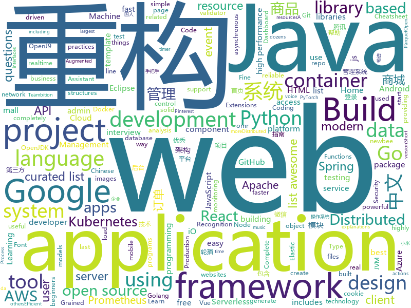

# 2020-01-17
See what the GitHub community is most excited about today.

## python
* [optuna](https://github.com/optuna/optuna)(**58 stars today**): A hyperparameter optimization framework
* [devops-exercises](https://github.com/bregman-arie/devops-exercises)(**241 stars today**): Linux, Jenkins, AWS, SRE, Prometheus, Docker, Python, Ansible, Git, Kubernetes, Terraform, OpenStack, SQL, NoSQL, Azure, GCP, DNS, Elastic, Network, Virtualization
* [ddsp](https://github.com/magenta/ddsp)(**332 stars today**): DDSP: Differentiable Digital Signal Processing
* [system-design-primer](https://github.com/donnemartin/system-design-primer)(**172 stars today**): Learn how to design large-scale systems. Prep for the system design interview. Includes Anki flashcards.
* [CLUENER2020](https://github.com/CLUEbenchmark/CLUENER2020)(**37 stars today**): CLUENER2020 中文细粒度命名实体识别 Fine Grained Named Entity Recognition
* [GitHub-Chinese-Top-Charts](https://github.com/kon9chunkit/GitHub-Chinese-Top-Charts)(**317 stars today**): 🇨🇳GitHub中文排行榜，帮助你发现高分优秀中文项目、更高效地吸收国人的优秀经验成果；榜单每周更新一次，敬请关注！
* [CLUE](https://github.com/CLUEbenchmark/CLUE)(**13 stars today**): 中文任务基准测评 Chinese Language Understanding Evaluation Benchmark: datasets, baselines, pre-trained models, corpus and leaderboard
* [plotly.py](https://github.com/plotly/plotly.py)(**8 stars today**): An open-source, interactive graphing library for Python (includes Plotly Express)✨
* [facenet](https://github.com/davidsandberg/facenet)(**8 stars today**): Face recognition using Tensorflow
* [chainoffools](https://github.com/kudelskisecurity/chainoffools)(**160 stars today**): A PoC for CVE-2020-0601
* [cascadia-code](https://github.com/microsoft/cascadia-code)(**73 stars today**): This is a fun, new monospaced font that includes programming ligatures and is designed to enhance the modern look and feel of the Windows Terminal.
* [CrossHair](https://github.com/pschanely/CrossHair)(**40 stars today**): A static analysis tool for Python that blurs the line between testing and type systems.
* [seldon-core](https://github.com/SeldonIO/seldon-core)(**8 stars today**): Machine Learning Deployment for Kubernetes
* [aws-sam-cli](https://github.com/awslabs/aws-sam-cli)(**5 stars today**): CLI tool to build, test, debug, and deploy Serverless applications using AWS SAM
* [PayloadsAllTheThings](https://github.com/swisskyrepo/PayloadsAllTheThings)(**35 stars today**): A list of useful payloads and bypass for Web Application Security and Pentest/CTF
* [Real-Time-Voice-Cloning](https://github.com/CorentinJ/Real-Time-Voice-Cloning)(**29 stars today**): Clone a voice in 5 seconds to generate arbitrary speech in real-time
* [pandas-profiling](https://github.com/pandas-profiling/pandas-profiling)(**16 stars today**): Create HTML profiling reports from pandas DataFrame objects
* [locust](https://github.com/locustio/locust)(**12 stars today**): Scalable user load testing tool written in Python
* [pandas](https://github.com/pandas-dev/pandas)(**13 stars today**): Flexible and powerful data analysis / manipulation library for Python, providing labeled data structures similar to R data.frame objects, statistical functions, and much more
* [horovod](https://github.com/horovod/horovod)(**9 stars today**): Distributed training framework for TensorFlow, Keras, PyTorch, and Apache MXNet.
* [celery](https://github.com/celery/celery)(**12 stars today**): Distributed Task Queue (development branch)
* [rules_docker](https://github.com/bazelbuild/rules_docker)(**3 stars today**): Rules for building and handling Docker images with Bazel
* [aws-cdk-examples](https://github.com/aws-samples/aws-cdk-examples)(**3 stars today**): Example projects using the AWS CDK
* [pyinstaller](https://github.com/pyinstaller/pyinstaller)(**8 stars today**): Freeze (package) Python programs into stand-alone executables
* [python-docs-samples](https://github.com/GoogleCloudPlatform/python-docs-samples)(**7 stars today**): Code samples used on cloud.google.com

## java
* [newbee-mall](https://github.com/newbee-ltd/newbee-mall)(**117 stars today**): newbee-mall 项目（新蜂商城）是一套电商系统，包括 newbee-mall 商城系统及 newbee-mall-admin 商城后台管理系统，基于 Spring Boot 2.X 及相关技术栈开发。 前台商城系统包含首页门户、商品分类、新品上线、首页轮播、商品推荐、商品搜索、商品展示、购物车、订单结算、订单流程、个人订单管理、会员中心、帮助中心等模块。 后台管理系统包含数据面板、轮播图管理、商品管理、订单管理、会员管理、分类管理、设置等模块。
* [Sentinel](https://github.com/alibaba/Sentinel)(**20 stars today**): A lightweight powerful flow control component enabling reliability and monitoring for microservices. (轻量级的流量控制、熔断降级 Java 库)
* [okhttp](https://github.com/square/okhttp)(**22 stars today**): An HTTP client for Android, Kotlin, and Java.
* [RxJava](https://github.com/ReactiveX/RxJava)(**19 stars today**): RxJava – Reactive Extensions for the JVM – a library for composing asynchronous and event-based programs using observable sequences for the Java VM.
* [spring-boot](https://github.com/spring-projects/spring-boot)(**34 stars today**): Spring Boot
* [libgdx](https://github.com/libgdx/libgdx)(**6 stars today**): Desktop/Android/HTML5/iOS Java game development framework
* [JustAuth](https://github.com/justauth/JustAuth)(**70 stars today**): 💯史上最全的整合第三方登录的开源库。目前已支持Github、Gitee、微博、钉钉、百度、Coding、腾讯云开发者平台、OSChina、支付宝、QQ、微信、淘宝、Google、Facebook、抖音、领英、小米、微软、今日头条、Teambition、StackOverflow、Pinterest、人人、华为、企业微信、酷家乐、Gitlab、美团、饿了么和推特等第三方平台的授权登录。 Login, so easy!
* [keycloak](https://github.com/keycloak/keycloak)(**11 stars today**): Open Source Identity and Access Management For Modern Applications and Services
* [HikariCP](https://github.com/brettwooldridge/HikariCP)(**13 stars today**): 光 HikariCP・A solid, high-performance, JDBC connection pool at last.
* [migration](https://github.com/phodal/migration)(**55 stars today**): 《系统重构与迁移指南》手把手教你分析、评估现有系统、制定重构策略、探索可行重构方案、搭建测试防护网、进行系统架构重构、服务架构重构、模块重构、代码重构、数据库重构、重构后的架构守护
* [spring-framework](https://github.com/spring-projects/spring-framework)(**39 stars today**): Spring Framework
* [netty](https://github.com/netty/netty)(**16 stars today**): Netty project - an event-driven asynchronous network application framework
* [incubator-pinot](https://github.com/apache/incubator-pinot)(**5 stars today**): Apache Pinot (Incubating) - A realtime distributed OLAP datastore
* [kafka](https://github.com/apache/kafka)(**15 stars today**): Mirror of Apache Kafka
* [tutorials](https://github.com/eugenp/tutorials)(**29 stars today**): Just Announced - "Learn Spring Security OAuth":
* [jvm-sandbox-repeater](https://github.com/alibaba/jvm-sandbox-repeater)(**32 stars today**): A Java server-side recording and playback solution based on JVM-Sandbox
* [CS-Notes](https://github.com/CyC2018/CS-Notes)(**191 stars today**): 📚技术面试必备基础知识、Leetcode、计算机操作系统、计算机网络、系统设计、Java、Python、C++
* [openj9](https://github.com/eclipse/openj9)(**2 stars today**): Eclipse OpenJ9: A Java Virtual Machine for OpenJDK that's optimized for small footprint, fast start-up, and high throughput. Builds on Eclipse OMR (https://github.com/eclipse/omr) and combines with the Extensions for OpenJDK for OpenJ9 repo.
* [parquet-mr](https://github.com/apache/parquet-mr)(**1 stars today**): Apache Parquet
* [elasticsearch](https://github.com/elastic/elasticsearch)(**31 stars today**): Open Source, Distributed, RESTful Search Engine
* [flowable-engine](https://github.com/flowable/flowable-engine)(**6 stars today**): A compact and highly efficient workflow and Business Process Management (BPM) platform for developers, system admins and business users.
* [mahout](https://github.com/apache/mahout)(**2 stars today**): Mirror of Apache Mahout
* [react-native-share](https://github.com/react-native-community/react-native-share)(**2 stars today**): Social share, sending simple data to other apps.
* [lottie-android](https://github.com/airbnb/lottie-android)(**16 stars today**): Render After Effects animations natively on Android and iOS, Web, and React Native
* [jib](https://github.com/GoogleContainerTools/jib)(**6 stars today**): 🏗Build container images for your Java applications.

## unknown
* [JetBrainsMono](https://github.com/JetBrains/JetBrainsMono)(**437 stars today**): JetBrains Mono – the free and open-source typeface for developers
* [the-art-of-command-line](https://github.com/jlevy/the-art-of-command-line)(**76 stars today**): Master the command line, in one page
* [build-your-own-x](https://github.com/danistefanovic/build-your-own-x)(**56 stars today**): 🤓Build your own (insert technology here)
* [awesome-nodejs](https://github.com/sindresorhus/awesome-nodejs)(**24 stars today**): ⚡️Delightful Node.js packages and resources
* [awesome-java](https://github.com/akullpp/awesome-java)(**16 stars today**): A curated list of awesome frameworks, libraries and software for the Java programming language.
* [xiaozhi](https://github.com/qq449245884/xiaozhi)(**28 stars today**): 
* [awesome-php](https://github.com/ziadoz/awesome-php)(**26 stars today**): A curated list of amazingly awesome PHP libraries, resources and shiny things.
* [kubernaughty](https://github.com/jnoller/kubernaughty)(**115 stars today**): IO, resource contention notes, docs and tools
* [howto-make-more-money](https://github.com/easychen/howto-make-more-money)(**12 stars today**): 程序员如何优雅的挣零花钱
* [react-typescript-cheatsheet](https://github.com/typescript-cheatsheets/react-typescript-cheatsheet)(**24 stars today**): Cheatsheets for experienced React developers getting started with TypeScript
* [githubjobs](https://github.com/zcor/githubjobs)(**62 stars today**): Github Based Jobs Listings
* [computer-science](https://github.com/ossu/computer-science)(**89 stars today**): 🎓Path to a free self-taught education in Computer Science!
* [TeachYourselfCS-CN](https://github.com/keithnull/TeachYourselfCS-CN)(**39 stars today**): TeachYourselfCS 的中文翻译 | A Chinese translation of TeachYourselfCS
* [dockprom](https://github.com/stefanprodan/dockprom)(**6 stars today**): Docker hosts and containers monitoring with Prometheus, Grafana, cAdvisor, NodeExporter and AlertManager
* [reactjs-interview-questions](https://github.com/sudheerj/reactjs-interview-questions)(**14 stars today**): List of top 500 ReactJS Interview Questions & Answers....Coding exercise questions are coming soon!!
* [Flutter-Course-Resources](https://github.com/londonappbrewery/Flutter-Course-Resources)(**15 stars today**): Learn to Code While Building Apps - The Complete Flutter Development Bootcamp
* [Python-Books](https://github.com/manash-biswal/Python-Books)(**38 stars today**): 
* [awesome-for-beginners](https://github.com/MunGell/awesome-for-beginners)(**43 stars today**): A list of awesome beginners-friendly projects.
* [APIList](https://github.com/hsiangfeng/APIList)(**16 stars today**): API 網站列表
* [awesome-vue](https://github.com/vuejs/awesome-vue)(**35 stars today**): 🎉A curated list of awesome things related to Vue.js
* [kubernetes-the-hard-way](https://github.com/kelseyhightower/kubernetes-the-hard-way)(**22 stars today**): Bootstrap Kubernetes the hard way on Google Cloud Platform. No scripts.
* [awesome-actions](https://github.com/sdras/awesome-actions)(**18 stars today**): A curated list of awesome actions to use on GitHub
* [modern-cpp-features](https://github.com/AnthonyCalandra/modern-cpp-features)(**10 stars today**): A cheatsheet of modern C++ language and library features.
* [tech-companies-in-portugal](https://github.com/marmelo/tech-companies-in-portugal)(**23 stars today**): 🇵🇹List of technology companies in Portugal.
* [javascript-questions](https://github.com/lydiahallie/javascript-questions)(**74 stars today**): A long list of (advanced) JavaScript questions, and their explanations✨

## javascript
* [hacker-scripts](https://github.com/NARKOZ/hacker-scripts)(**42 stars today**): Based on a true story
* [hass-config](https://github.com/matt8707/hass-config)(**36 stars today**): 
* [devradar](https://github.com/filipedeschamps/devradar)(**20 stars today**): Projeto resultado da Semana Omnistack #10
* [slick](https://github.com/kenwheeler/slick)(**8 stars today**): the last carousel you'll ever need
* [gatsby](https://github.com/gatsbyjs/gatsby)(**32 stars today**): Build blazing fast, modern apps and websites with React
* [material-ui](https://github.com/mui-org/material-ui)(**56 stars today**): React components for faster and easier web development. Build your own design system, or start with Material Design.
* [home-assistant-config](https://github.com/basnijholt/home-assistant-config)(**23 stars today**): My Home Assistant config files and AppDaemon apps🏠🤖
* [nodebestpractices](https://github.com/goldbergyoni/nodebestpractices)(**97 stars today**): ✅The largest Node.js best practices list (December 2019)
* [next.js](https://github.com/zeit/next.js)(**52 stars today**): The React Framework
* [v3](https://github.com/exercism/v3)(**1 stars today**): The work-in-progress project for developing v3 tracks
* [cypress](https://github.com/cypress-io/cypress)(**35 stars today**): Fast, easy and reliable testing for anything that runs in a browser.
* [nuxt.js](https://github.com/nuxt/nuxt.js)(**23 stars today**): The Vue.js Framework
* [carbon](https://github.com/carbon-design-system/carbon)(**5 stars today**): A design system built by IBM
* [samples](https://github.com/webrtc/samples)(**7 stars today**): WebRTC Web demos and samples
* [nuclear](https://github.com/nukeop/nuclear)(**35 stars today**): User freedom-oriented streaming music player
* [slate](https://github.com/ianstormtaylor/slate)(**27 stars today**): A completely customizable framework for building rich text editors. (Currently in beta.)
* [serverless](https://github.com/serverless/serverless)(**38 stars today**): Serverless Framework – Build web, mobile and IoT applications with serverless architectures using AWS Lambda, Azure Functions, Google CloudFunctions & more! –
* [single-spa](https://github.com/CanopyTax/single-spa)(**26 stars today**): Microfrontends made easy
* [graphql-engine](https://github.com/hasura/graphql-engine)(**31 stars today**): Blazing fast, instant realtime GraphQL APIs on Postgres with fine grained access control, also trigger webhooks on database events.
* [react-boilerplate](https://github.com/react-boilerplate/react-boilerplate)(**13 stars today**): 🔥A highly scalable, offline-first foundation with the best developer experience and a focus on performance and best practices.
* [react-beautiful-dnd](https://github.com/atlassian/react-beautiful-dnd)(**73 stars today**): Beautiful and accessible drag and drop for lists with React
* [react-redux](https://github.com/reduxjs/react-redux)(**14 stars today**): Official React bindings for Redux
* [complete-intro-to-react-v5](https://github.com/btholt/complete-intro-to-react-v5)(**21 stars today**): The Complete Intro to React, the fifth version
* [30-seconds-of-code](https://github.com/30-seconds/30-seconds-of-code)(**48 stars today**): Short JavaScript code snippets for all your development needs
* [quasar](https://github.com/quasarframework/quasar)(**14 stars today**): Quasar Framework - Build high-performance VueJS user interfaces in record time

## html
* [wpt](https://github.com/web-platform-tests/wpt)(**6 stars today**): Test suites for Web platform specs — including WHATWG, W3C, and others
* [AR.js](https://github.com/jeromeetienne/AR.js)(**7 stars today**): Efficient Augmented Reality for the Web - 60fps on mobile!
* [styleguide](https://github.com/google/styleguide)(**12 stars today**): Style guides for Google-originated open-source projects
* [web-advertising](https://github.com/w3c/web-advertising)(**8 stars today**): Web Advertising BG
* [learning-area](https://github.com/mdn/learning-area)(**1 stars today**): Github repo for the MDN Learning Area.
* [web-moderno](https://github.com/cod3rcursos/web-moderno)(**6 stars today**): 
* [home-assistant.io](https://github.com/home-assistant/home-assistant.io)(**4 stars today**): 📘Home Assistant User documentation
* [swagger-codegen](https://github.com/swagger-api/swagger-codegen)(**8 stars today**): swagger-codegen contains a template-driven engine to generate documentation, API clients and server stubs in different languages by parsing your OpenAPI / Swagger definition.
* [patchwork](https://github.com/jlord/patchwork)(**0 stars today**): All the Git-it Workshop completers!
* [tabler](https://github.com/tabler/tabler)(**6 stars today**): Tabler is free and open-source HTML Dashboard UI Kit built on Bootstrap
* [quicklink](https://github.com/GoogleChromeLabs/quicklink)(**11 stars today**): ⚡️Faster subsequent page-loads by prefetching in-viewport links during idle time
* [Front-end-Developer-Interview-Questions](https://github.com/h5bp/Front-end-Developer-Interview-Questions)(**14 stars today**): A list of helpful front-end related questions you can use to interview potential candidates, test yourself or completely ignore.
* [Cerberus](https://github.com/TedGoas/Cerberus)(**4 stars today**): A few simple, but solid patterns for responsive HTML email templates and newsletters. Even in Outlook and Gmail.
* [fonts](https://github.com/google/fonts)(**5 stars today**): Font files available from Google Fonts
* [typedoc](https://github.com/TypeStrong/typedoc)(**3 stars today**): Documentation generator for TypeScript projects.
* [Adminator-admin-dashboard](https://github.com/puikinsh/Adminator-admin-dashboard)(**4 stars today**): Adminator is a easy to use and well design admin dashboard template for web apps, websites, services and more
* [tiny-helpers](https://github.com/stefanjudis/tiny-helpers)(**23 stars today**): A collection of useful online web development tools
* [qcloud-documents](https://github.com/tencentyun/qcloud-documents)(**0 stars today**): 腾讯云官方文档 使用Markdown自动构建
* [kubelabs](https://github.com/collabnix/kubelabs)(**2 stars today**): Kubernetes - Beginners | Intermediate | Advanced
* [webinars](https://github.com/rstudio/webinars)(**3 stars today**): Code and slides for RStudio webinars
* [samesite-examples](https://github.com/GoogleChromeLabs/samesite-examples)(**1 stars today**): Examples of using the SameSite cookie attribute in a variety of language, libraries, and frameworks.
* [compat-table](https://github.com/kangax/compat-table)(**3 stars today**): ECMAScript 5/6/7 compatibility tables
* [electron-api-demos](https://github.com/electron/electron-api-demos)(**7 stars today**): Explore the Electron APIs
* [ru.javascript.info](https://github.com/javascript-tutorial/ru.javascript.info)(**4 stars today**): Современный учебник JavaScript
* [en.javascript.info](https://github.com/javascript-tutorial/en.javascript.info)(**10 stars today**): Modern JavaScript Tutorial

## go
* [moby](https://github.com/moby/moby)(**18 stars today**): Moby Project - a collaborative project for the container ecosystem to assemble container-based systems
* [aws-sdk-go](https://github.com/aws/aws-sdk-go)(**6 stars today**): AWS SDK for the Go programming language.
* [redis](https://github.com/go-redis/redis)(**18 stars today**): Type-safe Redis client for Golang
* [gf](https://github.com/gogf/gf)(**114 stars today**): GoFrame is a modular, full-featured and production-ready application development framework of golang. Providing a series of core components and dozens of practical modules, such as: cache, logging, containers, timer, resource, validator, database orm, etc. Supporting web server integrated with router, cookie, session, middleware, logger, configu…
* [govalidator](https://github.com/asaskevich/govalidator)(**10 stars today**): [Go] Package of validators and sanitizers for strings, numerics, slices and structs
* [influxdb](https://github.com/influxdata/influxdb)(**8 stars today**): Scalable datastore for metrics, events, and real-time analytics
* [terraform-provider-aws](https://github.com/terraform-providers/terraform-provider-aws)(**8 stars today**): Terraform AWS provider
* [libpod](https://github.com/containers/libpod)(**10 stars today**): libpod is a library used to create container pods. Home of Podman.
* [prometheus-operator](https://github.com/coreos/prometheus-operator)(**4 stars today**): Prometheus Operator creates/configures/manages Prometheus clusters atop Kubernetes
* [charts](https://github.com/helm/charts)(**29 stars today**): Curated applications for Kubernetes
* [cortex](https://github.com/cortexlabs/cortex)(**132 stars today**): Deploy machine learning models in production
* [terraform-provider-azurerm](https://github.com/terraform-providers/terraform-provider-azurerm)(**7 stars today**): Terraform provider for Azure Resource Manager
* [protobuf](https://github.com/golang/protobuf)(**22 stars today**): Go support for Google's protocol buffers
* [the-way-to-go_ZH_CN](https://github.com/unknwon/the-way-to-go_ZH_CN)(**20 stars today**): 《The Way to Go》中文译本，中文正式名《Go 入门指南》
* [cloud-on-k8s](https://github.com/elastic/cloud-on-k8s)(**17 stars today**): Elastic Cloud on Kubernetes
* [migrate](https://github.com/golang-migrate/migrate)(**8 stars today**): Database migrations. CLI and Golang library.
* [vault](https://github.com/hashicorp/vault)(**16 stars today**): A tool for secrets management, encryption as a service, and privileged access management
* [flux](https://github.com/fluxcd/flux)(**13 stars today**): The GitOps Kubernetes operator
* [client-go](https://github.com/kubernetes/client-go)(**9 stars today**): Go client for Kubernetes.
* [etcd](https://github.com/etcd-io/etcd)(**23 stars today**): Distributed reliable key-value store for the most critical data of a distributed system
* [ingress-nginx](https://github.com/kubernetes/ingress-nginx)(**14 stars today**): NGINX Ingress Controller for Kubernetes
* [minio](https://github.com/minio/minio)(**28 stars today**): MinIO is a high performance object storage server compatible with Amazon S3 APIs
* [go-spew](https://github.com/davecgh/go-spew)(**5 stars today**): Implements a deep pretty printer for Go data structures to aid in debugging
* [kops](https://github.com/kubernetes/kops)(**13 stars today**): Kubernetes Operations (kops) - Production Grade K8s Installation, Upgrades, and Management
* [yaml](https://github.com/go-yaml/yaml)(**5 stars today**): YAML support for the Go language.

## WordCloud

