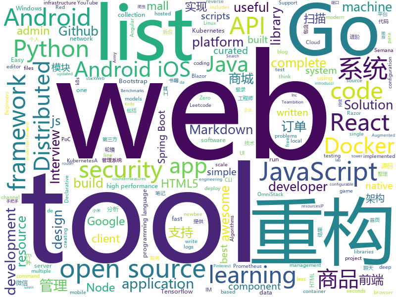

# 2020-01-18
See what the GitHub community is most excited about today.

## python
* [devops-exercises](https://github.com/bregman-arie/devops-exercises)(**234 stars today**): Linux, Jenkins, AWS, SRE, Prometheus, Docker, Python, Ansible, Git, Kubernetes, Terraform, OpenStack, SQL, NoSQL, Azure, GCP, DNS, Elastic, Network, Virtualization
* [reformer-pytorch](https://github.com/lucidrains/reformer-pytorch)(**31 stars today**): Reformer, the efficient Transformer, implemented in Pytorch
* [PySyft](https://github.com/OpenMined/PySyft)(**116 stars today**): A library for encrypted, privacy preserving machine learning
* [c9-python-getting-started](https://github.com/microsoft/c9-python-getting-started)(**16 stars today**): Sample code for Channel 9 Python for Beginners course
* [system-design-primer](https://github.com/donnemartin/system-design-primer)(**214 stars today**): Learn how to design large-scale systems. Prep for the system design interview. Includes Anki flashcards.
* [ddsp](https://github.com/magenta/ddsp)(**228 stars today**): DDSP: Differentiable Digital Signal Processing
* [chainoffools](https://github.com/kudelskisecurity/chainoffools)(**76 stars today**): A PoC for CVE-2020-0601
* [ludwig](https://github.com/uber/ludwig)(**25 stars today**): Ludwig is a toolbox built on top of TensorFlow that allows to train and test deep learning models without the need to write code.
* [you-get](https://github.com/soimort/you-get)(**39 stars today**): ⏬Dumb downloader that scrapes the web
* [vk_api](https://github.com/python273/vk_api)(**4 stars today**): vk_api – Python модуль для создания скриптов для социальной сети Вконтакте (vk.com API wrapper)
* [optuna](https://github.com/optuna/optuna)(**44 stars today**): A hyperparameter optimization framework
* [cable-haunt-vulnerability-test](https://github.com/Lyrebirds/cable-haunt-vulnerability-test)(**21 stars today**): 
* [Tacotron-2](https://github.com/Rayhane-mamah/Tacotron-2)(**4 stars today**): DeepMind's Tacotron-2 Tensorflow implementation
* [SqueezeWave](https://github.com/tianrengao/SqueezeWave)(**48 stars today**): 
* [public-apis](https://github.com/public-apis/public-apis)(**86 stars today**): A collective list of free APIs for use in software and web development.
* [PayloadsAllTheThings](https://github.com/swisskyrepo/PayloadsAllTheThings)(**27 stars today**): A list of useful payloads and bypass for Web Application Security and Pentest/CTF
* [awesome-honeypots](https://github.com/paralax/awesome-honeypots)(**8 stars today**): an awesome list of honeypot resources
* [LangNetworkTopology3](https://github.com/LangziFun/LangNetworkTopology3)(**23 stars today**): IP/IP段资产扫描-->扫描开放端口识别运行服务部署网站-->自动化整理扫描结果-->输出可视化报表+整理结果
* [wtfpython](https://github.com/satwikkansal/wtfpython)(**39 stars today**): If you think you know Python, think once more!
* [spotify-downloader](https://github.com/ritiek/spotify-downloader)(**9 stars today**): Download Spotify playlists from YouTube with albumart and meta-tags
* [Chatistics](https://github.com/MasterScrat/Chatistics)(**135 stars today**): 💬Python scripts to parse your Messenger, Hangouts, WhatsApp and Telegram chat logs into DataFrames.
* [redis-py](https://github.com/andymccurdy/redis-py)(**6 stars today**): Redis Python Client
* [aws-cloudformation-templates](https://github.com/awslabs/aws-cloudformation-templates)(**6 stars today**): A collection of useful CloudFormation templates
* [cascadia-code](https://github.com/microsoft/cascadia-code)(**88 stars today**): This is a fun, new monospaced font that includes programming ligatures and is designed to enhance the modern look and feel of the Windows Terminal.
* [tf-pose-estimation](https://github.com/ildoonet/tf-pose-estimation)(**4 stars today**): Deep Pose Estimation implemented using Tensorflow with Custom Architectures for fast inference.

## java
* [migration](https://github.com/phodal/migration)(**53 stars today**): 《系统重构与迁移指南》手把手教你分析、评估现有系统、制定重构策略、探索可行重构方案、搭建测试防护网、进行系统架构重构、服务架构重构、模块重构、代码重构、数据库重构、重构后的架构守护
* [spring-boot](https://github.com/spring-projects/spring-boot)(**47 stars today**): Spring Boot
* [JustAuth](https://github.com/justauth/JustAuth)(**61 stars today**): 💯史上最全的整合第三方登录的开源库。目前已支持Github、Gitee、微博、钉钉、百度、Coding、腾讯云开发者平台、OSChina、支付宝、QQ、微信、淘宝、Google、Facebook、抖音、领英、小米、微软、今日头条、Teambition、StackOverflow、Pinterest、人人、华为、企业微信、酷家乐、Gitlab、美团、饿了么和推特等第三方平台的授权登录。 Login, so easy!
* [onedev](https://github.com/theonedev/onedev)(**394 stars today**): Super Easy All-In-One DevOps Platform
* [FastHub](https://github.com/k0shk0sh/FastHub)(**11 stars today**): FastHub the ultimate GitHub client for Android.
* [Apktool](https://github.com/iBotPeaches/Apktool)(**12 stars today**): A tool for reverse engineering Android apk files
* [newbee-mall](https://github.com/newbee-ltd/newbee-mall)(**94 stars today**): newbee-mall 项目（新蜂商城）是一套电商系统，包括 newbee-mall 商城系统及 newbee-mall-admin 商城后台管理系统，基于 Spring Boot 2.X 及相关技术栈开发。 前台商城系统包含首页门户、商品分类、新品上线、首页轮播、商品推荐、商品搜索、商品展示、购物车、订单结算、订单流程、个人订单管理、会员中心、帮助中心等模块。 后台管理系统包含数据面板、轮播图管理、商品管理、订单管理、会员管理、分类管理、设置等模块。
* [Leoric](https://github.com/tiann/Leoric)(**62 stars today**): PoC of fighting against force-stop kill process on Android
* [retrofit](https://github.com/square/retrofit)(**18 stars today**): Type-safe HTTP client for Android and Java by Square, Inc.
* [HikariCP](https://github.com/brettwooldridge/HikariCP)(**17 stars today**): 光 HikariCP・A solid, high-performance, JDBC connection pool at last.
* [Java-Notes](https://github.com/leosanqing/Java-Notes)(**2 stars today**): java学习笔记，包括JVM，并发，JDK一些工具的源码，各种书籍，spring，hashMap实现源码分析，剑指offer题解。
* [Leetcode](https://github.com/fishercoder1534/Leetcode)(**6 stars today**): Complete solutions to Leetcode problems; updated daily. Subscribe to our YouTube channel for more.
* [libgdx](https://github.com/libgdx/libgdx)(**10 stars today**): Desktop/Android/HTML5/iOS Java game development framework
* [vertx-examples](https://github.com/vert-x3/vertx-examples)(**3 stars today**): Vert.x examples
* [android-interview-questions](https://github.com/MindorksOpenSource/android-interview-questions)(**5 stars today**): Your Cheat Sheet For Android Interview - Android Interview Questions
* [graal](https://github.com/oracle/graal)(**15 stars today**): GraalVM: Run Programs Faster Anywhere🚀
* [aurora-imui](https://github.com/jpush/aurora-imui)(**13 stars today**): General IM UI components. Android/iOS/RectNative ready. 通用 IM 聊天 UI 组件，已经同时支持 Android/iOS/RN。
* [react-native-navigation](https://github.com/wix/react-native-navigation)(**6 stars today**): A complete native navigation solution for React Native
* [Mindustry](https://github.com/Anuken/Mindustry)(**11 stars today**): A sandbox tower defense game
* [miaosha](https://github.com/qiurunze123/miaosha)(**28 stars today**): ⭐⭐⭐⭐秒杀系统设计与实现.互联网工程师进阶与分析🙋🐓
* [java-sec-code](https://github.com/JoyChou93/java-sec-code)(**11 stars today**): Java Web Common Vulnerabilities and Security Code.
* [greys-anatomy](https://github.com/oldmanpushcart/greys-anatomy)(**3 stars today**): Java诊断工具
* [incubator-pinot](https://github.com/apache/incubator-pinot)(**5 stars today**): Apache Pinot (Incubating) - A realtime distributed OLAP datastore
* [FrameworkBenchmarks](https://github.com/TechEmpower/FrameworkBenchmarks)(**6 stars today**): Source for the TechEmpower Framework Benchmarks project
* [elasticsearch](https://github.com/elastic/elasticsearch)(**29 stars today**): Open Source, Distributed, RESTful Search Engine

## unknown
* [JetBrainsMono](https://github.com/JetBrains/JetBrainsMono)(**428 stars today**): JetBrains Mono – the free and open-source typeface for developers
* [the-art-of-command-line](https://github.com/jlevy/the-art-of-command-line)(**155 stars today**): Master the command line, in one page
* [build-your-own-x](https://github.com/danistefanovic/build-your-own-x)(**140 stars today**): 🤓Build your own (insert technology here)
* [kubernetes-the-hard-way](https://github.com/kelseyhightower/kubernetes-the-hard-way)(**23 stars today**): Bootstrap Kubernetes the hard way on Google Cloud Platform. No scripts.
* [developer-roadmap](https://github.com/kamranahmedse/developer-roadmap)(**92 stars today**): Roadmap to becoming a web developer in 2020
* [Python-Books](https://github.com/manash-biswal/Python-Books)(**48 stars today**): 
* [go](https://github.com/datasciencemasters/go)(**11 stars today**): The Open Source Data Science Masters
* [the-book-of-secret-knowledge](https://github.com/trimstray/the-book-of-secret-knowledge)(**30 stars today**): A collection of inspiring lists, manuals, cheatsheets, blogs, hacks, one-liners, cli/web tools and more.
* [Z-Stack-firmware](https://github.com/Koenkk/Z-Stack-firmware)(**2 stars today**): Compilation instructions and hex files for Z-Stack firmwares
* [100-days-of-code-frontend](https://github.com/nas5w/100-days-of-code-frontend)(**75 stars today**): Curriculum for learning front-end development during #100DaysOfCode.
* [Awesome-Red-Teaming](https://github.com/yeyintminthuhtut/Awesome-Red-Teaming)(**18 stars today**): List of Awesome Red Teaming Resources
* [NiNiTechnology](https://github.com/pipirapira/NiNiTechnology)(**12 stars today**): ff14时间轴和触发器
* [awesome-windows-red-team](https://github.com/marcosValle/awesome-windows-red-team)(**12 stars today**): A curated list of awesome Windows frameworks, libraries, software and resources for Red Teams
* [Jenkinsdocs](https://github.com/zeyangli/Jenkinsdocs)(**5 stars today**): Jenkins实践文档 http://zeyangli.github.io
* [awesome-blazor](https://github.com/AdrienTorris/awesome-blazor)(**18 stars today**): Resources for Blazor, a .NET web framework using C#/Razor and HTML that runs in the browser with WebAssembly.
* [vagas](https://github.com/qa-brasil/vagas)(**5 stars today**): 🚀Espaço para divulgação de vagas para quality assurance
* [riscv-software-list](https://github.com/riscv/riscv-software-list)(**66 stars today**): The RISC-V software tools list, as seen on riscv.org
* [react-typescript-cheatsheet](https://github.com/typescript-cheatsheets/react-typescript-cheatsheet)(**21 stars today**): Cheatsheets for experienced React developers getting started with TypeScript
* [guide](https://github.com/uber-go/guide)(**13 stars today**): The Uber Go Style Guide.
* [book](https://github.com/KeKe-Li/book)(**14 stars today**): 📚All programming languages books
* [awesome-javascript-learning](https://github.com/micromata/awesome-javascript-learning)(**5 stars today**): A tiny list limited to the best JavaScript Learning Resources
* [API-Security-Checklist](https://github.com/shieldfy/API-Security-Checklist)(**9 stars today**): Checklist of the most important security countermeasures when designing, testing, and releasing your API
* [javascript-interview-questions](https://github.com/sudheerj/javascript-interview-questions)(**6 stars today**): List of 1000 JavaScript Interview Questions
* [awesome-mobile-security](https://github.com/vaib25vicky/awesome-mobile-security)(**19 stars today**): An effort to build a single place for all useful android and iOS security related stuff. All references and tools are belong to their respective owners. I'm just maintaining it.
* [blog](https://github.com/brickspert/blog)(**19 stars today**): 个人技术博客，博文写在 Issues 里。

## javascript
* [hacker-scripts](https://github.com/NARKOZ/hacker-scripts)(**124 stars today**): Based on a true story
* [v3](https://github.com/exercism/v3)(**4 stars today**): The work-in-progress project for developing v3 tracks
* [gatsby](https://github.com/gatsbyjs/gatsby)(**40 stars today**): Build blazing fast, modern apps and websites with React
* [devradar](https://github.com/filipedeschamps/devradar)(**21 stars today**): Projeto resultado da Semana Omnistack #10
* [alpine](https://github.com/alpinejs/alpine)(**104 stars today**): A rugged, minimal framework for composing JavaScript behavior in your markup.
* [homebridge](https://github.com/nfarina/homebridge)(**11 stars today**): HomeKit support for the impatient
* [cytoscape.js](https://github.com/cytoscape/cytoscape.js)(**8 stars today**): Graph theory (network) library for visualisation and analysis
* [Web](https://github.com/qianguyihao/Web)(**30 stars today**): 前端入门和进阶学习笔记，超详细的Web前端学习图文教程。从零开始学前端，做一名精致的前端工程师。持续更新...
* [Recorder](https://github.com/xiangyuecn/Recorder)(**17 stars today**): html5 js 录音 mp3 wav ogg webm amr 格式，支持pc和Android、ios部分浏览器、和Hybrid App（提供Android IOS App源码），微信也是支持的，提供H5版语音通话聊天示例
* [generator-jhipster](https://github.com/jhipster/generator-jhipster)(**15 stars today**): Open Source application platform for creating Spring Boot + Angular/React projects in seconds!
* [react-router](https://github.com/ReactTraining/react-router)(**20 stars today**): Declarative routing for React
* [G2](https://github.com/antvis/G2)(**7 stars today**): 📊The Grammar of Graphics in JavaScript
* [marktext](https://github.com/marktext/marktext)(**22 stars today**): 📝A simple and elegant markdown editor, available for Linux, macOS and Windows.
* [react-native-swiper](https://github.com/leecade/react-native-swiper)(**5 stars today**): The best Swiper component for React Native.
* [node](https://github.com/nodejs/node)(**46 stars today**): Node.js JavaScript runtime✨🐢🚀✨
* [waka-box](https://github.com/matchai/waka-box)(**6 stars today**): 📊Update a pinned gist to contain your weekly WakaTime stats
* [CyberChef](https://github.com/gchq/CyberChef)(**5 stars today**): The Cyber Swiss Army Knife - a web app for encryption, encoding, compression and data analysis
* [simplemde-markdown-editor](https://github.com/sparksuite/simplemde-markdown-editor)(**4 stars today**): A simple, beautiful, and embeddable JavaScript Markdown editor. Delightful editing for beginners and experts alike. Features built-in autosaving and spell checking.
* [pwa-studio](https://github.com/magento/pwa-studio)(**2 stars today**): 🛠Development tools to build, optimize and deploy Progressive Web Applications for Magento 2.
* [text-mask](https://github.com/text-mask/text-mask)(**9 stars today**): Input mask for React, Angular, Ember, Vue, & plain JavaScript
* [devconnector_2.0](https://github.com/bradtraversy/devconnector_2.0)(**3 stars today**): Social network for developers, built on the MERN stack
* [OmniDB](https://github.com/OmniDB/OmniDB)(**4 stars today**): Web tool for database management
* [icons](https://github.com/twbs/icons)(**4 stars today**): Official open source SVG icon library for Bootstrap.
* [semana-omnistack-9](https://github.com/Rocketseat/semana-omnistack-9)(**7 stars today**): Código do projeto produzido durante a Semana OmniStack 9.0
* [json-server](https://github.com/typicode/json-server)(**27 stars today**): Get a full fake REST API with zero coding in less than 30 seconds (seriously)

## html
* [magicCss](https://github.com/chokcoco/magicCss)(**134 stars today**): CSS3奇思妙想，单标签实现各类图形
* [r-basic](https://github.com/joanby/r-basic)(**1 stars today**): Curso de introducción a la estadística descriptiva con R Studio
* [complete-web-developer-manual](https://github.com/zero-to-mastery/complete-web-developer-manual)(**2 stars today**): All resources and notes from the Complete Web Developer in 2018: Zero to Mastery course
* [mxgraph](https://github.com/jgraph/mxgraph)(**7 stars today**): mxGraph is a fully client side JavaScript diagramming library
* [speedtest](https://github.com/librespeed/speedtest)(**10 stars today**): Self-hosted Speedtest for HTML5 and more. Easy setup, examples, configurable, mobile friendly. Supports PHP, Node, Multiple servers, and more
* [AR.js](https://github.com/jeromeetienne/AR.js)(**4 stars today**): Efficient Augmented Reality for the Web - 60fps on mobile!
* [MatBlazor](https://github.com/SamProf/MatBlazor)(**7 stars today**): Material Design components for Blazor and Razor Components
* [zenbot](https://github.com/DeviaVir/zenbot)(**2 stars today**): Zenbot is a command-line cryptocurrency trading bot using Node.js and MongoDB.
* [antispider](https://github.com/asyncins/antispider)(**5 stars today**): 书籍《Python3 反爬虫原理与绕过实战》配套代码
* [home-assistant.io](https://github.com/home-assistant/home-assistant.io)(**4 stars today**): 📘Home Assistant User documentation
* [qiubaiying.github.io](https://github.com/qiubaiying/qiubaiying.github.io)(**6 stars today**): BY Blog ->
* [learning-area](https://github.com/mdn/learning-area)(**2 stars today**): Github repo for the MDN Learning Area.
* [tiny-helpers](https://github.com/stefanjudis/tiny-helpers)(**24 stars today**): A collection of useful online web development tools
* [frida-all-in-one](https://github.com/hookmaster/frida-all-in-one)(**8 stars today**): 《FRIDA操作手册》by @hluwa @r0ysue
* [JavaScript30](https://github.com/wesbos/JavaScript30)(**10 stars today**): 30 Day Vanilla JS Challenge
* [machine-learning-systems-design](https://github.com/chiphuyen/machine-learning-systems-design)(**10 stars today**): A booklet on machine learning systems design with exercises
* [django-DefectDojo](https://github.com/DefectDojo/django-DefectDojo)(**2 stars today**): DefectDojo is an open-source application vulnerability correlation and security orchestration tool.
* [subspace](https://github.com/subspacecloud/subspace)(**1 stars today**): A simple WireGuard VPN server GUI
* [awesome-webpack](https://github.com/webpack-contrib/awesome-webpack)(**2 stars today**): A curated list of awesome Webpack resources, libraries and tools
* [turndown](https://github.com/domchristie/turndown)(**4 stars today**): 🛏An HTML to Markdown converter written in JavaScript
* [gentelella](https://github.com/ColorlibHQ/gentelella)(**10 stars today**): Free Bootstrap 4 Admin Dashboard Template
* [DetectionLab](https://github.com/clong/DetectionLab)(**4 stars today**): Vagrant & Packer scripts to build a lab environment complete with security tooling and logging best practices
* [CLRS](https://github.com/walkccc/CLRS)(**2 stars today**): 📚Solutions to Introduction to Algorithms Third Edition
* [web-advertising](https://github.com/w3c/web-advertising)(**3 stars today**): Web Advertising BG
* [Markdown-Resume](https://github.com/CyC2018/Markdown-Resume)(**2 stars today**): ⭐️Markdown 简历模版

## go
* [neko](https://github.com/nurdism/neko)(**92 stars today**): A self hosted virtual browser (rabb.it clone) that runs in docker.
* [crawlab](https://github.com/crawlab-team/crawlab)(**20 stars today**): Distributed web crawler admin platform for spiders management regardless of languages and frameworks.
* [cortex](https://github.com/cortexlabs/cortex)(**90 stars today**): Deploy machine learning models in production
* [terratest](https://github.com/gruntwork-io/terratest)(**10 stars today**): Terratest is a Go library that makes it easier to write automated tests for your infrastructure code.
* [pipeline](https://github.com/tektoncd/pipeline)(**13 stars today**): A K8s-native Pipeline resource.
* [charts](https://github.com/helm/charts)(**25 stars today**): Curated applications for Kubernetes
* [frp](https://github.com/fatedier/frp)(**68 stars today**): A fast reverse proxy to help you expose a local server behind a NAT or firewall to the internet.
* [webrtc](https://github.com/pion/webrtc)(**26 stars today**): Pure Go implementation of the WebRTC API
* [kind](https://github.com/kubernetes-sigs/kind)(**15 stars today**): Kubernetes IN Docker - local clusters for testing Kubernetes
* [clash](https://github.com/Dreamacro/clash)(**31 stars today**): A rule-based tunnel in Go.
* [k3s](https://github.com/rancher/k3s)(**15 stars today**): Lightweight Kubernetes. 5 less than k8s.
* [etcd](https://github.com/etcd-io/etcd)(**24 stars today**): Distributed reliable key-value store for the most critical data of a distributed system
* [loki](https://github.com/grafana/loki)(**15 stars today**): Like Prometheus, but for logs.
* [LeetCode-in-Go](https://github.com/aQuaYi/LeetCode-in-Go)(**6 stars today**): Go Solution for LeetCode algorithms problems, 100% coverage.
* [runc](https://github.com/opencontainers/runc)(**5 stars today**): CLI tool for spawning and running containers according to the OCI specification
* [rancher](https://github.com/rancher/rancher)(**14 stars today**): Complete container management platform
* [cli](https://github.com/docker/cli)(**4 stars today**): The Docker CLI
* [beego](https://github.com/astaxie/beego)(**20 stars today**): beego is an open-source, high-performance web framework for the Go programming language.
* [dive](https://github.com/wagoodman/dive)(**19 stars today**): A tool for exploring each layer in a docker image
* [terraform](https://github.com/hashicorp/terraform)(**19 stars today**): Terraform enables you to safely and predictably create, change, and improve infrastructure. It is an open source tool that codifies APIs into declarative configuration files that can be shared amongst team members, treated as code, edited, reviewed, and versioned.
* [httprouter](https://github.com/julienschmidt/httprouter)(**9 stars today**): A high performance HTTP request router that scales well
* [packer](https://github.com/hashicorp/packer)(**11 stars today**): Packer is a tool for creating identical machine images for multiple platforms from a single source configuration.
* [golang-samples](https://github.com/GoogleCloudPlatform/golang-samples)(**3 stars today**): Sample apps and code written for Google Cloud in the Go programming language.
* [yay](https://github.com/Jguer/yay)(**11 stars today**): Yet another Yogurt - An AUR Helper written in Go
* [opentracing-go](https://github.com/opentracing/opentracing-go)(**3 stars today**): OpenTracing API for Go

## WordCloud

