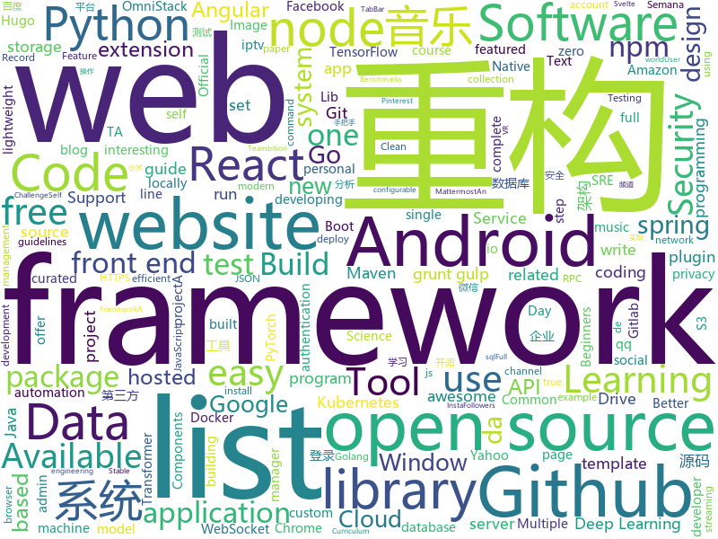

# 2020-01-19
See what the GitHub community is most excited about today.

## python
* [devops-exercises](https://github.com/bregman-arie/devops-exercises)(**377 stars today**): Linux, Jenkins, AWS, SRE, Prometheus, Docker, Python, Ansible, Git, Kubernetes, Terraform, OpenStack, SQL, NoSQL, Azure, GCP, DNS, Elastic, Network, Virtualization
* [reformer-pytorch](https://github.com/lucidrains/reformer-pytorch)(**46 stars today**): Reformer, the efficient Transformer, implemented in Pytorch
* [c9-python-getting-started](https://github.com/microsoft/c9-python-getting-started)(**25 stars today**): Sample code for Channel 9 Python for Beginners course
* [AlgorithmsByPython](https://github.com/Jack-Lee-Hiter/AlgorithmsByPython)(**7 stars today**): 算法/数据结构/Python/剑指offer/机器学习/leetcode
* [zhao](https://github.com/programthink/zhao)(**18 stars today**): 【编程随想】整理的《太子党关系网络》，专门揭露赵国的权贵
* [autokeras](https://github.com/keras-team/autokeras)(**27 stars today**): An AutoML system based on Keras
* [public-apis](https://github.com/public-apis/public-apis)(**106 stars today**): A collective list of free APIs for use in software and web development.
* [ActionAI](https://github.com/smellslikeml/ActionAI)(**6 stars today**): custom human activity recognition modules by pose estimation and cascaded inference using sklearn API
* [home-assistant](https://github.com/home-assistant/home-assistant)(**55 stars today**): 🏡Open source home automation that puts local control and privacy first
* [CppCoreGuidelines](https://github.com/isocpp/CppCoreGuidelines)(**31 stars today**): The C++ Core Guidelines are a set of tried-and-true guidelines, rules, and best practices about coding in C++
* [ta-lib](https://github.com/mrjbq7/ta-lib)(**6 stars today**): Python wrapper for TA-Lib (http://ta-lib.org/).
* [pytorch-toolbelt](https://github.com/BloodAxe/pytorch-toolbelt)(**76 stars today**): PyTorch extensions for fast R&D prototyping and Kaggle farming
* [PySyft](https://github.com/OpenMined/PySyft)(**129 stars today**): A library for encrypted, privacy preserving machine learning
* [100-Days-Of-ML-Code](https://github.com/Avik-Jain/100-Days-Of-ML-Code)(**20 stars today**): 100 Days of ML Coding
* [bokeh](https://github.com/bokeh/bokeh)(**13 stars today**): Interactive Data Visualization in the browser, from Python
* [django-allauth](https://github.com/pennersr/django-allauth)(**11 stars today**): Integrated set of Django applications addressing authentication, registration, account management as well as 3rd party (social) account authentication.
* [text-to-text-transfer-transformer](https://github.com/google-research/text-to-text-transfer-transformer)(**44 stars today**): Code for the paper "Exploring the Limits of Transfer Learning with a Unified Text-to-Text Transformer"
* [cascadia-code](https://github.com/microsoft/cascadia-code)(**147 stars today**): This is a fun, new monospaced font that includes programming ligatures and is designed to enhance the modern look and feel of the Windows Terminal.
* [django](https://github.com/django/django)(**65 stars today**): The Web framework for perfectionists with deadlines.
* [SinGAN](https://github.com/tamarott/SinGAN)(**6 stars today**): Official pytorch implementation of the paper: "SinGAN: Learning a Generative Model from a Single Natural Image"
* [scipy](https://github.com/scipy/scipy)(**14 stars today**): Scipy library main repository
* [ludwig](https://github.com/uber/ludwig)(**30 stars today**): Ludwig is a toolbox built on top of TensorFlow that allows to train and test deep learning models without the need to write code.
* [yfinance](https://github.com/ranaroussi/yfinance)(**11 stars today**): Yahoo! Finance market data downloader (+faster Pandas Datareader)
* [stylegan](https://github.com/NVlabs/stylegan)(**18 stars today**): StyleGAN - Official TensorFlow Implementation
* [tensortrade](https://github.com/tensortrade-org/tensortrade)(**9 stars today**): An open source reinforcement learning framework for training, evaluating, and deploying robust trading agents.

## java
* [onedev](https://github.com/theonedev/onedev)(**830 stars today**): Super Easy All-In-One DevOps Platform
* [migration](https://github.com/phodal/migration)(**84 stars today**): 《系统重构与迁移指南》手把手教你分析、评估现有系统、制定重构策略、探索可行重构方案、搭建测试防护网、进行系统架构重构、服务架构重构、模块重构、代码重构、数据库重构、重构后的架构守护
* [NewPipe](https://github.com/TeamNewPipe/NewPipe)(**12 stars today**): A libre lightweight streaming front-end for Android.
* [ghidra](https://github.com/NationalSecurityAgency/ghidra)(**22 stars today**): Ghidra is a software reverse engineering (SRE) framework
* [OpenCode20-Collaborative-TheApp](https://github.com/opencodeiiita/OpenCode20-Collaborative-TheApp)(**29 stars today**): This is a one stop collaborative android App for OpenCode'20 for all data related to the contest.
* [Java-Notes](https://github.com/leosanqing/Java-Notes)(**9 stars today**): java学习笔记，包括JVM，并发，JDK一些工具的源码，各种书籍，spring，hashMap实现源码分析，剑指offer题解。
* [FrameworkBenchmarks](https://github.com/TechEmpower/FrameworkBenchmarks)(**11 stars today**): Source for the TechEmpower Framework Benchmarks project
* [webmagic](https://github.com/code4craft/webmagic)(**9 stars today**): A scalable web crawler framework for Java.
* [anyline](https://github.com/anylineorg/anyline)(**6 stars today**): AnyLine 是一个针对http/rpc环境的，基于spring-jdbc的，快捷数据库操作工具。
* [bigbluebutton](https://github.com/bigbluebutton/bigbluebutton)(**5 stars today**): Complete open source web conferencing system.
* [djl](https://github.com/awslabs/djl)(**36 stars today**): An Engine-Agnostic Deep Learning Framework
* [android-signaturepad](https://github.com/gcacace/android-signaturepad)(**6 stars today**): A custom Android View for drawing smooth signatures
* [MusicLake](https://github.com/caiyonglong/MusicLake)(**4 stars today**): 音乐播放器，可播在线音乐，qq音乐，百度音乐，虾米音乐，网易云音乐，YouTuBe
* [buckpal](https://github.com/thombergs/buckpal)(**6 stars today**): An example approach for implementing a Clean/Hexagonal Architecture
* [javaweb](https://github.com/dunwu/javaweb)(**2 stars today**): ☕️JavaWeb 开发之路经验总结
* [AppUpdate](https://github.com/WVector/AppUpdate)(**6 stars today**): 🚀Android 版本更新🚀a library for android version update🚀
* [SpringBootLearning](https://github.com/forezp/SpringBootLearning)(**4 stars today**): 《Spring Boot教程》源码
* [MusicBot](https://github.com/jagrosh/MusicBot)(**4 stars today**): 🎶A Discord music bot that's easy to set up and run yourself!
* [JustAuth](https://github.com/justauth/JustAuth)(**81 stars today**): 💯史上最全的整合第三方登录的开源库。目前已支持Github、Gitee、微博、钉钉、百度、Coding、腾讯云开发者平台、OSChina、支付宝、QQ、微信、淘宝、Google、Facebook、抖音、领英、小米、微软、今日头条、Teambition、StackOverflow、Pinterest、人人、华为、企业微信、酷家乐、Gitlab、美团、饿了么和推特等第三方平台的授权登录。 Login, so easy!
* [jd-gui](https://github.com/java-decompiler/jd-gui)(**13 stars today**): A standalone Java Decompiler GUI
* [AntennaPod](https://github.com/AntennaPod/AntennaPod)(**2 stars today**): A podcast manager for Android
* [java-sec-code](https://github.com/JoyChou93/java-sec-code)(**14 stars today**): Java Web Common Vulnerabilities and Security Code.
* [mit-deep-learning-book-pdf](https://github.com/janishar/mit-deep-learning-book-pdf)(**12 stars today**): MIT Deep Learning Book in PDF format (complete and parts) by Ian Goodfellow, Yoshua Bengio and Aaron Courville
* [spring-boot](https://github.com/spring-projects/spring-boot)(**68 stars today**): Spring Boot
* [frontend-maven-plugin](https://github.com/eirslett/frontend-maven-plugin)(**4 stars today**): "Maven-node-grunt-gulp-npm-node-plugin to end all maven-node-grunt-gulp-npm-plugins." A Maven plugin that downloads/installs Node and NPM locally, runs NPM install, Grunt, Gulp and/or Karma.

## unknown
* [SoftwareArchitect](https://github.com/justinamiller/SoftwareArchitect)(**508 stars today**): Become a Better Software Architect
* [actix-web](https://github.com/actix/actix-web)(**164 stars today**): Actix project postmortem
* [the-art-of-command-line](https://github.com/jlevy/the-art-of-command-line)(**200 stars today**): Master the command line, in one page
* [my_iptv](https://github.com/addlew/my_iptv)(**5 stars today**): 我自己搜集整理的iptv频道
* [build-your-own-x](https://github.com/danistefanovic/build-your-own-x)(**201 stars today**): 🤓Build your own (insert technology here)
* [expo-common-issues](https://github.com/Rocketseat/expo-common-issues)(**99 stars today**): Common issues while developing with Expo
* [computer-science](https://github.com/ossu/computer-science)(**81 stars today**): 🎓Path to a free self-taught education in Computer Science!
* [awesome-mobile-security](https://github.com/vaib25vicky/awesome-mobile-security)(**27 stars today**): An effort to build a single place for all useful android and iOS security related stuff. All references and tools are belong to their respective owners. I'm just maintaining it.
* [awesome-shodan-queries](https://github.com/jakejarvis/awesome-shodan-queries)(**7 stars today**): 🔍A collection of interesting, funny, and depressing search queries to plug into https://shodan.io/👩‍💻
* [zero-trust-architecture](https://github.com/ukncsc/zero-trust-architecture)(**261 stars today**): Principles to help you design and deploy a zero trust architecture
* [letter](https://github.com/actix-support/letter)(**142 stars today**): 
* [JetBrainsMono](https://github.com/JetBrains/JetBrainsMono)(**968 stars today**): JetBrains Mono – the free and open-source typeface for developers
* [RPISEC-Courses](https://github.com/JeremyBlackthorne/RPISEC-Courses)(**38 stars today**): 
* [tensorflow-windows-wheel](https://github.com/fo40225/tensorflow-windows-wheel)(**9 stars today**): Tensorflow prebuilt binary for Windows
* [awesome](https://github.com/sindresorhus/awesome)(**173 stars today**): 😎Awesome lists about all kinds of interesting topics
* [developer-roadmap](https://github.com/kamranahmedse/developer-roadmap)(**119 stars today**): Roadmap to becoming a web developer in 2020
* [awesome-bug-bounty](https://github.com/djadmin/awesome-bug-bounty)(**6 stars today**): A comprehensive curated list of available Bug Bounty & Disclosure Programs and Write-ups.
* [awesome-nodejs](https://github.com/sindresorhus/awesome-nodejs)(**32 stars today**): ⚡️Delightful Node.js packages and resources
* [reverse-interview](https://github.com/viraptor/reverse-interview)(**11 stars today**): Questions to ask the company during your interview
* [Learn_Data_Science_in_3_Months](https://github.com/llSourcell/Learn_Data_Science_in_3_Months)(**5 stars today**): This is the Curriculum for "Learn Data Science in 3 Months" By Siraj Raval on Youtube
* [blackhat-arsenal-tools](https://github.com/toolswatch/blackhat-arsenal-tools)(**3 stars today**): Official Black Hat Arsenal Security Tools Repository
* [awesome-design-systems](https://github.com/alexpate/awesome-design-systems)(**7 stars today**): 💅🏻⚒A collection of awesome design systems
* [100-days-of-code-frontend](https://github.com/nas5w/100-days-of-code-frontend)(**84 stars today**): Curriculum for learning front-end development during #100DaysOfCode.
* [datasharing](https://github.com/jtleek/datasharing)(**2 stars today**): The Leek group guide to data sharing
* [Python-programming-exercises](https://github.com/zhiwehu/Python-programming-exercises)(**43 stars today**): 100+ Python challenging programming exercises

## javascript
* [clean-code-javascript](https://github.com/ryanmcdermott/clean-code-javascript)(**702 stars today**): 🛁Clean Code concepts adapted for JavaScript
* [hacker-scripts](https://github.com/NARKOZ/hacker-scripts)(**192 stars today**): Based on a true story
* [esqlate](https://github.com/forbesmyester/esqlate)(**928 stars today**): Build minimum viable admin panels quickly with just SQL
* [fetch](https://github.com/github/fetch)(**14 stars today**): A window.fetch JavaScript polyfill.
* [OmniStack-10.0](https://github.com/fl4m3x/OmniStack-10.0)(**36 stars today**): Repositório da Semana OmniStack - 10.0 da RocketSeat!
* [cli](https://github.com/npm/cli)(**7 stars today**): the package manager for JavaScript
* [Opencode-Collaborative-20](https://github.com/opencodeiiita/Opencode-Collaborative-20)(**6 stars today**): Opencode20 Collabrative website!
* [udemy-downloader-gui](https://github.com/FaisalUmair/udemy-downloader-gui)(**15 stars today**): A desktop application for downloading Udemy Courses
* [QuantumultX](https://github.com/nzw9314/QuantumultX)(**4 stars today**): QuantumultX
* [awesome-selfhosted](https://github.com/awesome-selfhosted/awesome-selfhosted)(**43 stars today**): A list of Free Software network services and web applications which can be hosted locally. Selfhosting is the process of hosting and managing applications instead of renting from Software-as-a-Service providers
* [iptv](https://github.com/iptv-org/iptv)(**71 stars today**): Collection of 8000+ publicly available IPTV channels from all over the world
* [nuclear](https://github.com/nukeop/nuclear)(**76 stars today**): User freedom-oriented streaming music player - welcoming to new contributors
* [UnblockNeteaseMusic](https://github.com/nondanee/UnblockNeteaseMusic)(**39 stars today**): Revive unavailable songs for Netease Cloud Music
* [markdown-here](https://github.com/adam-p/markdown-here)(**54 stars today**): Google Chrome, Firefox, and Thunderbird extension that lets you write email in Markdown and render it before sending.
* [v3](https://github.com/exercism/v3)(**6 stars today**): The work-in-progress project for developing v3 tracks
* [Crash-Course-Computer-Science-Chinese](https://github.com/1c7/Crash-Course-Computer-Science-Chinese)(**76 stars today**): 💻计算机速成课 | Crash Course 字幕组 (全40集 2018-5-1 精校完成)
* [WatermelonDB](https://github.com/Nozbe/WatermelonDB)(**5 stars today**): 🍉Reactive & asynchronous database for powerful React and React Native apps⚡️
* [devradar](https://github.com/filipedeschamps/devradar)(**44 stars today**): Projeto resultado da Semana Omnistack #10
* [react-native-vector-icons](https://github.com/oblador/react-native-vector-icons)(**14 stars today**): Customizable Icons for React Native with support for NavBar/TabBar/ToolbarAndroid, image source and full styling.
* [academicpages.github.io](https://github.com/academicpages/academicpages.github.io)(**11 stars today**): Github Pages template for academic personal websites, forked from mmistakes/minimal-mistakes
* [react-360](https://github.com/facebook/react-360)(**7 stars today**): Create amazing 360 and VR content using React
* [Front-End-Checklist](https://github.com/thedaviddias/Front-End-Checklist)(**21 stars today**): 🗂The perfect Front-End Checklist for modern websites and meticulous developers
* [particles.js](https://github.com/VincentGarreau/particles.js)(**19 stars today**): A lightweight JavaScript library for creating particles
* [json-server](https://github.com/typicode/json-server)(**46 stars today**): Get a full fake REST API with zero coding in less than 30 seconds (seriously)
* [selenium-ide](https://github.com/SeleniumHQ/selenium-ide)(**3 stars today**): Open Source record and playback test automation for the web.

## html
* [kubelabs](https://github.com/collabnix/kubelabs)(**10 stars today**): Kubernetes - Beginners | Intermediate | Advanced
* [libook](https://github.com/opencodeiiita/libook)(****): A personal digital library
* [homepage](https://github.com/omegasisters/homepage)(**115 stars today**): おめシスのホームページを作りたい
* [dashboards](https://github.com/keen/dashboards)(**2 stars today**): Responsive dashboard templates📊✨
* [awesome-competitive-programming](https://github.com/lnishan/awesome-competitive-programming)(**14 stars today**): 💎A curated list of awesome Competitive Programming, Algorithm and Data Structure resources
* [hyperblog](https://github.com/freddier/hyperblog)(**11 stars today**): Un blog increíble para el curso de Git y Github de Platzi
* [json-viewer](https://github.com/tulios/json-viewer)(**6 stars today**): It is a Chrome extension for printing JSON and JSONP.
* [books](https://github.com/Thinkgamer/books)(**7 stars today**): 技术资料分享
* [minimus](https://github.com/hamedbaatour/minimus)(**4 stars today**): A fully featured production ready Angular 8 weather app tutorial project
* [intro.js](https://github.com/usablica/intro.js)(**6 stars today**): A better way for new feature introduction and step-by-step users guide for your website and project.
* [learning-area](https://github.com/mdn/learning-area)(**7 stars today**): Github repo for the MDN Learning Area.
* [smelte](https://github.com/matyunya/smelte)(**5 stars today**): UI framework with material components built with Svelte and Tailwind CSS
* [HiddenEye](https://github.com/DarkSecDevelopers/HiddenEye)(**7 stars today**): Modern Phishing Tool With Advanced Functionality And Multiple Tunnelling Services [ Android-Support-Available ]
* [hugo-academic](https://github.com/gcushen/hugo-academic)(**8 stars today**): 📝The website builder for Hugo. Build and deploy a beautiful website in minutes!
* [hugo-coder](https://github.com/luizdepra/hugo-coder)(**7 stars today**): A minimalist blog theme for hugo.
* [JavaScript30](https://github.com/wesbos/JavaScript30)(**19 stars today**): 30 Day Vanilla JS Challenge
* [speedtest](https://github.com/librespeed/speedtest)(**15 stars today**): Self-hosted Speedtest for HTML5 and more. Easy setup, examples, configurable, mobile friendly. Supports PHP, Node, Multiple servers, and more
* [Front-end-Developer-Interview-Questions](https://github.com/h5bp/Front-end-Developer-Interview-Questions)(**21 stars today**): A list of helpful front-end related questions you can use to interview potential candidates, test yourself or completely ignore.
* [keep-a-changelog](https://github.com/olivierlacan/keep-a-changelog)(**8 stars today**): If you build software, keep a changelog.
* [zfaka](https://github.com/zlkbdotnet/zfaka)(**5 stars today**): 免费、安全、稳定、高效的发卡系统，值得拥有!
* [coreui-free-angular-admin-template](https://github.com/coreui/coreui-free-angular-admin-template)(**1 stars today**): CoreUI Angular is free Angular 2+ admin template based on Bootstrap 4
* [shellphish](https://github.com/thelinuxchoice/shellphish)(**4 stars today**): Phishing Tool for 18 social media: Instagram, Facebook, Snapchat, Github, Twitter, Yahoo, Protonmail, Spotify, Netflix, Linkedin, Wordpress, Origin, Steam, Microsoft, InstaFollowers, Gitlab, Pinterest
* [material-design-lite](https://github.com/google/material-design-lite)(**3 stars today**): Material Design Components in HTML/CSS/JS
* [EIPs](https://github.com/ethereum/EIPs)(**4 stars today**): The Ethereum Improvement Proposal repository
* [es6-features](https://github.com/rse/es6-features)(**1 stars today**): ECMAScript 6: Feature Overview & Comparison

## go
* [neko](https://github.com/nurdism/neko)(**244 stars today**): A self hosted virtual browser (rabb.it clone) that runs in docker.
* [rclone](https://github.com/rclone/rclone)(**46 stars today**): "rsync for cloud storage" - Google Drive, Amazon Drive, S3, Dropbox, Backblaze B2, One Drive, Swift, Hubic, Cloudfiles, Google Cloud Storage, Yandex Files
* [hugo](https://github.com/gohugoio/hugo)(**58 stars today**): The world’s fastest framework for building websites.
* [syncthing](https://github.com/syncthing/syncthing)(**44 stars today**): Open Source Continuous File Synchronization
* [rita](https://github.com/activecm/rita)(**16 stars today**): Real Intelligence Threat Analytics
* [flagger](https://github.com/weaveworks/flagger)(**14 stars today**): Progressive delivery Kubernetes operator (Canary, A/B Testing and Blue/Green deployments)
* [fsm](https://github.com/looplab/fsm)(**5 stars today**): Finite State Machine for Go
* [gojsonq](https://github.com/thedevsaddam/gojsonq)(**51 stars today**): A simple Go package to Query over JSON/YAML/XML/CSV Data
* [HFish](https://github.com/hacklcx/HFish)(**15 stars today**): Extend the enterprise security test open source honeypot system , Record hacker attacks. 扩展企业安全测试主动诱导型开源蜜罐框架系统，记录黑客攻击手段
* [ultimate-go](https://github.com/hoanhan101/ultimate-go)(**21 stars today**): Ultimate Go study guide, with heavily documented code and programs analysis, all in 1 place
* [orchestrator](https://github.com/github/orchestrator)(**5 stars today**): MySQL replication topology management and HA
* [kcptun](https://github.com/xtaci/kcptun)(**6 stars today**): A Stable & Secure Tunnel based on KCP with N:M multiplexing and FEC. Available for ARM, MIPS, 386 and AMD64
* [hub](https://github.com/github/hub)(**22 stars today**): A command-line tool that makes git easier to use with GitHub.
* [websocketd](https://github.com/joewalnes/websocketd)(**5 stars today**): Turn any program that uses STDIN/STDOUT into a WebSocket server. Like inetd, but for WebSockets.
* [ginkgo](https://github.com/onsi/ginkgo)(**8 stars today**): BDD Testing Framework for Go
* [mattermost-server](https://github.com/mattermost/mattermost-server)(**23 stars today**): Open source Slack-alternative in Golang and React - Mattermost
* [erpc](https://github.com/henrylee2cn/erpc)(**2 stars today**): An efficient, extensible and easy-to-use RPC framework.
* [gorm](https://github.com/jinzhu/gorm)(**14 stars today**): The fantastic ORM library for Golang, aims to be developer friendly
* [miniflux](https://github.com/miniflux/miniflux)(**9 stars today**): Minimalist and opinionated feed reader
* [go-github](https://github.com/google/go-github)(**7 stars today**): Go library for accessing the GitHub API
* [httprobe](https://github.com/tomnomnom/httprobe)(**8 stars today**): Take a list of domains and probe for working HTTP and HTTPS servers
* [chi](https://github.com/go-chi/chi)(**21 stars today**): lightweight, idiomatic and composable router for building Go HTTP services
* [minio](https://github.com/minio/minio)(**44 stars today**): MinIO is a high performance object storage server compatible with Amazon S3 APIs
* [sqlmw](https://github.com/ngrok/sqlmw)(**76 stars today**): Interceptors for database/sql
* [torrent](https://github.com/anacrolix/torrent)(**7 stars today**): Full-featured BitTorrent client package and utilities

## WordCloud

