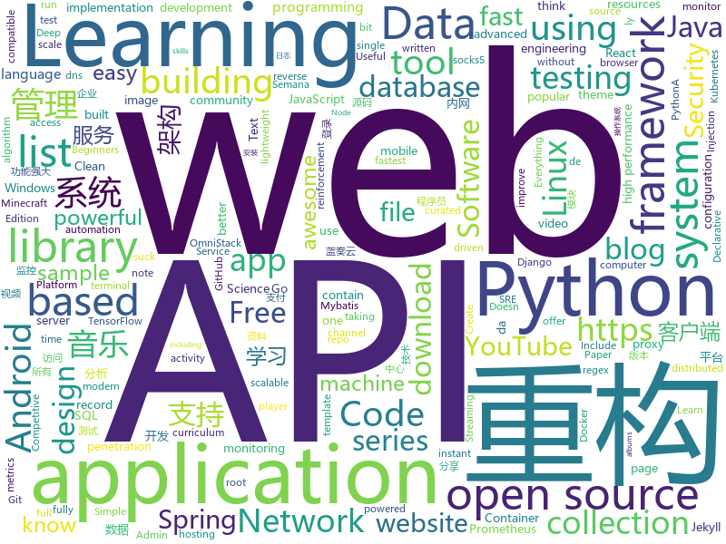

# 2020-01-20
See what the GitHub community is most excited about today.

## python
* [lanzou-gui](https://github.com/rachpt/lanzou-gui)(**43 stars today**): 蓝奏云 | 蓝奏云客户端 | 蓝奏网盘 GUI版本
* [system-design-primer](https://github.com/donnemartin/system-design-primer)(**185 stars today**): Learn how to design large-scale systems. Prep for the system design interview. Includes Anki flashcards.
* [devops-exercises](https://github.com/bregman-arie/devops-exercises)(**699 stars today**): Linux, Jenkins, AWS, SRE, Prometheus, Docker, Python, Ansible, Git, Kubernetes, Terraform, OpenStack, SQL, NoSQL, Azure, GCP, DNS, Elastic, Network, Virtualization
* [tensortrade](https://github.com/tensortrade-org/tensortrade)(**12 stars today**): An open source reinforcement learning framework for training, evaluating, and deploying robust trading agents.
* [c9-python-getting-started](https://github.com/microsoft/c9-python-getting-started)(**62 stars today**): Sample code for Channel 9 Python for Beginners course
* [mlcourse.ai](https://github.com/Yorko/mlcourse.ai)(**4 stars today**): Open Machine Learning Course
* [pihole-regex](https://github.com/mmotti/pihole-regex)(**5 stars today**): Custom regex filter list for use with Pi-hole.
* [altair](https://github.com/altair-viz/altair)(**23 stars today**): Declarative statistical visualization library for Python
* [PySyft](https://github.com/OpenMined/PySyft)(**202 stars today**): A library for encrypted, privacy preserving machine learning
* [ActionAI](https://github.com/smellslikeml/ActionAI)(**12 stars today**): custom human activity recognition modules by pose estimation and cascaded inference using sklearn API
* [DialoGPT](https://github.com/microsoft/DialoGPT)(**11 stars today**): Large-scale pretraining for dialogue
* [gluon-ts](https://github.com/awslabs/gluon-ts)(**4 stars today**): Probabilistic time series modeling in Python
* [ray](https://github.com/ray-project/ray)(**9 stars today**): A fast and simple framework for building and running distributed applications. Ray is packaged with RLlib, a scalable reinforcement learning library, and Tune, a scalable hyperparameter tuning library.
* [TripletLossFace](https://github.com/aangfanboy/TripletLossFace)(**13 stars today**): Re-implementation of Triplet Loss with TensorFlow 2.0 on CASIA-WebFace
* [ig-followers](https://github.com/aj-4/ig-followers)(**6 stars today**): see who unfollowed you with python
* [Medusa](https://github.com/Ascotbe/Medusa)(**17 stars today**): 🐈美杜莎扫描器https://www.ascotbe.com/Medusa
* [AlgorithmsByPython](https://github.com/Jack-Lee-Hiter/AlgorithmsByPython)(**20 stars today**): 算法/数据结构/Python/剑指offer/机器学习/leetcode
* [stylegan](https://github.com/NVlabs/stylegan)(**26 stars today**): StyleGAN - Official TensorFlow Implementation
* [keras](https://github.com/keras-team/keras)(**23 stars today**): Deep Learning for humans
* [bert-extractive-summarizer](https://github.com/dmmiller612/bert-extractive-summarizer)(**3 stars today**): Easy to use extractive text summarization with BERT
* [text-to-text-transfer-transformer](https://github.com/google-research/text-to-text-transfer-transformer)(**52 stars today**): Code for the paper "Exploring the Limits of Transfer Learning with a Unified Text-to-Text Transformer"
* [vimspector](https://github.com/puremourning/vimspector)(**24 stars today**): vimspector - A multi-language debugging system for Vim
* [wtfpython](https://github.com/satwikkansal/wtfpython)(**34 stars today**): If you think you know Python, think once more!
* [gallery-dl](https://github.com/mikf/gallery-dl)(**3 stars today**): Command-line program to download image-galleries and -collections from several image hosting sites
* [wifite2](https://github.com/derv82/wifite2)(**5 stars today**): Rewrite of the popular wireless network auditor, "wifite"

## java
* [migration](https://github.com/phodal/migration)(**400 stars today**): 《系统重构与迁移指南》手把手教你分析、评估现有系统、制定重构策略、探索可行重构方案、搭建测试防护网、进行系统架构重构、服务架构重构、模块重构、代码重构、数据库重构、重构后的架构守护
* [onedev](https://github.com/theonedev/onedev)(**1,064 stars today**): Super Easy All-In-One DevOps Platform
* [CS-Notes](https://github.com/CyC2018/CS-Notes)(**224 stars today**): 📚技术面试必备基础知识、Leetcode、计算机操作系统、计算机网络、系统设计、Java、Python、C++
* [Java-Notes](https://github.com/leosanqing/Java-Notes)(**24 stars today**): java学习笔记，包括JVM，并发，JDK一些工具的源码，各种书籍，spring，hashMap实现源码分析，剑指offer题解。
* [ripme](https://github.com/RipMeApp/ripme)(**6 stars today**): Downloads albums in bulk
* [AOSP-DownloadProviderDbDumperSQLiWhere](https://github.com/IOActive/AOSP-DownloadProviderDbDumperSQLiWhere)(**6 stars today**): PoC Exploiting SQL Injection in Android's Download Provider in Selection Parameter (CVE-2019-2198)
* [OpenCode20-Collaborative-TheApp](https://github.com/opencodeiiita/OpenCode20-Collaborative-TheApp)(**7 stars today**): This is a one stop collaborative android App for OpenCode'20 for all data related to the contest.
* [ExoPlayer](https://github.com/google/ExoPlayer)(**9 stars today**): An extensible media player for Android
* [MusicLake](https://github.com/caiyonglong/MusicLake)(**18 stars today**): 音乐播放器，可播在线音乐，qq音乐，百度音乐，虾米音乐，网易云音乐，YouTuBe
* [Algorithms](https://github.com/williamfiset/Algorithms)(**14 stars today**): A collection of algorithms and data structures
* [redis-manager](https://github.com/ngbdf/redis-manager)(**12 stars today**): Redis 一站式管理平台，支持集群的监控、安装、管理、告警以及基本的数据操作
* [dubbo](https://github.com/apache/dubbo)(**19 stars today**): Apache Dubbo is a high-performance, java based, open source RPC framework.
* [api-samples](https://github.com/youtube/api-samples)(**6 stars today**): Code samples for YouTube APIs, including the YouTube Data API, YouTube Analytics API, and YouTube Live Streaming API. The repo contains language-specific directories that contain the samples.
* [spring-microservices](https://github.com/in28minutes/spring-microservices)(**2 stars today**): Spring Microservices using Spring Cloud
* [Android-CleanArchitecture](https://github.com/android10/Android-CleanArchitecture)(**3 stars today**): This is a sample app that is part of a series of blog posts I have written about how to architect an android application using Uncle Bob's clean architecture approach.
* [AnLinux-App](https://github.com/EXALAB/AnLinux-App)(**2 stars today**): AnLinux allow you to run Linux on Android without root access.
* [javaweb](https://github.com/dunwu/javaweb)(**12 stars today**): ☕️JavaWeb 开发之路经验总结
* [zheng](https://github.com/shuzheng/zheng)(**7 stars today**): 基于Spring+SpringMVC+Mybatis分布式敏捷开发系统架构，提供整套公共微服务服务模块：集中权限管理（单点登录）、内容管理、支付中心、用户管理（支持第三方登录）、微信平台、存储系统、配置中心、日志分析、任务和通知等，支持服务治理、监控和追踪，努力为中小型企业打造全方位J2EE企业级开发解决方案。
* [Geyser](https://github.com/GeyserMC/Geyser)(**3 stars today**): A bridge/proxy allowing you to connect to Minecraft: Java Edition servers with Minecraft: Bedrock edition.
* [micrometer](https://github.com/micrometer-metrics/micrometer)(**2 stars today**): An application metrics facade for the most popular monitoring tools. Think SLF4J, but for metrics.
* [ghidra](https://github.com/NationalSecurityAgency/ghidra)(**30 stars today**): Ghidra is a software reverse engineering (SRE) framework
* [Repeat](https://github.com/repeats/Repeat)(**5 stars today**): Full-fledged mouse/keyboard record/replay and automation hotkeys/macros creation using modern programming languages, and more advanced automation features. Working across three major OSes: Windows, OSX, and Linux.
* [interviews](https://github.com/kdn251/interviews)(**24 stars today**): Everything you need to know to get the job.
* [Mybatis-PageHelper](https://github.com/pagehelper/Mybatis-PageHelper)(**9 stars today**): Mybatis通用分页插件
* [djl](https://github.com/awslabs/djl)(**19 stars today**): An Engine-Agnostic Deep Learning Framework

## unknown
* [SoftwareArchitect](https://github.com/justinamiller/SoftwareArchitect)(**623 stars today**): Become a Better Software Architect
* [developer-roadmap](https://github.com/kamranahmedse/developer-roadmap)(**255 stars today**): Roadmap to becoming a web developer in 2020
* [God-Of-BigData](https://github.com/wangzhiwubigdata/God-Of-BigData)(**14 stars today**): 大数据面试题，大数据成神之路开启...Flink/Spark/Hadoop/Hbase/Hive...
* [Cookbook](https://github.com/andkret/Cookbook)(**10 stars today**): The Data Engineering Cookbook
* [Infosec_Reference](https://github.com/rmusser01/Infosec_Reference)(**18 stars today**): An Information Security Reference That Doesn't Suck
* [1024app-android](https://github.com/yuuwill/1024app-android)(**6 stars today**): 草榴官方客户端，小草客户端，Android
* [ESPCam](https://github.com/glytchtech/ESPCam)(**11 stars today**): STL and Configuration Files for Glytch's ESPCam Project
* [build-your-own-x](https://github.com/danistefanovic/build-your-own-x)(**273 stars today**): 🤓Build your own (insert technology here)
* [Best-websites-a-programmer-should-visit](https://github.com/sdmg15/Best-websites-a-programmer-should-visit)(**11 stars today**): 🔗Some useful websites for programmers.
* [howto-make-more-money](https://github.com/easychen/howto-make-more-money)(**71 stars today**): 程序员如何优雅的挣零花钱
* [app-ideas](https://github.com/florinpop17/app-ideas)(**28 stars today**): A Collection of application ideas which can be used to improve your coding skills.
* [Windows-Kernel-Explorer](https://github.com/AxtMueller/Windows-Kernel-Explorer)(**19 stars today**): A free but powerful Windows kernel research tool.
* [android-best-practices](https://github.com/futurice/android-best-practices)(**3 stars today**): Do's and Don'ts for Android development, by Futurice developers
* [awesome-pentest](https://github.com/enaqx/awesome-pentest)(**6 stars today**): A collection of awesome penetration testing resources, tools and other shiny things
* [open-source-cs](https://github.com/ForrestKnight/open-source-cs)(**13 stars today**): Video discussing this curriculum:
* [learn-regex](https://github.com/ziishaned/learn-regex)(**23 stars today**): Learn regex the easy way
* [computer-science](https://github.com/ossu/computer-science)(**91 stars today**): 🎓Path to a free self-taught education in Computer Science!
* [Get_Better_at_CP_in_2_Months](https://github.com/sahilbansal17/Get_Better_at_CP_in_2_Months)(**6 stars today**): This contains the curriculum that I will follow to get better at Competitive Programming in 2 months.
* [Awesome-Hacking-Resources](https://github.com/vitalysim/Awesome-Hacking-Resources)(**7 stars today**): A collection of hacking / penetration testing resources to make you better!
* [awesome-public-datasets](https://github.com/awesomedata/awesome-public-datasets)(**18 stars today**): A topic-centric list of HQ open datasets. PR ☛☛☛
* [notable](https://github.com/notable/notable)(**15 stars today**): The Markdown-based note-taking app that doesn't suck.
* [SJTU-Courses](https://github.com/CoolPhilChen/SJTU-Courses)(**6 stars today**): 上海交通大学课程资料分享
* [dockprom](https://github.com/stefanprodan/dockprom)(**7 stars today**): Docker hosts and containers monitoring with Prometheus, Grafana, cAdvisor, NodeExporter and AlertManager
* [A-Programmers-Guide-to-English](https://github.com/yujiangshui/A-Programmers-Guide-to-English)(**7 stars today**): 专为程序员编写的英语学习指南 v1.2。在线版本请点 ->
* [papers-we-love](https://github.com/papers-we-love/papers-we-love)(**13 stars today**): Papers from the computer science community to read and discuss.

## javascript
* [clean-code-javascript](https://github.com/ryanmcdermott/clean-code-javascript)(**1,040 stars today**): 🛁Clean Code concepts adapted for JavaScript
* [realworld](https://github.com/gothinkster/realworld)(**115 stars today**): "The mother of all demo apps" — Exemplary fullstack Medium.com clone powered by React, Angular, Node, Django, and many more🏅
* [hacker-scripts](https://github.com/NARKOZ/hacker-scripts)(**325 stars today**): Based on a true story
* [Opencode-Collaborative-20](https://github.com/opencodeiiita/Opencode-Collaborative-20)(**8 stars today**): Opencode20 Collabrative website!
* [three.js](https://github.com/mrdoob/three.js)(**38 stars today**): JavaScript 3D library.
* [microservices-demo](https://github.com/lucaschen/microservices-demo)(**9 stars today**): I've made a full tutorial series on building this! ==>
* [awesome-cheatsheets](https://github.com/LeCoupa/awesome-cheatsheets)(**9 stars today**): 👩‍💻👨‍💻Awesome cheatsheets for popular programming languages, frameworks and development tools. They include everything you should know in one single file.
* [cypress](https://github.com/cypress-io/cypress)(**34 stars today**): Fast, easy and reliable testing for anything that runs in a browser.
* [manifest](https://github.com/jonathontoon/manifest)(**63 stars today**): An instant grid-based pinboard for note taking in your browser.
* [devradar](https://github.com/filipedeschamps/devradar)(**14 stars today**): Projeto resultado da Semana Omnistack #10
* [OmniStack-10.0](https://github.com/fl4m3x/OmniStack-10.0)(**14 stars today**): Repositório da Semana OmniStack - 10.0 da RocketSeat!
* [react-reduction](https://github.com/reduction-admin/react-reduction)(**3 stars today**): React Reduction - Free Admin Template Built with React and Bootstrap4
* [remote-jobs](https://github.com/remoteintech/remote-jobs)(**15 stars today**): A list of semi to fully remote-friendly companies in tech.
* [simple-peer](https://github.com/feross/simple-peer)(**3 stars today**): 📡Simple WebRTC video, voice, and data channels
* [iptv](https://github.com/iptv-org/iptv)(**93 stars today**): Collection of 8000+ publicly available IPTV channels from all over the world
* [brackets](https://github.com/adobe/brackets)(**5 stars today**): An open source code editor for the web, written in JavaScript, HTML and CSS.
* [Motrix](https://github.com/agalwood/Motrix)(**50 stars today**): A full-featured download manager.
* [Fantasy-Map-Generator](https://github.com/Azgaar/Fantasy-Map-Generator)(**5 stars today**): Web application generating interactive and highly customizable maps
* [SpringBootDemo](https://github.com/tengj/SpringBootDemo)(**4 stars today**): Spring Boot学习系列
* [ivideo](https://github.com/phobal/ivideo)(**13 stars today**): 一个可以观看国内主流视频平台所有视频的客户端（Mac、Windows、Linux） A client that can watch video of domestic(China) mainstream video platform
* [nuclear](https://github.com/nukeop/nuclear)(**20 stars today**): User freedom-oriented streaming music player - welcoming to new contributors
* [eui](https://github.com/elastic/eui)(**9 stars today**): Elastic UI Framework🙌
* [elementor](https://github.com/elementor/elementor)(**3 stars today**): The most advanced frontend drag & drop page builder. Create high-end, pixel perfect websites at record speeds. Any theme, any page, any design.
* [graphql-engine](https://github.com/hasura/graphql-engine)(**40 stars today**): Blazing fast, instant realtime GraphQL APIs on Postgres with fine grained access control, also trigger webhooks on database events.
* [awesome-selfhosted](https://github.com/awesome-selfhosted/awesome-selfhosted)(**61 stars today**): A list of Free Software network services and web applications which can be hosted locally. Selfhosting is the process of hosting and managing applications instead of renting from Software-as-a-Service providers

## html
* [kubelabs](https://github.com/collabnix/kubelabs)(**19 stars today**): Kubernetes - Beginners | Intermediate | Advanced
* [nndl.github.io](https://github.com/nndl/nndl.github.io)(**16 stars today**): 《神经网络与深度学习》 邱锡鹏著 Neural Network and Deep Learning
* [homepage](https://github.com/omegasisters/homepage)(**128 stars today**): おめシスのホームページを作りたい
* [awesome-piracy](https://github.com/Igglybuff/awesome-piracy)(**8 stars today**): A curated list of awesome warez and piracy links
* [AR.js](https://github.com/jeromeetienne/AR.js)(**9 stars today**): Efficient Augmented Reality for the Web - 60fps on mobile!
* [books](https://github.com/Thinkgamer/books)(**10 stars today**): 技术资料分享
* [machine-learning-systems-design](https://github.com/chiphuyen/machine-learning-systems-design)(**11 stars today**): A booklet on machine learning systems design with exercises
* [re0-web](https://github.com/lyy289065406/re0-web)(**4 stars today**): RE0：从零开始的异世界生活 （WEB版）
* [owasp-mstg](https://github.com/OWASP/owasp-mstg)(**11 stars today**): The Mobile Security Testing Guide (MSTG) is a comprehensive manual for mobile app security development, testing and reverse engineering.
* [Django-CRM](https://github.com/MicroPyramid/Django-CRM)(**2 stars today**): Open Source Python CRM based on Django aimed to salesforce compatible for migrating to
* [electron-api-demos](https://github.com/electron/electron-api-demos)(**7 stars today**): Explore the Electron APIs
* [awesome-competitive-programming](https://github.com/lnishan/awesome-competitive-programming)(**15 stars today**): 💎A curated list of awesome Competitive Programming, Algorithm and Data Structure resources
* [gentelella](https://github.com/ColorlibHQ/gentelella)(**7 stars today**): Free Bootstrap 4 Admin Dashboard Template
* [Warez](https://github.com/CHEF-KOCH/Warez)(**2 stars today**): All your base are belong to us!
* [indigo](https://github.com/sergiokopplin/indigo)(**3 stars today**): 🍜Minimalist Jekyll Template
* [modern-resume-theme](https://github.com/sproogen/modern-resume-theme)(**1 stars today**): A modern static resume template and theme. Powered by Jekyll and GitHub pages.
* [fluxion](https://github.com/FluxionNetwork/fluxion)(**3 stars today**): Fluxion is a remake of linset by vk496 with less bugs and enhanced functionality.
* [awesome-ipfs](https://github.com/ipfs/awesome-ipfs)(**8 stars today**): Useful resources for using IPFS and building things on top of it
* [SVG-Loaders](https://github.com/SamHerbert/SVG-Loaders)(**2 stars today**): Loading icons and small animations built with pure SVG.
* [datasciencecoursera](https://github.com/mGalarnyk/datasciencecoursera)(**1 stars today**): Data Science Repo and blog for John Hopkins Coursera Courses. Please let me know if you have any questions.
* [hyperblog](https://github.com/freddier/hyperblog)(**11 stars today**): Un blog increíble para el curso de Git y Github de Platzi
* [startbootstrap-clean-blog-jekyll](https://github.com/BlackrockDigital/startbootstrap-clean-blog-jekyll)(**1 stars today**): A Jekyll version of the Clean Blog theme by Start Bootstrap
* [qifi](https://github.com/evgeni/qifi)(**2 stars today**): pure JS WiFi QR Code Generator
* [web-moderno](https://github.com/cod3rcursos/web-moderno)(**1 stars today**): 
* [rebaseme](https://github.com/mzylowsk-legacy/rebaseme)(**1 stars today**): ZAD4

## go
* [terraform](https://github.com/hashicorp/terraform)(**19 stars today**): Terraform enables you to safely and predictably create, change, and improve infrastructure. It is an open source tool that codifies APIs into declarative configuration files that can be shared amongst team members, treated as code, edited, reviewed, and versioned.
* [rqlite](https://github.com/rqlite/rqlite)(**20 stars today**): The lightweight, distributed relational database built on SQLite.
* [HFish](https://github.com/hacklcx/HFish)(**24 stars today**): Extend the enterprise security test open source honeypot system , Record hacker attacks. 扩展企业安全测试主动诱导型开源蜜罐框架系统，记录黑客攻击手段
* [samaritan](https://github.com/samaritan-proxy/samaritan)(**47 stars today**): A transparent proxy focus on infrastructure
* [go-ipfs](https://github.com/ipfs/go-ipfs)(**10 stars today**): IPFS implementation in Go
* [community](https://github.com/kubernetes/community)(**18 stars today**): Kubernetes community content
* [syncthing](https://github.com/syncthing/syncthing)(**34 stars today**): Open Source Continuous File Synchronization
* [learn-go-with-tests](https://github.com/quii/learn-go-with-tests)(**20 stars today**): Learn Go with test-driven development
* [pigo](https://github.com/esimov/pigo)(**13 stars today**): Go implementation of Pico face detection library.
* [pspy](https://github.com/DominicBreuker/pspy)(**4 stars today**): Monitor linux processes without root permissions
* [kingshard](https://github.com/flike/kingshard)(**4 stars today**): A high-performance MySQL proxy
* [kubesphere](https://github.com/kubesphere/kubesphere)(**12 stars today**): Easy-to-use Production Ready Container Platform
* [hakrawler](https://github.com/hakluke/hakrawler)(**17 stars today**): Simple, fast web crawler designed for easy, quick discovery of endpoints and assets within a web application
* [iris](https://github.com/kataras/iris)(**13 stars today**): 感谢中国开发者 - https://bit.ly/謝謝 | The fastest community-driven web framework for Go. Webassembly, Automatic HTTPS with Public Domain, MVC, Sessions, Caching, Versioning API, Problem API, Websocket, Dependency Injection and more. Fully compatible with the standard library and 3rd-party middleware packages. | https://bit.ly/iriscandothat1 | https://bi…
* [gvisor](https://github.com/google/gvisor)(**7 stars today**): Container Runtime Sandbox
* [hugo](https://github.com/gohugoio/hugo)(**66 stars today**): The world’s fastest framework for building websites.
* [k3sup](https://github.com/alexellis/k3sup)(**5 stars today**): k3sup: from Zero to KUBECONFIG in < 1 min🚀
* [packer](https://github.com/hashicorp/packer)(**4 stars today**): Packer is a tool for creating identical machine images for multiple platforms from a single source configuration.
* [prometheus](https://github.com/prometheus/prometheus)(**27 stars today**): The Prometheus monitoring system and time series database.
* [gotop](https://github.com/cjbassi/gotop)(**6 stars today**): A terminal based graphical activity monitor inspired by gtop and vtop
* [kubebuilder](https://github.com/kubernetes-sigs/kubebuilder)(**6 stars today**): Kubebuilder - SDK for building Kubernetes APIs using CRDs
* [cockroach](https://github.com/cockroachdb/cockroach)(**11 stars today**): CockroachDB - the open source, cloud-native SQL database.
* [lnd](https://github.com/lightningnetwork/lnd)(**1 stars today**): Lightning Network Daemon⚡️
* [mux](https://github.com/gorilla/mux)(**12 stars today**): A powerful HTTP router and URL matcher for building Go web servers with🦍
* [nps](https://github.com/ehang-io/nps)(**27 stars today**): 一款轻量级、高性能、功能强大的内网穿透代理服务器。支持tcp、udp、socks5、http等几乎所有流量转发，可用来访问内网网站、本地支付接口调试、ssh访问、远程桌面，内网dns解析、内网socks5代理等等……，并带有功能强大的web管理端。a lightweight, high-performance, powerful intranet penetration proxy server, with a powerful web management terminal.

## WordCloud

