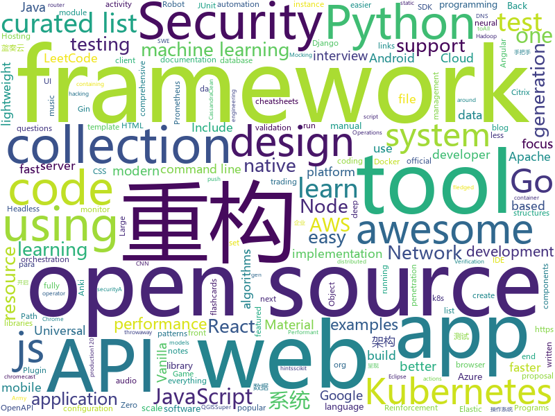

# 2020-01-21
See what the GitHub community is most excited about today.

## python
* [tensortrade](https://github.com/tensortrade-org/tensortrade)(**28 stars today**): An open source reinforcement learning framework for training, evaluating, and deploying robust trading agents.
* [ML-From-Scratch](https://github.com/eriklindernoren/ML-From-Scratch)(**30 stars today**): Machine Learning From Scratch. Bare bones NumPy implementations of machine learning models and algorithms with a focus on accessibility. Aims to cover everything from linear regression to deep learning.
* [DAIN](https://github.com/baowenbo/DAIN)(**49 stars today**): Depth-Aware Video Frame Interpolation (CVPR 2019)
* [flax](https://github.com/google-research/flax)(**118 stars today**): 
* [system-design-primer](https://github.com/donnemartin/system-design-primer)(**181 stars today**): Learn how to design large-scale systems. Prep for the system design interview. Includes Anki flashcards.
* [Mask_RCNN](https://github.com/matterport/Mask_RCNN)(**16 stars today**): Mask R-CNN for object detection and instance segmentation on Keras and TensorFlow
* [fastapi](https://github.com/tiangolo/fastapi)(**103 stars today**): FastAPI framework, high performance, easy to learn, fast to code, ready for production
* [interactive-coding-challenges](https://github.com/donnemartin/interactive-coding-challenges)(**16 stars today**): 120+ interactive Python coding interview challenges (algorithms and data structures). Includes Anki flashcards.
* [pydantic](https://github.com/samuelcolvin/pydantic)(**24 stars today**): Data parsing and validation using Python type hints
* [scikit-learn](https://github.com/scikit-learn/scikit-learn)(**21 stars today**): scikit-learn: machine learning in Python
* [devops-exercises](https://github.com/bregman-arie/devops-exercises)(**215 stars today**): Linux, Jenkins, AWS, SRE, Prometheus, Docker, Python, Ansible, Git, Kubernetes, Terraform, OpenStack, SQL, NoSQL, Azure, GCP, DNS, Elastic, Network, Virtualization
* [ActionAI](https://github.com/smellslikeml/ActionAI)(**21 stars today**): custom human activity recognition modules by pose estimation and cascaded inference using sklearn API
* [DialoGPT](https://github.com/microsoft/DialoGPT)(**13 stars today**): Large-scale pretraining for dialogue
* [lanzou-gui](https://github.com/rachpt/lanzou-gui)(**30 stars today**): 蓝奏云 | 蓝奏云客户端 | 蓝奏网盘 GUI版本
* [airflow](https://github.com/apache/airflow)(**19 stars today**): Apache Airflow - A platform to programmatically author, schedule, and monitor workflows
* [Middleware-Vulnerability-detection](https://github.com/mai-lang-chai/Middleware-Vulnerability-detection)(**38 stars today**): CMS、中间件漏洞检测利用合集 Since 2019-9-15
* [flask-restplus](https://github.com/noirbizarre/flask-restplus)(**2 stars today**): Fully featured framework for fast, easy and documented API development with Flask
* [jrnl](https://github.com/jrnl-org/jrnl)(**15 stars today**): Collect your thoughts and notes without leaving the command line.
* [boto3](https://github.com/boto/boto3)(**2 stars today**): AWS SDK for Python
* [universal_robot](https://github.com/ros-industrial/universal_robot)(**0 stars today**): ROS-Industrial Universal Robots support (http://wiki.ros.org/universal_robot)
* [machine_learning_examples](https://github.com/lazyprogrammer/machine_learning_examples)(**9 stars today**): A collection of machine learning examples and tutorials.
* [sentry](https://github.com/getsentry/sentry)(**14 stars today**): Sentry is cross-platform application monitoring, with a focus on error reporting.
* [examples](https://github.com/pytorch/examples)(**12 stars today**): A set of examples around pytorch in Vision, Text, Reinforcement Learning, etc.
* [odoo](https://github.com/odoo/odoo)(**14 stars today**): Odoo. Open Source Apps To Grow Your Business.
* [qgis-earthengine-examples](https://github.com/giswqs/qgis-earthengine-examples)(**4 stars today**): A collection of 290+ Python examples for using Google Earth Engine in QGIS

## java
* [onedev](https://github.com/theonedev/onedev)(**464 stars today**): Super Easy All-In-One DevOps Platform
* [backtobackswe](https://github.com/bephrem1/backtobackswe)(**10 stars today**): Code Examples For Back To Back SWE Lessons
* [migration](https://github.com/phodal/migration)(**244 stars today**): 《系统重构与迁移指南》手把手教你分析、评估现有系统、制定重构策略、探索可行重构方案、搭建测试防护网、进行系统架构重构、服务架构重构、模块重构、代码重构、数据库重构、重构后的架构守护
* [mockito](https://github.com/mockito/mockito)(**12 stars today**): Most popular Mocking framework for unit tests written in Java
* [LeetCodeAnimation](https://github.com/MisterBooo/LeetCodeAnimation)(**139 stars today**): Demonstrate all the questions on LeetCode in the form of animation.（用动画的形式呈现解LeetCode题目的思路）
* [cassandra](https://github.com/apache/cassandra)(**7 stars today**): Mirror of Apache Cassandra
* [COLA](https://github.com/alibaba/COLA)(**74 stars today**): Clean Object-oriented & Layered Architecture
* [testcontainers-java](https://github.com/testcontainers/testcontainers-java)(**8 stars today**): Testcontainers is a Java library that supports JUnit tests, providing lightweight, throwaway instances of common databases, Selenium web browsers, or anything else that can run in a Docker container.
* [graal](https://github.com/oracle/graal)(**21 stars today**): GraalVM: Run Programs Faster Anywhere🚀
* [CS-Notes](https://github.com/CyC2018/CS-Notes)(**214 stars today**): 📚技术面试必备基础知识、Leetcode、计算机操作系统、计算机网络、系统设计、Java、Python、C++
* [bundletool](https://github.com/google/bundletool)(**4 stars today**): Bundletool is a command-line tool to manipulate Android App Bundles
* [retrofit](https://github.com/square/retrofit)(**19 stars today**): Type-safe HTTP client for Android and Java by Square, Inc.
* [material-components-android](https://github.com/material-components/material-components-android)(**12 stars today**): Modular and customizable Material Design UI components for Android
* [react-native-track-player](https://github.com/react-native-kit/react-native-track-player)(**2 stars today**): A fully fledged audio module created for music apps. Provides audio playback, external media controls, chromecast support, background mode and more!
* [keycloak](https://github.com/keycloak/keycloak)(**11 stars today**): Open Source Identity and Access Management For Modern Applications and Services
* [kafka](https://github.com/apache/kafka)(**19 stars today**): Mirror of Apache Kafka
* [avro](https://github.com/apache/avro)(**2 stars today**): Apache Avro
* [che](https://github.com/eclipse/che)(**1 stars today**): Eclipse Che: Next-generation Eclipse IDE. Open source workspace server and cloud IDE.
* [NewPipe](https://github.com/TeamNewPipe/NewPipe)(**11 stars today**): A libre lightweight streaming front-end for Android.
* [react-native-push-notification](https://github.com/zo0r/react-native-push-notification)(**2 stars today**): React Native Local and Remote Notifications
* [tutorials](https://github.com/eugenp/tutorials)(**14 stars today**): Just Announced - "Learn Spring Security OAuth":
* [junit5](https://github.com/junit-team/junit5)(**4 stars today**): The next generation of JUnit.
* [openapi-generator](https://github.com/OpenAPITools/openapi-generator)(**13 stars today**): OpenAPI Generator allows generation of API client libraries (SDK generation), server stubs, documentation and configuration automatically given an OpenAPI Spec (v2, v3)
* [xxl-job](https://github.com/xuxueli/xxl-job)(**48 stars today**): A distributed task scheduling framework.（分布式任务调度平台XXL-JOB）
* [phimpme-android](https://github.com/fossasia/phimpme-android)(**13 stars today**): Phimp.me Photo Imaging and Picture Editor https://play.google.com/store/apps/details?id=org.fossasia.phimpme

## unknown
* [templates](https://github.com/kbariotis/templates)(**250 stars today**): A set of standard document templates.
* [SoftwareArchitect](https://github.com/justinamiller/SoftwareArchitect)(**1,188 stars today**): Become a Better Software Architect
* [howto-make-more-money](https://github.com/easychen/howto-make-more-money)(**110 stars today**): 程序员如何优雅的挣零花钱
* [the-book-of-secret-knowledge](https://github.com/trimstray/the-book-of-secret-knowledge)(**40 stars today**): A collection of inspiring lists, manuals, cheatsheets, blogs, hacks, one-liners, cli/web tools and more.
* [proposals](https://github.com/tc39/proposals)(**15 stars today**): Tracking ECMAScript Proposals
* [God-Of-BigData](https://github.com/wangzhiwubigdata/God-Of-BigData)(**35 stars today**): 大数据面试题，大数据成神之路开启...Flink/Spark/Hadoop/Hbase/Hive...
* [AZ-103-MicrosoftAzureAdministrator](https://github.com/MicrosoftLearning/AZ-103-MicrosoftAzureAdministrator)(**7 stars today**): AZ-103: Microsoft Azure Administrator
* [Infosec_Reference](https://github.com/rmusser01/Infosec_Reference)(**21 stars today**): An Information Security Reference That Doesn't Suck
* [Awesome-Hacking-Resources](https://github.com/vitalysim/Awesome-Hacking-Resources)(**8 stars today**): A collection of hacking / penetration testing resources to make you better!
* [awesome-osint](https://github.com/jivoi/awesome-osint)(**6 stars today**): 😱A curated list of amazingly awesome OSINT
* [developer-roadmap](https://github.com/kamranahmedse/developer-roadmap)(**125 stars today**): Roadmap to becoming a web developer in 2020
* [run-book-template](https://github.com/SkeltonThatcher/run-book-template)(**12 stars today**): Run Book / Operations Manual template for modern software systems
* [awesome-web-hacking](https://github.com/infoslack/awesome-web-hacking)(**16 stars today**): A list of web application security
* [awesome-bug-bounty](https://github.com/djadmin/awesome-bug-bounty)(**10 stars today**): A comprehensive curated list of available Bug Bounty & Disclosure Programs and Write-ups.
* [vagas](https://github.com/frontendbr/vagas)(**20 stars today**): 🔬Espaço para divulgação de vagas para front-enders.
* [CVE-2019-19781](https://github.com/x1sec/CVE-2019-19781)(**8 stars today**): DFIR notes for Citrix Citrix ADC (NetScaler) appliances vulnerable to CVE-2019-19781
* [AZ-300-MicrosoftAzureArchitectTechnologies](https://github.com/MicrosoftLearning/AZ-300-MicrosoftAzureArchitectTechnologies)(**3 stars today**): 
* [computer-science](https://github.com/ossu/computer-science)(**59 stars today**): 🎓Path to a free self-taught education in Computer Science!
* [Wuma](https://github.com/mumavpn/Wuma)(**3 stars today**): 
* [awesome-pentest](https://github.com/enaqx/awesome-pentest)(**6 stars today**): A collection of awesome penetration testing resources, tools and other shiny things
* [awesome-test-automation](https://github.com/atinfo/awesome-test-automation)(**4 stars today**): A curated list of awesome test automation frameworks, tools, libraries, and software for different programming languages. Sponsored by http://sdclabs.com
* [turtledove](https://github.com/michaelkleber/turtledove)(**5 stars today**): TURTLEDOVE
* [angular-interview-questions](https://github.com/sudheerj/angular-interview-questions)(**4 stars today**): List of 300 Angular Interview Questions and answers[WIP]
* [awesome-actions](https://github.com/sdras/awesome-actions)(**27 stars today**): A curated list of awesome actions to use on GitHub
* [awesome-scalability](https://github.com/binhnguyennus/awesome-scalability)(**9 stars today**): The Patterns of Scalable, Reliable, and Performant Large-Scale Systems

## javascript
* [realworld](https://github.com/gothinkster/realworld)(**161 stars today**): "The mother of all demo apps" — Exemplary fullstack Medium.com clone powered by React, Angular, Node, Django, and many more🏅
* [clean-code-javascript](https://github.com/ryanmcdermott/clean-code-javascript)(**574 stars today**): 🛁Clean Code concepts adapted for JavaScript
* [cube.js](https://github.com/cube-js/cube.js)(**38 stars today**): 📊Cube.js - Open Source Analytics Framework
* [javascript-algorithms](https://github.com/trekhleb/javascript-algorithms)(**110 stars today**): 📝Algorithms and data structures implemented in JavaScript with explanations and links to further readings
* [react-router](https://github.com/ReactTraining/react-router)(**14 stars today**): Declarative routing for React
* [awesome-cheatsheets](https://github.com/LeCoupa/awesome-cheatsheets)(**11 stars today**): 👩‍💻👨‍💻Awesome cheatsheets for popular programming languages, frameworks and development tools. They include everything you should know in one single file.
* [puppeteer](https://github.com/puppeteer/puppeteer)(**38 stars today**): Headless Chrome Node.js API
* [create-react-app](https://github.com/facebook/create-react-app)(**44 stars today**): Set up a modern web app by running one command.
* [reveal.js](https://github.com/hakimel/reveal.js)(**20 stars today**): The HTML Presentation Framework
* [vue-router](https://github.com/vuejs/vue-router)(**11 stars today**): 🚦The official router for Vue.js.
* [OmniStack-10.0](https://github.com/fl4m3x/OmniStack-10.0)(**19 stars today**): Repositório da Semana OmniStack - 10.0 da RocketSeat!
* [unlock-music](https://github.com/ix64/unlock-music)(**47 stars today**): Unlock encrypted music file in browser. 在浏览器中解锁加密的音乐文件。
* [renovate](https://github.com/renovatebot/renovate)(**9 stars today**): Universal dependency update tool that fits into your workflows.
* [json-server](https://github.com/typicode/json-server)(**75 stars today**): Get a full fake REST API with zero coding in less than 30 seconds (seriously)
* [typeahead.js](https://github.com/twitter/typeahead.js)(**3 stars today**): typeahead.js is a fast and fully-featured autocomplete library
* [drawio-desktop](https://github.com/jgraph/drawio-desktop)(**43 stars today**): Official electron build of draw.io
* [webdriverio](https://github.com/webdriverio/webdriverio)(**7 stars today**): Next-gen WebDriver test automation framework for Node.js
* [hacker-scripts](https://github.com/NARKOZ/hacker-scripts)(**140 stars today**): Based on a true story
* [node-express-realworld-example-app](https://github.com/gothinkster/node-express-realworld-example-app)(**8 stars today**): 
* [material-ui](https://github.com/mui-org/material-ui)(**44 stars today**): React components for faster and easier web development. Build your own design system, or start with Material Design.
* [react-native](https://github.com/facebook/react-native)(**34 stars today**): A framework for building native apps with React.
* [Magnific-Popup](https://github.com/dimsemenov/Magnific-Popup)(**2 stars today**): Light and responsive lightbox script with focus on performance.
* [dropzone](https://github.com/enyo/dropzone)(**5 stars today**): Dropzone is an easy to use drag'n'drop library. It supports image previews and shows nice progress bars.
* [jquery-validation](https://github.com/jquery-validation/jquery-validation)(**2 stars today**): jQuery Validation Plugin library sources
* [swagger-ui](https://github.com/swagger-api/swagger-ui)(**14 stars today**): Swagger UI is a collection of HTML, Javascript, and CSS assets that dynamically generate beautiful documentation from a Swagger-compliant API.

## html
* [kubelabs](https://github.com/collabnix/kubelabs)(**250 stars today**): Kubernetes - Beginners | Intermediate | Advanced
* [awesome-piracy](https://github.com/Igglybuff/awesome-piracy)(**52 stars today**): A curated list of awesome warez and piracy links
* [homepage](https://github.com/omegasisters/homepage)(**44 stars today**): おめシスのホームページを作りたい
* [tiny-slider](https://github.com/ganlanyuan/tiny-slider)(**5 stars today**): Vanilla javascript slider for all purposes.
* [owasp-mstg](https://github.com/OWASP/owasp-mstg)(**11 stars today**): The Mobile Security Testing Guide (MSTG) is a comprehensive manual for mobile app security development, testing and reverse engineering.
* [flag-icon-css](https://github.com/lipis/flag-icon-css)(**7 stars today**): 🎏A collection of all country flags in SVG — plus the CSS for easier integration
* [blog_os](https://github.com/phil-opp/blog_os)(**14 stars today**): Writing an OS in Rust
* [nndl.github.io](https://github.com/nndl/nndl.github.io)(**40 stars today**): 《神经网络与深度学习》 邱锡鹏著 Neural Network and Deep Learning
* [ignite-learning-paths-training-afun](https://github.com/microsoft/ignite-learning-paths-training-afun)(**5 stars today**): Microsoft Ignite Learning Path, Train the Trainer materials: Azure Fundamentals
* [all-contributors](https://github.com/all-contributors/all-contributors)(**3 stars today**): ✨Recognize all contributors, not just the ones who push code✨
* [JavaScript30](https://github.com/wesbos/JavaScript30)(**10 stars today**): 30 Day Vanilla JS Challenge
* [Screenshot-to-code](https://github.com/emilwallner/Screenshot-to-code)(**16 stars today**): A neural network that transforms a design mock-up into a static website.
* [Django-CRM](https://github.com/MicroPyramid/Django-CRM)(**2 stars today**): Open Source Python CRM based on Django aimed to salesforce compatible for migrating to
* [webdevbootcamp](https://github.com/nax3t/webdevbootcamp)(**4 stars today**): All source code for back-end projects from the Web Developer Bootcamp
* [hugo-coder](https://github.com/luizdepra/hugo-coder)(**3 stars today**): A minimalist blog theme for hugo.
* [rellax](https://github.com/dixonandmoe/rellax)(**19 stars today**): Lightweight, vanilla javascript parallax library
* [ASVS](https://github.com/OWASP/ASVS)(**6 stars today**): Application Security Verification Standard
* [aws-well-architected-labs](https://github.com/awslabs/aws-well-architected-labs)(**5 stars today**): Hands on labs and code to help you learn, measure, and build using architectural best practices.
* [tools](https://github.com/googlecodelabs/tools)(**3 stars today**): Codelabs management & hosting tools
* [AR.js](https://github.com/jeromeetienne/AR.js)(**14 stars today**): Efficient Augmented Reality for the Web - 60fps on mobile!
* [proposal-nullish-coalescing](https://github.com/tc39/proposal-nullish-coalescing)(**3 stars today**): Nullish coalescing proposal x ?? y
* [zenbot](https://github.com/DeviaVir/zenbot)(**10 stars today**): Zenbot is a command-line cryptocurrency trading bot using Node.js and MongoDB.
* [twemoji](https://github.com/twitter/twemoji)(**6 stars today**): Emoji for everyone. https://twemoji.twitter.com/
* [django-DefectDojo](https://github.com/DefectDojo/django-DefectDojo)(**1 stars today**): DefectDojo is an open-source application vulnerability correlation and security orchestration tool.
* [serverless](https://github.com/cdk-patterns/serverless)(**2 stars today**): This is intended to be a repo containing all of the official AWS Serverless architecture patterns built with CDK for developers to use.

## go
* [gin](https://github.com/gin-gonic/gin)(**42 stars today**): Gin is a HTTP web framework written in Go (Golang). It features a Martini-like API with much better performance -- up to 40 times faster. If you need smashing performance, get yourself some Gin.
* [go-ipfs](https://github.com/ipfs/go-ipfs)(**11 stars today**): IPFS implementation in Go
* [terraform](https://github.com/hashicorp/terraform)(**22 stars today**): Terraform enables you to safely and predictably create, change, and improve infrastructure. It is an open source tool that codifies APIs into declarative configuration files that can be shared amongst team members, treated as code, edited, reviewed, and versioned.
* [pipeline](https://github.com/tektoncd/pipeline)(**10 stars today**): A K8s-native Pipeline resource.
* [go](https://github.com/golang/go)(**47 stars today**): The Go programming language
* [k3s](https://github.com/rancher/k3s)(**24 stars today**): Lightweight Kubernetes. 5 less than k8s.
* [daptin](https://github.com/daptin/daptin)(**44 stars today**): Daptin - GraphQL/JSON-API Headless CMS
* [agones](https://github.com/googleforgames/agones)(**12 stars today**): Dedicated Game Server Hosting and Scaling for Multiplayer Games on Kubernetes
* [terraform-provider-google](https://github.com/terraform-providers/terraform-provider-google)(**3 stars today**): Terraform Google Cloud Platform provider
* [k3sup](https://github.com/alexellis/k3sup)(**11 stars today**): k3sup: from Zero to KUBECONFIG in < 1 min🚀
* [prototool](https://github.com/uber/prototool)(**6 stars today**): Your Swiss Army Knife for Protocol Buffers
* [gotop](https://github.com/cjbassi/gotop)(**10 stars today**): A terminal based graphical activity monitor inspired by gtop and vtop
* [amazon-vpc-cni-k8s](https://github.com/aws/amazon-vpc-cni-k8s)(**2 stars today**): Networking plugin repository for pod networking in Kubernetes using Elastic Network Interfaces on AWS
* [grpc-go](https://github.com/grpc/grpc-go)(**11 stars today**): The Go language implementation of gRPC. HTTP/2 based RPC
* [helm](https://github.com/helm/helm)(**17 stars today**): The Kubernetes Package Manager
* [aws-nuke](https://github.com/rebuy-de/aws-nuke)(**3 stars today**): Nuke a whole AWS account and delete all its resources.
* [traefik](https://github.com/containous/traefik)(**27 stars today**): The Cloud Native Edge Router
* [datadog-agent](https://github.com/DataDog/datadog-agent)(**3 stars today**): Datadog Agent
* [sqlboiler](https://github.com/volatiletech/sqlboiler)(**6 stars today**): Generate a Go ORM tailored to your database schema.
* [postgres-operator](https://github.com/zalando/postgres-operator)(**3 stars today**): Postgres operator creates and manages PostgreSQL clusters running in Kubernetes
* [tendermint](https://github.com/tendermint/tendermint)(**3 stars today**): ⟁ Tendermint Core (BFT Consensus) in Go
* [HFish](https://github.com/hacklcx/HFish)(**25 stars today**): Extend the enterprise security test open source honeypot system , Record hacker attacks. 扩展企业安全测试主动诱导型开源蜜罐框架系统，记录黑客攻击手段
* [rook](https://github.com/rook/rook)(**7 stars today**): Storage Orchestration for Kubernetes
* [loki](https://github.com/grafana/loki)(**9 stars today**): Like Prometheus, but for logs.
* [logrus](https://github.com/sirupsen/logrus)(**14 stars today**): Structured, pluggable logging for Go.

## WordCloud

