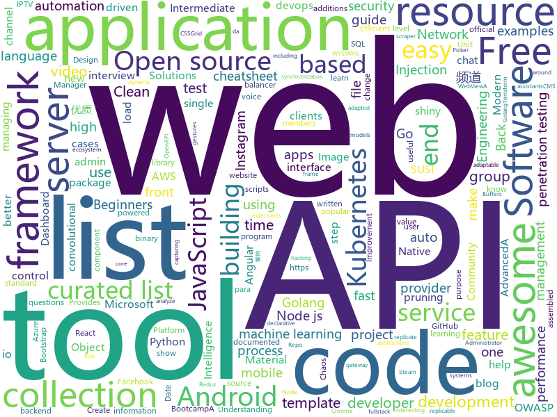

# 2020-01-22
See what the GitHub community is most excited about today.

## python
* [flax](https://github.com/google-research/flax)(**68 stars today**): 
* [assembled-cnn](https://github.com/clovaai/assembled-cnn)(**41 stars today**): Official implementation of "Compounding the Performance Improvements of Assembled Techniques in a Convolutional Neural Network"
* [rasa](https://github.com/RasaHQ/rasa)(**13 stars today**): 💬Open source machine learning framework to automate text- and voice-based conversations: NLU, dialogue management, connect to Slack, Facebook, and more - Create chatbots and voice assistants
* [Middleware-Vulnerability-detection](https://github.com/mai-lang-chai/Middleware-Vulnerability-detection)(**40 stars today**): CMS、中间件漏洞检测利用合集 Since 2019-9-15
* [IMSI-catcher](https://github.com/Oros42/IMSI-catcher)(**6 stars today**): This program show you IMSI numbers of cellphones around you.
* [SlowFast](https://github.com/facebookresearch/SlowFast)(**29 stars today**): PySlowFast: video understanding codebase from FAIR for reproducing state-of-the-art video models.
* [flask-restx](https://github.com/python-restx/flask-restx)(**9 stars today**): Fork of Flask-RESTPlus: Fully featured framework for fast, easy and documented API development with Flask
* [talking-head-anime-demo](https://github.com/pkhungurn/talking-head-anime-demo)(**9 stars today**): Demo for the "Talking Head Anime from a Single Image."
* [TeleGram-Scraper](https://github.com/th3unkn0n/TeleGram-Scraper)(**13 stars today**): telegram group scraper tool. fetch all information about group members
* [SRC-experience](https://github.com/Wh0ale/SRC-experience)(**53 stars today**): 工欲善其事，必先利其器
* [gundam_robot](https://github.com/gundam-global-challenge/gundam_robot)(**13 stars today**): ROS packages for GUNDAM robots
* [jupyter](https://github.com/jupyter/jupyter)(**10 stars today**): Jupyter metapackage for installation, docs and chat
* [instabot](https://github.com/instagrambot/instabot)(**18 stars today**): 🐙Free Instagram scripts, bots and Python API wrapper. Get free instagram followers with our auto like, auto follow and other scripts!
* [scikit-learn](https://github.com/scikit-learn/scikit-learn)(**15 stars today**): scikit-learn: machine learning in Python
* [fastapi](https://github.com/tiangolo/fastapi)(**91 stars today**): FastAPI framework, high performance, easy to learn, fast to code, ready for production
* [exrop](https://github.com/d4em0n/exrop)(**38 stars today**): Automatic ROPChain Generation
* [sqlmap](https://github.com/sqlmapproject/sqlmap)(**12 stars today**): Automatic SQL injection and database takeover tool
* [model-compression](https://github.com/666DZY666/model-compression)(**6 stars today**): model compression based on pytorch (1、quantization: 8/4/2bits(dorefa)、ternary/binary value(twn/bnn/xnor-net)；2、 pruning: normal、regular and group convolutional channel pruning；3、 group convolution structure；4、batch-normalization folding for binary value of feature(A))
* [pip](https://github.com/pypa/pip)(**14 stars today**): The Python package installer
* [home-assistant](https://github.com/home-assistant/home-assistant)(**26 stars today**): 🏡Open source home automation that puts local control and privacy first
* [public-apis](https://github.com/public-apis/public-apis)(**45 stars today**): A collective list of free APIs for use in software and web development.
* [iptv-m3u-maker](https://github.com/EvilCult/iptv-m3u-maker)(**9 stars today**): IPTV 国内+国外 电视台直播源m3u文件, 收集&汇总脚本,目前状况: 收录频道总数:4523, 优质频道数:已放出优质频道总是: 687
* [faceswap](https://github.com/deepfakes/faceswap)(**24 stars today**): Deepfakes Software For All
* [keras](https://github.com/keras-team/keras)(**11 stars today**): Deep Learning for humans
* [temporal-shift-module](https://github.com/mit-han-lab/temporal-shift-module)(**6 stars today**): [ICCV 2019] TSM: Temporal Shift Module for Efficient Video Understanding.

## java
* [COLA](https://github.com/alibaba/COLA)(**86 stars today**): Clean Object-oriented & Layered Architecture
* [CtCI-6th-Edition](https://github.com/careercup/CtCI-6th-Edition)(**14 stars today**): Cracking the Coding Interview 6th Ed. Solutions
* [karate](https://github.com/intuit/karate)(**7 stars today**): Test Automation Made Simple
* [react-native-webview](https://github.com/react-native-community/react-native-webview)(**9 stars today**): React Native Cross-Platform WebView
* [selenium](https://github.com/SeleniumHQ/selenium)(**20 stars today**): A browser automation framework and ecosystem.
* [graal](https://github.com/oracle/graal)(**18 stars today**): GraalVM: Run Programs Faster Anywhere🚀
* [zaproxy](https://github.com/zaproxy/zaproxy)(**8 stars today**): The OWASP ZAP core project
* [mockito](https://github.com/mockito/mockito)(**15 stars today**): Most popular Mocking framework for unit tests written in Java
* [onedev](https://github.com/theonedev/onedev)(**337 stars today**): Super Easy All-In-One DevOps Platform
* [AOSP-DownloadProviderDbDumperSQLiWhere](https://github.com/IOActive/AOSP-DownloadProviderDbDumperSQLiWhere)(**4 stars today**): PoC Exploiting SQL Injection in Android's Download Provider in Selection Parameter (CVE-2019-2198)
* [robolectric](https://github.com/robolectric/robolectric)(**8 stars today**): Android Unit Testing Framework
* [anserini](https://github.com/castorini/anserini)(**2 stars today**): A Lucene toolkit for replicable information retrieval research
* [effective-java-3e-source-code](https://github.com/jbloch/effective-java-3e-source-code)(**5 stars today**): The source code from the third edition of Effective Java, with minor additions as necessary to make it runnable.
* [vert.x](https://github.com/eclipse-vertx/vert.x)(**6 stars today**): Vert.x is a tool-kit for building reactive applications on the JVM
* [maven](https://github.com/apache/maven)(**3 stars today**): Apache Maven core
* [Apktool](https://github.com/iBotPeaches/Apktool)(**8 stars today**): A tool for reverse engineering Android apk files
* [HackerRank_solutions](https://github.com/RodneyShag/HackerRank_solutions)(**5 stars today**): 317 efficient solutions to HackerRank problems
* [user-interface-samples](https://github.com/android/user-interface-samples)(**4 stars today**): Multiple samples showing the best practices in the user interface on Android.
* [backtobackswe](https://github.com/bephrem1/backtobackswe)(**14 stars today**): Code Examples For Back To Back SWE Lessons
* [CameraView](https://github.com/natario1/CameraView)(**4 stars today**): 📸A well documented, high-level Android interface that makes capturing pictures and videos easy, addressing all of the common issues and needs. Real-time filters, gestures, watermarks, frame processing, RAW, output of any size.
* [Java](https://github.com/TheAlgorithms/Java)(**15 stars today**): All Algorithms implemented in Java
* [sonarqube-community-branch-plugin](https://github.com/mc1arke/sonarqube-community-branch-plugin)(**1 stars today**): A plugin for SonarQube to allow branch analysis in the community version
* [camel](https://github.com/apache/camel)(**4 stars today**): Apache Camel
* [zuul](https://github.com/Netflix/zuul)(**5 stars today**): Zuul is a gateway service that provides dynamic routing, monitoring, resiliency, security, and more.
* [susi_server](https://github.com/fossasia/susi_server)(**10 stars today**): SUSI.AI server backend - the Artificial Intelligence server for personal assistants https://api.susi.ai

## unknown
* [the-book-of-secret-knowledge](https://github.com/trimstray/the-book-of-secret-knowledge)(**62 stars today**): A collection of inspiring lists, manuals, cheatsheets, blogs, hacks, one-liners, cli/web tools and more.
* [templates](https://github.com/kbariotis/templates)(**233 stars today**): A set of standard document templates.
* [howto-make-more-money](https://github.com/easychen/howto-make-more-money)(**229 stars today**): 程序员如何优雅的挣零花钱
* [SoftwareArchitect](https://github.com/justinamiller/SoftwareArchitect)(**1,072 stars today**): Path to a Software Architect
* [gitignore](https://github.com/github/gitignore)(**51 stars today**): A collection of useful .gitignore templates
* [Awesome-Hacking](https://github.com/Hack-with-Github/Awesome-Hacking)(**28 stars today**): A collection of various awesome lists for hackers, pentesters and security researchers
* [Penetration-Testing](https://github.com/wtsxDev/Penetration-Testing)(**9 stars today**): List of awesome penetration testing resources, tools and other shiny things
* [pentest-guide](https://github.com/Voorivex/pentest-guide)(**9 stars today**): Penetration tests guide based on OWASP including test cases, resources and examples.
* [developer-roadmap](https://github.com/kamranahmedse/developer-roadmap)(**138 stars today**): Roadmap to becoming a web developer in 2020
* [modern-cpp-features](https://github.com/AnthonyCalandra/modern-cpp-features)(**7 stars today**): A cheatsheet of modern C++ language and library features.
* [rfcs](https://github.com/vuejs/rfcs)(**4 stars today**): RFCs for substantial changes / feature additions to Vue core
* [AZ-103-MicrosoftAzureAdministrator](https://github.com/MicrosoftLearning/AZ-103-MicrosoftAzureAdministrator)(**7 stars today**): AZ-103: Microsoft Azure Administrator
* [awesome-nestjs](https://github.com/juliandavidmr/awesome-nestjs)(**7 stars today**): 😏Curated list of NestJS
* [curriculum](https://github.com/TheOdinProject/curriculum)(**3 stars today**): The open curriculum for learning web development
* [awesome](https://github.com/sindresorhus/awesome)(**128 stars today**): 😎Awesome lists about all kinds of interesting topics
* [Awesome-Hacking-Resources](https://github.com/vitalysim/Awesome-Hacking-Resources)(**12 stars today**): A collection of hacking / penetration testing resources to make you better!
* [awesome-web-security](https://github.com/qazbnm456/awesome-web-security)(**10 stars today**): 🐶A curated list of Web Security materials and resources.
* [vagas](https://github.com/frontendbr/vagas)(**15 stars today**): 🔬Espaço para divulgação de vagas para front-enders.
* [Privilege-Escalation](https://github.com/Ignitetechnologies/Privilege-Escalation)(**2 stars today**): This cheasheet is aimed at the CTF Players and Beginners to help them understand the fundamentals of Privilege Escalation with examples.
* [proposals](https://github.com/tc39/proposals)(**13 stars today**): Tracking ECMAScript Proposals
* [DSGN](https://github.com/chenyilun95/DSGN)(**6 stars today**): DSGN: Deep Stereo Geometry Network for 3D Object Detection
* [awesome-pentest](https://github.com/enaqx/awesome-pentest)(**13 stars today**): A collection of awesome penetration testing resources, tools and other shiny things
* [YubiKey-Guide](https://github.com/drduh/YubiKey-Guide)(**5 stars today**): Guide to using YubiKey for GPG and SSH
* [Flutter-Course-Resources](https://github.com/londonappbrewery/Flutter-Course-Resources)(**13 stars today**): Learn to Code While Building Apps - The Complete Flutter Development Bootcamp
* [awesome-chaos-engineering](https://github.com/dastergon/awesome-chaos-engineering)(**4 stars today**): A curated list of Chaos Engineering resources.

## javascript
* [city-roads](https://github.com/anvaka/city-roads)(**175 stars today**): Visualization of all roads within any city
* [realworld](https://github.com/gothinkster/realworld)(**225 stars today**): "The mother of all demo apps" — Exemplary fullstack Medium.com clone powered by React, Angular, Node, Django, and many more🏅
* [clean-code-javascript](https://github.com/ryanmcdermott/clean-code-javascript)(**426 stars today**): 🛁Clean Code concepts adapted for JavaScript
* [awesome-uses](https://github.com/wesbos/awesome-uses)(**45 stars today**): A list of /uses pages detailing developer setups, gear, software and configs.
* [appwrite](https://github.com/appwrite/appwrite)(**17 stars today**): End-to-end backend server for frontend and mobile developers.🚀
* [iptv](https://github.com/iptv-org/iptv)(**43 stars today**): Collection of 8000+ publicly available IPTV channels from all over the world
* [joplin](https://github.com/laurent22/joplin)(**28 stars today**): Joplin - an open source note taking and to-do application with synchronization capabilities for Windows, macOS, Linux, Android and iOS. Forum: https://discourse.joplinapp.org/
* [opensource.guide](https://github.com/github/opensource.guide)(**5 stars today**): 📚Community guides for open source creators
* [Rocket.Chat.ReactNative](https://github.com/RocketChat/Rocket.Chat.ReactNative)(**2 stars today**): Rocket.Chat mobile clients
* [strapi](https://github.com/strapi/strapi)(**39 stars today**): 🚀Open source Node.js Headless CMS to easily build customisable APIs
* [socket.io](https://github.com/socketio/socket.io)(**14 stars today**): Realtime application framework (Node.JS server)
* [matx-react](https://github.com/uilibrary/matx-react)(**82 stars today**): Matx React Redux Material Design Admin Dashboard Template
* [semana-omnistack-10](https://github.com/Rocketseat/semana-omnistack-10)(**20 stars today**): Código da aplicação desenvolvida durante a Semana OmniStack 10.0🚀
* [2020-virus-map](https://github.com/lbj96347/2020-virus-map)(**39 stars today**): Base on China official news to pop up virus cases on map. 基于中国官方新闻公布数据，绘制新型冠状病毒案例于地图上。
* [html5-boilerplate](https://github.com/h5bp/html5-boilerplate)(**10 stars today**): A professional front-end template for building fast, robust, and adaptable web apps or sites.
* [pm2](https://github.com/Unitech/pm2)(**18 stars today**): Node.js Production Process Manager with a built-in Load Balancer.
* [dropzone](https://github.com/enyo/dropzone)(**9 stars today**): Dropzone is an easy to use drag'n'drop library. It supports image previews and shows nice progress bars.
* [node-cron](https://github.com/kelektiv/node-cron)(**7 stars today**): Cron for NodeJS.
* [awesome-selfhosted](https://github.com/awesome-selfhosted/awesome-selfhosted)(**27 stars today**): A list of Free Software network services and web applications which can be hosted locally. Selfhosting is the process of hosting and managing applications instead of renting from Software-as-a-Service providers
* [daterangepicker](https://github.com/dangrossman/daterangepicker)(**4 stars today**): JavaScript Date Range, Date and Time Picker Component
* [awesome-cheatsheets](https://github.com/LeCoupa/awesome-cheatsheets)(**25 stars today**): 👩‍💻👨‍💻Awesome cheatsheets for popular programming languages, frameworks and development tools. They include everything you should know in one single file.
* [cloudmapper](https://github.com/duo-labs/cloudmapper)(**5 stars today**): CloudMapper helps you analyze your Amazon Web Services (AWS) environments.
* [slick](https://github.com/kenwheeler/slick)(**13 stars today**): the last carousel you'll ever need
* [time-elements](https://github.com/github/time-elements)(**3 stars today**): Web component extensions to the standard <time> element.
* [javascript](https://github.com/airbnb/javascript)(**26 stars today**): JavaScript Style Guide

## html
* [awesome-piracy](https://github.com/Igglybuff/awesome-piracy)(**79 stars today**): A curated list of awesome warez and piracy links
* [kubelabs](https://github.com/collabnix/kubelabs)(**195 stars today**): Kubernetes - Beginners | Intermediate | Advanced
* [machine-learning-systems-design](https://github.com/chiphuyen/machine-learning-systems-design)(**9 stars today**): A booklet on machine learning systems design with exercises
* [webdevbootcamp](https://github.com/nax3t/webdevbootcamp)(**3 stars today**): All source code for back-end projects from the Web Developer Bootcamp
* [Front-end-Developer-Interview-Questions](https://github.com/h5bp/Front-end-Developer-Interview-Questions)(**13 stars today**): A list of helpful front-end related questions you can use to interview potential candidates, test yourself or completely ignore.
* [EIPs](https://github.com/ethereum/EIPs)(**3 stars today**): The Ethereum Improvement Proposal repository
* [rellax](https://github.com/dixonandmoe/rellax)(**39 stars today**): Lightweight, vanilla javascript parallax library
* [AR.js](https://github.com/jeromeetienne/AR.js)(**13 stars today**): Efficient Augmented Reality for the Web - 60fps on mobile!
* [gopherlabs](https://github.com/collabnix/gopherlabs)(**10 stars today**): Go - Beginners | Intermediate | Advanced
* [startbootstrap-resume](https://github.com/BlackrockDigital/startbootstrap-resume)(**4 stars today**): A Bootstrap 4 resume/CV theme created by Start Bootstrap
* [tiny-slider](https://github.com/ganlanyuan/tiny-slider)(**7 stars today**): Vanilla javascript slider for all purposes.
* [awesome-angular](https://github.com/PatrickJS/awesome-angular)(**4 stars today**): 📄A curated list of awesome Angular resources
* [beginner-javascript](https://github.com/wesbos/beginner-javascript)(**9 stars today**): Slam Dunk JavaScript
* [shellphish](https://github.com/thelinuxchoice/shellphish)(**3 stars today**): Phishing Tool for 18 social media: Instagram, Facebook, Snapchat, Github, Twitter, Yahoo, Protonmail, Spotify, Netflix, Linkedin, Wordpress, Origin, Steam, Microsoft, InstaFollowers, Gitlab, Pinterest
* [datasciencecoursera](https://github.com/mGalarnyk/datasciencecoursera)(**4 stars today**): Data Science Repo and blog for John Hopkins Coursera Courses. Please let me know if you have any questions.
* [en.javascript.info](https://github.com/javascript-tutorial/en.javascript.info)(**8 stars today**): Modern JavaScript Tutorial
* [wysiwyg-editor](https://github.com/froala/wysiwyg-editor)(**3 stars today**): The next generation Javascript WYSIWYG HTML Editor.
* [concept](https://github.com/puikinsh/concept)(**2 stars today**): Free Bootstrap 4 admin dashboard template
* [terraform-website](https://github.com/hashicorp/terraform-website)(**1 stars today**): Prototype of Terraform website being assembled from multiple repositories
* [swagger-codegen](https://github.com/swagger-api/swagger-codegen)(**8 stars today**): swagger-codegen contains a template-driven engine to generate documentation, API clients and server stubs in different languages by parsing your OpenAPI / Swagger definition.
* [github-markdown-css](https://github.com/sindresorhus/github-markdown-css)(**2 stars today**): The minimal amount of CSS to replicate the GitHub Markdown style
* [free-for-dev](https://github.com/ripienaar/free-for-dev)(**57 stars today**): A list of SaaS, PaaS and IaaS offerings that have free tiers of interest to devops and infradev
* [intro.js](https://github.com/usablica/intro.js)(**3 stars today**): A better way for new feature introduction and step-by-step users guide for your website and project.
* [web-advertising](https://github.com/w3c/web-advertising)(**10 stars today**): Web Advertising BG
* [css-grid](https://github.com/wesbos/css-grid)(**1 stars today**): Starter Files + Solutions to my CSSGrid.io Course

## go
* [istio](https://github.com/istio/istio)(**30 stars today**): Connect, secure, control, and observe services.
* [golang-lru](https://github.com/hashicorp/golang-lru)(**2 stars today**): Golang LRU cache
* [terraform-provider-azurerm](https://github.com/terraform-providers/terraform-provider-azurerm)(**4 stars today**): Terraform provider for Azure Resource Manager
* [dashboard](https://github.com/kubernetes/dashboard)(**10 stars today**): General-purpose web UI for Kubernetes clusters
* [k3s](https://github.com/rancher/k3s)(**26 stars today**): Lightweight Kubernetes. 5 less than k8s.
* [protobuf](https://github.com/gogo/protobuf)(**7 stars today**): Protocol Buffers for Go with Gadgets
* [dgraph](https://github.com/dgraph-io/dgraph)(**13 stars today**): Fast, Distributed Graph DB
* [rita](https://github.com/activecm/rita)(**7 stars today**): Real Intelligence Threat Analytics
* [photoprism](https://github.com/photoprism/photoprism)(**7 stars today**): Personal Photo Management powered by Go and Google TensorFlow
* [chaos-mesh](https://github.com/pingcap/chaos-mesh)(**22 stars today**): A Chaos Engineering Platform for Kubernetes
* [go-clean-arch](https://github.com/bxcodec/go-clean-arch)(**6 stars today**): Go (Golang) Clean Architecture based on Reading Uncle Bob's Clean Architecture
* [orchestrator](https://github.com/github/orchestrator)(**4 stars today**): MySQL replication topology management and HA
* [podinfo](https://github.com/stefanprodan/podinfo)(**6 stars today**): Go microservice template for Kubernetes
* [origin](https://github.com/openshift/origin)(**11 stars today**): The self-managing, auto-upgrading, Kubernetes distribution for everyone
* [gowitness](https://github.com/sensepost/gowitness)(**7 stars today**): 🔍gowitness - a golang, web screenshot utility using Chrome Headless
* [serving](https://github.com/knative/serving)(**4 stars today**): Kubernetes-based, scale-to-zero, request-driven compute
* [IrisAdminApi](https://github.com/snowlyg/IrisAdminApi)(**5 stars today**): iris 框架的后台api项目
* [kubebuilder](https://github.com/kubernetes-sigs/kubebuilder)(**6 stars today**): Kubebuilder - SDK for building Kubernetes APIs using CRDs
* [roadrunner](https://github.com/spiral/roadrunner)(**8 stars today**): High-performance PHP application server, load-balancer and process manager written in Golang
* [terraform](https://github.com/hashicorp/terraform)(**16 stars today**): Terraform enables you to safely and predictably create, change, and improve infrastructure. It is an open source tool that codifies APIs into declarative configuration files that can be shared amongst team members, treated as code, edited, reviewed, and versioned.
* [flux](https://github.com/fluxcd/flux)(**12 stars today**): The GitOps Kubernetes operator
* [operator-sdk](https://github.com/operator-framework/operator-sdk)(**5 stars today**): SDK for building Kubernetes applications. Provides high level APIs, useful abstractions, and project scaffolding.
* [wire](https://github.com/google/wire)(**10 stars today**): Compile-time Dependency Injection for Go
* [traefik](https://github.com/containous/traefik)(**21 stars today**): The Cloud Native Edge Router
* [terraform-provider-aws](https://github.com/terraform-providers/terraform-provider-aws)(**4 stars today**): Terraform AWS provider

## WordCloud

