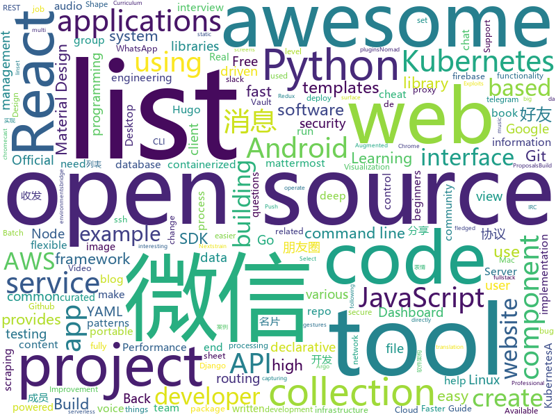

# 2020-01-23
See what the GitHub community is most excited about today.

## python
* [flax](https://github.com/google-research/flax)(**96 stars today**): 
* [the-gan-zoo](https://github.com/hindupuravinash/the-gan-zoo)(**12 stars today**): A list of all named GANs!
* [SRC-experience](https://github.com/Wh0ale/SRC-experience)(**62 stars today**): 工欲善其事，必先利其器
* [protonvpn-cli-ng](https://github.com/ProtonVPN/protonvpn-cli-ng)(**31 stars today**): Linux command-line client for ProtonVPN. Written in Python.
* [assembled-cnn](https://github.com/clovaai/assembled-cnn)(**48 stars today**): Official implementation of "Compounding the Performance Improvements of Assembled Techniques in a Convolutional Neural Network"
* [pip](https://github.com/pypa/pip)(**10 stars today**): The Python package installer
* [JobFunnel](https://github.com/PaulMcInnis/JobFunnel)(**5 stars today**): Tool for scraping job websites, and filtering and reviewing the job listings
* [rasa](https://github.com/RasaHQ/rasa)(**23 stars today**): 💬Open source machine learning framework to automate text- and voice-based conversations: NLU, dialogue management, connect to Slack, Facebook, and more - Create chatbots and voice assistants
* [fixmatch](https://github.com/google-research/fixmatch)(**62 stars today**): 
* [bips](https://github.com/bitcoin/bips)(**3 stars today**): Bitcoin Improvement Proposals
* [metaflow](https://github.com/Netflix/metaflow)(**13 stars today**): Build and manage real-life data science projects with ease.
* [vaex](https://github.com/vaexio/vaex)(**19 stars today**): Out-of-Core DataFrames for Python, visualize and explore big tabular data at a billion rows per second.
* [cartography](https://github.com/lyft/cartography)(**4 stars today**): Cartography is a Python tool that consolidates infrastructure assets and the relationships between them in an intuitive graph view powered by a Neo4j database.
* [ncov](https://github.com/nextstrain/ncov)(**9 stars today**): Nextstrain build for novel coronavirus (nCoV)
* [cheat.sh](https://github.com/chubin/cheat.sh)(**29 stars today**): the only cheat sheet you need
* [CyberRadio](https://github.com/luigifreitas/CyberRadio)(**10 stars today**): 📻A SDR Based FM/AM Radio For Desktop. Accelerated with #cuSignal and Numba.
* [d2l-en](https://github.com/d2l-ai/d2l-en)(**9 stars today**): Dive into Deep Learning: an interactive deep learning book with code, math, and discussions, based on the NumPy interface.
* [cookiecutter](https://github.com/cookiecutter/cookiecutter)(**15 stars today**): A command-line utility that creates projects from cookiecutters (project templates), e.g. Python package projects, jQuery plugin projects.
* [imutils](https://github.com/jrosebr1/imutils)(**6 stars today**): A series of convenience functions to make basic image processing operations such as translation, rotation, resizing, skeletonization, and displaying Matplotlib images easier with OpenCV and Python.
* [TeleGram-Scraper](https://github.com/th3unkn0n/TeleGram-Scraper)(**11 stars today**): telegram group scraper tool. fetch all information about group members
* [gdb-dashboard](https://github.com/cyrus-and/gdb-dashboard)(**4 stars today**): Modular visual interface for GDB in Python
* [compose](https://github.com/docker/compose)(**13 stars today**): Define and run multi-container applications with Docker
* [wagtail](https://github.com/wagtail/wagtail)(**4 stars today**): A Django content management system focused on flexibility and user experience
* [scrapy](https://github.com/scrapy/scrapy)(**14 stars today**): Scrapy, a fast high-level web crawling & scraping framework for Python.
* [VIBE](https://github.com/mkocabas/VIBE)(**4 stars today**): Official implementation of "VIBE: Video Inference for Human Body Pose and Shape Estimation"

## java
* [rabbitmq-tutorials](https://github.com/rabbitmq/rabbitmq-tutorials)(**5 stars today**): Tutorials for using RabbitMQ in various ways
* [CtCI-6th-Edition](https://github.com/careercup/CtCI-6th-Edition)(**9 stars today**): Cracking the Coding Interview 6th Ed. Solutions
* [react-native-track-player](https://github.com/react-native-kit/react-native-track-player)(**4 stars today**): A fully fledged audio module created for music apps. Provides audio playback, external media controls, chromecast support, background mode and more!
* [firebase-android-sdk](https://github.com/firebase/firebase-android-sdk)(**5 stars today**): Firebase Android SDK
* [graphhopper](https://github.com/graphhopper/graphhopper)(**5 stars today**): An open source routing engine. Use it as Java library or server. With OpenStreetMap.
* [pmd](https://github.com/pmd/pmd)(**3 stars today**): An extensible multilanguage static code analyzer.
* [CircleImageView](https://github.com/hdodenhof/CircleImageView)(**4 stars today**): A circular ImageView for Android
* [backtobackswe](https://github.com/bephrem1/backtobackswe)(**12 stars today**): Code Examples For Back To Back SWE Lessons
* [snippets-android](https://github.com/firebase/snippets-android)(**2 stars today**): Android snippets for firebase.google.com
* [OpenRefine](https://github.com/OpenRefine/OpenRefine)(**4 stars today**): OpenRefine is a free, open source power tool for working with messy data and improving it
* [aws-doc-sdk-examples](https://github.com/awsdocs/aws-doc-sdk-examples)(**4 stars today**): Welcome to the AWS Code Example Repository. This repo contains code examples used in the AWS documentation, AWS SDK Developer Guides, and more. For more information, see the Readme.rst file below.
* [junit5](https://github.com/junit-team/junit5)(**2 stars today**): The next generation of JUnit.
* [graal](https://github.com/oracle/graal)(**14 stars today**): GraalVM: Run Programs Faster Anywhere🚀
* [aws-cf-templates](https://github.com/widdix/aws-cf-templates)(**4 stars today**): Free Templates for AWS CloudFormation
* [COLA](https://github.com/alibaba/COLA)(**41 stars today**): Clean Object-oriented & Layered Architecture
* [library](https://github.com/ddd-by-examples/library)(**3 stars today**): A comprehensive Domain-Driven Design example with problem space strategic analysis and various tactical patterns.
* [butterknife](https://github.com/JakeWharton/butterknife)(**4 stars today**): Bind Android views and callbacks to fields and methods.
* [material-components-android](https://github.com/material-components/material-components-android)(**7 stars today**): Modular and customizable Material Design UI components for Android
* [ShapeOfView](https://github.com/florent37/ShapeOfView)(**2 stars today**): Give a custom shape to any android view, Material Design 2 ready
* [CameraView](https://github.com/natario1/CameraView)(**5 stars today**): 📸A well documented, high-level Android interface that makes capturing pictures and videos easy, addressing all of the common issues and needs. Real-time filters, gestures, watermarks, frame processing, RAW, output of any size.
* [beam](https://github.com/apache/beam)(**2 stars today**): Apache Beam is a unified programming model for Batch and Streaming
* [lucene-solr](https://github.com/apache/lucene-solr)(**4 stars today**): Apache Lucene and Solr open-source search software
* [WeChat.CRM.SDK](https://github.com/wuliaokankan/WeChat.CRM.SDK)(**1 stars today**): 微信开发sdk，微信二次开发SDK，微信开发API接口协议。非微信ipad协议、非mac协议,非安卓协议，api可实现微信99%功能； 无需扫码登录、可收发朋友圈、查看朋友圈、朋友圈互动点赞、评论、 好友列表、微信消息收发、发文本消息、图片消息、名片消息、动图表情、发文件、删好友 添加好友、微信转账、微信红包接收、分享小程序、分享名片、加通讯录好友、微信收藏、微信标签等！ 清理僵尸粉、消息群发、通过好友请求、 微信建群、微信拉人进群、踢群成员、邀请群成员、退群、改群名称、群列表、发布群公告、多群消息同步等
* [zuul](https://github.com/Netflix/zuul)(**9 stars today**): Zuul is a gateway service that provides dynamic routing, monitoring, resiliency, security, and more.
* [epoxy](https://github.com/airbnb/epoxy)(**3 stars today**): Epoxy is an Android library for building complex screens in a RecyclerView

## unknown
* [backendlore](https://github.com/fpereiro/backendlore)(**971 stars today**): How I write backends
* [the-book-of-secret-knowledge](https://github.com/trimstray/the-book-of-secret-knowledge)(**459 stars today**): A collection of inspiring lists, manuals, cheatsheets, blogs, hacks, one-liners, cli/web tools and more.
* [awesome-react](https://github.com/enaqx/awesome-react)(**60 stars today**): A collection of awesome things regarding React ecosystem
* [Awesome-Hacking](https://github.com/Hack-with-Github/Awesome-Hacking)(**82 stars today**): A collection of various awesome lists for hackers, pentesters and security researchers
* [howto-make-more-money](https://github.com/easychen/howto-make-more-money)(**244 stars today**): 程序员如何优雅的挣零花钱
* [developer-roadmap](https://github.com/kamranahmedse/developer-roadmap)(**106 stars today**): Roadmap to becoming a web developer in 2020
* [gitignore](https://github.com/github/gitignore)(**92 stars today**): A collection of useful .gitignore templates
* [browser-2020](https://github.com/luruke/browser-2020)(**63 stars today**): Things you can do with a browser in 2020☕️
* [awesome-pentest](https://github.com/enaqx/awesome-pentest)(**10 stars today**): A collection of awesome penetration testing resources, tools and other shiny things
* [eng-handbook](https://github.com/raylene/eng-handbook)(**35 stars today**): A developer's guide to management: an open-sourced handbook for leading software engineering teams.
* [first-contributions](https://github.com/firstcontributions/first-contributions)(**10 stars today**): 🚀✨Help beginners to contribute to open source projects
* [rfcs](https://github.com/vuejs/rfcs)(**5 stars today**): RFCs for substantial changes / feature additions to Vue core
* [awesome-react-components](https://github.com/brillout/awesome-react-components)(**30 stars today**): Curated List of React Components & Libraries.
* [awesome](https://github.com/sindresorhus/awesome)(**112 stars today**): 😎Awesome lists about all kinds of interesting topics
* [awesome-for-beginners](https://github.com/MunGell/awesome-for-beginners)(**49 stars today**): A list of awesome beginners-friendly projects.
* [curriculum](https://github.com/cncf/curriculum)(**4 stars today**): 📚Open Source Curriculum for CNCF Certification Courses
* [YubiKey-Guide](https://github.com/drduh/YubiKey-Guide)(**6 stars today**): Guide to using YubiKey for GPG and SSH
* [awesome-ruby](https://github.com/markets/awesome-ruby)(**3 stars today**): 💎A collection of awesome Ruby libraries, tools, frameworks and software
* [AZ-300-MicrosoftAzureArchitectTechnologies](https://github.com/MicrosoftLearning/AZ-300-MicrosoftAzureArchitectTechnologies)(**4 stars today**): 
* [chrome-sbx-db](https://github.com/allpaca/chrome-sbx-db)(**5 stars today**): A Collection of Chrome Sandbox Escape POCs/Exploits for learning
* [azure-pipelines-yaml](https://github.com/microsoft/azure-pipelines-yaml)(**3 stars today**): Azure Pipelines YAML examples, templates, and community interaction
* [DIY-Air-Purifier](https://github.com/Kels316/DIY-Air-Purifier)(**58 stars today**): A small DIY air purifier using off-the-shelf components for under $100
* [awesome-django](https://github.com/wsvincent/awesome-django)(**9 stars today**): A curated list of awesome things related to Django
* [project-based-learning](https://github.com/tuvtran/project-based-learning)(**35 stars today**): Curated list of project-based tutorials
* [linux-hardening-checklist](https://github.com/trimstray/linux-hardening-checklist)(**8 stars today**): Simple checklist to help you deploying the most important areas of the GNU/Linux production systems - work in progress.

## javascript
* [city-roads](https://github.com/anvaka/city-roads)(**397 stars today**): Visualization of all roads within any city
* [30DaysOfJavaScript](https://github.com/Asabeneh/30DaysOfJavaScript)(**26 stars today**): A 30 days of JavaScript programming challenge
* [awesome-selfhosted](https://github.com/awesome-selfhosted/awesome-selfhosted)(**37 stars today**): A list of Free Software network services and web applications which can be hosted locally. Selfhosting is the process of hosting and managing applications instead of renting from Software-as-a-Service providers
* [gatsby](https://github.com/gatsbyjs/gatsby)(**36 stars today**): Build blazing fast, modern apps and websites with React
* [jest](https://github.com/facebook/jest)(**19 stars today**): Delightful JavaScript Testing.
* [react-router](https://github.com/ReactTraining/react-router)(**14 stars today**): Declarative routing for React
* [material-ui](https://github.com/mui-org/material-ui)(**34 stars today**): React components for faster and easier web development. Build your own design system, or start with Material Design.
* [quasar](https://github.com/quasarframework/quasar)(**17 stars today**): Quasar Framework - Build high-performance VueJS user interfaces in record time
* [flowy](https://github.com/alyssaxuu/flowy)(**81 stars today**): The minimal javascript library to create flowcharts✨
* [realworld](https://github.com/gothinkster/realworld)(**197 stars today**): "The mother of all demo apps" — Exemplary fullstack Medium.com clone powered by React, Angular, Node, Django, and many more🏅
* [next.js](https://github.com/zeit/next.js)(**36 stars today**): The React Framework
* [react-vis](https://github.com/uber/react-vis)(**8 stars today**): Data Visualization Components
* [2020-virus-map](https://github.com/lbj96347/2020-virus-map)(**25 stars today**): Base on China official news to pop up virus cases on map. 基于中国官方新闻公布数据，绘制新型冠状病毒案例于地图上。
* [aws-serverless-workshops](https://github.com/aws-samples/aws-serverless-workshops)(**6 stars today**): Code and walkthrough labs to set up serverless applications for Wild Rydes workshops
* [react](https://github.com/facebook/react)(**58 stars today**): A declarative, efficient, and flexible JavaScript library for building user interfaces.
* [matx-react](https://github.com/uilibrary/matx-react)(**56 stars today**): Matx React Redux Material Design Admin Dashboard Template
* [airframe-react](https://github.com/0wczar/airframe-react)(**9 stars today**): Free Open Source High Quality Dashboard based on Bootstrap 4 & React 16: http://dashboards.webkom.co/react/airframe
* [iptv](https://github.com/iptv-org/iptv)(**94 stars today**): Collection of 8000+ publicly available IPTV channels from all over the world
* [semana-omnistack-10](https://github.com/Rocketseat/semana-omnistack-10)(**11 stars today**): Código da aplicação desenvolvida durante a Semana OmniStack 10.0🚀
* [realtime](https://github.com/supabase/realtime)(**76 stars today**): Listen to your to PostgreSQL database in realtime via websockets
* [awesome-uses](https://github.com/wesbos/awesome-uses)(**85 stars today**): A list of /uses pages detailing developer setups, gear, software and configs.
* [async](https://github.com/caolan/async)(**9 stars today**): Async utilities for node and the browser
* [react-select](https://github.com/JedWatson/react-select)(**17 stars today**): The Select Component for React.js
* [whatsapp-web-reveng](https://github.com/sigalor/whatsapp-web-reveng)(**4 stars today**): Reverse engineering WhatsApp Web.
* [awesome-web-animation](https://github.com/sergey-pimenov/awesome-web-animation)(**102 stars today**): A list of awesome web animation libraries, books, apps etc.

## html
* [awesome-piracy](https://github.com/Igglybuff/awesome-piracy)(**129 stars today**): A curated list of awesome warez and piracy links
* [AR.js](https://github.com/jeromeetienne/AR.js)(**12 stars today**): Efficient Augmented Reality for the Web - 60fps on mobile!
* [training-kit](https://github.com/github/training-kit)(**3 stars today**): Open source cheat sheets for Git and GitHub
* [opencode20-destination-portal](https://github.com/opencodeiiita/opencode20-destination-portal)(**9 stars today**): repository for opencode2020
* [webdevbootcamp](https://github.com/nax3t/webdevbootcamp)(**3 stars today**): All source code for back-end projects from the Web Developer Bootcamp
* [zenbot](https://github.com/DeviaVir/zenbot)(**3 stars today**): Zenbot is a command-line cryptocurrency trading bot using Node.js and MongoDB.
* [fe4ml-zh](https://github.com/apachecn/fe4ml-zh)(**6 stars today**): 📖[译] 面向机器学习的特征工程
* [DnDAppFiles](https://github.com/ceryliae/DnDAppFiles)(**2 stars today**): Files for the Fifth Edition apps by Lion's Den
* [mxgraph](https://github.com/jgraph/mxgraph)(**5 stars today**): mxGraph is a fully client side JavaScript diagramming library
* [FoldingDOM](https://github.com/Anemolo/FoldingDOM)(**3 stars today**): 
* [Front-end-Developer-Interview-Questions](https://github.com/h5bp/Front-end-Developer-Interview-Questions)(**18 stars today**): A list of helpful front-end related questions you can use to interview potential candidates, test yourself or completely ignore.
* [professional-services](https://github.com/GoogleCloudPlatform/professional-services)(**4 stars today**): Common solutions and tools developed by Google Cloud's Professional Services team
* [fluxion](https://github.com/FluxionNetwork/fluxion)(**3 stars today**): Fluxion is a remake of linset by vk496 with less bugs and enhanced functionality.
* [web-moderno](https://github.com/cod3rcursos/web-moderno)(**6 stars today**): 
* [docsy](https://github.com/google/docsy)(**2 stars today**): A set of Hugo doc templates for launching open source content.
* [ru.javascript.info](https://github.com/javascript-tutorial/ru.javascript.info)(**8 stars today**): Современный учебник JavaScript
* [git-it-electron](https://github.com/jlord/git-it-electron)(**4 stars today**): 💻🎓Git-it is a (Mac, Win, Linux) Desktop App for Learning Git and GitHub
* [HiddenEye](https://github.com/DarkSecDevelopers/HiddenEye)(**2 stars today**): Modern Phishing Tool With Advanced Functionality And Multiple Tunnelling Services [ Android-Support-Available ]
* [hyperblog](https://github.com/freddier/hyperblog)(**6 stars today**): Un blog increíble para el curso de Git y Github de Platzi
* [simple-icons](https://github.com/simple-icons/simple-icons)(**3 stars today**): SVG icons for popular brands
* [hugo-academic](https://github.com/gcushen/hugo-academic)(**5 stars today**): 📝The website builder for Hugo. Build and deploy a beautiful website in minutes!
* [SoftwareArchitecture-Series](https://github.com/wx-chevalier/SoftwareArchitecture-Series)(**2 stars today**): 📚软件架构设计系列笔记
* [ecma262](https://github.com/tc39/ecma262)(**5 stars today**): Status, process, and documents for ECMA-262
* [Cerberus](https://github.com/TedGoas/Cerberus)(**1 stars today**): A few simple, but solid patterns for responsive HTML email templates and newsletters. Even in Outlook and Gmail.
* [floating-point-gui.de](https://github.com/brazzy/floating-point-gui.de)(**25 stars today**): Website that provides concise answers to common questions about floating-point numbers.

## go
* [naabu](https://github.com/projectdiscovery/naabu)(**26 stars today**): A fast port scanner written in go with focus on reliability and simplicity. Designed to be used in combination with other tools for attack surface discovery in bug bounties and pentests
* [istio](https://github.com/istio/istio)(**48 stars today**): Connect, secure, control, and observe services.
* [argo](https://github.com/argoproj/argo)(**10 stars today**): Argo Workflows: Get stuff done with Kubernetes.
* [community](https://github.com/kubernetes/community)(**9 stars today**): Kubernetes community content
* [gdrive](https://github.com/gdrive-org/gdrive)(**5 stars today**): Google Drive CLI Client
* [kustomize](https://github.com/kubernetes-sigs/kustomize)(**12 stars today**): Customization of kubernetes YAML configurations
* [minikube](https://github.com/kubernetes/minikube)(**14 stars today**): Run Kubernetes locally
* [autoscaler](https://github.com/kubernetes/autoscaler)(**5 stars today**): Autoscaling components for Kubernetes
* [oauth2_proxy](https://github.com/pusher/oauth2_proxy)(**5 stars today**): A reverse proxy that provides authentication with Google, Github or other providers.
* [watermill](https://github.com/ThreeDotsLabs/watermill)(**2 stars today**): Building event-driven applications the easy way in Go.
* [terraform](https://github.com/hashicorp/terraform)(**19 stars today**): Terraform enables you to safely and predictably create, change, and improve infrastructure. It is an open source tool that codifies APIs into declarative configuration files that can be shared amongst team members, treated as code, edited, reviewed, and versioned.
* [aws-vault](https://github.com/99designs/aws-vault)(**7 stars today**): A vault for securely storing and accessing AWS credentials in development environments
* [matterbridge](https://github.com/42wim/matterbridge)(**4 stars today**): bridge between mattermost, IRC, gitter, xmpp, slack, discord, telegram, rocket.chat, steam, twitch, ssh-chat, zulip, whatsapp, keybase, matrix and more with REST API (mattermost not required!)
* [kubebuilder](https://github.com/kubernetes-sigs/kubebuilder)(**5 stars today**): Kubebuilder - SDK for building Kubernetes APIs using CRDs
* [linkerd2](https://github.com/linkerd/linkerd2)(**7 stars today**): A service mesh for Kubernetes and beyond. Main repo for Linkerd 2.x.
* [vulcain](https://github.com/dunglas/vulcain)(**6 stars today**): Use HTTP/2 Server Push to create fast and idiomatic client-driven REST APIs
* [yq](https://github.com/mikefarah/yq)(**4 stars today**): yq is a portable command-line YAML processor
* [delve](https://github.com/go-delve/delve)(**11 stars today**): Delve is a debugger for the Go programming language.
* [cilium](https://github.com/cilium/cilium)(**3 stars today**): API-aware Networking and Security using eBPF and XDP
* [okteto](https://github.com/okteto/okteto)(**4 stars today**): Build better applications by developing and testing your code directly in Kubernetes
* [krew](https://github.com/kubernetes-sigs/krew)(**8 stars today**): 📦Find and install kubectl plugins
* [nomad](https://github.com/hashicorp/nomad)(**5 stars today**): Nomad is an easy-to-use, flexible, and performant workload orchestrator that can deploy a mix of microservice, batch, containerized, and non-containerized applications. Nomad is easy to operate and scale and has native Consul and Vault integrations.
* [cloud-on-k8s](https://github.com/elastic/cloud-on-k8s)(**8 stars today**): Elastic Cloud on Kubernetes
* [linuxkit](https://github.com/linuxkit/linuxkit)(**3 stars today**): A toolkit for building secure, portable and lean operating systems for containers
* [grpc-gateway](https://github.com/grpc-ecosystem/grpc-gateway)(**9 stars today**): gRPC to JSON proxy generator following the gRPC HTTP spec

## WordCloud

